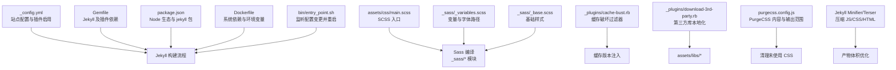
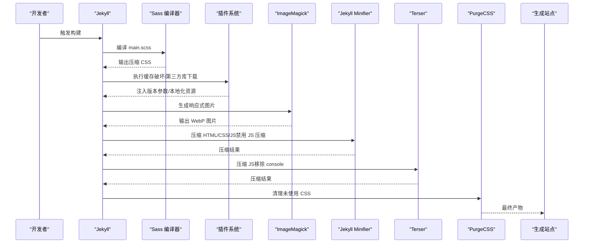
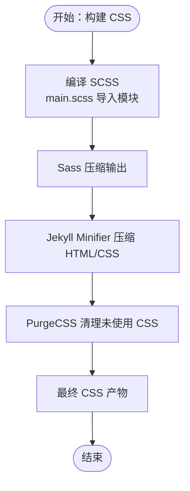
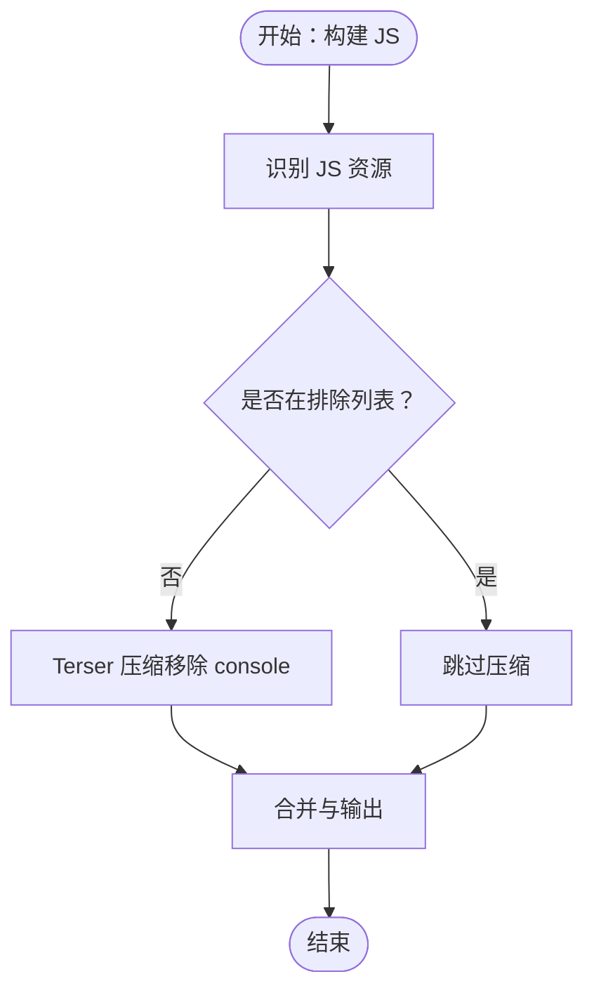
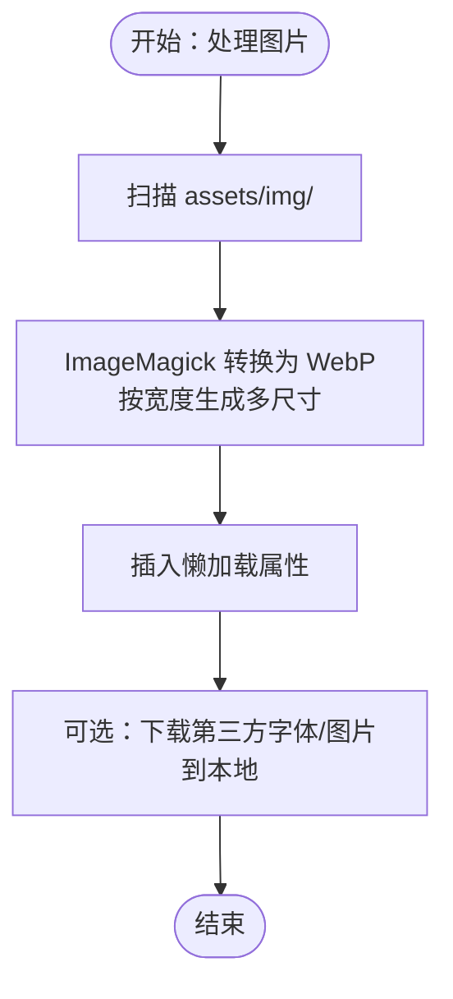
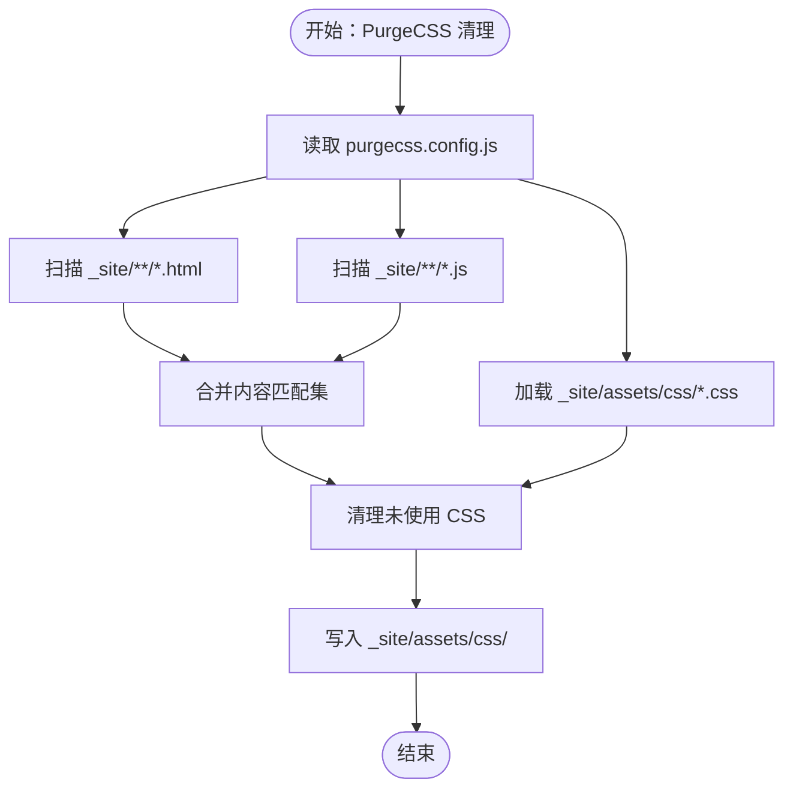
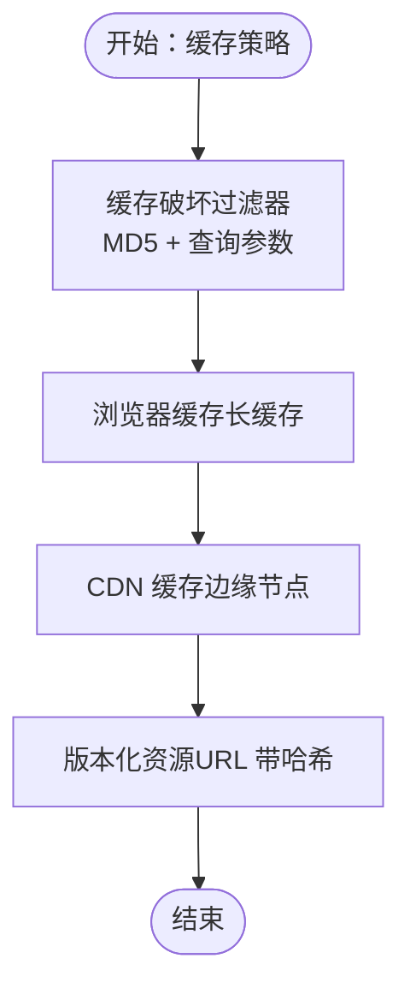
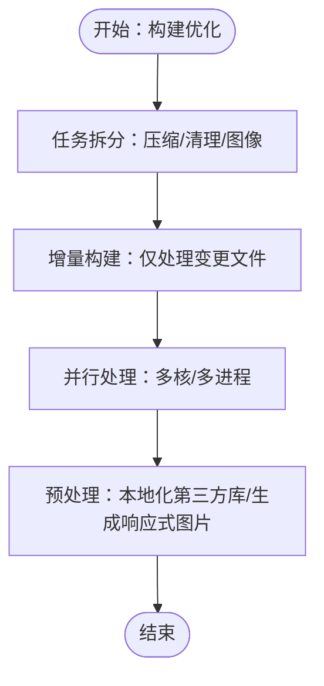
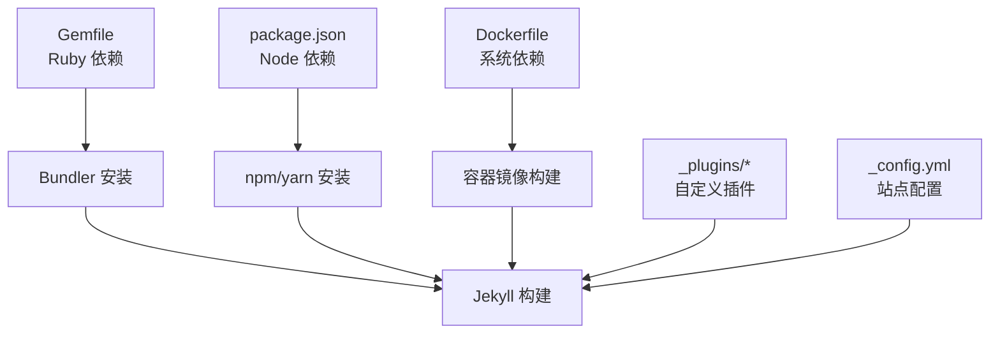

# 构建优化策略

<cite>
**本文引用的文件**
- [_config.yml](file://_config.yml)
- [Gemfile](file://Gemfile)
- [package.json](file://package.json)
- [purgecss.config.js](file://purgecss.config.js)
- [Dockerfile](file://Dockerfile)
- [bin/entry_point.sh](file://bin/entry_point.sh)
- [_plugins/cache-bust.rb](file://_plugins/cache-bust.rb)
- [_plugins/download-3rd-party.rb](file://_plugins/download-3rd-party.rb)
- [assets/css/main.scss](file://assets/css/main.scss)
- [_sass/_variables.scss](file://_sass/_variables.scss)
- [_sass/_base.scss](file://_sass/_base.scss)
</cite>

## 目录
1. [简介](#简介)
2. [项目结构](#项目结构)
3. [核心组件](#核心组件)
4. [架构总览](#架构总览)
5. [详细组件分析](#详细组件分析)
6. [依赖关系分析](#依赖关系分析)
7. [性能考量](#性能考量)
8. [故障排查指南](#故障排查指南)
9. [结论](#结论)
10. [附录](#附录)

## 简介
本文件面向 al-folio 主题在 Jekyll 环境下的构建优化策略，聚焦于资源压缩与打包优化（CSS 压缩、JavaScript 优化、图片压缩）、PurgeCSS 使用与配置、缓存策略（浏览器缓存、CDN 缓存、版本控制）、Jekyll 构建性能优化（增量构建、并行处理）、构建时间分析与性能基准测试方法，并提供可操作的配置示例与最佳实践建议。

## 项目结构
该站点采用 Jekyll + SCSS/Sass 渲染、多插件生态、容器化构建与本地开发热重载的组合方式：
- 配置层：通过站点配置文件集中管理主题、插件、第三方库、图片处理、压缩策略等。
- 资源层：SCSS 源文件组织样式模块；JavaScript 资源按需引入；静态资源位于 assets 下。
- 插件层：自定义缓存破坏过滤器、第三方库下载与本地化、图像响应式生成等。
- 构建层：Docker 容器内安装 Ruby、Bundler、Node、ImageMagick 等工具；入口脚本负责监听配置变更并重启服务。
- 压缩与清理：Jekyll Minifier、Terser、PurgeCSS 配合使用，分别负责 HTML/CSS/JS 压缩与未使用 CSS 清理。

图表来源
- [_config.yml](file://_config.yml)
- [Gemfile](file://Gemfile)
- [package.json](file://package.json)
- [assets/css/main.scss](file://assets/css/main.scss)
- [_sass/_variables.scss](file://_sass/_variables.scss)
- [_sass/_base.scss](file://_sass/_base.scss)
- [Dockerfile](file://Dockerfile)
- [bin/entry_point.sh](file://bin/entry_point.sh)
- [_plugins/cache-bust.rb](file://_plugins/cache-bust.rb)
- [_plugins/download-3rd-party.rb](file://_plugins/download-3rd-party.rb)
- [purgecss.config.js](file://purgecss.config.js)

章节来源
- [_config.yml](file://_config.yml)
- [Gemfile](file://Gemfile)
- [package.json](file://package.json)
- [Dockerfile](file://Dockerfile)
- [bin/entry_point.sh](file://bin/entry_point.sh)

## 核心组件
- 站点配置与插件
  - 启用 jekyll-minifier、jekyll-terser、jekyll-imagemagick 等插件，用于压缩与图像处理。
  - 启用 sass.style: compressed，使 SCSS 编译时输出压缩 CSS。
  - 第三方库通过配置项统一管理，支持本地化与完整性校验。
- 自定义插件
  - 缓存破坏：通过 MD5 过滤器对 CSS/文件添加查询参数，实现强缓存下的版本控制。
  - 第三方库下载：自动解析并下载外部 CSS/字体/图片到本地，减少跨域与网络波动影响。
- 压缩与清理
  - Jekyll Minifier：禁用其 JS 压缩，避免与 Terser 冲突。
  - Terser：开启 drop_console，移除生产环境日志。
  - PurgeCSS：扫描已生成站点的 HTML/JS，清理未使用的 CSS。
- 图像与响应式
  - jekyll-imagemagick：按指定宽度生成 WebP 响应式图片，结合懒加载提升首屏性能。
- 容器化与开发体验
  - Dockerfile 安装必要系统依赖；入口脚本监听配置变更并重启服务，提升迭代效率。

章节来源
- [_config.yml](file://_config.yml)
- [_plugins/cache-bust.rb](file://_plugins/cache-bust.rb)
- [_plugins/download-3rd-party.rb](file://_plugins/download-3rd-party.rb)
- [purgecss.config.js](file://purgecss.config.js)
- [Dockerfile](file://Dockerfile)
- [bin/entry_point.sh](file://bin/entry_point.sh)

## 架构总览
下图展示从配置到产出的关键流程与优化节点：

图表来源
- [_config.yml](file://_config.yml)
- [assets/css/main.scss](file://assets/css/main.scss)
- [_sass/_variables.scss](file://_sass/_variables.scss)
- [_sass/_base.scss](file://_sass/_base.scss)
- [_plugins/cache-bust.rb](file://_plugins/cache-bust.rb)
- [_plugins/download-3rd-party.rb](file://_plugins/download-3rd-party.rb)
- [purgecss.config.js](file://purgecss.config.js)

## 详细组件分析

### CSS 压缩与打包优化
- SCSS 编译压缩
  - 通过站点配置启用 sass.style: compressed，确保编译阶段即输出压缩 CSS，降低后续处理成本。
  - main.scss 统一导入主题模块，便于集中维护与按需裁剪。
- 压缩与清理
  - Jekyll Minifier：禁用其 JS 压缩，避免与 Terser 冲突；同时仍可压缩 HTML/CSS。
  - PurgeCSS：扫描已生成站点的 HTML/JS，清理未使用的 CSS，显著减小 CSS 体积。
- 资源组织
  - 字体与图标路径通过变量集中管理，便于替换与本地化。
  - 基础样式与布局样式分层，有利于按需引入与缓存复用。

图表来源
- [_config.yml](file://_config.yml)
- [assets/css/main.scss](file://assets/css/main.scss)
- [_sass/_variables.scss](file://_sass/_variables.scss)
- [_sass/_base.scss](file://_sass/_base.scss)
- [purgecss.config.js](file://purgecss.config.js)

章节来源
- [_config.yml](file://_config.yml)
- [assets/css/main.scss](file://assets/css/main.scss)
- [_sass/_variables.scss](file://_sass/_variables.scss)
- [_sass/_base.scss](file://_sass/_base.scss)
- [purgecss.config.js](file://purgecss.config.js)

### JavaScript 优化
- 压缩策略
  - 禁用 Jekyll Minifier 的 JS 压缩，改由 jekyll-terser 处理，确保更可控的压缩行为。
  - Terser 配置中启用 drop_console，移除生产环境日志，减小体积并提升安全性。
- 排除策略
  - 在配置中明确排除特定文件（如搜索模块），避免对动态内容进行不必要的压缩。

图表来源
- [_config.yml](file://_config.yml)

章节来源
- [_config.yml](file://_config.yml)

### 图片压缩与响应式
- 响应式图片
  - 启用 jekyll-imagemagick，按指定宽度生成多尺寸 WebP 图片，结合懒加载提升首屏性能。
  - 支持输入目录与格式白名单，确保只处理目标图片类型。
- 本地化与完整性
  - 第三方库下载插件可将远程字体/图片下载至本地，减少跨域与网络波动影响，并可配合完整性校验。

图表来源
- [_config.yml](file://_config.yml)
- [_plugins/download-3rd-party.rb](file://_plugins/download-3rd-party.rb)

章节来源
- [_config.yml](file://_config.yml)
- [_plugins/download-3rd-party.rb](file://_plugins/download-3rd-party.rb)

### PurgeCSS 配置与使用
- 配置要点
  - content：扫描已生成站点的 HTML/JS，确保命中真实渲染产物。
  - css：指定待清理的 CSS 路径，通常为生成后的 CSS 目录。
  - output：输出目录与 content 保持一致，便于后续缓存与版本控制。
  - skippedContentGlobs：排除某些内容（如 assets 子目录）以避免误删。
- 使用流程
  - 在 Jekyll 构建完成后执行 PurgeCSS，清理未使用的样式规则，显著降低 CSS 体积。

图表来源
- [purgecss.config.js](file://purgecss.config.js)

章节来源
- [purgecss.config.js](file://purgecss.config.js)

### 缓存策略（浏览器缓存、CDN 缓存、版本控制）
- 版本控制（缓存破坏）
  - 通过自定义缓存破坏过滤器，基于文件内容计算 MD5 并附加到资源 URL，实现强缓存下的“版本控制”。
  - 支持单文件与目录级（如 SCSS 源）两种模式，便于按需失效。
- 浏览器缓存
  - 静态资源建议设置长缓存（如一年），结合版本参数实现更新。
- CDN 缓存
  - 将生成的静态资源部署至 CDN，利用边缘节点加速与缓存策略进一步提升访问速度。
- 第三方库本地化
  - 插件可将远程 CSS/字体/图片下载到本地，减少跨域与网络波动影响，同时便于统一缓存策略。

图表来源
- [_plugins/cache-bust.rb](file://_plugins/cache-bust.rb)
- [_plugins/download-3rd-party.rb](file://_plugins/download-3rd-party.rb)
- [_config.yml](file://_config.yml)

章节来源
- [_plugins/cache-bust.rb](file://_plugins/cache-bust.rb)
- [_plugins/download-3rd-party.rb](file://_plugins/download-3rd-party.rb)
- [_config.yml](file://_config.yml)

### Jekyll 构建性能优化
- 插件与任务分离
  - 将压缩与清理任务拆分到不同插件（Minifier、Terser、PurgeCSS），避免重复处理与冲突。
- 增量构建与并行处理
  - 利用容器化环境与入口脚本监听配置变更，快速重启服务，缩短反馈周期。
  - 在 CI 中启用并行安装与构建步骤，充分利用多核资源。
- 资源预处理
  - 提前将第三方库本地化，减少构建期网络请求与不确定性。
  - 使用 ImageMagick 生成响应式图片，降低运行时计算开销。

图表来源
- [_config.yml](file://_config.yml)
- [Dockerfile](file://Dockerfile)
- [bin/entry_point.sh](file://bin/entry_point.sh)
- [_plugins/download-3rd-party.rb](file://_plugins/download-3rd-party.rb)

章节来源
- [_config.yml](file://_config.yml)
- [Dockerfile](file://Dockerfile)
- [bin/entry_point.sh](file://bin/entry_point.sh)
- [_plugins/download-3rd-party.rb](file://_plugins/download-3rd-party.rb)

## 依赖关系分析
- Ruby 与 Bundler
  - Gemfile 声明 Jekyll 与核心插件组，确保构建环境一致性。
- Node 与包管理
  - package.json 引入 jekyll 包与 Prettier 插件，便于前端资源与模板格式化。
- 容器化依赖
  - Dockerfile 安装 ImageMagick、Python、Node 等工具，满足图像处理与本地化需求。
- 插件耦合
  - 缓存破坏与第三方库下载插件与站点配置紧密耦合，需同步调整以保证一致性。

图表来源
- [Gemfile](file://Gemfile)
- [package.json](file://package.json)
- [Dockerfile](file://Dockerfile)
- [_plugins/cache-bust.rb](file://_plugins/cache-bust.rb)
- [_plugins/download-3rd-party.rb](file://_plugins/download-3rd-party.rb)
- [_config.yml](file://_config.yml)

章节来源
- [Gemfile](file://Gemfile)
- [package.json](file://package.json)
- [Dockerfile](file://Dockerfile)
- [_plugins/cache-bust.rb](file://_plugins/cache-bust.rb)
- [_plugins/download-3rd-party.rb](file://_plugins/download-3rd-party.rb)
- [_config.yml](file://_config.yml)

## 性能考量
- 构建时间分析
  - 记录各阶段耗时：Sass 编译、图像处理、压缩、清理、输出写入。
  - 对比启用/禁用压缩与清理的差异，评估收益与成本。
- 基准测试方法
  - 固定输入与硬件环境，多次运行构建并统计平均值与标准差。
  - 分别测试不同插件组合与资源规模，定位瓶颈。
- 优化建议
  - 合理拆分任务，避免重复扫描与转换。
  - 使用本地化第三方库与响应式图片，减少网络与计算开销。
  - 结合缓存破坏与 CDN，最大化静态资源复用效率。

## 故障排查指南
- 构建权限问题
  - 容器内权限不足可能导致缓存目录创建失败。可通过调整工作目录或用户权限解决。
- 插件冲突
  - 若同时启用 Jekyll Minifier 的 JS 压缩与 Terser，可能出现重复压缩或冲突。应遵循现有配置，仅保留一种 JS 压缩方案。
- 图像处理失败
  - ImageMagick 未正确安装或路径不匹配会导致图像生成失败。检查系统依赖与输入格式白名单。
- 配置变更未生效
  - 开发服务器通过入口脚本监听配置文件变更并重启。若未生效，检查脚本权限与 inotify 工具可用性。

章节来源
- [Dockerfile](file://Dockerfile)
- [_config.yml](file://_config.yml)
- [bin/entry_point.sh](file://bin/entry_point.sh)

## 结论
通过合理配置 Jekyll 插件链、启用 Sass 压缩、使用 PurgeCSS 清理未使用样式、结合缓存破坏与第三方库本地化，以及容器化与增量构建策略，可显著优化 al-folio 的构建性能与产物体积。建议在 CI 中固化基准测试流程，持续监控构建时间与产物大小，以数据驱动优化迭代。

## 附录
- 配置示例路径
  - 站点配置与插件启用：[_config.yml](file://_config.yml)
  - Ruby 依赖声明：[Gemfile](file://Gemfile)
  - Node 依赖声明：[package.json](file://package.json)
  - PurgeCSS 配置：[purgecss.config.js](file://purgecss.config.js)
  - 容器化构建：[Dockerfile](file://Dockerfile)
  - 开发入口脚本：[bin/entry_point.sh](file://bin/entry_point.sh)
  - 缓存破坏过滤器：[_plugins/cache-bust.rb](file://_plugins/cache-bust.rb)
  - 第三方库下载插件：[_plugins/download-3rd-party.rb](file://_plugins/download-3rd-party.rb)
  - SCSS 入口与模块：[assets/css/main.scss](file://assets/css/main.scss)，[_sass/_variables.scss](file://_sass/_variables.scss)，[_sass/_base.scss](file://_sass/_base.scss)