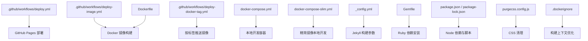
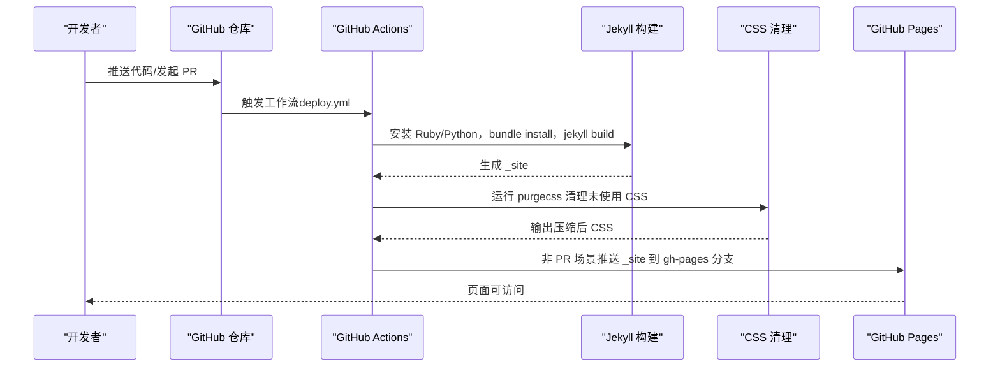
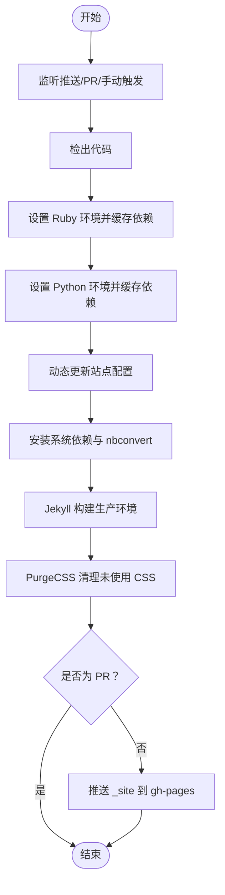
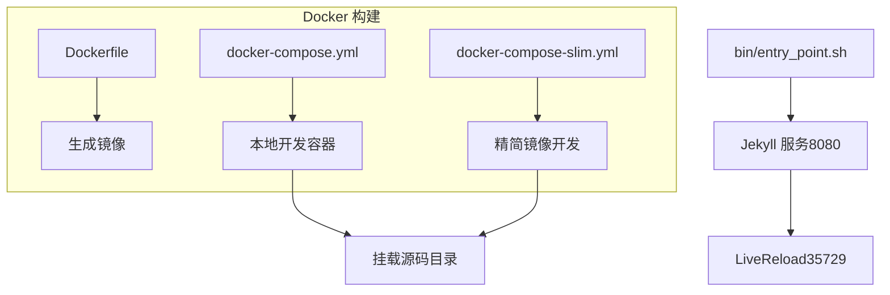
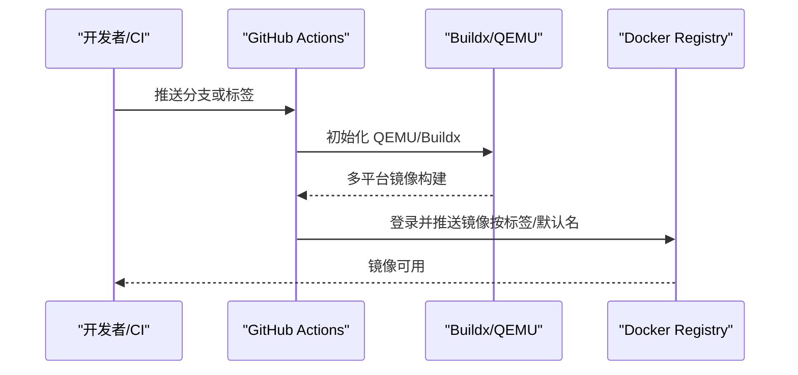
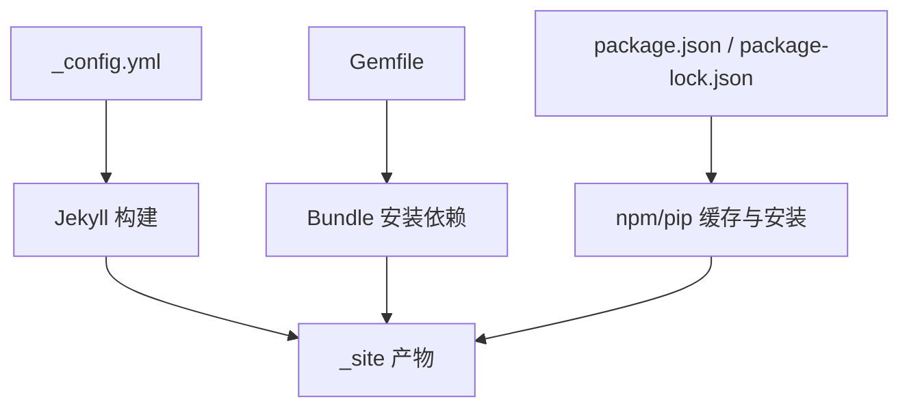
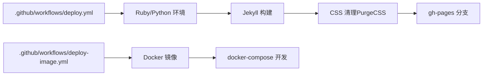

# 自动化部署流程

<cite>
**本文引用的文件**
- [.github/workflows/deploy.yml](file://.github/workflows/deploy.yml)
- [.github/workflows/deploy-docker-tag.yml](file://.github/workflows/deploy-docker-tag.yml)
- [.github/workflows/deploy-image.yml](file://.github/workflows/deploy-image.yml)
- [Dockerfile](file://Dockerfile)
- [docker-compose.yml](file://docker-compose.yml)
- [docker-compose-slim.yml](file://docker-compose-slim.yml)
- [bin/entry_point.sh](file://bin/entry_point.sh)
- [_config.yml](file://_config.yml)
- [Gemfile](file://Gemfile)
- [package.json](file://package.json)
- [package-lock.json](file://package-lock.json)
- [purgecss.config.js](file://purgecss.config.js)
- [.dockerignore](file://.dockerignore)
- [INSTALL.md](file://INSTALL.md)
- [.github/release.yml](file://.github/release.yml)
</cite>

## 目录
1. [简介](#简介)
2. [项目结构](#项目结构)
3. [核心组件](#核心组件)
4. [架构总览](#架构总览)
5. [详细组件分析](#详细组件分析)
6. [依赖关系分析](#依赖关系分析)
7. [性能考虑](#性能考虑)
8. [故障排除指南](#故障排除指南)
9. [结论](#结论)
10. [附录](#附录)

## 简介
本文件系统性梳理 al-folio 在该仓库中的自动化部署方案，覆盖以下方面：
- GitHub Actions 工作流：触发条件、执行步骤、权限与环境变量
- GitHub Pages 自动部署：从代码提交到页面发布的全流程
- Docker 部署：镜像构建、标签管理、容器化本地开发与部署
- 多环境策略：开发、测试、生产的差异化配置
- 权限与安全：工作流权限、密钥使用与最小权限原则
- 故障排除与回滚：常见问题定位与回退策略

## 项目结构
与自动化部署直接相关的目录与文件：
- .github/workflows：定义 GitHub Actions 工作流（站点部署、Docker 构建与发布）
- Dockerfile、docker-compose.yml、docker-compose-slim.yml、bin/entry_point.sh：Docker 容器化与本地开发
- _config.yml、Gemfile、package.json、package-lock.json：站点构建与依赖
- purgecss.config.js：产物 CSS 清理配置
- .dockerignore：Docker 构建时忽略的文件
- INSTALL.md：启用自动部署与手动部署说明
- .github/release.yml：发布变更日志分类规则

图表来源
- [.github/workflows/deploy.yml:1-106](file://.github/workflows/deploy.yml#L1-L106)
- [.github/workflows/deploy-image.yml:1-45](file://.github/workflows/deploy-image.yml#L1-L45)
- [.github/workflows/deploy-docker-tag.yml:1-51](file://.github/workflows/deploy-docker-tag.yml#L1-L51)
- [Dockerfile:1-77](file://Dockerfile#L1-L77)
- [docker-compose.yml:1-22](file://docker-compose.yml#L1-L22)
- [docker-compose-slim.yml:1-13](file://docker-compose-slim.yml#L1-L13)
- [_config.yml:1-646](file://_config.yml#L1-L646)
- [Gemfile:1-39](file://Gemfile#L1-L39)
- [package.json:1-10](file://package.json#L1-L10)
- [package-lock.json:1-111](file://package-lock.json#L1-L111)
- [purgecss.config.js:1-7](file://purgecss.config.js#L1-L7)
- [.dockerignore:1-4](file://.dockerignore#L1-L4)

章节来源
- [.github/workflows/deploy.yml:1-106](file://.github/workflows/deploy.yml#L1-L106)
- [Dockerfile:1-77](file://Dockerfile#L1-L77)
- [docker-compose.yml:1-22](file://docker-compose.yml#L1-L22)
- [docker-compose-slim.yml:1-13](file://docker-compose-slim.yml#L1-L13)
- [_config.yml:1-646](file://_config.yml#L1-L646)
- [Gemfile:1-39](file://Gemfile#L1-L39)
- [package.json:1-10](file://package.json#L1-L10)
- [package-lock.json:1-111](file://package-lock.json#L1-L111)
- [purgecss.config.js:1-7](file://purgecss.config.js#L1-L7)
- [.dockerignore:1-4](file://.dockerignore#L1-L4)
- [INSTALL.md:149-223](file://INSTALL.md#L149-L223)
- [.github/release.yml:1-15](file://.github/release.yml#L1-L15)

## 核心组件
- GitHub Pages 自动部署工作流：监听主分支与 PR 变更，执行 Ruby/Python 环境准备、Jekyll 构建、CSS 清理，并在非 PR 场景下将构建产物推送到 gh-pages 分支
- Docker 镜像构建工作流：支持多平台（amd64/arm64）构建与推送，按标签或主分支触发
- 本地开发容器：通过 docker-compose 使用预构建镜像或自构建镜像，挂载源码目录实现热更新
- 构建配置：Jekyll 站点配置、Ruby 依赖、Node 依赖、CSS 清理策略

章节来源
- [.github/workflows/deploy.yml:1-106](file://.github/workflows/deploy.yml#L1-L106)
- [.github/workflows/deploy-image.yml:1-45](file://.github/workflows/deploy-image.yml#L1-L45)
- [.github/workflows/deploy-docker-tag.yml:1-51](file://.github/workflows/deploy-docker-tag.yml#L1-L51)
- [docker-compose.yml:1-22](file://docker-compose.yml#L1-L22)
- [docker-compose-slim.yml:1-13](file://docker-compose-slim.yml#L1-L13)
- [_config.yml:1-646](file://_config.yml#L1-L646)
- [Gemfile:1-39](file://Gemfile#L1-L39)
- [package.json:1-10](file://package.json#L1-L10)
- [package-lock.json:1-111](file://package-lock.json#L1-L111)
- [purgecss.config.js:1-7](file://purgecss.config.js#L1-L7)

## 架构总览
整体部署链路分为两条主线：
- GitHub Actions 主线：在云端运行，完成站点构建与发布到 GitHub Pages
- Docker 主线：在本地或 CI 中构建镜像，用于本地开发或替代云端构建

图表来源
- [.github/workflows/deploy.yml:1-106](file://.github/workflows/deploy.yml#L1-L106)
- [purgecss.config.js:1-7](file://purgecss.config.js#L1-L7)

## 详细组件分析

### GitHub Actions 部署工作流（deploy.yml）
- 触发条件
  - 推送至主分支（master/main），限定部分路径以减少不必要触发
  - 针对主分支的 Pull Request，同样限定路径
  - 手动触发（workflow_dispatch）
- 权限
  - 赋予内容写入权限，以便向 gh-pages 分支推送
- 关键步骤
  - 检出代码
  - 设置 Ruby 环境并缓存 Bundler 依赖
  - 设置 Python 环境并缓存 pip 依赖
  - 动态更新站点配置（如 giscus.repo）
  - 安装系统依赖（如 imagemagick），升级 nbconvert
  - 设置生产环境变量并执行 Jekyll 构建
  - 全局安装 purgecss 并清理未使用 CSS
  - 非 PR 场景使用官方 GitHub Pages 部署 Action 将 _site 发布到 gh-pages 分支

图表来源
- [.github/workflows/deploy.yml:1-106](file://.github/workflows/deploy.yml#L1-L106)
- [purgecss.config.js:1-7](file://purgecss.config.js#L1-L7)

章节来源
- [.github/workflows/deploy.yml:1-106](file://.github/workflows/deploy.yml#L1-L106)
- [INSTALL.md:149-223](file://INSTALL.md#L149-L223)

### Docker 部署与本地开发
- Dockerfile
  - 基于 Ruby slim 镜像，安装系统依赖（build-essential、curl、git、imagemagick、nodejs、python3-pip 等）
  - 设置语言与 Jekyll 环境变量（生产模式）
  - 安装 Jekyll 与 Bundler，拷贝入口脚本
  - 暴露端口 8080（Jekyll 服务）、35729（LiveReload）
- docker-compose.yml
  - 默认使用预构建镜像，同时支持本地构建
  - 映射 8080/35729 端口，挂载当前目录到 /srv/jekyll
  - 开发环境变量（JEKYLL_ENV=development）
- docker-compose-slim.yml
  - 使用精简镜像（slim）进行本地开发
- bin/entry_point.sh
  - 启动 Jekyll 服务（端口 8080，主机 0.0.0.0，开启 LiveReload）
  - 监控 _config.yml 变化并自动重启服务
  - 处理 Gemfile.lock 的 Git 状态（跟踪/未跟踪）逻辑

图表来源
- [Dockerfile:1-77](file://Dockerfile#L1-L77)
- [docker-compose.yml:1-22](file://docker-compose.yml#L1-L22)
- [docker-compose-slim.yml:1-13](file://docker-compose-slim.yml#L1-L13)
- [bin/entry_point.sh:1-38](file://bin/entry_point.sh#L1-L38)

章节来源
- [Dockerfile:1-77](file://Dockerfile#L1-L77)
- [docker-compose.yml:1-22](file://docker-compose.yml#L1-L22)
- [docker-compose-slim.yml:1-13](file://docker-compose-slim.yml#L1-L13)
- [bin/entry_point.sh:1-38](file://bin/entry_point.sh#L1-L38)

### Docker 镜像构建与标签管理
- deploy-image.yml
  - 仅在 alshedivat 组织拥有者身份触发
  - 使用 QEMU 与 Buildx 支持多平台（amd64/arm64）
  - 登录 Docker Registry，推送默认镜像名
- deploy-docker-tag.yml
  - 当推送以 v 开头的标签时触发
  - 自动生成镜像标签与元数据，登录后推送对应标签
- .dockerignore
  - 忽略 _site、.git、assets 等，减少构建上下文体积

图表来源
- [.github/workflows/deploy-image.yml:1-45](file://.github/workflows/deploy-image.yml#L1-L45)
- [.github/workflows/deploy-docker-tag.yml:1-51](file://.github/workflows/deploy-docker-tag.yml#L1-L51)
- [.dockerignore:1-4](file://.dockerignore#L1-L4)

章节来源
- [.github/workflows/deploy-image.yml:1-45](file://.github/workflows/deploy-image.yml#L1-L45)
- [.github/workflows/deploy-docker-tag.yml:1-51](file://.github/workflows/deploy-docker-tag.yml#L1-L51)
- [.dockerignore:1-4](file://.dockerignore#L1-L4)

### 站点构建与依赖
- _config.yml
  - 站点基础信息、URL、主题与布局、插件列表、分析与验证配置、集合与归档、压缩与最小化策略等
- Gemfile
  - Jekyll 核心与插件组定义，含 jekyll-terser 特定来源
- package.json / package-lock.json
  - Node 生态工具与格式化插件，确保 CI 与本地一致性

图表来源
- [_config.yml:1-646](file://_config.yml#L1-L646)
- [Gemfile:1-39](file://Gemfile#L1-L39)
- [package.json:1-10](file://package.json#L1-L10)
- [package-lock.json:1-111](file://package-lock.json#L1-L111)

章节来源
- [_config.yml:1-646](file://_config.yml#L1-L646)
- [Gemfile:1-39](file://Gemfile#L1-L39)
- [package.json:1-10](file://package.json#L1-L10)
- [package-lock.json:1-111](file://package-lock.json#L1-L111)

## 依赖关系分析
- 工作流耦合
  - deploy.yml 依赖 Ruby/Python 环境与 Jekyll 插件生态
  - Docker 工作流独立于云端环境，适合离线或自托管场景
- 构建产物
  - _site 作为 GitHub Pages 的发布源；本地开发通过容器内 Jekyll 服务实时预览
- 依赖链
  - Ruby 插件（Jekyll 生态）与 Node 工具（PurgeCSS、nbconvert）共同决定构建质量与速度

图表来源
- [.github/workflows/deploy.yml:1-106](file://.github/workflows/deploy.yml#L1-L106)
- [.github/workflows/deploy-image.yml:1-45](file://.github/workflows/deploy-image.yml#L1-L45)
- [purgecss.config.js:1-7](file://purgecss.config.js#L1-L7)

章节来源
- [.github/workflows/deploy.yml:1-106](file://.github/workflows/deploy.yml#L1-L106)
- [.github/workflows/deploy-image.yml:1-45](file://.github/workflows/deploy-image.yml#L1-L45)
- [purgecss.config.js:1-7](file://purgecss.config.js#L1-L7)

## 性能考虑
- 构建缓存
  - Ruby Bundler 与 Python pip 缓存显著降低重复构建时间
- 依赖裁剪
  - PurgeCSS 清理未使用 CSS，减小产物体积
- 多平台构建
  - Buildx + QEMU 支持跨架构镜像，便于分发与本地加速
- 构建上下文
  - .dockerignore 限制无关文件进入镜像层，缩短构建时间

章节来源
- [.github/workflows/deploy.yml:74-100](file://.github/workflows/deploy.yml#L74-L100)
- [purgecss.config.js:1-7](file://purgecss.config.js#L1-L7)
- [.dockerignore:1-4](file://.dockerignore#L1-L4)

## 故障排除指南
- GitHub Pages 部署未生效
  - 确认工作流已授予“读写权限”，并已在仓库设置中选择 gh-pages 作为页面发布源
  - 检查工作流日志中是否执行了部署步骤（非 PR 场景才会推送）
- 构建失败（Ruby/Python 依赖）
  - 确保 Gemfile 与 Gemfile.lock 一致；若使用 Docker，确认镜像内依赖安装成功
- CSS 未清理或样式异常
  - 检查 purgecss 配置与 _site 输出路径是否匹配
- Docker 构建权限问题
  - 若出现权限错误，参考 Dockerfile 注释与 docker-compose 参数调整用户/组 ID
- 回滚策略
  - GitHub Pages：保留 gh-pages 分支历史，必要时切换到上一个稳定提交
  - Docker：使用特定镜像标签回退，避免使用 latest

章节来源
- [.github/workflows/deploy.yml:64-106](file://.github/workflows/deploy.yml#L64-L106)
- [INSTALL.md:149-223](file://INSTALL.md#L149-L223)
- [Dockerfile:1-77](file://Dockerfile#L1-L77)
- [docker-compose.yml:1-22](file://docker-compose.yml#L1-L22)
- [purgecss.config.js:1-7](file://purgecss.config.js#L1-L7)

## 结论
该部署体系结合 GitHub Actions 与 Docker，既保证云端一键发布（GitHub Pages），又提供本地可复现的容器化开发体验。通过明确的触发条件、权限控制与清理策略，能够稳定地支撑个人学术网站的持续交付。

## 附录
- 多环境建议
  - 开发：docker-compose 本地开发，JEKYLL_ENV=development
  - 测试：在 CI 中运行与生产相同的构建步骤，但不推送页面
  - 生产：主分支触发 deploy.yml，发布到 gh-pages
- 安全与权限
  - 仅授予工作流必要的内容写入权限
  - Docker 推送使用受控的 Secrets（用户名/密码）
- 发布与变更记录
  - release.yml 定义变更日志分类，便于版本发布

章节来源
- [.github/release.yml:1-15](file://.github/release.yml#L1-L15)
- [.github/workflows/deploy.yml:64-106](file://.github/workflows/deploy.yml#L64-L106)
- [.github/workflows/deploy-image.yml:18-44](file://.github/workflows/deploy-image.yml#L18-L44)
- [.github/workflows/deploy-docker-tag.yml:17-50](file://.github/workflows/deploy-docker-tag.yml#L17-L50)