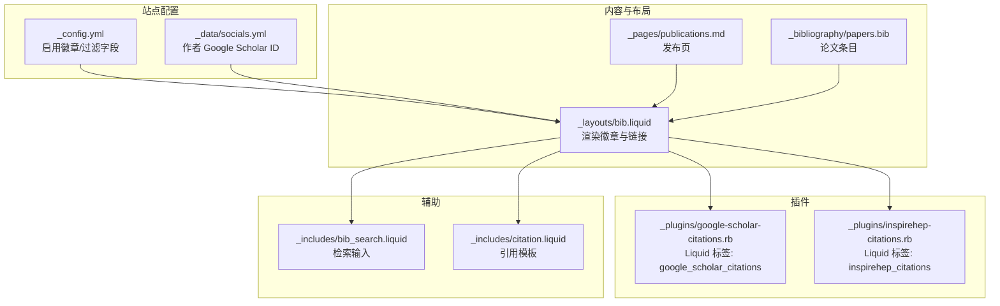
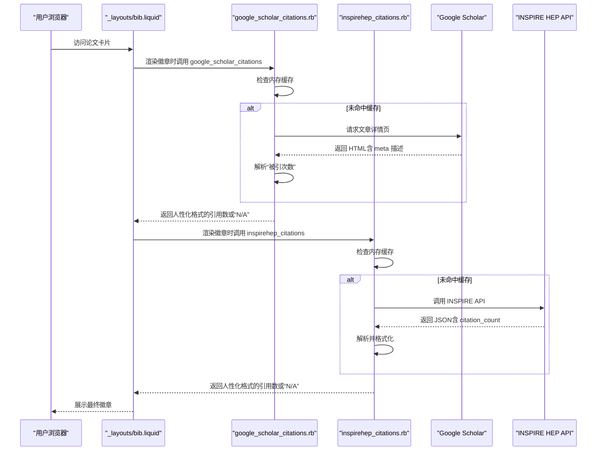
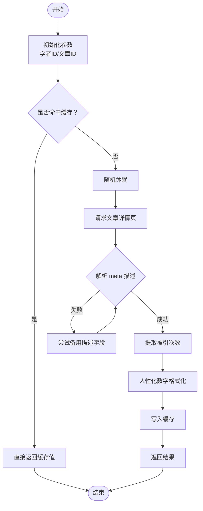
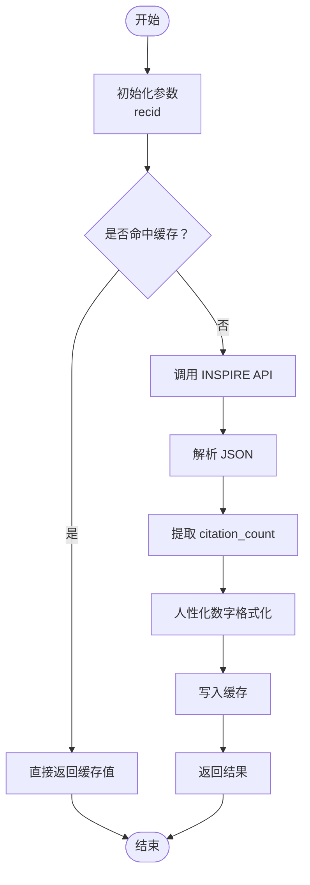
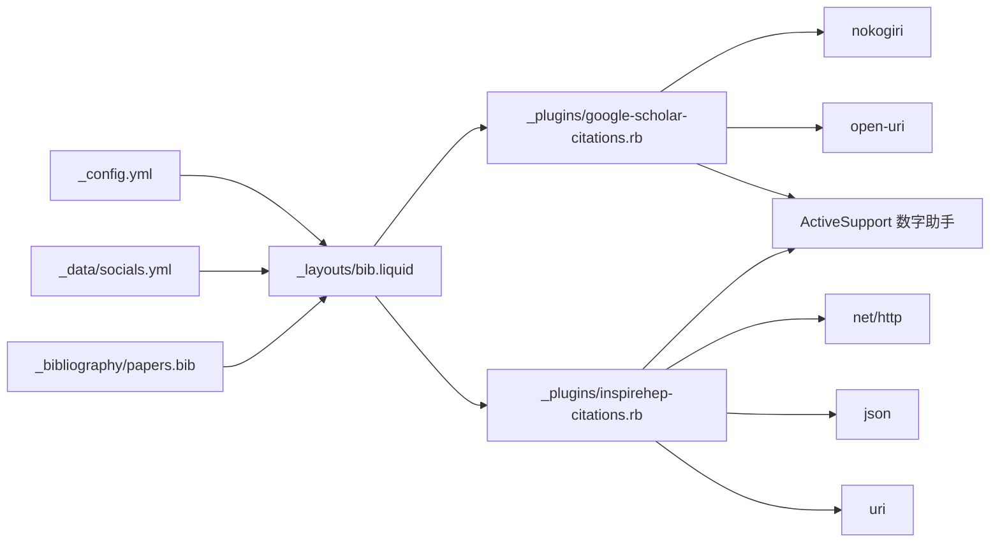

# 学术服务集成

<cite>
**本文引用的文件**   
- [_plugins/google-scholar-citations.rb](file://_plugins/google-scholar-citations.rb)
- [_plugins/inspirehep-citations.rb](file://_plugins/inspirehep-citations.rb)
- [_layouts/bib.liquid](file://_layouts/bib.liquid)
- [_data/socials.yml](file://_data/socials.yml)
- [_config.yml](file://_config.yml)
- [_posts/2024-04-28-post-citation.md](file://_posts/2024-04-28-post-citation.md)
- [_posts/2024-04-29-typograms.md](file://_posts/2024-04-29-typograms.md)
- [_pages/publications.md](file://_pages/publications.md)
- [_includes/bib_search.liquid](file://_includes/bib_search.liquid)
- [_includes/citation.liquid](file://_includes/citation.liquid)
- [Gemfile](file://Gemfile)
- [_bibliography/papers.bib](file://_bibliography/papers.bib)
</cite>

## 目录
1. [简介](#简介)
2. [项目结构](#项目结构)
3. [核心组件](#核心组件)
4. [架构总览](#架构总览)
5. [详细组件分析](#详细组件分析)
6. [依赖关系分析](#依赖关系分析)
7. [性能考量](#性能考量)
8. [故障排除指南](#故障排除指南)
9. [结论](#结论)
10. [附录](#附录)

## 简介
本文件系统性梳理该 Jekyll 博客中“学术服务集成插件”的实现与使用，重点覆盖两类引用统计能力：
- Google Scholar 引用计数：通过抓取 Google Scholar 文章详情页的元信息提取“被引次数”，并进行人性化数字格式化展示。
- INSPIRE HEP 引用计数：通过调用 INSPIRE HEP 的公开 API 获取文献的 citation_count 字段，并进行人性化数字格式化展示。

同时，文档说明了：
- 如何在站点配置中启用与展示这些引用徽章（Badges）。
- 如何在 BibTeX 条目中为每篇论文配置对应的 Google Scholar 或 INSPIRE HEP 标识符。
- 如何利用缓存与延迟策略降低请求频率与被限流风险。
- 如何处理 API 限制、速率限制与错误重试逻辑。
- 数据格式转换、本地存储与性能优化策略。
- 扩展支持其他学术数据库与 API 服务的方法。
- 数据同步与一致性保障的实现方案。

## 项目结构
围绕学术服务集成的关键文件与目录如下：
- 插件层：_plugins/google-scholar-citations.rb、_plugins/inspirehep-citations.rb
- 布局层：_layouts/bib.liquid（在论文卡片中渲染徽章）
- 配置层：_config.yml（启用徽章、过滤字段等）、_data/socials.yml（作者 Google Scholar ID）
- 内容层：_pages/publications.md（发布页面）、_bibliography/papers.bib（论文条目）
- 辅助与工具：_includes/bib_search.liquid（检索入口）、_includes/citation.liquid（引用模板）、Gemfile（依赖声明）

图表来源
- [_layouts/bib.liquid](file://_layouts/bib.liquid)
- [_plugins/google-scholar-citations.rb](file://_plugins/google-scholar-citations.rb)
- [_plugins/inspirehep-citations.rb](file://_plugins/inspirehep-citations.rb)
- [_config.yml](file://_config.yml)
- [_data/socials.yml](file://_data/socials.yml)
- [_pages/publications.md](file://_pages/publications.md)
- [_includes/bib_search.liquid](file://_includes/bib_search.liquid)
- [_includes/citation.liquid](file://_includes/citation.liquid)

章节来源
- [_layouts/bib.liquid](file://_layouts/bib.liquid)
- [_plugins/google-scholar-citations.rb](file://_plugins/google-scholar-citations.rb)
- [_plugins/inspirehep-citations.rb](file://_plugins/inspirehep-citations.rb)
- [_config.yml](file://_config.yml)
- [_data/socials.yml](file://_data/socials.yml)
- [_pages/publications.md](file://_pages/publications.md)
- [_includes/bib_search.liquid](file://_includes/bib_search.liquid)
- [_includes/citation.liquid](file://_includes/citation.liquid)

## 核心组件
- Google Scholar 引用统计插件（Liquid 标签）
  - 功能：根据文章的 Google Scholar 用户 ID 与条目 ID，构造详情页 URL，抓取页面元信息中的“被引次数”，并进行人性化数字格式化。
  - 关键点：内置内存级缓存（类变量），随机睡眠以降低被封禁风险；异常捕获返回“N/A”。
- INSPIRE HEP 引用统计插件（Liquid 标签）
  - 功能：根据 INSPIRE HEP 的 recid 查询 API，解析 JSON 中的 citation_count 字段，进行人性化数字格式化。
  - 关键点：内置内存级缓存（类变量）；异常捕获返回“N/A”。

章节来源
- [_plugins/google-scholar-citations.rb](file://_plugins/google-scholar-citations.rb)
- [_plugins/inspirehep-citations.rb](file://_plugins/inspirehep-citations.rb)

## 架构总览
下图展示了从论文条目到徽章渲染的整体流程，以及两类学术服务插件的调用路径。

图表来源
- [_layouts/bib.liquid](file://_layouts/bib.liquid)
- [_plugins/google-scholar-citations.rb](file://_plugins/google-scholar-citations.rb)
- [_plugins/inspirehep-citations.rb](file://_plugins/inspirehep-citations.rb)

## 详细组件分析

### Google Scholar 引用统计插件
- 实现要点
  - 初始化参数：接收 Liquid 模板传入的“学者 ID”和“文章 ID”。
  - 缓存策略：使用类变量字典缓存已查询过的文章 ID 对应的引用数，避免重复请求。
  - 请求与解析：构造文章详情页 URL，使用 HTTP 客户端获取页面，优先从 meta[name="description"] 或 meta[property="og:description"] 提取“被引次数”文本并解析数字。
  - 数字格式化：使用数字助手将大数转换为 K/M/B 的可读形式。
  - 错误处理：捕获异常并输出错误日志，返回“N/A”。
  - 防封策略：在每次请求前随机休眠一段时间，降低触发反爬虫机制的风险。
- 使用位置
  - 在论文卡片布局中，当启用 Google Scholar 徽章时，会调用该标签生成徽章图片的 alt 与 src 中的引用数。

图表来源
- [_plugins/google-scholar-citations.rb](file://_plugins/google-scholar-citations.rb)

章节来源
- [_plugins/google-scholar-citations.rb](file://_plugins/google-scholar-citations.rb)
- [_layouts/bib.liquid](file://_layouts/bib.liquid)

### INSPIRE HEP 引用统计插件
- 实现要点
  - 初始化参数：接收 Liquid 模板传入的 INSPIRE HEP 记录 ID（recid）。
  - 缓存策略：使用类变量字典缓存已查询过的 recid 对应的引用数。
  - 请求与解析：构造 API 查询 URL，GET 请求后解析 JSON，提取 metadata.citation_count。
  - 数字格式化：使用数字助手进行人性化格式化。
  - 错误处理：捕获异常并输出错误日志，返回“N/A”。

图表来源
- [_plugins/inspirehep-citations.rb](file://_plugins/inspirehep-citations.rb)

章节来源
- [_plugins/inspirehep-citations.rb](file://_plugins/inspirehep-citations.rb)
- [_layouts/bib.liquid](file://_layouts/bib.liquid)

### 论文卡片布局与徽章渲染
- 启用与控制
  - 在站点配置中开启对应徽章开关，即可在论文卡片中显示 Google Scholar 与 INSPIRE HEP 的引用徽章。
  - 作者的 Google Scholar 用户 ID 来自社交数据文件，用于构造 Scholar 详情页链接与徽章图片链接。
- 条目标识符
  - Google Scholar：需要在 BibTeX 条目中设置 google_scholar_id。
  - INSPIRE HEP：需要在 BibTeX 条目中设置 inspirehep_id。
- 过滤字段
  - 配置中定义了若干内部关键字，构建时会自动过滤，避免泄露内部信息。

章节来源
- [_layouts/bib.liquid](file://_layouts/bib.liquid)
- [_config.yml](file://_config.yml)
- [_data/socials.yml](file://_data/socials.yml)

### 配置与数据文件
- 站点配置（_config.yml）
  - 启用徽章：enable_publication_badges.google_scholar 与 enable_publication_badges.inspirehep。
  - 过滤字段：filtered_bibtex_keywords 列表，确保内部关键字不外显。
  - Jekyll Scholar：源目录、BibTeX 文件、分组排序等。
- 社交数据（_data/socials.yml）
  - 包含作者的 Google Scholar 用户 ID，用于构造 Scholar 详情页链接与徽章链接。
- 论文条目（_bibliography/papers.bib）
  - 每篇论文的 google_scholar_id 与 inspirehep_id 字段用于驱动徽章渲染。
- 发布页面（_pages/publications.md）
  - 加载论文列表，配合布局与插件渲染徽章。
- 检索与引用模板（_includes/bib_search.liquid、_includes/citation.liquid）
  - 提供论文检索输入框与引用模板，便于读者复制引用信息。

章节来源
- [_config.yml](file://_config.yml)
- [_data/socials.yml](file://_data/socials.yml)
- [_bibliography/papers.bib](file://_bibliography/papers.bib)
- [_pages/publications.md](file://_pages/publications.md)
- [_includes/bib_search.liquid](file://_includes/bib_search.liquid)
- [_includes/citation.liquid](file://_includes/citation.liquid)

## 依赖关系分析
- 插件依赖
  - Ruby 标准库：open-uri、net/http、json、uri、nokogiri。
  - ActiveSupport 数字助手：用于人性化数字格式化。
- 站点依赖
  - jekyll-scholar：负责从 BibTeX 生成论文列表与详情页。
  - 其他插件：如 jekyll-paginate-v2、jekyll-feed 等，维持站点功能完整性。
- 运行时环境
  - Ruby 版本由 Gemfile 指定，Jekyll 版本由 Gemfile.lock 约束。

图表来源
- [_plugins/google-scholar-citations.rb](file://_plugins/google-scholar-citations.rb)
- [_plugins/inspirehep-citations.rb](file://_plugins/inspirehep-citations.rb)
- [_layouts/bib.liquid](file://_layouts/bib.liquid)
- [_config.yml](file://_config.yml)
- [_data/socials.yml](file://_data/socials.yml)
- [_bibliography/papers.bib](file://_bibliography/papers.bib)

章节来源
- [_plugins/google-scholar-citations.rb](file://_plugins/google-scholar-citations.rb)
- [_plugins/inspirehep-citations.rb](file://_plugins/inspirehep-citations.rb)
- [_layouts/bib.liquid](file://_layouts/bib.liquid)
- [_config.yml](file://_config.yml)
- [Gemfile](file://Gemfile)

## 性能考量
- 缓存策略
  - 两类插件均采用类变量字典作为内存缓存，避免重复请求相同 ID 的数据，显著降低网络开销与渲染时间。
- 防封与节流
  - Google Scholar 插件在请求前进行随机休眠，降低被目标站点识别为自动化脚本的概率。
- 数字格式化
  - 使用数字助手将大数转换为 K/M/B，提升可读性，减少长串数字带来的视觉负担。
- 渲染路径
  - 徽章仅在论文卡片布局中按需渲染，且受站点配置开关控制，避免不必要的请求。
- 建议优化
  - 若站点访问量较大，建议引入持久化缓存（如文件系统或 Redis）替代内存缓存，以避免进程重启导致的缓存失效。
  - 可增加指数退避与最大重试次数的错误重试逻辑，进一步提升稳定性。
  - 对于高并发场景，可在 CI/CD 构建阶段预拉取引用数据并注入到页面，减少运行时请求。

[本节为通用性能讨论，无需特定文件分析]

## 故障排除指南
- 常见问题与排查步骤
  - 徽章未显示
    - 检查站点配置中是否启用对应徽章开关。
    - 确认论文条目中是否存在 google_scholar_id 或 inspirehep_id。
    - 确认作者的 Google Scholar 用户 ID 是否正确配置。
  - 引用数显示为“N/A”
    - 可能由于网络异常或目标 API 不可用。查看构建日志中的异常输出。
    - Google Scholar 页面结构可能变化，导致 meta 描述解析失败；可检查页面是否返回预期内容。
  - 请求频繁被限流或封禁
    - 已内置随机休眠与缓存，若仍受限，建议在 CI 构建阶段离线生成数据，或引入代理与更严格的退避策略。
  - 数据不一致或过期
    - 当前为内存缓存，刷新页面不会更新。建议引入持久化缓存与定期刷新机制。
- 相关文件定位
  - 插件错误日志输出位置与异常处理逻辑。
  - 布局中徽章渲染条件与链接构造逻辑。
  - 配置项与过滤字段定义。

章节来源
- [_plugins/google-scholar-citations.rb](file://_plugins/google-scholar-citations.rb)
- [_plugins/inspirehep-citations.rb](file://_plugins/inspirehep-citations.rb)
- [_layouts/bib.liquid](file://_layouts/bib.liquid)
- [_config.yml](file://_config.yml)

## 结论
该学术服务集成方案通过轻量的 Liquid 标签插件，在 Jekyll 构建阶段完成对 Google Scholar 与 INSPIRE HEP 引用数据的抓取与格式化，并以徽章形式嵌入论文卡片。其核心优势在于：
- 低耦合：插件独立、职责单一，易于维护与扩展。
- 可控性：通过站点配置与条目字段灵活控制显示范围与数据来源。
- 可观测性：异常捕获与日志输出便于问题定位。

建议后续在生产环境中引入持久化缓存、错误重试与离线预拉取策略，以进一步提升稳定性与性能。

[本节为总结性内容，无需特定文件分析]

## 附录

### 配置示例与最佳实践
- 启用徽章
  - 在站点配置中开启 enable_publication_badges.google_scholar 与 enable_publication_badges.inspirehep。
- 设置作者 Google Scholar ID
  - 在社交数据文件中填写 scholar_userid。
- 为论文添加标识符
  - 在 BibTeX 条目中添加 google_scholar_id 与/或 inspirehep_id。
- 过滤内部字段
  - 在 filtered_bibtex_keywords 中加入内部关键字，避免泄露。
- 构建与部署
  - 使用 Gemfile 声明依赖，确保构建环境具备所需 Ruby 版本与插件。

章节来源
- [_config.yml](file://_config.yml)
- [_data/socials.yml](file://_data/socials.yml)
- [_bibliography/papers.bib](file://_bibliography/papers.bib)
- [Gemfile](file://Gemfile)

### 扩展支持其他学术数据库与 API 服务
- 设计思路
  - 新增一个 Liquid 标签类，遵循现有插件的缓存、异常处理与格式化模式。
  - 在论文卡片布局中增加条件判断与链接构造，按需渲染新徽章。
- 实施步骤
  - 在 _plugins 目录新增插件文件，实现 render 方法与缓存逻辑。
  - 在 _layouts/bib.liquid 中添加新徽章的渲染分支。
  - 在 _config.yml 中增加必要的开关或参数。
  - 在论文条目中新增对应字段（如 arxiv_id、semantic_id 等）。
- 注意事项
  - 遵循 API 速率限制与使用条款。
  - 保持异常处理与日志输出的一致性。
  - 评估缓存策略与数据新鲜度需求，必要时引入持久化缓存。

[本节为概念性指导，无需特定文件分析]

### 数据同步与一致性保障
- 现状
  - 插件采用内存缓存，构建阶段一次性抓取，页面刷新不会自动更新。
- 方案建议
  - 引入持久化缓存：将引用数据写入文件或外部存储，构建时读取并注入页面。
  - 离线预拉取：在 CI 中定时执行数据抓取任务，生成静态数据文件，构建时直接消费。
  - 版本化与校验：为缓存数据增加版本号与校验和，确保一致性与可回滚。
  - 渐进式刷新：在页面侧引入前端刷新机制，结合缓存 TTL 实现动态更新。

[本节为通用方案建议，无需特定文件分析]