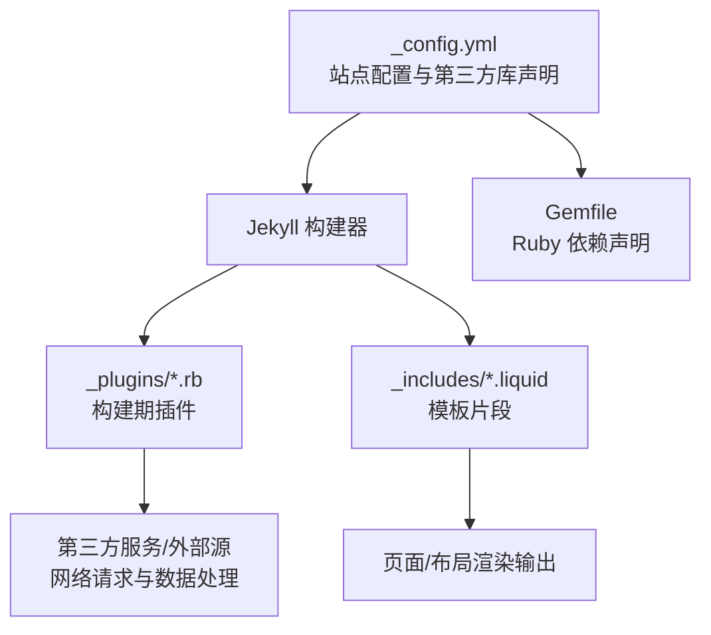
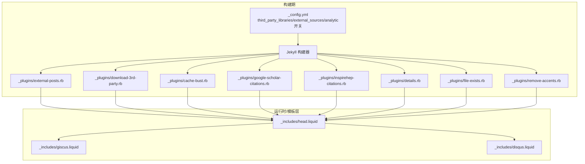
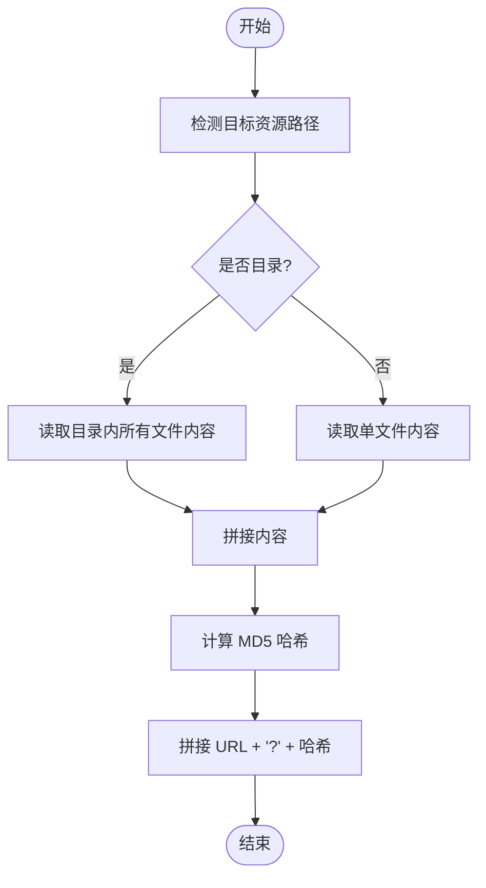
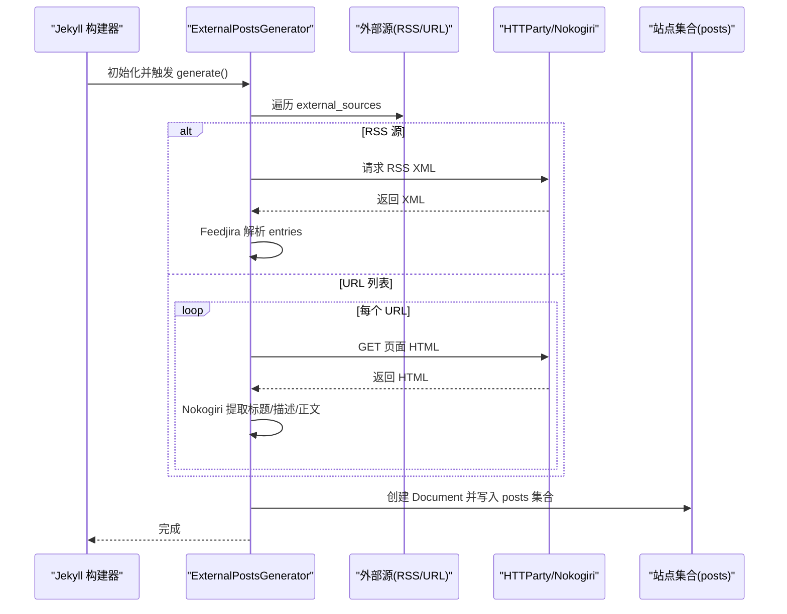
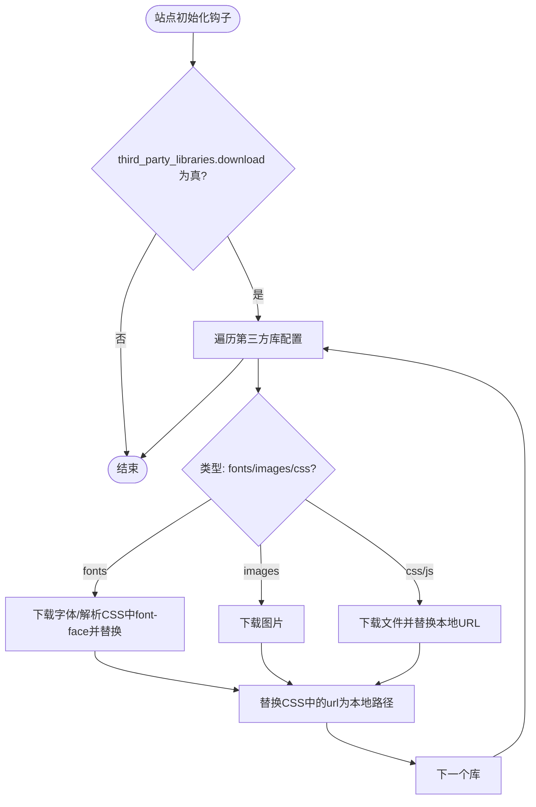
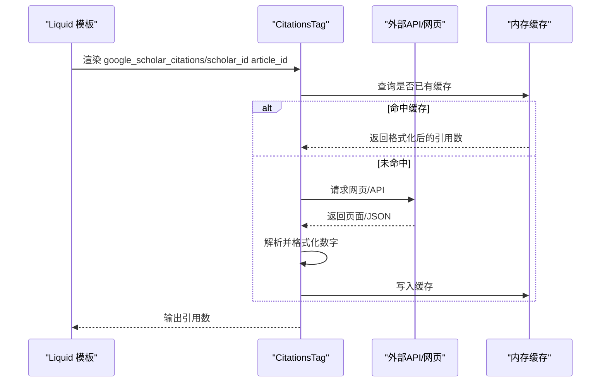
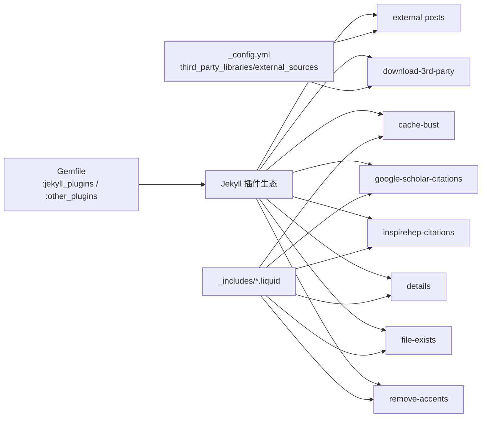

# 插件系统和扩展

<cite>
**本文引用的文件**
- [_plugins/cache-bust.rb](file://_plugins/cache-bust.rb)
- [_plugins/details.rb](file://_plugins/details.rb)
- [_plugins/download-3rd-party.rb](file://_plugins/download-3rd-party.rb)
- [_plugins/external-posts.rb](file://_plugins/external-posts.rb)
- [_plugins/file-exists.rb](file://_plugins/file-exists.rb)
- [_plugins/google-scholar-citations.rb](file://_plugins/google-scholar-citations.rb)
- [_plugins/inspirehep-citations.rb](file://_plugins/inspirehep-citations.rb)
- [_plugins/remove-accents.rb](file://_plugins/remove-accents.rb)
- [_config.yml](file://_config.yml)
- [Gemfile](file://Gemfile)
- [bin/entry_point.sh](file://bin/entry_point.sh)
- [_includes/head.liquid](file://_includes/head.liquid)
- [_includes/giscus.liquid](file://_includes/giscus.liquid)
- [_includes/disqus.liquid](file://_includes/disqus.liquid)
- [.github/release.yml](file://.github/release.yml)
- [.github/stale.yml](file://.github/stale.yml)
</cite>

## 目录
1. [简介](#简介)
2. [项目结构](#项目结构)
3. [核心组件](#核心组件)
4. [架构总览](#架构总览)
5. [详细组件分析](#详细组件分析)
6. [依赖关系分析](#依赖关系分析)
7. [性能考量](#性能考量)
8. [故障排查指南](#故障排查指南)
9. [结论](#结论)
10. [附录](#附录)

## 简介
本文件系统性梳理 al-folio 的插件体系与扩展能力，覆盖以下主题：
- 自定义 Ruby 插件的开发方法：插件注册、生命周期管理、数据处理逻辑
- 现有插件的功能与用法：缓存清理、代码高亮、外部内容聚合、第三方库下载与本地化、学术引用统计、细节折叠块等
- 第三方服务集成：GitHub API（通过 jekyll-twitter-plugin）、Google Analytics、评论系统（Giscus、Disqus）
- 自动化部署流程：基于 GitHub Actions 的发布与维护策略
- 最佳实践与调试技巧：可扩展性、安全性、性能优化
- 实战示例与扩展思路：如何基于现有插件模式新增功能模块

## 项目结构
al-folio 使用 Jekyll 构建，插件分为两类：
- 核心 Ruby 插件：位于 _plugins/，直接参与站点构建期的数据处理与资源注入
- 配置驱动型功能：通过 _config.yml 中的键值控制行为，如第三方库版本、外部源、分析与验证开关等

图表来源
- [_config.yml](file://_config.yml)
- [Gemfile](file://Gemfile)
- [_plugins/cache-bust.rb](file://_plugins/cache-bust.rb)
- [_plugins/download-3rd-party.rb](file://_plugins/download-3rd-party.rb)
- [_plugins/external-posts.rb](file://_plugins/external-posts.rb)
- [_includes/head.liquid](file://_includes/head.liquid)

章节来源
- [_config.yml](file://_config.yml)
- [Gemfile](file://Gemfile)

## 核心组件
- 缓存破坏（cache-bust）：为静态资源生成带哈希的 URL，避免浏览器缓存导致更新不生效
- 外部文章聚合（external-posts）：从 RSS 或指定 URL 抓取外部博文，注入到本地 posts 集合
- 第三方库下载与本地化（download-3rd-party）：按配置下载 CSS/字体/图片等资源，替换为本地路径
- 学术引用统计（google-scholar-citations、inspirehep-citations）：通过网页抓取或 API 获取引用数并格式化显示
- 细节块（details）：提供可折叠的摘要/详情块标签
- 文件存在性判断（file-exists）：在 Liquid 中判断文件是否存在
- 去重音（remove-accents）：对字符串进行去重音处理
- 评论系统（giscus、disqus）：在页面中嵌入评论脚本
- 分析与验证（head.liquid）：根据配置启用 Google Analytics、Site Verification 等

章节来源
- [_plugins/cache-bust.rb](file://_plugins/cache-bust.rb)
- [_plugins/external-posts.rb](file://_plugins/external-posts.rb)
- [_plugins/download-3rd-party.rb](file://_plugins/download-3rd-party.rb)
- [_plugins/google-scholar-citations.rb](file://_plugins/google-scholar-citations.rb)
- [_plugins/inspirehep-citations.rb](file://_plugins/inspirehep-citations.rb)
- [_plugins/details.rb](file://_plugins/details.rb)
- [_plugins/file-exists.rb](file://_plugins/file-exists.rb)
- [_plugins/remove-accents.rb](file://_plugins/remove-accents.rb)
- [_includes/giscus.liquid](file://_includes/giscus.liquid)
- [_includes/disqus.liquid](file://_includes/disqus.liquid)
- [_includes/head.liquid](file://_includes/head.liquid)

## 架构总览
下图展示 Jekyll 构建期插件与站点配置之间的交互关系，以及模板层如何消费这些能力。

图表来源
- [_config.yml](file://_config.yml)
- [_plugins/external-posts.rb](file://_plugins/external-posts.rb)
- [_plugins/download-3rd-party.rb](file://_plugins/download-3rd-party.rb)
- [_plugins/cache-bust.rb](file://_plugins/cache-bust.rb)
- [_plugins/google-scholar-citations.rb](file://_plugins/google-scholar-citations.rb)
- [_plugins/inspirehep-citations.rb](file://_plugins/inspirehep-citations.rb)
- [_plugins/details.rb](file://_plugins/details.rb)
- [_plugins/file-exists.rb](file://_plugins/file-exists.rb)
- [_plugins/remove-accents.rb](file://_plugins/remove-accents.rb)
- [_includes/head.liquid](file://_includes/head.liquid)
- [_includes/giscus.liquid](file://_includes/giscus.liquid)
- [_includes/disqus.liquid](file://_includes/disqus.liquid)

## 详细组件分析

### 缓存破坏（cache-bust）
- 功能要点
  - 为单文件与目录生成 MD5 哈希后缀，用于强制刷新浏览器缓存
  - 提供文件级与样式目录级的哈希生成函数
  - 在模板中以过滤器形式调用，确保资源变更后 URL 改变
- 关键实现位置
  - 过滤器注册与哈希生成逻辑
  - 文件/目录内容读取与拼接
- 使用建议
  - 对于频繁更新的 CSS/JS/图标，建议配合该过滤器使用
  - 注意与 CDN 缓存策略协同

图表来源
- [_plugins/cache-bust.rb](file://_plugins/cache-bust.rb)

章节来源
- [_plugins/cache-bust.rb](file://_plugins/cache-bust.rb)
- [_includes/head.liquid](file://_includes/head.liquid)

### 外部文章聚合（external-posts）
- 功能要点
  - 支持两种来源：RSS 源与直链 URL 列表
  - 解析标题、描述、正文与发布时间，注入本地 posts 集合
  - 为每篇外部文章生成唯一 slug，避免与本地冲突
- 生命周期
  - 注册为 Jekyll Generator，在站点初始化后执行
  - 优先处理 RSS，其次处理 URL 列表
- 数据处理
  - RSS 使用 feedjira 解析；URL 通过 HTTParty 获取 HTML 并用 Nokogiri 提取元信息
  - 发布时间支持字符串与日期对象，统一转换为 UTC

图表来源
- [_plugins/external-posts.rb](file://_plugins/external-posts.rb)
- [_config.yml](file://_config.yml)

章节来源
- [_plugins/external-posts.rb](file://_plugins/external-posts.rb)
- [_config.yml](file://_config.yml)

### 第三方库下载与本地化（download-3rd-party）
- 功能要点
  - 根据 third_party_libraries 配置，自动下载 CSS/字体/图片等资源
  - 替换 CSS 中的 url 引用为本地路径，支持 baseurl
  - 通过版本占位符 {{version}} 自动替换为配置中的版本号
- 安全与健壮性
  - 对以“|”开头的 URL 进行安全过滤，避免危险下载
  - 若目标文件已存在则跳过下载
- 资源类型
  - 字体：支持 otf/ttf/woff/woff2
  - 图片：支持 gif/jpg/jpeg/png/webp
- 输出路径
  - 下载到 assets/libs/<lib>/<文件名>，并在配置中替换为本地 URL

图表来源
- [_plugins/download-3rd-party.rb](file://_plugins/download-3rd-party.rb)
- [_config.yml](file://_config.yml)

章节来源
- [_plugins/download-3rd-party.rb](file://_plugins/download-3rd-party.rb)
- [_config.yml](file://_config.yml)

### 学术引用统计（google-scholar-citations / inspirehep-citations）
- 功能要点
  - Liquid 标签：接收学者 ID 与条目 ID，返回格式化后的引用次数
  - 缓存机制：同一文章 ID 只请求一次，后续复用结果
  - 错误处理：网络异常或解析失败时返回 N/A 并打印错误日志
- Google Scholar
  - 通过网页 meta 标签提取“被引次数”，并进行人性化数字格式化
  - 添加随机延时，降低被反爬虫拦截风险
- InspireHEP
  - 通过 REST API 获取 citation_count，解析 JSON 并格式化

图表来源
- [_plugins/google-scholar-citations.rb](file://_plugins/google-scholar-citations.rb)
- [_plugins/inspirehep-citations.rb](file://_plugins/inspirehep-citations.rb)

章节来源
- [_plugins/google-scholar-citations.rb](file://_plugins/google-scholar-citations.rb)
- [_plugins/inspirehep-citations.rb](file://_plugins/inspirehep-citations.rb)

### 细节块（details）
- 功能要点
  - 提供 Liquid 标签，将内容包裹为 HTML details/summary 结构
  - 将标题与正文分别交给 Markdown 转换器渲染
- 使用场景
  - 展示技术细节、FAQ、可折叠说明等

章节来源
- [_plugins/details.rb](file://_plugins/details.rb)

### 文件存在性判断（file-exists）
- 功能要点
  - 在 Liquid 中判断给定路径的文件是否存在，支持变量替换
  - 会结合站点 source 目录进行绝对路径拼接
- 使用场景
  - 条件渲染、动态链接、资源可用性检查

章节来源
- [_plugins/file-exists.rb](file://_plugins/file-exists.rb)

### 去重音（remove-accents）
- 功能要点
  - 提供字符串去重音过滤器，便于生成更友好的 URL 或索引
- 使用场景
  - 文章标题/别名的 slug 化前处理

章节来源
- [_plugins/remove-accents.rb](file://_plugins/remove-accents.rb)

### 评论系统集成（giscus / disqus）
- Giscus
  - 通过异步加载客户端脚本，按配置注入仓库、分类、语言等参数
  - 支持主题切换与严格模式
- Disqus
  - 传统嵌入式评论，需配置 shortname 与页面标识

章节来源
- [_includes/giscus.liquid](file://_includes/giscus.liquid)
- [_includes/disqus.liquid](file://_includes/disqus.liquid)
- [_config.yml](file://_config.yml)

### 分析与验证（head.liquid）
- 功能要点
  - 根据配置启用 Google Analytics、Search Console/Bing 验证、Open Graph/Site 验证等
  - 与第三方库版本联动，按需引入对应脚本
- 性能建议
  - 将非关键脚本设置为 defer，减少阻塞

章节来源
- [_includes/head.liquid](file://_includes/head.liquid)
- [_config.yml](file://_config.yml)

## 依赖关系分析
- Ruby 依赖
  - 核心插件组：jekyll-archives-v2、jekyll-feed、jekyll-scholar、jekyll-twitter-plugin 等
  - 开发/外部数据组：css_parser、feedjira、httparty 等
- 插件间耦合
  - external-posts 与 download-3rd-party 与 _config.yml 的 external_sources/third_party_libraries 强耦合
  - cache-bust 与 head.liquid 的过滤器调用形成稳定契约
- 外部服务
  - Twitter（jekyll-twitter-plugin）：通过 GitHub API 获取推文
  - Google Scholar/InspireHEP：网页抓取或 REST API
  - Giscus/Disqus：第三方评论服务

图表来源
- [Gemfile](file://Gemfile)
- [_plugins/external-posts.rb](file://_plugins/external-posts.rb)
- [_plugins/download-3rd-party.rb](file://_plugins/download-3rd-party.rb)
- [_plugins/cache-bust.rb](file://_plugins/cache-bust.rb)
- [_plugins/google-scholar-citations.rb](file://_plugins/google-scholar-citations.rb)
- [_plugins/inspirehep-citations.rb](file://_plugins/inspirehep-citations.rb)
- [_plugins/details.rb](file://_plugins/details.rb)
- [_plugins/file-exists.rb](file://_plugins/file-exists.rb)
- [_plugins/remove-accents.rb](file://_plugins/remove-accents.rb)
- [_config.yml](file://_config.yml)
- [_includes/head.liquid](file://_includes/head.liquid)

章节来源
- [Gemfile](file://Gemfile)
- [_config.yml](file://_config.yml)

## 性能考量
- 资源缓存与版本化
  - 使用 cache-bust 与第三方库本地化，避免 CDN 缓存导致的更新滞后
- 延迟加载与按需引入
  - head.liquid 中对非首屏资源采用 defer 加载
- 网络请求节流
  - 引用统计插件添加随机延时，降低被限流/封禁概率
- 构建期缓存
  - 引用计数结果在内存中缓存，避免重复请求
- 压缩与最小化
  - 配合 jekyll-minifier 与 terser 控制 JS/CSS 体积

[本节为通用指导，无需具体文件引用]

## 故障排查指南
- 外部文章无法抓取
  - 检查 external_sources 配置与网络可达性
  - RSS 源需返回有效 XML；URL 源需允许爬虫访问
- 第三方库未生效
  - 确认 third_party_libraries.download 已开启
  - 检查 baseurl 与本地路径映射是否正确
- 引用统计显示 N/A
  - 网络不稳定或目标站点反爬虫策略导致；可稍后重试或调整延时
- 评论系统不显示
  - Giscus 需正确配置 repo/category 等参数；Disqus 需配置 shortname
- 本地开发热更新
  - entry_point.sh 监控 _config.yml 变化并重启 Jekyll

章节来源
- [_plugins/external-posts.rb](file://_plugins/external-posts.rb)
- [_plugins/download-3rd-party.rb](file://_plugins/download-3rd-party.rb)
- [_plugins/google-scholar-citations.rb](file://_plugins/google-scholar-citations.rb)
- [_plugins/inspirehep-citations.rb](file://_plugins/inspirehep-citations.rb)
- [_includes/giscus.liquid](file://_includes/giscus.liquid)
- [_includes/disqus.liquid](file://_includes/disqus.liquid)
- [bin/entry_point.sh](file://bin/entry_point.sh)

## 结论
al-folio 的插件体系以 Jekyll 构建期钩子为核心，结合 Liquid 模板与 _config.yml 配置，实现了从资源本地化、外部内容聚合到第三方服务集成的完整闭环。通过缓存破坏、延迟加载、按需引入与构建期缓存等手段，兼顾了可用性与性能。遵循本文最佳实践与调试建议，可高效扩展新功能并保持站点稳定运行。

[本节为总结性内容，无需具体文件引用]

## 附录

### 自动化部署与维护
- 发布与变更日志
  - release.yml 定义变更日志分类与标签规则，便于生成 CHANGELOG
- Issue 流水线维护
  - stale.yml 设置 Issue 失效与关闭策略，降低维护成本

章节来源
- [.github/release.yml](file://.github/release.yml)
- [.github/stale.yml](file://.github/stale.yml)

### 开发者工作流与入口
- 本地开发入口
  - entry_point.sh 启动 bundle exec jekyll serve，监听 _config.yml 变化自动重启
- Ruby 依赖管理
  - Gemfile 明确区分核心插件与外部数据相关依赖

章节来源
- [bin/entry_point.sh](file://bin/entry_point.sh)
- [Gemfile](file://Gemfile)