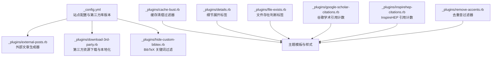
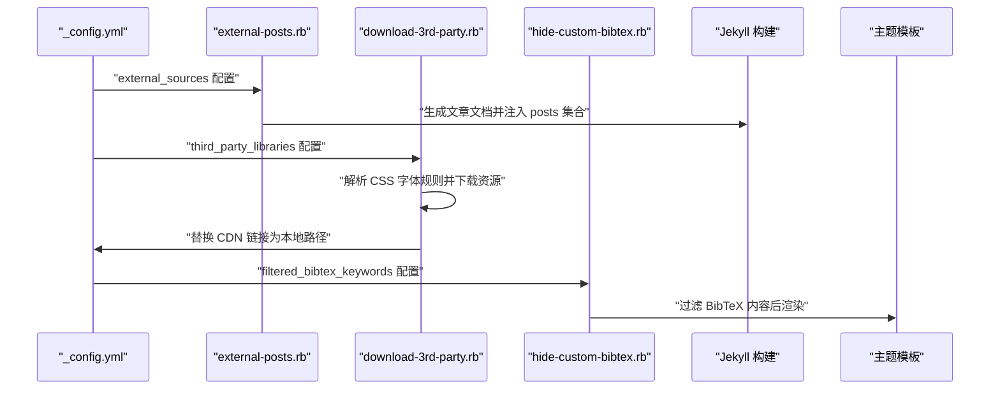
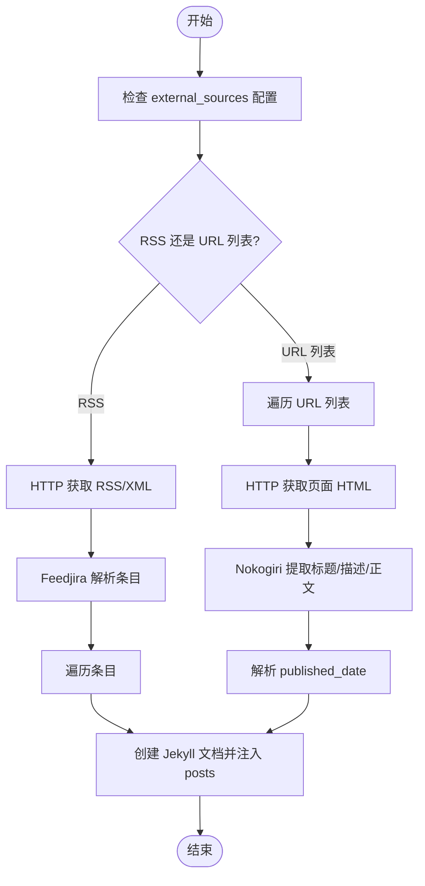
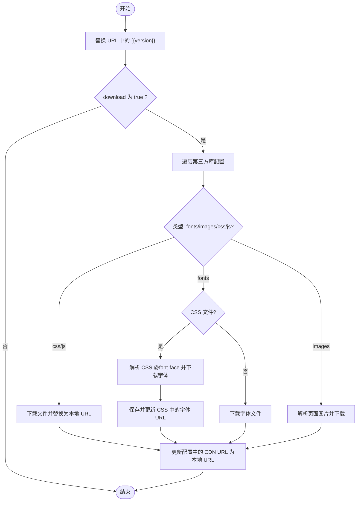
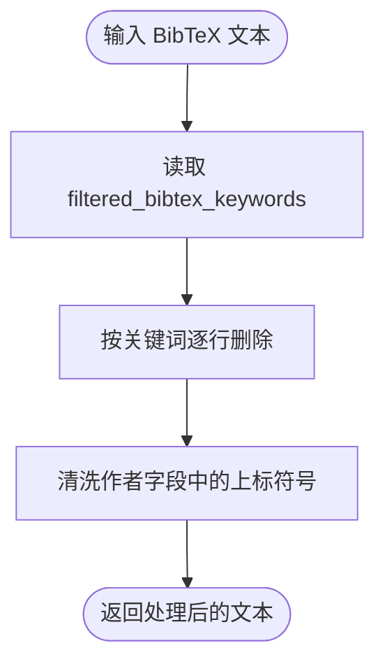
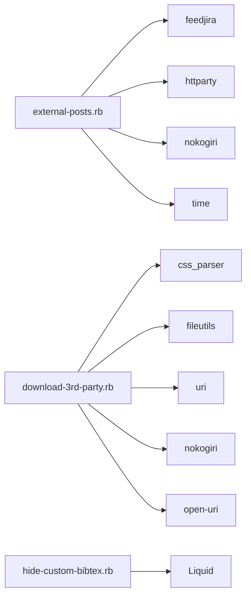

# 现有插件详解

<cite>
**本文引用的文件**
- [_plugins/external-posts.rb](file://_plugins/external-posts.rb)
- [_plugins/download-3rd-party.rb](file://_plugins/download-3rd-party.rb)
- [_plugins/hide-custom-bibtex.rb](file://_plugins/hide-custom-bibtex.rb)
- [_plugins/cache-bust.rb](file://_plugins/cache-bust.rb)
- [_plugins/details.rb](file://_plugins/details.rb)
- [_plugins/file-exists.rb](file://_plugins/file-exists.rb)
- [_plugins/google-scholar-citations.rb](file://_plugins/google-scholar-citations.rb)
- [_plugins/inspirehep-citations.rb](file://_plugins/inspirehep-citations.rb)
- [_plugins/remove-accents.rb](file://_plugins/remove-accents.rb)
- [_config.yml](file://_config.yml)
- [CUSTOMIZE.md](file://CUSTOMIZE.md)
</cite>

## 目录
1. [简介](#简介)
2. [项目结构](#项目结构)
3. [核心组件](#核心组件)
4. [架构总览](#架构总览)
5. [详细组件分析](#详细组件分析)
6. [依赖关系分析](#依赖关系分析)
7. [性能考量](#性能考量)
8. [故障排除指南](#故障排除指南)
9. [结论](#结论)
10. [附录](#附录)

## 简介
本文件聚焦于 al-folio 主题中与内容集成、第三方资源管理及文献处理相关的核心插件，系统性解析以下三个关键插件的工作机制与使用方法：
- external-posts.rb：外部内容（RSS/Atom 或指定 URL）集成，自动抓取并注入站点文章集合。
- download-3rd-party.rb：第三方库下载与本地化，支持字体、图片与 CSS 资源的解析与替换。
- hide-custom-bibtex.rb：自定义 BibTeX 关键词过滤与作者字段清洗，配合主题显示控制。

同时，本文还概述了与之协同的其他插件（如缓存清理、细节展开、文件存在判断、谷歌学术与 InspireHEP 引用计数等），帮助读者理解整体数据流与错误处理策略。

## 项目结构
本项目采用 Jekyll 的插件目录组织方式，核心插件位于根目录下 _plugins 文件夹中；站点配置集中在 _config.yml，主题定制说明在 CUSTOMIZE.md。外部文章来源与第三方库版本信息均通过配置项进行声明与驱动。

图表来源
- [_config.yml](file://_config.yml)
- [_plugins/external-posts.rb](file://_plugins/external-posts.rb)
- [_plugins/download-3rd-party.rb](file://_plugins/download-3rd-party.rb)
- [_plugins/hide-custom-bibtex.rb](file://_plugins/hide-custom-bibtex.rb)
- [_plugins/cache-bust.rb](file://_plugins/cache-bust.rb)
- [_plugins/details.rb](file://_plugins/details.rb)
- [_plugins/file-exists.rb](file://_plugins/file-exists.rb)
- [_plugins/google-scholar-citations.rb](file://_plugins/google-scholar-citations.rb)
- [_plugins/inspirehep-citations.rb](file://_plugins/inspirehep-citations.rb)
- [_plugins/remove-accents.rb](file://_plugins/remove-accents.rb)

章节来源
- [_config.yml](file://_config.yml)
- [_plugins/external-posts.rb](file://_plugins/external-posts.rb)
- [_plugins/download-3rd-party.rb](file://_plugins/download-3rd-party.rb)
- [_plugins/hide-custom-bibtex.rb](file://_plugins/hide-custom-bibtex.rb)
- [_plugins/cache-bust.rb](file://_plugins/cache-bust.rb)
- [_plugins/details.rb](file://_plugins/details.rb)
- [_plugins/file-exists.rb](file://_plugins/file-exists.rb)
- [_plugins/google-scholar-citations.rb](file://_plugins/google-scholar-citations.rb)
- [_plugins/inspirehep-citations.rb](file://_plugins/inspirehep-citations.rb)
- [_plugins/remove-accents.rb](file://_plugins/remove-accents.rb)

## 核心组件
- 外部文章生成器（external-posts.rb）
  - 功能：从 RSS/Atom 源或指定 URL 列表抓取文章，解析标题、摘要、发布时间与正文，注入到 Jekyll 文章集合，形成“外部来源”的文章条目。
  - 关键点：支持 RSS 与直接 URL 两种模式；对标题为空或仅含空白字符时回退为“来源名-URL尾段”作为 slug；统一设置外部来源标记、重定向链接与发布日期。
- 第三方资源下载器（download-3rd-party.rb）
  - 功能：根据配置下载第三方库（CSS/JS/字体/图片），解析 CSS 中的字体规则并替换为本地路径；支持按 baseurl 修正资源路径。
  - 关键点：按类型分发下载（fonts/images/css/js），对 CSS 进行解析与改写；避免重复下载；安全校验（禁止危险协议前缀）。
- 自定义 BibTeX 处理器（hide-custom-bibtex.rb）
  - 功能：基于配置关键词列表过滤 BibTeX 条目中的内部字段；同时清洗作者字段中的上标符号，便于展示。
  - 关键点：通过 Liquid 过滤器注册，作用于主题渲染阶段，影响最终页面输出。

章节来源
- [_plugins/external-posts.rb](file://_plugins/external-posts.rb)
- [_plugins/download-3rd-party.rb](file://_plugins/download-3rd-party.rb)
- [_plugins/hide-custom-bibtex.rb](file://_plugins/hide-custom-bibtex.rb)
- [_config.yml](file://_config.yml)

## 架构总览
下图展示了三个核心插件在构建流程中的协作关系与数据流向：

图表来源
- [_config.yml](file://_config.yml)
- [_plugins/external-posts.rb](file://_plugins/external-posts.rb)
- [_plugins/download-3rd-party.rb](file://_plugins/download-3rd-party.rb)
- [_plugins/hide-custom-bibtex.rb](file://_plugins/hide-custom-bibtex.rb)

## 详细组件分析

### external-posts.rb：外部内容集成机制
- 触发时机与入口
  - 在 Jekyll 生成阶段运行，优先级高，遍历配置中的 external_sources。
- 数据来源与分支
  - RSS/Atom 模式：通过 HTTP 获取 XML，使用 Feedjira 解析条目，逐条创建文档。
  - URL 列表模式：逐个抓取页面 HTML，使用 Nokogiri 提取标题、描述与正文，结合显式发布的日期参数生成文档。
- 文档创建与元数据
  - 标题为空或仅含非字母字符时，回退生成 slug（来源名-URL尾段）。
  - 设置外部来源标识、标题、正文、摘要、发布日期与原始链接（用于重定向）。
- 错误处理与边界
  - RSS/XML 为空时跳过；URL 抓取失败会中断当前条目处理；日期解析支持字符串与 Date 类型，非法格式抛出异常。
- 使用场景
  - 将 Medium、个人博客或其他站点的文章同步到本博客，统一归档与索引。
- 配置示例（片段）
  - external_sources:
    - name: medium.com
      rss_url: https://medium.com/@al-folio/feed
    - name: Google Blog
      posts:
        - url: https://blog.google/technology/ai/...
          published_date: 2024-05-14

图表来源
- [_plugins/external-posts.rb](file://_plugins/external-posts.rb)

章节来源
- [_plugins/external-posts.rb](file://_plugins/external-posts.rb)
- [_config.yml](file://_config.yml)

### download-3rd-party.rb：第三方资源下载与缓存策略
- 触发时机与入口
  - 在 Jekyll 初始化后执行一次，扫描 third_party_libraries 配置，按需下载并替换资源链接。
- 版本占位符替换
  - 将 URL 中的 {{version}} 替换为配置中的版本号，确保一致性。
- 下载与替换策略
  - JS/CSS/JS Map：直接下载至 assets/libs/<lib>/<file>，并将 URL 替换为本地路径（考虑 baseurl）。
  - 字体（fonts）：
    - 若为 CSS：解析 CSS 中的 @font-face 规则，提取 src 的字体文件并下载，同时修改 CSS 中的 url 为本地路径。
    - 若为字体直链：下载到 assets/libs/<lib>/fonts 并更新 URL。
  - 图片（images）：解析目标页的图片链接，下载到 assets/libs/<lib>/images。
- 缓存与幂等
  - 若目标文件已存在则跳过下载；若目录不存在则创建；对字体与图片目录存在性进行检查，避免重复抓取。
- 安全与健壮性
  - 对以特定前缀开头的 URL 进行安全过滤，防止危险下载；下载失败抛出异常。
- 使用场景
  - 将 CDN 上的第三方库（如 Bootstrap、Chart.js、Leaflet、MathJax 等）本地化，提升离线可用性与加载稳定性。
- 配置示例（片段）
  - third_party_libraries:
    - download: true
    - bootstrap-table:
      url:
        css: https://cdn.jsdelivr.net/npm/bootstrap-table@{{version}}/dist/bootstrap-table.min.css
        js: https://cdn.jsdelivr.net/npm/bootstrap-table@{{version}}/dist/bootstrap-table.min.js
      version: "1.22.4"
    - leaflet:
      url:
        css: https://cdn.jsdelivr.net/npm/leaflet@{{version}}/dist/leaflet.min.css
        js: https://cdn.jsdelivr.net/npm/leaflet@{{version}}/dist/leaflet.min.js
        images: https://cdn.jsdelivr.net/npm/leaflet@{{version}}/dist/images/
      version: "1.9.4"
    - mathjax:
      url:
        js: https://cdn.jsdelivr.net/npm/mathjax@{{version}}/es5/tex-mml-chtml.js
        fonts: https://cdn.jsdelivr.net/npm/mathjax@{{version}}/es5/output/chtml/fonts/woff-v2/
      version: "3.2.2"

图表来源
- [_plugins/download-3rd-party.rb](file://_plugins/download-3rd-party.rb)
- [_config.yml](file://_config.yml)

章节来源
- [_plugins/download-3rd-party.rb](file://_plugins/download-3rd-party.rb)
- [_config.yml](file://_config.yml)

### hide-custom-bibtex.rb：自定义 BibTeX 处理逻辑
- 触发时机与入口
  - 注册为 Liquid 过滤器，在主题渲染 BibTeX 输出时调用。
- 处理逻辑
  - 读取 filtered_bibtex_keywords 列表，逐项删除条目中匹配该关键词的整行。
  - 清洗作者字段中的上标符号（如 *†‡§¶‖&^），避免在网页中出现不可见或干扰的符号。
- 使用场景
  - 展示出版物列表时隐藏内部关键字（如代码链接、预印本标识、内部注释等），保持页面整洁。
- 配置示例（片段）
  - filtered_bibtex_keywords:
    - abbr
    - abstract
    - additional_info
    - blog
    - code
    - pdf
    - ...（详见完整配置）

图表来源
- [_plugins/hide-custom-bibtex.rb](file://_plugins/hide-custom-bibtex.rb)
- [_config.yml](file://_config.yml)

章节来源
- [_plugins/hide-custom-bibtex.rb](file://_plugins/hide-custom-bibtex.rb)
- [_config.yml](file://_config.yml)
- [CUSTOMIZE.md](file://CUSTOMIZE.md)

### 其他协同插件概览
- cache-bust.rb：为静态资源生成带 MD5 的查询串，用于强制刷新浏览器缓存。
- details.rb：提供 details/summary 语法糖，便于折叠内容。
- file-exists.rb：在模板中判断文件是否存在，用于条件渲染。
- google-scholar-citations.rb / inspirehep-citations.rb：从外部 API 获取引用计数，带缓存与错误处理。
- remove-accents.rb：移除字符串重音符号，便于 URL 或文件名生成。

这些插件与上述三大核心插件共同构成内容采集、资源本地化与展示优化的完整链路。

章节来源
- [_plugins/cache-bust.rb](file://_plugins/cache-bust.rb)
- [_plugins/details.rb](file://_plugins/details.rb)
- [_plugins/file-exists.rb](file://_plugins/file-exists.rb)
- [_plugins/google-scholar-citations.rb](file://_plugins/google-scholar-citations.rb)
- [_plugins/inspirehep-citations.rb](file://_plugins/inspirehep-citations.rb)
- [_plugins/remove-accents.rb](file://_plugins/remove-accents.rb)

## 依赖关系分析
- external-posts.rb
  - 依赖 feedjira、httparty、nokogiri、time；通过 Jekyll Generator 接口注入文章集合。
- download-3rd-party.rb
  - 依赖 css_parser、digest、fileutils、nokogiri、open-uri、uri；在站点初始化后执行，修改配置中的 URL。
- hide-custom-bibtex.rb
  - 依赖 Liquid 过滤器注册；读取配置中的关键词列表。

图表来源
- [_plugins/external-posts.rb](file://_plugins/external-posts.rb)
- [_plugins/download-3rd-party.rb](file://_plugins/download-3rd-party.rb)
- [_plugins/hide-custom-bibtex.rb](file://_plugins/hide-custom-bibtex.rb)

章节来源
- [_plugins/external-posts.rb](file://_plugins/external-posts.rb)
- [_plugins/download-3rd-party.rb](file://_plugins/download-3rd-party.rb)
- [_plugins/hide-custom-bibtex.rb](file://_plugins/hide-custom-bibtex.rb)

## 性能考量
- 外部文章抓取
  - RSS 模式批量解析，建议控制条目数量与并发；URL 模式逐条抓取，注意网络延迟与超时。
- 第三方资源下载
  - 仅在文件缺失时下载，避免重复；字体与图片目录存在性检查减少无效请求；CSS 字体解析仅在需要时进行。
- BibTeX 过滤
  - 正则逐关键词删除，建议关键词列表精简；作者字段清洗为一次性处理，开销较小。
- 缓存与压缩
  - 结合 cache-bust 与主题压缩策略，可进一步降低重复加载成本。

## 故障排除指南
- external-posts.rb
  - 现象：RSS/Atom 解析失败或无内容。
    - 排查：确认 rss_url 可访问且返回有效 XML；检查网络代理与超时设置。
  - 现象：URL 模式抓取失败。
    - 排查：确认目标页面可正常访问；检查页面结构变化导致的标题/描述选择器失效。
  - 现象：日期解析报错。
    - 排查：published_date 必须为字符串或 Date 类型；非法格式会触发异常。
- download-3rd-party.rb
  - 现象：下载失败或文件未生成。
    - 排查：检查 URL 是否以危险前缀开头被拦截；确认目标 CDN 可达；查看权限与磁盘空间。
  - 现象：CSS 中字体未生效。
    - 排查：确认 @font-face 的 src 路径正确；baseurl 配置是否与实际部署路径一致。
- hide-custom-bibtex.rb
  - 现象：关键词未被过滤。
    - 排查：确认 filtered_bibtex_keywords 已在配置中启用；关键词大小写与空格是否匹配。
  - 现象：作者字段仍残留上标符号。
    - 排查：确认正则范围覆盖所需符号；检查输入文本编码。
- 其他插件
  - cache-bust：若资源未更新，检查 MD5 生成逻辑与缓存头设置。
  - details/file-exists：确认 Liquid 语法与上下文变量正确传递。
  - google_scholar_citations/inspirehep_citations：API 可能限流或返回格式变化，建议增加重试与降级策略。

章节来源
- [_plugins/external-posts.rb](file://_plugins/external-posts.rb)
- [_plugins/download-3rd-party.rb](file://_plugins/download-3rd-party.rb)
- [_plugins/hide-custom-bibtex.rb](file://_plugins/hide-custom-bibtex.rb)
- [_plugins/google-scholar-citations.rb](file://_plugins/google-scholar-citations.rb)
- [_plugins/inspirehep-citations.rb](file://_plugins/inspirehep-citations.rb)

## 结论
external-posts.rb、download-3rd-party.rb 与 hide-custom-bibtex.rb 三者分别承担“外部内容聚合”、“第三方资源本地化”与“BibTeX 内容净化”的职责。它们通过 Jekyll 钩子与 Liquid 过滤器无缝融入构建流程，配合配置项实现灵活扩展。合理配置与错误处理策略可显著提升站点的内容丰富度、加载性能与维护效率。

## 附录
- 配置参考
  - external_sources：参见 [external_sources 配置片段](file://_config.yml)
  - third_party_libraries：参见 [third_party_libraries 配置片段](file://_config.yml)
  - filtered_bibtex_keywords：参见 [filtered_bibtex_keywords 配置片段](file://_config.yml)
- 主题定制说明
  - 自定义 BibTeX 按钮与关键词：参见 [CUSTOMIZE.md](file://CUSTOMIZE.md)