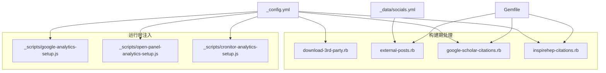
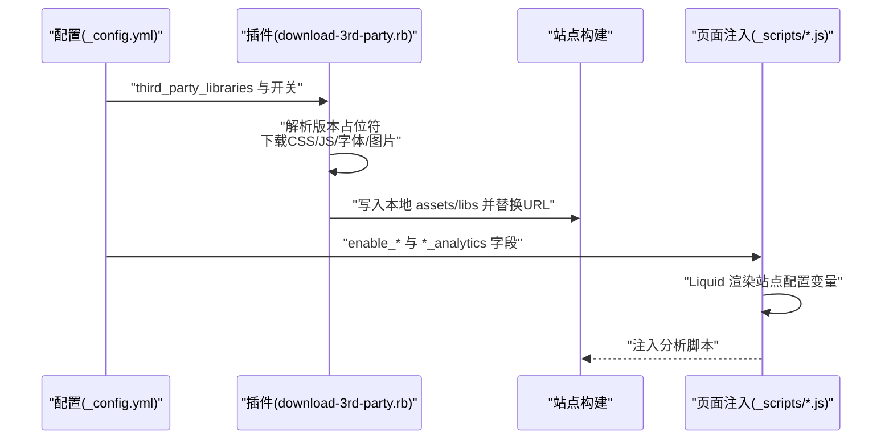
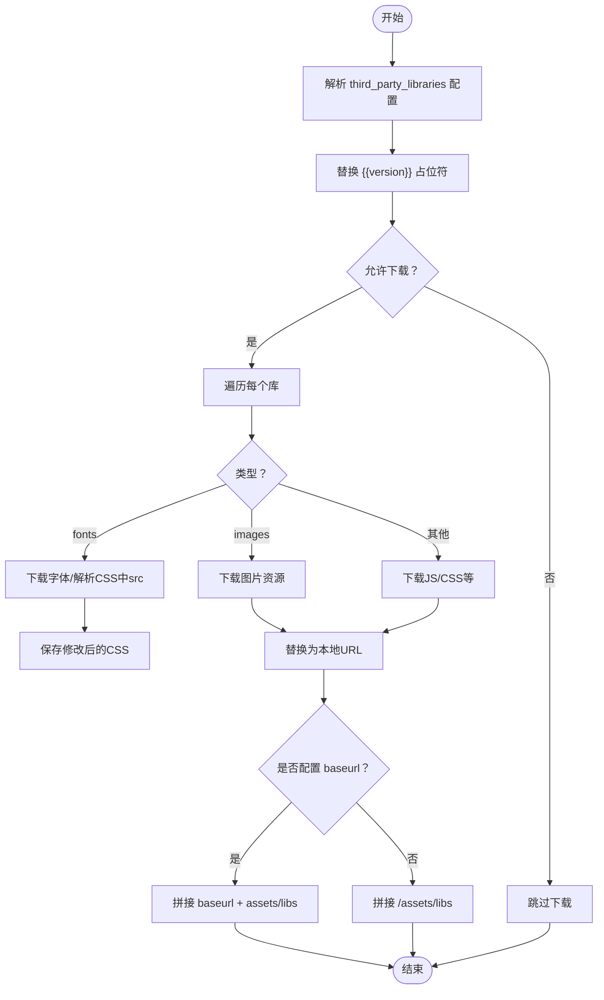
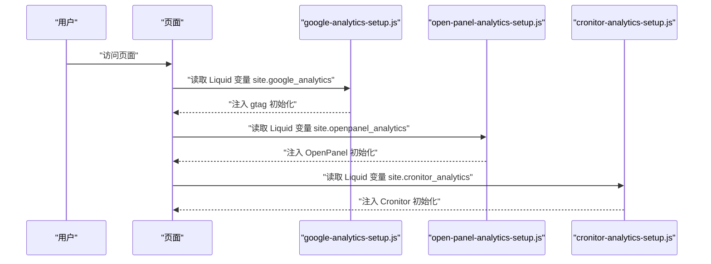
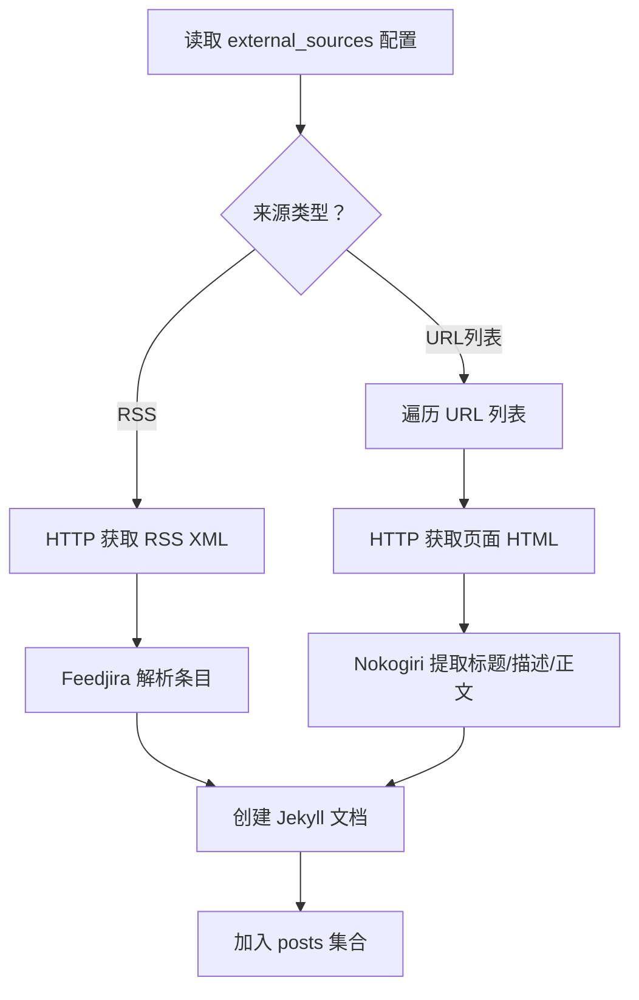
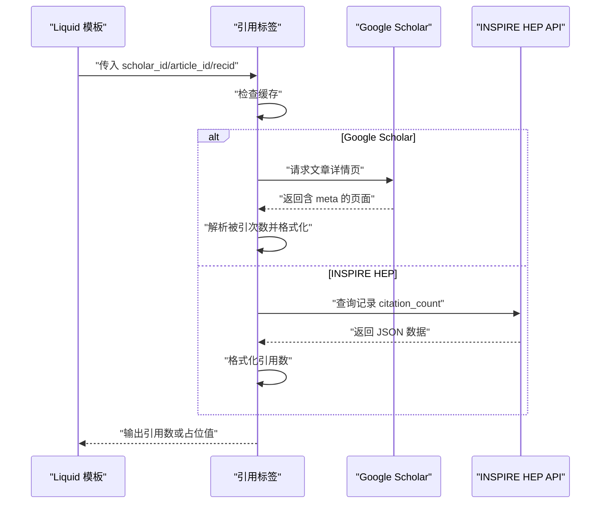
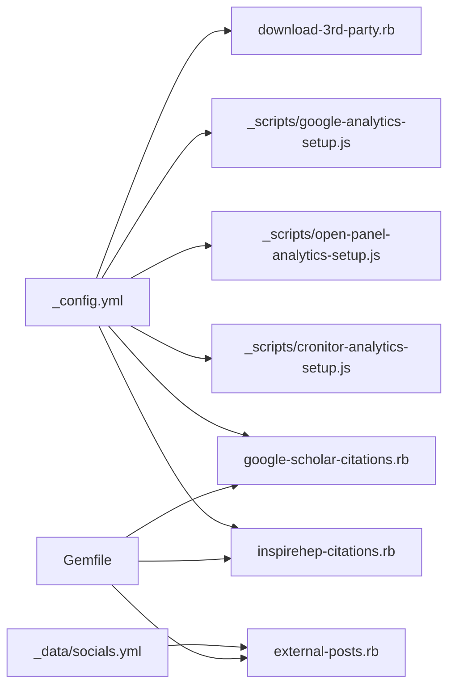

# 第三方服务集成

<cite>
**本文引用的文件**
- [download-3rd-party.rb](file://_plugins/download-3rd-party.rb)
- [_config.yml](file://_config.yml)
- [google-analytics-setup.js](file://_scripts/google-analytics-setup.js)
- [open-panel-analytics-setup.js](file://_scripts/open-panel-analytics-setup.js)
- [cronitor-analytics-setup.js](file://_scripts/cronitor-analytics-setup.js)
- [external-posts.rb](file://_plugins/external-posts.rb)
- [google-scholar-citations.rb](file://_plugins/google-scholar-citations.rb)
- [inspirehep-citations.rb](file://_plugins/inspirehep-citations.rb)
- [socials.yml](file://_data/socials.yml)
- [Gemfile](file://Gemfile)
- [.github/stale.yml](file://.github/stale.yml)
- [.github/release.yml](file://.github/release.yml)
</cite>

## 目录
1. [简介](#简介)
2. [项目结构](#项目结构)
3. [核心组件](#核心组件)
4. [架构总览](#架构总览)
5. [详细组件分析](#详细组件分析)
6. [依赖关系分析](#依赖关系分析)
7. [性能考量](#性能考量)
8. [故障排查指南](#故障排查指南)
9. [结论](#结论)
10. [附录](#附录)

## 简介
本指南聚焦于该 Jekyll 站点的第三方服务集成与自动化部署实践，覆盖以下主题：
- CDN 资源下载与本地化：通过插件在构建期下载第三方库并替换为本地路径，支持版本占位符与完整性校验。
- 分析服务配置：集成 Google Analytics、Pirsch、OpenPanel、Cronitor 等前端埋点脚本，支持按站点开关启用。
- 自动化与外部内容聚合：使用外部 RSS/网页抓取插件将外部博客内容注入站点；结合 GitHub Issues 的维护策略。
- 社交媒体平台集成：通过数据文件配置 GitHub、Google Scholar 等社交与学术链接；利用官方插件集成 Twitter。
- 安全与可用性：API 密钥管理建议、访问控制与降级策略、故障转移与优雅回退。

## 项目结构
围绕第三方服务集成的关键目录与文件：
- 插件层：_plugins 下的 Ruby 插件负责构建期处理（CDN 资源下载、外部内容聚合、学术引用抓取等）。
- 配置层：_config.yml 提供站点配置、第三方库清单、分析服务开关与密钥字段。
- 脚本层：_scripts 下的 JS 文件用于注入分析脚本到页面。
- 数据层：_data 下的 YAML 文件承载社交账号、仓库等数据。
- 工作流与维护：.github 下的模板与策略文件用于 Issues 维护与发布变更日志生成。

图表来源
- [_config.yml](file://_config.yml)
- [_plugins/download-3rd-party.rb](file://_plugins/download-3rd-party.rb)
- [_plugins/external-posts.rb](file://_plugins/external-posts.rb)
- [_plugins/google-scholar-citations.rb](file://_plugins/google-scholar-citations.rb)
- [_plugins/inspirehep-citations.rb](file://_plugins/inspirehep-citations.rb)
- [_scripts/google-analytics-setup.js](file://_scripts/google-analytics-setup.js)
- [_scripts/open-panel-analytics-setup.js](file://_scripts/open-panel-analytics-setup.js)
- [_scripts/cronitor-analytics-setup.js](file://_scripts/cronitor-analytics-setup.js)
- [_data/socials.yml](file://_data/socials.yml)
- [Gemfile](file://Gemfile)

章节来源
- [_config.yml](file://_config.yml)
- [_plugins/download-3rd-party.rb](file://_plugins/download-3rd-party.rb)
- [_plugins/external-posts.rb](file://_plugins/external-posts.rb)
- [_plugins/google-scholar-citations.rb](file://_plugins/google-scholar-citations.rb)
- [_plugins/inspirehep-citations.rb](file://_plugins/inspirehep-citations.rb)
- [_scripts/google-analytics-setup.js](file://_scripts/google-analytics-setup.js)
- [_scripts/open-panel-analytics-setup.js](file://_scripts/open-panel-analytics-setup.js)
- [_scripts/cronitor-analytics-setup.js](file://_scripts/cronitor-analytics-setup.js)
- [_data/socials.yml](file://_data/socials.yml)
- [Gemfile](file://Gemfile)

## 核心组件
- 第三方库下载与本地化插件：在构建期解析版本占位符、下载 CSS/JS/字体/图片资源、替换为本地路径，并考虑 baseurl。
- 外部分析脚本注入：通过独立 JS 文件注入各分析服务的初始化脚本，使用 Liquid 变量渲染配置。
- 外部内容聚合：从 RSS 或指定 URL 抓取文章元信息与正文，生成站点文章集合。
- 学术引用统计：通过 Google Scholar 或 INSPIRE HEP API 获取引用数，带缓存与错误回退。
- 社交与学术链接：通过数据文件集中配置 GitHub、Google Scholar 等链接，便于统一维护。

章节来源
- [_plugins/download-3rd-party.rb](file://_plugins/download-3rd-party.rb)
- [_config.yml](file://_config.yml)
- [_scripts/google-analytics-setup.js](file://_scripts/google-analytics-setup.js)
- [_plugins/external-posts.rb](file://_plugins/external-posts.rb)
- [_plugins/google-scholar-citations.rb](file://_plugins/google-scholar-citations.rb)
- [_plugins/inspirehep-citations.rb](file://_plugins/inspirehep-citations.rb)
- [_data/socials.yml](file://_data/socials.yml)

## 架构总览
下图展示从配置到构建期处理再到页面注入的整体流程：

图表来源
- [_config.yml](file://_config.yml)
- [_plugins/download-3rd-party.rb](file://_plugins/download-3rd-party.rb)
- [_scripts/google-analytics-setup.js](file://_scripts/google-analytics-setup.js)
- [_scripts/open-panel-analytics-setup.js](file://_scripts/open-panel-analytics-setup.js)
- [_scripts/cronitor-analytics-setup.js](file://_scripts/cronitor-analytics-setup.js)

## 详细组件分析

### 第三方库下载与本地化（download-3rd-party.rb）
- 版本控制：支持在 third_party_libraries 中以占位符形式声明版本号，构建期自动替换为实际版本。
- 资源类型：识别并下载字体、图片、CSS/JS 等资源；对 CSS 中的 @font-face src 进行解析与替换。
- 缓存策略：若目标目录存在且非空，则跳过下载，避免重复网络请求。
- 更新流程：当配置中的版本或 URL 发生变化时，重新下载并替换本地引用；同时根据 baseurl 修正资源路径。
- 安全控制：禁止以特定前缀开头的危险 URL，防止任意文件写入。

图表来源
- [_plugins/download-3rd-party.rb](file://_plugins/download-3rd-party.rb)
- [_config.yml](file://_config.yml)

章节来源
- [_plugins/download-3rd-party.rb](file://_plugins/download-3rd-party.rb)
- [_config.yml](file://_config.yml)

### 分析服务集成（Google Analytics、Pirsch、OpenPanel、Cronitor）
- 配置开关：在 _config.yml 中通过 enable_* 开关与 *_analytics 字段启用对应分析服务。
- 注入脚本：_scripts 下的 JS 文件通过 Liquid 渲染站点配置变量，向页面注入初始化脚本。
- 典型流程：站点启动时加载 dataLayer/gtag/op/cronitor 初始化函数，随后按配置发送事件。

图表来源
- [_config.yml](file://_config.yml)
- [_scripts/google-analytics-setup.js](file://_scripts/google-analytics-setup.js)
- [_scripts/open-panel-analytics-setup.js](file://_scripts/open-panel-analytics-setup.js)
- [_scripts/cronitor-analytics-setup.js](file://_scripts/cronitor-analytics-setup.js)

章节来源
- [_config.yml](file://_config.yml)
- [_scripts/google-analytics-setup.js](file://_scripts/google-analytics-setup.js)
- [_scripts/open-panel-analytics-setup.js](file://_scripts/open-panel-analytics-setup.js)
- [_scripts/cronitor-analytics-setup.js](file://_scripts/cronitor-analytics-setup.js)

### 外部内容聚合（external-posts.rb）
- 支持两种来源：RSS 源与直接 URL 列表。
- 抓取逻辑：解析 RSS/HTML，提取标题、摘要与正文，生成站点文章集合。
- 文档创建：为每条外部内容创建 Jekyll 文档，设置外部来源标记与重定向字段。

图表来源
- [_plugins/external-posts.rb](file://_plugins/external-posts.rb)
- [_config.yml](file://_config.yml)

章节来源
- [_plugins/external-posts.rb](file://_plugins/external-posts.rb)
- [_config.yml](file://_config.yml)

### 学术引用统计（google-scholar-citations.rb、inspirehep-citations.rb）
- Google Scholar 引用：通过构造文章详情页 URL，解析 meta 描述中的“被引次数”，并进行人性化格式化。
- INSPIRE HEP 引用：调用 API 获取记录的 citation_count，进行人性化格式化。
- 缓存与容错：内部缓存已获取的引用数；异常时返回占位值并打印错误日志。

图表来源
- [_plugins/google-scholar-citations.rb](file://_plugins/google-scholar-citations.rb)
- [_plugins/inspirehep-citations.rb](file://_plugins/inspirehep-citations.rb)

章节来源
- [_plugins/google-scholar-citations.rb](file://_plugins/google-scholar-citations.rb)
- [_plugins/inspirehep-citations.rb](file://_plugins/inspirehep-citations.rb)

### 社交媒体平台集成
- GitHub：通过数据文件配置用户名，可在页面中生成链接或调用相关插件。
- Twitter：通过官方 jekyll-twitter-plugin 在页面嵌入推文，需在 Gemfile 中启用。
- Google Scholar：通过数据文件配置 ID，在页面中可结合引用插件显示引用统计。

章节来源
- [_data/socials.yml](file://_data/socials.yml)
- [Gemfile](file://Gemfile)

## 依赖关系分析
- 插件依赖：external-posts.rb 使用 feedjira、httparty、nokogiri；google-scholar-citations.rb 使用 activesupport、nokogiri；inspirehep-citations.rb 使用 net/http、json。
- 构建期与运行时：download-3rd-party.rb 在构建期执行；分析脚本注入在运行时生效。
- 配置耦合：third_party_libraries、enable_*、*_analytics 等字段贯穿插件与脚本。

图表来源
- [_config.yml](file://_config.yml)
- [_plugins/download-3rd-party.rb](file://_plugins/download-3rd-party.rb)
- [_plugins/external-posts.rb](file://_plugins/external-posts.rb)
- [_plugins/google-scholar-citations.rb](file://_plugins/google-scholar-citations.rb)
- [_plugins/inspirehep-citations.rb](file://_plugins/inspirehep-citations.rb)
- [_data/socials.yml](file://_data/socials.yml)
- [Gemfile](file://Gemfile)

章节来源
- [_config.yml](file://_config.yml)
- [_plugins/download-3rd-party.rb](file://_plugins/download-3rd-party.rb)
- [_plugins/external-posts.rb](file://_plugins/external-posts.rb)
- [_plugins/google-scholar-citations.rb](file://_plugins/google-scholar-citations.rb)
- [_plugins/inspirehep-citations.rb](file://_plugins/inspirehep-citations.rb)
- [_data/socials.yml](file://_data/socials.yml)
- [Gemfile](file://Gemfile)

## 性能考量
- 构建期缓存：download-3rd-party.rb 对已存在的目录跳过下载，减少重复网络请求。
- 资源本地化：将第三方资源下载到本地 assets/libs，降低对 CDN 的依赖与首屏延迟。
- 压缩与最小化：结合 jekyll-minifier 与 terser 控制 JS/CSS 体积。
- 外部抓取节流：google-scholar-citations.rb 在请求间引入随机延时，避免被反爬策略限制。
- 图像优化：开启响应式 WebP 与懒加载，提升图像加载性能。

## 故障排查指南
- CDN 资源未下载或路径错误
  - 检查 third_party_libraries.download 是否启用，确认版本占位符是否正确替换。
  - 若目录非空但内容不完整，删除后重建以强制重新下载。
  - 确认 baseurl 配置，确保生成的本地 URL 正确拼接。
- 分析脚本未生效
  - 确认 *_analytics 字段已填写且 enable_* 开关已打开。
  - 检查注入脚本是否被压缩/排除规则影响。
- 外部内容未拉取
  - 检查 external_sources 配置与网络可达性；RSS 源需返回有效 XML。
  - 对 URL 列表抓取，确认目标页面可被 httparty/nokogiri 访问。
- 引用统计异常
  - Google Scholar 页面结构可能变化导致解析失败；查看插件日志定位问题。
  - INSPIRE HEP API 返回为空或格式不符时，检查 recid 与网络状态。
- GitHub Issues 维护
  - 使用 stale.yml 设置自动标记与关闭策略，避免长期无人维护的 Issue 积压。
  - 使用 release.yml 自动生成变更日志，按标签分类记录改动。

章节来源
- [_plugins/download-3rd-party.rb](file://_plugins/download-3rd-party.rb)
- [_config.yml](file://_config.yml)
- [_plugins/external-posts.rb](file://_plugins/external-posts.rb)
- [_plugins/google-scholar-citations.rb](file://_plugins/google-scholar-citations.rb)
- [_plugins/inspirehep-citations.rb](file://_plugins/inspirehep-citations.rb)
- [.github/stale.yml](file://.github/stale.yml)
- [.github/release.yml](file://.github/release.yml)

## 结论
该站点通过插件化与配置化的组合，实现了第三方资源的本地化、分析脚本的灵活注入、外部内容的聚合以及学术引用的统计。配合 GitHub Issues 的维护策略与发布日志生成，形成了较为完整的第三方服务集成与运维体系。建议在生产环境中进一步强化密钥管理与访问控制，并为关键外部服务设计降级与回退策略，以提升整体可用性与稳定性。

## 附录
- 安全配置最佳实践
  - 将敏感配置项放入受控环境变量或私有仓库，避免硬编码在公开仓库中。
  - 限制第三方资源来源域名白名单，仅允许可信 CDN。
  - 对下载的第三方资源进行完整性校验（如 SRI），并在 CI 中验证。
- 服务可用性监控与故障转移
  - 对关键外部 API（如 INSPIRE HEP、Google Scholar）增加超时与重试策略。
  - 为分析脚本注入添加开关与降级回退（如默认空实现），保证主站功能不受影响。
- 服务降级与优雅回退
  - 当外部服务不可用时，优先显示静态内容或占位符，记录错误日志并上报监控系统。
  - 对引用统计等非关键功能采用缓存优先策略，避免每次构建都发起外部请求。