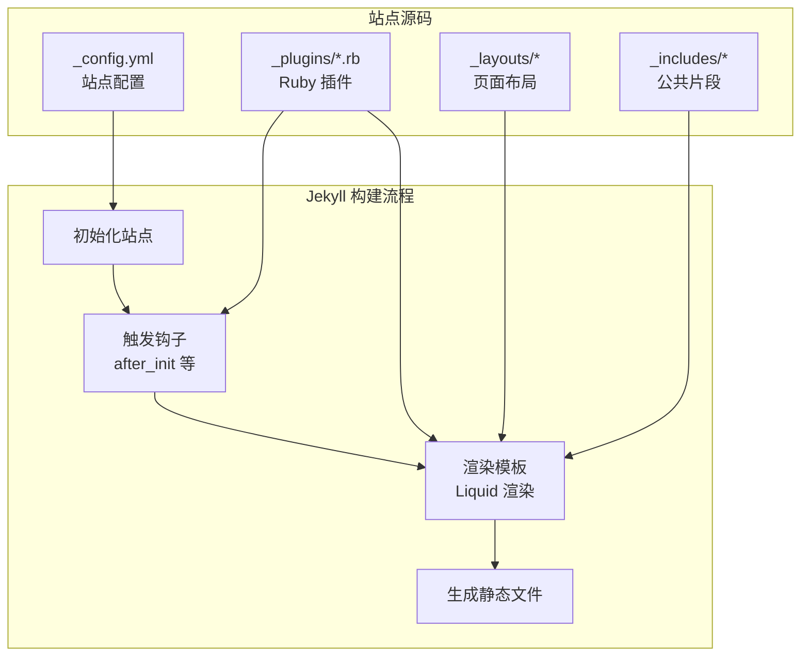
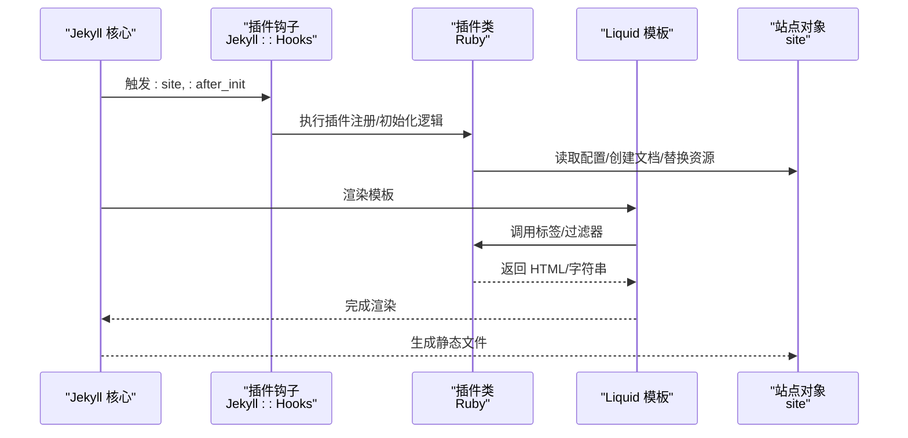
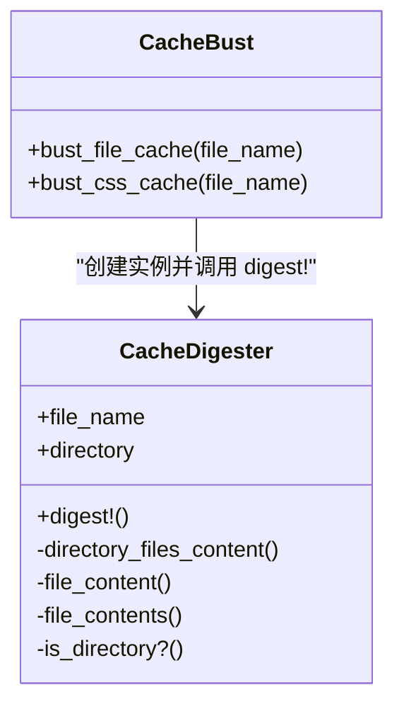
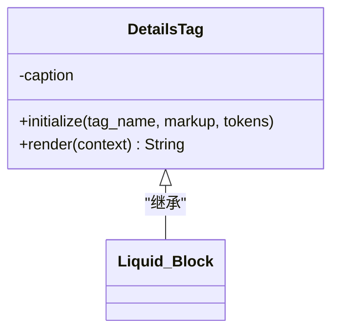
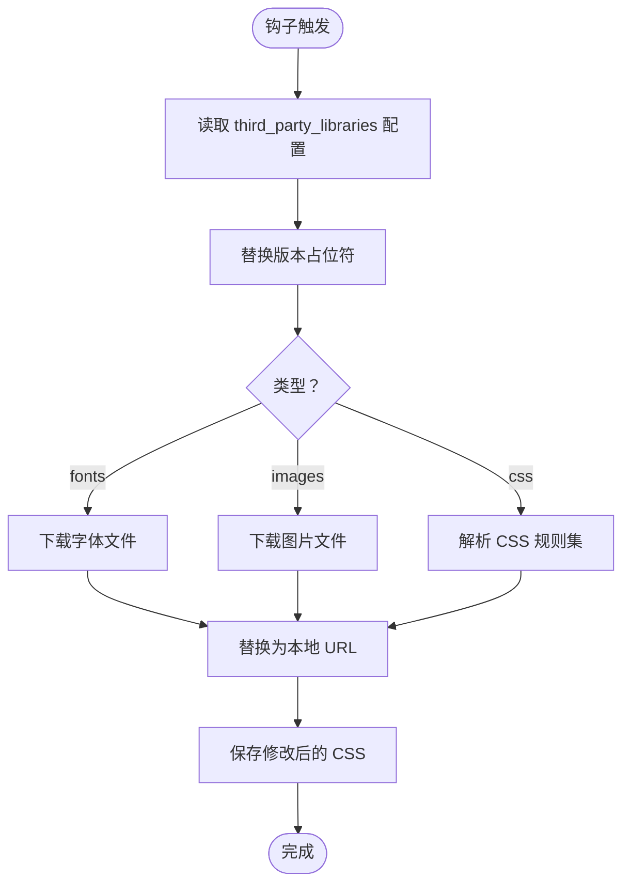
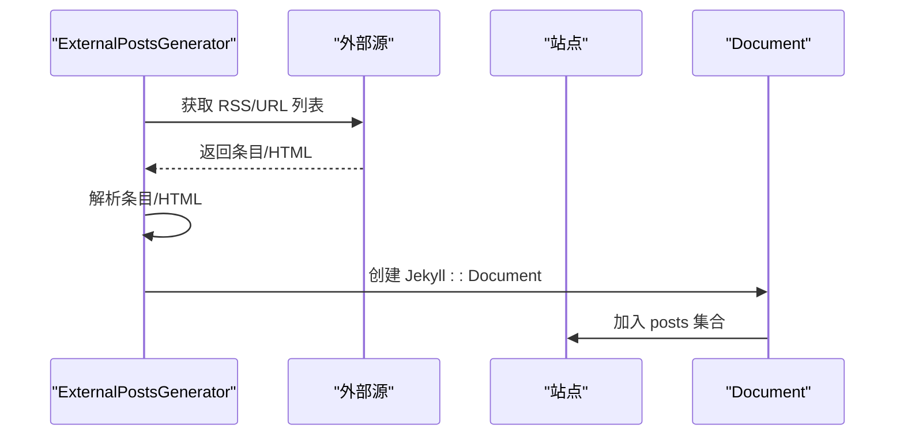
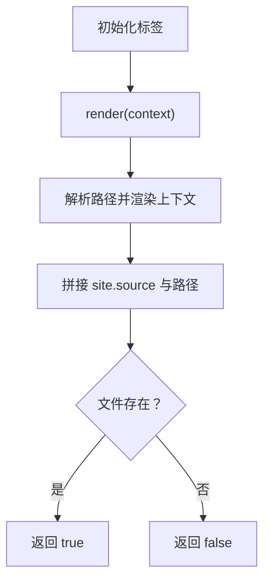
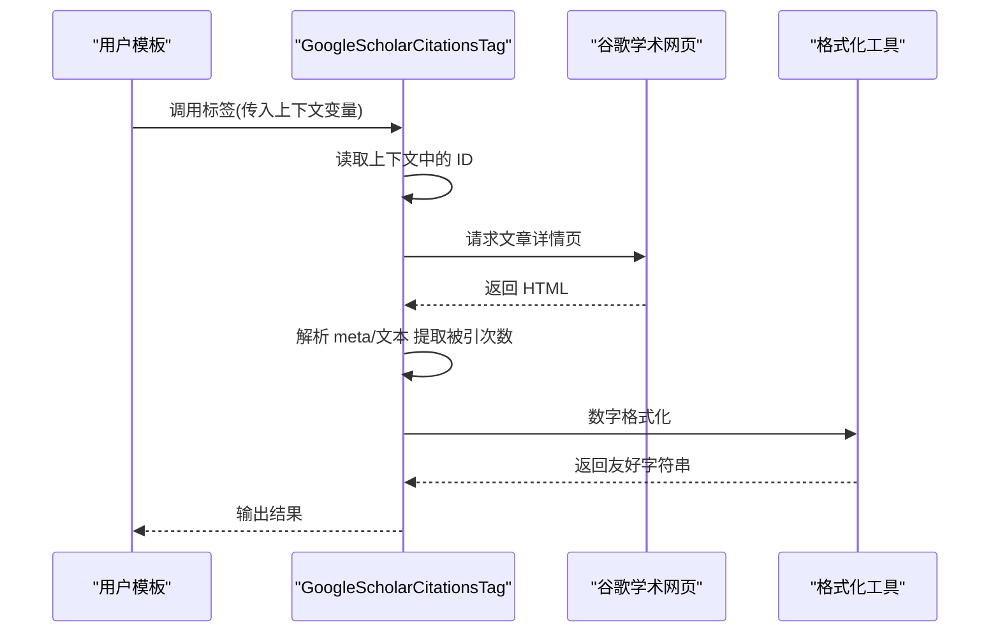
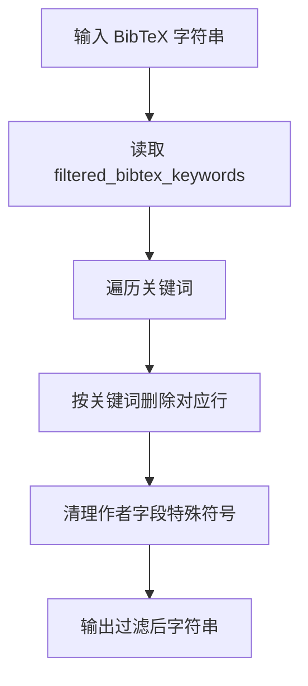
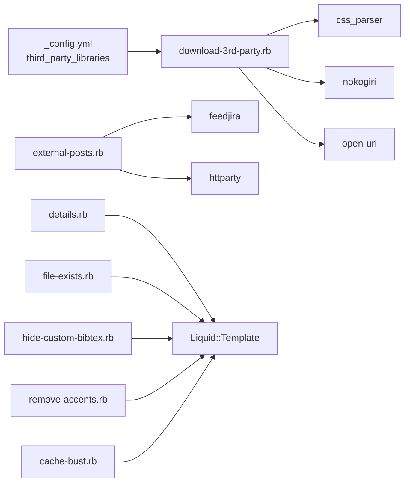

# 自定义插件开发

<cite>
**本文引用的文件**
- [_plugins/cache-bust.rb](file://_plugins/cache-bust.rb)
- [_plugins/details.rb](file://_plugins/details.rb)
- [_plugins/download-3rd-party.rb](file://_plugins/download-3rd-party.rb)
- [_plugins/external-posts.rb](file://_plugins/external-posts.rb)
- [_plugins/file-exists.rb](file://_plugins/file-exists.rb)
- [_plugins/google-scholar-citations.rb](file://_plugins/google-scholar-citations.rb)
- [_plugins/hide-custom-bibtex.rb](file://_plugins/hide-custom-bibtex.rb)
- [_plugins/inspirehep-citations.rb](file://_plugins/inspirehep-citations.rb)
- [_plugins/remove-accents.rb](file://_plugins/remove-accents.rb)
- [_config.yml](file://_config.yml)
- [Gemfile](file://Gemfile)
- [_layouts/default.liquid](file://_layouts/default.liquid)
- [_includes/scripts.liquid](file://_includes/scripts.liquid)
</cite>

## 目录
1. [简介](#简介)
2. [项目结构](#项目结构)
3. [核心组件](#核心组件)
4. [架构总览](#架构总览)
5. [详细组件分析](#详细组件分析)
6. [依赖关系分析](#依赖关系分析)
7. [性能考量](#性能考量)
8. [故障排查指南](#故障排查指南)
9. [结论](#结论)
10. [附录](#附录)

## 简介
本指南面向希望在 Jekyll 中开发自定义 Ruby 插件的开发者，结合仓库中现有的多个插件（如缓存戳、细节块、第三方资源下载、外部文章抓取、文件存在性判断、谷歌学术与 Inspire HEP 引用计数、BibTeX 过滤器、去重音字符串等），系统讲解 Jekyll 插件的基本架构、生命周期钩子、数据处理流程与模板交互方式，并提供从简单文本处理到复杂网络请求与文件操作的完整开发示例路径与最佳实践。

## 项目结构
Jekyll 插件位于站点根目录的 _plugins 文件夹中，采用 Ruby 脚本形式直接加载。插件通过以下方式参与构建：
- 注册 Liquid 标签或过滤器，供模板使用
- 使用 Jekyll Hooks 在站点生命周期关键阶段执行逻辑
- 生成或修改文档集合，影响最终页面输出

图表来源
- [_config.yml](file://_config.yml)
- [_plugins/cache-bust.rb](file://_plugins/cache-bust.rb)
- [_plugins/download-3rd-party.rb](file://_plugins/download-3rd-party.rb)
- [_plugins/external-posts.rb](file://_plugins/external-posts.rb)
- [_layouts/default.liquid](file://_layouts/default.liquid)
- [_includes/scripts.liquid](file://_includes/scripts.liquid)

章节来源
- [_config.yml](file://_config.yml)
- [_plugins/cache-bust.rb](file://_plugins/cache-bust.rb)
- [_plugins/download-3rd-party.rb](file://_plugins/download-3rd-party.rb)
- [_plugins/external-posts.rb](file://_plugins/external-posts.rb)
- [_layouts/default.liquid](file://_layouts/default.liquid)
- [_includes/scripts.liquid](file://_includes/scripts.liquid)

## 核心组件
本节概述 Jekyll 插件开发的关键要素与在仓库中的体现：
- 插件注册机制
  - 注册 Liquid 标签：通过向 Liquid::Template 注册标签类，使模板中可直接使用自定义标签语法
  - 注册 Liquid 过滤器：通过向 Liquid::Template 注册模块或方法，使过滤器可在模板表达式中使用
- 生命周期钩子
  - 使用 Jekyll::Hooks.register 在特定阶段注入逻辑，如站点初始化后进行资源下载与替换
- 数据处理流程
  - 访问 site 对象与 converters，解析 Markdown 或 HTML 内容
  - 通过 context 访问 Liquid 变量，实现动态内容生成
- 模板系统交互
  - 通过 Liquid::Tag 与 Liquid::Block 的 initialize 与 render 方法，接收参数与上下文，返回最终 HTML 片段
  - 通过过滤器对输入字符串进行转换，如去除重音、隐藏特定 BibTeX 关键词等

章节来源
- [_plugins/details.rb](file://_plugins/details.rb)
- [_plugins/file-exists.rb](file://_plugins/file-exists.rb)
- [_plugins/hide-custom-bibtex.rb](file://_plugins/hide-custom-bibtex.rb)
- [_plugins/remove-accents.rb](file://_plugins/remove-accents.rb)
- [_plugins/download-3rd-party.rb](file://_plugins/download-3rd-party.rb)
- [_plugins/external-posts.rb](file://_plugins/external-posts.rb)

## 架构总览
下图展示了站点构建过程中插件与模板系统的交互关系，以及钩子触发点：

图表来源
- [_plugins/download-3rd-party.rb](file://_plugins/download-3rd-party.rb)
- [_plugins/external-posts.rb](file://_plugins/external-posts.rb)
- [_plugins/details.rb](file://_plugins/details.rb)
- [_plugins/hide-custom-bibtex.rb](file://_plugins/hide-custom-bibtex.rb)
- [_plugins/remove-accents.rb](file://_plugins/remove-accents.rb)

## 详细组件分析

### 组件一：缓存戳插件（cache-bust）
- 功能要点
  - 提供文件级与目录级缓存戳计算能力，用于在模板中追加查询参数以绕过浏览器缓存
  - 通过注册为过滤器，可在模板中直接调用
- 实现模式
  - 定义内部类负责计算摘要与拼接参数
  - 暴露顶层方法供过滤器注册
  - 过滤器注册时将模块方法注册为 Liquid 过滤器
- 最佳实践
  - 将资源路径映射到实际文件，避免跨域或路径不一致导致的缓存失效
  - 对目录聚合内容时，确保包含所有相关文件的哈希

图表来源
- [_plugins/cache-bust.rb](file://_plugins/cache-bust.rb)

章节来源
- [_plugins/cache-bust.rb](file://_plugins/cache-bust.rb)

### 组件二：细节块标签（details）
- 功能要点
  - 实现一个 Liquid Block 标签，支持在 Markdown 中包裹内容，并自动转为 HTML details/summary 结构
  - 使用站点的 Markdown 转换器解析标题与正文
- 实现模式
  - 继承 Liquid::Block，重写 initialize 与 render
  - 在 render 中获取 site 与 converter，完成内容转换与包装
- 最佳实践
  - 注意 Markdown 转换器的使用顺序与结果清理（如移除段落标签）

图表来源
- [_plugins/details.rb](file://_plugins/details.rb)

章节来源
- [_plugins/details.rb](file://_plugins/details.rb)

### 组件三：第三方资源下载（download-3rd-party）
- 功能要点
  - 在站点初始化后，根据配置下载字体、图片与 CSS 中的远程资源，并替换为本地链接
  - 支持基于 baseurl 的路径拼接与版本占位符替换
- 实现模式
  - 使用 Jekyll::Hooks.register :site, :after_init 注册钩子
  - 解析 CSS 规则集，提取 url 并下载资源
  - 将远程 URL 替换为本地相对路径，考虑 baseurl
- 最佳实践
  - 对下载前的安全检查（排除危险协议）与幂等性（已存在则跳过）
  - 合理的日志输出与异常捕获

图表来源
- [_plugins/download-3rd-party.rb](file://_plugins/download-3rd-party.rb)
- [_config.yml](file://_config.yml)

章节来源
- [_plugins/download-3rd-party.rb](file://_plugins/download-3rd-party.rb)
- [_config.yml](file://_config.yml)

### 组件四：外部文章生成器（external-posts）
- 功能要点
  - 作为 Jekyll::Generator，在构建阶段抓取外部 RSS 或指定 URL 列表，生成新的文章文档并加入 posts 集合
- 实现模式
  - 继承 Jekyll::Generator，设置安全标志与优先级
  - 通过 HTTP 请求获取内容，解析 HTML 提取标题、描述与正文
  - 使用 Jekyll::Document 创建新文档并填充元数据
- 最佳实践
  - 对日期格式进行统一解析与转换
  - 对标题与 slug 做健壮的清洗与回退策略

图表来源
- [_plugins/external-posts.rb](file://_plugins/external-posts.rb)

章节来源
- [_plugins/external-posts.rb](file://_plugins/external-posts.rb)

### 组件五：文件存在性标签（file-exists）
- 功能要点
  - 提供 Liquid 标签，判断站点源目录下的文件是否存在
- 实现模式
  - 继承 Liquid::Tag，解析路径并结合 site.source 组合绝对路径
  - 使用 Liquid::Template.parse 渲染上下文变量后再判断

图表来源
- [_plugins/file-exists.rb](file://_plugins/file-exists.rb)

章节来源
- [_plugins/file-exists.rb](file://_plugins/file-exists.rb)

### 组件六：谷歌学术引用计数（google-scholar-citations）
- 功能要点
  - 通过访问谷歌学术页面，解析“被引次数”并进行人性化数字格式化
  - 使用内存缓存避免重复请求
- 实现模式
  - 注册为 Liquid 标签，接受学者 ID 与文章 ID 参数
  - 使用 Nokogiri 解析页面，正则提取被引次数
  - 使用 ActiveSupport 的数字格式化工具美化显示

图表来源
- [_plugins/google-scholar-citations.rb](file://_plugins/google-scholar-citations.rb)

章节来源
- [_plugins/google-scholar-citations.rb](file://_plugins/google-scholar-citations.rb)

### 组件七：BibTeX 过滤器（hide-custom-bibtex）
- 功能要点
  - 从输入字符串中按关键词删除整行，同时清理作者字段中的特殊符号
- 实现模式
  - 注册为过滤器，读取站点配置中的关键词列表
  - 使用正则逐个替换匹配行

图表来源
- [_plugins/hide-custom-bibtex.rb](file://_plugins/hide-custom-bibtex.rb)
- [_config.yml](file://_config.yml)

章节来源
- [_plugins/hide-custom-bibtex.rb](file://_plugins/hide-custom-bibtex.rb)
- [_config.yml](file://_config.yml)

### 组件八：去重音字符串（remove-accents）
- 功能要点
  - 将带重音的字符转为 ASCII 近似字符，便于生成 URL 或文件名
- 实现模式
  - 注册为过滤器，使用 i18n.transliterate 完成转换

章节来源
- [_plugins/remove-accents.rb](file://_plugins/remove-accents.rb)

### 组件九：模板集成示例（脚本与缓存戳）
- 功能要点
  - 在页面脚本加载处使用过滤器为静态资源添加缓存戳
- 实现模式
  - 在 Liquid 模板中调用过滤器，将资源路径与查询参数拼接

章节来源
- [_includes/scripts.liquid](file://_includes/scripts.liquid)
- [_plugins/cache-bust.rb](file://_plugins/cache-bust.rb)

## 依赖关系分析
- 插件与站点配置
  - 第三方库配置集中于 _config.yml 的 third_party_libraries 字段，插件在钩子中读取并据此下载与替换
- 插件与 Ruby 生态
  - 下载插件依赖 css_parser、nokogiri、open-uri 等；外部文章插件依赖 feedjira、httparty
- 插件与 Jekyll 核心
  - 通过 Jekyll::Hooks 与 Generator 接口参与构建流程
  - 通过 Liquid::Template.register_tag/register_filter 与模板系统交互

图表来源
- [_config.yml](file://_config.yml)
- [_plugins/download-3rd-party.rb](file://_plugins/download-3rd-party.rb)
- [_plugins/external-posts.rb](file://_plugins/external-posts.rb)
- [_plugins/details.rb](file://_plugins/details.rb)
- [_plugins/file-exists.rb](file://_plugins/file-exists.rb)
- [_plugins/hide-custom-bibtex.rb](file://_plugins/hide-custom-bibtex.rb)
- [_plugins/remove-accents.rb](file://_plugins/remove-accents.rb)
- [_plugins/cache-bust.rb](file://_plugins/cache-bust.rb)

章节来源
- [_config.yml](file://_config.yml)
- [_plugins/download-3rd-party.rb](file://_plugins/download-3rd-party.rb)
- [_plugins/external-posts.rb](file://_plugins/external-posts.rb)
- [_plugins/details.rb](file://_plugins/details.rb)
- [_plugins/file-exists.rb](file://_plugins/file-exists.rb)
- [_plugins/hide-custom-bibtex.rb](file://_plugins/hide-custom-bibtex.rb)
- [_plugins/remove-accents.rb](file://_plugins/remove-accents.rb)
- [_plugins/cache-bust.rb](file://_plugins/cache-bust.rb)

## 性能考量
- 减少网络请求与 IO
  - 使用内存缓存（如引用计数插件中的哈希表）避免重复请求
  - 对已存在的本地资源跳过下载，保持幂等性
- 控制模板渲染开销
  - 过滤器应尽量轻量，避免在 render 中做重型计算
  - 将耗时任务放在钩子阶段而非每页渲染阶段
- 资源管理
  - 对大文件或大量资源的下载，考虑分批与并发限制
  - 使用 baseurl 与相对路径减少模板层的字符串拼接成本

## 故障排查指南
- 常见问题与定位
  - 网络请求失败：检查 URL 是否正确、是否需要伪造 User-Agent、是否被目标站点反爬
  - 路径不一致：确认 site.source 与模板中的相对路径组合是否正确
  - 模板变量为空：确认 Liquid 上下文中变量名与作用域
- 错误处理建议
  - 在插件中使用 begin/rescue 捕获异常，记录错误日志并返回默认值
  - 对外部依赖（网络、文件系统）增加超时与重试策略
- 调试技巧
  - 在钩子与标签中打印关键中间状态（如解析到的 URL、生成的文档数据）
  - 使用最小化示例验证单个插件行为，再逐步集成

章节来源
- [_plugins/google-scholar-citations.rb](file://_plugins/google-scholar-citations.rb)
- [_plugins/inspirehep-citations.rb](file://_plugins/inspirehep-citations.rb)
- [_plugins/download-3rd-party.rb](file://_plugins/download-3rd-party.rb)
- [_plugins/external-posts.rb](file://_plugins/external-posts.rb)

## 结论
通过本指南，你可以基于现有插件的实现模式，快速开发符合 Jekyll 架构的自定义 Ruby 插件。建议从简单过滤器与标签入手，逐步掌握钩子与 Generator 的使用，最终实现从文本处理到网络请求与文件操作的完整功能。在开发过程中，重视错误处理、性能优化与模板交互的一致性，确保插件在不同环境下稳定运行。

## 附录

### 插件开发步骤清单
- 明确需求与生命周期阶段
  - 是否需要在构建前准备资源（钩子）还是在渲染时生成内容（标签/过滤器）
- 设计接口与参数
  - 标签：在 initialize 中解析参数；过滤器：在 render 或模块方法中处理输入
- 实现与注册
  - 使用 Liquid::Template.register_tag/register_filter 注册
  - 使用 Jekyll::Hooks.register 注册钩子
- 读取配置与上下文
  - 通过 context.registers[:site] 访问 site 对象与配置
  - 通过 site.find_converter_instance 获取 Markdown 转换器
- 测试与调试
  - 在本地预览模式下验证输出
  - 打印中间状态，逐步缩小问题范围

### 模板系统交互要点
- Liquid 变量与过滤器
  - 在标签中通过 context 访问变量；在过滤器中直接处理字符串
- 布局与包含文件
  - 在 _layouts 与 _includes 中通过过滤器增强资源加载（如缓存戳）

章节来源
- [_plugins/details.rb](file://_plugins/details.rb)
- [_plugins/file-exists.rb](file://_plugins/file-exists.rb)
- [_plugins/hide-custom-bibtex.rb](file://_plugins/hide-custom-bibtex.rb)
- [_plugins/remove-accents.rb](file://_plugins/remove-accents.rb)
- [_includes/scripts.liquid](file://_includes/scripts.liquid)
- [_layouts/default.liquid](file://_layouts/default.liquid)