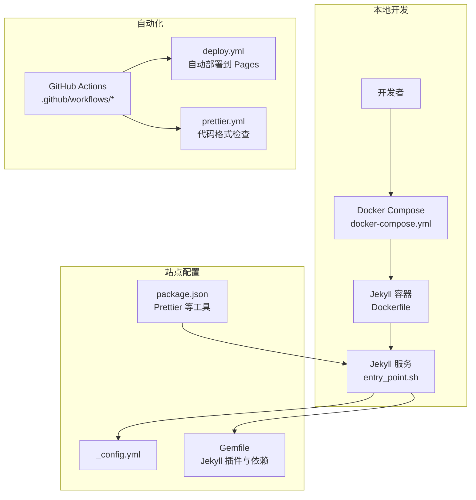
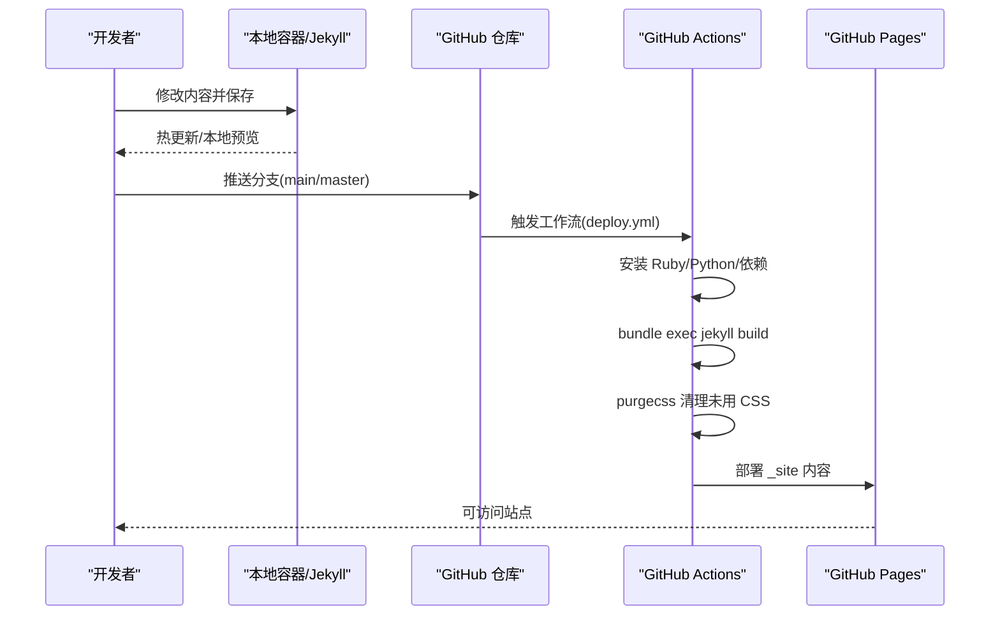
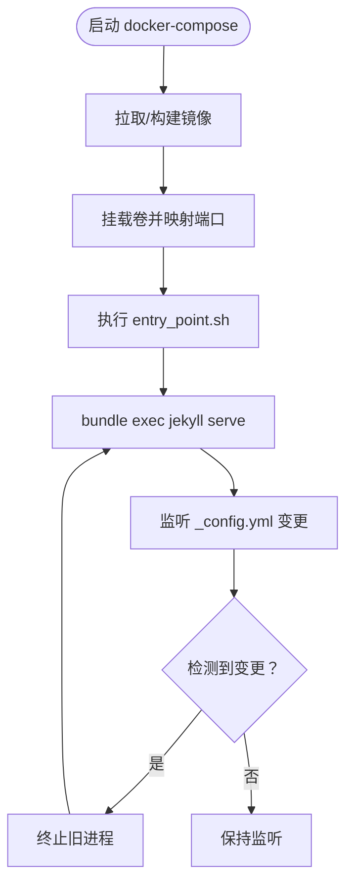
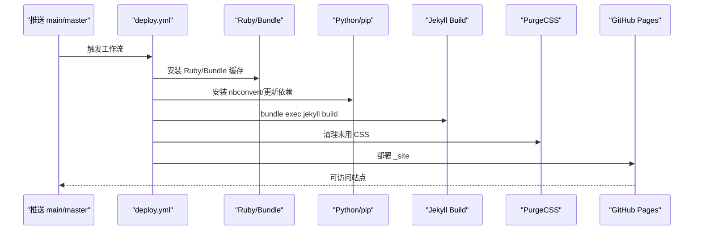
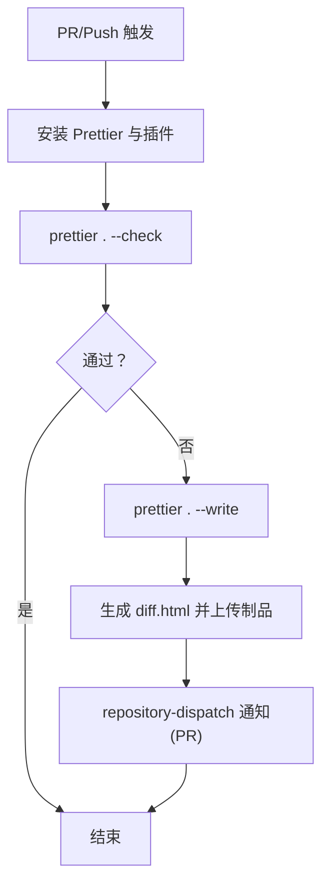
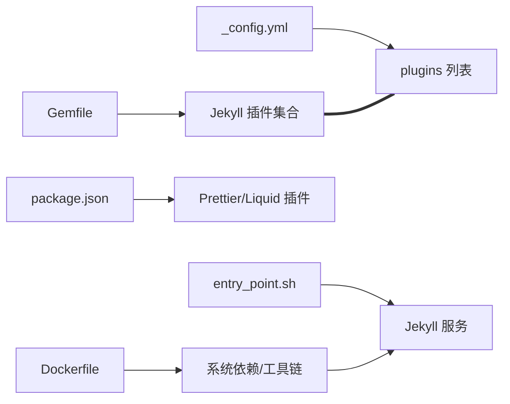

# 故障排除和常见问题

<cite>
**本文引用的文件**
- [README.md](file://README.md)
- [INSTALL.md](file://INSTALL.md)
- [FAQ.md](file://FAQ.md)
- [_config.yml](file://_config.yml)
- [Gemfile](file://Gemfile)
- [package.json](file://package.json)
- [Dockerfile](file://Dockerfile)
- [docker-compose.yml](file://docker-compose.yml)
- [bin/entry_point.sh](file://bin/entry_point.sh)
- [.github/workflows/deploy.yml](file://.github/workflows/deploy.yml)
- [.github/workflows/prettier.yml](file://.github/workflows/prettier.yml)
- [.github/ISSUE_TEMPLATE/1_bug_report.yml](file://.github/ISSUE_TEMPLATE/1_bug_report.yml)
</cite>

## 目录
1. [简介](#简介)
2. [项目结构](#项目结构)
3. [核心组件](#核心组件)
4. [架构总览](#架构总览)
5. [详细组件分析](#详细组件分析)
6. [依赖关系分析](#依赖关系分析)
7. [性能考虑](#性能考虑)
8. [故障排除指南](#故障排除指南)
9. [结论](#结论)
10. [附录](#附录)

## 简介
本指南面向使用 al-folio 的用户，聚焦于安装与环境配置、构建与部署、性能与资源优化、调试与日志分析等常见问题的系统化排查与解决路径。内容基于仓库内的官方文档与自动化工作流，帮助你在本地开发、容器化运行以及 GitHub Pages 自动部署过程中快速定位并解决问题。

## 项目结构
本项目采用 Jekyll 静态站点生成器，结合 Ruby 生态（Bundler）与 Node 生态（Prettier），并通过 GitHub Actions 实现自动部署与质量检查。关键目录与文件职责概览：
- 根配置：_config.yml 控制站点元数据、插件、第三方库版本与行为开关
- 构建与依赖：Gemfile 定义 Jekyll 核心插件与外部依赖；package.json 提供 Prettier 工具链
- 容器化：Dockerfile 与 docker-compose.yml 提供可复现的本地开发环境
- 自动化：.github/workflows 下的工作流负责部署、代码格式化、链接检测等
- 入口脚本：bin/entry_point.sh 在容器内启动 Jekyll 并监听配置变更

**图表来源**
- [docker-compose.yml:1-22](file://docker-compose.yml#L1-L22)
- [Dockerfile:1-77](file://Dockerfile#L1-L77)
- [bin/entry_point.sh:1-38](file://bin/entry_point.sh#L1-L38)
- [_config.yml:1-646](file://_config.yml#L1-L646)
- [Gemfile:1-39](file://Gemfile#L1-L39)
- [package.json:1-10](file://package.json#L1-L10)
- [.github/workflows/deploy.yml:1-106](file://.github/workflows/deploy.yml#L1-L106)
- [.github/workflows/prettier.yml:1-49](file://.github/workflows/prettier.yml#L1-L49)

**章节来源**
- [README.md:262-273](file://README.md#L262-L273)
- [INSTALL.md:1-252](file://INSTALL.md#L1-L252)

## 核心组件
- 站点配置与行为开关：通过 _config.yml 统一管理站点标题、URL、baseurl、插件启用、第三方库版本与分析/验证开关等
- Ruby 依赖与插件：Gemfile 声明 Jekyll 核心插件组与外部依赖组，确保构建稳定性
- Node/Prettier 质量控制：package.json 引入 Prettier 及 Liquid 插件，配合 GitHub Actions 工作流进行格式校验
- 容器化本地环境：Dockerfile 与 docker-compose.yml 提供隔离且可复现的开发环境，entry_point.sh 负责启动与热重载
- 自动部署与质量门禁：deploy.yml 将构建产物发布至 GitHub Pages；prettier.yml 在 PR/Push 场景下强制代码风格

**章节来源**
- [_config.yml:1-646](file://_config.yml#L1-L646)
- [Gemfile:1-39](file://Gemfile#L1-L39)
- [package.json:1-10](file://package.json#L1-L10)
- [Dockerfile:1-77](file://Dockerfile#L1-L77)
- [docker-compose.yml:1-22](file://docker-compose.yml#L1-L22)
- [bin/entry_point.sh:1-38](file://bin/entry_point.sh#L1-L38)
- [.github/workflows/deploy.yml:1-106](file://.github/workflows/deploy.yml#L1-L106)
- [.github/workflows/prettier.yml:1-49](file://.github/workflows/prettier.yml#L1-L49)

## 架构总览
以下序列图展示从本地修改到 GitHub Pages 发布的关键流程，以及常见失败点与修复建议：

**图表来源**
- [.github/workflows/deploy.yml:67-106](file://.github/workflows/deploy.yml#L67-L106)
- [bin/entry_point.sh:22-27](file://bin/entry_point.sh#L22-L27)

**章节来源**
- [INSTALL.md:129-202](file://INSTALL.md#L129-L202)
- [.github/workflows/deploy.yml:1-106](file://.github/workflows/deploy.yml#L1-L106)

## 详细组件分析

### 容器化本地开发（Docker）
- 适用场景：避免本地 Ruby/Node/系统依赖差异导致的“在我机子上能跑”的问题
- 关键点：
  - 使用官方 Ruby Slim 镜像，安装构建工具、Git、Imagemagick、Node.js、Python3-pip 等
  - 通过 docker-compose 挂载当前目录到容器内 /srv/jekyll，并映射 8080/35729 端口
  - entry_point.sh 启动 Jekyll 并监听 _config.yml 变更实现热重启
- 常见问题与处理：
  - 权限问题：若出现缓存目录写入权限错误，可参考 Dockerfile 注释段调整非 root 用户或清理缓存
  - 依赖缺失：首次运行时执行 bundle install 或按 FAQ 中“Have Bugs on Docker Image?”指引进入容器修复
  - 端口占用：确认 8080/35729 未被占用，或调整 docker-compose 映射端口

**图表来源**
- [docker-compose.yml:1-22](file://docker-compose.yml#L1-L22)
- [Dockerfile:1-77](file://Dockerfile#L1-L77)
- [bin/entry_point.sh:1-38](file://bin/entry_point.sh#L1-L38)

**章节来源**
- [INSTALL.md:45-108](file://INSTALL.md#L45-L108)
- [Dockerfile:1-77](file://Dockerfile#L1-L77)
- [docker-compose.yml:1-22](file://docker-compose.yml#L1-L22)
- [bin/entry_point.sh:1-38](file://bin/entry_point.sh#L1-L38)

### 自动部署到 GitHub Pages
- 自动部署触发条件：推送 main/master 分支或手动触发 workflow_dispatch
- 关键步骤：
  - 安装 Ruby/Python 并缓存依赖
  - 更新 giscus.repo 字段为当前仓库
  - 安装 Imagemagick 与 nbconvert，设置 JEKYLL_ENV=production
  - 执行 jekyll build 与 purgecss 清理未用 CSS
  - 使用 github-pages-deploy-action 部署 _site
- 常见问题与处理：
  - 部署分支错误：必须将 Pages 源设置为 gh-pages（FAQ 指出需设置为 gh-pages）
  - 自定义域名丢失：需要在仓库 main/source 分支添加 CNAME 文件
  - 依赖冲突：升级到最新模板版本，或重新安装依赖后提交 Gemfile.lock

**图表来源**
- [.github/workflows/deploy.yml:67-106](file://.github/workflows/deploy.yml#L67-L106)

**章节来源**
- [INSTALL.md:129-202](file://INSTALL.md#L129-L202)
- [FAQ.md:25-36](file://FAQ.md#L25-L36)
- [.github/workflows/deploy.yml:1-106](file://.github/workflows/deploy.yml#L1-L106)

### 代码格式化与质量门禁（Prettier）
- 触发时机：对 main/master 的 PR/Push
- 行为：
  - 安装 Prettier 与 Shopify Liquid 插件
  - 执行 --check 校验；失败时生成 diff.html 并上传为工作流制品
  - 在 PR 场景下通过 repository-dispatch 通知
- 常见问题与处理：
  - 本地与 CI 格式不一致：在本地安装 Prettier 并执行 --write；或使用 Dev Container/IDE 插件
  - 无法通过校验：根据 diff.html 定位差异并修正

**图表来源**
- [.github/workflows/prettier.yml:14-49](file://.github/workflows/prettier.yml#L14-L49)

**章节来源**
- [FAQ.md:65-74](file://FAQ.md#L65-L74)
- [.github/workflows/prettier.yml:1-49](file://.github/workflows/prettier.yml#L1-L49)

### 配置与路径问题（URL/Baseurl）
- 个人/组织页：url 设置为 https://<username>.github.io，baseurl 留空
- 项目页：url 仍为 https://<username>.github.io，baseurl 设为 /<repo-name>/
- 若 CSS/JS 未加载或布局错乱：检查 _config.yml 中 url/baseurl 是否与实际部署路径一致；浏览器强制刷新或使用隐私模式验证缓存问题
- RSS/Atom Feed：确保 title/url/description/author 正确配置

**章节来源**
- [INSTALL.md:134-148](file://INSTALL.md#L134-L148)
- [FAQ.md:37-52](file://FAQ.md#L37-L52)
- [_config.yml:23-25](file://_config.yml#L23-L25)

### 插件与依赖冲突
- jekyll-diagrams 已弃用：模板改用 mermaid.js，升级模板即可消除该依赖
- classifier-reborn 导致“Zero vectors”或 sqrt 报错：通常由空/极短内容引起；可在单个文章 front matter 添加 related_posts: false，或在 _config.yml 关闭 lsi
- 旧版依赖/动作过期：出现 Node.js 16/12 过期或 uri 版本冲突提示时，升级模板版本并合并差异

**章节来源**
- [FAQ.md:53-94](file://FAQ.md#L53-L94)
- [Gemfile:1-39](file://Gemfile#L1-L39)
- [INSTALL.md:236-251](file://INSTALL.md#L236-L251)

### 第三方库版本与图标更新
- 第三方库版本：通过 _config.yml third_party_libraries 字段统一管理版本与完整性哈希
- 图标库更新：Academicons/Font Awesome/Tabler Icons 的更新步骤已在 FAQ 中给出

**章节来源**
- [_config.yml:403-624](file://_config.yml#L403-L624)
- [FAQ.md:100-111](file://FAQ.md#L100-L111)

## 依赖关系分析
- Jekyll 插件生态：Gemfile 的 :jekyll_plugins 组合与 _config.yml 的 plugins 列表需保持一致，避免“插件未启用/未知标签”类错误
- Node 工具链：package.json 的 Prettier 与 Liquid 插件用于本地/CI 格式化
- 容器镜像：Dockerfile 安装 Ruby、Bundler、Imagemagick、Node.js、Python3-pip 等，entry_point.sh 负责启动与监听

**图表来源**
- [Gemfile:1-39](file://Gemfile#L1-L39)
- [_config.yml:200-219](file://_config.yml#L200-L219)
- [package.json:1-10](file://package.json#L1-L10)
- [Dockerfile:22-40](file://Dockerfile#L22-L40)
- [bin/entry_point.sh:22-27](file://bin/entry_point.sh#L22-L27)

**章节来源**
- [Gemfile:1-39](file://Gemfile#L1-L39)
- [_config.yml:200-219](file://_config.yml#L200-L219)
- [package.json:1-10](file://package.json#L1-L10)
- [Dockerfile:1-77](file://Dockerfile#L1-L77)
- [bin/entry_point.sh:1-38](file://bin/entry_point.sh#L1-L38)

## 性能考虑
- 图片懒加载与响应式图片：启用 lazy_loading_images 与 imagemin/imagemagick，减少首屏体积
- CSS/JS 压缩与清理：Jekyll Minifier 与 PurgeCSS 配合使用，移除未用样式
- 第三方库版本与完整性哈希：通过 _config.yml third_party_libraries 管理 CDN 版本与 SRI，提升缓存命中与安全性
- 浏览器缓存与强制刷新：若样式异常，尝试强制刷新或隐私模式验证缓存问题

**章节来源**
- [_config.yml:368-374](file://_config.yml#L368-L374)
- [_config.yml:234-245](file://_config.yml#L234-L245)
- [_config.yml:403-624](file://_config.yml#L403-L624)
- [INSTALL.md:183-202](file://INSTALL.md#L183-L202)

## 故障排除指南

### 安装与环境配置
- 本地运行（推荐 Docker）
  - 确认已安装 Docker 与 docker-compose
  - 首次运行会拉取镜像并启动服务，访问 http://localhost:8080 查看效果
  - 如遇权限问题，参考 Dockerfile 注释段调整用户/组或清理缓存
- 本地运行（传统方式）
  - 需要 Ruby、Bundler、Python、pip 等；按 INSTALL.md 步骤安装后执行 bundle exec jekyll serve
- 开发容器（Dev Containers）
  - VSCode 打开仓库可自动安装必要扩展并一键就绪

**章节来源**
- [INSTALL.md:45-128](file://INSTALL.md#L45-L128)
- [Dockerfile:1-77](file://Dockerfile#L1-L77)
- [docker-compose.yml:1-22](file://docker-compose.yml#L1-L22)

### 构建与部署
- 自动部署未生效
  - 确认已启用 GitHub Actions 并赋予工作流读写权限
  - 确保 Pages 源设置为 gh-pages 分支
- 手动部署
  - 在 Actions 页面点击“Deploy”工作流并“Run workflow”
- 部署后样式/脚本未加载
  - 检查 _config.yml 的 url/baseurl 是否与实际路径一致；强制刷新浏览器或使用隐私模式验证缓存
- 自定义域名
  - 在仓库 main/source 分支添加 CNAME 文件，内容为你的域名

**章节来源**
- [INSTALL.md:129-156](file://INSTALL.md#L129-L156)
- [FAQ.md:29-48](file://FAQ.md#L29-L48)

### 依赖冲突与版本不兼容
- jekyll-diagrams 已弃用
  - 升级模板版本，删除对该 gem 的依赖
- classifier-reborn 报错
  - 对空/极短内容的文章添加 related_posts: false，或关闭 lsi
- 旧版动作/依赖过期
  - 升级模板版本，合并差异；或新建仓库从模板初始化

**章节来源**
- [FAQ.md:53-94](file://FAQ.md#L53-L94)
- [INSTALL.md:236-251](file://INSTALL.md#L236-L251)

### GitHub Pages 部署失败
- Unknown tag 'toc'
  - 确认 Pages 源为 gh-pages 分支
- 权限/凭据问题（密码认证已停用）
  - 将 .git/config 中的 https 改为 ssh
- Lighthouse Badger 工作流缺少 token
  - 在仓库 Secrets 中添加 LIGHTHOUSE_BADGER_TOKEN

**章节来源**
- [FAQ.md:33-35](file://FAQ.md#L33-L35)
- [FAQ.md:57-63](file://FAQ.md#L57-L63)
- [FAQ.md:61-63](file://FAQ.md#L61-L63)

### 资源加载与样式问题
- CSS/JS 未加载或布局错乱
  - 检查 url/baseurl；强制刷新或使用隐私模式
- RSS/Atom Feed 不工作
  - 确保 title/url/description/author 正确配置

**章节来源**
- [FAQ.md:37-52](file://FAQ.md#L37-L52)
- [_config.yml:42-46](file://_config.yml#L42-L46)

### 代码格式化与 CI 失败
- 本地通过但 CI 失败
  - 在本地安装 Prettier 并执行 --write；或使用 Dev Container/IDE 插件
  - 若需临时跳过，可删除 prettier.yml 或在本地忽略该检查（不推荐）

**章节来源**
- [FAQ.md:65-74](file://FAQ.md#L65-L74)
- [.github/workflows/prettier.yml:1-49](file://.github/workflows/prettier.yml#L1-L49)

### 调试技巧与日志分析
- Docker 容器调试
  - docker compose logs 查看容器日志
  - docker compose exec -it jekyll /bin/bash 进入容器
  - 在容器内执行 ./bin/entry_point.sh 或 bundle install 后再启动
- GitHub Actions 日志
  - 在 Actions 标签页查看具体步骤输出，定位安装/构建/部署阶段的错误
- 本地热重载
  - entry_point.sh 会监听 _config.yml 变更并自动重启 Jekyll，便于快速迭代

**章节来源**
- [INSTALL.md:79-107](file://INSTALL.md#L79-L107)
- [bin/entry_point.sh:1-38](file://bin/entry_point.sh#L1-L38)
- [.github/workflows/deploy.yml:67-106](file://.github/workflows/deploy.yml#L67-L106)

### 社区支持与获取帮助
- 讨论区：优先在 GitHub Discussions 的 Q&A 区查找答案
- 问题报告：使用仓库提供的 Bug Report 模板，按要求填写操作系统、环境、复现步骤、错误日志与附加信息
- 文档与 FAQ：先查阅 README 与 FAQ，避免重复提问

**章节来源**
- [README.md:433-435](file://README.md#L433-L435)
- [.github/ISSUE_TEMPLATE/1_bug_report.yml:1-103](file://.github/ISSUE_TEMPLATE/1_bug_report.yml#L1-L103)

### 问题报告标准格式与信息收集清单
- 必填项
  - 问题描述：清晰简洁地说明发生了什么
  - 复现步骤：列出具体操作顺序与预期/实际结果
  - 错误消息与日志：复制完整错误信息与堆栈跟踪
  - 操作系统：选择适用的 OS
  - 出现问题的环境：本地 Docker/Dev Container/无 Docker/已部署站点
- 附加信息
  - 模板版本、Jekyll/Bundler/Ruby/Node 版本（如非容器）
  - 自定义配置片段（如涉及）
  - 截图或部署链接（如适用）

**章节来源**
- [.github/ISSUE_TEMPLATE/1_bug_report.yml:28-98](file://.github/ISSUE_TEMPLATE/1_bug_report.yml#L28-L98)

## 结论
通过遵循本指南的分层排查思路与操作步骤，大多数安装、构建、部署与性能相关的问题均可快速定位并解决。建议优先使用 Docker 本地环境与模板提供的工作流，确保依赖与工具链的一致性；出现问题时结合容器日志与 GitHub Actions 输出进行定位，并按标准格式提交问题报告以获得高效支持。

## 附录
- 相关文档入口
  - 安装与部署：参见 INSTALL.md
  - 常见问题：参见 FAQ.md
  - 配置参考：参见 _config.yml
  - 插件与依赖：参见 Gemfile 与 package.json
  - 自动化工作流：参见 .github/workflows/*

**章节来源**
- [README.md:262-273](file://README.md#L262-L273)
- [INSTALL.md:1-252](file://INSTALL.md#L1-L252)
- [FAQ.md:1-138](file://FAQ.md#L1-L138)
- [_config.yml:1-646](file://_config.yml#L1-L646)
- [Gemfile:1-39](file://Gemfile#L1-L39)
- [package.json:1-10](file://package.json#L1-L10)
- [.github/workflows/deploy.yml:1-106](file://.github/workflows/deploy.yml#L1-L106)
- [.github/workflows/prettier.yml:1-49](file://.github/workflows/prettier.yml#L1-L49)