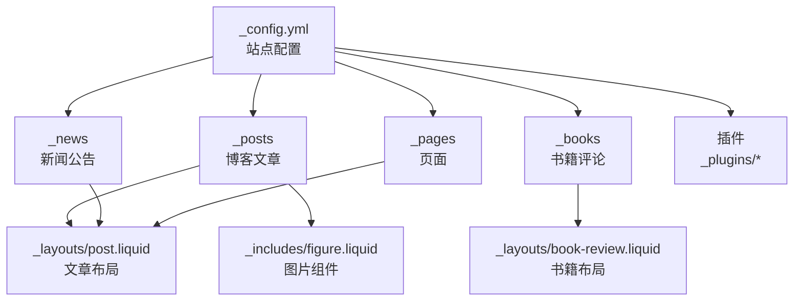
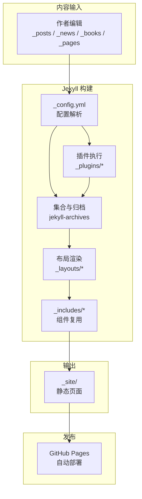
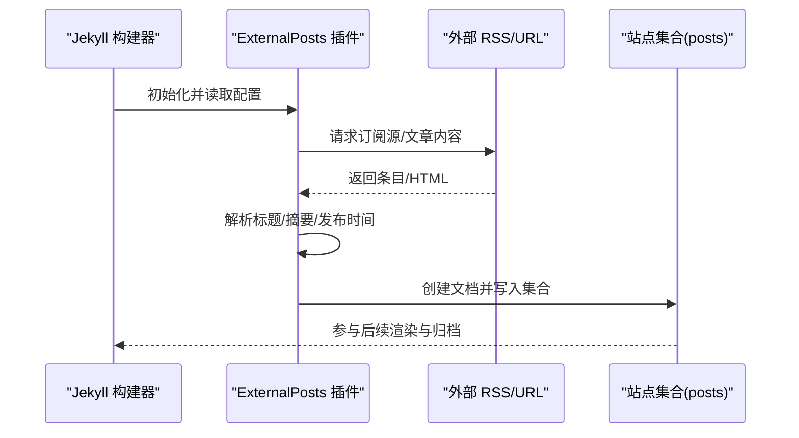
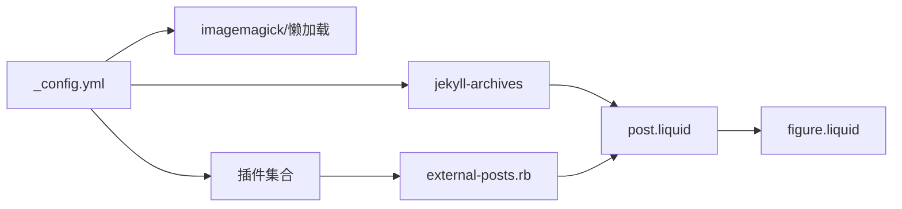

# 内容管理最佳实践

<cite>
**本文档引用的文件**
- [_config.yml](file://_config.yml)
- [README.md](file://README.md)
- [CUSTOMIZE.md](file://CUSTOMIZE.md)
- [INSTALL.md](file://INSTALL.md)
- [_posts/2015-03-15-formatting-and-links.md](file://_posts/2015-03-15-formatting-and-links.md)
- [_posts/2015-05-15-images.md](file://_posts/2015-05-15-images.md)
- [_posts/2015-07-15-code.md](file://_posts/2015-07-15-code.md)
- [_news/announcement_1.md](file://_news/announcement_1.md)
- [_books/the_godfather.md](file://_books/the_godfather.md)
- [_layouts/post.liquid](file://_layouts/post.liquid)
- [_layouts/book-review.liquid](file://_layouts/book-review.liquid)
- [_includes/figure.liquid](file://_includes/figure.liquid)
- [_plugins/external-posts.rb](file://_plugins/external-posts.rb)
- [_pages/about.md](file://_pages/about.md)
</cite>

## 目录
1. [简介](#简介)
2. [项目结构](#项目结构)
3. [核心组件](#核心组件)
4. [架构总览](#架构总览)
5. [详细组件分析](#详细组件分析)
6. [依赖关系分析](#依赖关系分析)
7. [性能考量](#性能考量)
8. [故障排查指南](#故障排查指南)
9. [结论](#结论)
10. [附录](#附录)

## 简介
本文件面向使用 al-folio 主题进行内容创作与维护的作者，系统化总结内容管理最佳实践，覆盖以下方面：
- 写作规范与内容结构：Markdown 语法、标题层级、链接格式、列表与块引用等
- 标签与分类系统：命名约定、层级设计、归档与展示策略、SEO 优化
- 发布流程与质量控制：审核、格式检查、预览验证、自动化部署
- 多语言与国际化：当前主题语言设置与扩展建议
- 图片与多媒体：响应式图片、缩放、嵌入与版权注意
- 更新与维护：定期回顾、过期内容处理、历史版本管理

本指南以仓库现有配置与示例为依据，确保可操作性与一致性。

## 项目结构
al-folio 基于 Jekyll 构建，采用“集合（Collections）+ Front Matter + Liquid 模板”的组织方式。关键目录与职责如下：
- _posts：博客文章集合，按 YYYY-MM-DD-title.md 命名
- _news：新闻/公告集合，用于首页“最新动态”展示
- _books：书籍评论集合，自定义布局与字段
- _pages：页面集合（主页、关于、项目、出版物等）
- _layouts：页面与文章布局模板
- _includes：可复用片段（如图片、图注、评论区等）
- _plugins：扩展插件（如外部 RSS/URL 同步）
- _config.yml：站点配置（语言、归档、插件、第三方集成等）

图表来源
- [_config.yml](file://_config.yml)
- [_posts/2015-03-15-formatting-and-links.md](file://_posts/2015-03-15-formatting-and-links.md)
- [_news/announcement_1.md](file://_news/announcement_1.md)
- [_books/the_godfather.md](file://_books/the_godfather.md)
- [_layouts/post.liquid](file://_layouts/post.liquid)
- [_layouts/book-review.liquid](file://_layouts/book-review.liquid)
- [_includes/figure.liquid](file://_includes/figure.liquid)
- [_plugins/external-posts.rb](file://_plugins/external-posts.rb)

章节来源
- [_config.yml](file://_config.yml)
- [README.md](file://README.md)
- [CUSTOMIZE.md](file://CUSTOMIZE.md)

## 核心组件
- 配置中心：通过 _config.yml 控制语言、归档、插件、第三方服务、图像优化等
- 文章与页面：统一使用 Front Matter 定义元数据（标题、日期、标签、分类、描述等），由对应布局渲染
- 集合系统：news、projects、books 等集合支持独立归档与展示
- 插件生态：外部源同步、数学公式、代码高亮、搜索、归档等
- 质量保障：GitHub Actions 自动化（链接检查、格式化、构建校验）

章节来源
- [_config.yml](file://_config.yml)
- [_layouts/post.liquid](file://_layouts/post.liquid)
- [_plugins/external-posts.rb](file://_plugins/external-posts.rb)

## 架构总览
下图展示从内容输入到静态页面生成的关键路径，以及与第三方服务的交互。

图表来源
- [_config.yml](file://_config.yml)
- [_plugins/external-posts.rb](file://_plugins/external-posts.rb)
- [_layouts/post.liquid](file://_layouts/post.liquid)
- [_includes/figure.liquid](file://_includes/figure.liquid)

## 详细组件分析

### 写作规范与内容结构
- 标题层级
  - 使用 H1 作为文章主标题；正文使用 H2、H3 等逐级递进
  - 避免跳级标题，保持逻辑连贯
- 列表与任务清单
  - 使用有序/无序列表清晰表达要点
  - 任务清单用于进度跟踪，便于读者理解阶段性成果
- 引用与强调
  - 使用块引用突出金句或摘要
  - 使用粗体/斜体强调关键词，避免过度使用
- 链接格式
  - 外部链接默认在新窗口打开，并添加 rel 属性
  - 内部链接使用相对路径，避免硬编码域名
- 代码与公式
  - 代码块使用三反引号包裹，指定语言类型
  - 数学公式启用后可直接使用 MathJax 语法
- 表格与图示
  - 表格简洁明了，必要时配合图示说明
  - 图片使用响应式组件，支持懒加载与缩放

章节来源
- [_posts/2015-03-15-formatting-and-links.md](file://_posts/2015-03-15-formatting-and-links.md)
- [_posts/2015-07-15-code.md](file://_posts/2015-07-15-code.md)
- [_posts/2015-05-15-images.md](file://_posts/2015-05-15-images.md)
- [_includes/figure.liquid](file://_includes/figure.liquid)

### 标签与分类系统
- 元数据字段
  - 标题：用于 SEO 与社交分享
  - 日期：决定排序与归档
  - 标签（tags）：轻量筛选维度
  - 分类（categories）：更宏观的分组
  - 描述（description）：摘要信息，影响预览
- 归档与展示
  - 博文支持按年、标签、分类归档
  - 首页可选择显示特定标签或分类
- 命名约定
  - 标签与分类使用小写、短横线或空格分隔，避免特殊字符
  - 语义明确，避免过长或过于宽泛
- SEO 优化
  - 合理设置 description
  - 使用语义化标签提升可读性
  - 开启 Open Graph 可增强社交分享效果

章节来源
- [_config.yml](file://_config.yml)
- [_layouts/post.liquid](file://_layouts/post.liquid)
- [_posts/2015-03-15-formatting-and-links.md](file://_posts/2015-03-15-formatting-and-links.md)

### 发布流程与质量控制
- 提交流程
  - 在 main 分支进行修改，GitHub Actions 将自动构建并部署到 gh-pages
  - 本地可通过 Docker 或 Jekyll 本地预览
- 质量控制
  - 代码格式：遵循 prettier 规范
  - 链接检查：使用 lychee 检测失效链接
  - 可访问性：手动运行 axe 测试（推荐）
- 预览验证
  - 在本地启动 Jekyll 或 Docker 预览，确认样式、图片、交互正常
  - 对外发布前进行一次全站链接扫描

章节来源
- [INSTALL.md](file://INSTALL.md)
- [README.md](file://README.md)
- [CUSTOMIZE.md](file://CUSTOMIZE.md)

### 多语言内容管理
- 当前语言设置
  - 通过配置项设置站点语言，影响日期格式、部分文案等
- 扩展建议
  - 如需多语言，可在集合中按语言拆分目录，并在布局中根据语言切换显示
  - 保持链接与归档路径的一致性，避免跨语言混淆

章节来源
- [_config.yml](file://_config.yml)

### 图片与多媒体处理
- 响应式图片
  - 使用内置图片组件，自动生成多分辨率 WebP 源集
  - 支持懒加载与缩放，提升性能与体验
- 图片尺寸与对齐
  - 通过 class 与内联样式控制宽度、圆角、阴影等
- 多媒体嵌入
  - 支持视频、音频、图表、流程图等，按需启用相应插件
- 版权与来源
  - 在图注中注明来源，尊重版权

章节来源
- [_posts/2015-05-15-images.md](file://_posts/2015-05-15-images.md)
- [_includes/figure.liquid](file://_includes/figure.liquid)
- [_config.yml](file://_config.yml)

### 内容更新与维护策略
- 定期回顾
  - 季度/年度回顾旧文，更新过时信息与链接
  - 对技术类文章补充最新依赖版本与迁移指引
- 过期内容处理
  - 添加“最后更新”时间戳，必要时标注“已过时”
  - 对明显过时的内容提供替代链接或迁移说明
- 历史版本管理
  - 使用 Git 标签标记重要版本
  - 保留变更日志，记录重大结构调整

章节来源
- [_layouts/post.liquid](file://_layouts/post.liquid)
- [_pages/about.md](file://_pages/about.md)

### 外部内容同步（示例）
- 功能概述
  - 支持从 RSS 或指定 URL 抓取外部文章，注入到博客集合
  - 自动提取标题、摘要与发布时间，生成伪博文
- 使用场景
  - 同步 Medium、个人博客或其他平台文章
- 注意事项
  - 确保目标站点允许抓取
  - 对抓取内容进行二次审校，修正格式与链接

图表来源
- [_plugins/external-posts.rb](file://_plugins/external-posts.rb)
- [_config.yml](file://_config.yml)

章节来源
- [_plugins/external-posts.rb](file://_plugins/external-posts.rb)
- [_config.yml](file://_config.yml)

### 书籍评论布局与字段
- 布局特性
  - 支持开始/结束阅读时间、评分星级、购买链接等
  - 自动从封面源获取封面图（Open Library）
- 字段建议
  - 标签：如“书单”、“Top100”
  - 分类：如“小说/科幻/历史”
  - 评分：1-5 星，支持半星
- 展示策略
  - 首页可按年份/标签/分类归档
  - 详情页提供社交分享与购买入口

章节来源
- [_layouts/book-review.liquid](file://_layouts/book-review.liquid)
- [_books/the_godfather.md](file://_books/the_godfather.md)

## 依赖关系分析
- 配置驱动
  - _config.yml 决定语言、归档、插件、第三方集成与图像优化
- 布局与组件
  - post.liquid 统一文章元数据与导航；figure.liquid 统一图片渲染
- 集合与归档
  - jekyll-archives 生成年/标签/分类归档页
- 外部源
  - external-posts.rb 将外部内容注入集合，参与统一渲染

图表来源
- [_config.yml](file://_config.yml)
- [_layouts/post.liquid](file://_layouts/post.liquid)
- [_includes/figure.liquid](file://_includes/figure.liquid)
- [_plugins/external-posts.rb](file://_plugins/external-posts.rb)

章节来源
- [_config.yml](file://_config.yml)
- [_plugins/external-posts.rb](file://_plugins/external-posts.rb)

## 性能考量
- 图像优化
  - 启用响应式 WebP 生成与懒加载，减少首屏体积
- 代码与资源
  - 合理使用代码高亮与数学公式，避免冗余脚本
- 构建与缓存
  - 使用 Docker 快速复现环境，减少本地差异
- 归档与索引
  - 控制归档数量与层级，避免页面过载

章节来源
- [_config.yml](file://_config.yml)
- [_includes/figure.liquid](file://_includes/figure.liquid)

## 故障排查指南
- 链接失效
  - 使用 lychee 进行批量检测，修复或替换失效链接
- 格式问题
  - 遵循 prettier 规范，提交前本地格式化
- 构建失败
  - 查看 Actions 日志，定位依赖缺失或语法错误
- 图片不显示
  - 检查路径大小写、权限与缓存，确认响应式转换是否启用
- 外部内容未同步
  - 校验 RSS/URL 可达性与返回内容，确认日期格式

章节来源
- [README.md](file://README.md)
- [INSTALL.md](file://INSTALL.md)
- [_plugins/external-posts.rb](file://_plugins/external-posts.rb)

## 结论
通过规范化的写作与结构化的内容管理，结合配置驱动的布局与插件体系，al-folio 能够高效产出高质量的学术/个人主页内容。建议团队建立标准化的审校流程与版本管理机制，持续优化性能与可访问性，确保内容长期可维护与可持续演进。

## 附录
- 快速检查清单
  - 标题层级清晰，描述完整
  - 标签/分类语义明确，数量适中
  - 图片路径正确，懒加载与缩放可用
  - 外链安全（rel/nofollow），内链相对路径
  - 本地预览无异常，链接检查通过
  - 提交前格式化，遵循贡献指南