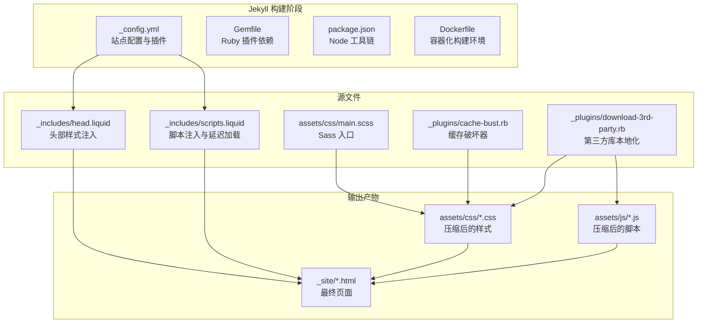
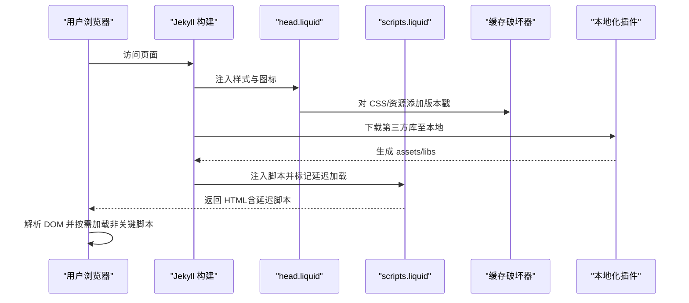
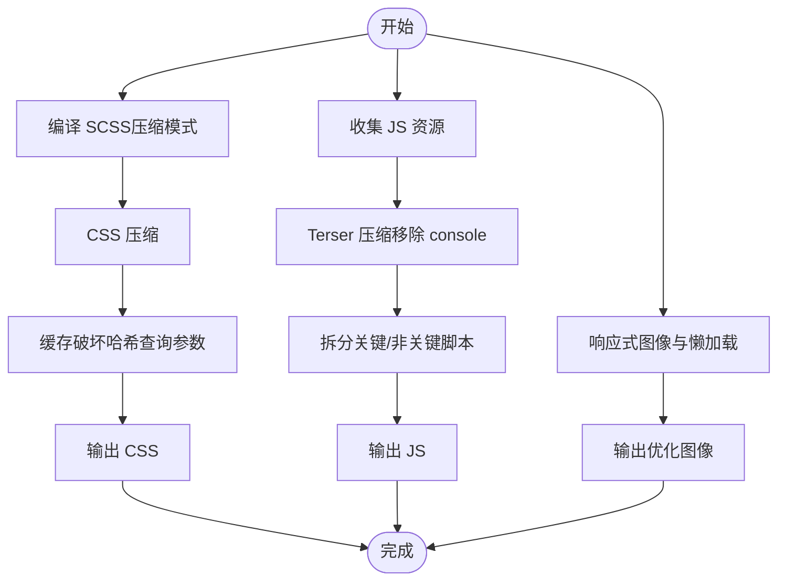
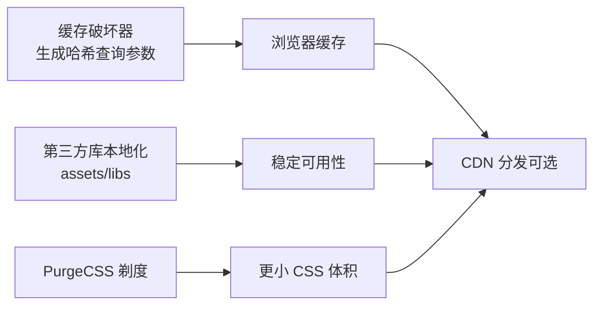
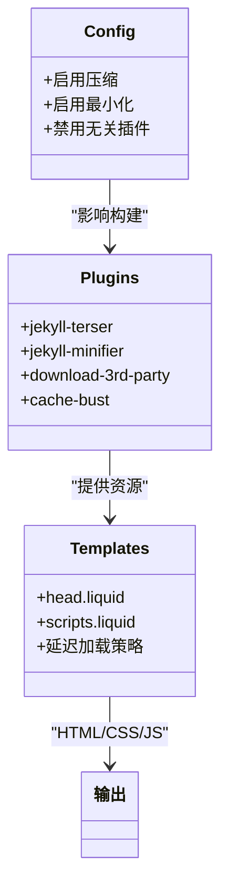
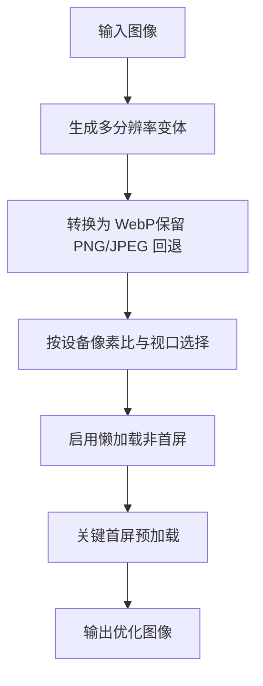
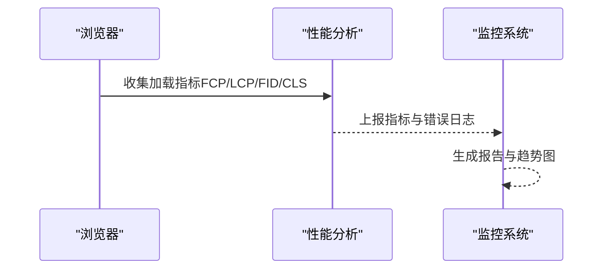
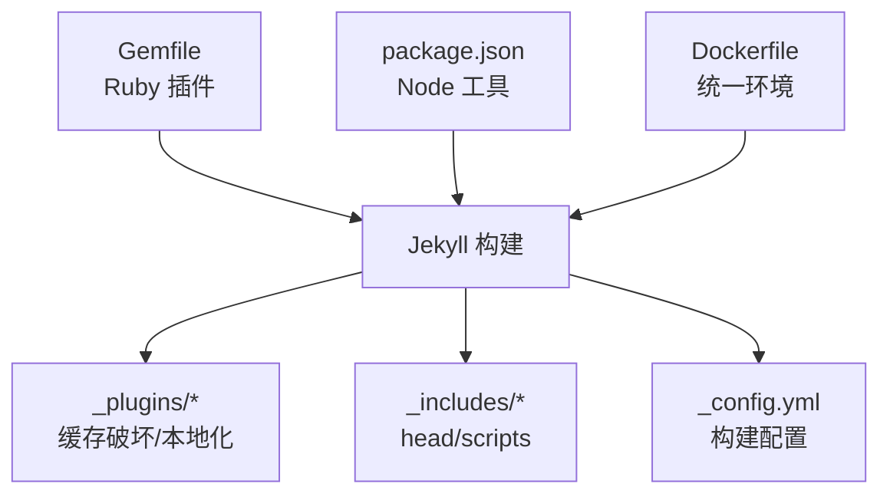

# 性能优化最佳实践

<cite>
**本文档引用的文件**
- [_config.yml](file://_config.yml)
- [Gemfile](file://Gemfile)
- [package.json](file://package.json)
- [purgecss.config.js](file://purgecss.config.js)
- [Dockerfile](file://Dockerfile)
- [_plugins/cache-bust.rb](file://_plugins/cache-bust.rb)
- [_plugins/download-3rd-party.rb](file://_plugins/download-3rd-party.rb)
- [_includes/head.liquid](file://_includes/head.liquid)
- [_includes/scripts.liquid](file://_includes/scripts.liquid)
- [assets/css/main.scss](file://assets/css/main.scss)
- [assets/js/theme.js](file://assets/js/theme.js)
- [assets/js/common.js](file://assets/js/common.js)
- [assets/js/no_defer.js](file://assets/js/no_defer.js)
- [assets/css/bootstrap.min.css](file://assets/css/bootstrap.min.css)
</cite>

## 目录
1. [简介](#简介)
2. [项目结构](#项目结构)
3. [核心组件](#核心组件)
4. [架构总览](#架构总览)
5. [详细组件分析](#详细组件分析)
6. [依赖关系分析](#依赖关系分析)
7. [性能考量](#性能考量)
8. [故障排查指南](#故障排查指南)
9. [结论](#结论)
10. [附录](#附录)

## 简介
本指南面向使用 al-folio 主题的个人网站（如学术主页、作品集）开发者，系统梳理在 Jekyll 静态站点上实现高性能的关键实践，覆盖资源管理（CSS/JS 压缩、合并、懒加载）、缓存策略（浏览器缓存、CDN、静态资源优化）、构建优化（Jekyll 配置调优、插件与模板渲染优化）、图片与多媒体资源优化、性能监控与分析以及移动端专项优化建议。内容基于仓库现有配置与实现进行总结，并提供可操作的改进建议。

## 项目结构
该站点采用 Jekyll 模板与 Liquid 渲染引擎，通过配置文件控制主题、插件、第三方库版本与缓存策略；通过自定义插件实现资源版本化与本地化下载；通过 Liquid 模板在页面头部与脚本区注入样式与脚本，并按需延迟加载非关键资源。

**图表来源**
- [_config.yml:158-246](file://_config.yml#L158-L246)
- [Gemfile:1-39](file://Gemfile#L1-L39)
- [package.json:1-10](file://package.json#L1-L10)
- [Dockerfile:1-77](file://Dockerfile#L1-L77)
- [_includes/head.liquid:1-190](file://_includes/head.liquid#L1-L190)
- [_includes/scripts.liquid:1-337](file://_includes/scripts.liquid#L1-L337)
- [assets/css/main.scss:1-26](file://assets/css/main.scss#L1-L26)
- [_plugins/cache-bust.rb:1-51](file://_plugins/cache-bust.rb#L1-L51)
- [_plugins/download-3rd-party.rb:1-254](file://_plugins/download-3rd-party.rb#L1-L254)

**章节来源**
- [_config.yml:158-246](file://_config.yml#L158-L246)
- [Gemfile:1-39](file://Gemfile#L1-L39)
- [package.json:1-10](file://package.json#L1-L10)
- [Dockerfile:1-77](file://Dockerfile#L1-L77)

## 核心组件
- 站点配置与插件：通过配置文件启用压缩、最小化、归档、分页、搜索、数学公式、图库等能力，并声明 Ruby 与 Node 依赖。
- 资源版本化与缓存破坏：通过自定义插件对 CSS/文件生成带哈希的查询参数，确保浏览器获取最新资源。
- 第三方库本地化：在构建期自动下载指定版本的第三方库到本地 assets/libs，减少外部依赖与跨域风险。
- 头部与脚本注入：通过 Liquid 模板在 head 中按需注入样式，在 scripts 中按需延迟加载脚本，提升首屏渲染速度。
- Sass 构建：使用压缩模式编译 SCSS，减少输出体积。

**章节来源**
- [_config.yml:200-246](file://_config.yml#L200-L246)
- [_plugins/cache-bust.rb:1-51](file://_plugins/cache-bust.rb#L1-L51)
- [_plugins/download-3rd-party.rb:1-254](file://_plugins/download-3rd-party.rb#L1-L254)
- [_includes/head.liquid:1-190](file://_includes/head.liquid#L1-L190)
- [_includes/scripts.liquid:1-337](file://_includes/scripts.liquid#L1-L337)
- [assets/css/main.scss:1-26](file://assets/css/main.scss#L1-L26)

## 架构总览
下图展示从配置到页面渲染的关键路径，强调资源加载顺序与延迟策略：

**图表来源**
- [_includes/head.liquid:1-190](file://_includes/head.liquid#L1-L190)
- [_includes/scripts.liquid:1-337](file://_includes/scripts.liquid#L1-L337)
- [_plugins/cache-bust.rb:1-51](file://_plugins/cache-bust.rb#L1-L51)
- [_plugins/download-3rd-party.rb:1-254](file://_plugins/download-3rd-party.rb#L1-L254)

## 详细组件分析

### 资源管理与压缩合并
- CSS 压缩与合并
  - 使用压缩模式编译 SCSS，减少体积与网络往返。
  - 通过缓存破坏器为 CSS 与主样式生成带哈希的查询参数，避免浏览器缓存陈旧样式。
  - 可选：结合 PurgeCSS 在生产构建中移除未使用的 CSS，进一步瘦身。
- JavaScript 压缩与合并
  - 启用 jekyll-terser 进行 JS 压缩，移除 console 日志，减小体积。
  - 将通用脚本拆分为“必须立即执行”和“可延迟加载”，降低首屏阻塞。
- 图片与多媒体
  - 启用响应式 WebP 图像与懒加载，显著降低首屏数据量与带宽占用。
  - 对视频/音频提供多种格式与预加载策略，平衡加载体验与性能。

**图表来源**
- [_config.yml:227-246](file://_config.yml#L227-L246)
- [_plugins/cache-bust.rb:1-51](file://_plugins/cache-bust.rb#L1-L51)
- [_config.yml:346-375](file://_config.yml#L346-L375)
- [_includes/scripts.liquid:1-337](file://_includes/scripts.liquid#L1-L337)

**章节来源**
- [_config.yml:227-246](file://_config.yml#L227-L246)
- [_plugins/cache-bust.rb:1-51](file://_plugins/cache-bust.rb#L1-L51)
- [_config.yml:346-375](file://_config.yml#L346-L375)
- [_includes/scripts.liquid:1-337](file://_includes/scripts.liquid#L1-L337)

### 缓存策略实施
- 浏览器缓存
  - 使用缓存破坏器为静态资源附加哈希，确保更新后客户端能获取新版本。
  - 对第三方库可选本地化，避免 CDN 不可用时的失败回退。
- CDN 使用
  - 若部署于支持 CDN 的平台，建议将静态资源托管至 CDN，并设置长缓存策略；同时保留版本化查询参数以实现“无限长缓存 + 版本失效”。
- 静态资源优化
  - 结合 PurgeCSS 移除未使用 CSS，减少传输体积。
  - 对字体与图标采用子资源完整性校验，提升安全性与缓存命中率。

**图表来源**
- [_plugins/cache-bust.rb:1-51](file://_plugins/cache-bust.rb#L1-L51)
- [_plugins/download-3rd-party.rb:1-254](file://_plugins/download-3rd-party.rb#L1-L254)
- [purgecss.config.js:1-7](file://purgecss.config.js#L1-L7)

**章节来源**
- [_plugins/cache-bust.rb:1-51](file://_plugins/cache-bust.rb#L1-L51)
- [_plugins/download-3rd-party.rb:1-254](file://_plugins/download-3rd-party.rb#L1-L254)
- [purgecss.config.js:1-7](file://purgecss.config.js#L1-L7)

### 构建优化技巧
- Jekyll 配置调优
  - 启用压缩与最小化，关闭不必要的插件，仅保留必要功能。
  - 使用 jekyll-terser 替代 jekyll-minifier 的 JS 压缩，避免重复压缩。
- 插件优化
  - 仅启用与页面相关的插件，减少构建时间与内存占用。
  - 将第三方库本地化，降低外部依赖与跨域风险。
- 模板渲染优化
  - 将非关键脚本标记为延迟加载，避免阻塞首屏渲染。
  - 在 head 中按需注入样式，减少 FOUC（无样式闪烁）。

**图表来源**
- [_config.yml:200-246](file://_config.yml#L200-L246)
- [Gemfile:1-39](file://Gemfile#L1-L39)
- [_includes/head.liquid:1-190](file://_includes/head.liquid#L1-L190)
- [_includes/scripts.liquid:1-337](file://_includes/scripts.liquid#L1-L337)

**章节来源**
- [_config.yml:200-246](file://_config.yml#L200-L246)
- [Gemfile:1-39](file://Gemfile#L1-L39)
- [_includes/head.liquid:1-190](file://_includes/head.liquid#L1-L190)
- [_includes/scripts.liquid:1-337](file://_includes/scripts.liquid#L1-L337)

### 图片与多媒体资源优化
- 格式选择
  - 优先使用现代格式（WebP），在不支持的浏览器回退至 PNG/JPEG。
  - 对图标与简单图形使用矢量格式（SVG），减少体积。
- 尺寸优化
  - 服务端生成多分辨率图像，前端按设备像素比与视口宽度选择合适尺寸。
  - 使用 srcset 与 sizes 提升响应式表现。
- 懒加载与预加载
  - 对非首屏图片启用懒加载，减少初始带宽占用。
  - 对关键首屏图片使用预加载策略，缩短感知等待时间。
- 视频与音频
  - 提供多种编码格式与清晰度轨道，配合自动播放策略与静音默认行为。
  - 使用 preload="none/metadata" 控制加载时机，平衡性能与体验。

**图表来源**
- [_config.yml:346-375](file://_config.yml#L346-L375)
- [_includes/head.liquid:1-190](file://_includes/head.liquid#L1-L190)

**章节来源**
- [_config.yml:346-375](file://_config.yml#L346-L375)
- [_includes/head.liquid:1-190](file://_includes/head.liquid#L1-L190)

### 性能监控与分析
- 加载时间测量
  - 使用浏览器性能面板记录 First Contentful Paint（FCP）、Largest Contentful Paint（LCP）、First Input Delay（FID）、Cumulative Layout Shift（CLS）等指标。
  - 在生产环境集成轻量级分析脚本，采集页面加载耗时与错误日志。
- 用户体验指标跟踪
  - 关注交互延迟与布局稳定性，避免因动态内容导致的 CLS。
  - 对关键路径资源（CSS/JS/字体）进行监控，确保缓存命中与版本更新及时生效。
- 自动化测试
  - 在 CI 中运行 Lighthouse 或 WebPageTest，定期评估性能基线并回归。

[此图为概念性流程图，无需图表来源]

**章节来源**
- [_includes/scripts.liquid:226-258](file://_includes/scripts.liquid#L226-L258)

### 移动端性能优化建议
- 资源体积与网络
  - 优先使用 WebP，启用懒加载，减少首屏数据量。
  - 对字体与图标采用矢量格式，缩小体积。
- 交互与渲染
  - 避免在移动端触发重排/重绘的复杂动画。
  - 使用 CSS 硬件加速属性（如 transform/opacity）优化动画性能。
- 触摸与手势
  - 为触摸目标设置足够尺寸，减少误触与重试成本。
  - 对滚动与滑动区域使用 passive 事件监听，避免主线程阻塞。

[本节为通用移动端建议，无需章节来源]

## 依赖关系分析
- Ruby 插件依赖：Jekyll 核心与常用插件（如压缩、归档、分页、数学公式、搜索等）通过 Gemfile 管理。
- Node 工具链：Prettier 与相关插件用于格式化 Liquid 模板，保持代码一致性。
- 容器化构建：Dockerfile 统一构建环境，安装 Ruby、Node、ImageMagick 等依赖，确保构建一致性。

**图表来源**
- [Gemfile:1-39](file://Gemfile#L1-L39)
- [package.json:1-10](file://package.json#L1-L10)
- [Dockerfile:1-77](file://Dockerfile#L1-L77)
- [_plugins/cache-bust.rb:1-51](file://_plugins/cache-bust.rb#L1-L51)
- [_plugins/download-3rd-party.rb:1-254](file://_plugins/download-3rd-party.rb#L1-L254)
- [_includes/head.liquid:1-190](file://_includes/head.liquid#L1-L190)
- [_includes/scripts.liquid:1-337](file://_includes/scripts.liquid#L1-L337)
- [_config.yml:158-246](file://_config.yml#L158-L246)

**章节来源**
- [Gemfile:1-39](file://Gemfile#L1-L39)
- [package.json:1-10](file://package.json#L1-L10)
- [Dockerfile:1-77](file://Dockerfile#L1-L77)

## 性能考量
- 首屏渲染
  - 将关键 CSS 内联，非关键 CSS 延迟加载；将关键 JS 内联或极早加载，非关键 JS 延迟加载。
  - 使用骨架屏或占位符减少白屏时间。
- 资源加载
  - 启用 HTTP/2 或 HTTP/3，开启压缩（gzip/br），合理设置缓存头。
  - 对第三方脚本使用异步加载与降级策略，避免阻塞。
- 交互性能
  - 减少主线程长任务，使用 Web Workers 处理计算密集型任务。
  - 优化滚动与动画，避免频繁重排与重绘。

[本节为通用性能建议，无需章节来源]

## 故障排查指南
- 缓存问题
  - 若样式/脚本未更新，检查缓存破坏器是否正确生成哈希，确认浏览器缓存是否被禁用或代理层未穿透。
- 第三方库加载失败
  - 若 CDN 不可用，确认本地化插件已成功下载并指向本地路径。
- 构建失败
  - 检查 Dockerfile 中依赖安装与权限设置，确保 ImageMagick、Node 等工具可用。
- 性能退化
  - 使用 Lighthouse 或 WebPageTest 识别瓶颈，重点关注 Largest Contentful Paint（LCP）与 Cumulative Layout Shift（CLS）。

**章节来源**
- [_plugins/cache-bust.rb:1-51](file://_plugins/cache-bust.rb#L1-L51)
- [_plugins/download-3rd-party.rb:1-254](file://_plugins/download-3rd-party.rb#L1-L254)
- [Dockerfile:1-77](file://Dockerfile#L1-L77)

## 结论
通过在 Jekyll 中实施资源压缩与版本化、按需延迟加载、第三方库本地化与响应式图片策略，并结合浏览器缓存与 CDN 分发，可显著提升页面加载速度与用户体验。建议在持续集成中加入性能回归测试，定期评估关键指标并迭代优化。

## 附录
- 关键实现位置参考
  - 缓存破坏器：[_plugins/cache-bust.rb:1-51](file://_plugins/cache-bust.rb#L1-L51)
  - 第三方库本地化：[_plugins/download-3rd-party.rb:1-254](file://_plugins/download-3rd-party.rb#L1-L254)
  - 头部样式注入与延迟加载：[_includes/head.liquid:1-190](file://_includes/head.liquid#L1-L190)、[_includes/scripts.liquid:1-337](file://_includes/scripts.liquid#L1-L337)
  - 构建配置与插件：[_config.yml:200-246](file://_config.yml#L200-L246)
  - PurgeCSS 配置：[purgecss.config.js:1-7](file://purgecss.config.js#L1-L7)
  - 容器化构建：[Dockerfile:1-77](file://Dockerfile#L1-L77)