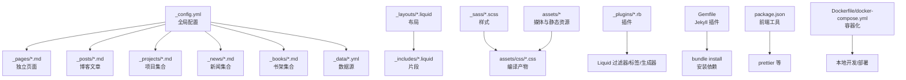
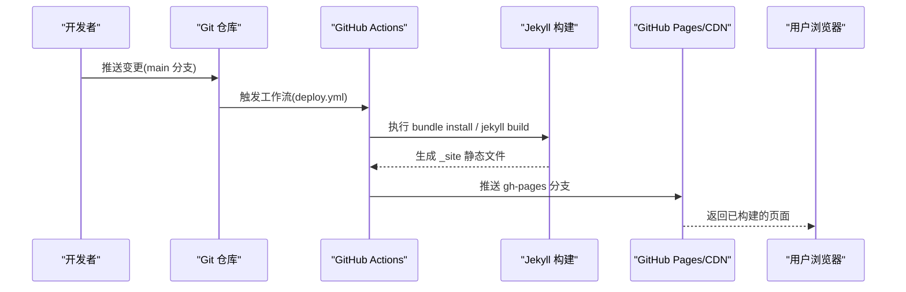
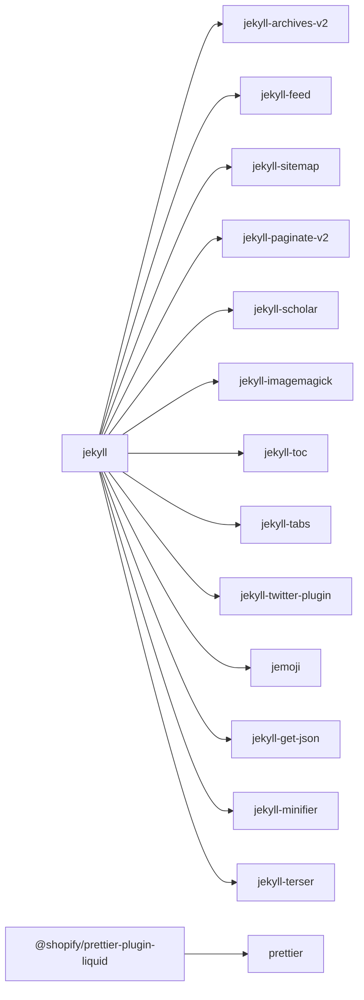

# 最佳实践和迁移指南

<cite>
**本文引用的文件**
- [README.md](file://README.md)
- [_config.yml](file://_config.yml)
- [Gemfile](file://Gemfile)
- [package.json](file://package.json)
- [INSTALL.md](file://INSTALL.md)
- [CUSTOMIZE.md](file://CUSTOMIZE.md)
- [FAQ.md](file://FAQ.md)
- [CONTRIBUTING.md](file://CONTRIBUTING.md)
- [Dockerfile](file://Dockerfile)
- [docker-compose.yml](file://docker-compose.yml)
- [_layouts/default.liquid](file://_layouts/default.liquid)
- [_plugins/cache-bust.rb](file://_plugins/cache-bust.rb)
- [_plugins/details.rb](file://_plugins/details.rb)
- [_plugins/external-posts.rb](file://_plugins/external-posts.rb)
- [_plugins/google-scholar-citations.rb](file://_plugins/google-scholar-citations.rb)
</cite>

## 目录
1. [简介](#简介)
2. [项目结构](#项目结构)
3. [核心组件](#核心组件)
4. [架构总览](#架构总览)
5. [详细组件分析](#详细组件分析)
6. [依赖关系分析](#依赖关系分析)
7. [性能考量](#性能考量)
8. [故障排查指南](#故障排查指南)
9. [结论](#结论)
10. [附录](#附录)

## 简介
本指南面向使用 al-folio 的个人与团队，系统梳理项目组织最佳实践（文件命名、目录结构、内容分类）、版本升级路径（向后兼容、迁移步骤、常见问题）、社区贡献流程（代码规范、文档标准、PR 流程）、内容管理策略（写作规范、标签使用、SEO 优化）、性能优化（资源管理、缓存策略、CDN 使用）、安全建议与防护、定制扩展方法以及长期维护策略。文档基于仓库现有配置与实现进行总结，帮助读者在保持主题稳定性的同时，高效迭代与扩展。

## 项目结构
al-folio 采用 Jekyll 静态站点生成器，围绕“数据驱动 + 布局模板 + 插件扩展”的模式组织内容。核心目录与职责如下：
- 根配置：_config.yml 定义站点元信息、集合、插件、搜索、分析、主题色等全局设置
- 数据层：_data 存放 YAML/JSON 数据（简历、社交、仓库、 venues 等）
- 内容层：_posts（博客）、_pages（独立页面）、_projects（项目）、_news（新闻）、_books（书架）等集合
- 模板层：_layouts（页面/文章布局）、_includes（可复用片段）
- 资源层：assets（CSS/JS/字体/图片/视频/音频/JSON），_sass（SCSS 主题样式）
- 插件层：_plugins（自定义 Liquid 过滤器/标签/生成器）
- 构建与部署：Gemfile（Jekyll 插件）、package.json（前端工具）、Dockerfile/docker-compose.yml（容器化本地开发）

图表来源
- [_config.yml](file://_config.yml)
- [_layouts/default.liquid](file://_layouts/default.liquid)
- [Gemfile](file://Gemfile)
- [package.json](file://package.json)
- [Dockerfile](file://Dockerfile)
- [docker-compose.yml](file://docker-compose.yml)

章节来源
- [README.md](file://README.md)
- [_config.yml](file://_config.yml)
- [CUSTOMIZE.md](file://CUSTOMIZE.md)

## 核心组件
- 全局配置与站点元信息：站点标题、语言、图标、URL、基础路径、页脚信息、关键词等
- 集合与归档：news、projects、books、posts（默认集合），支持按年/标签/分类归档
- 发布与检索：BibTeX 引文、Scholar 统计、外部 RSS/链接聚合
- 主题与样式：颜色变量、字体、响应式布局、暗色模式
- 搜索与导航：站内搜索、TOC、面包屑、分页
- 分析与 SEO：Google Analytics、Schema.org、Open Graph、站点地图、RSS
- 容器化与自动化：Docker 开发环境、GitHub Actions 自动部署与质量检查

章节来源
- [_config.yml](file://_config.yml)
- [INSTALL.md](file://INSTALL.md)
- [README.md](file://README.md)

## 架构总览
下图展示从内容到构建、再到部署的关键流程与集成点：

图表来源
- [INSTALL.md](file://INSTALL.md)
- [Dockerfile](file://Dockerfile)
- [docker-compose.yml](file://docker-compose.yml)

## 详细组件分析

### 文件命名与目录结构最佳实践
- 文章与草稿：_posts 下使用 YYYY-MM-DD-title.md；草稿置于 _drafts
- 页面与菜单：_pages 下独立页面，通过 front matter 的 permalink 控制访问路径
- 集合：为每个集合创建对应目录（如 _projects、_news、_books），并在 _config.yml 中声明
- 数据：_data 下按功能拆分（cv.yml、repositories.yml、socials.yml 等）
- 样式：_sass 下按功能拆分（_base.scss、_layout.scss、_themes.scss 等），避免单文件臃肿
- 插件：_plugins 下按职责拆分（过滤器/标签/生成器），保持单一职责

章节来源
- [CUSTOMIZE.md](file://CUSTOMIZE.md)
- [_config.yml](file://_config.yml)

### 版本升级与迁移指南
- 升级步骤
  - 添加上游远程并拉取目标版本标签，使用 rebase 合并至当前分支
  - 若冲突较多，可重新克隆新版本主题，手动对比差异并迁移内容
- 向后兼容注意事项
  - 移除已弃用插件（如 jekyll-diagrams 替换为 mermaid）
  - 更新第三方库版本与完整性哈希（third_party_libraries）
  - 确保 Node.js 与 Ruby 版本满足最新工作流要求
- 常见问题
  - Unknown tag 'toc'：确认部署分支为 gh-pages
  - CSS/JS 加载失败：核对 url/baseurl 设置
  - Prettier 格式化失败：在本地或 CI 中统一格式化
  - 已弃用 Node.js/动作：升级工作流以使用 Node.js 20

章节来源
- [INSTALL.md](file://INSTALL.md)
- [FAQ.md](file://FAQ.md)

### 社区贡献最佳实践
- PR 流程
  - 小修小补可直接提交 PR；重大功能先开 Issue 讨论
  - 遵循 Prettier 格式化规范，确保代码风格一致
- Issue 规范
  - 使用模板，避免重复；优先查阅 FAQ
- 许可与版权
  - 贡献即默认许可为项目开源许可证

章节来源
- [CONTRIBUTING.md](file://CONTRIBUTING.md)
- [README.md](file://README.md)

### 内容管理最佳实践
- 写作规范
  - 使用语义化 front matter（title、permalink、layout、tags、categories）
  - 文章日期遵循 YYYY-MM-DD 前缀，便于归档与排序
- 标签与分类
  - 在 _config.yml 中配置 display_tags/display_categories 控制首页展示
  - 为集合启用 jekyll-archives 支持按年/标签/分类归档
- SEO 优化
  - 设置 url/baseurl、description、keywords
  - 可选开启 Open Graph 与 Schema.org 元数据
  - 配置 Google Search Console 验证与站点地图

章节来源
- [_config.yml](file://_config.yml)
- [CUSTOMIZE.md](file://CUSTOMIZE.md)

### 性能优化最佳实践
- 资源压缩与合并
  - 使用 jekyll-minifier 与 terser 压缩 JS/CSS
  - 启用 jekyll-toc 生成目录，减少冗余内容
- 图片与媒体
  - 启用 jekyll-imagemagick 生成 WebP 响应式图片
  - 启用懒加载（lazy_loading_images）
- 缓存策略
  - 使用 cache-bust 过滤器为静态资源添加指纹
  - 利用浏览器缓存与 CDN（GitHub Pages 默认具备 CDN）
- 第三方库
  - 在 third_party_libraries 中指定版本与完整性哈希，确保安全与一致性

章节来源
- [_plugins/cache-bust.rb](file://_plugins/cache-bust.rb)
- [_config.yml](file://_config.yml)

### 安全考虑与防护
- 依赖安全
  - 定期更新 Ruby 与 Node 生态依赖，关注弃用与漏洞公告
  - 使用完整性哈希校验第三方库
- 部署安全
  - 使用 SSH 替代密码认证推送（若出现凭据错误）
  - 为敏感令牌（如 Lighthouse Badger）配置仓库密钥
- 内容安全
  - 外部 RSS/链接聚合需注意来源可信度，必要时限制字段与来源域名

章节来源
- [FAQ.md](file://FAQ.md)
- [_config.yml](file://_config.yml)

### 定制与扩展
- 主题与样式
  - 修改 _sass/_themes.scss 与 _sass/_variables.scss 定义主题色与变量
  - 通过 _sass/_base.scss 自定义字体、间距等
- 功能开关
  - 在 _config.yml 中启用/禁用相关特性（如暗色模式、数学公式、Medium Zoom、 Masonry）
- 插件扩展
  - 新增过滤器/标签/生成器于 _plugins
  - 示例：details 标签、外部 RSS 聚合、缓存戳过滤器
- 布局与片段
  - 在 _layouts 与 _includes 中复用与组合，保持页面一致性

章节来源
- [CUSTOMIZE.md](file://CUSTOMIZE.md)
- [_layouts/default.liquid](file://_layouts/default.liquid)
- [_plugins/details.rb](file://_plugins/details.rb)
- [_plugins/external-posts.rb](file://_plugins/external-posts.rb)
- [_plugins/cache-bust.rb](file://_plugins/cache-bust.rb)

### 长期维护与更新策略
- 版本跟踪
  - 使用 Git 标签标记发布版本，记录破坏性变更
- 渐进式升级
  - 小步快跑，逐步替换弃用功能与库
- 自动化保障
  - 保留并维护 GitHub Actions（部署、链接检查、格式化、可访问性测试）
- 文档同步
  - 更新 README/CUSTOMIZE/INSTALL/FAQ，确保与当前实现一致

章节来源
- [INSTALL.md](file://INSTALL.md)
- [README.md](file://README.md)
- [FAQ.md](file://FAQ.md)

## 依赖关系分析
Jekyll 插件与前端工具的依赖关系如下：

图表来源
- [Gemfile](file://Gemfile)
- [package.json](file://package.json)

章节来源
- [Gemfile](file://Gemfile)
- [package.json](file://package.json)

## 性能考量
- 构建性能
  - 合理拆分集合与页面，避免一次性渲染过多内容
  - 使用 jekyll-minifier 与 terser 压缩输出
- 运行时性能
  - 启用懒加载与响应式图片，降低首屏体积
  - 使用 CDN（GitHub Pages 默认）提升全球访问速度
- 可观测性
  - 集成 Google Analytics/Pirsch/Openpanel 等分析，结合 Lighthouse 报告持续优化

章节来源
- [_config.yml](file://_config.yml)
- [INSTALL.md](file://INSTALL.md)

## 故障排查指南
- 部署分支错误导致构建失败
  - 确认部署分支为 gh-pages，而非 main
- CSS/JS 未加载
  - 检查 url/baseurl 设置，清理浏览器缓存或使用隐私模式
- 相关文章计算异常
  - 关闭 LSI 或为特定文章禁用相关推荐
- Prettier 格式化失败
  - 在本地或 CI 中运行格式化工具，确保规则一致
- 已弃用库或动作
  - 升级到最新版本，替换 jekyll-diagrams 为 mermaid
- 外部源聚合失败
  - 检查 RSS/URL 可达性与解析逻辑

章节来源
- [FAQ.md](file://FAQ.md)
- [INSTALL.md](file://INSTALL.md)

## 结论
通过遵循本文的最佳实践与迁移指南，您可以：
- 以清晰的目录结构与命名规范组织内容，降低维护成本
- 平滑完成版本升级，规避破坏性变更带来的风险
- 以一致的贡献流程与文档标准提升协作效率
- 在保证 SEO 与可访问性的前提下，持续优化性能与体验
- 借助插件与容器化能力，快速扩展功能并稳定交付

## 附录
- 快速检查清单
  - 已设置正确的 url/baseurl
  - 已启用所需集合与归档
  - 已配置分析与 SEO 元数据
  - 已启用图片懒加载与响应式图片
  - 已启用缓存戳与资源压缩
  - 已通过 Prettier 格式化
  - 已验证外部源聚合与引用统计
  - 已升级到最新版本并修复弃用项