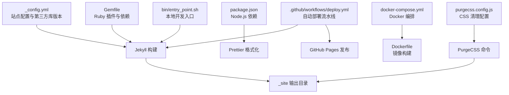
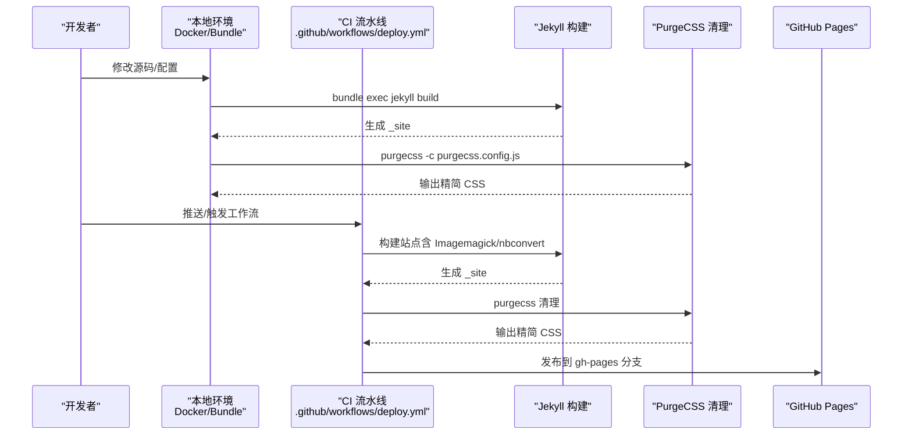
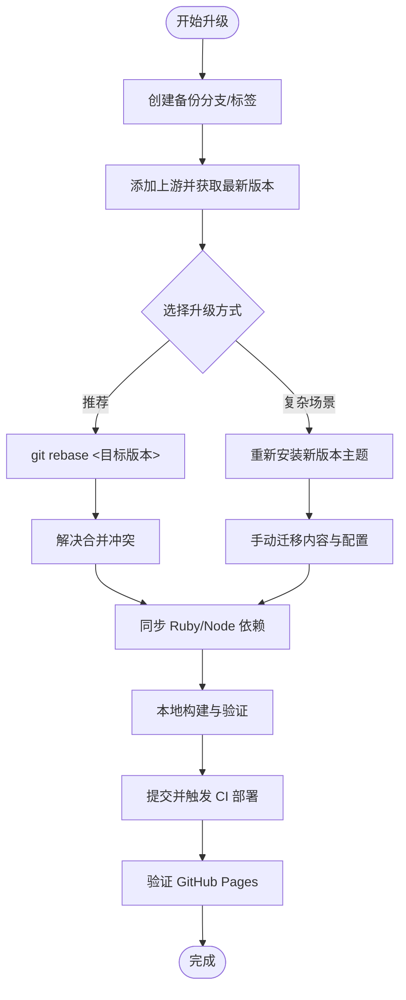
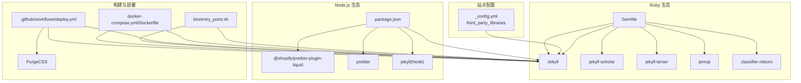

# 版本升级指南

<cite>
**本文档引用的文件**
- [_config.yml](file://_config.yml)
- [Gemfile](file://Gemfile)
- [package.json](file://package.json)
- [package-lock.json](file://package-lock.json)
- [INSTALL.md](file://INSTALL.md)
- [README.md](file://README.md)
- [FAQ.md](file://FAQ.md)
- [.github/workflows/deploy.yml](file://.github/workflows/deploy.yml)
- [docker-compose.yml](file://docker-compose.yml)
- [Dockerfile](file://Dockerfile)
- [bin/entry_point.sh](file://bin/entry_point.sh)
- [purgecss.config.js](file://purgecss.config.js)
</cite>

## 目录
1. [简介](#简介)
2. [项目结构](#项目结构)
3. [核心组件](#核心组件)
4. [架构概览](#架构概览)
5. [详细组件分析](#详细组件分析)
6. [依赖关系分析](#依赖关系分析)
7. [性能考量](#性能考量)
8. [故障排除指南](#故障排除指南)
9. [结论](#结论)
10. [附录](#附录)

## 简介
本指南面向使用 al-folio 主题的个人学术网站维护者，提供从旧版本到新版本的系统化升级流程与最佳实践。内容覆盖向后兼容性评估、升级前准备（依赖版本检查、配置文件备份、内容迁移策略）、分步升级教程、常见升级场景与回滚策略，以及升级后的验证与性能检查要点。目标是帮助您在最小化风险的前提下完成升级，并确保网站功能与性能稳定。

## 项目结构
al-folio 项目采用 Jekyll 静态站点生成器，结合 Ruby 生态（Bundler）与 Node.js 工具链（Prettier、PurgeCSS）。核心目录与文件包括：
- 配置：_config.yml（站点配置、插件、第三方库版本）
- 依赖：Gemfile（Ruby gems）、package.json（Node.js 依赖）
- 构建与部署：.github/workflows/deploy.yml（GitHub Actions）、docker-compose.yml、Dockerfile
- 开发工具：bin/entry_point.sh（本地开发入口脚本）、purgecss.config.js（CSS 清理）

**图表来源**
- [_config.yml:397-646](file://_config.yml#L397-L646)
- [Gemfile:1-39](file://Gemfile#L1-L39)
- [package.json:1-10](file://package.json#L1-L10)
- [.github/workflows/deploy.yml:1-106](file://.github/workflows/deploy.yml#L1-L106)
- [docker-compose.yml:1-22](file://docker-compose.yml#L1-L22)
- [Dockerfile:1-77](file://Dockerfile#L1-L77)
- [bin/entry_point.sh:1-38](file://bin/entry_point.sh#L1-L38)
- [purgecss.config.js:1-7](file://purgecss.config.js#L1-L7)

**章节来源**
- [_config.yml:1-646](file://_config.yml#L1-L646)
- [Gemfile:1-39](file://Gemfile#L1-L39)
- [package.json:1-10](file://package.json#L1-L10)
- [.github/workflows/deploy.yml:1-106](file://.github/workflows/deploy.yml#L1-L106)
- [docker-compose.yml:1-22](file://docker-compose.yml#L1-L22)
- [Dockerfile:1-77](file://Dockerfile#L1-L77)
- [bin/entry_point.sh:1-38](file://bin/entry_point.sh#L1-L38)
- [purgecss.config.js:1-7](file://purgecss.config.js#L1-L7)

## 核心组件
- 站点配置与第三方库版本
  - 在 _config.yml 的“Library versions”部分集中管理第三方前端库版本与完整性校验哈希，便于升级时统一更新与回滚。
- Ruby 依赖与插件
  - Gemfile 定义核心 Jekyll 插件组与开发/外部数据插件组，升级时需关注插件兼容性与版本锁定。
- Node.js 依赖
  - package.json 与 package-lock.json 管理 Prettier 与 jekyll（Node 包）版本，升级时需同步更新锁文件。
- 自动部署流水线
  - GitHub Actions 在推送/拉取请求触发构建、清理未使用 CSS 并发布到 GitHub Pages。
- 本地开发环境
  - Docker Compose 与自定义入口脚本提供一致的本地开发体验；Dockerfile 指定 Ruby、Python、Node.js、Imagemagick 等系统依赖。

**章节来源**
- [_config.yml:397-646](file://_config.yml#L397-L646)
- [Gemfile:1-39](file://Gemfile#L1-L39)
- [package.json:1-10](file://package.json#L1-L10)
- [package-lock.json:1-111](file://package-lock.json#L1-L111)
- [.github/workflows/deploy.yml:1-106](file://.github/workflows/deploy.yml#L1-L106)
- [docker-compose.yml:1-22](file://docker-compose.yml#L1-L22)
- [Dockerfile:1-77](file://Dockerfile#L1-L77)
- [bin/entry_point.sh:1-38](file://bin/entry_point.sh#L1-L38)

## 架构概览
下图展示从源码到发布的关键路径：本地开发（Docker/本地）或 CI（GitHub Actions）执行构建，生成静态资源并发布到 GitHub Pages。

**图表来源**
- [.github/workflows/deploy.yml:67-106](file://.github/workflows/deploy.yml#L67-L106)
- [Dockerfile:22-65](file://Dockerfile#L22-L65)
- [bin/entry_point.sh:22-27](file://bin/entry_point.sh#L22-L27)
- [purgecss.config.js:1-7](file://purgecss.config.js#L1-L7)

## 详细组件分析

### 升级前准备与兼容性评估
- 备份现有仓库与关键文件
  - 使用 Git 创建分支或标签作为快照，确保可回滚。
  - 备份 _config.yml、Gemfile、package.json、package-lock.json、第三方库版本清单。
- 依赖版本检查
  - Ruby 环境：确认 Ruby 版本与 CI 中一致（参考工作流中的 Ruby 版本）。
  - Jekyll 版本：Gemfile 指定 jekyll；升级时需同时更新 Gemfile 与 Gemfile.lock。
  - Node.js 包：package.json 与 package-lock.json 同步更新，避免版本冲突。
  - 第三方库版本：_config.yml 的 third_party_libraries 字段为升级重点，建议逐项核对版本号与完整性哈希。
- 内容迁移策略
  - 文章与页面：基于 Git diff 对比差异，优先迁移新增字段与布局变更。
  - 配置项：对照官方升级文档，识别已废弃或变更的配置项（例如评论系统、归档设置等）。
  - 插件兼容性：检查 jekyll-scholar、jekyll-terser、jemoji 等插件是否与新版本兼容。

**章节来源**
- [INSTALL.md:236-252](file://INSTALL.md#L236-L252)
- [_config.yml:397-646](file://_config.yml#L397-L646)
- [Gemfile:1-39](file://Gemfile#L1-L39)
- [package.json:1-10](file://package.json#L1-L10)
- [package-lock.json:1-111](file://package-lock.json#L1-L111)

### 分步升级教程（从旧版本到新版本）
- 步骤一：创建备份分支
  - 在本地或远程仓库创建备份分支或打标签，记录当前状态。
- 步骤二：更新上游版本
  - 添加上游仓库并基于指定版本标签进行变基或合并。
  - 参考官方升级命令与注意事项，处理可能出现的合并冲突。
- 步骤三：同步依赖与配置
  - 更新 Gemfile 与 Gemfile.lock（如存在），确保 Ruby 插件版本匹配。
  - 更新 package.json 与 package-lock.json，保持 Node.js 工具链一致。
  - 在 _config.yml 中更新第三方库版本与完整性哈希。
- 步骤四：本地验证
  - 使用 Docker 或本地环境启动服务，检查构建日志与页面渲染。
  - 运行 Prettier 格式化与 PurgeCSS 清理，确保输出一致。
- 步骤五：提交与部署
  - 提交变更并通过 CI 触发自动部署，确认 GitHub Pages 分支更新成功。

**图表来源**
- [INSTALL.md:236-252](file://INSTALL.md#L236-L252)
- [bin/entry_point.sh:8-20](file://bin/entry_point.sh#L8-L20)

**章节来源**
- [INSTALL.md:236-252](file://INSTALL.md#L236-L252)
- [bin/entry_point.sh:8-20](file://bin/entry_point.sh#L8-L20)

### 重要依赖项升级注意事项
- Jekyll 版本
  - 通过 Gemfile 指定版本，升级时需同时更新 Gemfile.lock 并在 CI 中保持 Ruby 版本一致。
- Ruby 环境
  - CI 使用 Ruby 版本固定于工作流中，本地需保持一致以避免构建差异。
- Node.js 包
  - Prettier 与 jekyll（Node 包）版本需与 package.json/lock 文件一致，避免格式化与构建异常。
- 第三方前端库
  - 在 _config.yml 的 third_party_libraries 中统一管理版本与完整性哈希，升级时逐项核对并更新。

**章节来源**
- [Gemfile:1-39](file://Gemfile#L1-L39)
- [.github/workflows/deploy.yml:74-83](file://.github/workflows/deploy.yml#L74-L83)
- [package.json:1-10](file://package.json#L1-L10)
- [package-lock.json:1-111](file://package-lock.json#L1-L111)
- [_config.yml:397-646](file://_config.yml#L397-L646)

### 常见升级场景与回滚策略
- 场景一：插件不兼容导致构建失败
  - 现象：构建报错提示未知标签或插件缺失。
  - 处理：根据 FAQ 指引检查部署分支、插件版本与依赖；必要时降级或替换插件。
- 场景二：第三方库版本冲突
  - 现象：浏览器控制台或构建日志出现版本不匹配警告。
  - 处理：在 _config.yml 中统一更新版本与完整性哈希，确保与 CDN 资源一致。
- 场景三：CI 任务过时或弃用
  - 现象：CI 报告弃用的 Node.js 版本或命令。
  - 处理：升级模板至最新版本，或在本地使用 Docker 镜像保证一致性。
- 回滚策略
  - 利用备份分支/标签快速回退到上一个稳定版本，逐步排查问题后再尝试升级。

**章节来源**
- [FAQ.md:75-95](file://FAQ.md#L75-L95)
- [FAQ.md:96-98](file://FAQ.md#L96-L98)
- [INSTALL.md:236-252](file://INSTALL.md#L236-L252)

### 升级后的验证方法与性能检查要点
- 功能验证
  - 页面加载：检查首页、博客、项目、出版物等页面是否正常渲染。
  - 交互功能：评论系统（giscus/disqus）、搜索、暗色模式切换、数学公式与代码高亮等。
- 性能检查
  - CSS 清理：确认 PurgeCSS 成功运行，未清理必要的样式。
  - 资源加载：检查第三方库版本与完整性哈希是否正确，避免加载失败。
  - Lighthouse：参考 README 中的 Lighthouse 结果链接，对比桌面与移动端得分。
- 兼容性测试
  - 不同浏览器与设备：验证在主流浏览器与移动设备上的显示效果。
  - 无障碍：按需启用 Axe 工具进行无障碍检测（FAQ 中有相关说明）。

**章节来源**
- [README.md:210-222](file://README.md#L210-L222)
- [purgecss.config.js:1-7](file://purgecss.config.js#L1-L7)
- [FAQ.md:112-127](file://FAQ.md#L112-L127)

## 依赖关系分析
下图展示关键依赖与构建流程之间的耦合关系，帮助识别升级时的潜在风险点。

**图表来源**
- [Gemfile:1-39](file://Gemfile#L1-L39)
- [package.json:1-10](file://package.json#L1-L10)
- [_config.yml:397-646](file://_config.yml#L397-L646)
- [.github/workflows/deploy.yml:67-106](file://.github/workflows/deploy.yml#L67-L106)
- [docker-compose.yml:1-22](file://docker-compose.yml#L1-L22)
- [Dockerfile:1-77](file://Dockerfile#L1-L77)
- [bin/entry_point.sh:1-38](file://bin/entry_point.sh#L1-L38)

**章节来源**
- [Gemfile:1-39](file://Gemfile#L1-L39)
- [package.json:1-10](file://package.json#L1-L10)
- [_config.yml:397-646](file://_config.yml#L397-L646)
- [.github/workflows/deploy.yml:67-106](file://.github/workflows/deploy.yml#L67-L106)
- [docker-compose.yml:1-22](file://docker-compose.yml#L1-L22)
- [Dockerfile:1-77](file://Dockerfile#L1-L77)
- [bin/entry_point.sh:1-38](file://bin/entry_point.sh#L1-L38)

## 性能考量
- 构建时间优化
  - 使用 Docker 镜像与缓存策略（Bundler 缓存、Python 依赖缓存）减少重复安装时间。
  - 控制第三方库数量与版本，避免不必要的资源加载。
- 资源体积优化
  - 启用 PurgeCSS 清理未使用 CSS，确保输出目录整洁。
  - 在 _config.yml 中统一管理第三方库版本，避免重复引入相同库的不同版本。
- 加载性能
  - 通过 _config.yml 的 third_party_libraries 字段统一 CDN 路径与完整性哈希，提升缓存命中率与安全性。

**章节来源**
- [.github/workflows/deploy.yml:97-100](file://.github/workflows/deploy.yml#L97-L100)
- [_config.yml:397-646](file://_config.yml#L397-L646)
- [purgecss.config.js:1-7](file://purgecss.config.js#L1-L7)

## 故障排除指南
- 构建失败：Unknown tag 'toc'
  - 检查部署分支是否为 gh-pages，确保 toc 插件可用。
- CSS/JS 加载异常
  - 核对 _config.yml 中 url 与 baseurl 设置，清除浏览器缓存后重试。
- Prettier 格式化失败
  - 在本地或 Docker 环境安装 Prettier 并运行格式化命令，或禁用该工作流。
- CI 弃用警告
  - 升级模板至最新版本，或在本地使用 Docker 镜像保证环境一致。
- 插件缺失或不兼容
  - 根据 FAQ 指引更新插件或替换为替代方案（如 jekyll-diagrams 已被移除）。

**章节来源**
- [FAQ.md:33-35](file://FAQ.md#L33-L35)
- [FAQ.md:37-47](file://FAQ.md#L37-L47)
- [FAQ.md:65-73](file://FAQ.md#L65-L73)
- [FAQ.md:75-94](file://FAQ.md#L75-L94)
- [FAQ.md:96-98](file://FAQ.md#L96-L98)

## 结论
通过遵循本指南的升级流程与最佳实践，您可以系统地完成 al-folio 的版本升级，降低兼容性风险并提升网站稳定性与性能。建议在升级前后均进行充分的本地与 CI 验证，并保留可回滚的备份分支/标签，以便快速恢复。

## 附录
- 快速检查清单
  - 已创建备份分支/标签
  - Gemfile/Gemfile.lock 已同步更新
  - package.json/package-lock.json 已同步更新
  - _config.yml 的第三方库版本与完整性哈希已更新
  - 本地构建与验证通过
  - CI 触发并成功部署到 gh-pages
  - Lighthouse 得分与关键功能正常