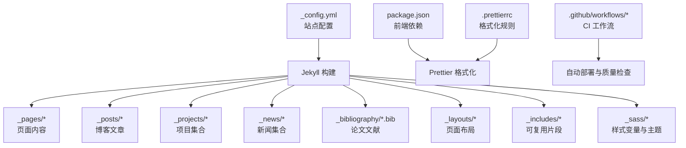
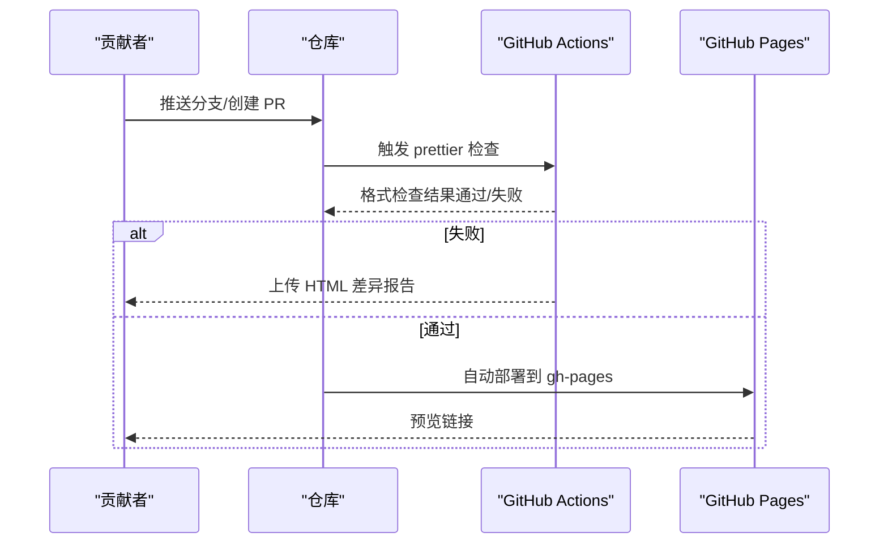
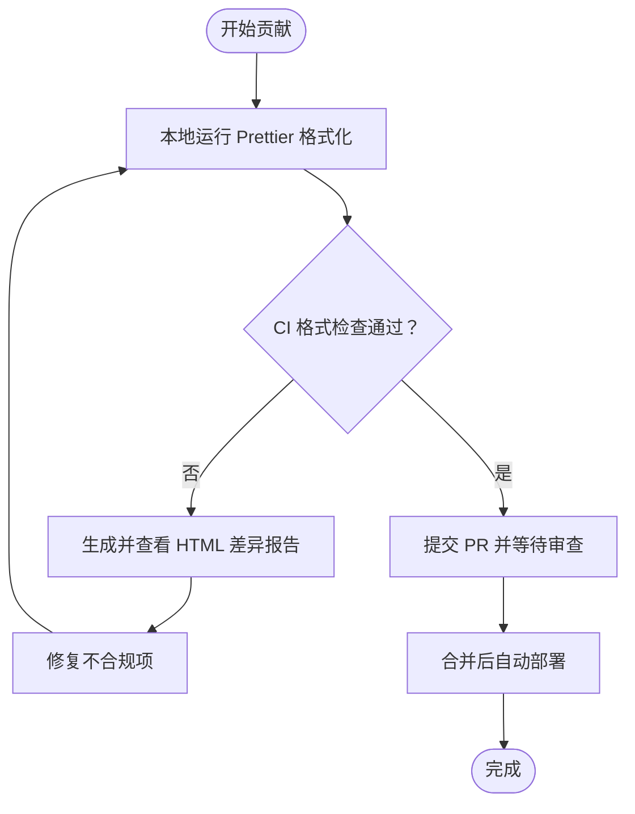
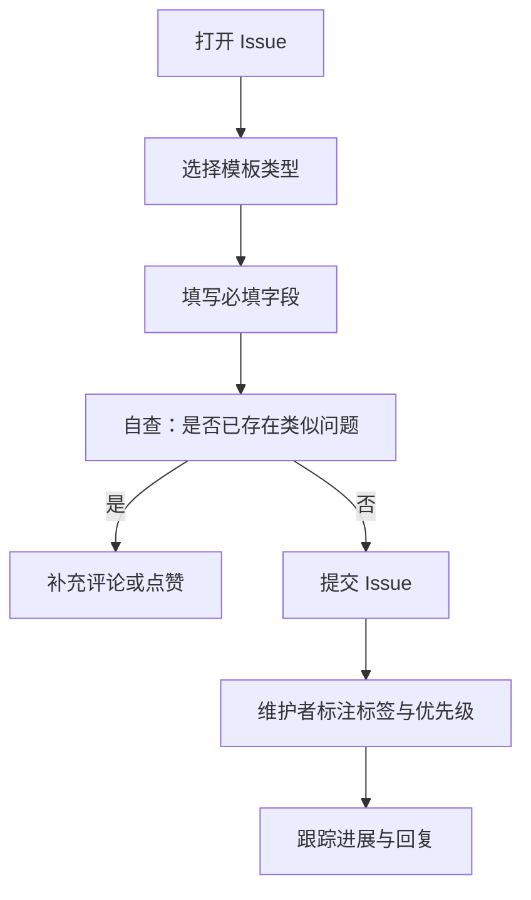
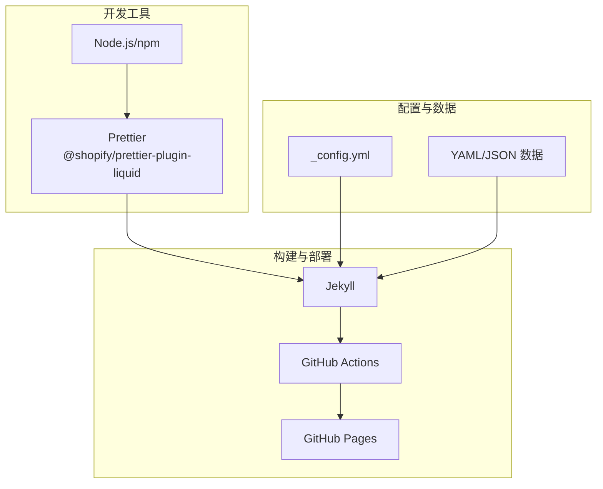

# 社区贡献最佳实践

<cite>
**本文档引用的文件**
- [CONTRIBUTING.md](file://CONTRIBUTING.md)
- [README.md](file://README.md)
- [FAQ.md](file://FAQ.md)
- [INSTALL.md](file://INSTALL.md)
- [CUSTOMIZE.md](file://CUSTOMIZE.md)
- [package.json](file://package.json)
- [_config.yml](file://_config.yml)
- [.prettierrc](file://.prettierrc)
- [.github/workflows/prettier.yml](file://.github/workflows/prettier.yml)
- [.github/ISSUE_TEMPLATE/1_bug_report.yml](file://.github/ISSUE_TEMPLATE/1_bug_report.yml)
- [.github/ISSUE_TEMPLATE/2_feature_request.yml](file://.github/ISSUE_TEMPLATE/2_feature_request.yml)
- [.github/ISSUE_TEMPLATE/config.yml](file://.github/ISSUE_TEMPLATE/config.yml)
- [LICENSE](file://LICENSE)
</cite>

## 目录
1. [简介](#简介)
2. [项目结构](#项目结构)
3. [核心组件](#核心组件)
4. [架构概览](#架构概览)
5. [详细组件分析](#详细组件分析)
6. [依赖关系分析](#依赖关系分析)
7. [性能考虑](#性能考虑)
8. [故障排除指南](#故障排除指南)
9. [结论](#结论)
10. [附录](#附录)

## 简介
本指南面向 al-folio 社区贡献者，系统阐述代码规范与质量标准、PR 提交流程与规范、Issue 提交最佳实践、文档贡献要求、许可证与版权事项以及社区行为准则。目标是帮助贡献者高效、一致地参与项目维护与改进。

## 项目结构
al-folio 是基于 Jekyll 的学术主题，采用分层组织方式：
- 配置与构建：通过配置文件与工作流实现自动化部署与质量检查
- 内容与数据：Markdown 页面、博客文章、项目与新闻集合，以及 YAML/JSON 数据源
- 主题与样式：Sass 变量与布局，支持主题色与响应式设计
- 插件与工具：Jekyll 插件生态与前端依赖（如 Prettier）

**图表来源**
- [_config.yml:160-220](file://_config.yml#L160-L220)
- [package.json:1-10](file://package.json#L1-L10)
- [.prettierrc:1-4](file://.prettierrc#L1-L4)

**章节来源**
- [README.md:262-356](file://README.md#L262-L356)
- [CUSTOMIZE.md:8-40](file://CUSTOMIZE.md#L8-L40)

## 核心组件
- 质量检查与格式化
  - 使用 Prettier 对 Liquid 模板与静态内容进行统一格式化，确保跨平台一致性
  - 通过 GitHub Actions 在 PR 推送时自动执行格式检查，失败时生成差异报告供参考
- 自动化部署与发布
  - 通过 GitHub Actions 实现主分支推送后的自动部署到 gh-pages 分支
  - 支持手动触发与多平台部署（GitHub Pages、Netlify）
- Issue 模板与分类
  - 提供缺陷报告与功能请求模板，引导用户提供必要信息
  - 通过标签与讨论区分流问题，提升处理效率

**章节来源**
- [CONTRIBUTING.md:1-29](file://CONTRIBUTING.md#L1-L29)
- [README.md:423-432](file://README.md#L423-L432)
- [.github/workflows/prettier.yml:1-49](file://.github/workflows/prettier.yml#L1-L49)

## 架构概览
下图展示贡献流程的关键节点：本地开发、PR 提交、自动化检查与合并、自动部署。

**图表来源**
- [.github/workflows/prettier.yml:1-49](file://.github/workflows/prettier.yml#L1-L49)
- [INSTALL.md:149-156](file://INSTALL.md#L149-L156)

## 详细组件分析

### 代码规范与质量标准
- Prettier 格式化要求
  - 项目使用 Prettier 并集成 Shopify Liquid 插件，统一模板与静态内容风格
  - 格式化规则在配置文件中定义，包含最大行长、尾随逗号策略等
  - 本地可通过 IDE 插件或命令行运行 Prettier；CI 将自动校验并生成差异报告
- 代码审查流程
  - 小修小补可直接提交 PR；重大变更建议先开 Issue 讨论
  - PR 需满足格式化要求并通过 CI 检查；必要时提供变更说明
- 测试与质量检查
  - 除格式化外，README 列举了链接检查与可访问性测试工具，但未包含单元测试框架
  - 建议贡献者在本地验证关键功能（如构建、链接有效性），并在 PR 中说明验证情况

**图表来源**
- [.github/workflows/prettier.yml:13-49](file://.github/workflows/prettier.yml#L13-L49)
- [.prettierrc:1-4](file://.prettierrc#L1-L4)

**章节来源**
- [CONTRIBUTING.md:11-11](file://CONTRIBUTING.md#L11-L11)
- [README.md:423-432](file://README.md#L423-L432)
- [FAQ.md:65-74](file://FAQ.md#L65-L74)

### PR 提交流程与规范
- 分支管理
  - 主分支为 main/gh-pages（部署分支），贡献应从功能分支提交至 main
  - 自动部署仅针对 main 分支触发，避免在其他分支重复操作
- 提交信息与变更说明
  - 建议遵循清晰简洁的提交信息风格，概述变更目的与影响范围
  - 在 PR 描述中说明背景、改动点与验证方法，便于审查
- 审查与合并
  - 维护者负责审查与合并；合并前需确保格式化与 CI 通过
  - 对于重大变更，建议先行开启 Issue 讨论并获得共识

**章节来源**
- [CONTRIBUTING.md:5-11](file://CONTRIBUTING.md#L5-L11)
- [INSTALL.md:149-156](file://INSTALL.md#L149-L156)

### Issue 提交最佳实践
- 适用场景
  - 缺陷报告：提供复现步骤、期望/实际行为、错误日志与环境信息
  - 功能请求：说明动机、预期行为、替代方案与额外上下文
- 模板字段
  - 必填项包括问题描述、复现步骤、操作系统与运行环境
  - 可选项包括截图、部署链接、版本信息等
- 优先级与分流
  - 优先查阅 FAQ 与历史 Issue；问题描述不清或重复将被标记“待分类”
  - 疑问类问题请移步讨论区，避免占用 Issue 资源

**图表来源**
- [.github/ISSUE_TEMPLATE/1_bug_report.yml:1-103](file://.github/ISSUE_TEMPLATE/1_bug_report.yml#L1-L103)
- [.github/ISSUE_TEMPLATE/2_feature_request.yml:1-57](file://.github/ISSUE_TEMPLATE/2_feature_request.yml#L1-L57)
- [.github/ISSUE_TEMPLATE/config.yml:1-9](file://.github/ISSUE_TEMPLATE/config.yml#L1-L9)

**章节来源**
- [CONTRIBUTING.md:13-24](file://CONTRIBUTING.md#L13-L24)
- [.github/ISSUE_TEMPLATE/1_bug_report.yml:15-27](file://.github/ISSUE_TEMPLATE/1_bug_report.yml#L15-L27)
- [.github/ISSUE_TEMPLATE/2_feature_request.yml:15-27](file://.github/ISSUE_TEMPLATE/2_feature_request.yml#L15-L27)

### 文档贡献标准
- 文档格式
  - 使用 Markdown 编写，保持标题层级清晰、段落简洁
  - 示例与配置说明建议配合路径引用而非粘贴代码片段
- 示例与配置
  - 引用具体文件路径与行号，便于读者定位与核对
  - 对于复杂配置，建议提供“如何验证”的步骤说明
- 翻译与本地化
  - 项目当前以英文为主，新增翻译需经维护者评估与审核
  - 保持术语一致性，避免直译导致歧义

**章节来源**
- [CUSTOMIZE.md:1-10](file://CUSTOMIZE.md#L1-L10)
- [README.md:262-356](file://README.md#L262-L356)

### 许可证与版权
- 许可证
  - 项目采用 MIT 许可证，允许自由使用、复制、修改与再发布，需保留版权与许可声明
- 贡献版权
  - 贡献者提交的代码默认按项目许可证授权，用于分发与使用
- 版本与变更
  - 许可证文本随版本更新，贡献者应关注最新版本条款

**章节来源**
- [LICENSE:1-21](file://LICENSE#L1-L21)
- [CONTRIBUTING.md:25-29](file://CONTRIBUTING.md#L25-L29)

### 社区行为准则
- 行为原则
  - 尊重与包容：维护友好、开放的社区氛围
  - 建设性反馈：聚焦问题与改进，避免人身攻击
  - 共同成长：乐于分享知识与经验，帮助新贡献者
- 争议解决
  - 优先通过讨论与协商解决分歧
  - 必要时由维护团队介入裁决，确保项目健康有序发展

[本节为通用指导，无需特定文件引用]

## 依赖关系分析
- 开发工具链
  - Prettier 与 Shopify Liquid 插件用于统一格式化
  - Node.js 运行时与 npm 包管理器
- 构建与部署
  - Jekyll 作为静态站点生成器，配合 Ruby 生态插件
  - GitHub Actions 实现自动化构建与部署
- 配置与数据
  - _config.yml 控制站点行为与插件启用
  - YAML/JSON 数据源驱动页面内容生成

**图表来源**
- [package.json:1-10](file://package.json#L1-L10)
- [_config.yml:200-220](file://_config.yml#L200-L220)
- [.github/workflows/prettier.yml:1-49](file://.github/workflows/prettier.yml#L1-L49)

**章节来源**
- [README.md:423-432](file://README.md#L423-L432)
- [INSTALL.md:45-64](file://INSTALL.md#L45-L64)

## 性能考虑
- 构建性能
  - 合理拆分内容与数据，避免单页过大
  - 使用懒加载与压缩策略（如图片响应式与 CSS 压缩）减少首屏负载
- 部署性能
  - 利用缓存与增量构建，缩短 CI 时间
  - 选择就近的托管服务，优化网络延迟

[本节提供一般性建议，无需特定文件引用]

## 故障排除指南
- Prettier 格式化失败
  - 本地安装并运行 Prettier；参考 CI 生成的 HTML 差异报告逐项修正
  - 若使用 Docker 或开发容器，内置 Prettier 可直接使用
- 部署失败
  - 确认部署分支设置为 gh-pages，URL 与 baseurl 配置正确
  - 检查 GitHub Actions 权限与工作流状态
- 依赖与版本问题
  - 参考 FAQ 中关于过时依赖与迁移的说明，升级到最新版本
  - 如遇容器内依赖冲突，进入容器调试并重新安装依赖

**章节来源**
- [FAQ.md:65-94](file://FAQ.md#L65-L94)
- [INSTALL.md:149-156](file://INSTALL.md#L149-L156)

## 结论
通过统一的格式化标准、清晰的 PR 与 Issue 流程、完善的自动化检查与部署机制，al-folio 为贡献者提供了高效、一致的协作体验。建议贡献者在提交前完成本地验证，遵循模板与规范，共同维护项目的质量与可持续发展。

## 附录
- 快速参考
  - 格式化：运行 Prettier 并查看 CI 差异报告
  - 提交：从功能分支提交 PR 至 main，附上变更说明
  - 问题：优先使用模板，提供复现步骤与环境信息
  - 部署：确认 gh-pages 分支与 URL 配置，等待 Actions 完成

[本节为总结性内容，无需特定文件引用]