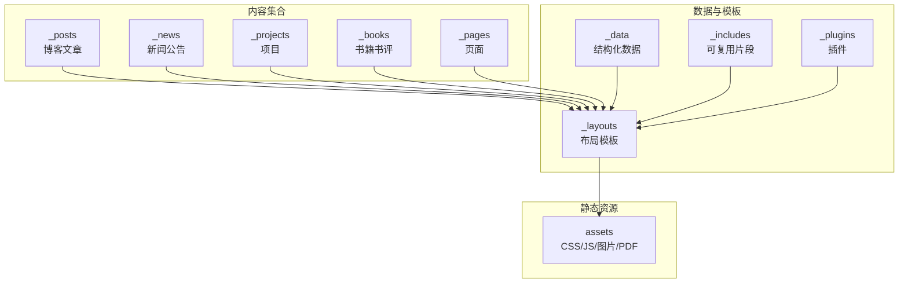
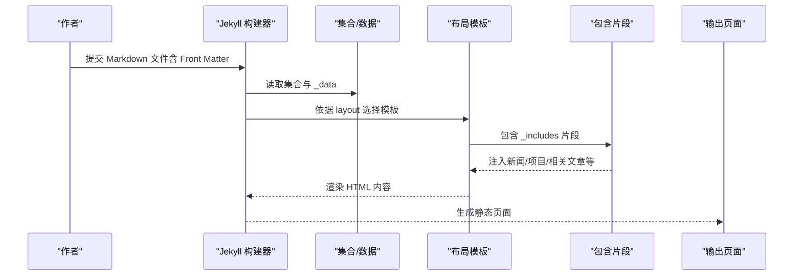
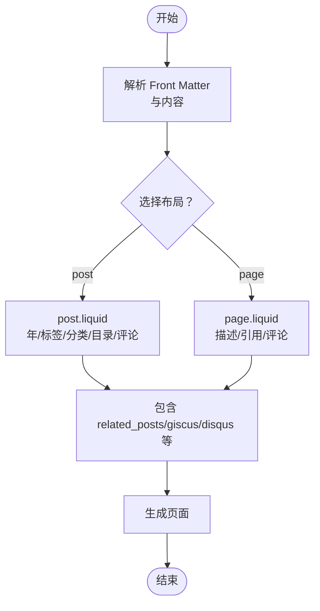
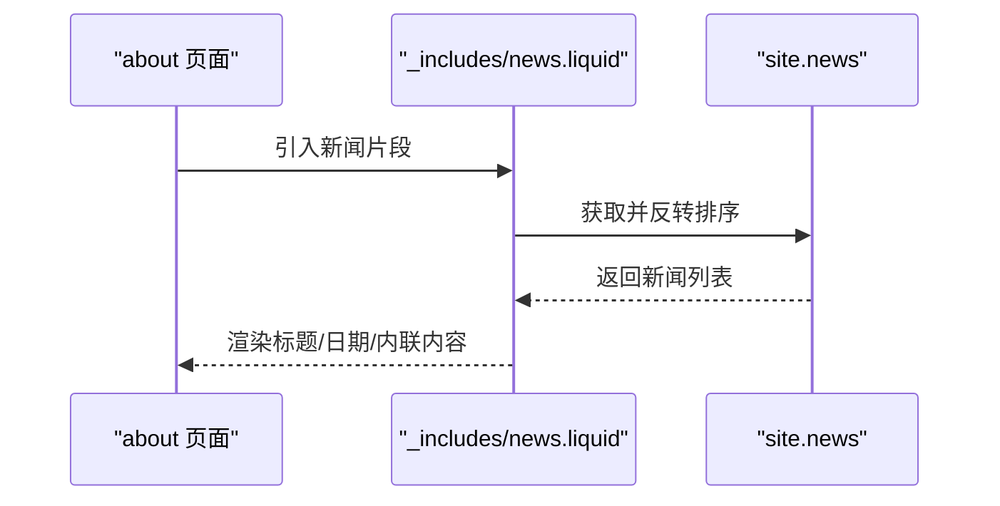
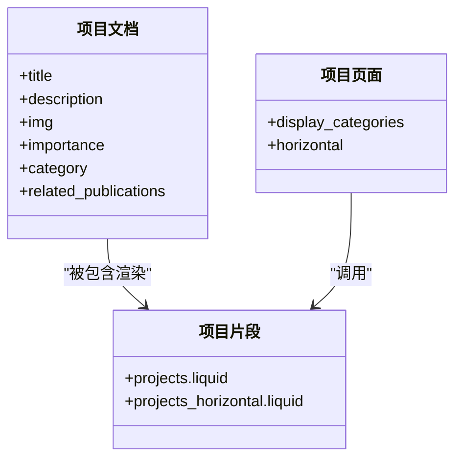
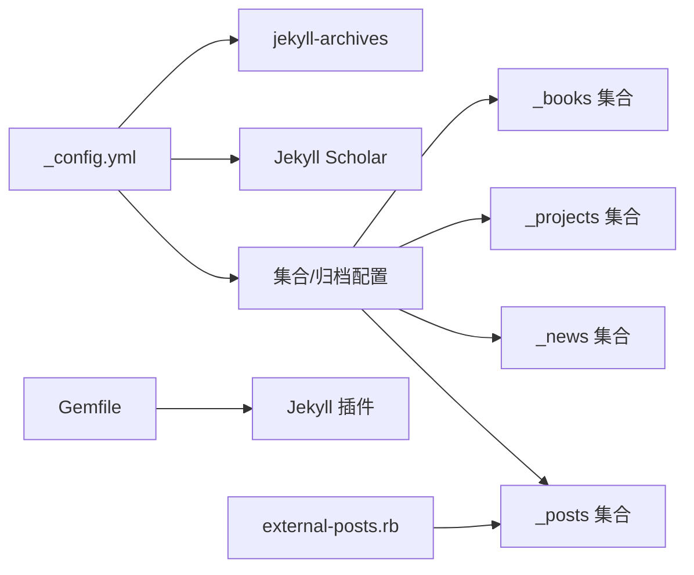

# 项目组织最佳实践

<cite>
**本文档引用的文件**
- [_config.yml](file://_config.yml)
- [Gemfile](file://Gemfile)
- [README.md](file://README.md)
- [CUSTOMIZE.md](file://CUSTOMIZE.md)
- [INSTALL.md](file://INSTALL.md)
- [_posts/2015-03-15-formatting-and-links.md](file://_posts/2015-03-15-formatting-and-links.md)
- [_news/announcement_1.md](file://_news/announcement_1.md)
- [_projects/1_project.md](file://_projects/1_project.md)
- [_books/the_godfather.md](file://_books/the_godfather.md)
- [_pages/projects.md](file://_pages/projects.md)
- [_layouts/post.liquid](file://_layouts/post.liquid)
- [_layouts/page.liquid](file://_layouts/page.liquid)
- [_includes/news.liquid](file://_includes/news.liquid)
- [_plugins/external-posts.rb](file://_plugins/external-posts.rb)
- [_data/repositories.yml](file://_data/repositories.yml)
</cite>

## 目录
1. [简介](#简介)
2. [项目结构](#项目结构)
3. [核心组件](#核心组件)
4. [架构总览](#架构总览)
5. [详细组件分析](#详细组件分析)
6. [依赖关系分析](#依赖关系分析)
7. [性能考虑](#性能考虑)
8. [故障排除指南](#故障排除指南)
9. [结论](#结论)
10. [附录](#附录)

## 简介
本文件系统化总结 al-folio 项目的组织最佳实践，围绕 Jekyll 集合（Collections）与 Front Matter 标准化、内容分类策略、文件命名规范、目录结构设计原则展开，并结合实际示例说明博客文章、项目、新闻公告、书籍书评等不同类型内容的组织方式，帮助读者在保持可维护性与扩展性的前提下高效构建个人主页或学术主页。

## 项目结构
al-folio 采用“按内容类型分层”的目录组织方式，配合 Jekyll 集合实现模块化管理。核心目录与职责如下：
- _posts：默认集合，存放博客文章，遵循 YYYY-MM-DD-title.md 命名规范
- _news：自定义集合，用于新闻公告，支持内联与链接两种展示形式
- _projects：自定义集合，用于项目展示，支持分类与重要性排序
- _books：自定义集合，用于书籍书评，支持标签与评分
- _pages：页面集合，每个页面对应一个独立页面（如 about、projects、publications）
- _data：结构化数据源，如 repositories.yml、cv.yml、socials.yml 等
- _includes：可复用片段，如 news.liquid、projects.liquid 等
- _layouts：页面与文章布局模板，如 post.liquid、page.liquid、book-review.liquid
- _plugins：自定义生成器与过滤器，如 external-posts.rb
- assets：静态资源（CSS、JS、图片、PDF 等）

**图表来源**
- [_config.yml](file://_config.yml)
- [_posts/2015-03-15-formatting-and-links.md](file://_posts/2015-03-15-formatting-and-links.md)
- [_news/announcement_1.md](file://_news/announcement_1.md)
- [_projects/1_project.md](file://_projects/1_project.md)
- [_books/the_godfather.md](file://_books/the_godfather.md)
- [_pages/projects.md](file://_pages/projects.md)
- [_layouts/post.liquid](file://_layouts/post.liquid)
- [_layouts/page.liquid](file://_layouts/page.liquid)
- [_includes/news.liquid](file://_includes/news.liquid)
- [_plugins/external-posts.rb](file://_plugins/external-posts.rb)
- [_data/repositories.yml](file://_data/repositories.yml)

**章节来源**
- [_config.yml](file://_config.yml)
- [CUSTOMIZE.md](file://CUSTOMIZE.md)
- [README.md](file://README.md)

## 核心组件
- 配置中心：_config.yml 定义站点元信息、主题设置、集合与归档、Jekyll 插件、Scholar 配置等
- 集合与归档：通过 collections 指定 news、projects、books；通过 jekyll-archives 为 posts、books 启用年/标签/分类归档
- 布局系统：post.liquid、page.liquid 提供统一的页面/文章渲染骨架，支持目录、标签、分类、评论等可选功能
- 数据驱动：_data 下的 YAML 文件承载仓库、CV、社交信息等，_includes 提供可复用片段
- 外部内容集成：external-posts.rb 支持从 RSS 或指定 URL 抓取外部文章并注入到 posts 集合
- 资源与插件：Gemfile 声明核心 Jekyll 插件，assets 存放样式与脚本

**章节来源**
- [_config.yml](file://_config.yml)
- [_layouts/post.liquid](file://_layouts/post.liquid)
- [_layouts/page.liquid](file://_layouts/page.liquid)
- [_plugins/external-posts.rb](file://_plugins/external-posts.rb)
- [Gemfile](file://Gemfile)

## 架构总览
下图展示了从内容到页面的生成流程：Jekyll 解析 Front Matter → 选择布局 → 渲染 includes → 输出静态页面。

**图表来源**
- [_config.yml](file://_config.yml)
- [_layouts/post.liquid](file://_layouts/post.liquid)
- [_layouts/page.liquid](file://_layouts/page.liquid)
- [_includes/news.liquid](file://_includes/news.liquid)
- [_plugins/external-posts.rb](file://_plugins/external-posts.rb)

## 详细组件分析

### 博客文章（_posts）
- 命名规范：YYYY-MM-DD-title.md，确保时间顺序与归档路径正确
- Front Matter 关键字段：layout、title、date、description、tags、categories
- 布局行为：post.liquid 自动处理年份、标签、分类链接与目录生成
- 外部来源：external-posts.rb 可抓取 RSS/URL 并注入 posts 集合，统一走 post.liquid 渲染

**图表来源**
- [_posts/2015-03-15-formatting-and-links.md](file://_posts/2015-03-15-formatting-and-links.md)
- [_layouts/post.liquid](file://_layouts/post.liquid)
- [_layouts/page.liquid](file://_layouts/page.liquid)
- [_plugins/external-posts.rb](file://_plugins/external-posts.rb)

**章节来源**
- [_posts/2015-03-15-formatting-and-links.md](file://_posts/2015-03-15-formatting-and-links.md)
- [_layouts/post.liquid](file://_layouts/post.liquid)
- [_plugins/external-posts.rb](file://_plugins/external-posts.rb)
- [CUSTOMIZE.md](file://CUSTOMIZE.md)

### 新闻公告（_news）
- 集合配置：news 在 _config.yml 中声明，使用 post 布局，支持输出
- Front Matter：inline 控制是否内联显示；date 控制排序；related_posts 控制是否显示相关文章
- 展示逻辑：_includes/news.liquid 将最新新闻以表格形式渲染，支持限制数量与滚动高度

**图表来源**
- [_news/announcement_1.md](file://_news/announcement_1.md)
- [_includes/news.liquid](file://_includes/news.liquid)
- [_config.yml](file://_config.yml)

**章节来源**
- [_news/announcement_1.md](file://_news/announcement_1.md)
- [_includes/news.liquid](file://_includes/news.liquid)
- [_config.yml](file://_config.yml)

### 项目（_projects）
- 集合配置：projects 在 _config.yml 中声明，使用 page 布局，支持输出
- Front Matter：importance 控制排序；category 控制分类；img 设置背景图；related_publications 控制引用
- 页面渲染：_pages/projects.md 通过 display_categories 与 include 片段生成卡片网格

**图表来源**
- [_projects/1_project.md](file://_projects/1_project.md)
- [_pages/projects.md](file://_pages/projects.md)

**章节来源**
- [_projects/1_project.md](file://_projects/1_project.md)
- [_pages/projects.md](file://_pages/projects.md)
- [_config.yml](file://_config.yml)

### 书籍书评（_books）
- 集合配置：books 在 _config.yml 中声明，使用 book-review 布局，支持输出
- Front Matter：title、author、cover、categories、tags、buy_link、started/finished、released、stars、goodreads_review、status 等
- 归档与展示：通过 jekyll-archives 为 books 启用年/标签/分类归档，bookshelf 页面单独展示

**章节来源**
- [_books/the_godfather.md](file://_books/the_godfather.md)
- [_config.yml](file://_config.yml)

### 页面（_pages）
- 页面类型：about、projects、publications、repositories、teaching 等
- Front Matter：title、permalink、description、nav、nav_order、layout 等
- 项目页面示例：_pages/projects.md 使用 display_categories 与 include 片段渲染项目卡片

**章节来源**
- [_pages/projects.md](file://_pages/projects.md)
- [_layouts/page.liquid](file://_layouts/page.liquid)

### 数据与仓库（_data）
- repositories.yml：定义 github_users 与 github_repos，供 repositories 页面展示
- 其他数据：cv.yml、socials.yml 等，用于 CV 与社交信息展示

**章节来源**
- [_data/repositories.yml](file://_data/repositories.yml)

## 依赖关系分析
- 配置依赖：_config.yml 决定集合、归档、插件、Scholar 等全局行为
- 插件依赖：Gemfile 声明核心插件，如 jekyll-scholar、jekyll-archives-v2、jekyll-paginate-v2 等
- 外部集成：external-posts.rb 依赖 feedjira、httparty、nokogiri，用于 RSS/URL 抓取并注入 posts

**图表来源**
- [_config.yml](file://_config.yml)
- [Gemfile](file://Gemfile)
- [_plugins/external-posts.rb](file://_plugins/external-posts.rb)

**章节来源**
- [_config.yml](file://_config.yml)
- [Gemfile](file://Gemfile)
- [_plugins/external-posts.rb](file://_plugins/external-posts.rb)

## 性能考虑
- 图像优化：启用 jekyll-imagemagick 生成响应式 WebP 图片，降低带宽占用
- 代码压缩：jekyll-minifier 与 terser 组合压缩 JS/CSS，提升加载速度
- 懒加载：开启懒加载图像，改善首屏性能
- 分页与归档：对大型博客启用分页与归档，避免单页过大
- 资源缓存：通过 keep_files 与 CDN 使用静态资源，减少重复下载

**章节来源**
- [_config.yml](file://_config.yml)

## 故障排除指南
- 外部文章抓取失败：检查 external_sources 配置与网络访问权限，确认 RSS/URL 可达
- 归档链接异常：确认 jekyll-archives 的 enabled 与 permalinks 配置与集合一致
- 集合未输出：检查 _config.yml 中 collections 的 output: true 与 include/exclude 规则
- 插件冲突：核对 Gemfile 与 _config.yml 的插件版本兼容性
- 本地构建问题：使用 Docker 环境快速定位依赖差异，参考 INSTALL.md 的 Docker 步骤

**章节来源**
- [_plugins/external-posts.rb](file://_plugins/external-posts.rb)
- [_config.yml](file://_config.yml)
- [INSTALL.md](file://INSTALL.md)

## 结论
al-folio 通过“集合 + 布局 + 数据 + 插件”的解耦设计，实现了博客、项目、新闻、书籍等多类型内容的统一管理与高效渲染。遵循本文档的命名规范与组织原则，可在保证可维护性的同时灵活扩展新内容类型，并借助归档、分页、外部集成等特性持续优化用户体验。

## 附录

### 文件命名与目录组织最佳实践
- 博客文章：YYYY-MM-DD-title.md，便于时间排序与归档
- 新闻公告：建议使用 announcement_YYYYMMDD.md 或 announcement_序号.md，便于版本管理
- 项目：1_project.md、2_project.md 等，配合 importance 字段排序
- 书籍书评：the_book_title.md，Front Matter 使用 olid/isbn 等标识
- 页面：按用途命名，如 about.md、projects.md、publications.md

**章节来源**
- [CUSTOMIZE.md](file://CUSTOMIZE.md)
- [_posts/2015-03-15-formatting-and-links.md](file://_posts/2015-03-15-formatting-and-links.md)
- [_news/announcement_1.md](file://_news/announcement_1.md)
- [_projects/1_project.md](file://_projects/1_project.md)
- [_books/the_godfather.md](file://_books/the_godfather.md)

### Front Matter 标准化清单
- 所有内容：layout、title、date（如适用）、description（如适用）
- 博客：tags、categories、related_posts（如适用）
- 项目：importance、category、img、related_publications
- 新闻：inline、related_posts
- 书籍：author、cover、categories、tags、buy_link、started/finished、released、stars、goodreads_review、status

**章节来源**
- [_posts/2015-03-15-formatting-and-links.md](file://_posts/2015-03-15-formatting-and-links.md)
- [_news/announcement_1.md](file://_news/announcement_1.md)
- [_projects/1_project.md](file://_projects/1_project.md)
- [_books/the_godfather.md](file://_books/the_godfather.md)

### 内容分类策略
- 博客：使用 tags 与 categories 实现细粒度检索；通过 display_tags/display_categories 控制首页展示
- 项目：使用 category 进行工作/兴趣分类，importance 控制首页优先级
- 新闻：以时间倒序为主，必要时可引入 inline 标志区分展示方式
- 书籍：使用 categories/tags 与评分 stars 建立多维筛选

**章节来源**
- [_config.yml](file://_config.yml)
- [_pages/projects.md](file://_pages/projects.md)

### 集合与布局选择建议
- 默认集合：posts（博客），自动启用归档与分页
- 自定义集合：news（公告）、projects（项目）、books（书评），分别绑定相应布局与展示页面
- 布局选择：post.liquid 适合文章类内容；page.liquid 适合页面类内容；book-review.liquid 适合书籍书评
- 扩展集合：在 _config.yml 中新增集合条目，创建对应目录与落地页，复用现有 includes 与布局

**章节来源**
- [_config.yml](file://_config.yml)
- [_layouts/post.liquid](file://_layouts/post.liquid)
- [_layouts/page.liquid](file://_layouts/page.liquid)
- [_pages/projects.md](file://_pages/projects.md)