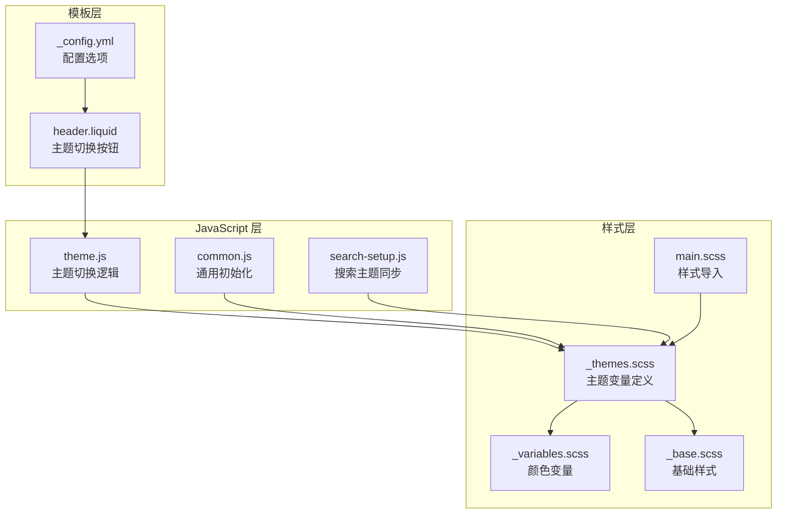
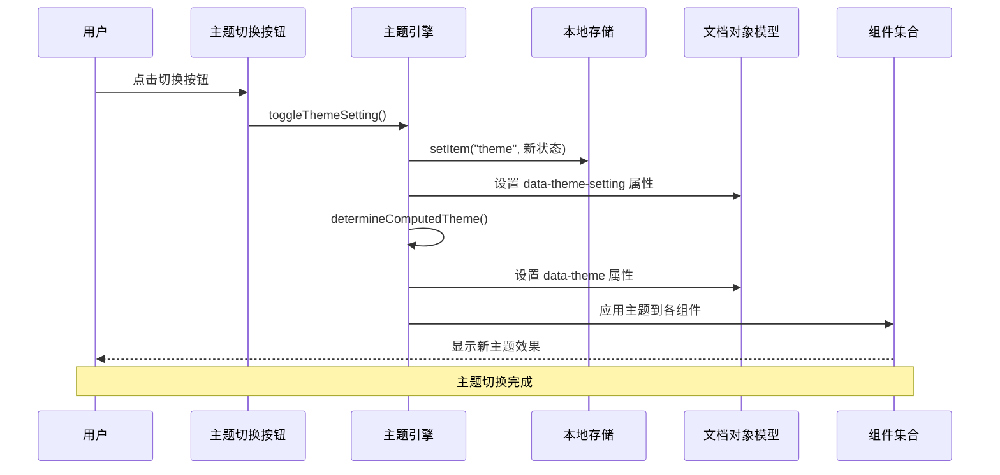
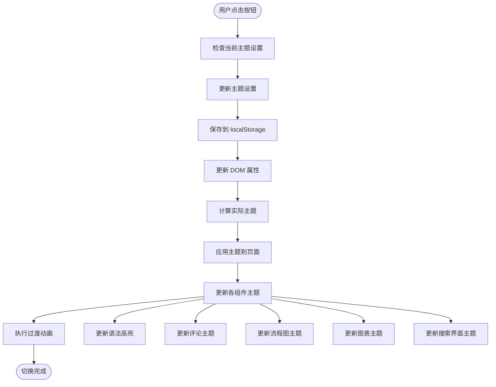
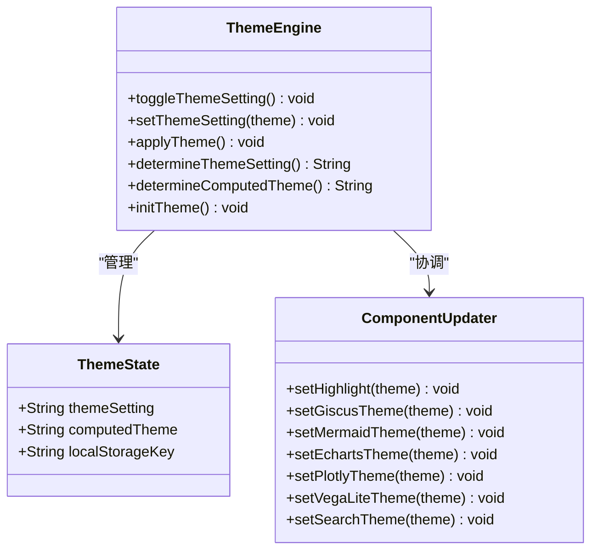
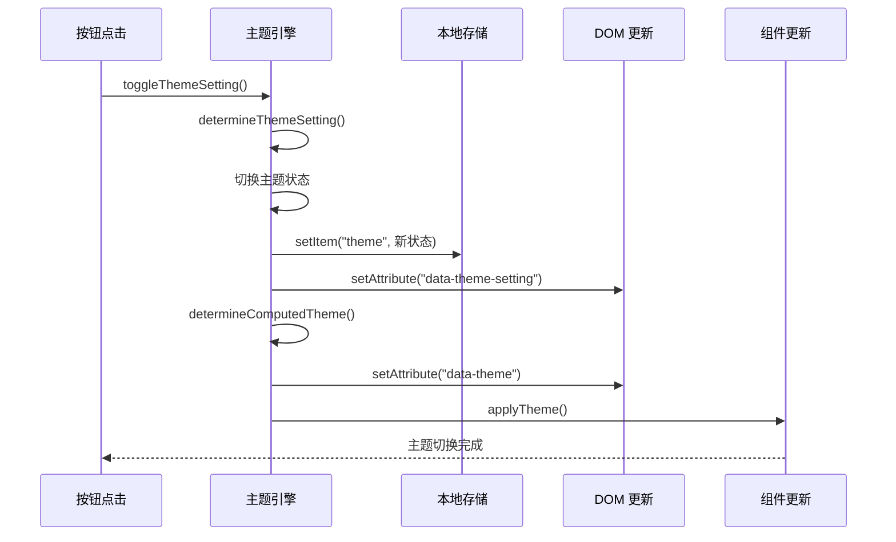
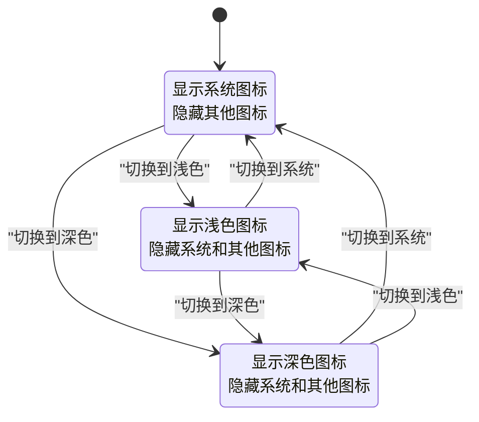
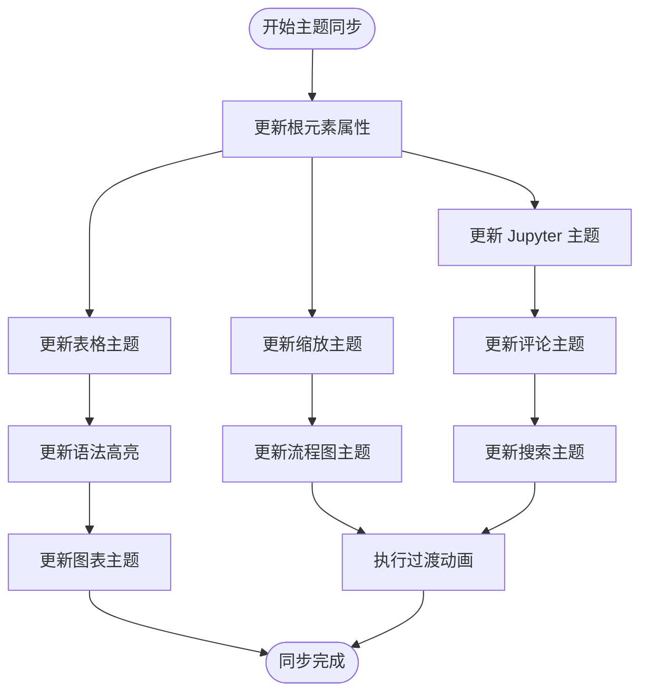
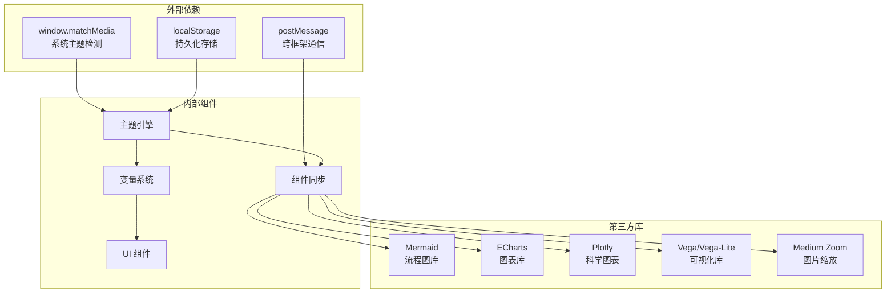
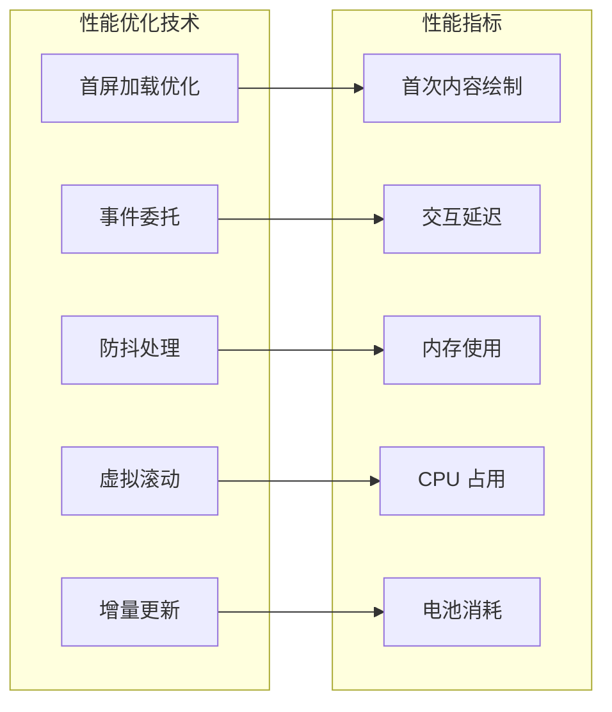

# 主题切换

<cite>
**本文档引用的文件**
- [theme.js](file://assets/js/theme.js)
- [_themes.scss](file://_sass/_themes.scss)
- [_variables.scss](file://_sass/_variables.scss)
- [header.liquid](file://_includes/header.liquid)
- [_base.scss](file://_sass/_base.scss)
- [common.js](file://assets/js/common.js)
- [search-setup.js](file://assets/js/search-setup.js)
- [_config.yml](file://_config.yml)
- [main.scss](file://assets/css/main.scss)
</cite>

## 目录
1. [简介](#简介)
2. [项目结构](#项目结构)
3. [核心组件](#核心组件)
4. [架构概览](#架构概览)
5. [详细组件分析](#详细组件分析)
6. [依赖关系分析](#依赖关系分析)
7. [性能考虑](#性能考虑)
8. [故障排除指南](#故障排除指南)
9. [结论](#结论)
10. [附录](#附录)

## 简介

al-folio 主题切换功能是一个完整的深色/浅色模式系统，提供了无缝的主题切换体验。该系统基于现代 Web 标准构建，包括 CSS 自定义属性、媒体查询检测、本地存储持久化和跨组件主题同步。

该功能的核心特性包括：
- 自动检测系统主题偏好
- 手动切换按钮控制
- 跨组件主题一致性
- 平滑的过渡动画效果
- 完善的无障碍访问支持

## 项目结构

主题切换功能涉及多个层次的文件组织：



**图表来源**
- [theme.js:1-299](file://assets/js/theme.js#L1-L299)
- [_themes.scss:1-162](file://_sass/_themes.scss#L1-L162)
- [_variables.scss:1-53](file://_sass/_variables.scss#L1-L53)
- [header.liquid:128-137](file://_includes/header.liquid#L128-L137)

**章节来源**
- [theme.js:1-299](file://assets/js/theme.js#L1-L299)
- [_themes.scss:1-162](file://_sass/_themes.scss#L1-L162)
- [header.liquid:128-137](file://_includes/header.liquid#L128-L137)

## 核心组件

### 主题切换引擎

主题切换系统的核心是 JavaScript 主题引擎，它负责管理主题状态、处理用户交互和协调各个组件的主题更新。

### CSS 变量系统

系统采用 CSS 自定义属性作为主题变量的基础，通过 `:root` 和 `html[data-theme]` 选择器实现主题状态的动态切换。

### 用户界面组件

主题切换按钮位于导航栏中，提供直观的用户交互入口，支持多种显示状态以反映当前主题设置。

**章节来源**
- [theme.js:4-13](file://assets/js/theme.js#L4-L13)
- [_themes.scss:7-77](file://_sass/_themes.scss#L7-L77)
- [header.liquid:128-137](file://_includes/header.liquid#L128-L137)

## 架构概览

主题切换系统的整体架构采用分层设计，确保各组件之间的松耦合和高内聚：



**图表来源**
- [theme.js:4-22](file://assets/js/theme.js#L4-L22)
- [theme.js:254-278](file://assets/js/theme.js#L254-L278)
- [theme.js:280-298](file://assets/js/theme.js#L280-L298)

### 数据流分析

主题切换过程中的数据流向展示了从用户交互到最终视觉效果的完整路径：



**图表来源**
- [theme.js:16-89](file://assets/js/theme.js#L16-L89)
- [theme.js:254-278](file://assets/js/theme.js#L254-L278)

## 详细组件分析

### 主题切换引擎

主题切换引擎是整个系统的核心，负责处理主题状态管理和组件协调工作。

#### 主题状态管理



**图表来源**
- [theme.js:4-298](file://assets/js/theme.js#L4-L298)

#### 主题切换序列



**图表来源**
- [theme.js:4-22](file://assets/js/theme.js#L4-L22)
- [theme.js:254-278](file://assets/js/theme.js#L254-L278)

**章节来源**
- [theme.js:4-298](file://assets/js/theme.js#L4-L298)

### CSS 变量系统

CSS 变量系统是主题切换功能的技术基础，通过自定义属性实现主题状态的动态管理。

#### 变量定义结构

系统采用分层的变量定义策略：

```mermaid
graph TB
subgraph "基础变量层"
Vars1[$white-color<br/>$black-color<br/>$grey-color]
Vars2[$red-color<br/>$blue-color<br/>$green-color]
Vars3[$purple-color<br/>$orange-color<br/>$yellow-color]
end
subgraph "主题变量层"
Root[:root<br/>全局默认变量]
Dark[html[data-theme='dark']<br/>深色主题变量]
Setting[html[data-theme-setting]<br/>设置状态变量]
end
subgraph "组件变量层"
Base[_base.scss<br/>基础元素变量]
Layout[_layout.scss<br/>布局变量]
Components[_components.scss<br/>组件变量]
end
Vars1 --> Root
Vars2 --> Root
Vars3 --> Root
Root --> Dark
Root --> Setting
Dark --> Components
Setting --> Components
```

**图表来源**
- [_variables.scss:8-34](file://_sass/_variables.scss#L8-L34)
- [_themes.scss:7-162](file://_sass/_themes.scss#L7-L162)

#### 变量使用模式

CSS 变量在不同组件中的使用模式：

| 组件类型 | 变量前缀 | 使用场景 | 示例 |
|---------|----------|----------|------|
| 基础元素 | `--global-` | 颜色、字体、间距 | `--global-text-color` |
| 主题特定 | `--theme-` | 组件特定颜色 | `--theme-primary-color` |
| 动态变量 | `--dynamic-` | 运行时变化值 | `--dynamic-opacity` |
| 响应式变量 | `--responsive-` | 媒体查询变量 | `--responsive-breakpoint` |

**章节来源**
- [_themes.scss:7-162](file://_sass/_themes.scss#L7-L162)
- [_variables.scss:8-34](file://_sass/_variables.scss#L8-L34)
- [_base.scss:19-200](file://_sass/_base.scss#L19-L200)

### 用户界面组件

主题切换按钮是用户与主题系统交互的主要界面元素。

#### 按钮状态管理



**图表来源**
- [header.liquid:128-137](file://_includes/header.liquid#L128-L137)
- [_themes.scss:126-161](file://_sass/_themes.scss#L126-L161)

#### 无障碍访问支持

主题切换按钮实现了完整的无障碍访问支持：

- **键盘导航**：支持 Tab 键导航和 Enter/Space 键激活
- **屏幕阅读器**：提供适当的 ARIA 标签和描述
- **焦点管理**：清晰的焦点指示器
- **颜色对比度**：确保在不同主题下都有足够的对比度

**章节来源**
- [header.liquid:128-137](file://_includes/header.liquid#L128-L137)
- [_themes.scss:126-161](file://_sass/_themes.scss#L126-L161)

### 组件主题同步

系统需要同步更新多个组件的主题状态，确保整体视觉一致性。

#### 组件同步流程



**图表来源**
- [theme.js:25-89](file://assets/js/theme.js#L25-L89)

#### 特殊组件处理

| 组件类型 | 处理方式 | 特殊考虑 |
|---------|----------|----------|
| 语法高亮 | 切换 CSS 文件 | 支持浅色/深色主题切换 |
| Giscus 评论 | PostMessage 通信 | 实时主题同步 |
| Mermaid 图表 | 重新渲染 | 保持交互功能 |
| ECharts 图表 | 重新初始化 | 保持数据和配置 |
| Plotly 图表 | 更新布局模板 | 保持样式一致性 |
| Vega-Lite 图表 | 重新渲染 | 支持主题参数 |
| 搜索界面 | 添加 CSS 类 | 同步搜索框主题 |

**章节来源**
- [theme.js:91-245](file://assets/js/theme.js#L91-L245)

## 依赖关系分析

主题切换功能涉及多个层面的依赖关系，形成了一个复杂的生态系统。



**图表来源**
- [theme.js:254-298](file://assets/js/theme.js#L254-L298)
- [theme.js:101-153](file://assets/js/theme.js#L101-L153)

### 关键依赖点

1. **系统主题检测**：依赖浏览器的 `prefers-color-scheme` 媒体查询
2. **用户偏好存储**：使用 localStorage 实现跨会话持久化
3. **组件通信**：通过 postMessage 实现跨 iframe 主题同步
4. **动态加载**：根据主题状态动态加载相应的 CSS 文件

**章节来源**
- [theme.js:254-298](file://assets/js/theme.js#L254-L298)
- [_config.yml:389](file://_config.yml#L389)

## 性能考虑

主题切换功能在设计时充分考虑了性能优化，确保在各种设备上都能提供流畅的用户体验。

### 加载优化策略

1. **首屏优化**：主题脚本放置在 `<head>` 标签中，避免闪烁效应
2. **懒加载策略**：非关键组件按需加载和初始化
3. **缓存机制**：利用浏览器缓存减少重复加载
4. **内存管理**：及时清理事件监听器和定时器

### 运行时性能



### 内存管理

系统采用以下内存管理策略：
- 及时移除不再使用的事件监听器
- 合理使用 WeakMap 和 WeakSet
- 避免内存泄漏的闭包引用
- 定期清理临时变量和 DOM 引用

## 故障排除指南

### 常见问题及解决方案

#### 主题切换不生效

**症状**：点击切换按钮后页面主题没有变化

**可能原因**：
1. localStorage 访问被阻止
2. CSS 变量未正确更新
3. JavaScript 执行错误

**解决步骤**：
1. 检查浏览器控制台是否有 JavaScript 错误
2. 验证 localStorage 是否可用
3. 确认 CSS 变量是否正确应用到 DOM 元素

#### 系统主题检测失败

**症状**：系统主题偏好无法正确检测

**可能原因**：
1. 浏览器不支持 `prefers-color-scheme` 媒体查询
2. 系统主题设置异常
3. JavaScript 执行环境限制

**解决方法**：
1. 提供降级方案（始终使用浅色或深色主题）
2. 检查浏览器兼容性
3. 确保媒体查询正确初始化

#### 组件主题不同步

**症状**：部分组件主题与其他组件不一致

**可能原因**：
1. 组件初始化顺序问题
2. 主题更新时机不当
3. 第三方库主题支持限制

**调试步骤**：
1. 检查组件主题更新函数的调用顺序
2. 验证主题状态的一致性
3. 确认第三方库的主题支持情况

**章节来源**
- [theme.js:254-298](file://assets/js/theme.js#L254-L298)
- [theme.js:25-89](file://assets/js/theme.js#L25-L89)

## 结论

al-folio 的主题切换功能展现了现代 Web 开发的最佳实践，通过精心设计的架构和实现策略，提供了完整的深色/浅色模式支持。

### 技术优势

1. **架构设计**：分层架构确保了良好的可维护性和扩展性
2. **性能优化**：多层优化策略保证了流畅的用户体验
3. **无障碍支持**：完整的无障碍访问实现体现了包容性设计
4. **跨组件一致性**：统一的主题管理系统确保了视觉一致性

### 最佳实践总结

1. **渐进增强**：从基础功能开始，逐步添加高级特性
2. **性能优先**：在设计阶段就考虑性能影响
3. **用户中心**：以用户需求和体验为核心进行设计
4. **可维护性**：代码结构清晰，便于后续维护和扩展

## 附录

### 配置选项参考

| 配置项 | 默认值 | 说明 |
|--------|--------|------|
| `enable_darkmode` | `true` | 启用/禁用主题切换功能 |
| `theme_setting` | `"system"` | 默认主题设置 |
| `transition_duration` | `500ms` | 过渡动画持续时间 |
| `storage_key` | `"theme"` | localStorage 键名 |

### 自定义主题指南

#### 颜色方案定制

要创建自定义主题，需要修改以下文件：

1. **颜色变量定义**：在 `_sass/_variables.scss` 中定义新的颜色变量
2. **主题变量映射**：在 `_sass/_themes.scss` 中更新主题变量映射
3. **组件样式调整**：根据需要调整具体组件的样式

#### 主题变量命名规范

```scss
// 基础颜色变量
$primary-color: #6366f1 !default;
$secondary-color: #8b5cf6 !default;
$accent-color: #ec4899 !default;

// 状态颜色变量
$success-color: #10b981 !default;
$warning-color: #f59e0b !default;
$danger-color: #ef4444 !default;

// 背景和文本颜色
$background-light: #ffffff !default;
$background-dark: #1c1c1d !default;
$text-light: #1c1c1d !default;
$text-dark: #ffffff !default;
```

#### 动画效果定制

系统支持多种动画效果，可以通过以下方式定制：

1. **过渡时长**：调整 `transition-duration` 变量
2. **缓动函数**：修改 `transition-timing-function` 变量
3. **动画类型**：添加新的 CSS 动画定义

### 故障排除清单

- [ ] 检查浏览器控制台是否有 JavaScript 错误
- [ ] 验证 localStorage 是否正常工作
- [ ] 确认 CSS 变量是否正确应用
- [ ] 测试系统主题检测功能
- [ ] 验证第三方组件的主题支持
- [ ] 检查网络连接和资源加载
- [ ] 确认浏览器兼容性要求