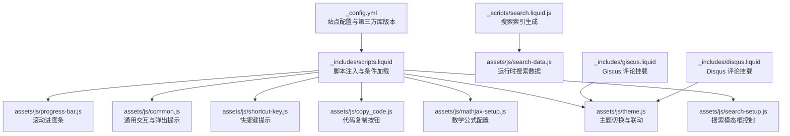
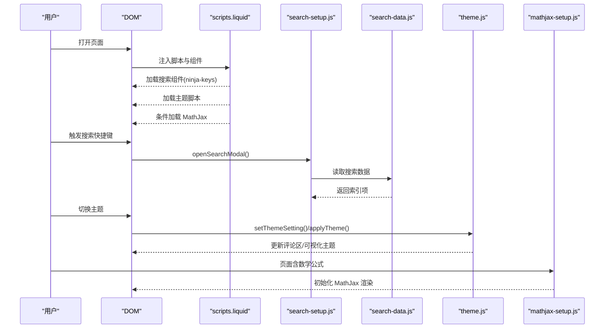
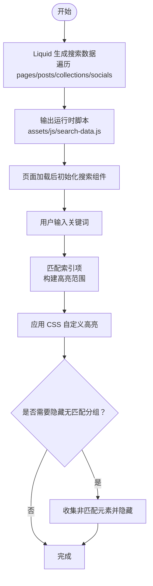
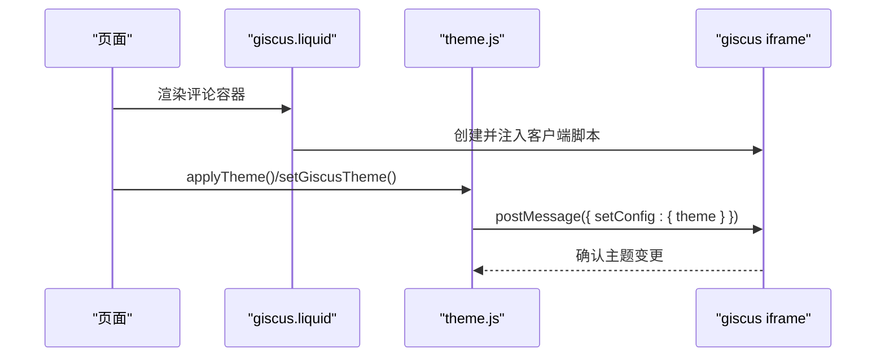
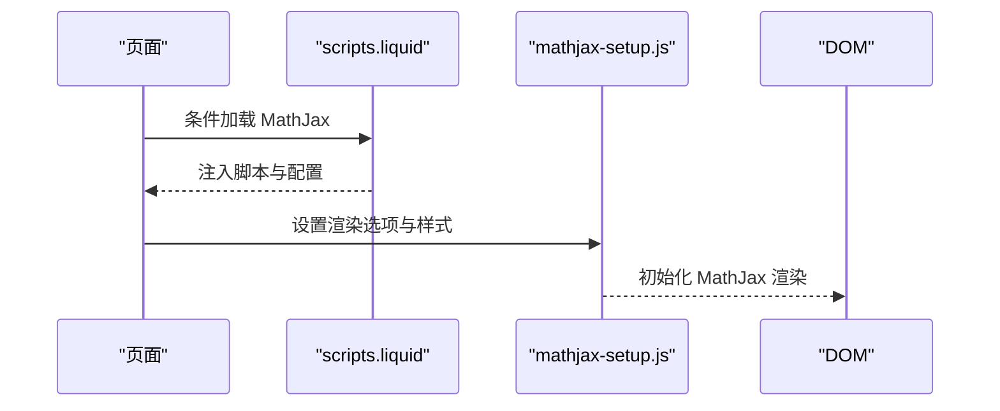
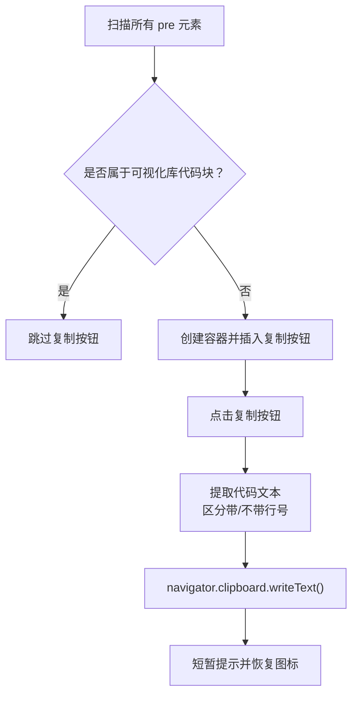
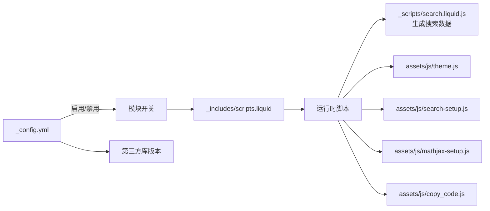

# 交互式组件

<cite>
**本文引用的文件**
- [_config.yml](file://_config.yml)
- [_includes/scripts.liquid](file://_includes/scripts.liquid)
- [_includes/giscus.liquid](file://_includes/giscus.liquid)
- [_includes/disqus.liquid](file://_includes/disqus.liquid)
- [_scripts/search.liquid.js](file://_scripts/search.liquid.js)
- [assets/js/search-setup.js](file://assets/js/search-setup.js)
- [assets/js/mathjax-setup.js](file://assets/js/mathjax-setup.js)
- [assets/js/copy_code.js](file://assets/js/copy_code.js)
- [assets/js/highlight-search-term.js](file://assets/js/highlight-search-term.js)
- [assets/js/theme.js](file://assets/js/theme.js)
- [assets/js/shortcut-key.js](file://assets/js/shortcut-key.js)
- [assets/js/common.js](file://assets/js/common.js)
- [assets/js/progress-bar.js](file://assets/js/progress-bar.js)
</cite>

## 目录
1. [简介](#简介)
2. [项目结构](#项目结构)
3. [核心组件](#核心组件)
4. [架构总览](#架构总览)
5. [详细组件分析](#详细组件分析)
6. [依赖关系分析](#依赖关系分析)
7. [性能考虑](#性能考虑)
8. [故障排查指南](#故障排查指南)
9. [结论](#结论)
10. [附录](#附录)

## 简介
本文件系统性梳理 al-folio 主题中的交互式组件，覆盖以下方面：
- 全文搜索：索引生成、搜索算法与结果高亮、主题联动
- 评论系统：Giscus 与 Disqus 的集成与配置
- 数学公式渲染：MathJax 配置与 LaTeX 支持
- 代码高亮与复制：语法高亮与一键复制按钮
- 表格与列表交互：主题适配与可访问性
- 表单与快捷键：键盘快捷键提示与跨平台适配
- 模态框与弹窗：搜索模态框与主题切换弹窗
- 性能优化与体验提升：懒加载、过渡动画、滚动进度条

## 项目结构
与交互式组件直接相关的目录与文件：
- 配置层：站点配置与第三方库版本管理
- 模板层：脚本注入与评论区挂载
- 资源层：搜索数据生成、交互脚本与样式

图表来源
- [_config.yml](file://_config.yml)
- [_includes/scripts.liquid](file://_includes/scripts.liquid)
- [_scripts/search.liquid.js](file://_scripts/search.liquid.js)
- [assets/js/search-setup.js](file://assets/js/search-setup.js)
- [assets/js/mathjax-setup.js](file://assets/js/mathjax-setup.js)
- [assets/js/copy_code.js](file://assets/js/copy_code.js)
- [assets/js/theme.js](file://assets/js/theme.js)
- [assets/js/shortcut-key.js](file://assets/js/shortcut-key.js)
- [assets/js/common.js](file://assets/js/common.js)
- [assets/js/progress-bar.js](file://assets/js/progress-bar.js)
- [_includes/giscus.liquid](file://_includes/giscus.liquid)
- [_includes/disqus.liquid](file://_includes/disqus.liquid)

章节来源
- [_config.yml](file://_config.yml)
- [_includes/scripts.liquid](file://_includes/scripts.liquid)

## 核心组件
- 搜索系统：基于自定义搜索组件与 Jekyll Liquid 生成的搜索数据，支持导航、文章、集合与社交链接的检索；支持键盘快捷键与主题联动。
- 评论系统：Giscus（推荐）与 Disqus（已标注弃用）两种方案，均通过动态注入脚本实现。
- 数学公式：MathJax 配置内联与块级公式支持，以及伪代码渲染的可选路径。
- 代码高亮与复制：在不被其他可视化库占用的代码块中插入复制按钮，并处理带行号与无行号两种情况。
- 主题系统：统一的主题设置、计算与应用，联动多种可视化组件与评论区。
- 表单与快捷键：对 Mac 平台显示命令键符号，提供一致的键盘提示。
- 滚动进度条：根据页面高度与视口高度计算滚动比例，兼容原生 progress 元素与降级方案。

章节来源
- [_config.yml](file://_config.yml)
- [_includes/scripts.liquid](file://_includes/scripts.liquid)
- [_scripts/search.liquid.js](file://_scripts/search.liquid.js)
- [assets/js/search-setup.js](file://assets/js/search-setup.js)
- [assets/js/mathjax-setup.js](file://assets/js/mathjax-setup.js)
- [assets/js/copy_code.js](file://assets/js/copy_code.js)
- [assets/js/theme.js](file://assets/js/theme.js)
- [assets/js/shortcut-key.js](file://assets/js/shortcut-key.js)
- [assets/js/common.js](file://assets/js/common.js)
- [assets/js/progress-bar.js](file://assets/js/progress-bar.js)

## 架构总览
下图展示交互式组件在页面生命周期中的装配与调用关系：

图表来源
- [_includes/scripts.liquid](file://_includes/scripts.liquid)
- [assets/js/search-setup.js](file://assets/js/search-setup.js)
- [_scripts/search.liquid.js](file://_scripts/search.liquid.js)
- [assets/js/theme.js](file://assets/js/theme.js)
- [assets/js/mathjax-setup.js](file://assets/js/mathjax-setup.js)

## 详细组件分析

### 全文搜索
- 索引生成
  - 使用 Liquid 模板遍历页面、文章、集合与社交数据，构建搜索数据对象数组，输出为运行时脚本文件，供前端直接消费。
  - 支持导航、文章、集合与社交链接的分类与描述字段，便于搜索结果分组与展示。
- 搜索算法与高亮
  - 基于自定义搜索组件的输入事件，结合 CSS 自定义高亮 API 对命中文本进行高亮；未匹配元素可被识别以便进一步 UI 处理。
  - 提供非匹配元素集合返回值，便于隐藏或折叠无结果分组。
- 结果排序与打开行为
  - 导航与文章项支持点击跳转或外部重定向；集合项支持内联内容与独立页面的不同处理。
- 主题联动
  - 搜索组件根据当前主题类名切换深浅色样式，确保与整体视觉一致。

图表来源
- [_scripts/search.liquid.js](file://_scripts/search.liquid.js)
- [assets/js/highlight-search-term.js](file://assets/js/highlight-search-term.js)
- [assets/js/search-setup.js](file://assets/js/search-setup.js)

章节来源
- [_scripts/search.liquid.js](file://_scripts/search.liquid.js)
- [assets/js/search-setup.js](file://assets/js/search-setup.js)
- [assets/js/highlight-search-term.js](file://assets/js/highlight-search-term.js)

### 评论系统集成（Giscus 与 Disqus）
- Giscus（推荐）
  - 动态创建脚本节点，注入仓库、分类、映射方式、语言等参数；根据当前主题自动设置评论区主题；提供无脚本提示。
  - 通过 postMessage 与 iframe 内容窗口通信，实现主题切换时的即时更新。
- Disqus（已标注弃用）
  - 以嵌入脚本方式加载评论，保留历史兼容。

图表来源
- [_includes/giscus.liquid](file://_includes/giscus.liquid)
- [assets/js/theme.js](file://assets/js/theme.js)

章节来源
- [_includes/giscus.liquid](file://_includes/giscus.liquid)
- [_includes/disqus.liquid](file://_includes/disqus.liquid)
- [assets/js/theme.js](file://assets/js/theme.js)

### 数学公式渲染（MathJax）
- 配置
  - 启用后按需加载 MathJax 脚本与 Polyfill；内联与块级公式支持；通过自定义样式保证渲染容器颜色继承。
- LaTeX 支持
  - 默认启用内联与块级数学标记；可配合伪代码渲染模块在特定页面禁用默认渲染路径。

图表来源
- [_includes/scripts.liquid](file://_includes/scripts.liquid)
- [assets/js/mathjax-setup.js](file://assets/js/mathjax-setup.js)

章节来源
- [_includes/scripts.liquid](file://_includes/scripts.liquid)
- [assets/js/mathjax-setup.js](file://assets/js/mathjax-setup.js)

### 代码高亮与复制
- 语法高亮
  - 通过站点配置启用语法高亮；针对不同可视化库（如图表、Mermaid、Diff2HTML 等）的代码块排除复制按钮，避免冲突。
- 复制按钮
  - 在符合条件的代码块外层包裹容器，插入“复制”按钮；支持带行号与不带行号两种代码块；复制成功后短暂提示并恢复图标。
- 行号处理
  - 当检测到带行号的代码块时，从不含行号的选择器中提取纯文本，确保复制内容整洁。

图表来源
- [assets/js/copy_code.js](file://assets/js/copy_code.js)

章节来源
- [assets/js/copy_code.js](file://assets/js/copy_code.js)

### 表格与列表交互
- 主题适配
  - 主题切换时为所有表格添加/移除暗色类名，确保在不同主题下的可读性。
- 列表展开
  - 通用脚本为摘要、奖项与 BibTeX 按钮提供切换逻辑，增强列表信息密度与交互性。
- 弹出提示
  - 使用引导组件为带数据属性的元素提供悬停提示，改善可发现性。

章节来源
- [assets/js/theme.js](file://assets/js/theme.js)
- [assets/js/common.js](file://assets/js/common.js)

### 表单与快捷键
- 快捷键提示
  - 根据平台判断是否为 Mac，动态替换搜索快捷键显示为命令键符号，提升跨平台一致性。
- 搜索快捷键
  - 通过脚本控制打开搜索模态框，同时在移动端折叠导航栏，保证操作流畅。

章节来源
- [assets/js/shortcut-key.js](file://assets/js/shortcut-key.js)
- [assets/js/search-setup.js](file://assets/js/search-setup.js)

### 模态框与弹窗
- 搜索模态框
  - 使用自定义组件作为搜索入口，支持键盘快捷键触发与主题样式切换。
- 主题切换弹窗
  - 主题切换按钮绑定事件，通过统一的状态机更新主题设置与计算主题，触达各子系统。

章节来源
- [_includes/scripts.liquid](file://_includes/scripts.liquid)
- [assets/js/search-setup.js](file://assets/js/search-setup.js)
- [assets/js/theme.js](file://assets/js/theme.js)

## 依赖关系分析
- 配置驱动
  - 站点配置决定是否启用搜索、数学公式、进度条、暗色模式等特性；第三方库版本由配置集中管理。
- 组件耦合
  - 搜索组件与主题系统强耦合（样式类名与主题切换），评论区与主题系统弱耦合（通过 postMessage 通信）。
- 运行时数据
  - 搜索数据由 Liquid 在构建期生成，运行时仅消费，降低前端负担。

图表来源
- [_config.yml](file://_config.yml)
- [_includes/scripts.liquid](file://_includes/scripts.liquid)
- [_scripts/search.liquid.js](file://_scripts/search.liquid.js)
- [assets/js/theme.js](file://assets/js/theme.js)
- [assets/js/search-setup.js](file://assets/js/search-setup.js)
- [assets/js/mathjax-setup.js](file://assets/js/mathjax-setup.js)
- [assets/js/copy_code.js](file://assets/js/copy_code.js)

章节来源
- [_config.yml](file://_config.yml)
- [_includes/scripts.liquid](file://_includes/scripts.liquid)
- [_scripts/search.liquid.js](file://_scripts/search.liquid.js)

## 性能考虑
- 懒加载与延迟初始化
  - 多数交互脚本采用延迟加载策略，减少首屏阻塞；滚动进度条在页面资源加载完成后延迟初始化，避免尺寸计算偏差。
- 轻量级高亮
  - 使用 CSS 自定义高亮 API 实现文本高亮，避免复杂 DOM 操作；仅在存在匹配时创建高亮对象。
- 主题切换过渡
  - 通过短时过渡类名实现平滑切换，避免频繁重排；主题切换时批量更新多组件状态，减少重复渲染。
- 资源版本化与完整性校验
  - 第三方库通过完整性哈希与版本号管理，确保缓存与安全。

章节来源
- [assets/js/progress-bar.js](file://assets/js/progress-bar.js)
- [assets/js/highlight-search-term.js](file://assets/js/highlight-search-term.js)
- [assets/js/theme.js](file://assets/js/theme.js)
- [_config.yml](file://_config.yml)

## 故障排查指南
- 搜索无结果或无法打开
  - 确认站点配置中启用了搜索与相关模块；检查运行时搜索数据是否正确生成；确认快捷键触发逻辑与移动端导航折叠。
- 评论区主题不生效
  - 确认 Giscus 已正确注入且 iframe 可见；检查主题切换时 postMessage 是否发送成功；若无 iframe，等待异步加载完成。
- 数学公式不渲染
  - 确认已启用数学公式；检查 MathJax 脚本加载与配置；避免与伪代码渲染模块冲突。
- 复制按钮不出现
  - 检查代码块是否被其他可视化库占用；确认脚本未被压缩工具误改；验证选择器匹配逻辑。
- 滚动进度条异常
  - 确认页面内容足够长；检查初始化延迟与窗口尺寸变化事件；确认原生 progress 元素支持情况。

章节来源
- [_config.yml](file://_config.yml)
- [_includes/giscus.liquid](file://_includes/giscus.liquid)
- [assets/js/search-setup.js](file://assets/js/search-setup.js)
- [assets/js/mathjax-setup.js](file://assets/js/mathjax-setup.js)
- [assets/js/copy_code.js](file://assets/js/copy_code.js)
- [assets/js/progress-bar.js](file://assets/js/progress-bar.js)

## 结论
al-folio 的交互式组件以配置驱动与模板生成为核心，结合轻量脚本与第三方库，实现了搜索、评论、数学公式、代码复制与主题联动等能力。通过合理的延迟加载、CSS 高亮与主题统一机制，兼顾了性能与体验。建议在定制时遵循现有模块边界，保持主题与搜索数据的一致性，并关注跨平台与无障碍细节。

## 附录
- 关键实现路径参考
  - 搜索索引生成：[_scripts/search.liquid.js](file://_scripts/search.liquid.js)
  - 搜索初始化与快捷键：[assets/js/search-setup.js](file://assets/js/search-setup.js)
  - 数学公式配置：[assets/js/mathjax-setup.js](file://assets/js/mathjax-setup.js)
  - 代码复制按钮：[assets/js/copy_code.js](file://assets/js/copy_code.js)
  - 主题切换与联动：[assets/js/theme.js](file://assets/js/theme.js)
  - 快捷键提示：[assets/js/shortcut-key.js](file://assets/js/shortcut-key.js)
  - 通用交互与弹出：[assets/js/common.js](file://assets/js/common.js)
  - 滚动进度条：[assets/js/progress-bar.js](file://assets/js/progress-bar.js)