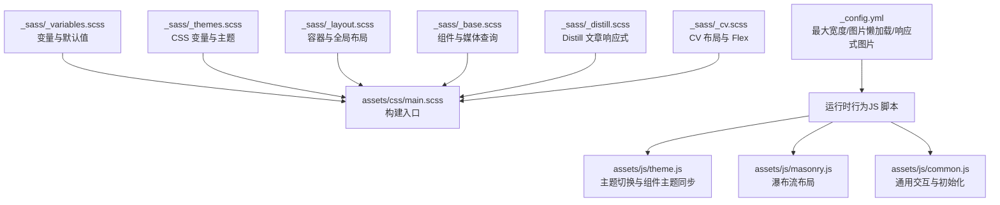
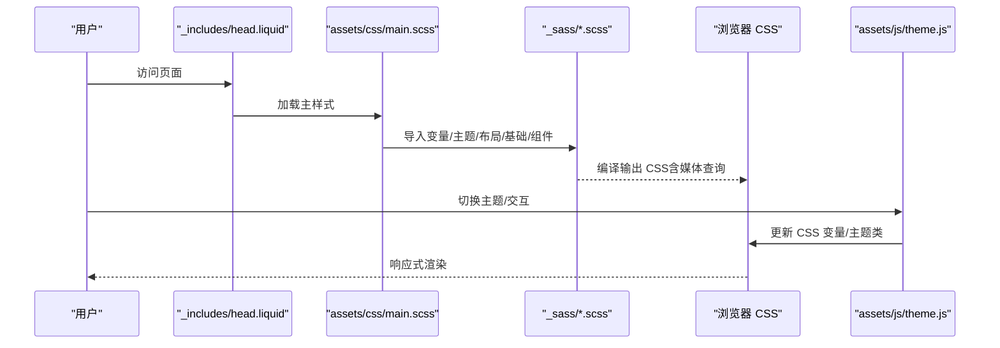
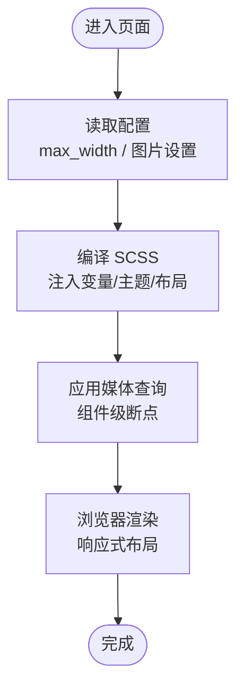
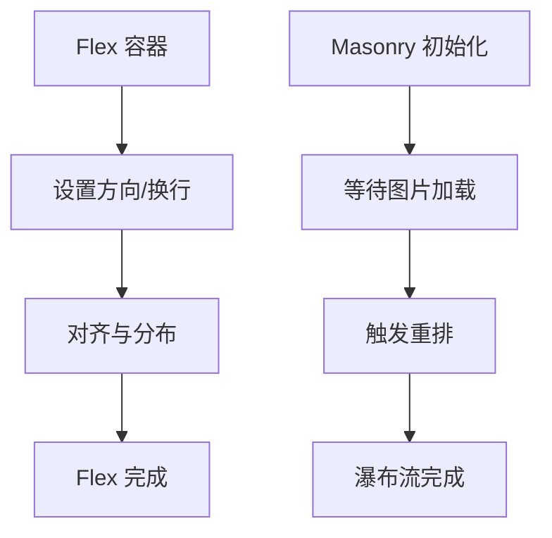
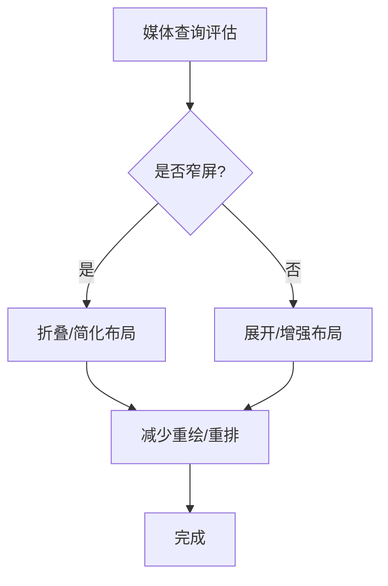
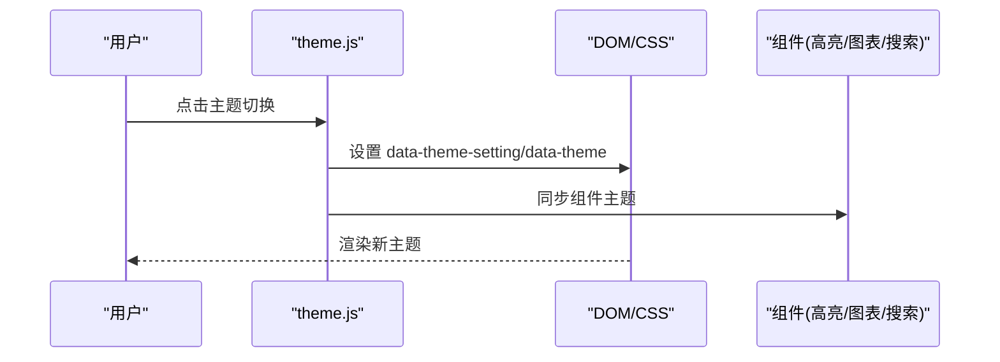
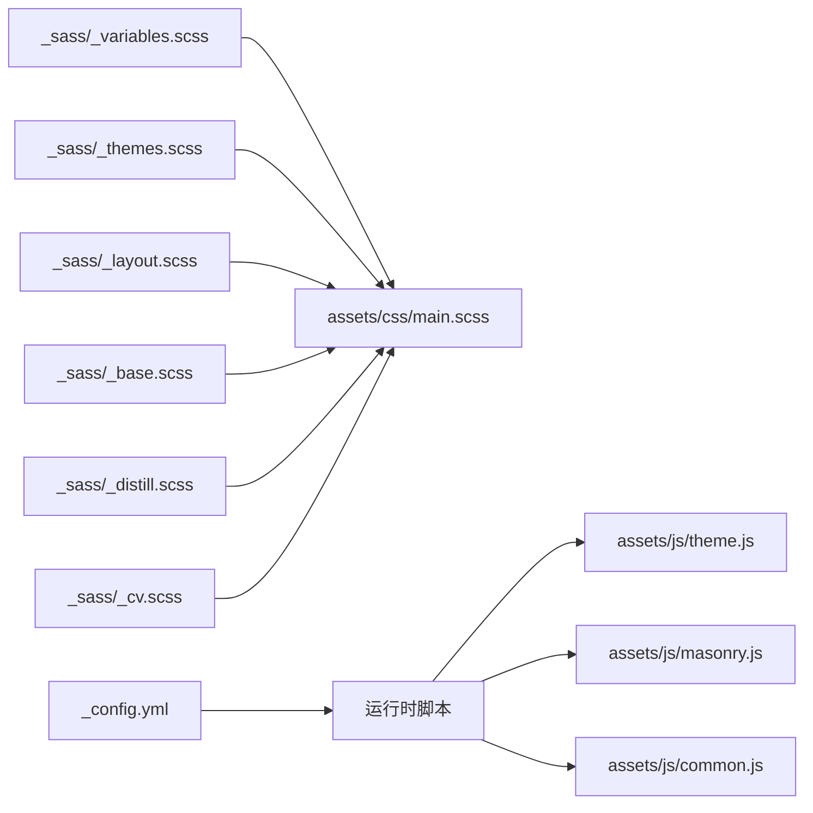

# 响应式设计

<cite>
**本文引用的文件**
- [_sass/_variables.scss](file://_sass/_variables.scss)
- [_sass/_layout.scss](file://_sass/_layout.scss)
- [_sass/_base.scss](file://_sass/_base.scss)
- [_sass/_themes.scss](file://_sass/_themes.scss)
- [_sass/_distill.scss](file://_sass/_distill.scss)
- [_sass/_cv.scss](file://_sass/_cv.scss)
- [assets/css/main.scss](file://assets/css/main.scss)
- [_config.yml](file://_config.yml)
- [_includes/head.liquid](file://_includes/head.liquid)
- [_includes/scripts.liquid](file://_includes/scripts.liquid)
- [assets/js/theme.js](file://assets/js/theme.js)
- [assets/js/masonry.js](file://assets/js/masonry.js)
- [assets/js/common.js](file://assets/js/common.js)
</cite>

## 目录
1. [简介](#简介)
2. [项目结构](#项目结构)
3. [核心组件](#核心组件)
4. [架构总览](#架构总览)
5. [详细组件分析](#详细组件分析)
6. [依赖关系分析](#依赖关系分析)
7. [性能考量](#性能考量)
8. [故障排查指南](#故障排查指南)
9. [结论](#结论)
10. [附录](#附录)

## 简介
本文件系统性梳理 al-folio 主题在响应式设计方面的实现与最佳实践，覆盖断点体系、弹性布局与网格系统、媒体查询策略、字体与间距的响应式调整、图片与视频的自适应处理、触摸交互优化、高分辨率屏幕适配、测试与调试方法，以及可复用的适配案例与建议。

## 项目结构
al-folio 的响应式能力由“变量与主题（SCSS）+ 构建入口（SCSS）+ 配置（YAML）+ 运行时脚本（JS）”协同实现：
- 变量与主题：通过 SCSS 变量与 CSS 自定义属性统一管理断点、颜色与布局约束。
- 构建入口：将变量、主题、布局、基础样式等按序导入，形成最终样式表。
- 配置：站点配置中定义最大内容宽度、图片懒加载、响应式图片生成等。
- 运行时脚本：主题切换、暗色模式、交互增强（如 Masonry、Medium Zoom）等。

图表来源
- [_sass/_variables.scss:1-53](file://_sass/_variables.scss#L1-L53)
- [_sass/_themes.scss:1-162](file://_sass/_themes.scss#L1-L162)
- [_sass/_layout.scss:1-54](file://_sass/_layout.scss#L1-L54)
- [_sass/_base.scss:1-1420](file://_sass/_base.scss#L1-L1420)
- [_sass/_distill.scss:1-172](file://_sass/_distill.scss#L1-L172)
- [_sass/_cv.scss:1-221](file://_sass/_cv.scss#L1-L221)
- [assets/css/main.scss:1-26](file://assets/css/main.scss#L1-L26)
- [_config.yml:58-646](file://_config.yml#L58-L646)
- [assets/js/theme.js:1-299](file://assets/js/theme.js#L1-L299)
- [assets/js/masonry.js:1-12](file://assets/js/masonry.js#L1-L12)
- [assets/js/common.js:1-60](file://assets/js/common.js#L1-L60)

章节来源
- [assets/css/main.scss:1-26](file://assets/css/main.scss#L1-L26)
- [_sass/_variables.scss:1-53](file://_sass/_variables.scss#L1-L53)
- [_sass/_themes.scss:1-162](file://_sass/_themes.scss#L1-L162)
- [_sass/_layout.scss:1-54](file://_sass/_layout.scss#L1-L54)
- [_sass/_base.scss:1-1420](file://_sass/_base.scss#L1-L1420)
- [_sass/_distill.scss:1-172](file://_sass/_distill.scss#L1-L172)
- [_sass/_cv.scss:1-221](file://_sass/_cv.scss#L1-L221)
- [_config.yml:58-646](file://_config.yml#L58-L646)

## 核心组件
- 断点与容器宽度
  - 最大内容宽度由配置项控制，SCSS 中以变量形式注入，确保桌面端内容宽度上限一致。
  - 全局容器宽度受该变量约束，保证在不同页面布局下具有一致的阅读宽度体验。
- 主题与颜色系统
  - 使用 CSS 自定义属性集中管理文本、背景、分隔线、卡片、高亮等颜色；支持浅色/深色两套主题，并可通过数据属性切换。
- 媒体查询与组件级响应式
  - 在基础样式中广泛采用 min-width 与 max-width 媒体查询，针对导航栏、个人资料、仓库列表、博客列表、项目网格等进行适配。
- 弹性布局与网格
  - CV 模块大量使用 Flexbox（flex-direction、flex-wrap、justify-content、align-items）组织时间轴、技能条目等。
  - 项目展示模块使用 Masonry 瀑布流布局，结合图片加载完成后的重新布局，提升移动端视觉密度与性能。
- 图片与视频自适应
  - 配置启用响应式 WebP 图像与懒加载，减少移动端带宽占用；Distill 文章对侧边目录在窄屏下折叠为块级展示。
- 触摸与交互优化
  - 导航栏汉堡菜单、社交图标、返回顶部按钮等在小屏下更易触达；Medium Zoom 提供缩放交互；TOC 在窄屏下简化。
- 高分辨率与视网膜屏
  - 通过响应式图片宽度数组与懒加载策略降低高分辨率设备的资源压力；主题切换时更新 Medium Zoom 背景以匹配当前主题。

章节来源
- [_config.yml:58-646](file://_config.yml#L58-L646)
- [_sass/_layout.scss:30-32](file://_sass/_layout.scss#L30-L32)
- [_sass/_themes.scss:7-162](file://_sass/_themes.scss#L7-L162)
- [_sass/_base.scss:217-228](file://_sass/_base.scss#L217-L228)
- [_sass/_base.scss:540-545](file://_sass/_base.scss#L540-L545)
- [_sass/_base.scss:1093-1287](file://_sass/_base.scss#L1093-L1287)
- [_sass/_cv.scss:75-83](file://_sass/_cv.scss#L75-L83)
- [_sass/_cv.scss:100-116](file://_sass/_cv.scss#L100-L116)
- [assets/js/masonry.js:1-12](file://assets/js/masonry.js#L1-L12)
- [_sass/_distill.scss:154-172](file://_sass/_distill.scss#L154-L172)
- [assets/js/theme.js:83-88](file://assets/js/theme.js#L83-L88)

## 架构总览
下图展示了响应式设计从变量到运行时的端到端流程：

图表来源
- [_includes/head.liquid:1-190](file://_includes/head.liquid#L1-L190)
- [assets/css/main.scss:1-26](file://assets/css/main.scss#L1-L26)
- [_sass/_variables.scss:1-53](file://_sass/_variables.scss#L1-L53)
- [_sass/_themes.scss:1-162](file://_sass/_themes.scss#L1-L162)
- [_sass/_layout.scss:1-54](file://_sass/_layout.scss#L1-L54)
- [_sass/_base.scss:1-1420](file://_sass/_base.scss#L1-L1420)
- [assets/js/theme.js:1-299](file://assets/js/theme.js#L1-L299)

## 详细组件分析

### 断点系统与容器宽度
- 容器最大宽度
  - 在配置中设置最大内容宽度，SCSS 构建入口将其注入变量，全局容器受此限制，确保桌面端内容宽度一致。
- 组件级断点
  - 导航栏、个人资料、仓库列表、博客列表、项目网格等在不同断点下改变布局或尺寸，避免内容拥挤。
- 响应式图片与懒加载
  - 配置启用响应式 WebP 与懒加载，减少移动端带宽与首屏渲染压力。

图表来源
- [_config.yml:58-646](file://_config.yml#L58-L646)
- [assets/css/main.scss:1-26](file://assets/css/main.scss#L1-L26)
- [_sass/_layout.scss:30-32](file://_sass/_layout.scss#L30-L32)
- [_sass/_base.scss:217-228](file://_sass/_base.scss#L217-L228)

章节来源
- [_config.yml:58-646](file://_config.yml#L58-L646)
- [assets/css/main.scss:6-7](file://assets/css/main.scss#L6-L7)
- [_sass/_layout.scss:30-32](file://_sass/_layout.scss#L30-L32)
- [_sass/_base.scss:217-228](file://_sass/_base.scss#L217-L228)

### 弹性布局与网格系统
- Flexbox 应用
  - CV 模块广泛使用 Flexbox 实现多行、换行、居中与弹性分配，适合简历、时间轴、技能条目等场景。
- 瀑布流布局
  - 项目网格使用 Masonry，在图片加载完成后触发重排，保证在不同断点下的视觉一致性与性能平衡。

图表来源
- [_sass/_cv.scss:75-83](file://_sass/_cv.scss#L75-L83)
- [_sass/_cv.scss:100-116](file://_sass/_cv.scss#L100-L116)
- [assets/js/masonry.js:1-12](file://assets/js/masonry.js#L1-L12)

章节来源
- [_sass/_cv.scss:75-116](file://_sass/_cv.scss#L75-L116)
- [assets/js/masonry.js:1-12](file://assets/js/masonry.js#L1-L12)

### 媒体查询最佳实践与性能考虑
- 媒体查询策略
  - 使用 min-width 与 max-width 组合，优先在组件层面对齐断点，避免全局样式冲突。
  - 在窄屏下折叠复杂布局（如 Distill 文章侧边目录），减少滚动与重绘成本。
- 性能优化
  - 启用图片懒加载与响应式图片，降低移动端带宽与内存占用。
  - 将第三方库按需加载，避免阻塞主线程。

图表来源
- [_sass/_base.scss:1093-1287](file://_sass/_base.scss#L1093-L1287)
- [_sass/_distill.scss:154-172](file://_sass/_distill.scss#L154-L172)
- [_config.yml:347-394](file://_config.yml#L347-L394)

章节来源
- [_sass/_base.scss:1093-1287](file://_sass/_base.scss#L1093-L1287)
- [_sass/_distill.scss:154-172](file://_sass/_distill.scss#L154-L172)
- [_config.yml:347-394](file://_config.yml#L347-L394)

### 字体大小与间距的响应式调整
- 字体与间距
  - 基础样式中对标题、段落、列表等元素设置了相对字号与内边距，配合媒体查询在窄屏下微调，保持可读性与节奏感。
- 主题切换影响
  - 主题切换脚本会根据当前主题更新代码高亮与组件主题，间接影响字体与色彩对比度。

章节来源
- [_sass/_base.scss:5-1420](file://_sass/_base.scss#L5-L1420)
- [assets/js/theme.js:91-99](file://assets/js/theme.js#L91-L99)

### 图片与视频的自适应处理
- 响应式图片
  - 配置指定多种宽度与输出格式，自动为不同 DPR 生成合适尺寸的图片，结合懒加载减少资源浪费。
- 视频嵌入
  - 配置项控制是否启用视频嵌入，若禁用则以新窗口打开链接，避免移动端播放器带来的额外开销。

章节来源
- [_config.yml:347-394](file://_config.yml#L347-L394)

### 触摸设备的交互优化
- 导航与按钮
  - 导航栏汉堡菜单、社交图标、返回顶部按钮在窄屏下增大触控面积，提升可用性。
- 缩放与滚动
  - Medium Zoom 提供缩放交互；滚动进度条与 TOC 在窄屏下简化，避免遮挡内容。

章节来源
- [_sass/_base.scss:246-384](file://_sass/_base.scss#L246-L384)
- [assets/js/theme.js:83-88](file://assets/js/theme.js#L83-L88)
- [assets/js/common.js:21-32](file://assets/js/common.js#L21-L32)

### 高分辨率屏幕与视网膜显示适配
- 响应式图片宽度数组与懒加载策略，有效平衡清晰度与性能。
- 主题切换时更新 Medium Zoom 背景，确保高对比度与可读性。

章节来源
- [_config.yml:347-394](file://_config.yml#L347-L394)
- [assets/js/theme.js:83-88](file://assets/js/theme.js#L83-L88)

### 主题切换与组件主题同步
- 主题切换逻辑
  - 通过数据属性与 CSS 变量实现主题切换；同时更新代码高亮、Mermaid、Diff2HTML、ECharts、Plotly、Vega Lite、搜索框等组件的主题。
- 动画过渡
  - 切换时添加过渡类，平滑主题变化。

图表来源
- [assets/js/theme.js:1-299](file://assets/js/theme.js#L1-L299)

章节来源
- [assets/js/theme.js:1-299](file://assets/js/theme.js#L1-L299)

## 依赖关系分析
- 变量与主题
  - 变量文件提供颜色与尺寸基线；主题文件通过 CSS 自定义属性与数据属性实现主题切换。
- 构建入口
  - 主样式入口按顺序导入变量、主题、布局、基础与组件样式，确保依赖链路清晰。
- 配置驱动
  - 配置文件决定最大宽度、图片策略与功能开关，直接影响运行时行为。
- 运行时脚本
  - 主题脚本负责主题切换与组件同步；Masonry 负责瀑布流布局；common 负责通用交互初始化。

图表来源
- [_sass/_variables.scss:1-53](file://_sass/_variables.scss#L1-L53)
- [_sass/_themes.scss:1-162](file://_sass/_themes.scss#L1-L162)
- [_sass/_layout.scss:1-54](file://_sass/_layout.scss#L1-L54)
- [_sass/_base.scss:1-1420](file://_sass/_base.scss#L1-L1420)
- [_sass/_distill.scss:1-172](file://_sass/_distill.scss#L1-L172)
- [_sass/_cv.scss:1-221](file://_sass/_cv.scss#L1-L221)
- [assets/css/main.scss:1-26](file://assets/css/main.scss#L1-L26)
- [_config.yml:58-646](file://_config.yml#L58-L646)
- [assets/js/theme.js:1-299](file://assets/js/theme.js#L1-L299)
- [assets/js/masonry.js:1-12](file://assets/js/masonry.js#L1-L12)
- [assets/js/common.js:1-60](file://assets/js/common.js#L1-L60)

章节来源
- [assets/css/main.scss:1-26](file://assets/css/main.scss#L1-L26)
- [_sass/_variables.scss:1-53](file://_sass/_variables.scss#L1-L53)
- [_sass/_themes.scss:1-162](file://_sass/_themes.scss#L1-L162)
- [_sass/_layout.scss:1-54](file://_sass/_layout.scss#L1-L54)
- [_sass/_base.scss:1-1420](file://_sass/_base.scss#L1-L1420)
- [_sass/_distill.scss:1-172](file://_sass/_distill.scss#L1-L172)
- [_sass/_cv.scss:1-221](file://_sass/_cv.scss#L1-L221)
- [_config.yml:58-646](file://_config.yml#L58-L646)
- [assets/js/theme.js:1-299](file://assets/js/theme.js#L1-L299)
- [assets/js/masonry.js:1-12](file://assets/js/masonry.js#L1-L12)
- [assets/js/common.js:1-60](file://assets/js/common.js#L1-L60)

## 性能考量
- 图片与网络
  - 启用响应式图片与懒加载，减少移动端带宽与内存占用。
- 渲染与重排
  - 在窄屏下简化布局，减少重绘与重排；瀑布流在图片加载后一次性布局，避免频繁重排。
- 资源加载
  - 第三方库按需加载，避免阻塞主线程；主题切换时仅更新必要组件。

[本节为通用指导，无需列出章节来源]

## 故障排查指南
- 主题切换无效
  - 检查数据属性设置与 CSS 变量是否正确；确认主题脚本已加载且未被 CSP 阻止。
- 图片不显示或加载缓慢
  - 检查响应式图片配置与懒加载开关；确认图片路径与格式支持。
- 瀑布流布局错乱
  - 确认图片加载完成事件已触发；检查 Masonry 初始化参数与容器选择器。
- 窄屏布局异常
  - 检查媒体查询断点与组件样式覆盖；确认容器最大宽度设置合理。

章节来源
- [assets/js/theme.js:1-299](file://assets/js/theme.js#L1-L299)
- [_config.yml:347-394](file://_config.yml#L347-L394)
- [assets/js/masonry.js:1-12](file://assets/js/masonry.js#L1-L12)
- [_sass/_base.scss:1093-1287](file://_sass/_base.scss#L1093-L1287)

## 结论
al-folio 的响应式设计以变量与主题为核心，结合组件级媒体查询、Flexbox 与 Masonry 等技术手段，在桌面与移动设备间实现了良好的可读性与交互体验。通过配置驱动的图片策略与按需加载的运行时脚本，兼顾了性能与可维护性。遵循本文档的断点策略、布局模式与调试方法，可在实际项目中快速落地高质量的响应式方案。

[本节为总结，无需列出章节来源]

## 附录
- 实际适配案例
  - 导航栏在中等屏下保持紧凑，在小屏下折叠为汉堡菜单。
  - 个人资料在小屏下缩小宽度，避免溢出。
  - 项目网格在窄屏下减少列数并启用瀑布流，提升视觉密度。
  - Distill 文章在窄屏下将侧边目录改为块级展示，减少滚动负担。
- 最佳实践建议
  - 优先使用组件级媒体查询，避免全局样式冲突。
  - 在窄屏下优先简化布局与交互，再逐步增强。
  - 合理设置最大内容宽度，确保桌面端阅读体验。
  - 启用响应式图片与懒加载，关注首屏性能与内存占用。

[本节为概念性内容，无需列出章节来源]