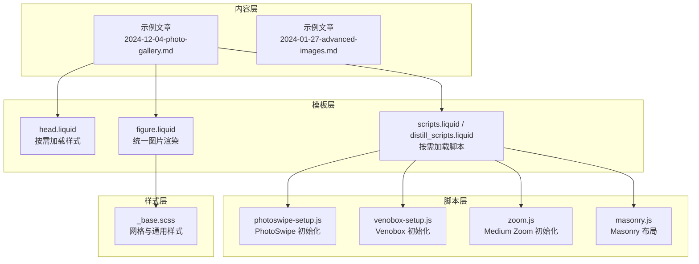
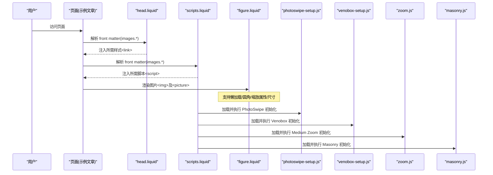
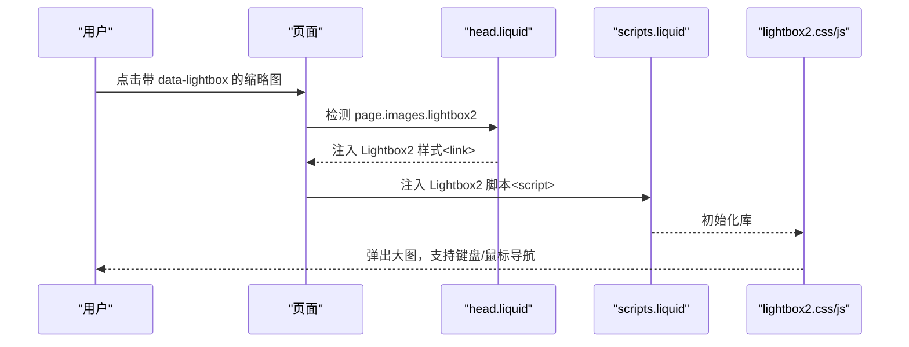
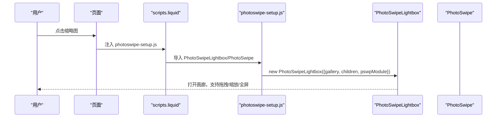
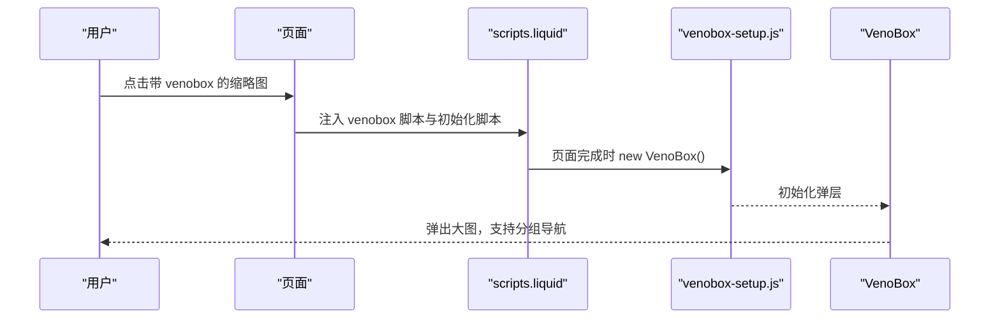
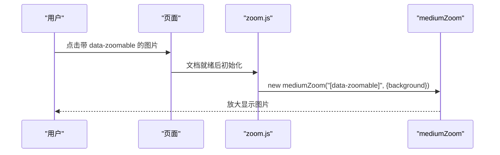
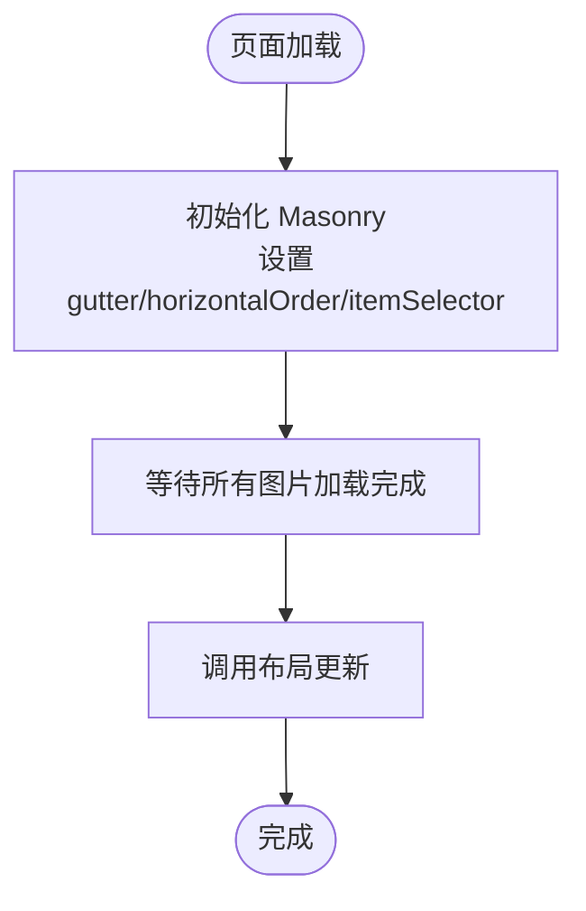
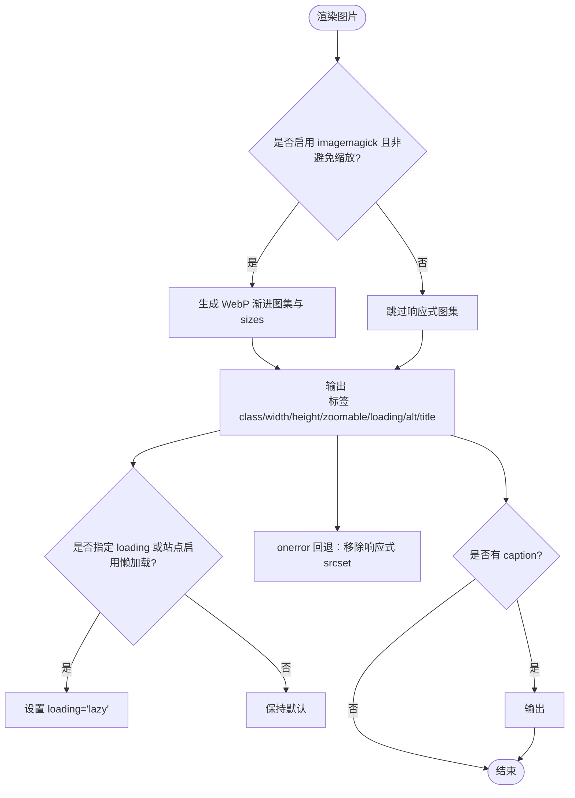
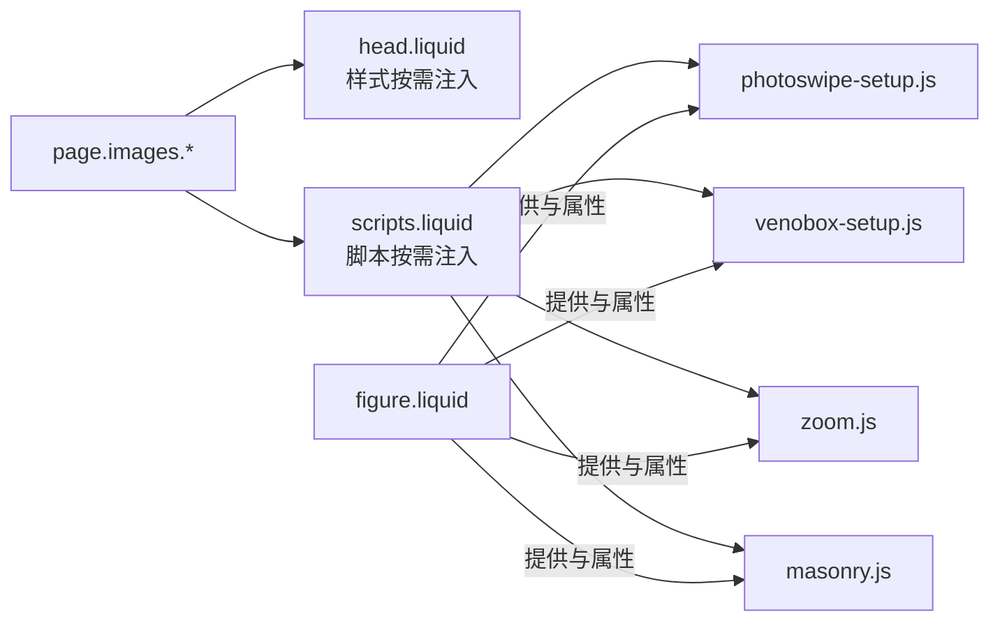

# 图片画廊

<cite>
**本文档引用的文件**
- [_posts/2024-12-04-photo-gallery.md](file://_posts/2024-12-04-photo-gallery.md)
- [_posts/2024-01-27-advanced-images.md](file://_posts/2024-01-27-advanced-images.md)
- [_includes/figure.liquid](file://_includes/figure.liquid)
- [_includes/head.liquid](file://_includes/head.liquid)
- [_includes/scripts.liquid](file://_includes/scripts.liquid)
- [_includes/distill_scripts.liquid](file://_includes/distill_scripts.liquid)
- [_scripts/photoswipe-setup.js](file://_scripts/photoswipe-setup.js)
- [_sass/_base.scss](file://_sass/_base.scss)
- [_config.yml](file://_config.yml)
- [assets/js/masonry.js](file://assets/js/masonry.js)
- [assets/js/zoom.js](file://assets/js/zoom.js)
- [assets/js/venobox-setup.js](file://assets/js/venobox-setup.js)
</cite>

## 目录
1. [简介](#简介)
2. [项目结构](#项目结构)
3. [核心组件](#核心组件)
4. [架构总览](#架构总览)
5. [详细组件分析](#详细组件分析)
6. [依赖关系分析](#依赖关系分析)
7. [性能考虑](#性能考虑)
8. [故障排除指南](#故障排除指南)
9. [结论](#结论)
10. [附录](#附录)

## 简介
本文件面向 al-folio 的图片画廊系统，系统性梳理了多种图片展示与交互方案：Lightbox2 弹窗、PhotoSwipe 轻量画廊、Spotlight JS 展示、Venobox 弹层、以及 Medium Zoom 缩放与 Masonry 响应式网格布局。文档覆盖以下主题：
- Lightbox2 集成：弹窗触发、导航控制与库资源按需加载
- 响应式网格布局：Masonry 排列、图片尺寸自适应与加载后重排
- 画廊配置：边距、间距、圆角、懒加载等可定制项
- 懒加载与性能优化：延迟加载策略与错误回退
- 缩放与拖拽：Medium Zoom 与 PhotoSwipe 的缩放/拖拽体验
- 批量上传与管理：建议与最佳实践
- 样式自定义与动画：CSS 变量与第三方库样式集成
- 使用示例与故障排除：基于仓库示例与脚本的实际操作指引

## 项目结构
与图片画廊相关的核心文件分布如下：
- 示例文章：用于演示不同画廊库的使用方式
- Liquid 模板：统一图片渲染逻辑（含懒加载、尺寸、圆角、缩放属性）
- 头部与脚本模板：按页面需求动态注入第三方库样式与脚本
- JavaScript 初始化：PhotoSwipe、Venobox、Medium Zoom、Masonry 的初始化与事件绑定
- 样式：基础样式与网格布局类

**图表来源**
- [_posts/2024-12-04-photo-gallery.md:1-98](file://_posts/2024-12-04-photo-gallery.md#L1-L98)
- [_includes/head.liquid:125-185](file://_includes/head.liquid#L125-L185)
- [_includes/scripts.liquid:265-310](file://_includes/scripts.liquid#L265-L310)
- [_scripts/photoswipe-setup.js:1-12](file://_scripts/photoswipe-setup.js#L1-L12)
- [_sass/_base.scss:678-690](file://_sass/_base.scss#L678-L690)

**章节来源**
- [_posts/2024-12-04-photo-gallery.md:1-98](file://_posts/2024-12-04-photo-gallery.md#L1-L98)
- [_includes/head.liquid:125-185](file://_includes/head.liquid#L125-L185)
- [_includes/scripts.liquid:265-310](file://_includes/scripts.liquid#L265-L310)
- [_scripts/photoswipe-setup.js:1-12](file://_scripts/photoswipe-setup.js#L1-L12)
- [_sass/_base.scss:678-690](file://_sass/_base.scss#L678-L690)

## 核心组件
- 图片渲染模板（figure.liquid）：统一处理图片路径、WebP 渐进图集、尺寸、圆角、懒加载、缩放属性与错误回退
- 头部与脚本模板：根据页面 front matter 中的 images 字段，按需引入第三方库的样式与脚本
- PhotoSwipe 初始化：通过模块化导入与轻量画廊实例初始化
- Venobox/Medium Zoom/Masonry：在页面加载完成后初始化对应交互与布局

**章节来源**
- [_includes/figure.liquid:1-87](file://_includes/figure.liquid#L1-L87)
- [_includes/head.liquid:125-185](file://_includes/head.liquid#L125-L185)
- [_includes/scripts.liquid:265-310](file://_includes/scripts.liquid#L265-L310)
- [_scripts/photoswipe-setup.js:1-12](file://_scripts/photoswipe-setup.js#L1-L12)
- [assets/js/zoom.js:1-7](file://assets/js/zoom.js#L1-L7)
- [assets/js/masonry.js:1-13](file://assets/js/masonry.js#L1-L13)

## 架构总览
下图展示了页面如何根据 front matter 的 images 字段决定加载哪些第三方库，并在页面就绪后初始化对应的交互行为。

**图表来源**
- [_posts/2024-12-04-photo-gallery.md:1-14](file://_posts/2024-12-04-photo-gallery.md#L1-L14)
- [_includes/head.liquid:125-185](file://_includes/head.liquid#L125-L185)
- [_includes/scripts.liquid:265-310](file://_includes/scripts.liquid#L265-L310)
- [_scripts/photoswipe-setup.js:1-12](file://_scripts/photoswipe-setup.js#L1-L12)
- [assets/js/zoom.js:1-7](file://assets/js/zoom.js#L1-L7)
- [assets/js/masonry.js:1-13](file://assets/js/masonry.js#L1-L13)

## 详细组件分析

### Lightbox2 集成
- 触发方式：在页面中使用带 data-lightbox 属性的链接包裹缩略图，即可启用 Lightbox2 弹窗
- 库资源：通过 head.liquid 按需加载 Lightbox2 的样式
- 导航控制：同一组 data-lightbox 的多个链接构成一个画廊，支持键盘与箭头导航
- 使用要点：确保每个画廊分组使用相同的 data-lightbox 值；大图与缩略图可指向不同尺寸资源

**图表来源**
- [_posts/2024-12-04-photo-gallery.md:18-23](file://_posts/2024-12-04-photo-gallery.md#L18-L23)
- [_includes/head.liquid:136-145](file://_includes/head.liquid#L136-L145)
- [_includes/scripts.liquid:275-282](file://_includes/scripts.liquid#L275-L282)

**章节来源**
- [_posts/2024-12-04-photo-gallery.md:18-23](file://_posts/2024-12-04-photo-gallery.md#L18-L23)
- [_includes/head.liquid:136-145](file://_includes/head.liquid#L136-L145)
- [_includes/scripts.liquid:275-282](file://_includes/scripts.liquid#L275-L282)

### PhotoSwipe 轻量画廊
- 触发方式：在页面中使用带 data-pswp-* 属性的链接包裹缩略图，或使用 pswp-gallery 容器组织多图
- 初始化：通过 photoswipe-setup.js 动态导入 PhotoSwipe 与 PhotoSwipeLightbox 并初始化
- 特性：支持点击放大、拖拽、缩放、全屏、自定义宽高与裁剪标记
- 使用要点：为每张图提供 data-pswp-width/data-pswp-height；如需自定义 href 中的源，可使用 data-pswp-src

**图表来源**
- [_posts/2024-12-04-photo-gallery.md:26-60](file://_posts/2024-12-04-photo-gallery.md#L26-L60)
- [_includes/scripts.liquid:283-285](file://_includes/scripts.liquid#L283-L285)
- [_scripts/photoswipe-setup.js:1-12](file://_scripts/photoswipe-setup.js#L1-L12)

**章节来源**
- [_posts/2024-12-04-photo-gallery.md:26-60](file://_posts/2024-12-04-photo-gallery.md#L26-L60)
- [_scripts/photoswipe-setup.js:1-12](file://_scripts/photoswipe-setup.js#L1-L12)

### Spotlight JS 展示
- 触发方式：使用带 spotlight 类的链接包裹图片，可将多个组放入 spotlight-group 中
- 特性：提供简洁的图片展示与切换效果
- 使用要点：为每个组添加独立的容器类，便于分组管理

**章节来源**
- [_posts/2024-12-04-photo-gallery.md:64-89](file://_posts/2024-12-04-photo-gallery.md#L64-L89)

### Venobox 弹层
- 触发方式：使用带 venobox 类与 data-gall 分组属性的链接包裹图片
- 初始化：通过 venobox-setup.js 在页面就绪时初始化 VenoBox
- 特性：支持弹层显示、分组导航、键盘控制
- 使用要点：同组使用相同 data-gall 值；注意脚本加载顺序

**图表来源**
- [_posts/2024-12-04-photo-gallery.md:93-98](file://_posts/2024-12-04-photo-gallery.md#L93-L98)
- [_includes/scripts.liquid:301-309](file://_includes/scripts.liquid#L301-L309)
- [assets/js/venobox-setup.js:1-6](file://assets/js/venobox-setup.js#L1-L6)

**章节来源**
- [_posts/2024-12-04-photo-gallery.md:93-98](file://_posts/2024-12-04-photo-gallery.md#L93-L98)
- [assets/js/venobox-setup.js:1-6](file://assets/js/venobox-setup.js#L1-L6)

### Medium Zoom 缩放
- 触发方式：在图片上添加 data-zoomable 属性，启用点击放大
- 初始化：通过 zoom.js 在文档就绪时初始化 mediumZoom，并读取 CSS 变量作为背景色
- 特性：点击图片放大，支持背景遮罩与透明度控制
- 使用要点：配合 figure.liquid 的 zoomable 参数或直接在图片标签上添加 data-zoomable

**图表来源**
- [_includes/figure.liquid:71-73](file://_includes/figure.liquid#L71-L73)
- [assets/js/zoom.js:1-7](file://assets/js/zoom.js#L1-L7)

**章节来源**
- [assets/js/zoom.js:1-7](file://assets/js/zoom.js#L1-L7)
- [_includes/figure.liquid:71-73](file://_includes/figure.liquid#L71-L73)

### 响应式网格布局（Masonry）
- 触发方式：在页面中使用 grid/grid-item 容器与条目，配合 Masonry 初始化
- 初始化：通过 masonry.js 在文档就绪时初始化网格布局，并在图片加载完成后重新布局
- 特性：自动计算列数与间距，图片加载完成后平滑重排
- 使用要点：设置合适的 gutter 与水平排序，确保图片加载完成后触发重排

**图表来源**
- [assets/js/masonry.js:1-13](file://assets/js/masonry.js#L1-L13)
- [_sass/_base.scss:678-690](file://_sass/_base.scss#L678-L690)

**章节来源**
- [assets/js/masonry.js:1-13](file://assets/js/masonry.js#L1-L13)
- [_sass/_base.scss:678-690](file://_sass/_base.scss#L678-L690)

### 图片渲染与懒加载（figure.liquid）
- 统一渲染：通过 figure.liquid 输出 <figure><picture> 结构，支持 WebP 渐进图集与 sizes 自适应
- 懒加载：若未显式指定 loading，则读取站点配置 lazy_loading_images 并默认启用
- 尺寸与圆角：支持 width/height/min/max 与 class 圆角样式
- 缩放属性：支持 zoomable 参数以添加 data-zoomable
- 错误回退：当图片加载失败时移除响应式 srcset，避免后续异常

**图表来源**
- [_includes/figure.liquid:1-87](file://_includes/figure.liquid#L1-L87)

**章节来源**
- [_includes/figure.liquid:1-87](file://_includes/figure.liquid#L1-L87)

### 配置选项与样式定制
- front matter 配置：在文章 front matter 的 images 字段中开启所需库（如 lightbox2、photoswipe、spotlight、venobox、slider、compare）
- 样式变量：通过 CSS 变量控制主题色、背景色等，Medium Zoom 会读取 --global-bg-color 以设置背景透明度
- 网格样式：_base.scss 提供 .grid-sizer 与 .grid-item 的基础网格类，用于 Masonry 布局

**章节来源**
- [_posts/2024-12-04-photo-gallery.md:9-14](file://_posts/2024-12-04-photo-gallery.md#L9-L14)
- [assets/js/zoom.js:3-5](file://assets/js/zoom.js#L3-L5)
- [_sass/_base.scss:678-690](file://_sass/_base.scss#L678-L690)

## 依赖关系分析
- 按需加载：head.liquid 与 scripts.liquid 根据 page.images.* 条件性注入第三方库的样式与脚本，避免不必要的资源加载
- 初始化顺序：PhotoSwipe 通过模块化脚本初始化；Venobox 与 Medium Zoom 通过独立初始化脚本；Masonry 在图片加载完成后布局
- 图片模板：figure.liquid 为所有画廊提供一致的图片输出，支持懒加载与缩放属性

**图表来源**
- [_includes/head.liquid:125-185](file://_includes/head.liquid#L125-L185)
- [_includes/scripts.liquid:265-310](file://_includes/scripts.liquid#L265-L310)
- [_scripts/photoswipe-setup.js:1-12](file://_scripts/photoswipe-setup.js#L1-L12)
- [assets/js/venobox-setup.js:1-6](file://assets/js/venobox-setup.js#L1-L6)
- [assets/js/zoom.js:1-7](file://assets/js/zoom.js#L1-L7)
- [assets/js/masonry.js:1-13](file://assets/js/masonry.js#L1-L13)
- [_includes/figure.liquid:1-87](file://_includes/figure.liquid#L1-L87)

**章节来源**
- [_includes/head.liquid:125-185](file://_includes/head.liquid#L125-L185)
- [_includes/scripts.liquid:265-310](file://_includes/scripts.liquid#L265-L310)

## 性能考虑
- 懒加载：通过 figure.liquid 默认启用 lazy，减少首屏资源压力
- 响应式图片：在启用 imagemagick 时生成 WebP 渐进图集与 sizes，适配不同 DPR 与视口宽度
- 图片加载完成后再布局：Masonry 在 imagesLoaded 后调用 layout，避免布局抖动
- 按需加载第三方库：仅在页面声明需要时才加载对应样式与脚本，降低全局开销

**章节来源**
- [_includes/figure.liquid:74-78](file://_includes/figure.liquid#L74-L78)
- [assets/js/masonry.js:8-11](file://assets/js/masonry.js#L8-L11)

## 故障排除指南
- 图片未显示或显示异常
  - 检查图片路径与相对路径是否正确
  - 若启用响应式图片，确认站点已启用 imagemagick 且 widths 列表存在
  - 当图片加载失败时，模板会移除响应式 srcset，检查网络与缓存
- 画廊不生效
  - 确认页面 front matter 中已设置对应的 images.* 为 true
  - 确认 head.liquid 与 scripts.liquid 已注入相应样式与脚本
  - PhotoSwipe 需要正确的 data-pswp-* 属性与模块化初始化
- 导航与缩放问题
  - Lightbox2/Spotlight/Venobox：确认分组属性（如 data-lightbox、data-gall）一致
  - Medium Zoom：确认图片带有 data-zoomable；背景色由 CSS 变量控制
- 布局错乱
  - 确保 Masonry 的容器类与条目类命名一致（.grid/.grid-item）
  - 检查 gutter 与水平排序参数是否合理

**章节来源**
- [_includes/figure.liquid:79-80](file://_includes/figure.liquid#L79-L80)
- [_includes/head.liquid:125-185](file://_includes/head.liquid#L125-L185)
- [_includes/scripts.liquid:265-310](file://_includes/scripts.liquid#L265-L310)
- [_scripts/photoswipe-setup.js:6-11](file://_scripts/photoswipe-setup.js#L6-L11)
- [assets/js/masonry.js:3-7](file://assets/js/masonry.js#L3-L7)

## 结论
al-folio 的图片画廊系统通过模板化渲染与按需加载机制，实现了对多种第三方库的良好集成。借助 figure.liquid 的统一输出与懒加载策略，结合 PhotoSwipe、Lightbox2、Spotlight JS、Venobox、Medium Zoom 与 Masonry 的特性，既能满足丰富的交互体验，又能兼顾性能与可维护性。建议在实际使用中：
- 明确页面需求，仅启用必要的库
- 合理配置图片尺寸与响应式图集
- 在图片加载完成后进行布局更新
- 通过 CSS 变量与第三方库样式进行统一风格定制

## 附录
- 实际使用示例参考：
  - [示例文章：图片画廊:1-98](file://_posts/2024-12-04-photo-gallery.md#L1-L98)
  - [示例文章：高级图片组件:1-36](file://_posts/2024-01-27-advanced-images.md#L1-L36)
- 关键脚本与模板：
  - [PhotoSwipe 初始化:1-12](file://_scripts/photoswipe-setup.js#L1-L12)
  - [Venobox 初始化:1-6](file://assets/js/venobox-setup.js#L1-L6)
  - [Medium Zoom 初始化:1-7](file://assets/js/zoom.js#L1-L7)
  - [Masonry 初始化:1-13](file://assets/js/masonry.js#L1-L13)
  - [图片渲染模板:1-87](file://_includes/figure.liquid#L1-L87)
  - [头部样式注入:125-185](file://_includes/head.liquid#L125-L185)
  - [脚本注入:265-310](file://_includes/scripts.liquid#L265-L310)
  - [网格样式:678-690](file://_sass/_base.scss#L678-L690)