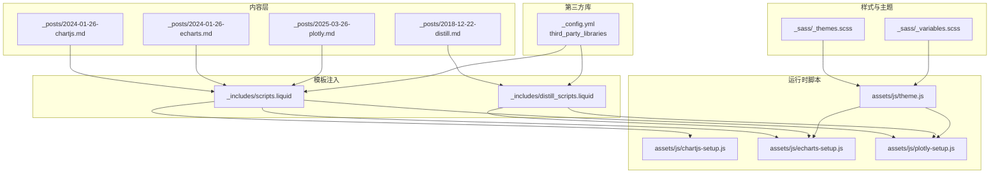
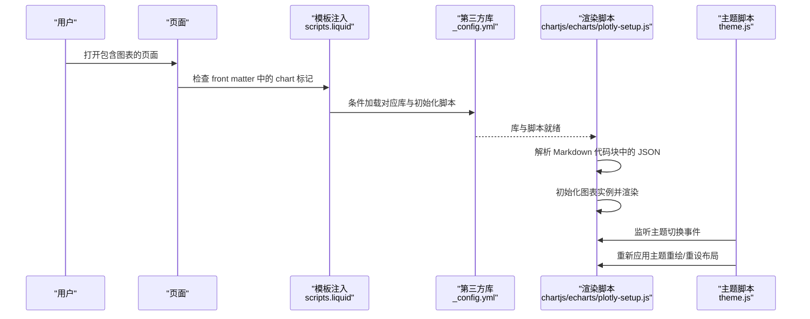
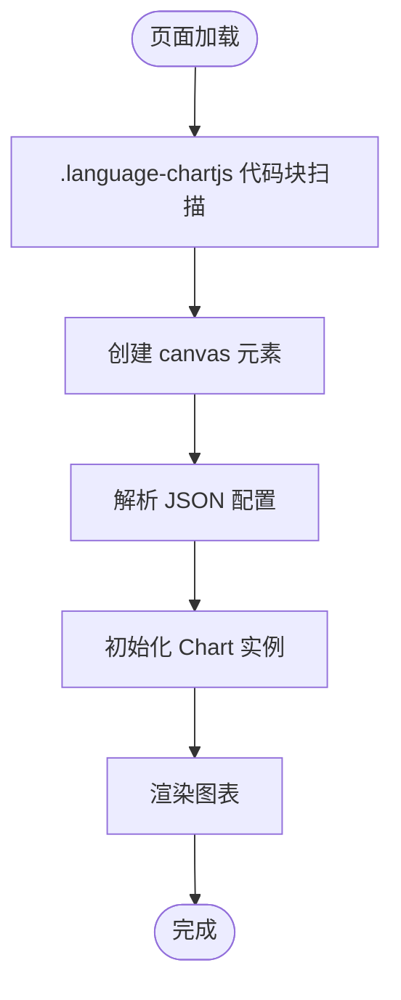
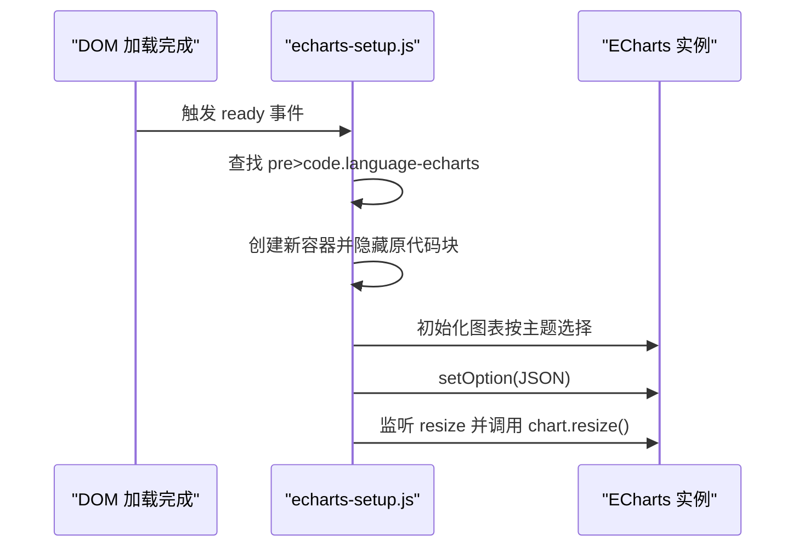
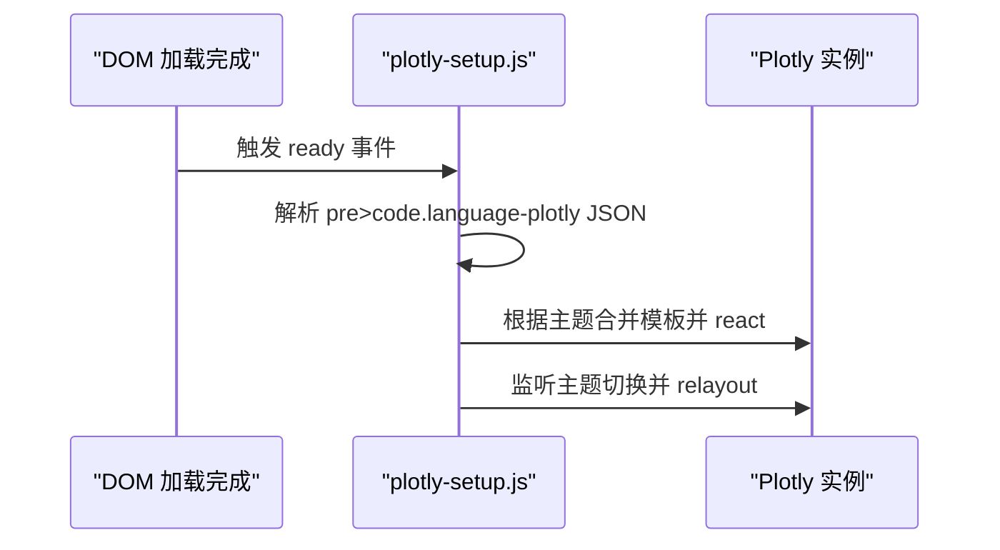
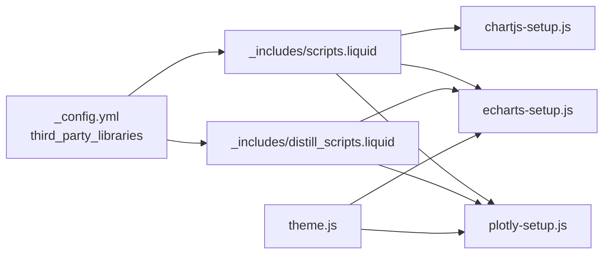

# 图表可视化

<cite>
**本文引用的文件**
- [_posts/2024-01-26-chartjs.md](file://_posts/2024-01-26-chartjs.md)
- [_posts/2024-01-26-echarts.md](file://_posts/2024-01-26-echarts.md)
- [_posts/2025-03-26-plotly.md](file://_posts/2025-03-26-plotly.md)
- [_posts/2018-12-22-distill.md](file://_posts/2018-12-22-distill.md)
- [assets/js/chartjs-setup.js](file://assets/js/chartjs-setup.js)
- [assets/js/echarts-setup.js](file://assets/js/echarts-setup.js)
- [assets/js/plotly-setup.js](file://assets/js/plotly-setup.js)
- [assets/js/theme.js](file://assets/js/theme.js)
- [_includes/scripts.liquid](file://_includes/scripts.liquid)
- [_includes/distill_scripts.liquid](file://_includes/distill_scripts.liquid)
- [_config.yml](file://_config.yml)
- [_sass/_themes.scss](file://_sass/_themes.scss)
- [_sass/_variables.scss](file://_sass/_variables.scss)
</cite>

## 目录
1. [简介](#简介)
2. [项目结构](#项目结构)
3. [核心组件](#核心组件)
4. [架构总览](#架构总览)
5. [详细组件分析](#详细组件分析)
6. [依赖关系分析](#依赖关系分析)
7. [性能考虑](#性能考虑)
8. [故障排查指南](#故障排查指南)
9. [结论](#结论)
10. [附录](#附录)

## 简介
本文件系统性梳理 al-folio 中图表可视化能力，覆盖 Chart.js、ECharts、Plotly 三大图表库的集成方式与配置要点，涵盖数据格式、动态更新、响应式与移动端适配、主题与样式定制、导出与性能优化等主题。文档以“可读性强、循序渐进”为目标，既适合初学者快速上手，也为进阶用户提供了深入的技术细节与最佳实践。

## 项目结构
al-folio 通过 Markdown 文档中的代码块嵌入图表 JSON 配置，并在页面加载时由对应脚本解析并渲染为可视化图表。关键路径如下：
- 示例文档：_posts 下的 chartjs/echarts/plotly 示例文章
- 渲染脚本：assets/js 下的 chartjs-setup.js、echarts-setup.js、plotly-setup.js
- 主题切换：assets/js/theme.js 负责在明暗主题间切换时重绘或应用主题
- 资源注入：_includes/scripts.liquid 与 _includes/distill_scripts.liquid 条件加载第三方库与初始化脚本
- 库版本管理：_config.yml 中 third_party_libraries 定义各库版本、完整性校验与 CDN 地址
- 主题变量：_sass/_themes.scss 与 _sass/_variables.scss 提供 CSS 变量与明暗主题色板

**图示来源**
- [_includes/scripts.liquid:73-110](file://_includes/scripts.liquid#L73-L110)
- [_includes/distill_scripts.liquid:67-93](file://_includes/distill_scripts.liquid#L67-L93)
- [assets/js/chartjs-setup.js:1-15](file://assets/js/chartjs-setup.js#L1-L15)
- [assets/js/echarts-setup.js:1-30](file://assets/js/echarts-setup.js#L1-L30)
- [assets/js/plotly-setup.js:1-53](file://assets/js/plotly-setup.js#L1-L53)
- [assets/js/theme.js:166-180](file://assets/js/theme.js#L166-L180)
- [_config.yml:413-556](file://_config.yml#L413-L556)
- [_sass/_themes.scss:7-162](file://_sass/_themes.scss#L7-L162)
- [_sass/_variables.scss:8-53](file://_sass/_variables.scss#L8-L53)

**章节来源**
- [_includes/scripts.liquid:73-110](file://_includes/scripts.liquid#L73-L110)
- [_includes/distill_scripts.liquid:67-93](file://_includes/distill_scripts.liquid#L67-L93)
- [_config.yml:413-556](file://_config.yml#L413-L556)

## 核心组件
- Chart.js 集成
  - 通过 Markdown 代码块标记语言为 chartjs，页面加载后自动解析 JSON 并在 canvas 上绘制
  - 支持多数据集、线条样式、点样式、悬停与交互等配置
- ECharts 集成
  - 通过 Markdown 代码块标记语言为 echarts，页面加载后解析 JSON 并初始化图表
  - 自动监听窗口 resize 并调用图表 resize；支持明暗主题切换（dark-fresh-cut）
- Plotly 集成
  - 通过 Markdown 代码块标记语言为 plotly，页面加载后解析 JSON 并调用 react 或 relayout 应用主题
  - 主题切换时合并内置模板，确保布局、颜色、字体等一致

**章节来源**
- [assets/js/chartjs-setup.js:1-15](file://assets/js/chartjs-setup.js#L1-L15)
- [assets/js/echarts-setup.js:1-30](file://assets/js/echarts-setup.js#L1-L30)
- [assets/js/plotly-setup.js:1-53](file://assets/js/plotly-setup.js#L1-L53)
- [_posts/2024-01-26-chartjs.md:14-189](file://_posts/2024-01-26-chartjs.md#L14-L189)
- [_posts/2024-01-26-echarts.md:14-69](file://_posts/2024-01-26-echarts.md#L14-L69)
- [_posts/2025-03-26-plotly.md:14-111](file://_posts/2025-03-26-plotly.md#L14-L111)

## 架构总览
图表渲染流程分为“内容注入—资源加载—脚本解析—图表实例化—主题联动”五个阶段，贯穿标准页面与 Distill 页面两种模板。

**图示来源**
- [_includes/scripts.liquid:73-110](file://_includes/scripts.liquid#L73-L110)
- [_includes/distill_scripts.liquid:67-93](file://_includes/distill_scripts.liquid#L67-L93)
- [_config.yml:413-556](file://_config.yml#L413-L556)
- [assets/js/chartjs-setup.js:1-15](file://assets/js/chartjs-setup.js#L1-L15)
- [assets/js/echarts-setup.js:1-30](file://assets/js/echarts-setup.js#L1-L30)
- [assets/js/plotly-setup.js:1-53](file://assets/js/plotly-setup.js#L1-L53)
- [assets/js/theme.js:166-180](file://assets/js/theme.js#L166-L180)

## 详细组件分析

### Chart.js 组件
- 数据格式与类型
  - 支持折线图、环形图等多种类型；数据结构包含 labels、datasets 等字段
  - 示例中展示了折线图与环形图的完整配置
- 渲染机制
  - 使用 jQuery 在 DOM 就绪后扫描具有特定类名的代码块，创建 canvas 并传入解析后的配置对象
- 交互与样式
  - 可配置线条张力、填充、点样式、悬停半径、边框样式等
- 响应式与移动端
  - 未见显式响应式配置；如需自适应可在配置中启用响应式或监听窗口尺寸变化

**图示来源**
- [assets/js/chartjs-setup.js:1-15](file://assets/js/chartjs-setup.js#L1-L15)
- [_posts/2024-01-26-chartjs.md:14-189](file://_posts/2024-01-26-chartjs.md#L14-L189)

**章节来源**
- [assets/js/chartjs-setup.js:1-15](file://assets/js/chartjs-setup.js#L1-L15)
- [_posts/2024-01-26-chartjs.md:14-189](file://_posts/2024-01-26-chartjs.md#L14-L189)

### ECharts 组件
- 数据格式与类型
  - 支持标题、提示框、图例、坐标轴、系列等；示例包含柱状图与基础折线图
  - 支持响应式字段，图表会根据容器大小调整
- 渲染机制
  - 页面完全加载后，遍历所有 echarts 代码块，隐藏原代码块并插入新的 div 容器，按当前主题初始化图表实例
  - 监听窗口 resize 事件并调用图表 resize
- 主题与样式
  - 明暗主题分别初始化不同主题；切换主题时销毁旧实例并重新初始化
  - 示例文档展示了丰富的样式定制项（坐标轴线、分割线、区域渐变、强调聚焦等）

**图示来源**
- [assets/js/echarts-setup.js:1-30](file://assets/js/echarts-setup.js#L1-L30)
- [_posts/2024-01-26-echarts.md:14-69](file://_posts/2024-01-26-echarts.md#L14-L69)
- [_posts/2018-12-22-distill.md:851-1057](file://_posts/2018-12-22-distill.md#L851-L1057)

**章节来源**
- [assets/js/echarts-setup.js:1-30](file://assets/js/echarts-setup.js#L1-L30)
- [_posts/2024-01-26-echarts.md:14-69](file://_posts/2024-01-26-echarts.md#L14-L69)
- [_posts/2018-12-22-distill.md:851-1057](file://_posts/2018-12-22-distill.md#L851-L1057)

### Plotly 组件
- 数据格式与类型
  - 支持 data 与 layout；示例包含散点图与多模式组合（markers、lines、lines+markers）
- 渲染机制
  - 页面完全加载后，解析每个 plotly 代码块，隐藏原代码块并插入新容器，按当前主题合并内置模板后调用 react
  - 切换主题时通过 relayout 应用模板覆盖
- 主题与样式
  - 内置深浅主题模板，覆盖布局、颜色、字体、网格等；可叠加用户自定义 layout

**图示来源**
- [assets/js/plotly-setup.js:1-53](file://assets/js/plotly-setup.js#L1-L53)
- [_posts/2025-03-26-plotly.md:14-111](file://_posts/2025-03-26-plotly.md#L14-L111)
- [assets/js/theme.js:182-221](file://assets/js/theme.js#L182-L221)

**章节来源**
- [assets/js/plotly-setup.js:1-53](file://assets/js/plotly-setup.js#L1-L53)
- [_posts/2025-03-26-plotly.md:14-111](file://_posts/2025-03-26-plotly.md#L14-L111)
- [assets/js/theme.js:182-221](file://assets/js/theme.js#L182-L221)

## 依赖关系分析
- 资源注入
  - 标准页面与 Distill 页面分别通过 scripts.liquid 与 distill_scripts.liquid 条件加载第三方库与初始化脚本
- 版本与完整性
  - 第三方库版本、CDN 与完整性校验在 _config.yml 的 third_party_libraries 中集中管理
- 主题联动
  - theme.js 统一管理主题切换逻辑，针对不同图表库执行重绘或模板覆盖

**图示来源**
- [_config.yml:413-556](file://_config.yml#L413-L556)
- [_includes/scripts.liquid:73-110](file://_includes/scripts.liquid#L73-L110)
- [_includes/distill_scripts.liquid:67-93](file://_includes/distill_scripts.liquid#L67-L93)
- [assets/js/theme.js:166-180](file://assets/js/theme.js#L166-L180)

**章节来源**
- [_config.yml:413-556](file://_config.yml#L413-L556)
- [_includes/scripts.liquid:73-110](file://_includes/scripts.liquid#L73-L110)
- [_includes/distill_scripts.liquid:67-93](file://_includes/distill_scripts.liquid#L67-L93)
- [assets/js/theme.js:166-180](file://assets/js/theme.js#L166-L180)

## 性能考虑
- 大数据量处理建议
  - 合理分页或采样：对时间序列或长列表数据进行降采样或分段渲染
  - 按需加载：仅在可见区域或用户交互时渲染高密度数据
  - 选择合适图表类型：折线图在大量点时可考虑聚合或直方图
- 渲染优化
  - Chart.js：避免频繁更新 datasets，尽量批量更新；减少复杂动画
  - ECharts：合理设置 series 的 emphasis 与高亮策略；必要时关闭动画
  - Plotly：合并多次 relayout 为一次；避免重复 react
- 主题切换
  - 使用 theme.js 的统一入口，避免重复初始化实例；ECharts 使用 dispose 后重建，Plotly 使用 relayout 合并模板

[本节为通用指导，无需具体文件引用]

## 故障排查指南
- 图表不显示
  - 检查 Markdown 代码块是否正确标记语言（chartjs/echarts/plotly），并确认 front matter 中存在对应的 chart 标记
  - 确认 scripts.liquid 与 distill_scripts.liquid 已注入相应库与初始化脚本
- 主题切换后图表样式异常
  - 确认 theme.js 是否正确识别当前主题并调用 setEchartsTheme 或 setPlotlyTheme
  - 对于 ECharts，检查是否在切换主题时销毁并重建实例
- 响应式问题
  - ECharts 已内置 resize 监听；若容器尺寸变化不触发，请检查容器 CSS 与父级布局
- 导出问题
  - Chart.js：可通过库提供的导出接口生成 PNG/SVG；注意跨域与透明背景处理
  - ECharts：可使用库导出接口或截图方案；Plotly：使用库导出接口或截图方案

**章节来源**
- [_includes/scripts.liquid:73-110](file://_includes/scripts.liquid#L73-L110)
- [_includes/distill_scripts.liquid:67-93](file://_includes/distill_scripts.liquid#L67-L93)
- [assets/js/echarts-setup.js:24-26](file://assets/js/echarts-setup.js#L24-L26)
- [assets/js/theme.js:166-180](file://assets/js/theme.js#L166-L180)

## 结论
al-folio 的图表可视化体系以“内容即配置”的方式，将图表 JSON 直接嵌入 Markdown，结合模板注入与运行时脚本实现自动化渲染。通过统一的主题脚本，实现了明暗主题下的图表一致性体验。对于进阶场景，建议在保持现有结构的基础上，进一步完善导出机制、响应式适配与大数据量渲染策略，以获得更佳的用户体验。

[本节为总结，无需具体文件引用]

## 附录

### 不同类型图表的创建方法与数据格式要点
- 折线图（Chart.js）
  - 关键字段：type、data.labels、data.datasets[].data、options
  - 示例参考：[折线图示例:14-116](file://_posts/2024-01-26-chartjs.md#L14-L116)
- 环形/饼图（Chart.js）
  - 关键字段：type、data.labels、data.datasets[].data、backgroundColor
  - 示例参考：[环形图示例:157-188](file://_posts/2024-01-26-chartjs.md#L157-L188)
- 柱状图（ECharts）
  - 关键字段：title、tooltip、legend、xAxis、yAxis、series[]
  - 示例参考：[ECharts 柱状图示例:14-69](file://_posts/2024-01-26-echarts.md#L14-L69)
- 散点图/多模式（Plotly）
  - 关键字段：data[].x、data[].y、data[].mode、layout.title
  - 示例参考：[Plotly 散点与组合示例:14-111](file://_posts/2025-03-26-plotly.md#L14-L111)

**章节来源**
- [_posts/2024-01-26-chartjs.md:14-189](file://_posts/2024-01-26-chartjs.md#L14-L189)
- [_posts/2024-01-26-echarts.md:14-69](file://_posts/2024-01-26-echarts.md#L14-L69)
- [_posts/2025-03-26-plotly.md:14-111](file://_posts/2025-03-26-plotly.md#L14-L111)

### 响应式设计与移动端适配
- ECharts 已内置 resize 监听，适合大多数移动端场景
- 若容器尺寸变化不生效，检查父容器的宽度与高度设置
- Chart.js 与 Plotly 未在现有脚本中显式启用响应式，如需可在各自配置中开启

**章节来源**
- [assets/js/echarts-setup.js:24-26](file://assets/js/echarts-setup.js#L24-L26)

### 样式定制与主题
- 主题变量
  - CSS 变量集中于 _sass/_themes.scss，明暗主题下全局文本、背景、卡片等颜色均会变化
- 图表主题
  - ECharts：按主题初始化实例（暗主题使用 dark-fresh-cut）
  - Plotly：内置深浅模板，切换主题时合并模板覆盖
- 字体与颜色
  - 可在各自配置中设置字体、颜色、网格样式等；示例文档展示了丰富的样式定制项

**章节来源**
- [_sass/_themes.scss:7-162](file://_sass/_themes.scss#L7-L162)
- [_sass/_variables.scss:8-53](file://_sass/_variables.scss#L8-L53)
- [assets/js/echarts-setup.js:17-21](file://assets/js/echarts-setup.js#L17-L21)
- [assets/js/plotly-setup.js:17-47](file://assets/js/plotly-setup.js#L17-L47)
- [assets/js/theme.js:166-180](file://assets/js/theme.js#L166-L180)

### 导出配置（PNG/SVG）
- Chart.js：可使用库导出接口生成 PNG/SVG；注意处理透明背景与跨域
- ECharts：可使用库导出接口或截图方案
- Plotly：可使用库导出接口或截图方案
- 注意：导出前请确保图表已完全渲染且容器尺寸固定

[本节为通用指导，无需具体文件引用]