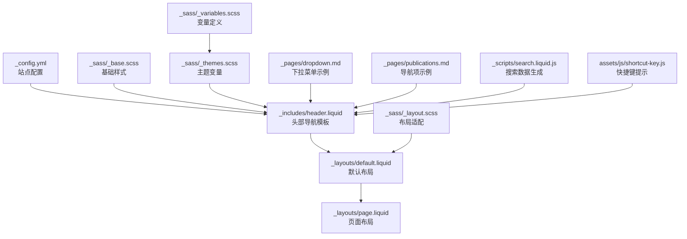
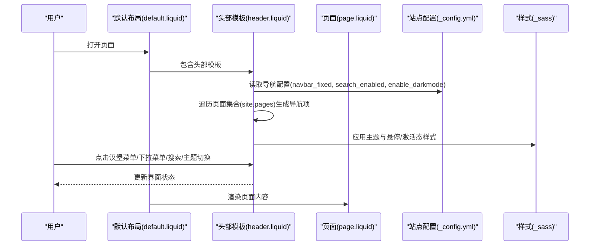
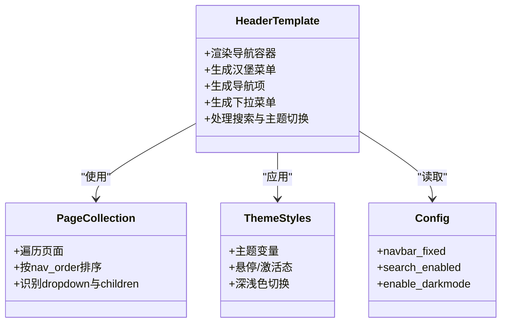
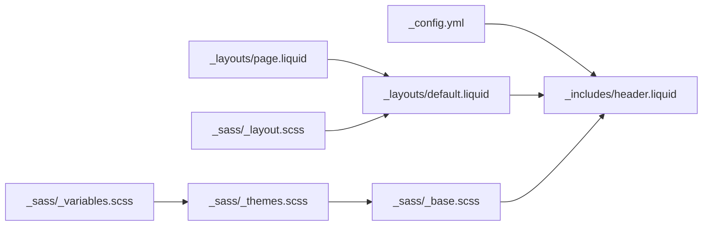

# 导航系统

<cite>
**本文引用的文件**
- [_includes/header.liquid](file://_includes/header.liquid)
- [_layouts/default.liquid](file://_layouts/default.liquid)
- [_layouts/page.liquid](file://_layouts/page.liquid)
- [_config.yml](file://_config.yml)
- [_sass/_base.scss](file://_sass/_base.scss)
- [_sass/_themes.scss](file://_sass/_themes.scss)
- [_sass/_variables.scss](file://_sass/_variables.scss)
- [_sass/_layout.scss](file://_sass/_layout.scss)
- [_pages/dropdown.md](file://_pages/dropdown.md)
- [_pages/about.md](file://_pages/about.md)
- [_pages/publications.md](file://_pages/publications.md)
- [_scripts/search.liquid.js](file://_scripts/search.liquid.js)
- [assets/js/shortcut-key.js](file://assets/js/shortcut-key.js)
</cite>

## 目录
1. [简介](#简介)
2. [项目结构](#项目结构)
3. [核心组件](#核心组件)
4. [架构总览](#架构总览)
5. [详细组件分析](#详细组件分析)
6. [依赖关系分析](#依赖关系分析)
7. [性能考量](#性能考量)
8. [故障排查指南](#故障排查指南)
9. [结论](#结论)
10. [附录](#附录)

## 简介
本章节面向使用 al-folio 主题的用户，系统性讲解站点头部导航栏的实现与定制方法，涵盖：
- 菜单项配置与排序
- 下拉菜单的生成逻辑与激活态管理
- 面包屑导航（通过页面布局与内容组织间接实现）
- 响应式导航与移动端汉堡菜单
- 导航链接类型：内部页面、外部链接、锚点链接
- 导航状态管理与“当前页面”高亮机制
- 样式定制：颜色主题、字体大小、间距等
- 实际配置示例与自定义案例

## 项目结构
导航系统主要由以下部分组成：
- 模板层：头部导航模板、默认布局与页面布局
- 配置层：站点配置文件中的导航相关开关与行为
- 样式层：基础样式、主题变量与布局适配
- 示例页面：演示下拉菜单与导航项配置
- 搜索脚本：与导航搜索快捷键联动

图表来源
- [_includes/header.liquid:1-151](file://_includes/header.liquid#L1-L151)
- [_layouts/default.liquid:1-57](file://_layouts/default.liquid#L1-L57)
- [_layouts/page.liquid:1-32](file://_layouts/page.liquid#L1-L32)
- [_config.yml:51-56](file://_config.yml#L51-L56)
- [_sass/_base.scss:265-430](file://_sass/_base.scss#L265-L430)
- [_sass/_themes.scss:1-162](file://_sass/_themes.scss#L1-L162)
- [_sass/_variables.scss:1-53](file://_sass/_variables.scss#L1-L53)
- [_sass/_layout.scss:1-54](file://_sass/_layout.scss#L1-L54)
- [_pages/dropdown.md:1-14](file://_pages/dropdown.md#L1-L14)
- [_pages/publications.md:1-21](file://_pages/publications.md#L1-L21)
- [_scripts/search.liquid.js:1-38](file://_scripts/search.liquid.js#L1-L38)
- [assets/js/shortcut-key.js:1-11](file://assets/js/shortcut-key.js#L1-L11)

章节来源
- [_includes/header.liquid:1-151](file://_includes/header.liquid#L1-L151)
- [_layouts/default.liquid:1-57](file://_layouts/default.liquid#L1-L57)
- [_layouts/page.liquid:1-32](file://_layouts/page.liquid#L1-L32)
- [_config.yml:51-56](file://_config.yml#L51-L56)
- [_sass/_base.scss:265-430](file://_sass/_base.scss#L265-L430)
- [_sass/_themes.scss:1-162](file://_sass/_themes.scss#L1-L162)
- [_sass/_variables.scss:1-53](file://_sass/_variables.scss#L1-L53)
- [_sass/_layout.scss:1-54](file://_sass/_layout.scss#L1-L54)
- [_pages/dropdown.md:1-14](file://_pages/dropdown.md#L1-L14)
- [_pages/publications.md:1-21](file://_pages/publications.md#L1-L21)
- [_scripts/search.liquid.js:1-38](file://_scripts/search.liquid.js#L1-L38)
- [assets/js/shortcut-key.js:1-11](file://assets/js/shortcut-key.js#L1-L11)

## 核心组件
- 头部导航模板：负责渲染导航栏、汉堡菜单、下拉菜单、搜索入口与主题切换按钮
- 默认布局与页面布局：控制页面容器、侧边栏与内容区域
- 站点配置：控制导航固定、搜索启用、社交图标显示、深色模式等
- 样式系统：基于 SCSS 变量的主题切换、悬停与激活态样式
- 示例页面：演示导航项与下拉菜单的 YAML 配置

章节来源
- [_includes/header.liquid:1-151](file://_includes/header.liquid#L1-L151)
- [_layouts/default.liquid:1-57](file://_layouts/default.liquid#L1-L57)
- [_layouts/page.liquid:1-32](file://_layouts/page.liquid#L1-L32)
- [_config.yml:51-56](file://_config.yml#L51-L56)
- [_sass/_base.scss:265-430](file://_sass/_base.scss#L265-L430)
- [_sass/_themes.scss:1-162](file://_sass/_themes.scss#L1-L162)
- [_sass/_variables.scss:1-53](file://_sass/_variables.scss#L1-L53)
- [_sass/_layout.scss:1-54](file://_sass/_layout.scss#L1-L54)
- [_pages/dropdown.md:1-14](file://_pages/dropdown.md#L1-L14)
- [_pages/publications.md:1-21](file://_pages/publications.md#L1-L21)

## 架构总览
导航系统的运行流程如下：
- 页面加载时，Jekyll 渲染默认布局与头部模板
- 头部模板读取站点配置与页面集合，动态生成导航项与下拉菜单
- 用户交互触发汉堡菜单展开、下拉菜单显示、搜索弹窗或主题切换
- 样式系统根据主题变量与悬停/激活态更新视觉效果

图表来源
- [_layouts/default.liquid:1-57](file://_layouts/default.liquid#L1-L57)
- [_includes/header.liquid:1-151](file://_includes/header.liquid#L1-L151)
- [_config.yml:51-56](file://_config.yml#L51-L56)
- [_sass/_base.scss:265-430](file://_sass/_base.scss#L265-L430)
- [_sass/_themes.scss:1-162](file://_sass/_themes.scss#L1-L162)

## 详细组件分析

### 头部导航栏实现原理
- 导航容器与固定策略
  - 使用 Bootstrap 导航类，支持固定顶部或粘性顶部
  - 固定策略由站点配置控制
- 品牌区与社交图标
  - 非首页时显示站点标题或姓名
  - 首页可显示社交图标（受配置开关控制）
- 汉堡菜单
  - 使用 Bootstrap 折叠组件，通过 data-target 控制展开/收起
  - 自定义汉堡线条动画（旋转与透明度变化）
- 导航项生成
  - 遍历页面集合，按 nav_order 排序
  - 支持自动识别首页标题用于“关于”链接
- 下拉菜单
  - 通过 dropdown 与 children 字段生成
  - 子项中可插入分隔符
  - 激活态：父级或子级当前页面时，父级标记为 active
- 搜索与主题切换
  - 搜索入口：在启用时显示，点击打开搜索模态
  - 主题切换：根据深浅色主题状态显示不同图标

章节来源
- [_includes/header.liquid:1-151](file://_includes/header.liquid#L1-L151)
- [_config.yml:51-56](file://_config.yml#L51-L56)
- [_sass/_base.scss:346-396](file://_sass/_base.scss#L346-L396)

#### 类图：导航元素与状态

图表来源
- [_includes/header.liquid:1-151](file://_includes/header.liquid#L1-L151)
- [_sass/_themes.scss:1-162](file://_sass/_themes.scss#L1-L162)
- [_sass/_base.scss:265-430](file://_sass/_base.scss#L265-L430)
- [_config.yml:51-56](file://_config.yml#L51-L56)

### 菜单项配置与排序
- 启用导航项
  - 在页面 YAML 中设置 nav: true
  - 通过 nav_order 控制排序
- 特殊页面
  - 首页使用 permalink: / 并在首页显示品牌名
- 内容页示例
  - 发表记录页通过 nav: true 与 nav_order: 2 显示在导航中

章节来源
- [_pages/publications.md:1-21](file://_pages/publications.md#L1-L21)
- [_includes/header.liquid:45-60](file://_includes/header.liquid#L45-L60)

### 下拉菜单
- 结构
  - 父级设置 dropdown: true
  - children 定义子项列表
  - 子项中可用 divider 插入分隔符
- 激活态
  - 当任一子项为当前页面时，父级标记 active
- 链接生成
  - 子项支持外部链接（包含 ://），否则使用相对路径

章节来源
- [_pages/dropdown.md:1-14](file://_pages/dropdown.md#L1-L14)
- [_includes/header.liquid:63-99](file://_includes/header.liquid#L63-L99)

### 面包屑导航
- 本主题未直接提供面包屑组件
- 可通过页面布局与内容组织实现“位置指示”
  - 在页面标题下方添加简短描述或路径提示
  - 使用默认布局的容器与网格系统进行排版

章节来源
- [_layouts/page.liquid:1-32](file://_layouts/page.liquid#L1-L32)
- [_layouts/default.liquid:24-48](file://_layouts/default.liquid#L24-L48)

### 响应式导航与汉堡菜单
- 断点与展开
  - 使用 Bootstrap 导航扩展类，在小屏设备上折叠为汉堡菜单
  - 汉堡菜单采用自定义动画，旋转与透明度变化提升交互体验
- 固定与粘性
  - 通过配置控制导航是否固定顶部或粘性定位
  - 固定导航会为页面主体增加顶部内边距以避免遮挡

章节来源
- [_includes/header.liquid:3-41](file://_includes/header.liquid#L3-L41)
- [_sass/_base.scss:346-396](file://_sass/_base.scss#L346-L396)
- [_sass/_layout.scss:20-23](file://_sass/_layout.scss#L20-L23)
- [_config.yml:51-56](file://_config.yml#L51-L56)

### 导航链接类型
- 内部页面链接
  - 使用页面的 permalink 或 url，自动转换为相对路径
- 外部链接
  - 以 :// 判断，直接使用完整 URL
- 锚点链接
  - 通过页面内标题生成锚点，配合滚动优化
- 博客分类链接
  - 对特定路径（如 /blog/）特殊处理，统一指向博客目录

章节来源
- [_includes/header.liquid:105-109](file://_includes/header.liquid#L105-L109)
- [_includes/header.liquid:120-127](file://_includes/header.liquid#L120-L127)

### 导航状态管理与活动页面高亮
- 高亮规则
  - 首页：当前页为根路径时标记 active
  - 普通页面：当前页面 URL 包含目标链接的父路径时标记 active
  - 下拉菜单：父级或其子级为当前页面时，父级标记 active
- 屏幕阅读器友好
  - 当前页面项包含辅助文本，便于无障碍访问

章节来源
- [_includes/header.liquid:50-57](file://_includes/header.liquid#L50-L57)
- [_includes/header.liquid:102-116](file://_includes/header.liquid#L102-L116)
- [_includes/header.liquid:70-84](file://_includes/header.liquid#L70-L84)

### 样式定制
- 主题变量
  - 通过 SCSS 变量与 CSS 自定义属性统一管理颜色与间距
  - 支持深浅色主题切换，自动更新导航文字、背景与悬停颜色
- 悬停与激活态
  - 导航链接悬停时改变颜色；当前页面使用主题色强调
- 汉堡菜单动画
  - 通过伪类与变换实现旋转与透明度过渡
- 字体与间距
  - 导航文字颜色与悬停颜色遵循主题变量
  - 社交图标尺寸与间距可在样式中微调

章节来源
- [_sass/_themes.scss:1-162](file://_sass/_themes.scss#L1-L162)
- [_sass/_variables.scss:1-53](file://_sass/_variables.scss#L1-L53)
- [_sass/_base.scss:265-430](file://_sass/_base.scss#L265-L430)

### 实际配置示例与自定义案例
- 添加一个新导航项
  - 在页面 YAML 中设置 nav: true 与 nav_order 数值
  - 设置 permalink 指向目标路径
- 创建下拉菜单
  - 在父级页面 YAML 中设置 dropdown: true 与 children 列表
  - 子项中使用 divider 插入分隔符
- 外部链接
  - 将子项 permalink 设为完整 URL（包含 ://）
- 搜索与快捷键
  - 启用搜索后，导航中出现搜索入口
  - 根据操作系统平台替换搜索快捷键显示（macOS 使用命令符号）

章节来源
- [_pages/publications.md:1-21](file://_pages/publications.md#L1-L21)
- [_pages/dropdown.md:1-14](file://_pages/dropdown.md#L1-L14)
- [_includes/header.liquid:120-127](file://_includes/header.liquid#L120-L127)
- [assets/js/shortcut-key.js:1-11](file://assets/js/shortcut-key.js#L1-L11)

## 依赖关系分析
- 模板依赖
  - default.liquid 依赖 header.liquid 与 footer.liquid
  - page.liquid 继承 default.liquid
- 配置依赖
  - header.liquid 读取 _config.yml 中的导航与功能开关
- 样式依赖
  - _sass/_base.scss 提供导航与汉堡菜单样式
  - _sass/_themes.scss 提供主题变量与深浅色切换
  - _sass/_variables.scss 提供颜色与间距变量
  - _sass/_layout.scss 提供页面主体的内边距与滚动优化

图表来源
- [_config.yml:51-56](file://_config.yml#L51-L56)
- [_layouts/default.liquid:1-57](file://_layouts/default.liquid#L1-L57)
- [_layouts/page.liquid:1-32](file://_layouts/page.liquid#L1-L32)
- [_includes/header.liquid:1-151](file://_includes/header.liquid#L1-L151)
- [_sass/_base.scss:265-430](file://_sass/_base.scss#L265-L430)
- [_sass/_themes.scss:1-162](file://_sass/_themes.scss#L1-L162)
- [_sass/_variables.scss:1-53](file://_sass/_variables.scss#L1-L53)
- [_sass/_layout.scss:1-54](file://_sass/_layout.scss#L1-L54)

章节来源
- [_config.yml:51-56](file://_config.yml#L51-L56)
- [_layouts/default.liquid:1-57](file://_layouts/default.liquid#L1-L57)
- [_layouts/page.liquid:1-32](file://_layouts/page.liquid#L1-L32)
- [_includes/header.liquid:1-151](file://_includes/header.liquid#L1-L151)
- [_sass/_base.scss:265-430](file://_sass/_base.scss#L265-L430)
- [_sass/_themes.scss:1-162](file://_sass/_themes.scss#L1-L162)
- [_sass/_variables.scss:1-53](file://_sass/_variables.scss#L1-L53)
- [_sass/_layout.scss:1-54](file://_sass/_layout.scss#L1-L54)

## 性能考量
- 导航项生成
  - 使用 Liquid 过滤器对页面集合排序，建议合理控制页面数量以避免构建时间增长
- 样式体积
  - 主题变量集中管理，减少重复定义，有利于压缩与缓存
- 交互性能
  - 汉堡菜单动画仅使用 CSS 变换，避免 JS 动画带来的卡顿
- 搜索集成
  - 搜索入口仅在启用时渲染，减少不必要的 DOM 元素

## 故障排查指南
- 导航不显示或顺序异常
  - 检查页面 YAML 是否设置 nav: true 且 nav_order 数值正确
  - 确认页面 permalink 与 url 配置无误
- 下拉菜单不显示
  - 确认父级设置了 dropdown: true 且 children 列表非空
  - 分隔符 divider 不应包含链接，仅作为分隔使用
- 汉堡菜单无法展开
  - 检查 data-target 与容器 id 是否一致
  - 确认 Bootstrap JS 已正确引入
- 深色模式切换无效
  - 检查主题切换按钮与 CSS 变量映射
  - 确认 html[data-theme-*] 属性设置正确
- 搜索快捷键显示错误
  - macOS 平台会自动替换为命令符号，其他平台保持默认

章节来源
- [_includes/header.liquid:120-127](file://_includes/header.liquid#L120-L127)
- [_sass/_themes.scss:126-161](file://_sass/_themes.scss#L126-L161)
- [assets/js/shortcut-key.js:1-11](file://assets/js/shortcut-key.js#L1-L11)

## 结论
al-folio 的导航系统以 Jekyll + Liquid + Bootstrap 为基础，结合 SCSS 主题变量，实现了灵活、可定制且响应式的导航体验。通过合理的 YAML 配置与少量样式定制，即可满足大多数个人网站的导航需求。建议在新增导航项时遵循 nav_order 规范，并充分利用下拉菜单与外部链接能力，以提升信息架构与用户体验。

## 附录
- 快速检查清单
  - 页面是否设置 nav: true 与 nav_order
  - 下拉菜单是否设置 dropdown: true 与 children
  - 外部链接是否使用完整 URL
  - 搜索与主题切换是否按需启用
  - 样式变量是否与主题一致