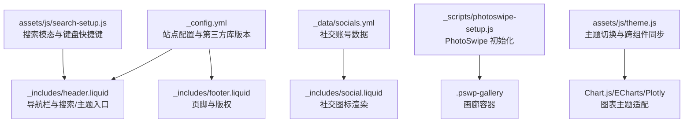
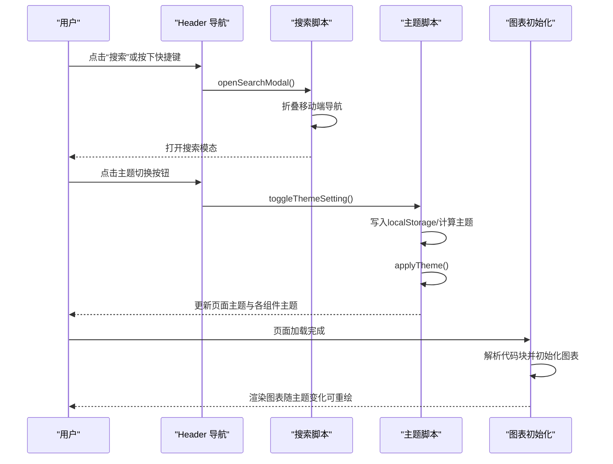
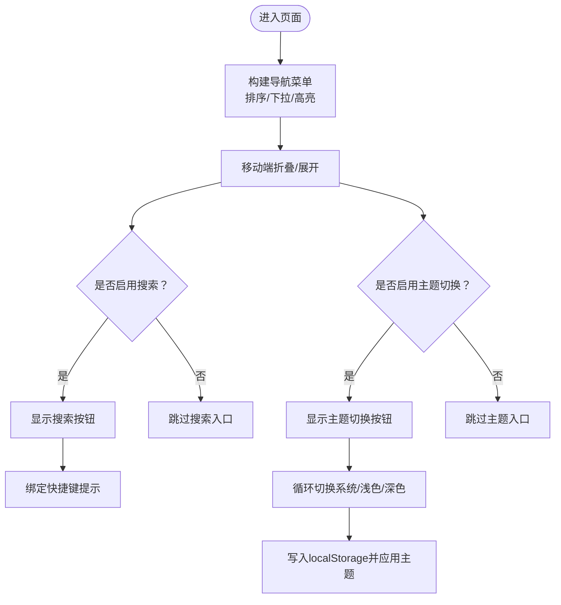
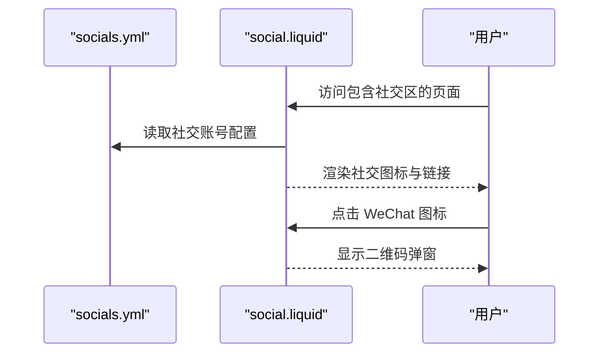
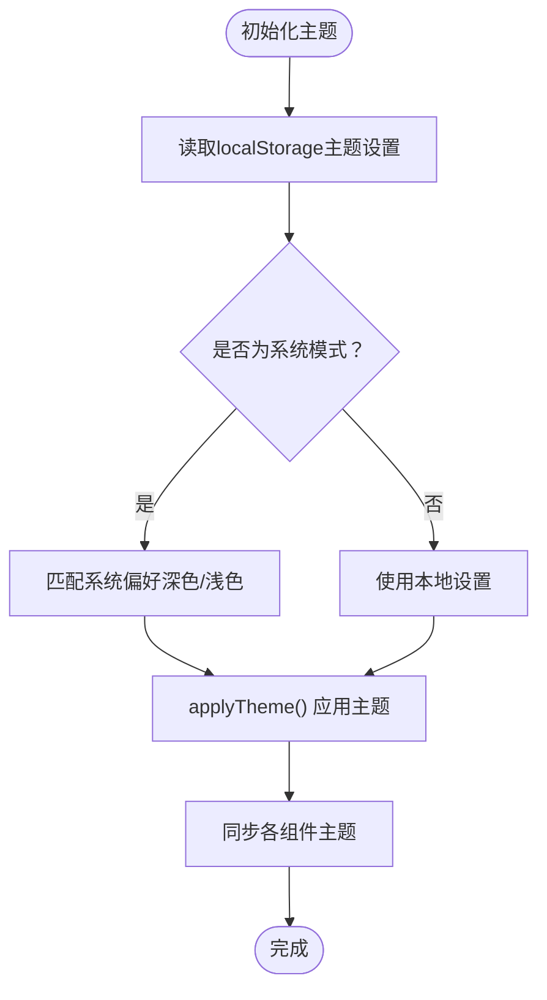
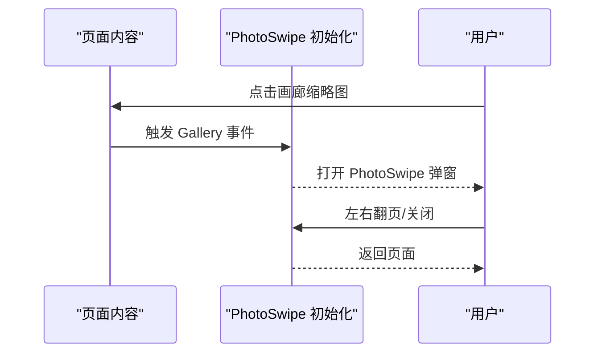
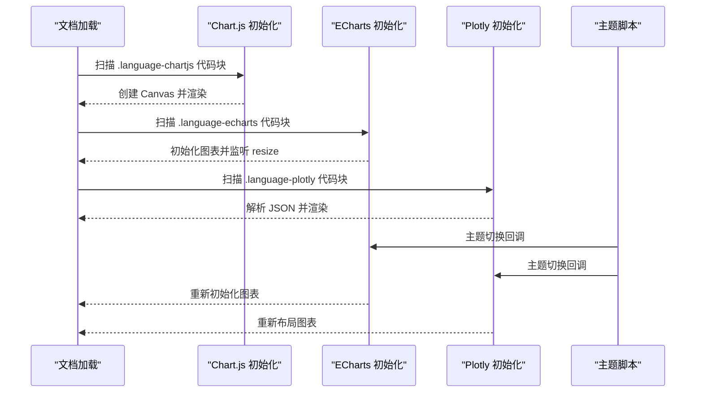
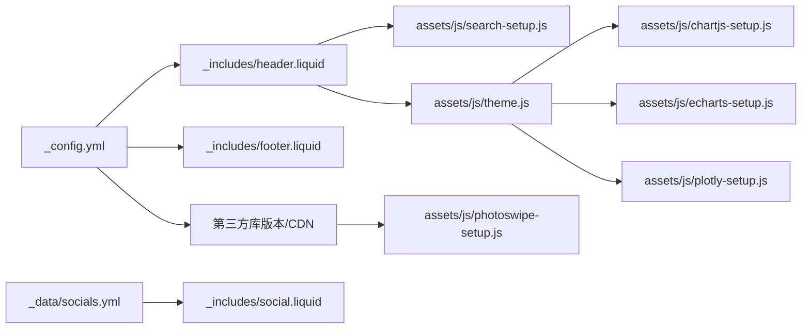

# 用户界面组件

<cite>
**本文引用的文件**
- [_config.yml](file://_config.yml)
- [_includes/header.liquid](file://_includes/header.liquid)
- [_includes/footer.liquid](file://_includes/footer.liquid)
- [_includes/social.liquid](file://_includes/social.liquid)
- [_data/socials.yml](file://_data/socials.yml)
- [_scripts/photoswipe-setup.js](file://_scripts/photoswipe-setup.js)
- [assets/js/theme.js](file://assets/js/theme.js)
- [assets/js/search-setup.js](file://assets/js/search-setup.js)
- [assets/js/chartjs-setup.js](file://assets/js/chartjs-setup.js)
- [assets/js/echarts-setup.js](file://assets/js/echarts-setup.js)
- [assets/js/plotly-setup.js](file://assets/js/plotly-setup.js)
- [_posts/2024-12-04-photo-gallery.md](file://_posts/2024-12-04-photo-gallery.md)
- [_posts/2024-01-26-chartjs.md](file://_posts/2024-01-26-chartjs.md)
</cite>

## 目录
1. [简介](#简介)
2. [项目结构](#项目结构)
3. [核心组件](#核心组件)
4. [架构总览](#架构总览)
5. [详细组件分析](#详细组件分析)
6. [依赖关系分析](#依赖关系分析)
7. [性能考量](#性能考量)
8. [故障排查指南](#故障排查指南)
9. [结论](#结论)
10. [附录](#附录)

## 简介
本文件面向 al-folio 的用户界面组件，系统性梳理并说明以下方面：
- 头部导航：菜单配置、响应式行为、快捷键搜索入口与主题切换入口
- 社交媒体集成：图标来源、分享链接、WeChat 二维码弹窗
- 页脚与版权：固定/粘性底部、版权文案、更新时间、隐私链接
- 主题切换：浅色/深色/系统三态切换、自动检测系统偏好、跨组件主题同步
- 图片画廊：Lightbox2、PhotoSwipe、Spotlight、Venobox 的集成方式与用法
- 图表可视化：Chart.js、ECharts、Plotly 的初始化与主题适配
- UI 定制与样式覆盖：通过配置项、第三方库版本管理与主题脚本进行统一控制

## 项目结构
围绕用户界面的关键目录与文件：
- 配置层：站点配置、第三方库版本与 CDN 引用
- 模板层：头部、页脚、社交图标模板
- 数据层：社交账号配置
- 脚本层：主题切换、搜索、图表初始化、画廊初始化
- 示例层：带画廊与图表的演示文章

**图表来源**
- [_config.yml](file://_config.yml)
- [_includes/header.liquid](file://_includes/header.liquid)
- [_includes/footer.liquid](file://_includes/footer.liquid)
- [_includes/social.liquid](file://_includes/social.liquid)
- [_data/socials.yml](file://_data/socials.yml)
- [_scripts/photoswipe-setup.js](file://_scripts/photoswipe-setup.js)
- [assets/js/theme.js](file://assets/js/theme.js)
- [assets/js/search-setup.js](file://assets/js/search-setup.js)

**章节来源**
- [_config.yml](file://_config.yml)
- [_includes/header.liquid](file://_includes/header.liquid)
- [_includes/footer.liquid](file://_includes/footer.liquid)
- [_includes/social.liquid](file://_includes/social.liquid)
- [_data/socials.yml](file://_data/socials.yml)
- [_scripts/photoswipe-setup.js](file://_scripts/photoswipe-setup.js)
- [assets/js/theme.js](file://assets/js/theme.js)
- [assets/js/search-setup.js](file://assets/js/search-setup.js)

## 核心组件
- 导航栏与搜索
  - 动态生成菜单项，支持下拉菜单、当前页高亮、移动端折叠
  - 搜索入口按钮与快捷键提示，打开全局搜索模态
  - 主题切换入口（太阳/月亮图标），支持系统/浅色/深色三态循环
- 社交媒体
  - 基于数据文件渲染多种社交平台链接，支持自定义图标与外部链接
  - 特殊处理 WeChat 二维码弹窗与懒加载脚本
- 页脚与版权
  - 可选固定/粘性底部，展示版权年份、作者名、站点文本、隐私链接与最后更新时间
- 主题切换
  - 本地持久化主题设置，自动检测系统偏好，平滑过渡动画
  - 同步应用到评论、Mermaid、Diff2Html、ECharts、Plotly、Vega-Lite、表格、Jupyter Notebook 等组件
- 图片画廊
  - 支持 Lightbox2、PhotoSwipe、Spotlight、Venobox 四种方案
  - PhotoSwipe 使用轻量级 Lightbox 初始化脚本，按需启用
- 图表可视化
  - Chart.js：代码块语言标识驱动初始化
  - ECharts：页面加载完成后解析隐藏代码块并创建图表，支持主题切换重绘
  - Plotly：页面加载完成后解析隐藏代码块并创建图表，内置深浅主题模板

**章节来源**
- [_includes/header.liquid](file://_includes/header.liquid)
- [_includes/social.liquid](file://_includes/social.liquid)
- [_includes/footer.liquid](file://_includes/footer.liquid)
- [assets/js/theme.js](file://assets/js/theme.js)
- [_scripts/photoswipe-setup.js](file://_scripts/photoswipe-setup.js)
- [assets/js/chartjs-setup.js](file://assets/js/chartjs-setup.js)
- [assets/js/echarts-setup.js](file://assets/js/echarts-setup.js)
- [assets/js/plotly-setup.js](file://assets/js/plotly-setup.js)

## 架构总览
整体 UI 控制流如下：

**图表来源**
- [_includes/header.liquid](file://_includes/header.liquid)
- [assets/js/search-setup.js](file://assets/js/search-setup.js)
- [assets/js/theme.js](file://assets/js/theme.js)
- [assets/js/chartjs-setup.js](file://assets/js/chartjs-setup.js)
- [assets/js/echarts-setup.js](file://assets/js/echarts-setup.js)
- [assets/js/plotly-setup.js](file://assets/js/plotly-setup.js)

## 详细组件分析

### 头部导航系统
- 菜单配置
  - 自动遍历页面集合，按 nav_order 排序生成导航项
  - 支持下拉菜单与子项高亮，首页标题动态取自页面元数据
- 响应式设计
  - Bootstrap 导航折叠，移动端点击汉堡菜单展开
  - 移动端打开搜索时自动折叠导航
- 搜索入口
  - 在启用搜索时显示“搜索”按钮，绑定 openSearchModal
  - 快捷键提示与图标组合，提升可发现性
- 主题切换入口
  - 在启用主题切换时显示太阳/月亮图标按钮
  - 点击在系统/浅色/深色之间循环切换，并持久化到 localStorage

**图表来源**
- [_includes/header.liquid](file://_includes/header.liquid)
- [assets/js/search-setup.js](file://assets/js/search-setup.js)
- [assets/js/theme.js](file://assets/js/theme.js)

**章节来源**
- [_includes/header.liquid](file://_includes/header.liquid)
- [assets/js/search-setup.js](file://assets/js/search-setup.js)
- [assets/js/theme.js](file://assets/js/theme.js)

### 社交媒体集成
- 数据来源
  - 通过数据文件定义社交账号，支持内置平台与自定义社交
- 渲染逻辑
  - 遍历数据，根据键名映射到相应图标与链接
  - 支持外部链接、SVG/图片图标、WeChat 二维码弹窗
- 预览与分享
  - 通过链接直接跳转至对应社交平台
  - RSS 订阅链接按站点基础路径生成

**图表来源**
- [_data/socials.yml](file://_data/socials.yml)
- [_includes/social.liquid](file://_includes/social.liquid)

**章节来源**
- [_data/socials.yml](file://_data/socials.yml)
- [_includes/social.liquid](file://_includes/social.liquid)

### 页脚与版权信息
- 版权文案
  - 年份、作者姓名、站点描述文本
- 底部行为
  - 可配置固定/粘性底部，避免内容被遮挡
- 隐私与更新
  - 可选显示隐私链接（基于站点配置）
  - 可选显示“最后更新”时间

**章节来源**
- [_includes/footer.liquid](file://_includes/footer.liquid)
- [_config.yml](file://_config.yml)

### 主题切换功能
- 切换机制
  - 三态循环：系统 → 浅色 → 深色 → 系统
  - 优先读取 localStorage，否则根据系统偏好决定
- 应用范围
  - 全局 CSS 属性标记、表格暗色类、评论组件、Mermaid、Diff2Html、ECharts、Plotly、Vega-Lite、Jupyter Notebook、Medium Zoom 背景
- 过渡效果
  - 添加过渡类，延迟移除，减少闪烁

**图表来源**
- [assets/js/theme.js](file://assets/js/theme.js)

**章节来源**
- [assets/js/theme.js](file://assets/js/theme.js)

### 图片画廊系统
- Lightbox2
  - 通过 data-lightbox 分组，支持多图缩略图点击放大
- PhotoSwipe
  - 使用轻量初始化脚本，gallery 容器类名约定
  - 支持单列/多列、裁剪缩略图、自定义 href 源
- Spotlight
  - 通过分组容器组织多组画廊
- Venobox
  - 通过 data-gall 分组，支持多种包裹元素

**图表来源**
- [_scripts/photoswipe-setup.js](file://_scripts/photoswipe-setup.js)
- [_posts/2024-12-04-photo-gallery.md](file://_posts/2024-12-04-photo-gallery.md)

**章节来源**
- [_scripts/photoswipe-setup.js](file://_scripts/photoswipe-setup.js)
- [_posts/2024-12-04-photo-gallery.md](file://_posts/2024-12-04-photo-gallery.md)

### 图表可视化组件
- Chart.js
  - 通过代码块语言标识驱动初始化，逐个 canvas 渲染
- ECharts
  - 页面就绪后扫描隐藏代码块，创建图表实例；监听窗口 resize 自适应
  - 主题切换时重新初始化以应用新主题
- Plotly
  - 页面就绪后扫描隐藏代码块，解析 JSON 并创建图表
  - 内置深浅主题模板，按主题动态合并布局模板

**图表来源**
- [assets/js/chartjs-setup.js](file://assets/js/chartjs-setup.js)
- [assets/js/echarts-setup.js](file://assets/js/echarts-setup.js)
- [assets/js/plotly-setup.js](file://assets/js/plotly-setup.js)
- [assets/js/theme.js](file://assets/js/theme.js)

**章节来源**
- [assets/js/chartjs-setup.js](file://assets/js/chartjs-setup.js)
- [assets/js/echarts-setup.js](file://assets/js/echarts-setup.js)
- [assets/js/plotly-setup.js](file://assets/js/plotly-setup.js)
- [assets/js/theme.js](file://assets/js/theme.js)

### UI 组件定制与样式覆盖
- 第三方库版本与完整性校验
  - 通过配置文件集中声明库版本、CDN 与 SRI 哈希，确保安全与一致性
- 主题脚本统一适配
  - 主题切换时对多个可视化库与组件进行主题同步，避免局部不一致
- 响应式与性能
  - 图片懒加载、响应式 WebP、Masonry 布局等可选特性，按需开启

**章节来源**
- [_config.yml](file://_config.yml)
- [assets/js/theme.js](file://assets/js/theme.js)

## 依赖关系分析
- 配置驱动
  - 站点配置决定是否启用搜索、主题切换、画廊库、图表库等
  - 第三方库版本与 CDN 由配置统一管理
- 模板与数据
  - 导航与社交模板从数据文件读取，实现“零代码”的社交与导航配置
- 脚本耦合
  - 主题脚本与各可视化库存在弱耦合：通过统一接口在主题切换时重绘或重设主题
  - 搜索脚本与导航模板强耦合：共享 openSearchModal

**图表来源**
- [_config.yml](file://_config.yml)
- [_includes/header.liquid](file://_includes/header.liquid)
- [_includes/footer.liquid](file://_includes/footer.liquid)
- [_includes/social.liquid](file://_includes/social.liquid)
- [_data/socials.yml](file://_data/socials.yml)
- [assets/js/search-setup.js](file://assets/js/search-setup.js)
- [assets/js/theme.js](file://assets/js/theme.js)
- [assets/js/chartjs-setup.js](file://assets/js/chartjs-setup.js)
- [assets/js/echarts-setup.js](file://assets/js/echarts-setup.js)
- [assets/js/plotly-setup.js](file://assets/js/plotly-setup.js)
- [_scripts/photoswipe-setup.js](file://_scripts/photoswipe-setup.js)

**章节来源**
- [_config.yml](file://_config.yml)
- [_includes/header.liquid](file://_includes/header.liquid)
- [_includes/footer.liquid](file://_includes/footer.liquid)
- [_includes/social.liquid](file://_includes/social.liquid)
- [_data/socials.yml](file://_data/socials.yml)
- [assets/js/search-setup.js](file://assets/js/search-setup.js)
- [assets/js/theme.js](file://assets/js/theme.js)
- [assets/js/chartjs-setup.js](file://assets/js/chartjs-setup.js)
- [assets/js/echarts-setup.js](file://assets/js/echarts-setup.js)
- [assets/js/plotly-setup.js](file://assets/js/plotly-setup.js)
- [_scripts/photoswipe-setup.js](file://_scripts/photoswipe-setup.js)

## 性能考量
- 资源加载
  - 通过配置集中管理第三方库版本与 CDN，减少重复下载与版本冲突
- 图像优化
  - 可选响应式 WebP 与懒加载，降低首屏压力
- 交互流畅
  - 主题切换添加过渡类，避免闪烁
  - 图表初始化采用“隐藏代码块 + 新节点渲染”的策略，便于主题切换时重绘

[本节为通用建议，无需特定文件引用]

## 故障排查指南
- 搜索框无法打开
  - 检查导航中是否启用搜索与快捷键绑定
  - 确认搜索脚本已加载且 openSearchModal 可调用
- 主题切换无效
  - 检查主题脚本是否正确初始化，确认 localStorage 中的主题设置
  - 确认各可视化库在主题切换时有对应的适配函数
- 图表未渲染
  - 确认代码块语言标识正确（Chart.js/ECharts/Plotly）
  - 确认页面加载完成后脚本执行顺序无误
- 画廊不工作
  - 确认 PhotoSwipe 初始化脚本已加载
  - 确认画廊容器类名与示例一致

**章节来源**
- [assets/js/search-setup.js](file://assets/js/search-setup.js)
- [assets/js/theme.js](file://assets/js/theme.js)
- [assets/js/chartjs-setup.js](file://assets/js/chartjs-setup.js)
- [assets/js/echarts-setup.js](file://assets/js/echarts-setup.js)
- [assets/js/plotly-setup.js](file://assets/js/plotly-setup.js)
- [_scripts/photoswipe-setup.js](file://_scripts/photoswipe-setup.js)

## 结论
al-folio 的用户界面组件以配置为中心、模板为载体、脚本为纽带，实现了：
- 灵活的导航与搜索体验
- 丰富的社交媒体与版权展示
- 平滑的主题切换与跨组件一致性
- 多样化的图片画廊与图表可视化
通过统一的配置与脚本体系，用户可以低成本地定制界面风格与功能特性。

[本节为总结，无需特定文件引用]

## 附录
- 实际使用示例
  - 画廊示例：参考演示文章中的 Lightbox2、PhotoSwipe、Spotlight、Venobox 用法
  - 图表示例：参考演示文章中的 Chart.js 配置与渲染结果
- 自定义案例建议
  - 在数据文件中新增社交条目，即可在导航或社交模块中自动出现
  - 在页面 Front Matter 中开启所需画廊或图表功能，按需引入脚本
  - 通过配置文件统一管理第三方库版本，确保主题切换时各组件同步更新

**章节来源**
- [_posts/2024-12-04-photo-gallery.md](file://_posts/2024-12-04-photo-gallery.md)
- [_posts/2024-01-26-chartjs.md](file://_posts/2024-01-26-chartjs.md)
- [_config.yml](file://_config.yml)