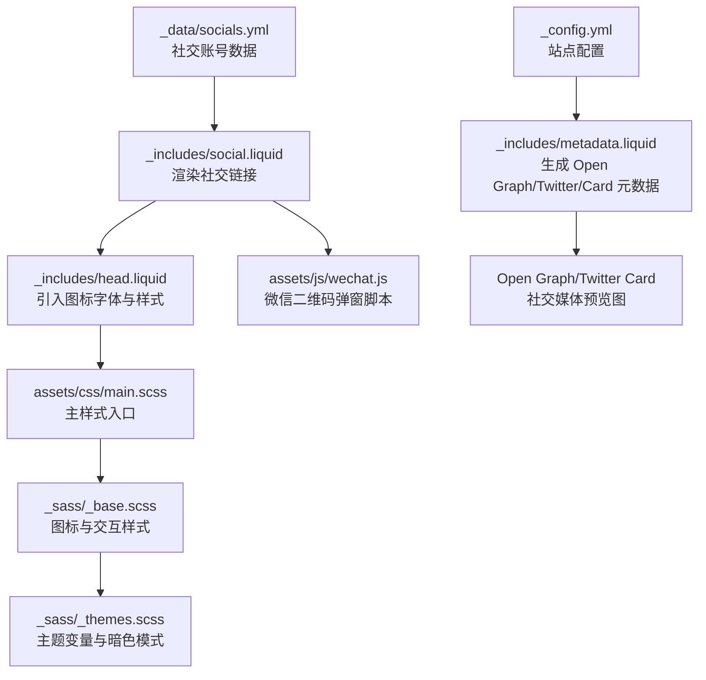
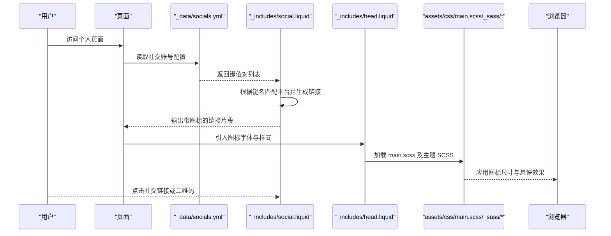
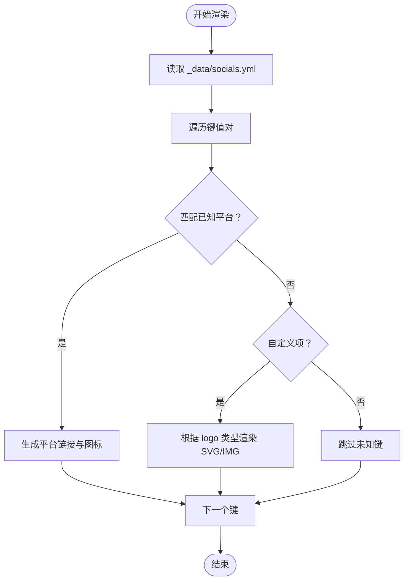
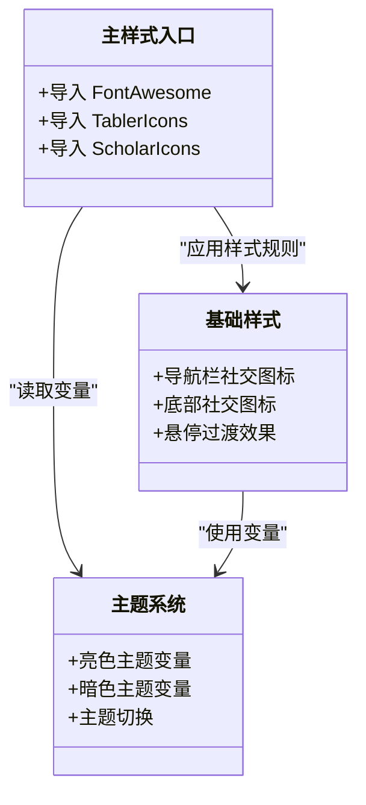
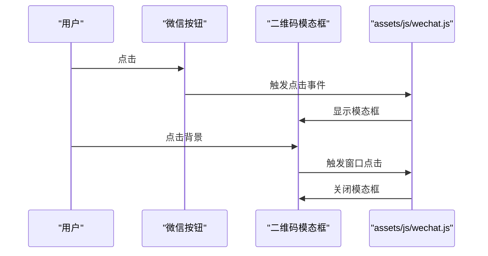
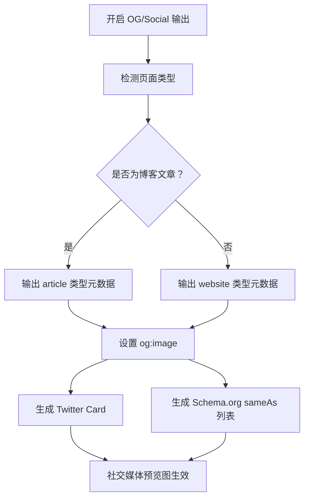
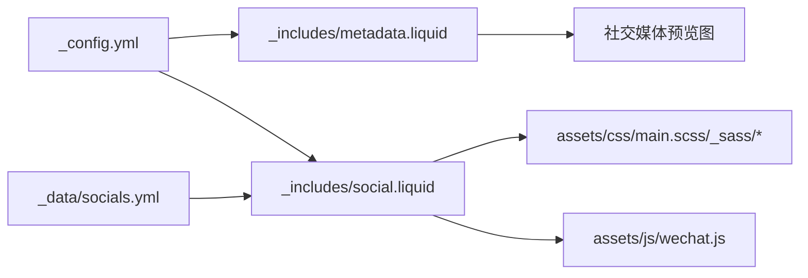

# 社交媒体集成

<cite>
**本文档引用的文件**
- [_config.yml](file://_config.yml)
- [_data/socials.yml](file://_data/socials.yml)
- [_includes/social.liquid](file://_includes/social.liquid)
- [_includes/metadata.liquid](file://_includes/metadata.liquid)
- [_includes/head.liquid](file://_includes/head.liquid)
- [_sass/_base.scss](file://_sass/_base.scss)
- [_sass/_themes.scss](file://_sass/_themes.scss)
- [assets/css/scholar-icons.css](file://assets/css/scholar-icons.css)
- [assets/js/wechat.js](file://assets/js/wechat.js)
- [assets/css/main.scss](file://assets/css/main.scss)
</cite>

## 目录
1. [简介](#简介)
2. [项目结构](#项目结构)
3. [核心组件](#核心组件)
4. [架构概览](#架构概览)
5. [详细组件分析](#详细组件分析)
6. [依赖关系分析](#依赖关系分析)
7. [性能考量](#性能考量)
8. [故障排除指南](#故障排除指南)
9. [结论](#结论)
10. [附录](#附录)

## 简介
本文件面向 al-folio 主题的社交媒体集成功能，系统性地阐述以下内容：
- 社交媒体图标显示与配置：图标库选择（Font Awesome、Tabler Icons、Scholar Icons）与自定义图标的上传与使用
- 平台集成方式：GitHub、Twitter/X、LinkedIn、Google Scholar 等主流平台的链接与标识符配置
- 分享按钮实现：页面级与文章级分享能力的实现思路与扩展点
- 社交媒体预览图：Open Graph 标签与 Twitter Card 的配置与最佳实践
- 样式定制与交互效果：图标尺寸、颜色、悬停动画等主题化定制
- 隐私友好与合规：GDPR 相关的 Impressum 链接与数据处理建议
- 完整配置示例与常见问题排查

## 项目结构
al-folio 的社交媒体功能由配置层、模板层与样式层协同完成：
- 配置层：通过站点配置与数据文件定义社交账号信息与展示行为
- 模板层：Liquid 模板负责渲染社交链接与元数据标签
- 样式层：SCSS 主文件引入图标字体，基础样式定义图标尺寸与交互效果

图表来源
- [_config.yml](file://_config.yml)
- [_data/socials.yml](file://_data/socials.yml)
- [_includes/social.liquid](file://_includes/social.liquid)
- [_includes/metadata.liquid](file://_includes/metadata.liquid)
- [_includes/head.liquid](file://_includes/head.liquid)
- [assets/css/main.scss](file://assets/css/main.scss)
- [_sass/_base.scss](file://_sass/_base.scss)
- [_sass/_themes.scss](file://_sass/_themes.scss)
- [assets/js/wechat.js](file://assets/js/wechat.js)

章节来源
- [_config.yml](file://_config.yml)
- [_data/socials.yml](file://_data/socials.yml)
- [_includes/social.liquid](file://_includes/social.liquid)
- [_includes/metadata.liquid](file://_includes/metadata.liquid)
- [_includes/head.liquid](file://_includes/head.liquid)
- [assets/css/main.scss](file://assets/css/main.scss)
- [_sass/_base.scss](file://_sass/_base.scss)
- [_sass/_themes.scss](file://_sass/_themes.scss)
- [assets/js/wechat.js](file://assets/js/wechat.js)

## 核心组件
- 社交账号数据源：通过数据文件集中管理各平台用户名或个人主页链接
- 社交链接渲染器：根据数据动态生成带图标的外链
- 图标字体与样式：引入 Font Awesome、Tabler Icons、Scholar Icons 字体，统一图标风格
- 元数据与预览：在页面头部注入 Open Graph 与 Twitter Card 元标签，支持社交媒体预览
- 微信二维码交互：点击图标弹出二维码模态框，提升本地化社交体验

章节来源
- [_data/socials.yml](file://_data/socials.yml)
- [_includes/social.liquid](file://_includes/social.liquid)
- [_includes/head.liquid](file://_includes/head.liquid)
- [assets/css/main.scss](file://assets/css/main.scss)
- [_sass/_base.scss](file://_sass/_base.scss)
- [_sass/_themes.scss](file://_sass/_themes.scss)
- [assets/js/wechat.js](file://assets/js/wechat.js)

## 架构概览
下图展示了社交媒体功能从配置到渲染的关键流程：

图表来源
- [_data/socials.yml](file://_data/socials.yml)
- [_includes/social.liquid](file://_includes/social.liquid)
- [_includes/head.liquid](file://_includes/head.liquid)
- [assets/css/main.scss](file://assets/css/main.scss)
- [_sass/_base.scss](file://_sass/_base.scss)
- [_sass/_themes.scss](file://_sass/_themes.scss)

## 详细组件分析

### 社交账号配置与渲染
- 配置位置：站点配置文件中包含社交媒体开关与全局设置；具体平台账号信息存放在数据文件中
- 渲染逻辑：模板按键名匹配平台类型，生成对应链接与图标；支持自定义社交项以 logo、title、url 形式注入
- 常见平台键名：GitHub、LinkedIn、Google Scholar、Twitter/X、Mastodon、ORCID、ResearchGate、Stack Overflow、知乎、微信二维码等
- 自定义图标：当键名为未内置的自定义项时，模板会根据 logo 类型自动选择 SVG 或图片渲染

图表来源
- [_data/socials.yml](file://_data/socials.yml)
- [_includes/social.liquid](file://_includes/social.liquid)

章节来源
- [_data/socials.yml](file://_data/socials.yml)
- [_includes/social.liquid](file://_includes/social.liquid)

### 图标库与样式系统
- 字体引入：主样式入口导入 Font Awesome、Tabler Icons 与 Scholar Icons 字体文件
- 图标尺寸与间距：基础样式定义了导航栏与底部社交区的图标尺寸、间距与悬停颜色过渡
- 主题适配：主题 SCSS 提供亮/暗两种主题变量，确保图标在不同主题下保持一致的可读性与对比度

图表来源
- [assets/css/main.scss](file://assets/css/main.scss)
- [_sass/_base.scss](file://_sass/_base.scss)
- [_sass/_themes.scss](file://_sass/_themes.scss)

章节来源
- [assets/css/main.scss](file://assets/css/main.scss)
- [_sass/_base.scss](file://_sass/_base.scss)
- [_sass/_themes.scss](file://_sass/_themes.scss)

### 微信二维码交互
- 触发元素：模板中为微信二维码键生成按钮与模态框
- 脚本逻辑：点击按钮显示模态框，点击模态框外部区域关闭
- 图片路径：二维码图片从数据文件读取，结合相对路径与资源缓存策略加载

图表来源
- [_includes/social.liquid](file://_includes/social.liquid)
- [assets/js/wechat.js](file://assets/js/wechat.js)

章节来源
- [_includes/social.liquid](file://_includes/social.liquid)
- [assets/js/wechat.js](file://assets/js/wechat.js)

### 社交媒体预览图与元数据
- 开启条件：站点配置中启用 Open Graph 与 Schema.org 输出
- 元数据生成：模板根据页面类型（博客文章/网站）输出相应类型的元标签
- 预览图设置：可通过页面或站点级字段指定 og:image，用于 Facebook、LinkedIn 等平台预览
- Twitter 卡片：设置 Twitter 卡片类型、标题、描述与作者信息，支持站点 X 用户名作为创作者标识

图表来源
- [_config.yml](file://_config.yml)
- [_includes/metadata.liquid](file://_includes/metadata.liquid)

章节来源
- [_config.yml](file://_config.yml)
- [_includes/metadata.liquid](file://_includes/metadata.liquid)

### 分享按钮实现思路
- 页面分享：可基于浏览器原生分享接口或第三方 SDK 实现“分享此页面”功能
- 文章分享：针对博客文章页，可在文章布局中添加分享按钮，调用平台分享链接或复制链接
- 扩展点：在文章模板中预留占位符，通过 JavaScript 动态注入分享按钮与事件绑定
- 注意事项：避免在隐私设置中默认开启追踪，提供关闭选项与用户控制

[本节为概念性说明，不直接分析具体文件]

## 依赖关系分析
- 配置依赖：站点配置决定是否启用社交媒体元数据输出与预览图
- 数据依赖：社交账号数据决定渲染哪些平台与如何生成链接
- 模板依赖：社交渲染模板依赖图标字体与样式文件
- 运行时依赖：微信二维码交互依赖前端脚本与 DOM 结构

图表来源
- [_config.yml](file://_config.yml)
- [_data/socials.yml](file://_data/socials.yml)
- [_includes/social.liquid](file://_includes/social.liquid)
- [_includes/metadata.liquid](file://_includes/metadata.liquid)
- [assets/css/main.scss](file://assets/css/main.scss)
- [_sass/_base.scss](file://_sass/_base.scss)
- [_sass/_themes.scss](file://_sass/_themes.scss)
- [assets/js/wechat.js](file://assets/js/wechat.js)

章节来源
- [_config.yml](file://_config.yml)
- [_data/socials.yml](file://_data/socials.yml)
- [_includes/social.liquid](file://_includes/social.liquid)
- [_includes/metadata.liquid](file://_includes/metadata.liquid)
- [assets/css/main.scss](file://assets/css/main.scss)
- [_sass/_base.scss](file://_sass/_base.scss)
- [_sass/_themes.scss](file://_sass/_themes.scss)
- [assets/js/wechat.js](file://assets/js/wechat.js)

## 性能考量
- 图标字体加载：通过主样式入口统一引入，减少重复请求；可结合 CDN 与子资源完整性校验
- 资源缓存：头文件中的缓存策略与资源哈希有助于浏览器缓存复用
- 懒加载与条件加载：仅在需要时加载特定第三方库，避免不必要的网络开销
- 图片优化：二维码图片建议使用 WebP 格式并设置合适的尺寸，减少带宽占用

[本节提供通用指导，不直接分析具体文件]

## 故障排除指南
- 图标不显示
  - 检查主样式入口是否正确导入所需图标字体
  - 确认图标类名与字体库版本兼容
- 自定义图标不生效
  - 确保自定义项的 logo 字段指向有效路径或 URL
  - 检查文件扩展名与渲染分支逻辑
- 微信二维码无法弹出
  - 确认数据文件中的二维码文件名存在且路径正确
  - 检查脚本是否被正确加载与执行
- 预览图未更新
  - 确认站点配置已启用 Open Graph 输出
  - 检查页面级 og_image 是否覆盖站点级设置
  - 使用社交平台调试工具验证元标签是否正确注入

章节来源
- [assets/css/main.scss](file://assets/css/main.scss)
- [_sass/_base.scss](file://_sass/_base.scss)
- [_includes/social.liquid](file://_includes/social.liquid)
- [assets/js/wechat.js](file://assets/js/wechat.js)
- [_includes/metadata.liquid](file://_includes/metadata.liquid)

## 结论
al-folio 的社交媒体集成功能通过清晰的配置层、模板层与样式层实现了高可扩展性与易维护性。开发者只需在数据文件中添加或修改社交账号信息，即可快速生成对应的社交链接与预览元数据。配合主题化的图标样式与交互效果，能够在不同主题下保持一致的用户体验。同时，通过合理的隐私与合规设置，可满足国际化与地区性法规要求。

[本节为总结性内容，不直接分析具体文件]

## 附录

### 配置示例与最佳实践
- 启用社交媒体元数据输出
  - 在站点配置中开启 Open Graph 与 Schema.org 输出
  - 设置默认预览图与语言
- 添加社交账号
  - 在数据文件中添加平台键名与对应标识符
  - 对于自定义平台，提供 logo、title、url 三项配置
- 图标与样式定制
  - 通过主题变量调整图标颜色与尺寸
  - 在基础样式中微调悬停动画与间距
- 分享按钮扩展
  - 在文章布局中预留分享按钮占位符
  - 使用浏览器原生分享 API 或第三方 SDK 实现分享功能

章节来源
- [_config.yml](file://_config.yml)
- [_data/socials.yml](file://_data/socials.yml)
- [_sass/_themes.scss](file://_sass/_themes.scss)
- [_sass/_base.scss](file://_sass/_base.scss)