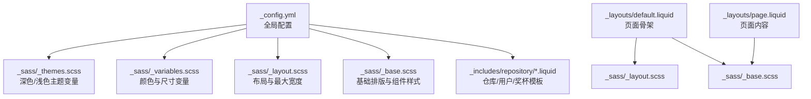
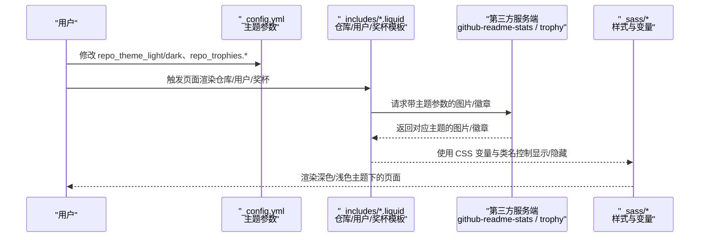
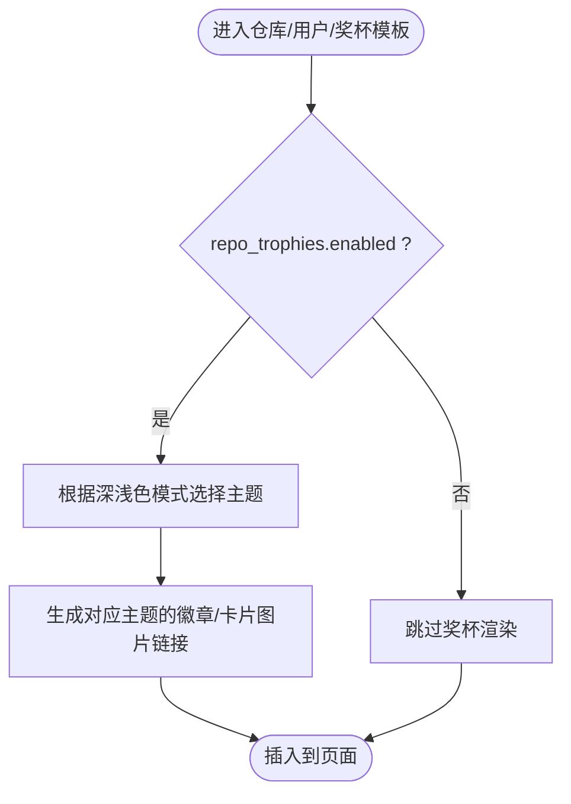
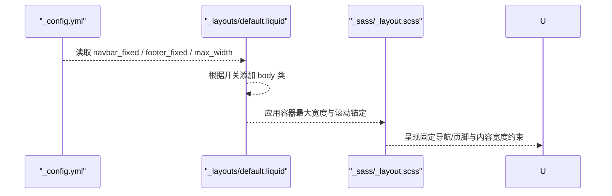
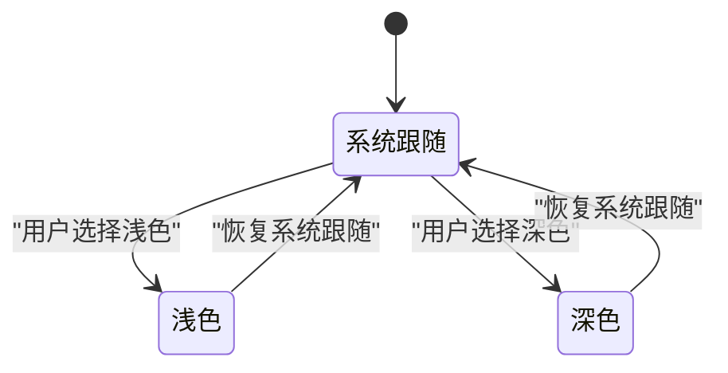
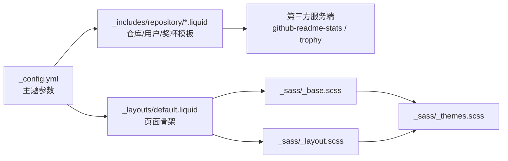

# 主题定制

<cite>
**本文引用的文件**
- [_config.yml](file://_config.yml)
- [CUSTOMIZE.md](file://CUSTOMIZE.md)
- [_sass/_themes.scss](file://_sass/_themes.scss)
- [_sass/_variables.scss](file://_sass/_variables.scss)
- [_sass/_base.scss](file://_sass/_base.scss)
- [_sass/_layout.scss](file://_sass/_layout.scss)
- [_includes/repository/repo.liquid](file://_includes/repository/repo.liquid)
- [_includes/repository/repo_user.liquid](file://_includes/repository/repo_user.liquid)
- [_includes/repository/repo_trophies.liquid](file://_includes/repository/repo_trophies.liquid)
- [_layouts/default.liquid](file://_layouts/default.liquid)
- [_layouts/page.liquid](file://_layouts/page.liquid)
</cite>

## 目录
1. [简介](#简介)
2. [项目结构](#项目结构)
3. [核心组件](#核心组件)
4. [架构总览](#架构总览)
5. [详细组件分析](#详细组件分析)
6. [依赖关系分析](#依赖关系分析)
7. [性能考量](#性能考量)
8. [故障排查指南](#故障排查指南)
9. [结论](#结论)
10. [附录](#附录)

## 简介
本章节面向希望对 al-folio 主题进行深度定制的用户，系统讲解主题相关的配置项与可定制能力，覆盖颜色方案、字体与排版、布局与响应式、仓库徽章与奖杯等主题元素。重点说明以下主题定制参数的使用方式与效果边界：
- 颜色主题：repo_theme_light、repo_theme_dark
- 奖杯主题：repo_trophies.enabled、repo_trophies.theme_light、repo_trophies.theme_dark
- 布局与响应式：navbar_fixed、footer_fixed、max_width、搜索与社交展示开关
- 字体与排版：通过 SCSS 变量与基础样式进行调整
- 深色/浅色模式：由主题变量与 CSS 自定义属性驱动

本指南同时提供最佳实践与兼容性建议，帮助你在保持主题一致性的同时，实现个性化的学术风格网站。

## 项目结构
al-folio 的主题定制主要集中在以下位置：
- 全局配置：_config.yml（站点信息、主题参数、布局与功能开关）
- 样式层：_sass 下的变量、主题、基础样式与布局样式
- 内容注入：Liquid 模板（_includes）用于渲染仓库统计、用户统计与奖杯
- 页面骨架：_layouts 提供页面容器与导航栏、页脚、脚本加载等

**图表来源**
- [_config.yml](file://_config.yml)
- [_sass/_themes.scss](file://_sass/_themes.scss)
- [_sass/_variables.scss](file://_sass/_variables.scss)
- [_sass/_layout.scss](file://_sass/_layout.scss)
- [_sass/_base.scss](file://_sass/_base.scss)
- [_includes/repository/repo.liquid](file://_includes/repository/repo.liquid)
- [_includes/repository/repo_user.liquid](file://_includes/repository/repo_user.liquid)
- [_includes/repository/repo_trophies.liquid](file://_includes/repository/repo_trophies.liquid)
- [_layouts/default.liquid](file://_layouts/default.liquid)
- [_layouts/page.liquid](file://_layouts/page.liquid)

**章节来源**
- [_config.yml](file://_config.yml)
- [_sass/_themes.scss](file://_sass/_themes.scss)
- [_sass/_variables.scss](file://_sass/_variables.scss)
- [_sass/_layout.scss](file://_sass/_layout.scss)
- [_sass/_base.scss](file://_sass/_base.scss)
- [_includes/repository/repo.liquid](file://_includes/repository/repo.liquid)
- [_includes/repository/repo_user.liquid](file://_includes/repository/repo_user.liquid)
- [_includes/repository/repo_trophies.liquid](file://_includes/repository/repo_trophies.liquid)
- [_layouts/default.liquid](file://_layouts/default.liquid)
- [_layouts/page.liquid](file://_layouts/page.liquid)

## 核心组件
本节聚焦主题定制的关键配置与样式组件，帮助你快速定位修改点并理解其作用范围。

- 颜色主题与仓库徽章
  - repo_theme_light、repo_theme_dark：控制仓库卡片与用户统计图的主题配色，来源于第三方服务端参数。
  - repo_trophies：控制 GitHub 奖杯徽章的启用与深浅色主题。
- 布局与响应式
  - navbar_fixed、footer_fixed：控制导航栏与页脚的固定行为。
  - max_width：控制页面内容的最大宽度。
  - 搜索与社交展示：search_enabled、socials_in_search、posts_in_search、bib_search 等。
- 字体与排版
  - 通过 _sass/_variables.scss 定义颜色与尺寸；通过 _sass/_base.scss 控制排版与组件样式。
- 深色/浅色模式
  - 由 _sass/_themes.scss 中的 CSS 自定义属性与数据属性组合实现，支持系统/浅色/深色三种切换状态。

**章节来源**
- [_config.yml](file://_config.yml)
- [_sass/_themes.scss](file://_sass/_themes.scss)
- [_sass/_variables.scss](file://_sass/_variables.scss)
- [_sass/_base.scss](file://_sass/_base.scss)
- [_sass/_layout.scss](file://_sass/_layout.scss)

## 架构总览
下图展示了主题定制参数如何在配置、模板与样式之间流转，最终影响页面呈现。

**图表来源**
- [_config.yml](file://_config.yml)
- [_includes/repository/repo.liquid](file://_includes/repository/repo.liquid)
- [_includes/repository/repo_user.liquid](file://_includes/repository/repo_user.liquid)
- [_includes/repository/repo_trophies.liquid](file://_includes/repository/repo_trophies.liquid)
- [_sass/_themes.scss](file://_sass/_themes.scss)

## 详细组件分析

### 颜色主题与仓库徽章
- 参数位置与含义
  - repo_theme_light、repo_theme_dark：用于仓库卡片与用户统计图的主题配色，值来自第三方服务端支持的主题列表。
  - repo_trophies.enabled：是否启用 GitHub 奖杯徽章。
  - repo_trophies.theme_light、repo_trophies.theme_dark：分别指定浅色/深色模式下的奖杯主题。
- 渲染机制
  - 仓库卡片与用户统计：模板通过 Liquid 变量拼接第三方服务端 URL，并携带 locale、show_owner 等参数。
  - 奖杯徽章：模板根据屏幕尺寸输出不同列数的奖杯图，并按深浅色模式选择对应主题。
- 注意事项
  - 第三方服务端可能更新主题或语言支持，若出现显示异常，请检查服务端文档与可用主题列表。
  - 若需要更精细的样式控制，可在模板中增加额外的 CSS 类以配合深色/浅色模式。

**图表来源**
- [_includes/repository/repo.liquid](file://_includes/repository/repo.liquid)
- [_includes/repository/repo_user.liquid](file://_includes/repository/repo_user.liquid)
- [_includes/repository/repo_trophies.liquid](file://_includes/repository/repo_trophies.liquid)
- [_config.yml](file://_config.yml)

**章节来源**
- [_config.yml](file://_config.yml)
- [_includes/repository/repo.liquid](file://_includes/repository/repo.liquid)
- [_includes/repository/repo_user.liquid](file://_includes/repository/repo_user.liquid)
- [_includes/repository/repo_trophies.liquid](file://_includes/repository/repo_trophies.liquid)

### 布局与响应式
- 导航栏与页脚固定
  - navbar_fixed：控制导航栏是否固定在顶部，影响页面滚动时的视觉与交互。
  - footer_fixed：控制页脚是否固定在底部，影响页面内容区域的留白。
- 最大宽度
  - max_width：限制页面内容容器的最大宽度，确保在大屏设备上的阅读舒适度。
- 搜索与社交展示
  - search_enabled：开启/关闭站内搜索入口。
  - socials_in_search、posts_in_search、bib_search：控制社交链接、文章与文献在搜索结果中的可见性。
- 页面骨架
  - default.liquid 将 navbar_fixed/footer_fixed 注入到 body 类中，从而驱动样式层的布局行为。
  - page.liquid 提供页面标题、描述与内容区，以及可选的目录侧边栏。

**图表来源**
- [_config.yml](file://_config.yml)
- [_layouts/default.liquid](file://_layouts/default.liquid)
- [_sass/_layout.scss](file://_sass/_layout.scss)

**章节来源**
- [_config.yml](file://_config.yml)
- [_layouts/default.liquid](file://_layouts/default.liquid)
- [_sass/_layout.scss](file://_sass/_layout.scss)

### 字体与排版
- 颜色与尺寸变量
  - 在 _sass/_variables.scss 中集中定义颜色、代码背景色、图标路径与返回顶部按钮尺寸等变量，便于统一调整。
- 基础样式
  - _sass/_base.scss 统一了标题、段落、表格、链接、块引用、卡片、引用等基础元素的颜色与间距，均通过 CSS 变量与主题色保持一致。
- 调整建议
  - 如需更换主题色，优先在 _sass/_themes.scss 中修改 --global-theme-color 及相关变量。
  - 如需调整字号、行高、间距等，可在 _sass/_base.scss 中针对具体选择器进行微调。

**章节来源**
- [_sass/_variables.scss](file://_sass/_variables.scss)
- [_sass/_base.scss](file://_sass/_base.scss)
- [_sass/_themes.scss](file://_sass/_themes.scss)

### 深色/浅色模式
- 实现原理
  - _sass/_themes.scss 通过 CSS 自定义属性定义浅色与深色两套变量，并使用 data-theme 属性控制当前主题。
  - 支持三种状态：系统跟随、强制浅色、强制深色，分别通过不同的 data-theme 值生效。
- 影响范围
  - 背景色、文字色、分割线、卡片背景、高亮色、回到顶部按钮等均随主题变量动态变化。
- 使用建议
  - 保持主题变量命名与语义一致，避免直接硬编码颜色值。
  - 如需扩展新的主题色系，可在 _sass/_themes.scss 中新增变量并在相应选择器中引用。

**图表来源**
- [_sass/_themes.scss](file://_sass/_themes.scss)

**章节来源**
- [_sass/_themes.scss](file://_sass/_themes.scss)

## 依赖关系分析
主题定制涉及配置、模板与样式的多层依赖，下图展示关键依赖链：

**图表来源**
- [_config.yml](file://_config.yml)
- [_includes/repository/repo.liquid](file://_includes/repository/repo.liquid)
- [_includes/repository/repo_user.liquid](file://_includes/repository/repo_user.liquid)
- [_includes/repository/repo_trophies.liquid](file://_includes/repository/repo_trophies.liquid)
- [_layouts/default.liquid](file://_layouts/default.liquid)
- [_sass/_layout.scss](file://_sass/_layout.scss)
- [_sass/_base.scss](file://_sass/_base.scss)
- [_sass/_themes.scss](file://_sass/_themes.scss)

**章节来源**
- [_config.yml](file://_config.yml)
- [_includes/repository/repo.liquid](file://_includes/repository/repo.liquid)
- [_includes/repository/repo_user.liquid](file://_includes/repository/repo_user.liquid)
- [_includes/repository/repo_trophies.liquid](file://_includes/repository/repo_trophies.liquid)
- [_layouts/default.liquid](file://_layouts/default.liquid)
- [_sass/_layout.scss](file://_sass/_layout.scss)
- [_sass/_base.scss](file://_sass/_base.scss)
- [_sass/_themes.scss](file://_sass/_themes.scss)

## 性能考量
- 图片与第三方资源
  - 仓库卡片与奖杯均为外部图片请求，建议关注网络延迟与缓存策略，必要时可考虑本地镜像或 CDN 缓存。
- 样式体积
  - 通过 _sass/_themes.scss 与 CSS 变量减少重复定义，有助于缩小 CSS 体积。
- 响应式与交互
  - 固定导航与页脚会增加页面层级与重绘开销，建议在移动端谨慎使用，或结合媒体查询优化。
- 构建与压缩
  - 利用 Jekyll 的压缩与 Terser 压缩 JS，减少传输体积。

## 故障排查指南
- 仓库徽章/奖杯不显示
  - 检查 repo_trophies.enabled 是否开启，以及 theme_light/theme_dark 是否为服务端支持的主题名称。
  - 确认网络可访问第三方服务端域名。
- 主题色未生效
  - 确认 _sass/_themes.scss 中的 CSS 变量已正确编译，且页面未被其他样式覆盖。
- 导航栏/页脚样式异常
  - 检查 navbar_fixed/footer_fixed 对应的 body 类是否正确注入，以及 _sass/_layout.scss 的容器宽度是否符合预期。
- 搜索与社交展示不符合预期
  - 核对 search_enabled、socials_in_search、posts_in_search、bib_search 的配置值，并确认相关模块是否启用。

**章节来源**
- [_config.yml](file://_config.yml)
- [_sass/_themes.scss](file://_sass/_themes.scss)
- [_sass/_layout.scss](file://_sass/_layout.scss)
- [_includes/repository/repo_trophies.liquid](file://_includes/repository/repo_trophies.liquid)

## 结论
通过对 _config.yml、Liquid 模板与 SCSS 样式的协同使用，al-folio 提供了灵活而强大的主题定制能力。围绕颜色主题、仓库徽章、布局与响应式、字体排版及深色/浅色模式，你可以构建既符合学术风格又具备个人特色的网站。建议在定制过程中遵循“集中变量、分层样式、最小改动”的原则，以提升维护性与兼容性。

## 附录

### 配置项速查表
- 颜色与仓库
  - repo_theme_light：仓库卡片浅色主题
  - repo_theme_dark：仓库卡片深色主题
  - repo_trophies.enabled：启用奖杯徽章
  - repo_trophies.theme_light：奖杯浅色主题
  - repo_trophies.theme_dark：奖杯深色主题
- 布局与响应式
  - navbar_fixed：导航栏固定
  - footer_fixed：页脚固定
  - max_width：内容最大宽度
  - search_enabled：站内搜索入口
  - socials_in_search：社交链接参与搜索
  - posts_in_search：文章参与搜索
  - bib_search：文献参与搜索
- 字体与排版
  - 通过 _sass/_variables.scss 与 _sass/_base.scss 调整颜色、字号与间距
- 深色/浅色模式
  - 通过 _sass/_themes.scss 控制主题变量与切换状态

**章节来源**
- [_config.yml](file://_config.yml)
- [_sass/_variables.scss](file://_sass/_variables.scss)
- [_sass/_base.scss](file://_sass/_base.scss)
- [_sass/_themes.scss](file://_sass/_themes.scss)