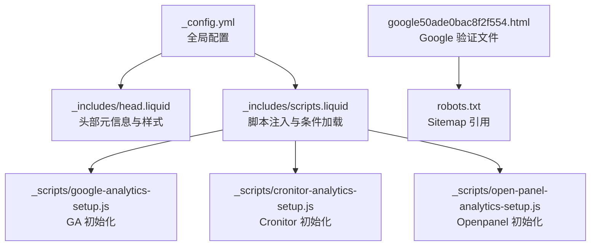
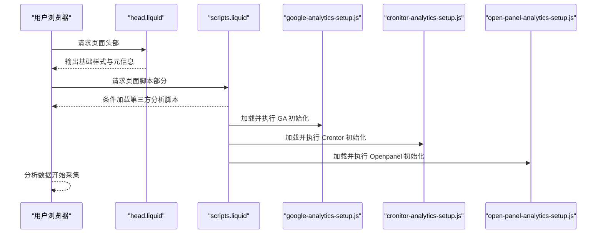
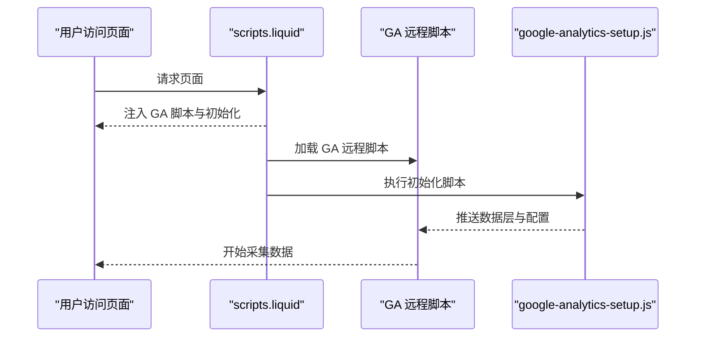
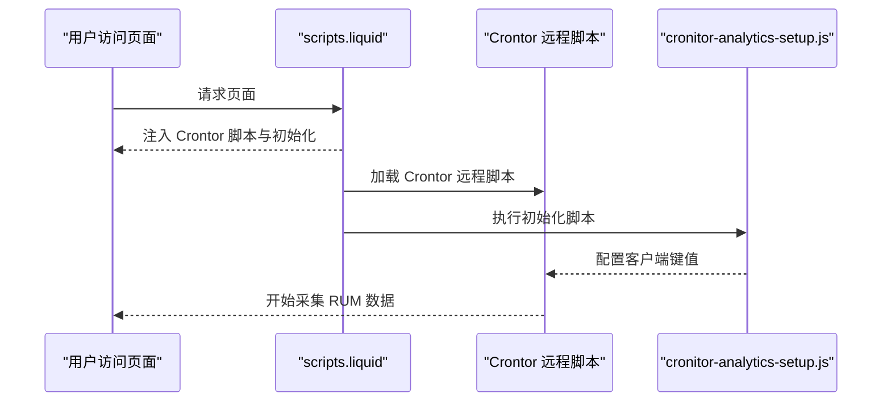
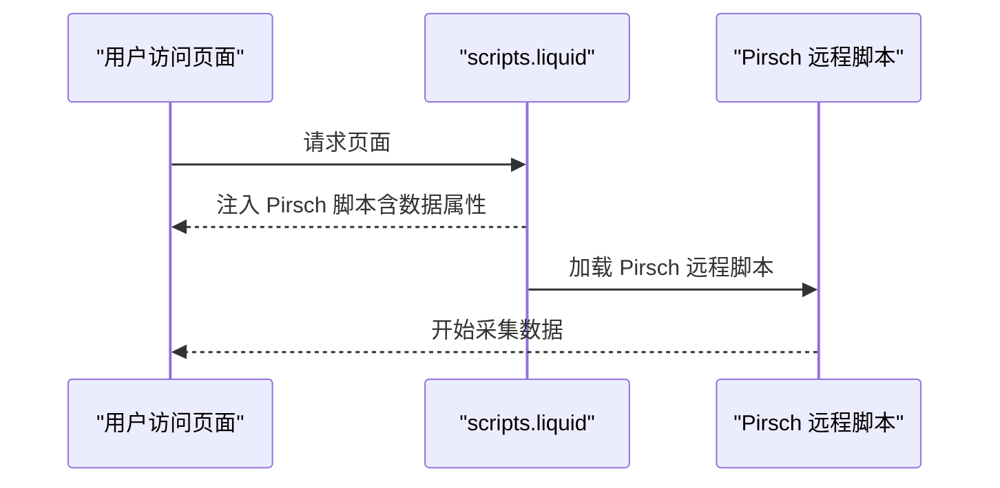
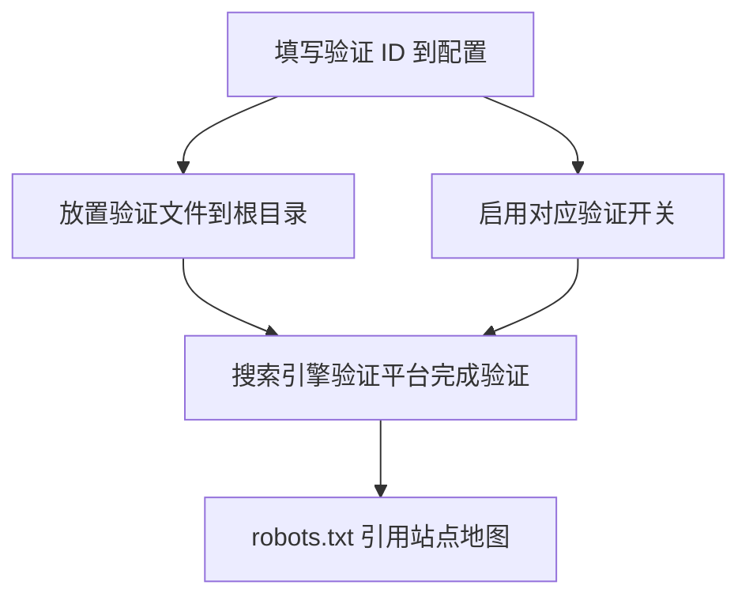
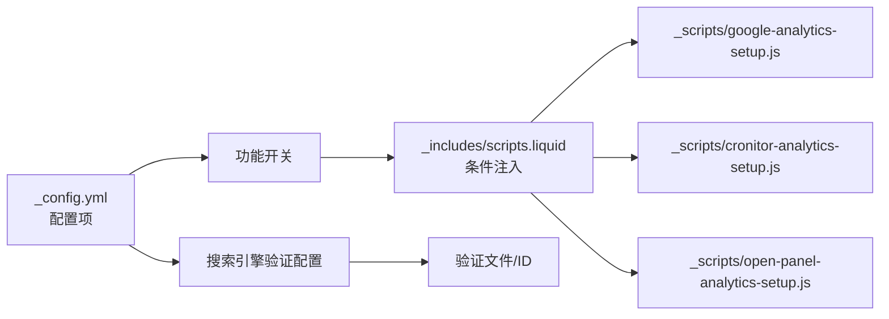

# 分析工具集成

<cite>
**本文引用的文件**
- [_config.yml](file://_config.yml)
- [_includes/scripts.liquid](file://_includes/scripts.liquid)
- [_includes/head.liquid](file://_includes/head.liquid)
- [_scripts/google-analytics-setup.js](file://_scripts/google-analytics-setup.js)
- [_scripts/cronitor-analytics-setup.js](file://_scripts/cronitor-analytics-setup.js)
- [_scripts/open-panel-analytics-setup.js](file://_scripts/open-panel-analytics-setup.js)
- [google50ade0bac8f2f554.html](file://google50ade0bac8f2f554.html)
- [robots.txt](file://robots.txt)
</cite>

## 目录
1. [简介](#简介)
2. [项目结构](#项目结构)
3. [核心组件](#核心组件)
4. [架构总览](#架构总览)
5. [详细组件分析](#详细组件分析)
6. [依赖关系分析](#依赖关系分析)
7. [性能考量](#性能考量)
8. [故障排查指南](#故障排查指南)
9. [结论](#结论)
10. [附录](#附录)

## 简介
本文件面向使用 al-folio 主题的个人网站运营者，系统性说明如何在站点中集成多种分析工具与搜索引擎验证服务，包括：
- 分析服务：Google Analytics（GA）、Cronitor、Pirsch、Openpanel
- 搜索引擎验证：Google Search Console、Bing Webmaster
- 隐私保护相关配置与最佳实践
- 数据验证方法与常见问题排查

文档基于仓库中的配置文件与脚本进行梳理，并提供可操作的配置步骤、ID 获取方式与集成示例路径，帮助您快速正确地完成各项集成。

## 项目结构
al-folio 通过 Jekyll 配置与 Liquid 模板控制分析与验证功能的启用与注入。关键位置如下：
- 全局配置：站点标题、URL、基础路径、分析与验证 ID、功能开关等
- 脚本注入：在页面头部或底部按需加载第三方分析脚本与初始化代码
- 验证文件：搜索引擎验证页面放置于根目录，配合配置项启用

图示来源
- [_config.yml](file://_config.yml)
- [_includes/scripts.liquid](file://_includes/scripts.liquid)
- [_scripts/google-analytics-setup.js](file://_scripts/google-analytics-setup.js)
- [_scripts/cronitor-analytics-setup.js](file://_scripts/cronitor-analytics-setup.js)
- [_scripts/open-panel-analytics-setup.js](file://_scripts/open-panel-analytics-setup.js)
- [google50ade0bac8f2f554.html](file://google50ade0bac8f2f554.html)
- [robots.txt](file://robots.txt)

章节来源
- [_config.yml](file://_config.yml)
- [_includes/scripts.liquid](file://_includes/scripts.liquid)
- [_includes/head.liquid](file://_includes/head.liquid)
- [_scripts/google-analytics-setup.js](file://_scripts/google-analytics-setup.js)
- [_scripts/cronitor-analytics-setup.js](file://_scripts/cronitor-analytics-setup.js)
- [_scripts/open-panel-analytics-setup.js](file://_scripts/open-panel-analytics-setup.js)
- [google50ade0bac8f2f554.html](file://google50ade0bac8f2f554.html)
- [robots.txt](file://robots.txt)

## 核心组件
本节概述各分析与验证组件的配置入口、启用开关与注入方式。

- Google Analytics（GA）
  - 配置项：站点配置中提供测量 ID 字段与启用开关
  - 注入方式：在脚本模板中按条件加载 GA 脚本与初始化脚本
  - 初始化脚本：独立的 JS 片段负责推送数据层与配置

- Crontor RUM
  - 配置项：站点配置中提供站点 ID 字段与启用开关
  - 注入方式：在脚本模板中按条件加载 Crontor 脚本与初始化脚本

- Pirsch
  - 配置项：站点配置中提供站点 ID 字段与启用开关
  - 注入方式：在脚本模板中按条件加载 Pirsch 脚本并传入数据属性

- Openpanel
  - 配置项：站点配置中提供客户端 ID 字段与启用开关
  - 注入方式：在脚本模板中按条件加载 Openpanel 初始化脚本与远程脚本

- 搜索引擎验证
  - Google Search Console：站点配置中提供验证 ID；根目录放置验证页面
  - Bing Webmaster：站点配置中提供验证 ID；通过配置项启用

章节来源
- [_config.yml](file://_config.yml)
- [_includes/scripts.liquid](file://_includes/scripts.liquid)
- [_scripts/google-analytics-setup.js](file://_scripts/google-analytics-setup.js)
- [_scripts/cronitor-analytics-setup.js](file://_scripts/cronitor-analytics-setup.js)
- [_scripts/open-panel-analytics-setup.js](file://_scripts/open-panel-analytics-setup.js)
- [google50ade0bac8f2f554.html](file://google50ade0bac8f2f554.html)

## 架构总览
下图展示分析与验证功能在页面生命周期中的装配流程：从配置到脚本注入再到初始化执行。

图示来源
- [_includes/head.liquid](file://_includes/head.liquid)
- [_includes/scripts.liquid](file://_includes/scripts.liquid)
- [_scripts/google-analytics-setup.js](file://_scripts/google-analytics-setup.js)
- [_scripts/cronitor-analytics-setup.js](file://_scripts/cronitor-analytics-setup.js)
- [_scripts/open-panel-analytics-setup.js](file://_scripts/open-panel-analytics-setup.js)

## 详细组件分析

### Google Analytics（GA）集成
- 配置步骤
  1) 在站点配置中填写测量 ID 字段
  2) 启用 GA 功能开关
  3) 确认脚本注入模板已包含 GA 相关加载逻辑
- ID 获取方法
  - 登录 Google Analytics，创建属性与数据流，复制测量 ID
- 集成示例
  - 参考初始化脚本路径与注入模板片段
- 数据验证
  - 使用实时报告确认数据到达
  - 检查页面源码中是否注入了 GA 脚本与初始化代码

图示来源
- [_includes/scripts.liquid](file://_includes/scripts.liquid)
- [_scripts/google-analytics-setup.js](file://_scripts/google-analytics-setup.js)

章节来源
- [_config.yml](file://_config.yml)
- [_includes/scripts.liquid](file://_includes/scripts.liquid)
- [_scripts/google-analytics-setup.js](file://_scripts/google-analytics-setup.js)

### Crontor RUM 集成
- 配置步骤
  1) 在站点配置中填写 Crontor 站点 ID
  2) 启用 Crontor 功能开关
  3) 确认脚本注入模板已包含 Crontor 相关加载逻辑
- ID 获取方法
  - 登录 Crontor，在站点设置中获取客户端键值
- 集成示例
  - 参考初始化脚本路径与注入模板片段
- 数据验证
  - 在 Crontor 控制台查看站点监控数据
  - 检查页面源码中是否注入了 Crontor 脚本与初始化代码

图示来源
- [_includes/scripts.liquid](file://_includes/scripts.liquid)
- [_scripts/cronitor-analytics-setup.js](file://_scripts/cronitor-analytics-setup.js)

章节来源
- [_config.yml](file://_config.yml)
- [_includes/scripts.liquid](file://_includes/scripts.liquid)
- [_scripts/cronitor-analytics-setup.js](file://_scripts/cronitor-analytics-setup.js)

### Pirsch 集成
- 配置步骤
  1) 在站点配置中填写 Pirsch 站点 ID
  2) 启用 Pirsch 功能开关
  3) 确认脚本注入模板已包含 Pirsch 相关加载逻辑
- ID 获取方法
  - 登录 Pirsch，在站点设置中获取站点代码（长度固定）
- 集成示例
  - 参考注入模板片段（带数据属性）
- 数据验证
  - 在 Pirsch 控制台查看站点统计
  - 检查页面源码中是否注入了 Pirsch 脚本与数据属性

图示来源
- [_includes/scripts.liquid](file://_includes/scripts.liquid)

章节来源
- [_config.yml](file://_config.yml)
- [_includes/scripts.liquid](file://_includes/scripts.liquid)

### Openpanel 集成
- 配置步骤
  1) 在站点配置中填写 Openpanel 客户端 ID
  2) 启用 Openpanel 功能开关
  3) 确认脚本注入模板已包含 Openpanel 相关加载逻辑
- ID 获取方法
  - 登录 Openpanel，在项目设置中获取客户端 ID
- 集成示例
  - 参考初始化脚本路径与注入模板片段
- 数据验证
  - 在 Openpanel 控制台查看事件与会话数据
  - 检查页面源码中是否注入了 Openpanel 初始化脚本与远程脚本

```mermaid
sequenceDiagram
participant U as "用户访问页面"
participant S as "scripts.liquid"
participant O as "Openpanel 远程脚本"
participant I as "open-panel-analytics-setup.js"
U->>S : 请求页面
S-->>U : 注入 Openpanel 初始化与远程脚本
S->>I : 执行初始化脚本
S->>O : 加载远程脚本
I-->>O : 初始化客户端配置
O-->>U : 开始采集数据
```

图示来源
- [_includes/scripts.liquid](file://_includes/scripts.liquid)
- [_scripts/open-panel-analytics-setup.js](file://_scripts/open-panel-analytics-setup.js)

章节来源
- [_config.yml](file://_config.yml)
- [_includes/scripts.liquid](file://_includes/scripts.liquid)
- [_scripts/open-panel-analytics-setup.js](file://_scripts/open-panel-analytics-setup.js)

### 搜索引擎验证（Google Search Console 与 Bing Webmaster）
- Google Search Console
  - 配置步骤：在站点配置中填写验证 ID；同时在根目录放置对应的验证页面
  - 验证页面：仓库中已提供验证文件，内容即为验证标识
  - 数据验证：在 Google Search Console 中完成站点所有权验证
- Bing Webmaster
  - 配置步骤：在站点配置中填写验证 ID；通过配置项启用
  - 数据验证：在 Bing Webmaster 中完成站点所有权验证
- Sitemap 引用
  - robots.txt 中已包含站点地图链接，确保搜索引擎可发现

图示来源
- [_config.yml](file://_config.yml)
- [google50ade0bac8f2f554.html](file://google50ade0bac8f2f554.html)
- [robots.txt](file://robots.txt)

章节来源
- [_config.yml](file://_config.yml)
- [google50ade0bac8f2f554.html](file://google50ade0bac8f2f554.html)
- [robots.txt](file://robots.txt)

## 依赖关系分析
- 配置到注入的依赖
  - 站点配置决定是否启用某分析工具
  - 脚本模板根据开关条件加载相应脚本与初始化代码
- 初始化脚本的依赖
  - 各初始化脚本依赖远程分析服务提供的 SDK 或脚本
- 验证文件与配置的耦合
  - 验证 ID 与验证文件共同完成搜索引擎平台的验证

图示来源
- [_config.yml](file://_config.yml)
- [_includes/scripts.liquid](file://_includes/scripts.liquid)
- [_scripts/google-analytics-setup.js](file://_scripts/google-analytics-setup.js)
- [_scripts/cronitor-analytics-setup.js](file://_scripts/cronitor-analytics-setup.js)
- [_scripts/open-panel-analytics-setup.js](file://_scripts/open-panel-analytics-setup.js)

章节来源
- [_config.yml](file://_config.yml)
- [_includes/scripts.liquid](file://_includes/scripts.liquid)
- [_scripts/google-analytics-setup.js](file://_scripts/google-analytics-setup.js)
- [_scripts/cronitor-analytics-setup.js](file://_scripts/cronitor-analytics-setup.js)
- [_scripts/open-panel-analytics-setup.js](file://_scripts/open-panel-analytics-setup.js)

## 性能考量
- 脚本加载策略
  - 多数分析脚本采用异步加载，避免阻塞页面渲染
  - 初始化脚本通常延迟加载，减少主线程压力
- 资源完整性与缓存
  - 第三方库通过完整性哈希与缓存策略提升安全性与加载效率
- 建议
  - 仅启用必要的分析工具，降低网络往返与执行开销
  - 对于高流量站点，优先选择支持无 Cookie 采集的方案（如 Pirsch）

## 故障排查指南
- 常见问题
  - 分析数据未显示：检查配置中的 ID 是否正确、功能开关是否开启、页面是否成功注入脚本
  - 验证失败：确认验证文件已放置到根目录且名称匹配、验证 ID 正确无误
  - 脚本冲突：若引入其他脚本，建议逐一禁用以定位冲突源
- 验证方法
  - 浏览器开发者工具 Network 面板确认远程脚本加载成功
  - Console 面板查看是否有初始化错误
  - 使用搜索引擎平台的验证工具确认所有权验证状态
- 建议
  - 在本地预览环境先行验证，再上线生产
  - 对于 GA，使用调试模式或实时报告辅助确认数据到达

章节来源
- [_includes/scripts.liquid](file://_includes/scripts.liquid)
- [_config.yml](file://_config.yml)

## 结论
通过在站点配置中设置分析与验证 ID，并结合脚本模板的条件注入机制，al-folio 能够灵活地集成多种分析工具与搜索引擎验证服务。遵循本文提供的配置步骤、ID 获取方法与验证流程，您可以高效完成集成并确保数据准确可靠。同时，建议结合隐私保护要求与性能考量，选择合适的分析方案并定期验证数据质量。

## 附录
- 隐私保护最佳实践
  - 优先选择支持匿名化与最小化数据采集的服务
  - 明确标注 Cookie 使用政策，提供用户控制选项
  - 定期审查数据保留策略与共享范围
- 快速对照表
  - Google Analytics：测量 ID、启用开关、初始化脚本
  - Crontor：站点 ID、启用开关、初始化脚本
  - Pirsch：站点 ID、启用开关、远程脚本
  - Openpanel：客户端 ID、启用开关、初始化脚本
  - Google Search Console：验证 ID、验证文件、启用开关
  - Bing Webmaster：验证 ID、启用开关、robots.txt