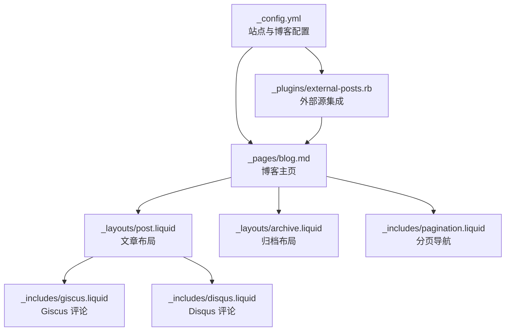
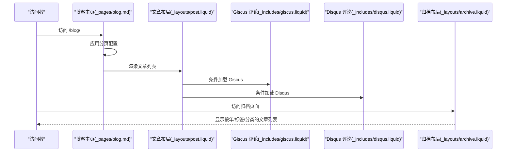
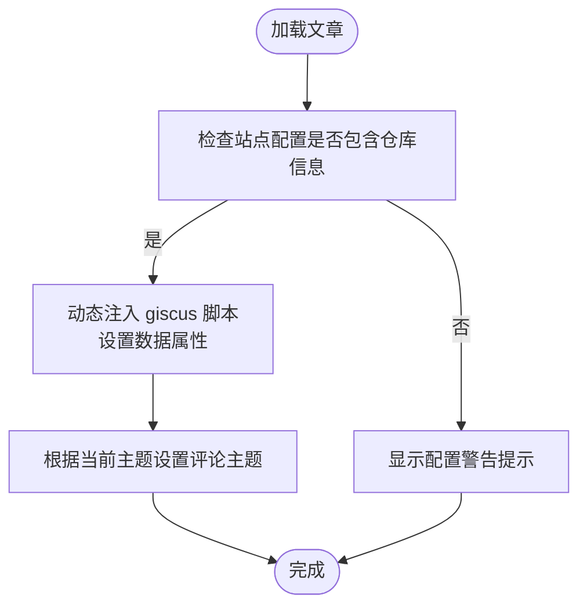
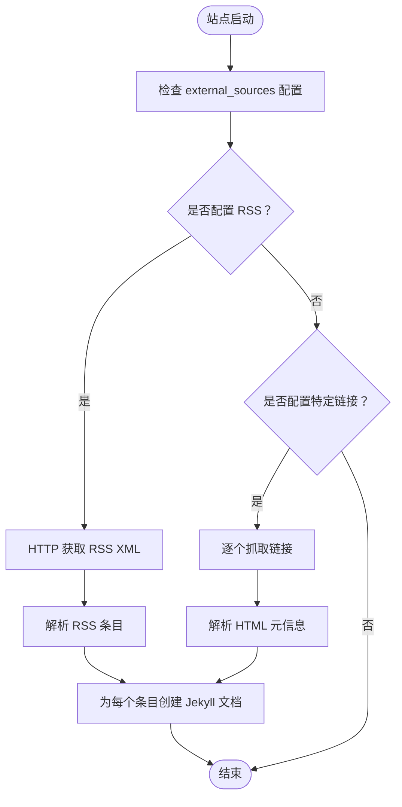
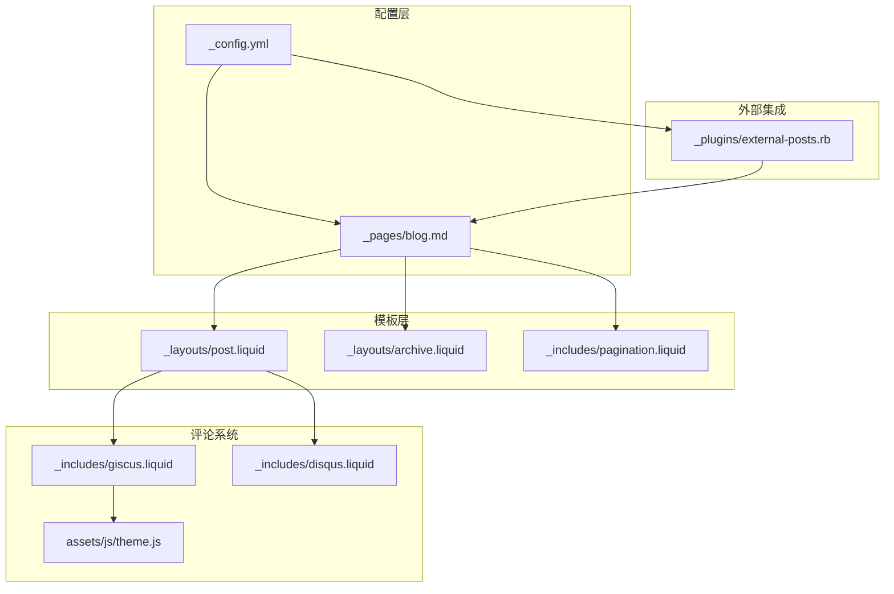

# 博客配置

<cite>
**本文档引用的文件**
- [_config.yml](file://_config.yml)
- [_pages/blog.md](file://_pages/blog.md)
- [_layouts/post.liquid](file://_layouts/post.liquid)
- [_layouts/archive.liquid](file://_layouts/archive.liquid)
- [_includes/giscus.liquid](file://_includes/giscus.liquid)
- [_includes/disqus.liquid](file://_includes/disqus.liquid)
- [_plugins/external-posts.rb](file://_plugins/external-posts.rb)
- [_includes/pagination.liquid](file://_includes/pagination.liquid)
- [_posts/2015-10-20-disqus-comments.md](file://_posts/2015-10-20-disqus-comments.md)
- [_posts/2022-12-10-giscus-comments.md](file://_posts/2022-12-10-giscus-comments.md)
- [assets/js/theme.js](file://assets/js/theme.js)
</cite>

## 目录
1. [简介](#简介)
2. [项目结构概览](#项目结构概览)
3. [核心配置选项](#核心配置选项)
4. [博客架构总览](#博客架构总览)
5. [详细组件分析](#详细组件分析)
6. [依赖关系分析](#依赖关系分析)
7. [性能考虑](#性能考虑)
8. [故障排除指南](#故障排除指南)
9. [结论](#结论)

## 简介
本文件为 al-folio 博客功能的配置指南，重点覆盖以下方面：
- 博客基础配置：站点标题、描述、永久链接设置、分页配置等
- 评论系统配置：Giscus（推荐）与 Disqus（已弃用）的配置方法与差异
- 外部源集成：RSS 订阅与特定链接抓取的配置方式
- 完整配置示例与最佳实践，帮助快速搭建完善的博客系统

## 项目结构概览
al-folio 使用 Jekyll 静态站点生成器，博客相关内容主要分布在以下位置：
- 站点配置：`_config.yml`
- 博客页面：`_pages/blog.md`
- 布局模板：`_layouts/post.liquid`、`_layouts/archive.liquid`
- 评论系统包含片段：`_includes/giscus.liquid`、`_includes/disqus.liquid`
- 分页导航：`_includes/pagination.liquid`
- 外部源插件：`_plugins/external-posts.rb`
- 示例文章：用于演示评论系统启用方式

**图表来源**
- [_config.yml:88-133](file://_config.yml#L88-L133)
- [_pages/blog.md:1-197](file://_pages/blog.md#L1-L197)
- [_layouts/post.liquid:1-97](file://_layouts/post.liquid#L1-L97)
- [_layouts/archive.liquid:1-39](file://_layouts/archive.liquid#L1-L39)
- [_includes/giscus.liquid:1-33](file://_includes/giscus.liquid#L1-L33)
- [_includes/disqus.liquid:1-14](file://_includes/disqus.liquid#L1-L14)
- [_plugins/external-posts.rb:1-111](file://_plugins/external-posts.rb#L1-L111)

**章节来源**
- [_config.yml:88-133](file://_config.yml#L88-L133)
- [_pages/blog.md:1-197](file://_pages/blog.md#L1-L197)

## 核心配置选项

### 博客基础配置
- 博客名称与描述：通过站点配置中的博客名称与描述字段控制首页展示
- 永久链接设置：支持按年/标题等模式生成文章链接
- 相关文章：可启用基于 LSI 的相关文章推荐
- 归档与标签：启用按年/标签/分类的归档页面

**章节来源**
- [_config.yml:91-95](file://_config.yml#L91-L95)
- [_config.yml:250-256](file://_config.yml#L250-L256)

### 分页配置
- 全局分页开关：在站点配置中启用分页
- 博客页面分页：在博客主页中定义每页文章数量、排序字段与分页链接格式
- 分页导航：使用包含片段渲染分页链接

**章节来源**
- [_config.yml:97-98](file://_config.yml#L97-L98)
- [_pages/blog.md:7-16](file://_pages/blog.md#L7-L16)
- [_includes/pagination.liquid:1-21](file://_includes/pagination.liquid#L1-L21)

### 外部源集成
- RSS 订阅：配置外部平台的 RSS 地址，自动抓取并生成文章
- 特定链接抓取：直接指定需要抓取的文章链接与发布时间
- 抓取实现：通过自定义插件解析 RSS 或网页内容，注入到 Jekyll 文章集合

**章节来源**
- [_config.yml:126-133](file://_config.yml#L126-L133)
- [_plugins/external-posts.rb:12-23](file://_plugins/external-posts.rb#L12-L23)
- [_plugins/external-posts.rb:25-42](file://_plugins/external-posts.rb#L25-L42)

## 博客架构总览

**图表来源**
- [_pages/blog.md:104-194](file://_pages/blog.md#L104-L194)
- [_layouts/post.liquid:90-95](file://_layouts/post.liquid#L90-L95)
- [_layouts/archive.liquid:1-39](file://_layouts/archive.liquid#L1-L39)

## 详细组件分析

### Giscus 评论系统配置
- 启用方式：在站点配置中填写仓库信息、分类、映射规则、主题等参数
- 主题适配：通过脚本动态设置主题，与站点深色/浅色模式联动
- 页面集成：在文章布局中根据页面变量条件性包含评论片段

**图表来源**
- [_includes/giscus.liquid:1-33](file://_includes/giscus.liquid#L1-L33)
- [assets/js/theme.js:101-113](file://assets/js/theme.js#L101-L113)

**章节来源**
- [_includes/giscus.liquid:1-33](file://_includes/giscus.liquid#L1-L33)
- [assets/js/theme.js:101-113](file://assets/js/theme.js#L101-L113)

### Disqus 评论系统（已弃用）
- 启用方式：在站点配置中设置短名称，并在文章中开启评论
- 状态说明：官方已弃用，建议迁移至 Giscus
- 迁移路径：参考下文“迁移指南”

**章节来源**
- [_includes/disqus.liquid:1-14](file://_includes/disqus.liquid#L1-L14)
- [_config.yml:119-121](file://_config.yml#L119-L121)

### 外部源集成配置
- RSS 抓取：配置 RSS 地址后，插件会拉取条目并生成文章
- 链接抓取：指定文章链接与发布日期，插件解析网页元数据并生成文章
- 内容处理：对标题进行清洗与 slug 化，确保唯一性；时间戳转换为 UTC

**图表来源**
- [_plugins/external-posts.rb:12-23](file://_plugins/external-posts.rb#L12-L23)
- [_plugins/external-posts.rb:25-42](file://_plugins/external-posts.rb#L25-L42)
- [_plugins/external-posts.rb:69-76](file://_plugins/external-posts.rb#L69-L76)
- [_plugins/external-posts.rb:89-107](file://_plugins/external-posts.rb#L89-L107)

**章节来源**
- [_config.yml:126-133](file://_config.yml#L126-L133)
- [_plugins/external-posts.rb:12-23](file://_plugins/external-posts.rb#L12-L23)
- [_plugins/external-posts.rb:25-42](file://_plugins/external-posts.rb#L25-L42)
- [_plugins/external-posts.rb:69-76](file://_plugins/external-posts.rb#L69-L76)
- [_plugins/external-posts.rb:89-107](file://_plugins/external-posts.rb#L89-L107)

### 分页与归档
- 博客主页分页：在博客页面中定义分页参数，控制每页数量、排序与链接格式
- 导航渲染：使用包含片段渲染上一页/下一页与页码导航
- 归档页面：按年/标签/分类维度生成归档列表

**章节来源**
- [_pages/blog.md:7-16](file://_pages/blog.md#L7-L16)
- [_includes/pagination.liquid:1-21](file://_includes/pagination.liquid#L1-L21)
- [_layouts/archive.liquid:1-39](file://_layouts/archive.liquid#L1-L39)

## 依赖关系分析

**图表来源**
- [_config.yml:88-133](file://_config.yml#L88-L133)
- [_pages/blog.md:1-197](file://_pages/blog.md#L1-L197)
- [_layouts/post.liquid:1-97](file://_layouts/post.liquid#L1-L97)
- [_layouts/archive.liquid:1-39](file://_layouts/archive.liquid#L1-L39)
- [_includes/pagination.liquid:1-21](file://_includes/pagination.liquid#L1-L21)
- [_includes/giscus.liquid:1-33](file://_includes/giscus.liquid#L1-L33)
- [_includes/disqus.liquid:1-14](file://_includes/disqus.liquid#L1-L14)
- [assets/js/theme.js:101-113](file://assets/js/theme.js#L101-L113)
- [_plugins/external-posts.rb:1-111](file://_plugins/external-posts.rb#L1-L111)

**章节来源**
- [_config.yml:88-133](file://_config.yml#L88-L133)
- [_pages/blog.md:1-197](file://_pages/blog.md#L1-L197)
- [_layouts/post.liquid:1-97](file://_layouts/post.liquid#L1-L97)
- [_includes/giscus.liquid:1-33](file://_includes/giscus.liquid#L1-L33)
- [_plugins/external-posts.rb:1-111](file://_plugins/external-posts.rb#L1-L111)

## 性能考虑
- 图片懒加载：启用图片懒加载以提升首屏性能
- 响应式图片：通过 ImageMagick 生成多尺寸 WebP 图片，减少带宽占用
- JS/CSS 压缩：使用压缩工具减少资源体积
- 分页策略：合理设置每页文章数量，避免单页内容过大影响加载速度

**章节来源**
- [_config.yml:374-374](file://_config.yml#L374-L374)
- [_config.yml:351-367](file://_config.yml#L351-L367)
- [_config.yml:234-245](file://_config.yml#L234-L245)

## 故障排除指南

### Giscus 未正确显示
- 检查仓库配置：确认仓库名称、仓库 ID、分类名称与分类 ID 已正确填写
- 检查映射规则：确保映射方式与页面标题一致
- 检查主题设置：确认主题与站点深色/浅色模式兼容
- 查看警告提示：若未配置仓库信息，将显示配置警告

**章节来源**
- [_includes/giscus.liquid:27-31](file://_includes/giscus.liquid#L27-L31)
- [_config.yml:106-117](file://_config.yml#L106-L117)

### Disqus 评论无法加载
- 短名称错误：确认短名称与站点配置一致
- JavaScript 禁用：确保浏览器允许执行脚本
- 弃用状态：Disqus 已弃用，建议迁移至 Giscus

**章节来源**
- [_includes/disqus.liquid:1-14](file://_includes/disqus.liquid#L1-L14)
- [_config.yml:119-121](file://_config.yml#L119-L121)

### 外部源抓取失败
- RSS 地址无效：确认 RSS URL 可访问且返回有效 XML
- 网络问题：检查网络连通性与代理设置
- 解析失败：确认 RSS/HTML 结构符合预期，必要时调整解析逻辑

**章节来源**
- [_plugins/external-posts.rb:25-29](file://_plugins/external-posts.rb#L25-L29)
- [_plugins/external-posts.rb:89-107](file://_plugins/external-posts.rb#L89-L107)

## 迁移指南：从 Disqus 到 Giscus

### 迁移步骤
1. 在 GitHub 仓库中启用 Discussions 功能，并创建评论分类
2. 访问 giscus.app，按照向导完成仓库与分类绑定
3. 将站点配置中的 Giscus 参数填入对应值
4. 在文章中移除 Disqus 相关配置，启用 Giscus
5. 测试评论功能，确保主题与语言设置正确

### 迁移对比
- Disqus：依赖第三方服务，已弃用
- Giscus：基于 GitHub Discussions，评论数据存储在仓库中，更可控

**章节来源**
- [_config.yml:104-117](file://_config.yml#L104-L117)
- [_posts/2015-10-20-disqus-comments.md:8-8](file://_posts/2015-10-20-disqus-comments.md#L8-L8)
- [_posts/2022-12-10-giscus-comments.md:8-8](file://_posts/2022-12-10-giscus-comments.md#L8-L8)

## 最佳实践

### 博客配置最佳实践
- 永久链接：使用稳定且语义化的链接结构，如按年/标题
- 分页：根据内容密度设置合理的每页数量，避免过长页面
- 标签与分类：明确标签与分类体系，保持一致性
- 相关文章：启用 LSI 并设置合适的相关文章数量

**章节来源**
- [_config.yml:93-95](file://_config.yml#L93-L95)
- [_config.yml:97-102](file://_config.yml#L97-L102)
- [_config.yml:260-261](file://_config.yml#L260-L261)

### 评论系统最佳实践
- 推荐使用 Giscus，便于长期维护与数据掌控
- 设置合适的映射规则，确保评论与文章一一对应
- 配置主题与语言，保证与站点整体风格一致

**章节来源**
- [_config.yml:104-117](file://_config.yml#L104-L117)
- [_includes/giscus.liquid:16-16](file://_includes/giscus.liquid#L16-L16)

### 外部源集成最佳实践
- RSS：优先使用 RSS，稳定性更好
- 链接抓取：仅用于特殊场景，注意版权与合规性
- 定期检查：监控抓取结果，及时修复失效链接或格式变更

**章节来源**
- [_config.yml:126-133](file://_config.yml#L126-L133)
- [_plugins/external-posts.rb:12-23](file://_plugins/external-posts.rb#L12-L23)

## 结论
通过以上配置与最佳实践，您可以快速搭建并维护一个功能完备、性能优良的博客系统。建议优先采用 Giscus 作为评论系统，结合合理的分页与外部源集成策略，构建可持续发展的个人知识管理平台。