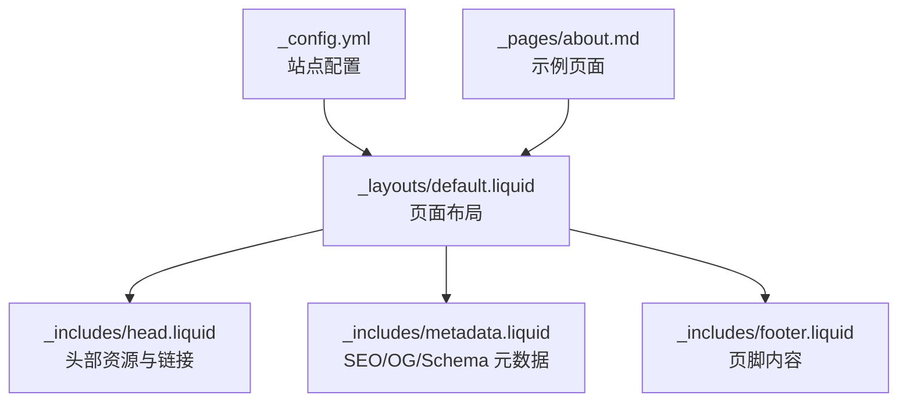
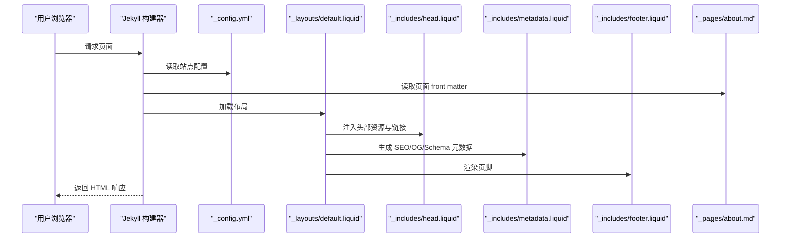

# 基础配置

<cite>
**本文引用的文件列表**
- [_config.yml](file://_config.yml)
- [README.md](file://README.md)
- [INSTALL.md](file://INSTALL.md)
- [CUSTOMIZE.md](file://CUSTOMIZE.md)
- [_includes/metadata.liquid](file://_includes/metadata.liquid)
- [_includes/head.liquid](file://_includes/head.liquid)
- [_includes/footer.liquid](file://_includes/footer.liquid)
- [_layouts/default.liquid](file://_layouts/default.liquid)
- [_data/socials.yml](file://_data/socials.yml)
- [_data/cv.yml](file://_data/cv.yml)
- [_pages/about.md](file://_pages/about.md)
</cite>

## 目录
1. [简介](#简介)
2. [项目结构与入口](#项目结构与入口)
3. [核心配置项详解](#核心配置项详解)
4. [站点元数据与URL设置](#站点元数据与url设置)
5. [语言与国际化](#语言与国际化)
6. [站点外观与图标](#站点外观与图标)
7. [SEO与社交预览](#seo与社交预览)
8. [部署与基础路径](#部署与基础路径)
9. [配置验证与常见问题](#配置验证与常见问题)
10. [最佳实践与安全建议](#最佳实践与安全建议)
11. [依赖关系与数据流](#依赖关系与数据流)
12. [结论](#结论)

## 简介
本章节聚焦于 al-folio 主题的基础配置，围绕站点基本信息（标题、作者、描述、关键词等）展开，系统梳理 _config.yml 中的关键配置项，解释其作用、默认行为、使用方式，并结合模板渲染流程说明这些配置如何影响页面输出。同时提供配置验证方法、常见错误排查以及最佳实践与安全建议，帮助用户快速搭建并维护一个专业、可搜索、可分享的学术个人主页。

## 项目结构与入口
- 配置文件：_config.yml 是 Jekyll 的主配置入口，定义站点名称、作者信息、元数据、功能开关、第三方库版本等。
- 模板渲染：default.liquid 布局通过 include 引入 head.liquid、metadata.liquid、footer.liquid 等片段，最终生成页面 HTML。
- 页面示例：about.md 使用默认布局，展示标题、副标题、社交媒体、新闻与最新文章等区块。

图表来源
- [_config.yml](file://_config.yml)
- [_layouts/default.liquid](file://_layouts/default.liquid)
- [_includes/head.liquid](file://_includes/head.liquid)
- [_includes/metadata.liquid](file://_includes/metadata.liquid)
- [_includes/footer.liquid](file://_includes/footer.liquid)
- [_pages/about.md](file://_pages/about.md)

章节来源
- [_config.yml](file://_config.yml)
- [_layouts/default.liquid](file://_layouts/default.liquid)
- [_includes/head.liquid](file://_includes/head.liquid)
- [_includes/metadata.liquid](file://_includes/metadata.liquid)
- [_includes/footer.liquid](file://_includes/footer.liquid)
- [_pages/about.md](file://_pages/about.md)

## 核心配置项详解
以下为核心站点基本信息配置项，均位于 _config.yml 的“Site settings”区域（第1行至第27行）。这些配置直接影响页面标题、作者信息、描述、关键词、语言、图标等基础元数据。

- 站点标题与作者信息
  - title：站点标题；若留空或显式设为“blank”，将回退到作者全名组合。
  - first_name、middle_name、last_name：作者姓名分段，用于生成作者名与 SEO 元数据。
  - chinese_name：中文姓名显示（例如“（姓名）”），用于中文语境下的强调。
  - contact_note、bib_note：联系说明与论文标注文本，用于页面特定区块。
- 描述与关键词
  - description：站点描述，用于 meta description 与 OpenGraph 描述。
  - keywords：站点关键词，用于 meta keywords。
- 语言与图标
  - lang：站点语言代码（如 en、zh-CN 等），影响页面 lang 属性与 OG 语言。
  - icon：站点图标，支持 Emoji 或图片路径（需位于 /assets/img/ 下）。
- URL 与基础路径
  - url：站点根域名与协议（如 https://example.com）。
  - baseurl：子路径（如 /blog/），根目录部署时留空。
- 页脚与法律声明
  - footer_text：页脚版权与技术信息。
  - impressum_path：法律声明链接路径，便于符合 GDPR 要求。
  - last_updated：是否在页脚显示最后更新时间。
- 导航与布局
  - navbar_fixed、footer_fixed：导航栏与页脚固定行为。
  - search_enabled、socials_in_search、posts_in_search、bib_search：搜索功能开关。
  - max_width：页面最大宽度。

章节来源
- [_config.yml](file://_config.yml)
- [_includes/metadata.liquid](file://_includes/metadata.liquid)
- [_includes/footer.liquid](file://_includes/footer.liquid)
- [_layouts/default.liquid](file://_layouts/default.liquid)

## 站点元数据与URL设置
- canonical 链接与绝对路径
  - head.liquid 中通过 page.url 绝对化生成 canonical 链接，确保搜索引擎识别唯一 URL。
- URL 与基础路径
  - metadata.liquid 在生成 og:url 时会拼接 site.url 与 site.baseurl 与 page.url，确保社交预览与分享链接正确。
  - INSTALL.md 明确：个人/组织页面必须将 url 设为 https://<用户名>.github.io，baseurl 留空；项目页面则设置 baseurl 为 /<仓库名>/。
- 部署分支
  - INSTALL.md 指出：自动部署后会在 gh-pages 分支生成页面，需要在 Pages 设置中选择该分支作为发布源。

章节来源
- [_includes/head.liquid](file://_includes/head.liquid)
- [_includes/metadata.liquid](file://_includes/metadata.liquid)
- [INSTALL.md](file://INSTALL.md)

## 语言与国际化
- lang 配置
  - metadata.liquid 使用 site.lang 生成 og:locale，有助于搜索引擎与社交平台正确识别内容语言。
- 多语言提示
  - CUSTOMIZE.md 提示：如需多语言内容，可在页面 front matter 中覆盖 lang，但全局 lang 影响默认行为与元数据。

章节来源
- [_includes/metadata.liquid](file://_includes/metadata.liquid)
- [CUSTOMIZE.md](file://CUSTOMIZE.md)

## 站点外观与图标
- 图标设置
  - head.liquid 支持两种图标形式：
    - Emoji：当 icon 长度不超过 4 个字符时，直接以内联 SVG 作为 favicon。
    - 图片：当 icon 非空白且为较长字符串时，按 /assets/img/<icon> 生成相对路径。
- 语言与字体
  - head.liquid 引入 Google Fonts，lang 决定字体与排版偏好。

章节来源
- [_includes/head.liquid](file://_includes/head.liquid)
- [_config.yml](file://_config.yml)

## SEO与社交预览
- 元数据生成
  - metadata.liquid 动态生成：
    - 标题：优先使用 page.title，否则回退到 site.title 或作者名。
    - 描述：优先使用 page.description，否则回退到 site.description。
    - 关键词：优先使用 page.keywords，否则回退到 site.keywords。
- OpenGraph 与 Twitter Card
  - serve_og_meta 开启后，生成 og:type、og:title、og:url、og:description、og:image、og:locale、Twitter card 等。
  - is_blog_post 判定逻辑：非博客首页且 URL 包含 /blog/ 且不为标签/分类归档时视为文章类型。
- Schema.org 结构化数据
  - serve_schema_org 开启后，生成 author、url、type、description、headline、sameAs 等结构化数据，sameAs 来自 _data/socials.yml 中的各类社交账号配置。

章节来源
- [_includes/metadata.liquid](file://_includes/metadata.liquid)
- [_data/socials.yml](file://_data/socials.yml)

## 部署与基础路径
- GitHub Pages 部署
  - INSTALL.md 规定：
    - 个人/组织页面：url=https://<用户名>.github.io，baseurl 留空。
    - 项目页面：url=https://<用户名>.github.io，baseurl=/仓库名/。
  - 自动部署后，gh-pages 分支为发布源，需在 Pages 设置中选择该分支。
- 本地开发
  - Docker Compose 提供一键本地运行，访问 http://localhost:8080 查看效果。
- 手动构建
  - 运行 bundle exec jekyll build 生成静态站点至 _site/，可自行上传至任意服务器。

章节来源
- [INSTALL.md](file://INSTALL.md)

## 配置验证与常见问题
- 验证方法
  - 本地预览：使用 Docker Compose 启动后在浏览器打开 http://localhost:8080，观察标题、描述、图标、页脚版权等是否符合预期。
  - 构建验证：执行 bundle exec jekyll build，检查 _site/ 输出是否包含预期页面与资源。
  - 社交预览：开启 serve_og_meta 后，使用 Facebook Sharing Debugger 或 LinkedIn Post Inspector 检查 og:title、og:description、og:image 是否正确。
- 常见错误与解决
  - 标题为空或显示异常
    - 若未设置 title 或设为“blank”，将回退到作者全名组合；请确认 first_name、middle_name、last_name 已正确填写。
  - 图标不显示
    - Emoji 图标仅在 icon 长度≤4 时生效；若使用图片，请确保 icon 为 /assets/img/ 下存在的文件名。
  - URL/基础路径错误
    - 个人/组织页面必须将 baseurl 留空；项目页面必须设置 baseurl 为 /仓库名/。
  - 页脚未显示最后更新时间
    - last_updated 必须设为 true 才会显示；否则保持默认隐藏。
  - 社交预览缺失
    - 确认 serve_og_meta=true，且 og_image 或页面 og_image 指向有效图片 URL。
  - 语言显示异常
    - lang 应为标准语言代码（如 en、zh-CN），并在 metadata.liquid 中用于 og:locale 与页面 lang 属性。

章节来源
- [_config.yml](file://_config.yml)
- [_includes/metadata.liquid](file://_includes/metadata.liquid)
- [_includes/head.liquid](file://_includes/head.liquid)
- [INSTALL.md](file://INSTALL.md)

## 最佳实践与安全建议
- 最佳实践
  - 明确站点定位：title 与 description 应简洁准确，keywords 适度，避免堆砌。
  - 语言一致性：lang 与页面 front matter 中的语言设置保持一致，提升可读性与 SEO。
  - 图标规范：优先使用矢量图标或高质量 PNG；Emoji 图标适合简单场景。
  - URL 规范：严格遵循 INSTALL.md 的部署要求，避免 baseurl 误配导致资源 404。
  - 社交预览：为关键页面设置 og_image，确保分享时有统一视觉呈现。
- 安全建议
  - 隐私合规：通过 impressum_path 提供法律声明链接，满足 GDPR 要求。
  - 第三方资源：使用 CDN 时注意 integrity 校验，降低供应链风险。
  - 访问控制：如启用网站验证（google_site_verification、bing_site_verification），妥善管理密钥与权限。

章节来源
- [_config.yml](file://_config.yml)
- [INSTALL.md](file://INSTALL.md)

## 依赖关系与数据流
- 配置到页面的数据流
  - _config.yml 提供站点元数据与功能开关；
  - default.liquid 布局加载 head.liquid 与 metadata.liquid；
  - metadata.liquid 根据 site.* 与 page.* 生成 HTML meta、OpenGraph、Schema.org 数据；
  - footer.liquid 渲染页脚版权与法律声明；
  - about.md 等页面通过 front matter 控制局部行为（如 redirect、toc、social 等）。

图表来源
- [_config.yml](file://_config.yml)
- [_layouts/default.liquid](file://_layouts/default.liquid)
- [_includes/head.liquid](file://_includes/head.liquid)
- [_includes/metadata.liquid](file://_includes/metadata.liquid)
- [_includes/footer.liquid](file://_includes/footer.liquid)
- [_pages/about.md](file://_pages/about.md)

## 结论
通过对 _config.yml 中站点基本信息与元数据配置的系统梳理，可以明确：title、author 信息、description、keywords、lang、icon、url/baseurl、footer_text/impressum_path、navbar/footer 固定行为等构成了 al-folio 基础配置的核心。结合 metadata.liquid 的动态生成机制与 INSTALL.md 的部署规范，用户可以在本地快速验证、在 GitHub Pages 上稳定发布，并通过 serve_og_meta 与 serve_schema_org 提升 SEO 与社交分享体验。遵循本文提供的验证方法与最佳实践，可有效避免常见错误，确保学术主页的专业性与可维护性。