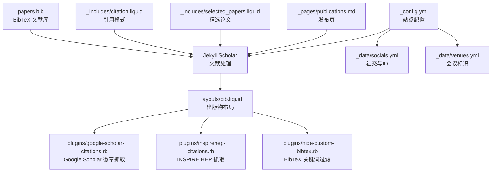
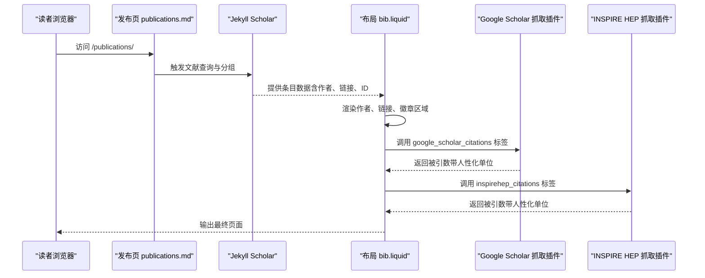
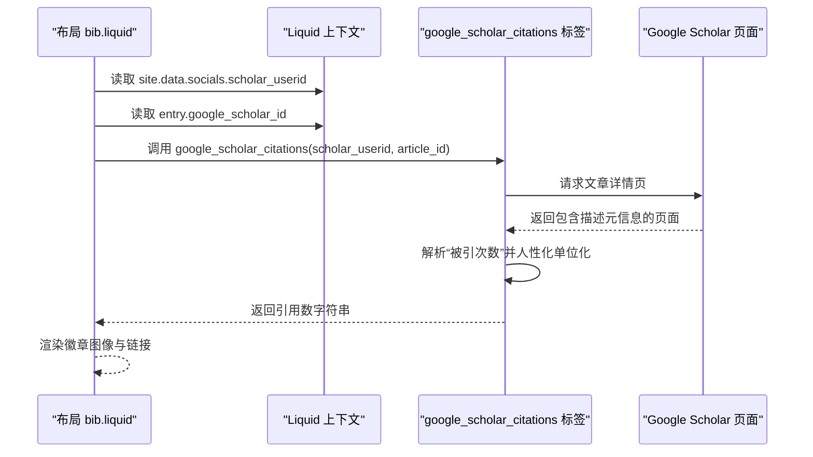
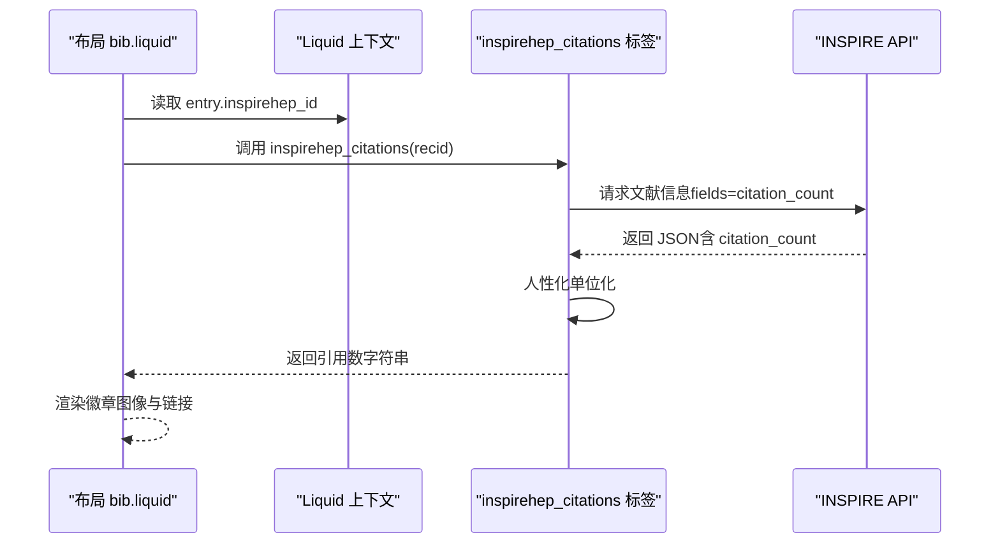
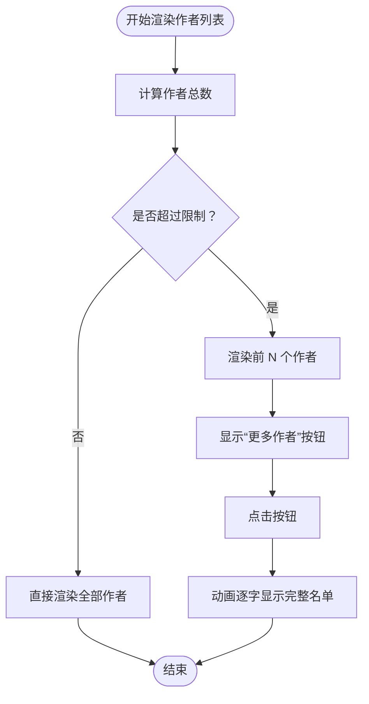
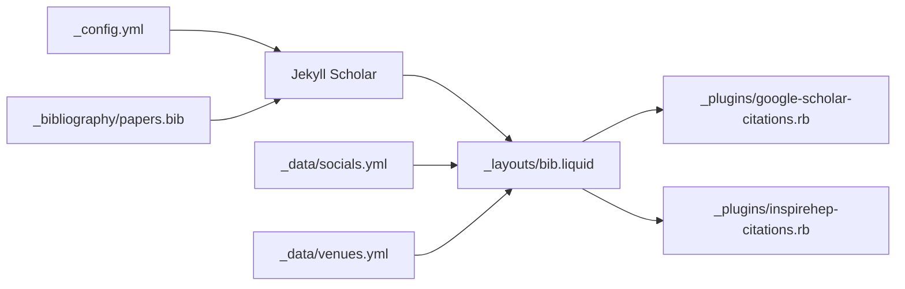

# 学术功能配置

<cite>
**本文档引用的文件**
- [_config.yml](file://_config.yml)
- [_layouts/bib.liquid](file://_layouts/bib.liquid)
- [_plugins/google-scholar-citations.rb](file://_plugins/google-scholar-citations.rb)
- [_plugins/inspirehep-citations.rb](file://_plugins/inspirehep-citations.rb)
- [_plugins/hide-custom-bibtex.rb](file://_plugins/hide-custom-bibtex.rb)
- [_data/socials.yml](file://_data/socials.yml)
- [_data/venues.yml](file://_data/venues.yml)
- [_pages/publications.md](file://_pages/publications.md)
- [_includes/selected_papers.liquid](file://_includes/selected_papers.liquid)
- [_includes/citation.liquid](file://_includes/citation.liquid)
- [papers.bib](file://_bibliography/papers.bib)
- [scholar-icons.css](file://assets/css/scholar-icons.css)
</cite>

## 目录
1. [简介](#简介)
2. [项目结构](#项目结构)
3. [核心组件](#核心组件)
4. [架构总览](#架构总览)
5. [详细组件分析](#详细组件分析)
6. [依赖关系分析](#依赖关系分析)
7. [性能考虑](#性能考虑)
8. [故障排除指南](#故障排除指南)
9. [结论](#结论)
10. [附录](#附录)

## 简介
本文件面向使用 al-folio 搭建个人学术主页的用户，系统性讲解“学术功能”的配置与实现原理，重点覆盖以下方面：
- Google Scholar 集成：如何在页面中展示论文被引次数，并通过自定义 Liquid 标签抓取实时数据。
- 出版物管理：基于 Jekyll Scholar 的文献组织、分组、筛选与展示。
- 引用统计与徽章：Altmetric、Dimensions、Google Scholar、INSPIRE HEP 等多源引用统计徽章的启用与配置。
- 出版物限制与显示：作者数量上限、缩略图显示、精选论文等。
- 完整示例与排错：提供可直接参考的配置片段路径与常见问题定位方法。

## 项目结构
围绕学术功能的关键目录与文件如下：
- 配置层：站点主配置文件用于开启 Jekyll Scholar、设置样式与过滤规则。
- 数据层：社交账号与会议信息等数据文件，支撑徽章链接与标识。
- 内容层：BibTeX 文献库与页面模板，负责文献列表与详情展示。
- 插件层：自定义 Liquid 标签与过滤器，负责外部数据抓取与输出净化。
- 布局层：出版物布局模板，负责渲染作者、链接、徽章与交互细节。

图表来源
- [_config.yml](file://_config.yml)
- [_layouts/bib.liquid](file://_layouts/bib.liquid)
- [_plugins/google-scholar-citations.rb](file://_plugins/google-scholar-citations.rb)
- [_plugins/inspirehep-citations.rb](file://_plugins/inspirehep-citations.rb)
- [_plugins/hide-custom-bibtex.rb](file://_plugins/hide-custom-bibtex.rb)
- [_data/socials.yml](file://_data/socials.yml)
- [_data/venues.yml](file://_data/venues.yml)
- [_pages/publications.md](file://_pages/publications.md)
- [_includes/selected_papers.liquid](file://_includes/selected_papers.liquid)
- [_includes/citation.liquid](file://_includes/citation.liquid)
- [papers.bib](file://_bibliography/papers.bib)

章节来源
- [_config.yml](file://_config.yml)
- [_pages/publications.md](file://_pages/publications.md)

## 核心组件
- Jekyll Scholar 配置块（scholar）
  - 作用：定义作者姓名匹配、样式风格、BibTeX 来源与模板、分组方式、过滤关键词等。
  - 关键参数：last_name、first_name、style、locale、source、bibliography、bibliography_template、details_dir、details_link、query、group_by、group_order、bibtex_filters、replace_strings、join_strings。
  - 参考路径：[_config.yml:267-291](file://_config.yml#L267-L291)

- 出版物徽章开关（enable_publication_badges）
  - 作用：统一控制是否显示 Altmetric、Dimensions、Google Scholar、INSPIRE HEP 徽章。
  - 可选值：altmetric、dimensions、google_scholar、inspirehep。
  - 参考路径：[_config.yml:294-298](file://_config.yml#L294-L298)

- 过滤关键词（filtered_bibtex_keywords）
  - 作用：在导出 BibTeX 时自动移除内部使用的字段，避免污染最终输出。
  - 参考路径：[_config.yml:301-325](file://_config.yml#L301-L325)

- 作者数量限制与动画延迟（max_author_limit、more_authors_animation_delay）
  - 作用：限制每条目显示的作者数量，超出部分以“展开”形式呈现，支持动画延迟。
  - 参考路径：[_config.yml:327-329](file://_config.yml#L327-L329)

- 缩略图开关（enable_publication_thumbnails）
  - 作用：控制是否显示会议徽章与预览图。
  - 参考路径：[_config.yml:332](file://_config.yml#L332)

章节来源
- [_config.yml](file://_config.yml)

## 架构总览
下图展示了从配置到页面渲染、再到外部数据抓取的整体流程：

图表来源
- [_pages/publications.md](file://_pages/publications.md)
- [_layouts/bib.liquid](file://_layouts/bib.liquid)
- [_plugins/google-scholar-citations.rb](file://_plugins/google-scholar-citations.rb)
- [_plugins/inspirehep-citations.rb](file://_plugins/inspirehep-citations.rb)

## 详细组件分析

### 组件A：Google Scholar 集成与徽章
- 功能概述
  - 在出版物条目右侧显示 Google Scholar 引用徽章，点击可跳转至该文章的引用详情页。
  - 徽章数值由自定义 Liquid 标签动态抓取，避免硬编码导致的数据陈旧。
- 关键实现
  - 布局模板中根据配置开关与条目是否存在 google_scholar_id 决定是否渲染徽章。
  - 使用 google_scholar_citations 标签，传入站点配置中的学者 ID 与条目 ID，标签内部通过解析 Google Scholar 页面元信息提取“被引次数”，并进行人性化单位转换。
  - 社交数据 socials.yml 中需提供 scholar_userid，作为抓取请求的用户标识。
- 参数与位置
  - 开关与默认值：参见 [_config.yml:294-298](file://_config.yml#L294-L298)
  - 布局渲染逻辑：参见 [_layouts/bib.liquid:314-324](file://_layouts/bib.liquid#L314-L324)
  - 抓取实现：参见 [_plugins/google-scholar-citations.rb:10-85](file://_plugins/google-scholar-citations.rb#L10-L85)
  - 学者 ID 来源：参见 [_data/socials.yml:34](file://_data/socials.yml#L34)

图表来源
- [_layouts/bib.liquid](file://_layouts/bib.liquid)
- [_plugins/google-scholar-citations.rb](file://_plugins/google-scholar-citations.rb)
- [_data/socials.yml](file://_data/socials.yml)

章节来源
- [_layouts/bib.liquid](file://_layouts/bib.liquid)
- [_plugins/google-scholar-citations.rb](file://_plugins/google-scholar-citations.rb)
- [_data/socials.yml](file://_data/socials.yml)

### 组件B：INSPIRE HEP 引用统计
- 功能概述
  - 为高能物理类论文提供 INSPIRE HEP 的引用计数徽章，点击跳转至 INSPIRE 文献页。
- 关键实现
  - 布局模板中根据配置开关与条目是否存在 inspirehep_id 决定是否渲染。
  - 使用 inspirehep_citations 标签，传入 recid，通过官方 API 获取 citation_count 并进行人性化单位转换。
- 参数与位置
  - 开关与默认值：参见 [_config.yml:294-298](file://_config.yml#L294-L298)
  - 布局渲染逻辑：参见 [_layouts/bib.liquid:326-336](file://_layouts/bib.liquid#L326-L336)
  - 抓取实现：参见 [_plugins/inspirehep-citations.rb:10-58](file://_plugins/inspirehep-citations.rb#L10-L58)

图表来源
- [_layouts/bib.liquid](file://_layouts/bib.liquid)
- [_plugins/inspirehep-citations.rb](file://_plugins/inspirehep-citations.rb)

章节来源
- [_layouts/bib.liquid](file://_layouts/bib.liquid)
- [_plugins/inspirehep-citations.rb](file://_plugins/inspirehep-citations.rb)

### 组件C：Altmetric 与 Dimensions 徽章
- 功能概述
  - Altmetric 与 Dimensions 提供论文的综合影响力指标徽章；可通过条目字段或自动推断（如 arXiv/DOI/PMID/ISBN）注入徽章。
- 关键实现
  - 布局模板中根据配置开关与条目是否存在对应字段决定是否渲染。
  - Altmetric 使用嵌入式脚本（通过 data-* 属性）；Dimensions 使用嵌入式脚本（通过 data-* 属性）。
- 参数与位置
  - 开关与默认值：参见 [_config.yml:294-298](file://_config.yml#L294-L298)
  - 布局渲染逻辑：参见 [_layouts/bib.liquid:279-312](file://_layouts/bib.liquid#L279-L312)

章节来源
- [_layouts/bib.liquid](file://_layouts/bib.liquid)
- [_config.yml](file://_config.yml)

### 组件D：作者姓名匹配与作者列表交互
- 功能概述
  - 自动识别条目作者数组中的“本人”身份，高亮显示；支持“展开更多作者”的动画效果。
- 关键实现
  - 通过 scholar.last_name 与 scholar.first_name 与条目作者名进行匹配，标记作者 URL（若存在合著者映射）。
  - 当作者数量超过阈值时，显示“更多作者”提示，点击后以动画逐字显示完整名单。
- 参数与位置
  - 匹配逻辑与高亮：参见 [_layouts/bib.liquid:65-103](file://_layouts/bib.liquid#L65-L103)
  - 作者数量限制与动画延迟：参见 [_config.yml:327-329](file://_config.yml#L327-L329)

图表来源
- [_layouts/bib.liquid](file://_layouts/bib.liquid)
- [_config.yml](file://_config.yml)

章节来源
- [_layouts/bib.liquid](file://_layouts/bib.liquid)
- [_config.yml](file://_config.yml)

### 组件E：BibTeX 过滤与输出净化
- 功能概述
  - 在导出 BibTeX 时自动移除内部关键字字段，同时清理作者行中的特殊标记符号，保证输出整洁。
- 关键实现
  - 使用 hideCustomBibtex 过滤器，遍历 filtered_bibtex_keywords 列表，逐项删除对应行。
  - 对作者行中的星号等标记进行清理，避免影响最终显示。
- 参数与位置
  - 过滤关键词列表：参见 [_config.yml:301-325](file://_config.yml#L301-L325)
  - 过滤器实现：参见 [_plugins/hide-custom-bibtex.rb:1-19](file://_plugins/hide-custom-bibtex.rb#L1-L19)

章节来源
- [_plugins/hide-custom-bibtex.rb](file://_plugins/hide-custom-bibtex.rb)
- [_config.yml](file://_config.yml)

### 组件F：精选论文与页面入口
- 功能概述
  - 提供“精选论文”快捷入口与发布页，统一展示所有或特定筛选条件下的论文。
- 关键实现
  - 发布页通过 bibliography 标签渲染完整列表；精选论文通过自定义 include 使用查询参数筛选 selected=true 的条目。
- 参数与位置
  - 发布页模板：参见 [_pages/publications.md](file://_pages/publications.md)
  - 精选论文 include：参见 [_includes/selected_papers.liquid](file://_includes/selected_papers.liquid)

章节来源
- [_pages/publications.md](file://_pages/publications.md)
- [_includes/selected_papers.liquid](file://_includes/selected_papers.liquid)

## 依赖关系分析
- 配置到渲染
  - _config.yml 中的 scholar 块驱动 Jekyll Scholar 的解析与分组；_layouts/bib.liquid 负责最终渲染。
- 布局到插件
  - 布局中调用 google_scholar_citations 与 inspirehep_citations 标签，分别由对应的 Ruby 插件实现。
- 数据到展示
  - _data/socials.yml 提供学者 ID；_data/venues.yml 提供会议徽章颜色与链接；_bibliography/papers.bib 提供条目数据。
- 外部服务
  - Google Scholar 与 INSPIRE HEP 的抓取依赖网络访问，需注意反爬策略与速率限制。

图表来源
- [_config.yml](file://_config.yml)
- [_layouts/bib.liquid](file://_layouts/bib.liquid)
- [_plugins/google-scholar-citations.rb](file://_plugins/google-scholar-citations.rb)
- [_plugins/inspirehep-citations.rb](file://_plugins/inspirehep-citations.rb)
- [_data/socials.yml](file://_data/socials.yml)
- [_data/venues.yml](file://_data/venues.yml)
- [_bibliography/papers.bib](file://_bibliography/papers.bib)

章节来源
- [_config.yml](file://_config.yml)
- [_layouts/bib.liquid](file://_layouts/bib.liquid)
- [_plugins/google-scholar-citations.rb](file://_plugins/google-scholar-citations.rb)
- [_plugins/inspirehep-citations.rb](file://_plugins/inspirehep-citations.rb)
- [_data/socials.yml](file://_data/socials.yml)
- [_data/venues.yml](file://_data/venues.yml)
- [_bibliography/papers.bib](file://_bibliography/papers.bib)

## 性能考虑
- 抓取频率与延时
  - Google Scholar 抓取插件内置随机延时，避免触发限流；建议在本地构建时缓存结果，减少重复抓取。
- 渲染复杂度
  - 作者列表的“展开动画”使用 JavaScript 实现，建议保持动画延迟适中，避免影响首屏加载。
- 图片与徽章
  - 启用缩略图与多源徽章会增加页面资源体积，建议按需开启并优化图片尺寸与格式。
- 分组与查询
  - 使用 group_by 与 query 可减少一次性渲染的条目数量，提升页面响应速度。

## 故障排除指南
- Google Scholar 徽章显示 N/A 或数值异常
  - 检查条目是否提供 google_scholar_id；确认 scholar_userid 正确无误。
  - 若网络受限或被临时屏蔽，可尝试在本地构建时禁用抓取或使用缓存。
  - 参考路径：[_layouts/bib.liquid:314-324](file://_layouts/bib.liquid#L314-L324)，[_plugins/google-scholar-citations.rb:33-77](file://_plugins/google-scholar-citations.rb#L33-L77)，[_data/socials.yml:34](file://_data/socials.yml#L34)

- INSPIRE HEP 徽章显示 N/A
  - 确认 inspirehep_id 是否正确；检查 API 可达性与返回格式。
  - 参考路径：[_layouts/bib.liquid:326-336](file://_layouts/bib.liquid#L326-L336)，[_plugins/inspirehep-citations.rb:23-49](file://_plugins/inspirehep-citations.rb#L23-L49)

- BibTeX 输出包含内部字段
  - 检查 filtered_bibtex_keywords 是否包含目标字段；确认 hideCustomBibtex 过滤器已注册。
  - 参考路径：[_config.yml:301-325](file://_config.yml#L301-L325)，[_plugins/hide-custom-bibtex.rb:1-19](file://_plugins/hide-custom-bibtex.rb#L1-L19)

- 作者列表未高亮或“更多作者”不生效
  - 检查 scholar.last_name 与 scholar.first_name 是否与条目作者名一致（含星号等标记需清理）。
  - 参考路径：[_layouts/bib.liquid:65-103](file://_layouts/bib.liquid#L65-L103)，[_plugins/hide-custom-bibtex.rb:10-11](file://_plugins/hide-custom-bibtex.rb#L10-L11)

- 会议徽章颜色与链接未生效
  - 检查 venues.yml 中 abbr 是否与条目 abbr 一致，以及颜色与链接配置是否正确。
  - 参考路径：[_layouts/bib.liquid:7-27](file://_layouts/bib.liquid#L7-L27)，[_data/venues.yml](file://_data/venues.yml)

- 页面空白或报错
  - 确认 Jekyll Scholar 插件已启用；检查 bibliography 文件路径与权限。
  - 参考路径：[_config.yml:200-219](file://_config.yml#L200-L219)，[_pages/publications.md:18](file://_pages/publications.md#L18)

## 结论
通过上述配置与实现，al-folio 能够高效地组织与展示学术成果，结合多源引用统计与交互式作者列表，显著提升页面的专业性与可读性。建议在团队协作中统一维护 _data/socials.yml 与 _data/venues.yml，并定期校验 BibTeX 条目的字段完整性，确保各徽章与链接稳定可用。

## 附录

### 学术功能配置清单与示例路径
- 启用/禁用各徽章
  - 参考路径：[_config.yml:294-298](file://_config.yml#L294-L298)
- 设置作者姓名匹配
  - 参考路径：[_config.yml:267-270](file://_config.yml#L267-L270)，[_layouts/bib.liquid:65-103](file://_layouts/bib.liquid#L65-L103)
- 设置引用格式与过滤器
  - 参考路径：[_config.yml:271-280](file://_config.yml#L271-L280)，[_plugins/hide-custom-bibtex.rb:1-19](file://_plugins/hide-custom-bibtex.rb#L1-L19)
- 限制作者数量与动画延迟
  - 参考路径：[_config.yml:327-329](file://_config.yml#L327-L329)
- 启用缩略图
  - 参考路径：[_config.yml:332](file://_config.yml#L332)
- 发布页与精选论文
  - 参考路径：[_pages/publications.md](file://_pages/publications.md)，[_includes/selected_papers.liquid](file://_includes/selected_papers.liquid)
- 引用格式与 BibTeX 输出
  - 参考路径：[_includes/citation.liquid](file://_includes/citation.liquid)，[papers.bib](file://_bibliography/papers.bib)