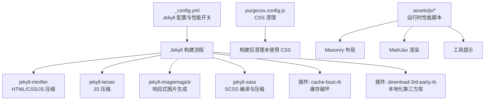
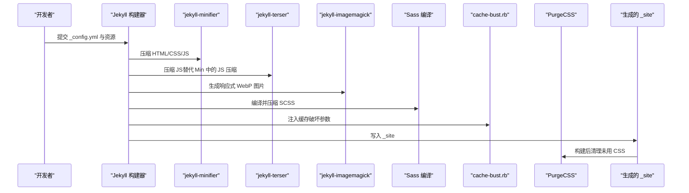
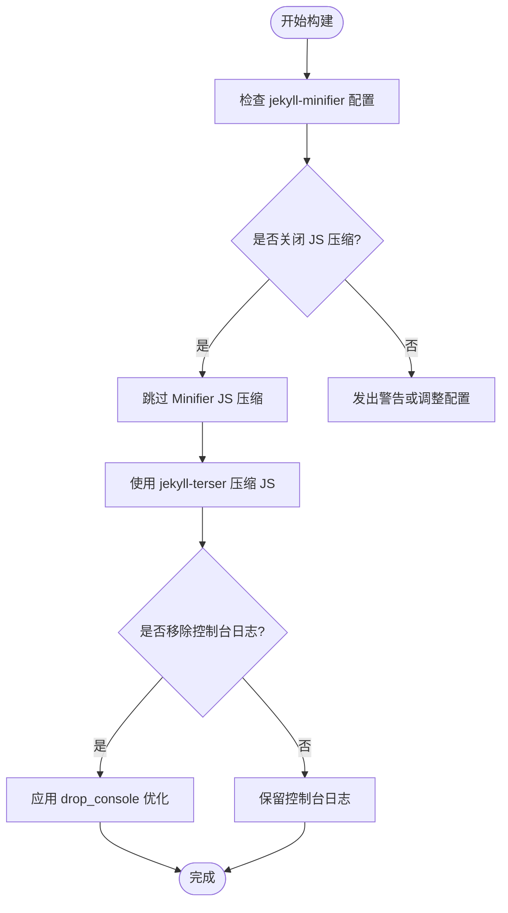
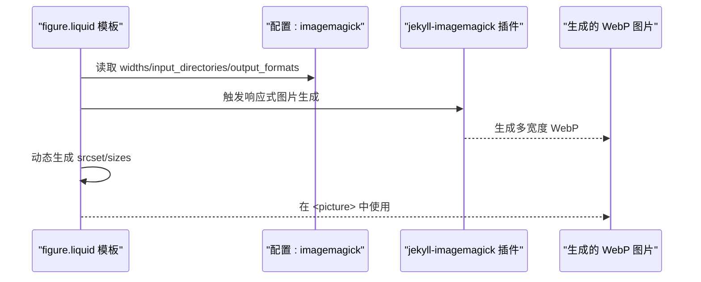
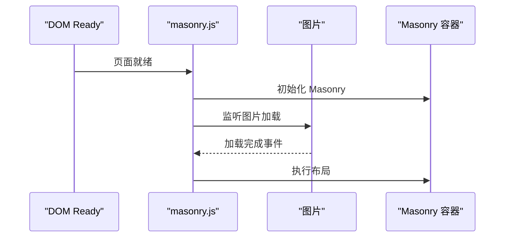
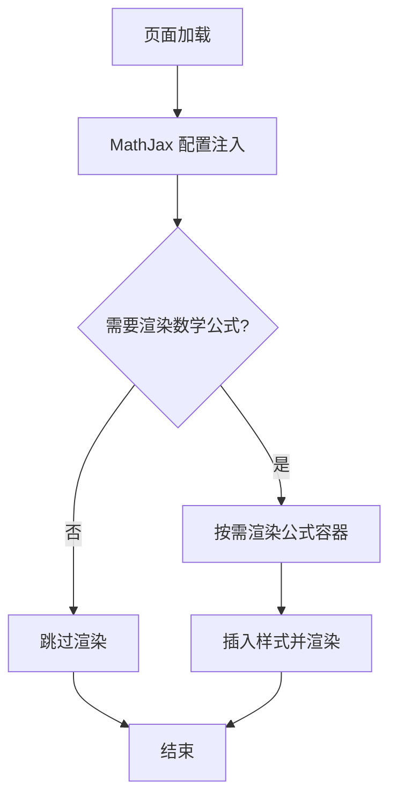
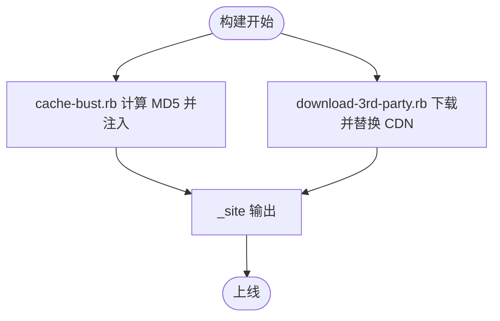
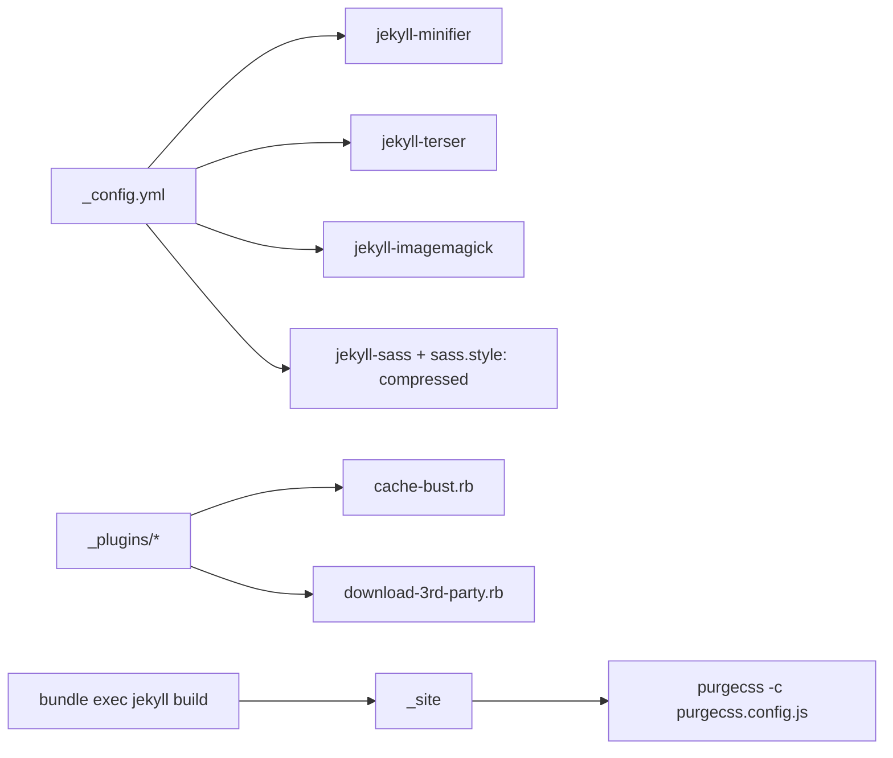

# 性能优化配置

<cite>
**本文引用的文件**
- [_config.yml](file://_config.yml)
- [Gemfile](file://Gemfile)
- [package.json](file://package.json)
- [purgecss.config.js](file://purgecss.config.js)
- [_plugins/cache-bust.rb](file://_plugins/cache-bust.rb)
- [_plugins/download-3rd-party.rb](file://_plugins/download-3rd-party.rb)
- [_includes/figure.liquid](file://_includes/figure.liquid)
- [assets/js/masonry.js](file://assets/js/masonry.js)
- [assets/js/mathjax-setup.js](file://assets/js/mathjax-setup.js)
- [assets/js/tooltips-setup.js](file://assets/js/tooltips-setup.js)
- [INSTALL.md](file://INSTALL.md)
</cite>

## 目录
1. [简介](#简介)
2. [项目结构](#项目结构)
3. [核心组件](#核心组件)
4. [架构总览](#架构总览)
5. [详细组件分析](#详细组件分析)
6. [依赖关系分析](#依赖关系分析)
7. [性能考量](#性能考量)
8. [故障排查指南](#故障排查指南)
9. [结论](#结论)
10. [附录](#附录)

## 简介
本文件聚焦于 al-folio 的性能优化配置与实践，围绕以下主题展开：Jekyll Minifier 与 Terser 的协同工作、ImageMagick 响应式图片生成、懒加载图片、CSS/JS 压缩与缓存破坏、可选功能（Masonry 布局、数学公式渲染、工具提示）对性能的影响与启用方式，并结合构建与部署流程给出可操作的优化建议与效果评估方法。

## 项目结构
本项目采用 Jekyll 静态站点生成器，通过 Ruby 插件链完成构建期优化与资源处理；前端资源位于 assets 目录，插件通过 Liquid 模板与 Jekyll 配置进行集成。关键性能相关配置集中在主配置文件中，构建期优化由插件负责，运行时性能由前端脚本与可选功能控制。

图表来源
- [_config.yml:234-245](file://_config.yml#L234-L245)
- [_config.yml:242-245](file://_config.yml#L242-L245)
- [_config.yml:351-374](file://_config.yml#L351-L374)
- [Gemfile:6-26](file://Gemfile#L6-L26)
- [purgecss.config.js:1-7](file://purgecss.config.js#L1-L7)

章节来源
- [_config.yml:200-245](file://_config.yml#L200-L245)
- [Gemfile:1-39](file://Gemfile#L1-L39)
- [purgecss.config.js:1-7](file://purgecss.config.js#L1-L7)

## 核心组件
- 构建期压缩与清理
  - Jekyll Minifier：用于压缩 HTML、CSS、JS，避免重复压缩 JS，因此关闭其 JS 压缩以交由 Terser 处理。
  - Terser：独立压缩 JS，支持移除控制台日志等优化项。
  - ImageMagick：按配置生成多宽度 WebP 响应式图片，减少带宽与存储占用。
  - PurgeCSS：在构建后清理未使用的 CSS 类，减小 CSS 体积。
  - SCSS 压缩：Sass 输出模式为压缩，降低 CSS 体积。
- 运行时性能脚本
  - Masonry：延迟布局，等待图片加载完成再排版，避免首屏抖动。
  - MathJax：按需渲染数学公式，减少不必要的计算。
  - 工具提示：Bootstrap 工具提示初始化，按需启用。
- 缓存与版本控制
  - 缓存破坏：基于内容生成 MD5 片段，实现静态资源强缓存下的版本更新。
  - 第三方库本地化：可选下载并替换 CDN 资源，减少跨域与网络波动影响。

章节来源
- [_config.yml:234-245](file://_config.yml#L234-L245)
- [_config.yml:242-245](file://_config.yml#L242-L245)
- [_config.yml:351-374](file://_config.yml#L351-L374)
- [_config.yml:227-228](file://_config.yml#L227-L228)
- [purgecss.config.js:1-7](file://purgecss.config.js#L1-L7)
- [Gemfile:6-26](file://Gemfile#L6-L26)
- [_plugins/cache-bust.rb:1-51](file://_plugins/cache-bust.rb#L1-L51)
- [_plugins/download-3rd-party.rb:191-252](file://_plugins/download-3rd-party.rb#L191-L252)

## 架构总览
下图展示从配置到构建再到运行时的关键路径，体现各性能组件的协作关系与数据流。

图表来源
- [_config.yml:234-245](file://_config.yml#L234-L245)
- [_config.yml:242-245](file://_config.yml#L242-L245)
- [_config.yml:351-374](file://_config.yml#L351-L374)
- [_config.yml:227-228](file://_config.yml#L227-L228)
- [_plugins/cache-bust.rb:41-47](file://_plugins/cache-bust.rb#L41-L47)
- [purgecss.config.js:1-7](file://purgecss.config.js#L1-L7)

## 详细组件分析

### Jekyll Minifier 与 Terser 协同
- 设计要点
  - 关闭 jekyll-minifier 的 JS 压缩，避免与 Terser 重复压缩造成体积或兼容性问题。
  - 使用 jekyll-terser 对 JS 进行压缩，支持移除控制台日志等优化。
  - 通过排除列表控制特定文件不被压缩，例如搜索模块的 JS。
- 配置位置
  - jekyll-minifier：compress_javascript 关闭，exclude 列表指定不压缩的文件。
  - terser：compress.drop_console 启用，移除开发日志。
- 影响
  - 减少重复压缩带来的体积膨胀与潜在错误，确保最终产物更精简。

图表来源
- [_config.yml:234-236](file://_config.yml#L234-L236)
- [_config.yml:242-245](file://_config.yml#L242-L245)

章节来源
- [_config.yml:234-236](file://_config.yml#L234-L236)
- [_config.yml:242-245](file://_config.yml#L242-L245)

### ImageMagick 响应式图片与懒加载
- 响应式图片
  - 启用 imagemagick，定义输入目录、输入格式与输出质量参数，生成多宽度 WebP 图片。
  - 模板根据扩展名与配置动态生成 srcset 与 sizes，实现按视口宽度选择合适尺寸。
- 懒加载
  - 全局开启 lazy_loading_images，所有图片自动添加 loading="lazy" 属性，改善首屏加载。
  - 支持在单个图片上覆盖 loading 值，以满足特殊场景需求。
- 效果
  - 显著降低传输体积与服务器带宽压力，提升移动端体验。

图表来源
- [_includes/figure.liquid:16-33](file://_includes/figure.liquid#L16-L33)
- [_includes/figure.liquid:34-79](file://_includes/figure.liquid#L34-L79)
- [_config.yml:351-374](file://_config.yml#L351-L374)

章节来源
- [_includes/figure.liquid:16-33](file://_includes/figure.liquid#L16-L33)
- [_includes/figure.liquid:34-79](file://_includes/figure.liquid#L34-L79)
- [_config.yml:351-374](file://_config.yml#L351-L374)

### Masonry 布局与图片加载
- 机制
  - 初始化 Masonry，设置间距与顺序规则。
  - 使用 imagesLoaded 监听图片加载进度，在每次图片加载完成后触发一次布局，避免首屏抖动。
- 性能收益
  - 将布局计算推迟到图片加载完成，避免频繁重排与闪烁，提升视觉稳定性。

图表来源
- [assets/js/masonry.js:1-13](file://assets/js/masonry.js#L1-L13)

章节来源
- [assets/js/masonry.js:1-13](file://assets/js/masonry.js#L1-L13)

### 数学公式渲染（MathJax）
- 机制
  - 通过全局配置定义内联数学分隔符与渲染动作，注入最小样式以匹配主题色。
  - 按需渲染，避免一次性渲染全部公式导致的阻塞。
- 性能考量
  - 合理拆分公式块，减少首屏渲染压力；必要时延迟加载或按需触发渲染。

图表来源
- [assets/js/mathjax-setup.js:1-27](file://assets/js/mathjax-setup.js#L1-L27)

章节来源
- [assets/js/mathjax-setup.js:1-27](file://assets/js/mathjax-setup.js#L1-L27)

### 工具提示（Tooltips）
- 机制
  - Bootstrap 工具提示初始化，按需启用，避免无用的 DOM 与事件绑定。
- 性能考量
  - 仅在需要时启用，减少初始化开销；避免在大量元素上同时启用。

章节来源
- [assets/js/tooltips-setup.js:1-4](file://assets/js/tooltips-setup.js#L1-L4)

### 缓存破坏与第三方库本地化
- 缓存破坏
  - 通过 MD5 混入查询参数，实现静态资源强缓存下的版本更新，避免浏览器缓存陈旧文件。
- 第三方库本地化
  - 可选下载并替换 CDN 资源，减少跨域与网络波动影响，提高稳定性与可控性。
  - 下载后自动替换 URL，考虑 baseurl，保证路径正确。

图表来源
- [_plugins/cache-bust.rb:41-47](file://_plugins/cache-bust.rb#L41-L47)
- [_plugins/download-3rd-party.rb:191-252](file://_plugins/download-3rd-party.rb#L191-L252)

章节来源
- [_plugins/cache-bust.rb:1-51](file://_plugins/cache-bust.rb#L1-L51)
- [_plugins/download-3rd-party.rb:1-254](file://_plugins/download-3rd-party.rb#L1-L254)

## 依赖关系分析
- 插件依赖
  - jekyll-minifier 与 jekyll-terser 协同工作，前者负责通用压缩，后者专注 JS。
  - jekyll-imagemagick 依赖系统 ImageMagick，需确保安装并加入 PATH。
  - jekyll-sass 与 sass.style: compressed 配置共同作用，输出压缩 CSS。
- 构建与部署
  - Netlify 等平台可通过环境变量与构建命令控制生产环境与构建行为。
  - 构建后可执行 PurgeCSS 清理未使用 CSS，进一步减小体积。

图表来源
- [_config.yml:200-245](file://_config.yml#L200-L245)
- [_config.yml:227-228](file://_config.yml#L227-L228)
- [Gemfile:6-26](file://Gemfile#L6-L26)
- [purgecss.config.js:1-7](file://purgecss.config.js#L1-L7)

章节来源
- [_config.yml:200-245](file://_config.yml#L200-L245)
- [Gemfile:1-39](file://Gemfile#L1-L39)
- [purgecss.config.js:1-7](file://purgecss.config.js#L1-L7)

## 性能考量
- 图片优化
  - 启用响应式图片与 WebP 输出，结合懒加载，显著降低首屏传输量。
  - 控制生成宽度与质量参数，权衡清晰度与体积。
- 代码压缩与清理
  - 关闭重复压缩，统一由 Terser 处理；构建后使用 PurgeCSS 清理未用 CSS。
  - 合理排除不需要压缩的文件，避免影响交互逻辑。
- 运行时脚本
  - Masonry 延迟布局，避免首屏抖动；MathJax 按需渲染；工具提示按需启用。
- 缓存策略
  - 强缓存 + 缓存破坏参数，确保资源更新及时生效；第三方库本地化提升稳定性。
- 构建与部署
  - 生产环境变量与构建命令统一，确保一致性；构建后清理 CSS，减少体积。

## 故障排查指南
- ImageMagick 未安装或不可用
  - 现象：响应式图片未生成或报错。
  - 排查：确认系统已安装 ImageMagick 并在 PATH 中，检查配置中的 input_directories 与 input_formats。
  - 参考配置
    - [imagemagick.enabled](file://_config.yml#L352)
    - [imagemagick.widths:353-356](file://_config.yml#L353-L356)
    - [imagemagick.input_directories:357-358](file://_config.yml#L357-L358)
    - [imagemagick.input_formats:359-364](file://_config.yml#L359-L364)
    - [imagemagick.output_formats.webp](file://_config.yml#L366)
- JS 压缩冲突
  - 现象：JS 体积异常或运行时报错。
  - 排查：确认 jekyll-minifier 的 compress_javascript 已关闭，且仅由 jekyll-terser 压缩。
  - 参考配置
    - [jekyll-minifier.compress_javascript](file://_config.yml#L235)
    - [terser.compress.drop_console](file://_config.yml#L244)
- Masonry 布局抖动
  - 现象：首屏出现布局变化。
  - 排查：确保图片加载完成后再布局；检查 grid 与 grid-item 的类名是否一致。
  - 参考脚本
    - [masonry.js:1-13](file://assets/js/masonry.js#L1-L13)
- 缓存命中问题
  - 现象：更新资源后浏览器仍显示旧版本。
  - 排查：确认缓存破坏参数已注入；检查 baseurl 与资源路径。
  - 参考插件
    - [cache-bust.rb:41-47](file://_plugins/cache-bust.rb#L41-L47)
- 第三方库加载失败
  - 现象：CDN 资源无法访问导致功能异常。
  - 排查：启用 third_party_libraries.download，自动下载并替换本地资源。
  - 参考配置
    - [third_party_libraries.download](file://_config.yml#L404)
    - [download-3rd-party.rb:191-252](file://_plugins/download-3rd-party.rb#L191-L252)

章节来源
- [_config.yml:351-374](file://_config.yml#L351-L374)
- [_config.yml:234-236](file://_config.yml#L234-L236)
- [_config.yml:242-245](file://_config.yml#L242-L245)
- [assets/js/masonry.js:1-13](file://assets/js/masonry.js#L1-L13)
- [_plugins/cache-bust.rb:41-47](file://_plugins/cache-bust.rb#L41-L47)
- [_plugins/download-3rd-party.rb:191-252](file://_plugins/download-3rd-party.rb#L191-L252)

## 结论
通过合理配置 jekyll-minifier 与 jekyll-terser、启用 ImageMagick 响应式图片与懒加载、配合 PurgeCSS 与缓存破坏策略，以及按需启用 Masonry、MathJax 与工具提示，可在保证功能完整性的同时显著提升页面加载速度与用户体验。建议在生产环境统一构建命令与环境变量，并定期评估 Lighthouse 报告以持续优化。

## 附录
- 构建与部署
  - Netlify 构建命令与环境变量参考：[INSTALL.md:163-198](file://INSTALL.md#L163-L198)
- 示例与效果评估
  - 使用 Lighthouse 生成桌面与移动报告，关注关键指标（如首次内容绘制、最大内容绘制、累积布局偏移等），并结合实际访问日志与性能监控进行综合评估。