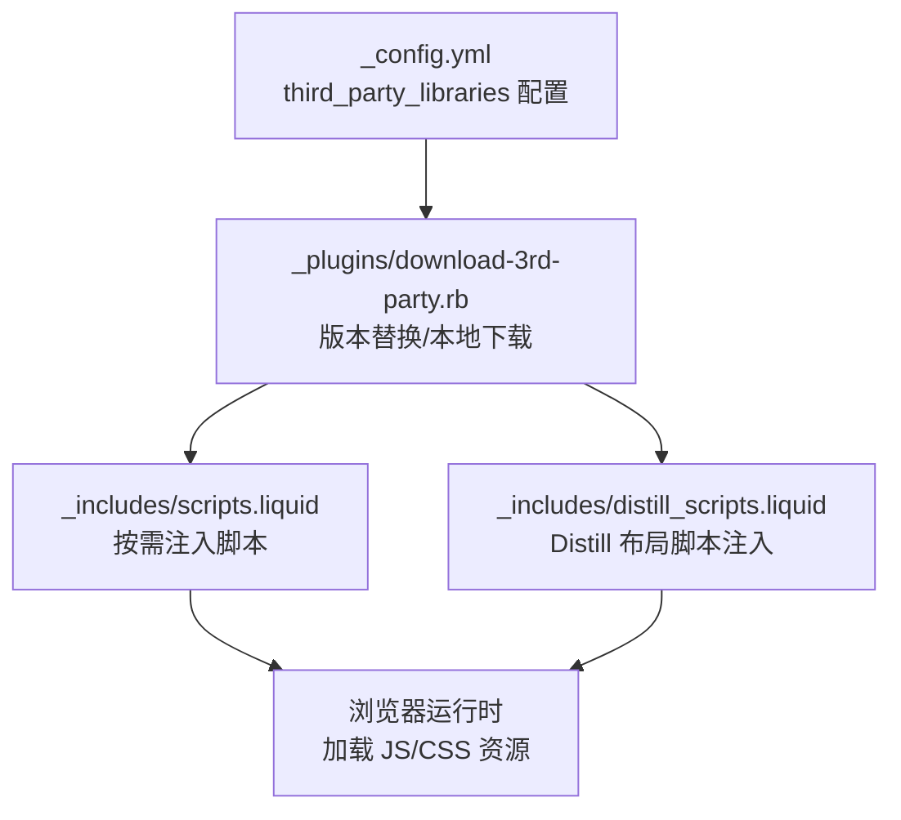
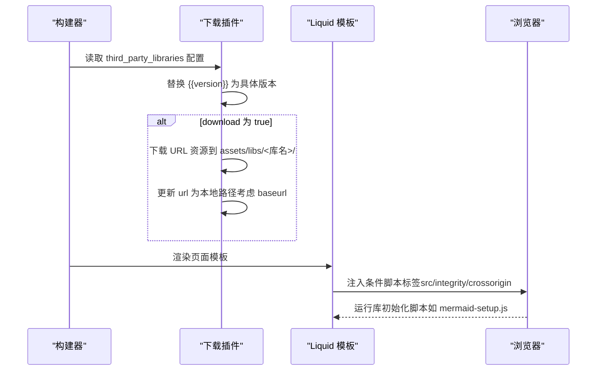
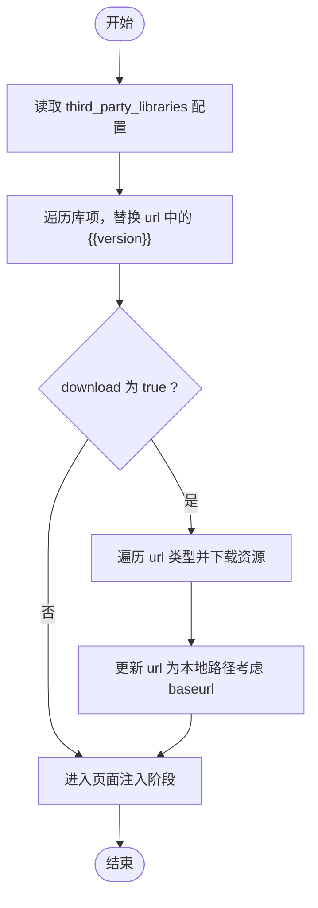
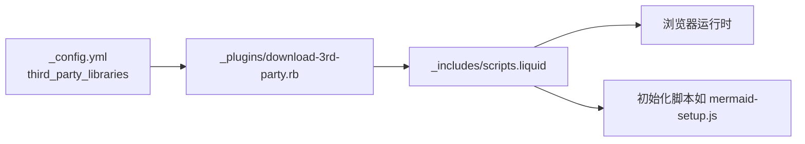

# 第三方库配置

<cite>
**本文档引用的文件**
- [_config.yml](file://_config.yml)
- [_plugins/download-3rd-party.rb](file://_plugins/download-3rd-party.rb)
- [_includes/scripts.liquid](file://_includes/scripts.liquid)
- [_includes/distill_scripts.liquid](file://_includes/distill_scripts.liquid)
- [assets/js/mermaid-setup.js](file://assets/js/mermaid-setup.js)
- [assets/js/echarts-setup.js](file://assets/js/echarts-setup.js)
- [assets/js/theme.js](file://assets/js/theme.js)
- [_posts/2024-01-26-chartjs.md](file://_posts/2024-01-26-chartjs.md)
- [_posts/2024-01-27-code-diff.md](file://_posts/2024-01-27-code-diff.md)
- [_posts/2024-01-26-geojson-map.md](file://_posts/2024-01-26-geojson-map.md)
- [_posts/2024-01-26-echarts.md](file://_posts/2024-01-26-echarts.md)
- [_posts/2024-01-27-vega-lite.md](file://_posts/2024-01-27-vega-lite.md)
- [_posts/2024-01-27-advanced-images.md](file://_posts/2024-01-27-advanced-images.md)
</cite>

## 目录
1. [简介](#简介)
2. [项目结构](#项目结构)
3. [核心组件](#核心组件)
4. [架构总览](#架构总览)
5. [详细组件分析](#详细组件分析)
6. [依赖关系分析](#依赖关系分析)
7. [性能考虑](#性能考虑)
8. [故障排除指南](#故障排除指南)
9. [结论](#结论)
10. [附录](#附录)

## 简介
本文件面向 al-folio 主题的第三方库配置，系统化说明如何在站点中声明、解析与加载第三方 JavaScript/CSS 资源，涵盖以下关键主题：
- third_party_libraries 配置块的结构与字段语义（版本号、URL、完整性哈希、本地资源映射）
- 版本占位符替换与本地下载机制
- 常用库（Chart.js、Mermaid、MathJax、Lightbox2、ECharts、Plotly、Vega 系列、Leaflet、Swiper、Photoswipe 等）的配置要点与示例路径
- 完整性哈希的作用与获取方法
- 本地下载选项与 CDN 配置的权衡
- 最佳实践与性能优化建议

## 项目结构
与第三方库配置直接相关的目录与文件：
- 根配置：_config.yml 中的 third_party_libraries 段落
- 构建期处理：_plugins/download-3rd-party.rb 插件负责版本占位符替换与可选的本地下载
- 页面脚本注入：_includes/scripts.liquid 和 _includes/distill_scripts.liquid 条件性加载所需库
- 示例页面：各功能演示文章用于展示库的实际使用场景

图表来源
- [_config.yml:400-624](file://_config.yml#L400-L624)
- [_plugins/download-3rd-party.rb:169-252](file://_plugins/download-3rd-party.rb#L169-L252)
- [_includes/scripts.liquid:1-337](file://_includes/scripts.liquid#L1-L337)
- [_includes/distill_scripts.liquid:1-93](file://_includes/distill_scripts.liquid#L1-L93)

章节来源
- [_config.yml:400-624](file://_config.yml#L400-L624)
- [_plugins/download-3rd-party.rb:1-254](file://_plugins/download-3rd-party.rb#L1-L254)
- [_includes/scripts.liquid:1-337](file://_includes/scripts.liquid#L1-L337)
- [_includes/distill_scripts.liquid:1-93](file://_includes/distill_scripts.liquid#L1-L93)

## 核心组件
- third_party_libraries 配置块
  - 字段说明
    - download: 布尔值，控制是否启用本地下载
    - 每个库项包含：
      - version: 字符串，用于替换 URL 中的 {{version}} 占位符
      - url: 字符串或字典，键通常为类型（如 js、css、fonts、images），值为 CDN 或本地 URL
      - integrity: 字符串或字典，对应 url 中各类型的子资源完整性哈希
      - local: 可选字典，用于本地下载时的资源存放路径映射（如字体、图片）
  - 示例路径
    - [third_party_libraries 配置:403-624](file://_config.yml#L403-L624)

- 下载与版本替换插件
  - 功能
    - 将 url 中的 {{version}} 替换为配置中的 version
    - 若 download 为真，则下载指定 URL 的资源到 assets/libs/<库名>/ 并更新 url 为本地路径
    - 对于字体与图片等资源，支持批量下载并修正 CSS/HTML 中的相对引用
  - 关键逻辑
    - 版本替换：[版本替换循环:169-189](file://_plugins/download-3rd-party.rb#L169-L189)
    - 本地下载：[下载主流程:191-252](file://_plugins/download-3rd-party.rb#L191-L252)
    - 字体/图片下载与 CSS 解析：[字体下载与 CSS 规则替换:12-167](file://_plugins/download-3rd-party.rb#L12-L167)

- 页面脚本注入
  - 条件加载：根据页面 front matter 中的布尔开关或布尔对象决定是否注入特定库
  - 示例
    - [Mermaid 注入:33-50](file://_includes/scripts.liquid#L33-L50)
    - [Chart.js 注入:73-82](file://_includes/scripts.liquid#L73-L82)
    - [ECharts 注入（含暗色主题）:84-99](file://_includes/scripts.liquid#L84-L99)
    - [Plotly 注入:101-110](file://_includes/scripts.liquid#L101-L110)
    - [Vega 系列注入:112-133](file://_includes/scripts.liquid#L112-L133)
    - [Leaflet 注入:63-71](file://_includes/scripts.liquid#L63-L71)
    - [图片组件库注入（Swiper、Lightbox2、Photoswipe 等）:265-310](file://_includes/scripts.liquid#L265-L310)

章节来源
- [_config.yml:400-624](file://_config.yml#L400-L624)
- [_plugins/download-3rd-party.rb:169-252](file://_plugins/download-3rd-party.rb#L169-L252)
- [_includes/scripts.liquid:33-133](file://_includes/scripts.liquid#L33-L133)

## 架构总览
下图展示了从配置到运行时加载的关键流程。

图表来源
- [_plugins/download-3rd-party.rb:169-252](file://_plugins/download-3rd-party.rb#L169-L252)
- [_includes/scripts.liquid:1-337](file://_includes/scripts.liquid#L1-L337)

## 详细组件分析

### 配置块与字段规范
- 结构要点
  - download: 控制本地下载开关
  - version: 用于替换 url 中的 {{version}} 占位符
  - url: 支持字符串或嵌套字典；键通常为类型（js、css、fonts、images、js_map 等）
  - integrity: 与 url 类型一一对应，用于 CSP 的子资源完整性校验
  - local: 仅在需要将 CDN 资源转成本地时使用，定义资源存放目录映射
- 示例路径
  - [Bootstrap Table 配置:405-412](file://_config.yml#L405-L412)
  - [Chart.js 配置:413-418](file://_config.yml#L413-L418)
  - [Mermaid 配置:532-537](file://_config.yml#L532-L537)
  - [MathJax 配置（含本地字体路径）:499-507](file://_config.yml#L499-L507)
  - [Leaflet 配置（含本地 images 映射）:483-490](file://_config.yml#L483-L490)
  - [ECharts 多类型 js（library/dark_theme）:433-442](file://_config.yml#L433-L442)

章节来源
- [_config.yml:403-624](file://_config.yml#L403-L624)

### 版本占位符替换与本地下载流程
- 流程图

图表来源
- [_plugins/download-3rd-party.rb:169-252](file://_plugins/download-3rd-party.rb#L169-L252)

章节来源
- [_plugins/download-3rd-party.rb:169-252](file://_plugins/download-3rd-party.rb#L169-L252)

### 页面脚本注入与运行时初始化
- Mermaid 与 D3
  - 注入位置：[Mermaid 注入:33-50](file://_includes/scripts.liquid#L33-L50)
  - 初始化脚本：[mermaid-setup.js:1-37](file://assets/js/mermaid-setup.js#L1-L37)
  - 主题切换：[theme.js 中的 setMermaidTheme:129-153](file://assets/js/theme.js#L129-L153)
- Chart.js
  - 注入位置：[Chart.js 注入:73-82](file://_includes/scripts.liquid#L73-L82)
  - 示例页面：[chartjs 示例:1-189](file://_posts/2024-01-26-chartjs.md#L1-L189)
- ECharts
  - 注入位置：[ECharts 注入:84-99](file://_includes/scripts.liquid#L84-L99)
  - 初始化脚本：[echarts-setup.js:1-29](file://assets/js/echarts-setup.js#L1-L29)
  - 主题切换：[theme.js 中的 setEchartsTheme:166-180](file://assets/js/theme.js#L166-L180)
- Plotly
  - 注入位置：[Plotly 注入:101-110](file://_includes/scripts.liquid#L101-L110)
  - 初始化脚本：[plotly-setup.js（片段）:37-52](file://assets/js/plotly-setup.js#L37-L52)
- Vega 系列（Vega、Vega-Lite、Vega-Embed）
  - 注入位置：[Vega 系列注入:112-133](file://_includes/scripts.liquid#L112-L133)
- Leaflet 地图
  - 注入位置：[Leaflet 注入:63-71](file://_includes/scripts.liquid#L63-L71)
  - 示例页面：[GeoJSON 地图示例:1-94](file://_posts/2024-01-26-geojson-map.md#L1-L94)
- 图片组件库（Swiper、Lightbox2、Photoswipe、Spotlight、Venobox、Img-Comparison-Slider）
  - 注入位置：[图片组件注入:265-310](file://_includes/scripts.liquid#L265-L310)
  - 示例页面：[高级图片组件示例:1-36](file://_posts/2024-01-27-advanced-images.md#L1-L36)

章节来源
- [_includes/scripts.liquid:33-133](file://_includes/scripts.liquid#L33-L133)
- [assets/js/mermaid-setup.js:1-37](file://assets/js/mermaid-setup.js#L1-L37)
- [assets/js/echarts-setup.js:1-29](file://assets/js/echarts-setup.js#L1-L29)
- [assets/js/theme.js:129-180](file://assets/js/theme.js#L129-L180)
- [_posts/2024-01-26-chartjs.md:1-189](file://_posts/2024-01-26-chartjs.md#L1-L189)
- [_posts/2024-01-26-geojson-map.md:1-94](file://_posts/2024-01-26-geojson-map.md#L1-L94)
- [_posts/2024-01-27-advanced-images.md:1-36](file://_posts/2024-01-27-advanced-images.md#L1-L36)

### 常用库配置示例与兼容性要点
- Chart.js
  - 配置示例：[Chart.js 配置:413-418](file://_config.yml#L413-L418)
  - 使用示例：[chartjs 示例页面:1-189](file://_posts/2024-01-26-chartjs.md#L1-L189)
- Mermaid
  - 配置示例：[Mermaid 配置:532-537](file://_config.yml#L532-L537)
  - 注入与初始化：[Mermaid 注入:33-50](file://_includes/scripts.liquid#L33-L50)、[mermaid-setup.js:1-37](file://assets/js/mermaid-setup.js#L1-L37)
- MathJax
  - 配置示例：[MathJax 配置:499-507](file://_config.yml#L499-L507)
  - Polyfill 配置：[Polyfill 配置:557-560](file://_config.yml#L557-L560)
- Lightbox2
  - 配置示例：[Lightbox2 配置:491-498](file://_config.yml#L491-L498)
  - 注入位置：[图片组件注入:275-282](file://_includes/scripts.liquid#L275-L282)
- ECharts
  - 配置示例：[ECharts 配置:433-442](file://_config.yml#L433-L442)
  - 使用示例：[ECharts 示例页面:1-69](file://_posts/2024-01-26-echarts.md#L1-L69)
- Plotly
  - 配置示例：[Plotly 配置:551-556](file://_config.yml#L551-L556)
  - 注入位置：[Plotly 注入:101-110](file://_includes/scripts.liquid#L101-L110)
- Vega 系列
  - 配置示例：[Vega 配置:592-599](file://_config.yml#L592-L599)、[Vega-Lite 配置:608-615](file://_config.yml#L608-L615)、[Vega-Embed 配置:600-607](file://_config.yml#L600-L607)
  - 注入位置：[Vega 系列注入:112-133](file://_includes/scripts.liquid#L112-L133)
- Leaflet
  - 配置示例：[Leaflet 配置:478-490](file://_config.yml#L478-L490)
  - 注入位置：[Leaflet 注入:63-71](file://_includes/scripts.liquid#L63-L71)
- Swiper
  - 配置示例：[Swiper 配置:576-591](file://_config.yml#L576-L591)
  - 注入位置：[图片组件注入:287-293](file://_includes/scripts.liquid#L287-L293)
- Photoswipe
  - 配置示例：[Photoswipe 配置:538-544](file://_config.yml#L538-L544)
  - 注入位置：[图片组件注入:283-285](file://_includes/scripts.liquid#L283-L285)
- Spotlight
  - 配置示例：[Spotlight 配置:569-575](file://_config.yml#L569-L575)
  - 注入位置：[图片组件注入:295-299](file://_includes/scripts.liquid#L295-L299)
- Venobox
  - 配置示例：[Venobox 配置:616-623](file://_config.yml#L616-L623)
  - 注入位置：[图片组件注入:301-309](file://_includes/scripts.liquid#L301-L309)
- Img-Comparison-Slider
  - 配置示例：[Img-Comparison-Slider 配置:462-471](file://_config.yml#L462-L471)
  - 注入位置：[图片组件注入:267-274](file://_includes/scripts.liquid#L267-L274)
- Diff2HTML
  - 配置示例：[Diff2HTML 配置:425-432](file://_config.yml#L425-L432)
  - 注入位置：[Diff2HTML 注入:52-61](file://_includes/scripts.liquid#L52-L61)
  - 使用示例：[Diff2HTML 示例页面:1-474](file://_posts/2024-01-27-code-diff.md#L1-L474)

章节来源
- [_config.yml:413-624](file://_config.yml#L413-L624)
- [_includes/scripts.liquid:33-133](file://_includes/scripts.liquid#L33-L133)
- [_posts/2024-01-26-chartjs.md:1-189](file://_posts/2024-01-26-chartjs.md#L1-L189)
- [_posts/2024-01-27-code-diff.md:1-474](file://_posts/2024-01-27-code-diff.md#L1-L474)
- [_posts/2024-01-26-geojson-map.md:1-94](file://_posts/2024-01-26-geojson-map.md#L1-L94)
- [_posts/2024-01-26-echarts.md:1-69](file://_posts/2024-01-26-echarts.md#L1-L69)
- [_posts/2024-01-27-advanced-images.md:1-36](file://_posts/2024-01-27-advanced-images.md#L1-L36)

## 依赖关系分析
- 配置到构建期处理
  - third_party_libraries → 下载插件（版本替换、本地下载）
- 构建期处理到页面注入
  - 下载插件输出（可能已转为本地 URL）→ Liquid 模板注入脚本标签
- 页面注入到运行时
  - 脚本标签 → 浏览器加载 → 初始化脚本（如 mermaid-setup.js、echarts-setup.js）

图表来源
- [_config.yml:400-624](file://_config.yml#L400-L624)
- [_plugins/download-3rd-party.rb:169-252](file://_plugins/download-3rd-party.rb#L169-L252)
- [_includes/scripts.liquid:1-337](file://_includes/scripts.liquid#L1-L337)

章节来源
- [_config.yml:400-624](file://_config.yml#L400-L624)
- [_plugins/download-3rd-party.rb:169-252](file://_plugins/download-3rd-party.rb#L169-L252)
- [_includes/scripts.liquid:1-337](file://_includes/scripts.liquid#L1-L337)

## 性能考虑
- 选择合适的加载策略
  - defer 与 async：对不阻塞渲染的库（如图表库、统计脚本）使用 defer 或 async，减少首屏阻塞
  - 条件注入：仅在需要的页面注入相应库，避免全局加载
- CDN 与本地资源
  - CDN 优点：全球加速、缓存友好、减少服务器压力
  - 本地下载优点：离线可用、完全可控、避免第三方中断风险
  - 建议：生产环境优先 CDN，结合完整性哈希；内网/离线场景启用本地下载
- 资源体积与按需加载
  - 图片组件库（Swiper、Photoswipe、Lightbox2 等）仅在使用时注入
  - 数学公式（MathJax）仅在启用数学显示时加载
- 主题切换与重绘
  - 主题切换时重新初始化或重绘图表/可视化组件，避免闪烁与重复初始化
- 缓存与指纹
  - 使用构建期缓存破坏策略（如 bust_file_cache）确保更新生效

## 故障排除指南
- 完整性哈希校验失败
  - 现象：浏览器控制台报错，脚本未加载
  - 排查：确认 integrity 值与所加载版本一致；若版本升级，请同步更新 integrity
  - 参考：[完整性哈希生成说明:400-402](file://_config.yml#L400-L402)
- 版本占位符未替换
  - 现象：URL 中仍包含 {{version}}
  - 排查：确认 third_party_libraries 中每个库都配置了 version；检查插件是否执行
  - 参考：[版本替换逻辑:169-189](file://_plugins/download-3rd-party.rb#L169-L189)
- 本地下载后路径错误
  - 现象：资源 404
  - 排查：确认 baseurl 设置；检查 assets/libs/<库名> 目录是否存在；确认插件已将 url 更新为本地路径
  - 参考：[本地下载与路径更新:191-252](file://_plugins/download-3rd-party.rb#L191-L252)
- 图表/可视化未渲染
  - 现象：图表空白或无响应
  - 排查：确认页面 front matter 开关已开启；确认初始化脚本已加载；检查浏览器控制台错误
  - 参考：[Mermaid 初始化:1-37](file://assets/js/mermaid-setup.js#L1-L37)、[ECharts 初始化:1-29](file://assets/js/echarts-setup.js#L1-L29)
- 主题切换后样式异常
  - 现象：图表/可视化主题未更新
  - 排查：确认 theme.js 中对应库的主题切换函数已调用；必要时重新初始化
  - 参考：[主题切换逻辑:129-180](file://assets/js/theme.js#L129-L180)

章节来源
- [_config.yml:400-402](file://_config.yml#L400-L402)
- [_plugins/download-3rd-party.rb:169-252](file://_plugins/download-3rd-party.rb#L169-L252)
- [assets/js/mermaid-setup.js:1-37](file://assets/js/mermaid-setup.js#L1-L37)
- [assets/js/echarts-setup.js:1-29](file://assets/js/echarts-setup.js#L1-L29)
- [assets/js/theme.js:129-180](file://assets/js/theme.js#L129-L180)

## 结论
通过 third_party_libraries 配置块与下载插件的配合，al-folio 实现了灵活的第三方库版本管理、完整性校验与本地下载能力。结合页面级条件注入与运行时初始化脚本，既能保证性能与体验，又能满足离线与安全需求。建议在生产环境中优先使用 CDN 并严格维护 integrity 值，在需要离线或受控部署时启用本地下载，并持续关注版本兼容性与主题切换的稳定性。

## 附录
- 常用库配置速查
  - Chart.js：[配置:413-418](file://_config.yml#L413-L418)、[示例页面:1-189](file://_posts/2024-01-26-chartjs.md#L1-L189)
  - Mermaid：[配置:532-537](file://_config.yml#L532-L537)、[注入:33-50](file://_includes/scripts.liquid#L33-L50)、[初始化:1-37](file://assets/js/mermaid-setup.js#L1-L37)
  - MathJax：[配置:499-507](file://_config.yml#L499-L507)、[Polyfill:557-560](file://_config.yml#L557-L560)
  - Lightbox2：[配置:491-498](file://_config.yml#L491-L498)、[注入:275-282](file://_includes/scripts.liquid#L275-L282)
  - ECharts：[配置:433-442](file://_config.yml#L433-L442)、[示例页面:1-69](file://_posts/2024-01-26-echarts.md#L1-L69)
  - Plotly：[配置:551-556](file://_config.yml#L551-L556)、[注入:101-110](file://_includes/scripts.liquid#L101-L110)
  - Vega 系列：[Vega:592-599](file://_config.yml#L592-L599)、[Vega-Lite:608-615](file://_config.yml#L608-L615)、[Vega-Embed:600-607](file://_config.yml#L600-L607)、[注入:112-133](file://_includes/scripts.liquid#L112-L133)
  - Leaflet：[配置:478-490](file://_config.yml#L478-L490)、[注入:63-71](file://_includes/scripts.liquid#L63-L71)、[示例页面:1-94](file://_posts/2024-01-26-geojson-map.md#L1-L94)
  - 图片组件库：[Swiper:576-591](file://_config.yml#L576-L591)、[Photoswipe:538-544](file://_config.yml#L538-L544)、[Spotlight:569-575](file://_config.yml#L569-L575)、[Venobox:616-623](file://_config.yml#L616-L623)、[Img-Comparison-Slider:462-471](file://_config.yml#L462-L471)、[注入:265-310](file://_includes/scripts.liquid#L265-L310)
  - Diff2HTML：[配置:425-432](file://_config.yml#L425-L432)、[注入:52-61](file://_includes/scripts.liquid#L52-L61)、[示例页面:1-474](file://_posts/2024-01-27-code-diff.md#L1-L474)