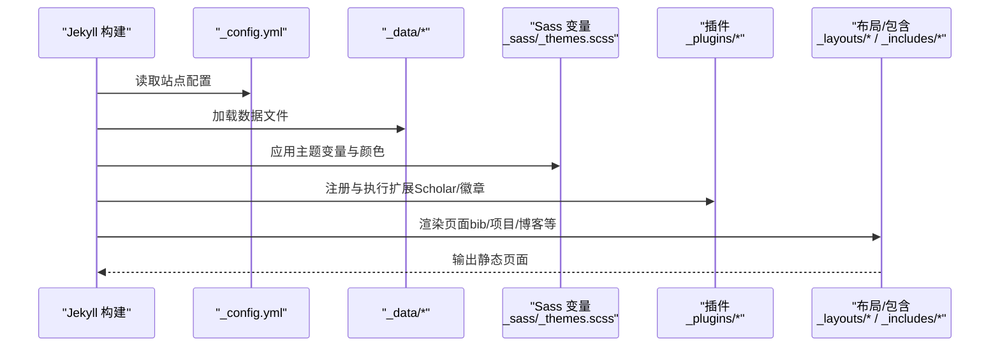
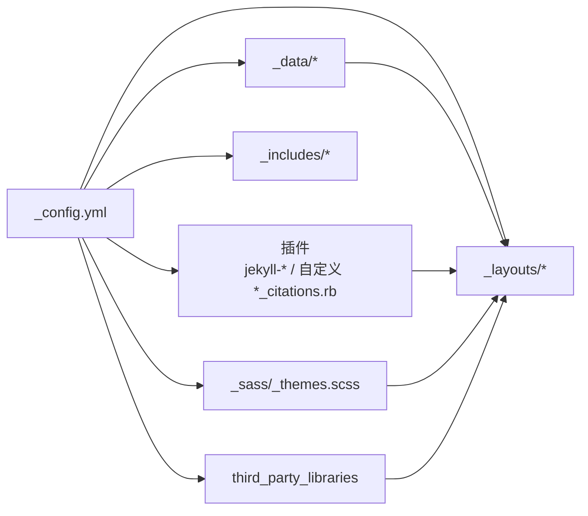

# 配置系统

<cite>
**本文档引用的文件**
- [_config.yml](file://_config.yml)
- [CUSTOMIZE.md](file://CUSTOMIZE.md)
- [INSTALL.md](file://INSTALL.md)
- [README.md](file://README.md)
- [_data/cv.yml](file://_data/cv.yml)
- [_data/socials.yml](file://_data/socials.yml)
- [_data/repositories.yml](file://_data/repositories.yml)
- [_data/coauthors.yml](file://_data/coauthors.yml)
- [_sass/_themes.scss](file://_sass/_themes.scss)
- [_plugins/google-scholar-citations.rb](file://_plugins/google-scholar-citations.rb)
- [_plugins/inspirehep-citations.rb](file://_plugins/inspirehep-citations.rb)
- [_layouts/bib.liquid](file://_layouts/bib.liquid)
- [_includes/bib_search.liquid](file://_includes/bib_search.liquid)
- [Gemfile](file://Gemfile)
</cite>

## 目录
1. [简介](#简介)
2. [项目结构](#项目结构)
3. [核心组件](#核心组件)
4. [架构总览](#架构总览)
5. [详细组件分析](#详细组件分析)
6. [依赖关系分析](#依赖关系分析)
7. [性能考量](#性能考量)
8. [故障排查指南](#故障排查指南)
9. [结论](#结论)
10. [附录](#附录)

## 简介
本文件系统性梳理 al-folio 的配置体系，围绕站点基础信息、功能开关、第三方服务集成、主题定制、学术功能（Google Scholar、出版物与引用统计）等方面，逐项解释 _config.yml 中的配置项、默认行为、使用方式与最佳实践，并提供可复用的配置模板与调试方法，帮助不同需求的用户快速完成个性化定制。

## 项目结构
al-folio 的配置主要集中在根目录的 _config.yml，同时配合 _data 下的数据文件（如 cv.yml、socials.yml、repositories.yml、coauthors.yml）、Sass 主题变量文件 _sass/_themes.scss，以及若干自定义插件（如 Google Scholar 引用计数插件）共同实现完整的站点功能。

```mermaid
graph TB
A["_config.yml<br/>主配置文件"] --> B["站点基础信息<br/>title/author/url/baseurl/lang/icon"]
A --> C["主题与外观<br/>repo_theme_* / 搜索与布局"]
A --> D["分析与SEO<br/>analytics / verification / OG/Social Meta"]
A --> E["博客与评论<br/>blog / giscus / disqus / external_sources"]
A --> F["集合与归档<br/>collections / jekyll-archives"]
A --> G["Jekyll Scholar<br/>publication管理与样式"]
A --> H["第三方库版本<br/>third_party_libraries"]
A --> I["Jekyll 设置<br/>markdown/highlighter/plugins"]
J["_data/*<br/>数据源"] --> K["cv.yml<br/>CV数据"]
J --> L["socials.yml<br/>社交链接与ID"]
J --> M["repositories.yml<br/>GitHub 用户/仓库"]
J --> N["coauthors.yml<br/>共同作者映射"]
O["_sass/_themes.scss<br/>主题色变量"] --> P["颜色方案与暗色模式"]
Q["_plugins/*<br/>扩展能力"] --> R["google-scholar-citations.rb<br/>Scholar 引用计数"]
Q --> S["inspirehep-citations.rb<br/>HEP 引用计数"]
T["_layouts/bib.liquid<br/>出版物布局"] --> U["按钮/徽章/预览图"]
V["_includes/bib_search.liquid<br/>搜索框"] --> W["过滤出版物"]
```

图表来源
- [_config.yml](file://_config.yml)
- [_data/cv.yml](file://_data/cv.yml)
- [_data/socials.yml](file://_data/socials.yml)
- [_data/repositories.yml](file://_data/repositories.yml)
- [_data/coauthors.yml](file://_data/coauthors.yml)
- [_sass/_themes.scss](file://_sass/_themes.scss)
- [_plugins/google-scholar-citations.rb](file://_plugins/google-scholar-citations.rb)
- [_plugins/inspirehep-citations.rb](file://_plugins/inspirehep-citations.rb)
- [_layouts/bib.liquid](file://_layouts/bib.liquid)
- [_includes/bib_search.liquid](file://_includes/bib_search.liquid)

章节来源
- [_config.yml](file://_config.yml)
- [CUSTOMIZE.md](file://CUSTOMIZE.md)
- [README.md](file://README.md)

## 核心组件
- 站点基础信息：标题、作者名、语言、图标、URL、子路径、页脚信息、关键词等。
- 主题与布局：导航栏/页脚固定、搜索开关、社交/博客在搜索中的显示、最大宽度等。
- 分析与SEO：Google Analytics、Pirsch、OpenPanel、Cronitor、站点验证等。
- 博客与评论：博客名称/描述、永久链接、分页、相关文章、Giscus评论、Disqus（已弃用）。
- 集合与归档：书籍、新闻、项目集合；Jekyll Archives 的年/标签/分类归档。
- Jekyll Scholar：作者姓名、样式、本地化、BibTeX源、模板、过滤器、分组排序、徽章、作者限制等。
- 第三方库版本：CDN 版本、完整性校验、下载策略。
- Jekyll 设置：Markdown 渲染、高亮、插件列表、压缩与最小化、Sass 输出风格等。
- 数据源：cv.yml、socials.yml、repositories.yml、coauthors.yml。
- 主题变量：颜色方案、暗色模式切换、提示/警告块配色等。

章节来源
- [_config.yml](file://_config.yml)
- [CUSTOMIZE.md](file://CUSTOMIZE.md)

## 架构总览
下图展示配置系统如何驱动页面渲染与功能启用：

图表来源
- [_config.yml](file://_config.yml)
- [_data/cv.yml](file://_data/cv.yml)
- [_data/socials.yml](file://_data/socials.yml)
- [_sass/_themes.scss](file://_sass/_themes.scss)
- [_plugins/google-scholar-citations.rb](file://_plugins/google-scholar-citations.rb)
- [_plugins/inspirehep-citations.rb](file://_plugins/inspirehep-citations.rb)
- [_layouts/bib.liquid](file://_layouts/bib.liquid)
- [_includes/bib_search.liquid](file://_includes/bib_search.liquid)

## 详细组件分析

### 站点基础信息与元数据
- title：网站标题（若留空则使用全名）。
- first_name/middle_name/last_name/chinese_name：作者姓名与中文名。
- contact_note/bib_note：联系说明与论文标注说明。
- description/footer_text/keywords/lang/icon：站点描述、页脚文本、关键词、语言、图标。
- url/baseurl：站点基地址与子路径（例如 /blog），用于生成正确链接。
- last_updated/impressum_path/back_to_top：页脚“最后更新”显示、法律声明链接、回到顶部按钮。

建议
- 基于 INSTALL.md 的部署说明，确保 url 与 baseurl 正确设置以避免链接错误。
- icon 支持 Emoji 或 /assets/img/ 下的图片名。

章节来源
- [_config.yml](file://_config.yml)
- [INSTALL.md](file://INSTALL.md)

### 主题与布局
- navbar_fixed/footer_fixed：导航栏/页脚是否固定。
- search_enabled/socials_in_search/posts_in_search/bib_search：控制搜索功能的开启与范围。
- max_width：内容最大宽度。
- serve_og_meta/serve_schema_org/og_image：社交媒体预览与 Schema 组织标记。
- RSS Feed：由 jekyll-feed 插件基于 title/url 自动输出。

建议
- 若需在社交平台预览，启用 serve_og_meta 并设置 og_image。
- 合理设置 max_width 以适配不同设备。

章节来源
- [_config.yml](file://_config.yml)
- [README.md](file://README.md)

### 分析与站点验证
- google_analytics/cronitor_analytics/pirsch_analytics/openpanel_analytics：分析平台 ID。
- google_site_verification/bing_site_verification：搜索引擎验证。
- 对应的 enable_* 开关用于在运行时启用相应分析或验证。

建议
- 在生产环境开启对应开关，并确保 ID 正确无误。
- 如需关闭，保持字段为空且开关为 false。

章节来源
- [_config.yml](file://_config.yml)

### 博客与评论
- blog_name/blog_description/permalink：博客标题、描述与文章永久链接格式。
- lsi：是否生成相关文章索引。
- pagination.enabled：启用分页。
- related_blog_posts：相关文章开关与最大数量。
- giscus：推荐的评论系统，需填写仓库、分类、映射、主题、语言等。
- disqus_shortname：已弃用的旧版评论系统。
- external_sources：外部 RSS/链接聚合到博客。

建议
- 推荐使用 giscus，按官方指引配置 repo/repo_id/category 等。
- external_sources 可添加 Medium 等外部源，或直接列出文章链接。

章节来源
- [_config.yml](file://_config.yml)
- [README.md](file://README.md)

### 集合与归档
- collections.books/news/projects：启用书籍、新闻、项目集合，支持输出。
- jekyll-archives：为 posts 与 books 启用年/标签/分类归档，并设置永久链接。
- display_tags/display_categories：首页展示的标签与分类。

建议
- 新增自定义集合时，同步在 jekyll-archives 中启用所需归档类型。
- 使用 keep_files 控制构建产物保留。

章节来源
- [_config.yml](file://_config.yml)

### Jekyll Scholar（学术功能）
- scholar.*：作者姓名数组、样式（默认 APA）、本地化、BibTeX 源与模板、过滤器、详情页目录与链接、查询与分组排序。
- enable_publication_badges.*：Altmetric、Dimensions、Google Scholar、InspireHEP 徽章开关。
- filtered_bibtex_keywords：内部关键字过滤列表。
- max_author_limit/more_authors_animation_delay：作者人数上限与展开动画延迟。
- enable_publication_thumbnails：是否显示出版物缩略图。

建议
- 在 BibTeX 中使用 supported fields（如 pdf、code、video、website 等）增强条目。
- 通过 scholar.last_name/first_name 识别本人作者，配合 _data/coauthors.yml 实现共同作者链接。

章节来源
- [_config.yml](file://_config.yml)
- [_data/coauthors.yml](file://_data/coauthors.yml)
- [_layouts/bib.liquid](file://_layouts/bib.liquid)

### 第三方库版本与安全
- third_party_libraries：指定库的 CDN 地址、版本与完整性哈希，支持 download 策略。
- 用途：确保资源加载速度与安全性，避免被篡改。

建议
- 优先使用 CDN 并保留完整性校验。
- 如需离线，可开启 download 并使用本地镜像。

章节来源
- [_config.yml](file://_config.yml)

### Jekyll 设置与构建优化
- markdown/highlighter/kramdown.*：Markdown 渲染与代码高亮。
- include/exclude/keep_files：控制构建包含/排除与保留文件。
- plugins：启用的 Jekyll 插件列表。
- jekyll-minifier/terser：JS/CSS 压缩与 console 去除。
- sass.style：Sass 输出风格（压缩）。

建议
- 在本地开发时禁用 JS 压缩以提升调试效率。
- 保持 keep_files 与 exclude 列表清晰，避免意外文件进入发布包。

章节来源
- [_config.yml](file://_config.yml)
- [Gemfile](file://Gemfile)

### 数据源与主题变量
- _data/cv.yml：CV 内容（JSON 方案优先，否则回退到 YAML）。
- _data/socials.yml：社交链接、Scholar ID、微信二维码等。
- _data/repositories.yml：GitHub 用户与仓库列表。
- _data/coauthors.yml：共同作者姓名变体与链接。
- _sass/_themes.scss：主题色变量、暗色模式切换、提示/警告块配色。

建议
- 删除 JSON 文件以强制使用 YAML 方案时，确保 _data/cv.yml 结构完整。
- 修改主题色时，统一在 _sass/_themes.scss 中调整变量。

章节来源
- [_data/cv.yml](file://_data/cv.yml)
- [_data/socials.yml](file://_data/socials.yml)
- [_data/repositories.yml](file://_data/repositories.yml)
- [_data/coauthors.yml](file://_data/coauthors.yml)
- [_sass/_themes.scss](file://_sass/_themes.scss)

### 扩展能力与徽章
- google-scholar-citations.rb：动态抓取 Google Scholar 引用次数，支持缓存与人性化数字格式。
- inspirehep-citations.rb：从 Inspire HEP 获取引用次数。
- _layouts/bib.liquid：渲染出版物条目，支持按钮、徽章、摘要、BibTeX、视频嵌入等。
- _includes/bib_search.liquid：过滤输入框，结合前端脚本实现按关键词筛选。

建议
- 在 BibTeX 中为条目添加 google_scholar_id/inspirehep_id 以启用对应徽章。
- 合理设置 enable_video_embedding 以控制视频按钮的行为。

章节来源
- [_plugins/google-scholar-citations.rb](file://_plugins/google-scholar-citations.rb)
- [_plugins/inspirehep-citations.rb](file://_plugins/inspirehep-citations.rb)
- [_layouts/bib.liquid](file://_layouts/bib.liquid)
- [_includes/bib_search.liquid](file://_includes/bib_search.liquid)

## 依赖关系分析
- 配置对数据源的依赖：cv/socials/repositories/coauthors 影响页面内容与链接。
- 配置对插件的依赖：jekyll-scholar、jekyll-archives-v2、jekyll-feed 等。
- 配置对 Sass 的依赖：主题变量决定颜色与暗色模式表现。
- 配置对第三方库的依赖：CDN 资源与完整性校验。

图表来源
- [_config.yml](file://_config.yml)
- [_data/cv.yml](file://_data/cv.yml)
- [_data/socials.yml](file://_data/socials.yml)
- [_data/repositories.yml](file://_data/repositories.yml)
- [_data/coauthors.yml](file://_data/coauthors.yml)
- [_sass/_themes.scss](file://_sass/_themes.scss)
- [_plugins/google-scholar-citations.rb](file://_plugins/google-scholar-citations.rb)
- [_plugins/inspirehep-citations.rb](file://_plugins/inspirehep-citations.rb)
- [_layouts/bib.liquid](file://_layouts/bib.liquid)
- [_includes/bib_search.liquid](file://_includes/bib_search.liquid)

章节来源
- [_config.yml](file://_config.yml)
- [Gemfile](file://Gemfile)

## 性能考量
- 图片懒加载：lazy_loading_images=true，减少首屏加载时间。
- 响应式 WebP：imagemagick 宽度与输出质量配置，平衡体积与清晰度。
- 压缩与最小化：jekyll-minifier 与 terser，建议在生产环境启用。
- CDN 与完整性校验：third_party_libraries 提升加载速度并保证安全。
- 搜索与归档：合理配置搜索范围与归档类型，避免过度渲染。

## 故障排查指南
- 链接错误：检查 url 与 baseurl 是否与部署分支设置一致（参考 INSTALL.md）。
- 分析未生效：确认对应 enable_* 与 ID 已正确配置。
- 发布页空白：核对 plugins 列表与 Gemfile，确保 jekyll-scholar、jekyll-archives-v2 等存在。
- 出版物徽章不显示：确认 enable_publication_badges.* 与条目中 google_scholar_id/inspirehep_id 是否匹配。
- 社交媒体预览：启用 serve_og_meta 并设置 og_image，或在页面 front matter 中覆盖。
- Docker 环境问题：参考 INSTALL.md 的 Docker 日志与容器进入步骤定位依赖缺失。

章节来源
- [INSTALL.md](file://INSTALL.md)
- [_config.yml](file://_config.yml)

## 结论
al-folio 的配置系统以 _config.yml 为核心，结合 _data 数据、Sass 变量与插件生态，实现了从站点基础信息到学术功能的全链路配置。遵循本文档的最佳实践与模板，可在保证兼容性的前提下，快速完成个性化定制与稳定部署。

## 附录

### 配置模板与示例（按场景）
- 仅启用博客与项目集合
  - 在 collections 中仅启用 news 与 projects，移除 books 或按需保留。
  - 在 jekyll-archives 中为 books 启用所需归档类型。
- 启用暗色模式与自定义主题色
  - 在 _sass/_themes.scss 中修改 --global-theme-color 与相关变量。
  - 确保 enable_darkmode=true。
- 集成 Google Scholar 与引用徽章
  - 在 _data/socials.yml 中填入 scholar_userid。
  - 在 _config.yml 中开启 enable_publication_badges.google_scholar。
  - 在 BibTeX 条目中添加 google_scholar_id。
- 添加外部博客源
  - 在 external_sources 中添加 name 与 rss_url 或 posts 列表。
- 启用社交媒体预览
  - 将 serve_og_meta 设为 true，并设置 og_image（可为绝对 URL 或相对路径）。
- 本地开发与生产差异
  - 本地：禁用 JS 压缩（jekyll-minifier.compress_javascript=false），启用详细日志。
  - 生产：开启压缩与完整性校验，确保 keep_files 与 exclude 清晰。

章节来源
- [_config.yml](file://_config.yml)
- [_data/socials.yml](file://_data/socials.yml)
- [_layouts/bib.liquid](file://_layouts/bib.liquid)
- [_includes/bib_search.liquid](file://_includes/bib_search.liquid)
- [INSTALL.md](file://INSTALL.md)