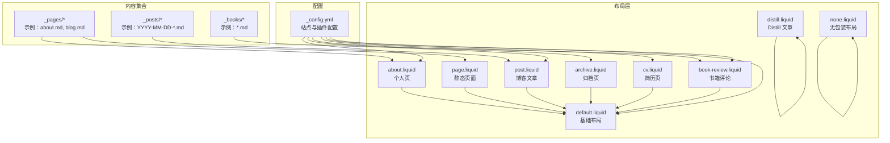
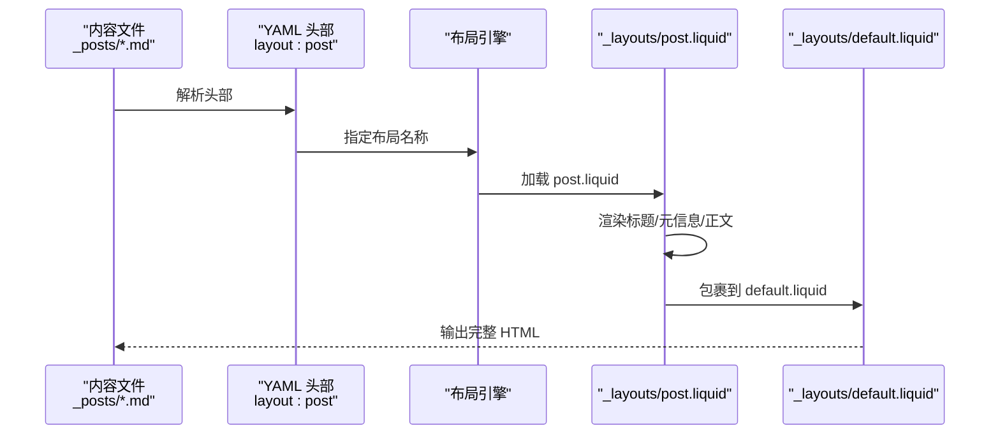
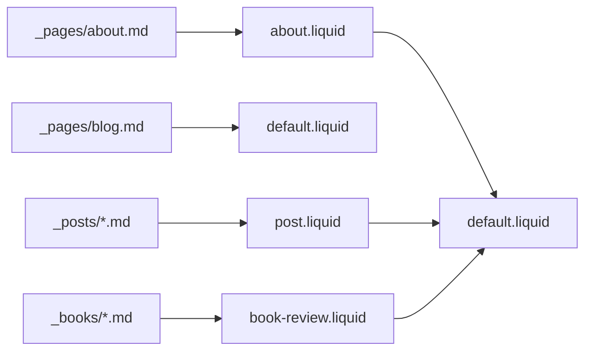
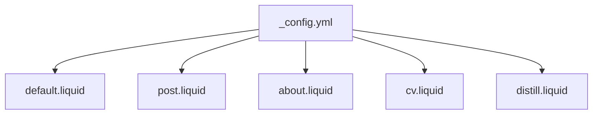

# 布局系统架构

<cite>
**本文引用的文件**
- [_layouts/default.liquid](file://_layouts/default.liquid)
- [_layouts/page.liquid](file://_layouts/page.liquid)
- [_layouts/post.liquid](file://_layouts/post.liquid)
- [_layouts/about.liquid](file://_layouts/about.liquid)
- [_layouts/archive.liquid](file://_layouts/archive.liquid)
- [_layouts/cv.liquid](file://_layouts/cv.liquid)
- [_layouts/distill.liquid](file://_layouts/distill.liquid)
- [_layouts/none.liquid](file://_layouts/none.liquid)
- [_layouts/book-review.liquid](file://_layouts/book-review.liquid)
- [_config.yml](file://_config.yml)
- [_pages/about.md](file://_pages/about.md)
- [_pages/blog.md](file://_pages/blog.md)
- [_posts/2015-03-15-formatting-and-links.md](file://_posts/2015-03-15-formatting-and-links.md)
- [_books/the_godfather.md](file://_books/the_godfather.md)
</cite>

## 目录
1. [引言](#引言)
2. [项目结构](#项目结构)
3. [核心组件](#核心组件)
4. [架构总览](#架构总览)
5. [详细组件分析](#详细组件分析)
6. [依赖分析](#依赖分析)
7. [性能考量](#性能考量)
8. [故障排查指南](#故障排查指南)
9. [结论](#结论)
10. [附录](#附录)

## 引言
本文件系统性梳理 al-folio 的 Jekyll 布局系统架构，重点解释布局继承机制、核心布局文件的职责与交互、内置变量传递（content、page、layout）以及最佳实践与性能优化建议。通过实际文件路径与代码片段来源，帮助读者快速理解并正确扩展或定制布局体系。

## 项目结构
al-folio 将布局文件集中于 _layouts 目录，并在各内容集合（如 _posts、_pages、_books）中通过 YAML 头部指定布局。配置项由 _config.yml 提供全局行为开关与默认值。

图示来源
- [_layouts/default.liquid:1-57](file://_layouts/default.liquid#L1-L57)
- [_layouts/page.liquid:1-32](file://_layouts/page.liquid#L1-L32)
- [_layouts/post.liquid:1-97](file://_layouts/post.liquid#L1-L97)
- [_layouts/about.liquid:1-83](file://_layouts/about.liquid#L1-L83)
- [_layouts/archive.liquid:1-39](file://_layouts/archive.liquid#L1-L39)
- [_layouts/cv.liquid:1-128](file://_layouts/cv.liquid#L1-L128)
- [_layouts/distill.liquid:1-114](file://_layouts/distill.liquid#L1-L114)
- [_layouts/none.liquid:1-2](file://_layouts/none.liquid#L1-L2)
- [_layouts/book-review.liquid:1-258](file://_layouts/book-review.liquid#L1-L258)
- [_config.yml:1-646](file://_config.yml#L1-L646)
- [_pages/about.md:1-37](file://_pages/about.md#L1-L37)
- [_pages/blog.md:1-197](file://_pages/blog.md#L1-L197)
- [_posts/2015-03-15-formatting-and-links.md:1-37](file://_posts/2015-03-15-formatting-and-links.md#L1-L37)
- [_books/the_godfather.md:1-28](file://_books/the_godfather.md#L1-L28)

章节来源
- [_config.yml:1-646](file://_config.yml#L1-L646)
- [_layouts/default.liquid:1-57](file://_layouts/default.liquid#L1-L57)
- [_layouts/page.liquid:1-32](file://_layouts/page.liquid#L1-L32)
- [_layouts/post.liquid:1-97](file://_layouts/post.liquid#L1-L97)
- [_layouts/about.liquid:1-83](file://_layouts/about.liquid#L1-L83)
- [_layouts/archive.liquid:1-39](file://_layouts/archive.liquid#L1-L39)
- [_layouts/cv.liquid:1-128](file://_layouts/cv.liquid#L1-L128)
- [_layouts/distill.liquid:1-114](file://_layouts/distill.liquid#L1-L114)
- [_layouts/none.liquid:1-2](file://_layouts/none.liquid#L1-L2)
- [_layouts/book-review.liquid:1-258](file://_layouts/book-review.liquid#L1-L258)
- [_pages/about.md:1-37](file://_pages/about.md#L1-L37)
- [_pages/blog.md:1-197](file://_pages/blog.md#L1-L197)
- [_posts/2015-03-15-formatting-and-links.md:1-37](file://_posts/2015-03-15-formatting-and-links.md#L1-L37)
- [_books/the_godfather.md:1-28](file://_books/the_godfather.md#L1-L28)

## 核心组件
- default.liquid：基础布局，负责统一的 HTML 结构、头部、导航、内容容器、页脚与脚本注入；支持目录侧边栏与重定向元信息。
- page.liquid：通用静态页面布局，渲染标题、描述、可选样式块与评论区。
- post.liquid：博客文章布局，渲染标题、日期、作者、标签/分类、目录、正文、引用与评论区。
- about.liquid：个人主页布局，整合头像、简介、新闻、最新文章、精选论文与社交信息。
- archive.liquid：归档列表布局，按年/标签/分类展示集合文档。
- cv.liquid：简历布局，支持本地数据与 JSON Resume 数据两种渲染模式。
- distill.liquid：Distill 文章专用布局，注入 Front Matter 并提供 Distill 模板结构。
- none.liquid：最小化布局，直接输出 content，适合无需包装的片段。
- book-review.liquid：书籍评论布局，支持封面、评分、购买链接与 Goodreads 链接等。

章节来源
- [_layouts/default.liquid:1-57](file://_layouts/default.liquid#L1-L57)
- [_layouts/page.liquid:1-32](file://_layouts/page.liquid#L1-L32)
- [_layouts/post.liquid:1-97](file://_layouts/post.liquid#L1-L97)
- [_layouts/about.liquid:1-83](file://_layouts/about.liquid#L1-L83)
- [_layouts/archive.liquid:1-39](file://_layouts/archive.liquid#L1-L39)
- [_layouts/cv.liquid:1-128](file://_layouts/cv.liquid#L1-L128)
- [_layouts/distill.liquid:1-114](file://_layouts/distill.liquid#L1-L114)
- [_layouts/none.liquid:1-2](file://_layouts/none.liquid#L1-L2)
- [_layouts/book-review.liquid:1-258](file://_layouts/book-review.liquid#L1-L258)

## 架构总览
Jekyll 在构建时根据内容文件的 YAML 头部选择布局，布局文件通过 Liquid 变量接收并组合内容。default.liquid 作为根布局，被大多数布局继承；distill.liquid 采用独立的 Distill 规范；none.liquid 则不包裹任何模板。

图示来源
- [_posts/2015-03-15-formatting-and-links.md:1-8](file://_posts/2015-03-15-formatting-and-links.md#L1-L8)
- [_layouts/post.liquid:1-97](file://_layouts/post.liquid#L1-L97)
- [_layouts/default.liquid:1-57](file://_layouts/default.liquid#L1-L57)

## 详细组件分析

### 基础布局：default.liquid
- 职责：统一 HTML 结构、引入 head/header/footer/scripts、处理页面重定向、支持侧边目录与容器布局。
- 关键点：
  - 支持 page.redirect 的自动刷新逻辑。
  - 条件渲染目录侧边栏（左右布局切换）。
  - 读取 site.navbar_fixed/site.footer_fixed 控制样式类名。
- 内置变量使用：content（子布局输出）、page（当前页面上下文）、site（全局配置）。

章节来源
- [_layouts/default.liquid:1-57](file://_layouts/default.liquid#L1-L57)
- [_config.yml:51-52](file://_config.yml#L51-L52)

### 静态页面：page.liquid
- 职责：渲染静态页面的标题、描述、可选样式块与评论区。
- 关键点：
  - 读取 page._styles 注入内联样式。
  - 条件加载 giscus 评论组件。
  - 继承自 default.liquid。

章节来源
- [_layouts/page.liquid:1-32](file://_layouts/page.liquid#L1-L32)
- [_layouts/default.liquid:1-57](file://_layouts/default.liquid#L1-L57)

### 博客文章：post.liquid
- 职责：渲染文章标题、日期、作者、标签/分类、目录、正文、引用与评论区。
- 关键点：
  - 生成年份/标签/分类的链接（针对 /blog/ 前缀）。
  - 条件渲染目录（toc.beginning）与正文。
  - 条件加载 disqus/giscus 评论组件。
  - 支持 related_publications 与 related_blog_posts。
- 内置变量使用：page.title/date/tags/categories/url 等。

章节来源
- [_layouts/post.liquid:1-97](file://_layouts/post.liquid#L1-L97)
- [_config.yml:93-102](file://_config.yml#L93-L102)

### 个人主页：about.liquid
- 职责：整合头像、简介、新闻、最新文章、精选论文与社交信息。
- 关键点：
  - 支持 page.profile.align/image/image_circular 等个性化设置。
  - 条件加载 news/latest_posts/selected_papers/social 等模块。
  - 继承自 default.liquid。

章节来源
- [_layouts/about.liquid:1-83](file://_layouts/about.liquid#L1-L83)
- [_layouts/default.liquid:1-57](file://_layouts/default.liquid#L1-L57)

### 归档页：archive.liquid
- 职责：按类型（年/标签/分类）列出集合文档。
- 关键点：
  - 根据 page.type 渲染不同标题与描述。
  - 遍历 page.documents 输出表格。

章节来源
- [_layouts/archive.liquid:1-39](file://_layouts/archive.liquid#L1-L39)

### 简历：cv.liquid
- 职责：渲染本地数据或 JSON Resume 数据的多段式简历。
- 关键点：
  - 支持 page.cv_pdf 下载链接。
  - 条件渲染 site.data.resume 或 site.data.cv。
  - 使用 resume/* 与 cv/* 子模板分发渲染。

章节来源
- [_layouts/cv.liquid:1-128](file://_layouts/cv.liquid#L1-L128)

### Distill 文章：distill.liquid
- 职责：为 Distill 文章注入 Front Matter 与模板结构。
- 关键点：
  - 注入 d-front-matter 中的 JSON 数据（标题、描述、作者、katex 等）。
  - 条件渲染目录与评论区。
  - 引入 distillpub 的 JS 资源。

章节来源
- [_layouts/distill.liquid:1-114](file://_layouts/distill.liquid#L1-L114)

### 无包装布局：none.liquid
- 职责：直接输出 content，不包裹任何模板。
- 使用场景：需要内联片段或特殊输出格式时。

章节来源
- [_layouts/none.liquid:1-2](file://_layouts/none.liquid#L1-L2)

### 书籍评论：book-review.liquid
- 职责：渲染书籍封面、评分、购买链接与 Goodreads 链接等。
- 关键点：
  - 支持 page.cover/olid/isbn 自动抓取封面。
  - 渲染 started/finished/stars 与 buy_link。
  - 条件加载 giscus 评论组件。

章节来源
- [_layouts/book-review.liquid:1-258](file://_layouts/book-review.liquid#L1-L258)

### 布局参数传递机制
- content：子布局渲染后的 HTML 片段，由 default.liquid 插入到主体容器。
- page：当前内容的上下文对象，包含 title、description、date、tags、categories、redirect、toc 等字段。
- layout：YAML 头部声明的布局名称，决定父级布局链路。
- site：全局配置对象，来自 _config.yml，影响导航固定、页脚固定、评论服务、搜索与集合等行为。

章节来源
- [_layouts/default.liquid:1-57](file://_layouts/default.liquid#L1-L57)
- [_layouts/post.liquid:1-97](file://_layouts/post.liquid#L1-L97)
- [_layouts/about.liquid:1-83](file://_layouts/about.liquid#L1-L83)
- [_config.yml:1-646](file://_config.yml#L1-L646)

### 布局继承链与示例
- 页面继承链示例：
  - about.md → about.liquid → default.liquid
  - blog.md → default.liquid
  - 2015-03-15-formatting-and-links.md → post.liquid → default.liquid
  - the_godfather.md → book-review.liquid → default.liquid

图示来源
- [_pages/about.md:1-28](file://_pages/about.md#L1-L28)
- [_pages/blog.md:1-17](file://_pages/blog.md#L1-L17)
- [_posts/2015-03-15-formatting-and-links.md:1-8](file://_posts/2015-03-15-formatting-and-links.md#L1-L8)
- [_books/the_godfather.md:1-16](file://_books/the_godfather.md#L1-L16)
- [_layouts/about.liquid:1-3](file://_layouts/about.liquid#L1-L3)
- [_layouts/default.liquid:1-3](file://_layouts/default.liquid#L1-L3)
- [_layouts/post.liquid:1-3](file://_layouts/post.liquid#L1-L3)
- [_layouts/book-review.liquid:1-3](file://_layouts/book-review.liquid#L1-L3)

## 依赖分析
- 布局对配置的依赖：
  - default.liquid 依赖 site.navbar_fixed/site.footer_fixed 控制样式类名。
  - post.liquid 依赖 site.giscus/disqus_shortname/page.giscus_comments/page.disqus_comments 控制评论区。
  - about.liquid 依赖 site.title/site.first_name/site.last_name/site.chinese_name/site.contact_note 控制头像与社交信息。
  - cv.liquid 依赖 site.data.resume/site.data.cv 与 site.jsonresume 控制数据源。
  - distill.liquid 依赖外部资源（distillpub JS）与评论配置。
- 内容集合对布局的依赖：
  - _posts 默认使用 post.liquid（可通过集合默认值覆盖）。
  - _pages/_books 可通过 YAML 头部指定布局。

图示来源
- [_config.yml:1-646](file://_config.yml#L1-L646)
- [_layouts/default.liquid:1-57](file://_layouts/default.liquid#L1-L57)
- [_layouts/post.liquid:1-97](file://_layouts/post.liquid#L1-L97)
- [_layouts/about.liquid:1-83](file://_layouts/about.liquid#L1-L83)
- [_layouts/cv.liquid:1-128](file://_layouts/cv.liquid#L1-L128)
- [_layouts/distill.liquid:1-114](file://_layouts/distill.liquid#L1-L114)

章节来源
- [_config.yml:1-646](file://_config.yml#L1-L646)
- [_layouts/default.liquid:1-57](file://_layouts/default.liquid#L1-L57)
- [_layouts/post.liquid:1-97](file://_layouts/post.liquid#L1-L97)
- [_layouts/about.liquid:1-83](file://_layouts/about.liquid#L1-L83)
- [_layouts/cv.liquid:1-128](file://_layouts/cv.liquid#L1-L128)
- [_layouts/distill.liquid:1-114](file://_layouts/distill.liquid#L1-L114)

## 性能考量
- 减少不必要的嵌套：仅在需要时使用 default.liquid，避免深层继承链导致的重复渲染。
- 合理使用条件块：仅在必要时加载评论、目录与第三方脚本，降低首屏体积。
- 图片懒加载与响应式图片：启用懒加载与响应式 WebP 图像以提升加载速度。
- 资源压缩与缓存：利用压缩与 CDN 缓存策略减少传输时间。
- 分页与归档：合理配置分页与归档，避免一次性渲染过多文档。

## 故障排查指南
- 页面未应用预期布局
  - 检查内容文件 YAML 头部是否正确声明 layout。
  - 确认布局文件存在于 _layouts 目录且命名一致。
- 评论区不显示
  - 检查 _config.yml 中 giscus/disqus_shortname 配置与页面中的 page.giscus_comments/page.disqus_comments。
- 目录侧边栏不出现
  - 检查 page.toc.sidebar 的值与 default.liquid 的条件渲染逻辑。
- Distill 文章样式异常
  - 确认 distill.liquid 引入了 distillpub 的 JS，并检查 Front Matter 数据完整性。
- 重定向循环或跳转延迟
  - 检查 page.redirect 的值与 default.liquid 的重定向逻辑。

章节来源
- [_layouts/default.liquid:5-14](file://_layouts/default.liquid#L5-L14)
- [_layouts/post.liquid:90-95](file://_layouts/post.liquid#L90-L95)
- [_config.yml:104-121](file://_config.yml#L104-L121)

## 结论
al-folio 的布局系统以 default.liquid 为核心，通过清晰的继承链与内置变量传递实现高度可复用的内容渲染。结合 _config.yml 的全局配置，开发者可以灵活定制页面外观、功能与性能表现。遵循本文的最佳实践与排错建议，可有效提升开发效率与站点质量。

## 附录
- 实际示例与修改建议
  - 在 _pages/about.md 中添加或调整 page.profile 字段以控制头像位置与样式。
  - 在 _posts/...md 中设置 page.toc.beginning 以启用文章目录。
  - 在 _books/*.md 中设置 page.buy_link 与 page.stars 以增强书籍评论展示。
  - 在 _pages/blog.md 中调整分页与标签/分类展示逻辑。

章节来源
- [_pages/about.md:7-27](file://_pages/about.md#L7-L27)
- [_posts/2015-03-15-formatting-and-links.md:1-8](file://_posts/2015-03-15-formatting-and-links.md#L1-L8)
- [_books/the_godfather.md:1-16](file://_books/the_godfather.md#L1-L16)
- [_pages/blog.md:7-16](file://_pages/blog.md#L7-L16)