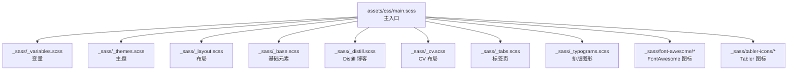
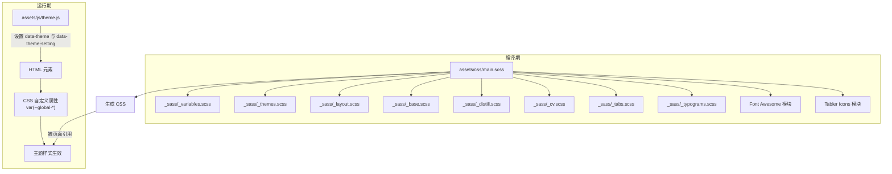
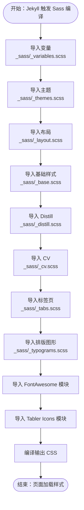
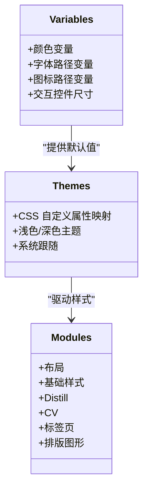
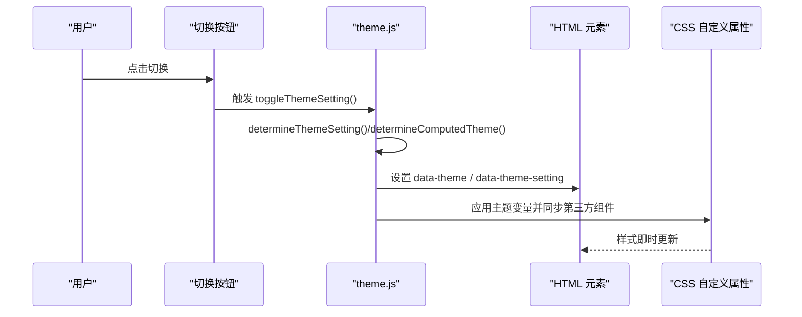
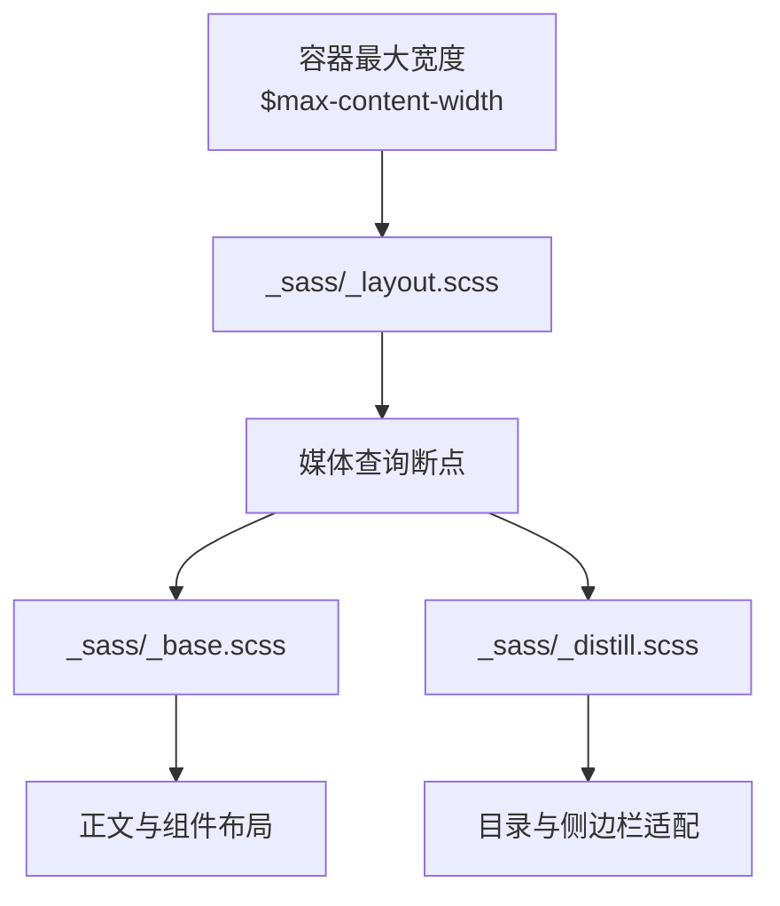
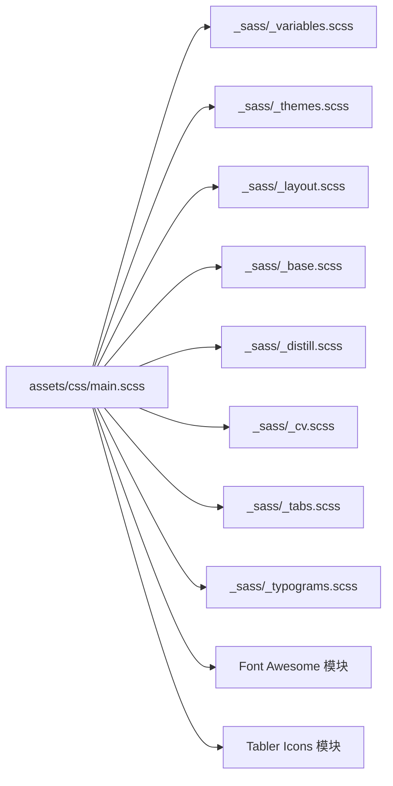

# 样式系统

<cite>
**本文引用的文件**
- [assets/css/main.scss](file://assets/css/main.scss)
- [_sass/_variables.scss](file://_sass/_variables.scss)
- [_sass/_themes.scss](file://_sass/_themes.scss)
- [_sass/_layout.scss](file://_sass/_layout.scss)
- [_sass/_base.scss](file://_sass/_base.scss)
- [_sass/_distill.scss](file://_sass/_distill.scss)
- [_sass/_cv.scss](file://_sass/_cv.scss)
- [_sass/_tabs.scss](file://_sass/_tabs.scss)
- [_sass/_typograms.scss](file://_sass/_typograms.scss)
- [_sass/font-awesome/fontawesome.scss](file://_sass/font-awesome/fontawesome.scss)
- [_sass/font-awesome/brands.scss](file://_sass/font-awesome/brands.scss)
- [_sass/font-awesome/solid.scss](file://_sass/font-awesome/solid.scss)
- [_sass/font-awesome/regular.scss](file://_sass/font-awesome/regular.scss)
- [_sass/tabler-icons/tabler-icons.scss](file://_sass/tabler-icons/tabler-icons.scss)
- [_sass/tabler-icons/tabler-icons-filled.scss](file://_sass/tabler-icons/tabler-icons-filled.scss)
- [_sass/tabler-icons/tabler-icons-outline.scss](file://_sass/tabler-icons/tabler-icons-outline.scss)
- [assets/js/theme.js](file://assets/js/theme.js)
- [_config.yml](file://_config.yml)
</cite>

## 目录
1. [简介](#简介)
2. [项目结构](#项目结构)
3. [核心组件](#核心组件)
4. [架构总览](#架构总览)
5. [详细组件分析](#详细组件分析)
6. [依赖分析](#依赖分析)
7. [性能考量](#性能考量)
8. [故障排查指南](#故障排查指南)
9. [结论](#结论)
10. [附录](#附录)

## 简介
本文件系统化梳理 al-folio 的样式体系，涵盖 SCSS 组织与导入流程、变量系统（颜色、字体、间距等）、主题系统（浅色/深色/系统跟随）的实现机制、响应式设计与断点策略、定制步骤与最佳实践、调试技巧与浏览器兼容性建议，以及扩展与自定义样式的路径。

## 项目结构
al-folio 的样式以 Jekyll 配置的 SCSS 主入口为核心，通过变量、主题、布局、基础样式、功能模块等分层组织，并在构建时由 Jekyll 调用 Sass 编译为 CSS。图标库采用 Font Awesome 与 Tabler Icons 两个集合，分别在主入口中按需导入。

**图示来源**
- [assets/css/main.scss:1-26](file://assets/css/main.scss#L1-L26)
- [_sass/_variables.scss:1-53](file://_sass/_variables.scss#L1-L53)
- [_sass/_themes.scss:1-162](file://_sass/_themes.scss#L1-L162)
- [_sass/_layout.scss:1-54](file://_sass/_layout.scss#L1-L54)
- [_sass/_base.scss:1-800](file://_sass/_base.scss#L1-L800)
- [_sass/_distill.scss:1-172](file://_sass/_distill.scss#L1-L172)
- [_sass/_cv.scss:1-221](file://_sass/_cv.scss#L1-L221)
- [_sass/_tabs.scss:1-49](file://_sass/_tabs.scss#L1-L49)
- [_sass/_typograms.scss:1-133](file://_sass/_typograms.scss#L1-L133)
- [_sass/font-awesome/fontawesome.scss](file://_sass/font-awesome/fontawesome.scss)
- [_sass/tabler-icons/tabler-icons.scss](file://_sass/tabler-icons/tabler-icons.scss)

**章节来源**
- [assets/css/main.scss:1-26](file://assets/css/main.scss#L1-L26)

## 核心组件
- 主入口与编译流程：Jekyll 通过配置项控制 Sass 输出压缩；主入口引入变量、主题、布局、基础样式与各功能模块，形成统一的 CSS 构建产物。
- 变量系统：集中于变量文件，定义颜色、字体路径、图标路径、交互控件尺寸等默认值，支持覆盖。
- 主题系统：CSS 自定义属性驱动的浅色/深色主题，配合 JS 切换逻辑与媒体查询实现“系统跟随”。
- 响应式设计：基于容器宽度与媒体查询，结合 Distill 文章内容区的断点适配。
- 功能模块：基础样式、Distill 博客、CV 布局、标签页、排版图形等，均通过变量与主题变量实现跨主题一致性。

**章节来源**
- [_sass/_variables.scss:1-53](file://_sass/_variables.scss#L1-L53)
- [_sass/_themes.scss:1-162](file://_sass/_themes.scss#L1-L162)
- [_sass/_layout.scss:1-54](file://_sass/_layout.scss#L1-L54)
- [_sass/_base.scss:1-800](file://_sass/_base.scss#L1-L800)
- [_sass/_distill.scss:1-172](file://_sass/_distill.scss#L1-L172)
- [_sass/_cv.scss:1-221](file://_sass/_cv.scss#L1-L221)
- [_sass/_tabs.scss:1-49](file://_sass/_tabs.scss#L1-L49)
- [_sass/_typograms.scss:1-133](file://_sass/_typograms.scss#L1-L133)
- [_config.yml:227-229](file://_config.yml#L227-L229)

## 架构总览
下图展示了从 SCSS 主入口到最终主题应用的端到端流程：变量定义 → 主题映射 → 样式模块 → 构建输出 → 运行时主题切换。

**图示来源**
- [assets/css/main.scss:1-26](file://assets/css/main.scss#L1-L26)
- [_sass/_variables.scss:1-53](file://_sass/_variables.scss#L1-L53)
- [_sass/_themes.scss:1-162](file://_sass/_themes.scss#L1-L162)
- [_sass/_layout.scss:1-54](file://_sass/_layout.scss#L1-L54)
- [_sass/_base.scss:1-800](file://_sass/_base.scss#L1-L800)
- [_sass/_distill.scss:1-172](file://_sass/_distill.scss#L1-L172)
- [_sass/_cv.scss:1-221](file://_sass/_cv.scss#L1-L221)
- [_sass/_tabs.scss:1-49](file://_sass/_tabs.scss#L1-L49)
- [_sass/_typograms.scss:1-133](file://_sass/_typograms.scss#L1-L133)
- [_sass/font-awesome/fontawesome.scss](file://_sass/font-awesome/fontawesome.scss)
- [_sass/tabler-icons/tabler-icons.scss](file://_sass/tabler-icons/tabler-icons.scss)
- [assets/js/theme.js:1-299](file://assets/js/theme.js#L1-L299)

## 详细组件分析

### SCSS 组织与导入流程
- 主入口负责引入变量、主题、布局、基础样式与各功能模块，并指定图标库模块。
- 变量文件集中定义颜色、字体路径、图标路径与交互控件尺寸等默认值，供主题与样式模块复用。
- 主题文件将变量映射为 CSS 自定义属性，并通过选择器状态（如 data-theme）控制不同主题下的视觉表现。
- 各功能模块（布局、基础、Distill、CV、标签页、排版图形）按职责划分，确保可维护性与可扩展性。

**图示来源**
- [assets/css/main.scss:1-26](file://assets/css/main.scss#L1-L26)
- [_sass/_variables.scss:1-53](file://_sass/_variables.scss#L1-L53)
- [_sass/_themes.scss:1-162](file://_sass/_themes.scss#L1-L162)
- [_sass/_layout.scss:1-54](file://_sass/_layout.scss#L1-L54)
- [_sass/_base.scss:1-800](file://_sass/_base.scss#L1-L800)
- [_sass/_distill.scss:1-172](file://_sass/_distill.scss#L1-L172)
- [_sass/_cv.scss:1-221](file://_sass/_cv.scss#L1-L221)
- [_sass/_tabs.scss:1-49](file://_sass/_tabs.scss#L1-L49)
- [_sass/_typograms.scss:1-133](file://_sass/_typograms.scss#L1-L133)
- [_sass/font-awesome/fontawesome.scss](file://_sass/font-awesome/fontawesome.scss)
- [_sass/tabler-icons/tabler-icons.scss](file://_sass/tabler-icons/tabler-icons.scss)

**章节来源**
- [assets/css/main.scss:1-26](file://assets/css/main.scss#L1-L26)
- [_sass/_variables.scss:1-53](file://_sass/_variables.scss#L1-L53)
- [_sass/_themes.scss:1-162](file://_sass/_themes.scss#L1-L162)
- [_sass/_layout.scss:1-54](file://_sass/_layout.scss#L1-L54)
- [_sass/_base.scss:1-800](file://_sass/_base.scss#L1-L800)
- [_sass/_distill.scss:1-172](file://_sass/_distill.scss#L1-L172)
- [_sass/_cv.scss:1-221](file://_sass/_cv.scss#L1-L221)
- [_sass/_tabs.scss:1-49](file://_sass/_tabs.scss#L1-L49)
- [_sass/_typograms.scss:1-133](file://_sass/_typograms.scss#L1-L133)

### 变量系统与覆盖方法
- 颜色变量：定义品牌色、语义色、灰阶与代码背景色等，支持通过 Sass 默认值与调整函数派生衍生色。
- 字体与图标路径：FontAwesome 与 Tabler Icons 的字体路径变量，便于在不同部署环境下正确解析资源。
- 交互控件尺寸：返回顶部按钮的尺寸、位置与层级等参数，统一管理。
- 覆盖方式：在站点配置或自定义 SCSS 中重写变量值，即可影响主题与样式模块渲染。

**图示来源**
- [_sass/_variables.scss:1-53](file://_sass/_variables.scss#L1-L53)
- [_sass/_themes.scss:1-162](file://_sass/_themes.scss#L1-L162)
- [_sass/_layout.scss:1-54](file://_sass/_layout.scss#L1-L54)
- [_sass/_base.scss:1-800](file://_sass/_base.scss#L1-L800)
- [_sass/_distill.scss:1-172](file://_sass/_distill.scss#L1-L172)
- [_sass/_cv.scss:1-221](file://_sass/_cv.scss#L1-L221)
- [_sass/_tabs.scss:1-49](file://_sass/_tabs.scss#L1-L49)
- [_sass/_typograms.scss:1-133](file://_sass/_typograms.scss#L1-L133)

**章节来源**
- [_sass/_variables.scss:1-53](file://_sass/_variables.scss#L1-L53)
- [_sass/_themes.scss:1-162](file://_sass/_themes.scss#L1-L162)

### 主题系统与切换机制
- CSS 自定义属性：主题文件将变量映射为 CSS 自定义属性，用于全局主题色、文本色、分割线色、卡片背景等。
- 运行时切换：JS 通过设置 HTML 的 data-theme 与 data-theme-setting 属性，驱动主题切换与第三方组件主题同步。
- 系统跟随：当设置为“系统”时，依据用户系统偏好自动决定浅色或深色。
- 平滑过渡：切换时添加过渡类，避免闪烁。

**图示来源**
- [assets/js/theme.js:1-299](file://assets/js/theme.js#L1-L299)
- [_sass/_themes.scss:1-162](file://_sass/_themes.scss#L1-L162)

**章节来源**
- [assets/js/theme.js:1-299](file://assets/js/theme.js#L1-L299)
- [_sass/_themes.scss:1-162](file://_sass/_themes.scss#L1-L162)

### 响应式设计与断点
- 容器宽度：通过变量控制最大内容宽度，保证在大屏与小屏下的阅读体验。
- 媒体查询：在基础样式与 Distill 模块中使用断点，适配不同屏幕尺寸下的布局与导航行为。
- 内容区适配：Distill 文章目录在窄屏下折叠为块级显示，提升可读性。

**图示来源**
- [_sass/_layout.scss:1-54](file://_sass/_layout.scss#L1-L54)
- [_sass/_base.scss:1-800](file://_sass/_base.scss#L1-L800)
- [_sass/_distill.scss:1-172](file://_sass/_distill.scss#L1-L172)

**章节来源**
- [_sass/_layout.scss:1-54](file://_sass/_layout.scss#L1-L54)
- [_sass/_base.scss:1-800](file://_sass/_base.scss#L1-L800)
- [_sass/_distill.scss:1-172](file://_sass/_distill.scss#L1-L172)

### 样式定制步骤与最佳实践
- 覆盖变量：在自定义 SCSS 或站点配置中调整颜色、尺寸等变量，确保在主入口导入前生效。
- 新增主题变量：在主题文件中新增 CSS 自定义属性，保持命名规范与语义清晰。
- 扩展模块：在对应模块文件中增加选择器与规则，优先使用变量与主题变量，避免硬编码颜色与尺寸。
- 组件化：将通用样式抽象为可复用的类名与变量，减少重复与维护成本。
- 测试与回退：在浅色/深色/系统三种模式下验证效果，必要时提供降级方案。

**章节来源**
- [_sass/_variables.scss:1-53](file://_sass/_variables.scss#L1-L53)
- [_sass/_themes.scss:1-162](file://_sass/_themes.scss#L1-L162)
- [_sass/_base.scss:1-800](file://_sass/_base.scss#L1-L800)

### 样式调试技巧与浏览器兼容性
- 调试技巧：利用浏览器开发者工具检查 CSS 自定义属性的实际值；通过 data-theme 与 data-theme-setting 快速定位主题相关规则；观察第三方组件的主题同步是否生效。
- 兼容性注意：主题切换依赖 CSS 自定义属性与现代浏览器特性；若需兼容旧环境，可在构建阶段保留回退样式或提供降级提示。
- 性能优化：启用 Jekyll 的压缩输出；避免在主题切换时触发昂贵的重排重绘；合理拆分模块，减少不必要的样式计算。

**章节来源**
- [assets/js/theme.js:1-299](file://assets/js/theme.js#L1-L299)
- [_config.yml:227-229](file://_config.yml#L227-L229)

## 依赖分析
- 主入口对变量、主题、布局、基础样式与功能模块存在直接依赖。
- 主题文件依赖变量文件提供的默认值。
- 功能模块广泛使用变量与主题变量，形成强耦合但低侵入的样式体系。
- 图标库模块独立于主题系统，通过路径变量与字体资源进行解耦。

**图示来源**
- [assets/css/main.scss:1-26](file://assets/css/main.scss#L1-L26)
- [_sass/_variables.scss:1-53](file://_sass/_variables.scss#L1-L53)
- [_sass/_themes.scss:1-162](file://_sass/_themes.scss#L1-L162)
- [_sass/_layout.scss:1-54](file://_sass/_layout.scss#L1-L54)
- [_sass/_base.scss:1-800](file://_sass/_base.scss#L1-L800)
- [_sass/_distill.scss:1-172](file://_sass/_distill.scss#L1-L172)
- [_sass/_cv.scss:1-221](file://_sass/_cv.scss#L1-L221)
- [_sass/_tabs.scss:1-49](file://_sass/_tabs.scss#L1-L49)
- [_sass/_typograms.scss:1-133](file://_sass/_typograms.scss#L1-L133)
- [_sass/font-awesome/fontawesome.scss](file://_sass/font-awesome/fontawesome.scss)
- [_sass/tabler-icons/tabler-icons.scss](file://_sass/tabler-icons/tabler-icons.scss)

**章节来源**
- [assets/css/main.scss:1-26](file://assets/css/main.scss#L1-L26)

## 性能考量
- 构建优化：启用压缩输出，减小 CSS 体积，提升加载速度。
- 运行时优化：主题切换仅操作少量属性与类名，避免大规模重排；第三方组件主题同步采用最小化更新策略。
- 资源加载：图标字体路径变量集中管理，便于缓存与 CDN 加速。

**章节来源**
- [_config.yml:227-229](file://_config.yml#L227-L229)
- [assets/js/theme.js:1-299](file://assets/js/theme.js#L1-L299)

## 故障排查指南
- 主题未生效：检查 data-theme 与 data-theme-setting 是否正确设置；确认 CSS 自定义属性是否被覆盖。
- 图标不显示：核对图标路径变量与实际资源路径；确保字体文件可访问。
- 第三方组件主题异常：确认对应组件的主题同步函数已调用且参数正确。
- 响应式异常：检查断点与媒体查询条件；验证容器宽度变量是否符合预期。

**章节来源**
- [assets/js/theme.js:1-299](file://assets/js/theme.js#L1-L299)
- [_sass/_themes.scss:1-162](file://_sass/_themes.scss#L1-L162)
- [_sass/_layout.scss:1-54](file://_sass/_layout.scss#L1-L54)

## 结论
al-folio 的样式系统以变量与主题为核心，通过模块化组织与 CSS 自定义属性实现跨主题一致性与可维护性。主入口清晰地串联变量、主题与功能模块，运行时通过 JS 实现平滑的主题切换与第三方组件同步。遵循本文的定制步骤与最佳实践，可高效扩展与优化样式体系。

## 附录
- 参考配置：Jekyll 的 Sass 输出压缩选项位于站点配置中，确保构建产物体积可控。
- 图标库：FontAwesome 与 Tabler Icons 作为外部模块引入，路径变量集中管理，便于替换与升级。

**章节来源**
- [_config.yml:227-229](file://_config.yml#L227-L229)
- [_sass/font-awesome/fontawesome.scss](file://_sass/font-awesome/fontawesome.scss)
- [_sass/tabler-icons/tabler-icons.scss](file://_sass/tabler-icons/tabler-icons.scss)