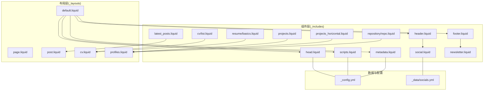
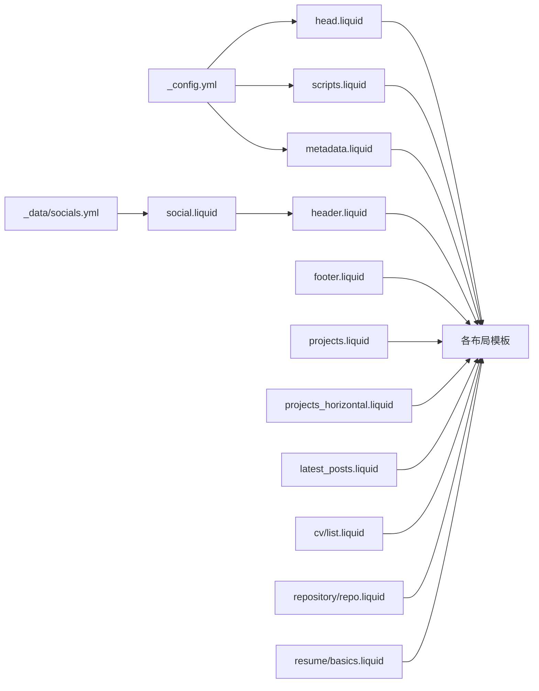

# 组件系统

<cite>
**本文引用的文件**
- [_includes/head.liquid](file://_includes/head.liquid)
- [_includes/metadata.liquid](file://_includes/metadata.liquid)
- [_includes/header.liquid](file://_includes/header.liquid)
- [_includes/footer.liquid](file://_includes/footer.liquid)
- [_includes/scripts.liquid](file://_includes/scripts.liquid)
- [_includes/social.liquid](file://_includes/social.liquid)
- [_includes/newsletter.liquid](file://_includes/newsletter.liquid)
- [_includes/latest_posts.liquid](file://_includes/latest_posts.liquid)
- [_includes/projects.liquid](file://_includes/projects.liquid)
- [_includes/projects_horizontal.liquid](file://_includes/projects_horizontal.liquid)
- [_includes/cv/list.liquid](file://_includes/cv/list.liquid)
- [_includes/repository/repo.liquid](file://_includes/repository/repo.liquid)
- [_includes/resume/basics.liquid](file://_includes/resume/basics.liquid)
- [_data/socials.yml](file://_data/socials.yml)
- [_config.yml](file://_config.yml)
</cite>

## 目录
1. [简介](#简介)
2. [项目结构](#项目结构)
3. [核心组件](#核心组件)
4. [架构总览](#架构总览)
5. [组件详解](#组件详解)
6. [依赖关系分析](#依赖关系分析)
7. [性能考量](#性能考量)
8. [故障排查指南](#故障排查指南)
9. [结论](#结论)
10. [附录](#附录)

## 简介
本文件面向 Jekyll 开发者与内容作者，系统性梳理并讲解站点的“组件系统”。组件以 Liquid 模板形式组织在 _includes 目录下，覆盖页面头部元信息、导航栏、页脚、脚本加载、社交链接、最新文章、项目卡片、简历基础信息、仓库展示等。文档从“功能职责—参数传递—配置方法—可复用模式—最佳实践—性能优化”六个维度展开，并给出组件组合与嵌套建议及常见问题排查思路。

## 项目结构
- 组件集中于 _includes 目录，按功能域分层：头尾与元信息（head、metadata）、导航与页脚（header、footer）、脚本与第三方库（scripts）、社交与订阅（social、newsletter）、内容列表（latest_posts）、项目卡片（projects、projects_horizontal）、CV/Resume 子组件（cv、repository、resume）。
- 配置与数据来源：
  - 全局配置：_config.yml，控制站点主题、第三方库版本、统计与验证开关、集合与插件等。
  - 社交链接数据：_data/socials.yml，驱动社交图标组件渲染。
- 布局系统：_layouts 下的页面模板通过 include 调用上述组件，实现统一风格与可复用逻辑。



图表来源
- [_includes/head.liquid](file://_includes/head.liquid)
- [_includes/metadata.liquid](file://_includes/metadata.liquid)
- [_includes/header.liquid](file://_includes/header.liquid)
- [_includes/footer.liquid](file://_includes/footer.liquid)
- [_includes/scripts.liquid](file://_includes/scripts.liquid)
- [_includes/social.liquid](file://_includes/social.liquid)
- [_includes/newsletter.liquid](file://_includes/newsletter.liquid)
- [_includes/latest_posts.liquid](file://_includes/latest_posts.liquid)
- [_includes/projects.liquid](file://_includes/projects.liquid)
- [_includes/projects_horizontal.liquid](file://_includes/projects_horizontal.liquid)
- [_includes/cv/list.liquid](file://_includes/cv/list.liquid)
- [_includes/repository/repo.liquid](file://_includes/repository/repo.liquid)
- [_includes/resume/basics.liquid](file://_includes/resume/basics.liquid)
- [_data/socials.yml](file://_data/socials.yml)
- [_config.yml](file://_config.yml)

章节来源
- [_config.yml](file://_config.yml)
- [_data/socials.yml](file://_data/socials.yml)

## 核心组件
- 头部与元信息
  - head.liquid：负责注入样式表、图标、第三方库样式、暗色主题支持、按需加载的页面级资源（如地图、代码对比、图片库等）。
  - metadata.liquid：生成标准 meta、OpenGraph、Schema.org 结构化数据，支持站点验证标签与权限策略声明。
- 导航与页脚
  - header.liquid：动态构建导航菜单（含下拉、博客入口、搜索按钮、主题切换），根据页面上下文高亮当前项。
  - footer.liquid：输出版权、站点名称、更新时间、法律链接；支持固定或粘性底部，以及订阅模块插入。
- 脚本与第三方库
  - scripts.liquid：按需加载 jQuery、Bootstrap/MDB、图表库（Chart.js/ECharts/Plotly/Vega）、Mermaid、数学公式（MathJax/Pseudocode）、搜索与分析脚本、图片库与交互脚本等。
- 社交与订阅
  - social.liquid：基于 _data/socials.yml 渲染社交图标，支持多种平台与自定义图标。
  - newsletter.liquid：订阅表单容器，支持居左/居右/居中布局与状态反馈。
- 内容组件
  - latest_posts.liquid：按配置限制数量与滚动行为，渲染最新文章列表。
  - projects.liquid / projects_horizontal.liquid：项目卡片组件，支持缩略图、跳转、GitHub 仓库链接与星标展示。
- 数据驱动子组件
  - cv/list.liquid：通用无序列表渲染，用于 CV 的条目列表。
  - repository/repo.liquid：调用外部服务渲染仓库卡片，支持多语言与明暗主题。
  - resume/basics.liquid：简历基础信息表格，自动跳过空值与指定字段，支持超链接与电话邮件点击。

章节来源
- [_includes/head.liquid](file://_includes/head.liquid)
- [_includes/metadata.liquid](file://_includes/metadata.liquid)
- [_includes/header.liquid](file://_includes/header.liquid)
- [_includes/footer.liquid](file://_includes/footer.liquid)
- [_includes/scripts.liquid](file://_includes/scripts.liquid)
- [_includes/social.liquid](file://_includes/social.liquid)
- [_includes/newsletter.liquid](file://_includes/newsletter.liquid)
- [_includes/latest_posts.liquid](file://_includes/latest_posts.liquid)
- [_includes/projects.liquid](file://_includes/projects.liquid)
- [_includes/projects_horizontal.liquid](file://_includes/projects_horizontal.liquid)
- [_includes/cv/list.liquid](file://_includes/cv/list.liquid)
- [_includes/repository/repo.liquid](file://_includes/repository/repo.liquid)
- [_includes/resume/basics.liquid](file://_includes/resume/basics.liquid)

## 架构总览
组件与布局的协作流程如下：布局模板在合适位置 include 对应组件；组件内部通过 Liquid 循环、条件判断与数据访问（如 _config.yml、_data/socials.yml）完成渲染；页面上下文变量（如 page.*、site.*）影响组件行为（例如是否启用暗色主题、是否显示侧边目录、是否加载特定第三方库）。

```mermaid
sequenceDiagram
participant L as "布局模板"
participant H as "head.liquid"
participant M as "metadata.liquid"
participant HDR as "header.liquid"
participant F as "footer.liquid"
participant S as "scripts.liquid"
L->>H : 引入头部样式与资源
H->>M : 包含元信息生成
L->>HDR : 引入导航栏
L->>F : 引入页脚
L->>S : 引入脚本与第三方库
Note over L,HDR,F,S : 组件根据 page/site 上下文决定加载与渲染
```

图表来源
- [_includes/head.liquid](file://_includes/head.liquid)
- [_includes/metadata.liquid](file://_includes/metadata.liquid)
- [_includes/header.liquid](file://_includes/header.liquid)
- [_includes/footer.liquid](file://_includes/footer.liquid)
- [_includes/scripts.liquid](file://_includes/scripts.liquid)

## 组件详解

### 头部与元信息组件
- 功能要点
  - 注入样式与图标：Bootstrap、MDB、字体与图标库、代码高亮主题、可选的暗色主题样式与初始化脚本。
  - 条件加载：仅在 page.* 指示需要时加载相应第三方库（如地图、代码对比、图片库、Mermaid、数学公式等）。
  - 元信息：由 metadata.liquid 生成标准 meta、OpenGraph、Schema.org 结构化数据，支持站点验证与隐私策略。
- 参数与配置
  - 通过 _config.yml 的 third_party_libraries 字段统一管理第三方库的 URL、完整性校验与版本；通过 site.enable_* 与 page.* 控制加载。
  - metadata.liquid 使用 page.description、page.keywords、page.og_image、site.og_image、site.serve_og_meta、site.serve_schema_org 等上下文变量。
- 可复用模式
  - 将页面级开关（如 page.toc.sidebar、page.map、page.code_diff）作为“按需加载”的统一入口，避免不必要的资源请求。
- 最佳实践
  - 在布局中固定顺序 include head 与 metadata，确保 SEO 与社交预览优先。
  - 对暗色主题与高亮主题采用 id 与媒体查询配合，保证切换一致性。

章节来源
- [_includes/head.liquid](file://_includes/head.liquid)
- [_includes/metadata.liquid](file://_includes/metadata.liquid)
- [_config.yml](file://_config.yml)

### 导航栏组件
- 功能要点
  - 动态构建导航菜单：遍历 site.pages，按 nav_order 排序，支持下拉菜单与外链；首页标题与社交图标联动。
  - 交互元素：搜索按钮、主题切换按钮、滚动进度条。
- 参数与配置
  - site.navbar_fixed 控制导航栏固定/粘性；site.enable_navbar_social 控制首页是否显示社交图标；site.search_enabled 与 site.enable_darkmode 影响菜单项可见性。
  - 页面上下文：page.permalink、page.url 用于高亮当前项；page.title 用于标题回填。
- 可复用模式
  - 使用 for 循环与条件分支实现“下拉菜单 + 外链 + 当前页高亮”的统一逻辑。
- 最佳实践
  - 将导航项的排序与可见性通过 front matter 与全局配置协同控制，减少重复维护成本。

章节来源
- [_includes/header.liquid](file://_includes/header.liquid)
- [_config.yml](file://_config.yml)

### 页脚组件
- 功能要点
  - 输出版权、站点名称、可选的法律链接与最后更新时间；支持固定底部与粘性底部两种布局。
  - 插入订阅模块：当 site.newsletter.enabled 为真时，插入 newsletter.liquid。
- 参数与配置
  - site.footer_fixed 控制底部类型；site.impressum_path 控制法律链接；site.last_updated 控制更新时间显示。
  - site.newsletter.enabled 控制订阅模块是否渲染。
- 可复用模式
  - 通过 include 将订阅模块与页脚主体解耦，便于按需启用。

章节来源
- [_includes/footer.liquid](file://_includes/footer.liquid)
- [_includes/newsletter.liquid](file://_includes/newsletter.liquid)
- [_config.yml](file://_config.yml)

### 脚本与第三方库组件
- 功能要点
  - 按需加载：根据 page.chart、page.map、page.mermaid、page.code_diff、page.toc.sidebar、page.pretty_table、page.images.*、page.tabs、page.tikzjax 等开关选择性引入对应脚本。
  - 分析与统计：Google Analytics、Cronitor、Pirsch、OpenPanel 等可选接入。
  - 交互增强：MathJax/Pseudocode、Medium Zoom、Back-to-top、搜索框等。
- 参数与配置
  - third_party_libraries 中的 url、integrity、version 管理资源来源与安全校验；site.enable_* 控制功能开关。
- 可复用模式
  - 将“按需加载 + defer + bust 缓存”模式标准化，降低重复代码与错误风险。
- 最佳实践
  - 将大体积库（如图表库、地图库）与页面强相关联，避免全局加载；对搜索与分析脚本采用异步加载。

章节来源
- [_includes/scripts.liquid](file://_includes/scripts.liquid)
- [_config.yml](file://_config.yml)

### 社交链接组件
- 功能要点
  - 基于 _data/socials.yml 渲染社交图标，支持平台特有链接与通用自定义图标（SVG 或图片）。
  - 支持 WeChat 二维码弹窗与电话/邮件/外链等交互。
- 参数与配置
  - 社交键名遵循约定（如 github_username、linkedin_username、email 等），未设置的键会被忽略。
  - 自定义社交项通过 custom_social 提供 logo、title、url。
- 可复用模式
  - 通过 for 循环与 case 分支实现“平台映射 + 自定义兜底”的统一渲染逻辑。

章节来源
- [_includes/social.liquid](file://_includes/social.liquid)
- [_data/socials.yml](file://_data/socials.yml)

### 订阅模块组件
- 功能要点
  - 表单容器：支持 center/left/right 三种对齐方式；包含成功/失败/加载中状态提示与返回按钮。
  - 与全局配置联动：site.newsletter.enabled 控制是否启用；表单 action 指向 loops 平台 endpoint。
- 参数与配置
  - include.center/left/right 控制布局；表单字段 name 与占位符固定；noscript 隐藏表单以提升可用性。
- 可复用模式
  - 将表单状态与布局参数抽象为 include 参数，便于在不同位置复用。

章节来源
- [_includes/newsletter.liquid](file://_includes/newsletter.liquid)
- [_config.yml](file://_config.yml)

### 最新文章组件
- 功能要点
  - 渲染 site.posts 列表，支持 limit 限制与可选滚动容器；根据 redirect 类型处理内链/外链。
- 参数与配置
  - page.latest_posts.limit 控制显示数量；page.latest_posts.scrollable 控制高度上限。
- 可复用模式
  - 通过 for 循环与条件分支实现“日期 + 标题 + 外链标识”的统一展示。

章节来源
- [_includes/latest_posts.liquid](file://_includes/latest_posts.liquid)

### 项目卡片组件
- 功能要点
  - 垂直卡片（projects.liquid）与横向卡片（projects_horizontal.liquid）两类布局，均支持缩略图、标题、描述、GitHub 链接与星标展示。
  - 图片懒加载与响应式尺寸通过 include figure.liquid 传参控制。
- 参数与配置
  - 传入变量 project（包含 img、url、redirect、github、github_stars 等）。
- 可复用模式
  - 将“缩略图 + GitHub 星标 + 跳转”封装为子组件，便于在不同布局中复用。

章节来源
- [_includes/projects.liquid](file://_includes/projects.liquid)
- [_includes/projects_horizontal.liquid](file://_includes/projects_horizontal.liquid)

### 数据驱动子组件
- CV 列表
  - 通用无序列表渲染，适合 CV 的条目列表展示。
- 仓库展示
  - 通过外部服务渲染仓库卡片，支持明暗主题、本地化语言与最大描述行数控制。
- 简历基础信息
  - 自动跳过空值与指定字段，支持超链接与电话/邮件点击。

章节来源
- [_includes/cv/list.liquid](file://_includes/cv/list.liquid)
- [_includes/repository/repo.liquid](file://_includes/repository/repo.liquid)
- [_includes/resume/basics.liquid](file://_includes/resume/basics.liquid)

## 依赖关系分析
- 组件间依赖
  - head.liquid 依赖 metadata.liquid 生成 SEO 元信息；header.liquid 依赖 social.liquid 渲染社交图标；footer.liquid 可能依赖 newsletter.liquid。
  - scripts.liquid 与 head.liquid 共同决定页面脚本加载策略，二者与 _config.yml 的 third_party_libraries 与 site.enable_* 强关联。
- 数据依赖
  - social.liquid 依赖 _data/socials.yml；repository/repo.liquid 依赖 site.lang 与 site.data.repositories.*；resume/basics.liquid 依赖外部 JSON 数据（通过 jekyll_get_json 插件加载）。
- 布局依赖
  - 各布局模板通过 include 组合上述组件，形成统一页面骨架。



图表来源
- [_config.yml](file://_config.yml)
- [_data/socials.yml](file://_data/socials.yml)
- [_includes/head.liquid](file://_includes/head.liquid)
- [_includes/metadata.liquid](file://_includes/metadata.liquid)
- [_includes/header.liquid](file://_includes/header.liquid)
- [_includes/footer.liquid](file://_includes/footer.liquid)
- [_includes/scripts.liquid](file://_includes/scripts.liquid)
- [_includes/social.liquid](file://_includes/social.liquid)
- [_includes/latest_posts.liquid](file://_includes/latest_posts.liquid)
- [_includes/projects.liquid](file://_includes/projects.liquid)
- [_includes/projects_horizontal.liquid](file://_includes/projects_horizontal.liquid)
- [_includes/cv/list.liquid](file://_includes/cv/list.liquid)
- [_includes/repository/repo.liquid](file://_includes/repository/repo.liquid)
- [_includes/resume/basics.liquid](file://_includes/resume/basics.liquid)

## 性能考量
- 按需加载
  - 通过 page.* 开关（如 page.map、page.toc.sidebar、page.images.*、page.chart.*）与 site.enable_* 控制资源加载，避免不必要的网络请求。
- 延迟与缓存
  - 大多数脚本与样式采用 defer 加载；CSS/JS 通过 bust_file_cache/bust_css_cache 避免缓存问题。
- 第三方库版本与完整性
  - third_party_libraries 中统一管理 URL、版本与 integrity，确保安全与稳定性。
- 图像与交互
  - 启用 lazy_loading_images 与 medium_zoom，结合响应式图片与懒加载属性，提升首屏性能。
- 分析与搜索
  - 将分析脚本与搜索模块异步加载，减少对关键路径的影响。

章节来源
- [_includes/head.liquid](file://_includes/head.liquid)
- [_includes/scripts.liquid](file://_includes/scripts.liquid)
- [_config.yml](file://_config.yml)

## 故障排查指南
- SEO 与社交预览异常
  - 检查 metadata.liquid 是否被正确 include；确认 page.description、page.keywords、page.og_image、site.og_image 设置；验证 serve_og_meta 与 serve_schema_org 开关。
- 导航高亮不生效
  - 检查 page.permalink 与 page.url 的匹配逻辑；确认 site.pages 的 nav_order 与 autogen 设置。
- 社交图标不显示
  - 检查 _data/socials.yml 中键名是否符合约定；确认未注释且值有效；自定义图标需提供 logo、title、url。
- 订阅表单不可用
  - 检查 site.newsletter.enabled 与 endpoint；确认 noscript 样式未误删；核对 loops 平台 endpoint。
- 脚本加载冲突
  - 某些库（如 diff2html 与 bootstrap-table）存在兼容性限制，需避免同时启用；图表库与数学公式需注意加载顺序。
- 图片懒加载与缩略图问题
  - 确认 lazy_loading_images 已启用；检查 include figure.liquid 的 loading 与 sizes 参数；确保响应式图片已生成。

章节来源
- [_includes/metadata.liquid](file://_includes/metadata.liquid)
- [_includes/header.liquid](file://_includes/header.liquid)
- [_includes/social.liquid](file://_includes/social.liquid)
- [_includes/newsletter.liquid](file://_includes/newsletter.liquid)
- [_includes/scripts.liquid](file://_includes/scripts.liquid)
- [_config.yml](file://_config.yml)

## 结论
该组件系统通过“布局模板 + 组件 + 配置/数据”的分层设计，实现了高度可复用与可扩展的内容与界面组装。开发者只需在布局中 include 对应组件，并通过 front matter 与 _config.yml 控制行为，即可快速构建一致、高性能、易维护的页面。建议在新增组件时遵循“参数化 + 条件渲染 + 按需加载”的模式，并保持与现有组件的接口一致性。

## 附录
- 组件使用示例（路径指引）
  - 在布局中引入头部与脚本：[head.liquid](file://_includes/head.liquid)，[scripts.liquid](file://_includes/scripts.liquid)
  - 在导航中插入社交图标：[header.liquid](file://_includes/header.liquid) → [social.liquid](file://_includes/social.liquid)
  - 在页脚插入订阅模块：[footer.liquid](file://_includes/footer.liquid) → [newsletter.liquid](file://_includes/newsletter.liquid)
  - 在简历页使用基础信息组件：[resume/basics.liquid](file://_includes/resume/basics.liquid)
  - 在项目页使用卡片组件：[projects.liquid](file://_includes/projects.liquid)，[projects_horizontal.liquid](file://_includes/projects_horizontal.liquid)
- 自定义组件开发指南
  - 参数化：通过 include 传入变量（如 project、entry、include.*），避免硬编码。
  - 条件渲染：使用 page.* 与 site.* 上下文变量控制显示/隐藏与样式差异。
  - 数据驱动：优先从 _data/* 读取静态数据，必要时通过插件加载外部 JSON。
  - 性能优先：遵循“按需加载 + defer + bust 缓存”，避免阻塞关键路径。
  - 可测试性：为每个组件编写最小化示例页面，验证参数与边界情况。