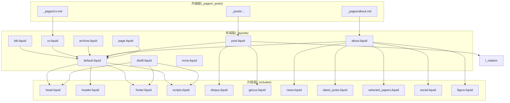
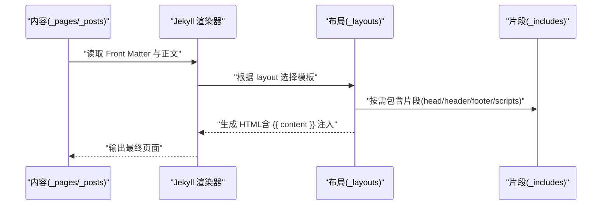
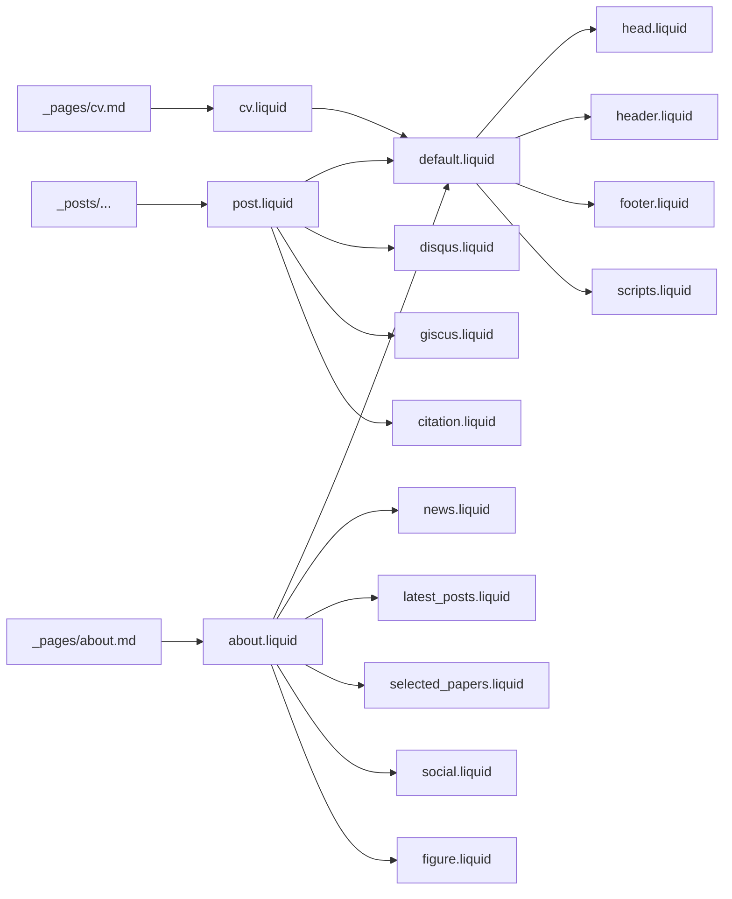

# 自定义布局开发

<cite>
**本文引用的文件**
- [_config.yml](file://_config.yml)
- [_layouts/default.liquid](file://_layouts/default.liquid)
- [_layouts/page.liquid](file://_layouts/page.liquid)
- [_layouts/post.liquid](file://_layouts/post.liquid)
- [_layouts/about.liquid](file://_layouts/about.liquid)
- [_layouts/archive.liquid](file://_layouts/archive.liquid)
- [_layouts/cv.liquid](file://_layouts/cv.liquid)
- [_layouts/bib.liquid](file://_layouts/bib.liquid)
- [_layouts/distill.liquid](file://_layouts/distill.liquid)
- [_layouts/none.liquid](file://_layouts/none.liquid)
- [_pages/about.md](file://_pages/about.md)
- [_pages/cv.md](file://_pages/cv.md)
- [_posts/2015-03-15-formatting-and-links.md](file://_posts/2015-03-15-formatting-and-links.md)
- [_includes/head.liquid](file://_includes/head.liquid)
- [_includes/header.liquid](file://_includes/header.liquid)
- [_includes/footer.liquid](file://_includes/footer.liquid)
- [_includes/scripts.liquid](file://_includes/scripts.liquid)
- [_includes/distill_scripts.liquid](file://_includes/distill_scripts.liquid)
- [_includes/news.liquid](file://_includes/news.liquid)
- [_includes/latest_posts.liquid](file://_includes/latest_posts.liquid)
- [_includes/selected_papers.liquid](file://_includes/selected_papers.liquid)
- [_includes/social.liquid](file://_includes/social.liquid)
- [_includes/disqus.liquid](file://_includes/disqus.liquid)
- [_includes/giscus.liquid](file://_includes/giscus.liquid)
- [_includes/citation.liquid](file://_includes/citation.liquid)
- [_includes/figure.liquid](file://_includes/figure.liquid)
</cite>

## 目录
1. [简介](#简介)
2. [项目结构](#项目结构)
3. [核心组件](#核心组件)
4. [架构总览](#架构总览)
5. [详细组件分析](#详细组件分析)
6. [依赖关系分析](#依赖关系分析)
7. [性能考量](#性能考量)
8. [故障排查指南](#故障排查指南)
9. [结论](#结论)
10. [附录](#附录)

## 简介
本指南面向需要在 Jekyll 主题中开发“自定义布局”的读者，围绕以下目标展开：如何创建新的布局文件（命名规范与放置位置）、如何在布局中定义与使用“块”（block）与内容占位符（如 content_for_layout/yield 的对应机制）、如何传递与接收布局参数（尤其是 page 对象的属性访问）、如何结合 includes 组件实现复杂页面（如特殊页面布局、全宽布局、侧边栏布局等），并提供调试技巧与常见问题的解决方案。

## 项目结构
本项目采用 Jekyll 标准目录组织，与布局开发直接相关的关键目录如下：
- _layouts：存放所有布局模板（Liquid）
- _includes：存放可复用的片段（partials）
- _pages：页面内容（Front Matter 指定 layout）
- _posts：文章内容（Front Matter 指定 layout）
- _config.yml：站点配置，影响布局行为（如导航固定、页脚固定、搜索开关等）

图表来源
- [_layouts/default.liquid](file://_layouts/default.liquid)
- [_layouts/page.liquid](file://_layouts/page.liquid)
- [_layouts/post.liquid](file://_layouts/post.liquid)
- [_layouts/about.liquid](file://_layouts/about.liquid)
- [_layouts/archive.liquid](file://_layouts/archive.liquid)
- [_layouts/cv.liquid](file://_layouts/cv.liquid)
- [_layouts/bib.liquid](file://_layouts/bib.liquid)
- [_layouts/distill.liquid](file://_layouts/distill.liquid)
- [_layouts/none.liquid](file://_layouts/none.liquid)
- [_pages/about.md](file://_pages/about.md)
- [_pages/cv.md](file://_pages/cv.md)
- [_posts/2015-03-15-formatting-and-links.md](file://_posts/2015-03-15-formatting-and-links.md)
- [_includes/head.liquid](file://_includes/head.liquid)
- [_includes/header.liquid](file://_includes/header.liquid)
- [_includes/footer.liquid](file://_includes/footer.liquid)
- [_includes/scripts.liquid](file://_includes/scripts.liquid)
- [_includes/disqus.liquid](file://_includes/disqus.liquid)
- [_includes/giscus.liquid](file://_includes/giscus.liquid)
- [_includes/news.liquid](file://_includes/news.liquid)
- [_includes/latest_posts.liquid](file://_includes/latest_posts.liquid)
- [_includes/selected_papers.liquid](file://_includes/selected_papers.liquid)
- [_includes/social.liquid](file://_includes/social.liquid)
- [_includes/figure.liquid](file://_includes/figure.liquid)

章节来源
- [_config.yml](file://_config.yml)
- [_layouts/default.liquid](file://_layouts/default.liquid)

## 核心组件
- 布局模板（Layouts）：以 Liquid 语法编写，负责页面骨架与内容占位。默认布局 default.liquid 提供通用头部、导航、内容区、页脚与脚本加载；其他布局通过 Front Matter 指定继承关系或直接输出。
- 内容占位与块（Block/Content）：Jekyll 中通过 {{ content }} 实现“内容注入点”，相当于传统模板中的 content_for_layout 或 yield。各页面与文章的正文内容最终被注入到布局的 {{ content }} 位置。
- 页面对象（Page Object）：Front Matter 中的键值（如 title、description、toc、profile、announcements 等）会成为 page 对象的可用属性，可在布局与 includes 中读取。
- 片段（Includes）：_includes 下的 *.liquid 可在布局中通过  调用，用于模块化渲染头部、导航、评论、社交、新闻等。

章节来源
- [_layouts/default.liquid](file://_layouts/default.liquid)
- [_layouts/page.liquid](file://_layouts/page.liquid)
- [_layouts/post.liquid](file://_layouts/post.liquid)
- [_layouts/about.liquid](file://_layouts/about.liquid)
- [_pages/about.md](file://_pages/about.md)
- [_pages/cv.md](file://_pages/cv.md)
- [_posts/2015-03-15-formatting-and-links.md](file://_posts/2015-03-15-formatting-and-links.md)

## 架构总览
下图展示了从内容到布局再到片段的整体渲染流程，以及布局之间的继承关系与关键参数来源。

图表来源
- [_layouts/default.liquid](file://_layouts/default.liquid)
- [_layouts/page.liquid](file://_layouts/page.liquid)
- [_layouts/post.liquid](file://_layouts/post.liquid)
- [_layouts/about.liquid](file://_layouts/about.liquid)
- [_includes/head.liquid](file://_includes/head.liquid)
- [_includes/header.liquid](file://_includes/header.liquid)
- [_includes/footer.liquid](file://_includes/footer.liquid)
- [_includes/scripts.liquid](file://_includes/scripts.liquid)

## 详细组件分析

### 布局文件命名规范与放置位置
- 放置位置：新建布局应放入 _layouts 目录，扩展名为 .liquid。
- 命名规范：建议使用语义化名称（如 special-page.liquid、full-width.liquid、sidebar.liquid），避免与现有布局重名。
- 继承关系：通过 Front Matter 的 layout 键指定父布局，例如：
  - 在页面 Front Matter 中设置 layout: about，则该页面使用 _layouts/about.liquid。
  - 若希望全宽无侧边栏，可让新布局直接继承 default.liquid 并移除侧边栏逻辑。
- 注意事项：布局文件名区分大小写；Liquid 文件必须以 .liquid 结尾。

章节来源
- [_layouts/default.liquid](file://_layouts/default.liquid)
- [_layouts/about.liquid](file://_layouts/about.liquid)
- [_layouts/page.liquid](file://_layouts/page.liquid)
- [_layouts/post.liquid](file://_layouts/post.liquid)

### 布局块（Block）与内容占位符
- 占位符机制：所有布局均包含 {{ content }}，这是内容注入点，相当于传统模板中的 content_for_layout 或 yield。
- 使用方式：页面或文章正文内容在渲染时自动注入到 {{ content }} 位置。
- 复杂布局：若需要多区域占位，可在布局中定义多个块（例如主内容区与侧边栏），并在页面 Front Matter 中通过变量控制显示逻辑。

章节来源
- [_layouts/default.liquid](file://_layouts/default.liquid)
- [_layouts/page.liquid](file://_layouts/page.liquid)
- [_layouts/post.liquid](file://_layouts/post.liquid)
- [_layouts/about.liquid](file://_layouts/about.liquid)

### 布局参数传递与接收（page 对象）
- Front Matter 参数：页面 Front Matter 中的键值（如 title、description、toc、profile、announcements、cv_pdf 等）会成为 page 对象的属性，可在布局与 includes 中直接访问。
- 示例路径：
  - 页面标题与描述：见 [_layouts/page.liquid](file://_layouts/page.liquid)
  - 侧边栏目录与 TOC：见 [_layouts/default.liquid](file://_layouts/default.liquid)
  - 个人资料与社交：见 [_layouts/about.liquid](file://_layouts/about.liquid)
  - CV PDF 链接：见 [_pages/cv.md](file://_pages/cv.md) 与 [_layouts/cv.liquid](file://_layouts/cv.liquid)
- 访问约定：在 Liquid 中使用 page.<key> 即可读取对应值；布尔值与对象（如 profile）可配合条件判断与循环。

章节来源
- [_layouts/page.liquid](file://_layouts/page.liquid)
- [_layouts/default.liquid](file://_layouts/default.liquid)
- [_layouts/about.liquid](file://_layouts/about.liquid)
- [_pages/cv.md](file://_pages/cv.md)
- [_layouts/cv.liquid](file://_layouts/cv.liquid)

### 多种自定义布局示例

#### 特殊页面布局（如首页）
- 入口页面：首页通常通过 permalink: / 指向特定布局（如 about），Front Matter 中可开启 announcements、social、selected_papers 等功能区块。
- 关键点：利用 page.profile.align/image 等参数控制头像位置与样式；通过 includes 控制新闻、最新文章、精选论文等模块的展示。

章节来源
- [_pages/about.md](file://_pages/about.md)
- [_layouts/about.liquid](file://_layouts/about.liquid)
- [_includes/news.liquid](file://_includes/news.liquid)
- [_includes/latest_posts.liquid](file://_includes/latest_posts.liquid)
- [_includes/selected_papers.liquid](file://_includes/selected_papers.liquid)
- [_includes/social.liquid](file://_includes/social.liquid)
- [_includes/figure.liquid](file://_includes/figure.liquid)

#### 全宽布局（移除侧边栏）
- 思路：新建布局（如 full-width.liquid），直接继承 default.liquid，并在其中移除侧边栏相关逻辑，仅保留主内容区。
- 参数控制：可通过 page.toc.sidebar 或自定义布尔参数决定是否显示侧边栏。

章节来源
- [_layouts/default.liquid](file://_layouts/default.liquid)

#### 侧边栏布局（左右栏或右侧栏）
- 思路：在 default.liquid 中已内置基于 Bootstrap 列类的左右布局逻辑，可根据 page.toc.sidebar 的值动态切换主内容与侧边栏顺序。
- 参数控制：page.toc.sidebar 可为 "left"/"right"，或通过自定义字段扩展。

章节来源
- [_layouts/default.liquid](file://_layouts/default.liquid)

#### 文章布局（带目录与标签）
- 功能：post.liquid 展示文章元信息（日期、作者、标签、分类）、目录（toc）、正文内容、引用与评论组件。
- 参数：page.toc.beginning 控制是否在文章开头插入目录；page.tags/categories 用于生成链接。

章节来源
- [_layouts/post.liquid](file://_layouts/post.liquid)
- [_posts/2015-03-15-formatting-and-links.md](file://_posts/2015-03-15-formatting-and-links.md)

#### CV 布局（数据驱动）
- 数据源：优先使用 site.data.cv；若存在 site.data.resume，则按 site.jsonresume 白名单渲染。
- 参数：page.cv_pdf 控制 PDF 下载按钮；page.toc.sidebar 控制侧边栏布局。

章节来源
- [_layouts/cv.liquid](file://_layouts/cv.liquid)
- [_pages/cv.md](file://_pages/cv.md)

#### Archive 布局（归档列表）
- 功能：根据 page.type（categories/year/tags）渲染不同维度的归档表格，遍历 page.documents 输出条目。
- 参数：page.type、page.title、page.collection_name、page.documents。

章节来源
- [_layouts/archive.liquid](file://_layouts/archive.liquid)

#### Distill 布局（学术发布风格）
- 功能：使用 <d-front-matter> 与 <d-article> 等元素，支持目录、作者信息、数学公式（KaTeX）、脚注与参考文献。
- 参数：page.authors、page.toc、page.bibliography、page.description、page.date。

章节来源
- [_layouts/distill.liquid](file://_layouts/distill.liquid)
- [_includes/distill_scripts.liquid](file://_includes/distill_scripts.liquid)

### 布局与 includes 组件的集成
- 通用集成：default.liquid 通过  加载 head、header、footer、scripts，形成统一的页面骨架。
- 功能集成：post.liquid 条件性包含 disqus/giscus、citation、related_posts 等；about.liquid 包含 news、latest_posts、selected_papers、social、figure 等。
- 设计原则：将可复用 UI 拆分为小片段，布局只负责编排，细节由 includes 承担，提升可维护性。

章节来源
- [_layouts/default.liquid](file://_layouts/default.liquid)
- [_layouts/post.liquid](file://_layouts/post.liquid)
- [_layouts/about.liquid](file://_layouts/about.liquid)
- [_includes/head.liquid](file://_includes/head.liquid)
- [_includes/header.liquid](file://_includes/header.liquid)
- [_includes/footer.liquid](file://_includes/footer.liquid)
- [_includes/scripts.liquid](file://_includes/scripts.liquid)
- [_includes/disqus.liquid](file://_includes/disqus.liquid)
- [_includes/giscus.liquid](file://_includes/giscus.liquid)
- [_includes/citation.liquid](file://_includes/citation.liquid)
- [_includes/news.liquid](file://_includes/news.liquid)
- [_includes/latest_posts.liquid](file://_includes/latest_posts.liquid)
- [_includes/selected_papers.liquid](file://_includes/selected_papers.liquid)
- [_includes/social.liquid](file://_includes/social.liquid)
- [_includes/figure.liquid](file://_includes/figure.liquid)

## 依赖关系分析

图表来源
- [_pages/about.md](file://_pages/about.md)
- [_pages/cv.md](file://_pages/cv.md)
- [_posts/2015-03-15-formatting-and-links.md](file://_posts/2015-03-15-formatting-and-links.md)
- [_layouts/about.liquid](file://_layouts/about.liquid)
- [_layouts/cv.liquid](file://_layouts/cv.liquid)
- [_layouts/post.liquid](file://_layouts/post.liquid)
- [_layouts/default.liquid](file://_layouts/default.liquid)
- [_includes/head.liquid](file://_includes/head.liquid)
- [_includes/header.liquid](file://_includes/header.liquid)
- [_includes/footer.liquid](file://_includes/footer.liquid)
- [_includes/scripts.liquid](file://_includes/scripts.liquid)
- [_includes/disqus.liquid](file://_includes/disqus.liquid)
- [_includes/giscus.liquid](file://_includes/giscus.liquid)
- [_includes/citation.liquid](file://_includes/citation.liquid)
- [_includes/news.liquid](file://_includes/news.liquid)
- [_includes/latest_posts.liquid](file://_includes/latest_posts.liquid)
- [_includes/selected_papers.liquid](file://_includes/selected_papers.liquid)
- [_includes/social.liquid](file://_includes/social.liquid)
- [_includes/figure.liquid](file://_includes/figure.liquid)

章节来源
- [_config.yml](file://_config.yml)
- [_layouts/default.liquid](file://_layouts/default.liquid)

## 性能考量
- 减少不必要的 includes：仅在必要时包含评论、目录、图表等资源，避免对静态页面造成额外负担。
- 合理使用 page.toc/sidebar：目录与侧边栏会引入额外 DOM 与脚本，建议按需启用。
- 图片与媒体：利用 _includes/figure.liquid 的懒加载与响应式尺寸策略，降低首屏压力。
- 构建优化：通过 _config.yml 中的压缩与最小化插件减少输出体积（如 jekyll-minifier、terser）。

## 故障排查指南
- 页面未应用预期布局
  - 检查 Front Matter 中 layout 是否正确拼写且存在于 _layouts。
  - 确认文件扩展名是否为 .md/.liquid。
- 侧边栏不显示
  - 检查 page.toc.sidebar 是否设置为 "left"/"right"，或是否存在条件判断导致隐藏。
- 评论区不出现
  - 确认 site.giscus 或 site.disqus 配置已启用，且页面 Front Matter 中相应开关为 true。
- 目录不生成
  - 确认 page.toc.beginning 或 page.toc.sidebar 已设置，且布局中包含对应渲染逻辑。
- PDF 下载按钮无效
  - 检查 page.cv_pdf 路径是否正确，外部链接需以协议开头，内部路径需指向 assets/pdf。
- Distill 布局样式异常
  - 确认 _includes/distill_scripts.liquid 已包含，且页面 _styles 未覆盖关键样式。

章节来源
- [_layouts/default.liquid](file://_layouts/default.liquid)
- [_layouts/post.liquid](file://_layouts/post.liquid)
- [_layouts/cv.liquid](file://_layouts/cv.liquid)
- [_layouts/distill.liquid](file://_layouts/distill.liquid)
- [_pages/cv.md](file://_pages/cv.md)
- [_posts/2015-03-15-formatting-and-links.md](file://_posts/2015-03-15-formatting-and-links.md)

## 结论
通过理解 Jekyll 的布局与 includes 机制、掌握 page 对象参数的使用方法，并遵循命名与放置规范，即可高效地创建满足业务需求的自定义布局。建议以模块化思维拆分 UI 片段，以布局统一编排，以 Front Matter 精细控制页面行为，从而获得高可维护性的静态网站架构。

## 附录

### 创建新布局的步骤清单
- 在 _layouts 新建文件（如 my-layout.liquid），扩展名必须为 .liquid。
- 在页面或文章 Front Matter 设置 layout: my-layout。
- 在布局中使用 {{ content }} 注入正文内容。
- 如需模块化 UI，将片段放入 _includes 并通过  调用。
- 通过 page.<key> 访问 Front Matter 参数，实现灵活控制。

### 常用 Front Matter 参数速览（节选）
- 布局与导航：layout、permalink、nav、nav_order
- 内容与样式：title、description、_styles、toc（beginning/sidebar）、redirect
- 功能开关：giscus_comments、disqus_comments、related_publications、social
- 数据与资源：cv_pdf、profile（align/image/image_circular/more_info）、announcements、latest_posts、selected_papers

章节来源
- [_pages/about.md](file://_pages/about.md)
- [_pages/cv.md](file://_pages/cv.md)
- [_posts/2015-03-15-formatting-and-links.md](file://_posts/2015-03-15-formatting-and-links.md)
- [_layouts/post.liquid](file://_layouts/post.liquid)
- [_layouts/cv.liquid](file://_layouts/cv.liquid)
- [_layouts/about.liquid](file://_layouts/about.liquid)