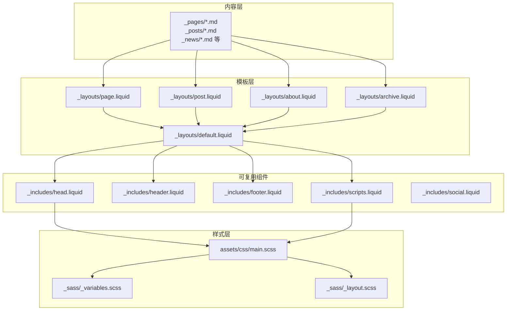
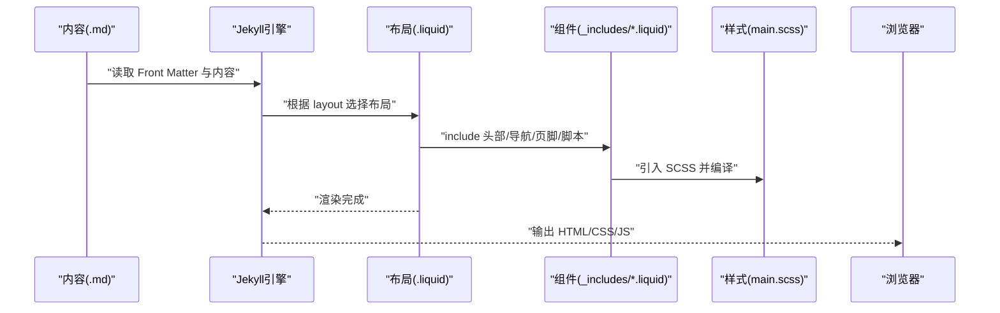
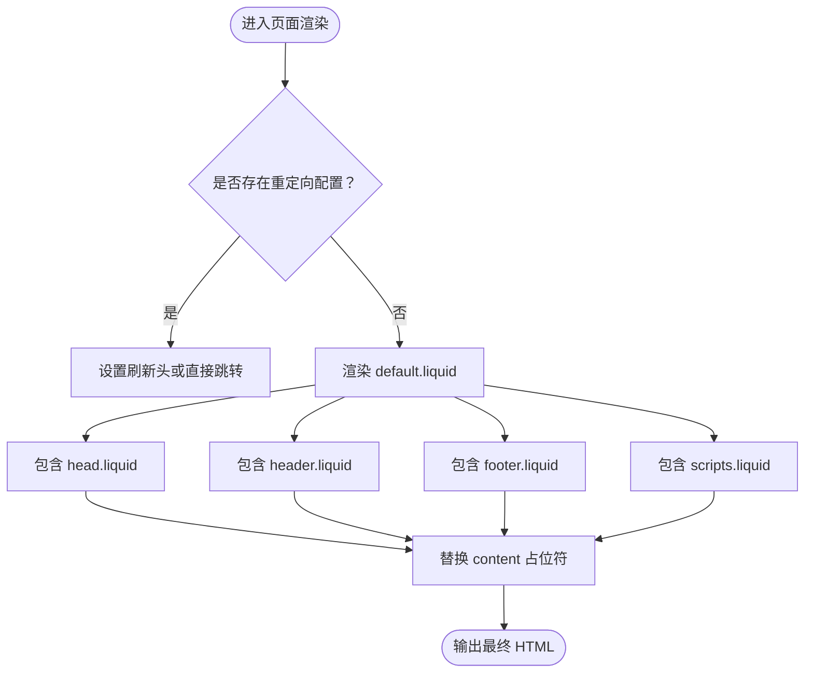
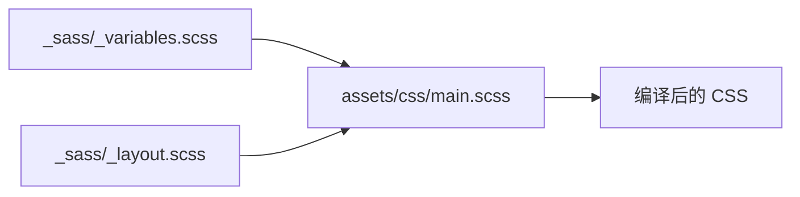
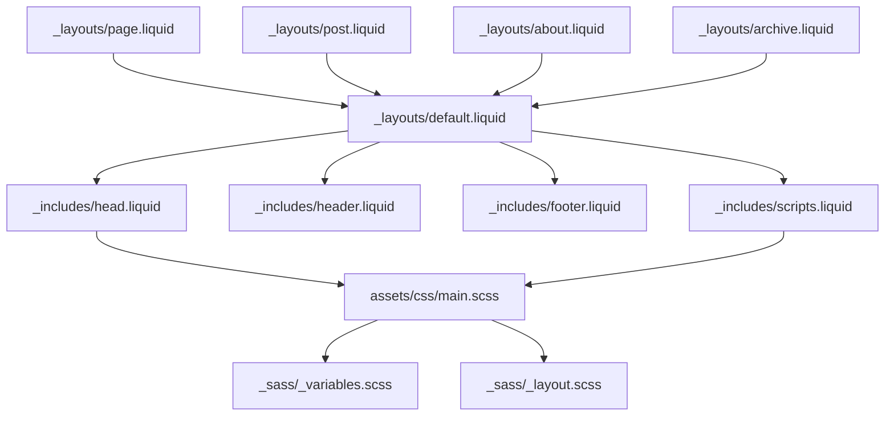

# 页面布局和模板

<cite>
**本文引用的文件**
- [_config.yml](file://_config.yml)
- [_layouts/default.liquid](file://_layouts/default.liquid)
- [_layouts/page.liquid](file://_layouts/page.liquid)
- [_layouts/post.liquid](file://_layouts/post.liquid)
- [_layouts/about.liquid](file://_layouts/about.liquid)
- [_layouts/archive.liquid](file://_layouts/archive.liquid)
- [_includes/head.liquid](file://_includes/head.liquid)
- [_includes/header.liquid](file://_includes/header.liquid)
- [_includes/footer.liquid](file://_includes/footer.liquid)
- [_includes/scripts.liquid](file://_includes/scripts.liquid)
- [_includes/social.liquid](file://_includes/social.liquid)
- [assets/css/main.scss](file://assets/css/main.scss)
- [_sass/_variables.scss](file://_sass/_variables.scss)
- [_sass/_layout.scss](file://_sass/_layout.scss)
</cite>

## 目录
1. [引言](#引言)
2. [项目结构](#项目结构)
3. [核心组件](#核心组件)
4. [架构总览](#架构总览)
5. [详细组件分析](#详细组件分析)
6. [依赖分析](#依赖分析)
7. [性能考虑](#性能考虑)
8. [故障排查指南](#故障排查指南)
9. [结论](#结论)
10. [附录](#附录)

## 引言
本文件面向希望深入理解与扩展 al-folio 页面布局与模板系统的读者。内容覆盖 Jekyll 模板系统（Liquid）的工作方式、布局继承机制、块定义与内容替换、可复用组件（Includes）的组织与使用、以及样式系统（SCSS）的导入关系与变量体系。文档同时提供架构图、流程图与最佳实践建议，帮助你在不破坏现有结构的前提下进行定制化开发。

## 项目结构
al-folio 使用 Jekyll 的标准目录约定：内容以 Markdown/HTML 文档形式存在，通过 Front Matter 声明布局；布局文件位于 _layouts，可复用片段位于 _includes；样式由 SCSS 组织并通过 main.scss 导入。

图表来源
- [_layouts/default.liquid](file://_layouts/default.liquid)
- [_layouts/page.liquid](file://_layouts/page.liquid)
- [_layouts/post.liquid](file://_layouts/post.liquid)
- [_layouts/about.liquid](file://_layouts/about.liquid)
- [_layouts/archive.liquid](file://_layouts/archive.liquid)
- [_includes/head.liquid](file://_includes/head.liquid)
- [_includes/header.liquid](file://_includes/header.liquid)
- [_includes/footer.liquid](file://_includes/footer.liquid)
- [_includes/scripts.liquid](file://_includes/scripts.liquid)
- [assets/css/main.scss](file://assets/css/main.scss)
- [_sass/_variables.scss](file://_sass/_variables.scss)
- [_sass/_layout.scss](file://_sass/_layout.scss)

章节来源
- [_config.yml](file://_config.yml)
- [_layouts/default.liquid](file://_layouts/default.liquid)
- [_includes/head.liquid](file://_includes/head.liquid)
- [_includes/header.liquid](file://_includes/header.liquid)
- [_includes/footer.liquid](file://_includes/footer.liquid)
- [_includes/scripts.liquid](file://_includes/scripts.liquid)
- [assets/css/main.scss](file://assets/css/main.scss)
- [_sass/_variables.scss](file://_sass/_variables.scss)
- [_sass/_layout.scss](file://_sass/_layout.scss)

## 核心组件
- 默认布局 default.liquid：作为所有页面的基础骨架，负责注入 head、header、footer、scripts，并处理重定向逻辑与侧边栏目录（若启用）。
- 页面布局 page.liquid：用于静态页面（如关于页、博客列表页等），在 default 基础上渲染标题、描述与正文内容，并支持相关文献与评论区。
- 文章布局 post.liquid：用于博文，渲染标题、元信息（日期、作者、标签、分类）、目录（toc）、正文、引用、相关文章与评论区。
- 可复用组件：head.liquid 负责元数据、第三方库与样式；header.liquid 渲染导航栏与搜索/主题切换入口；footer.liquid 输出页脚文本与版权信息；scripts.liquid 注入各类交互脚本。
- 样式系统：main.scss 统一导入变量、主题、布局、基础样式与图标库；_variables.scss 定义颜色与尺寸变量；_layout.scss 控制全局排版与容器宽度。

章节来源
- [_layouts/default.liquid](file://_layouts/default.liquid)
- [_layouts/page.liquid](file://_layouts/page.liquid)
- [_layouts/post.liquid](file://_layouts/post.liquid)
- [_includes/head.liquid](file://_includes/head.liquid)
- [_includes/header.liquid](file://_includes/header.liquid)
- [_includes/footer.liquid](file://_includes/footer.liquid)
- [_includes/scripts.liquid](file://_includes/scripts.liquid)
- [assets/css/main.scss](file://assets/css/main.scss)
- [_sass/_variables.scss](file://_sass/_variables.scss)
- [_sass/_layout.scss](file://_sass/_layout.scss)

## 架构总览
下图展示从内容到最终 HTML 的生成路径：Markdown 内容经 Front Matter 指定布局，布局文件组合 Includes，Includes 再加载 SCSS 与第三方资源，最终输出页面。

图表来源
- [_layouts/default.liquid](file://_layouts/default.liquid)
- [_includes/head.liquid](file://_includes/head.liquid)
- [_includes/header.liquid](file://_includes/header.liquid)
- [_includes/footer.liquid](file://_includes/footer.liquid)
- [_includes/scripts.liquid](file://_includes/scripts.liquid)
- [assets/css/main.scss](file://assets/css/main.scss)

## 详细组件分析

### 布局继承与内容替换
- 继承机制：各布局通过 Front Matter 声明继承 default.liquid，从而共享头部、导航、页脚与脚本注入逻辑。
- 内容替换：布局中使用 content 占位符，具体页面内容在渲染时替换该占位符。
- 条件渲染：default.liquid 支持页面级重定向逻辑与侧边栏目录开关，post.liquid 支持目录生成与相关文章模块。

图表来源
- [_layouts/default.liquid](file://_layouts/default.liquid)
- [_includes/head.liquid](file://_includes/head.liquid)
- [_includes/header.liquid](file://_includes/header.liquid)
- [_includes/footer.liquid](file://_includes/footer.liquid)
- [_includes/scripts.liquid](file://_includes/scripts.liquid)

章节来源
- [_layouts/default.liquid](file://_layouts/default.liquid)
- [_layouts/page.liquid](file://_layouts/page.liquid)
- [_layouts/post.liquid](file://_layouts/post.liquid)

### 页面布局 page.liquid
- 功能要点：渲染页面标题与描述、注入页面级内联样式（_styles）、显示正文内容、可选“引用”区域、可选评论区（giscus）。
- 适用场景：静态页面（如 about、projects、publications 等）。

章节来源
- [_layouts/page.liquid](file://_layouts/page.liquid)

### 文章布局 post.liquid
- 功能要点：渲染标题、创建/更新时间、作者、标签与分类链接、可选目录（toc）、正文、可选引用、相关文章、评论区（disqus/giscus）。
- 适用场景：博客文章与带元信息的动态内容。

章节来源
- [_layouts/post.liquid](file://_layouts/post.liquid)

### 关于页布局 about.liquid
- 功能要点：根据站点配置显示姓名或标题；支持头像、更多信息、公告、最新文章、精选论文、社交链接与订阅表单等模块。
- 适用场景：个人简介与聚合信息页。

章节来源
- [_layouts/about.liquid](file://_layouts/about.liquid)

### 归档布局 archive.liquid
- 功能要点：按分类/年份/标签展示集合文档列表，支持外链与内部重定向。
- 适用场景：文章归档页。

章节来源
- [_layouts/archive.liquid](file://_layouts/archive.liquid)

### 可复用组件系统
- head.liquid：负责元数据、第三方库样式（Bootstrap、MDB、FontAwesome、MathJax、Mermaid、Chart/ECharts/Vega、Leaflet、Diff2HTML、图片库等）与高亮主题切换。
- header.liquid：构建导航栏，支持下拉菜单、搜索入口、主题切换按钮与当前页激活状态。
- footer.liquid：输出版权与站点信息，支持固定/粘性底部模式与订阅表单。
- scripts.liquid：按页面需求动态加载脚本（Masonry、Mermaid、Chart/ECharts/Vega、MathJax、Analytics、图片库、搜索等）。
- social.liquid：基于 _data/socials.yml 渲染社交链接与图标，支持多种平台与自定义 logo。

章节来源
- [_includes/head.liquid](file://_includes/head.liquid)
- [_includes/header.liquid](file://_includes/header.liquid)
- [_includes/footer.liquid](file://_includes/footer.liquid)
- [_includes/scripts.liquid](file://_includes/scripts.liquid)
- [_includes/social.liquid](file://_includes/social.liquid)

### 样式系统组织
- main.scss：统一导入变量、主题、布局、基础样式与图标库，且通过站点配置控制最大宽度。
- _variables.scss：集中定义颜色、字体路径、回顶部按钮尺寸等变量。
- _layout.scss：控制全局排版、容器宽度、导航与页脚间距、内容滚动偏移等。

图表来源
- [assets/css/main.scss](file://assets/css/main.scss)
- [_sass/_variables.scss](file://_sass/_variables.scss)
- [_sass/_layout.scss](file://_sass/_layout.scss)

章节来源
- [assets/css/main.scss](file://assets/css/main.scss)
- [_sass/_variables.scss](file://_sass/_variables.scss)
- [_sass/_layout.scss](file://_sass/_layout.scss)

## 依赖分析
- 布局对组件的依赖：所有页面布局均依赖 default.liquid；default.liquid 依赖 head、header、footer、scripts。
- 组件对站点配置的依赖：head.liquid 与 scripts.liquid 依据 _config.yml 中 third_party_libraries、analytics、功能开关等注入资源。
- 样式对变量与布局的依赖：main.scss 导入变量与布局样式，_layout.scss 依赖变量中的最大宽度与颜色变量。

图表来源
- [_layouts/default.liquid](file://_layouts/default.liquid)
- [_layouts/page.liquid](file://_layouts/page.liquid)
- [_layouts/post.liquid](file://_layouts/post.liquid)
- [_layouts/about.liquid](file://_layouts/about.liquid)
- [_layouts/archive.liquid](file://_layouts/archive.liquid)
- [_includes/head.liquid](file://_includes/head.liquid)
- [_includes/header.liquid](file://_includes/header.liquid)
- [_includes/footer.liquid](file://_includes/footer.liquid)
- [_includes/scripts.liquid](file://_includes/scripts.liquid)
- [assets/css/main.scss](file://assets/css/main.scss)
- [_sass/_variables.scss](file://_sass/_variables.scss)
- [_sass/_layout.scss](file://_sass/_layout.scss)

章节来源
- [_config.yml](file://_config.yml)
- [_layouts/default.liquid](file://_layouts/default.liquid)
- [_includes/head.liquid](file://_includes/head.liquid)
- [_includes/scripts.liquid](file://_includes/scripts.liquid)
- [assets/css/main.scss](file://assets/css/main.scss)

## 性能考虑
- 按需加载：scripts.liquid 与 head.liquid 仅在页面声明相应特性时加载对应脚本与样式，避免不必要的资源请求。
- 缓存策略：通过 bust_file_cache 与 bust_css_cache 在资源路径中加入版本戳，提升缓存命中与更新效率。
- 图片优化：启用懒加载与响应式 WebP 图像转换，减少首屏加载时间。
- 样式压缩：Jekyll 配置中启用压缩输出，降低 CSS 体积。

章节来源
- [_includes/head.liquid](file://_includes/head.liquid)
- [_includes/scripts.liquid](file://_includes/scripts.liquid)
- [_config.yml](file://_config.yml)

## 故障排查指南
- 页面未正确渲染或缺少样式
  - 检查布局是否正确继承 default.liquid，确认 _includes/head.liquid 是否被包含。
  - 确认 main.scss 已成功编译，且 _sass 变量与布局文件无语法错误。
- 导航或页脚位置异常
  - 检查 _sass/_layout.scss 中容器宽度与滚动偏移设置，确认是否与自定义样式冲突。
- 第三方库未生效
  - 检查 _config.yml 中 third_party_libraries 对应项是否完整，确认 scripts.liquid 与 head.liquid 的条件判断是否匹配页面 Front Matter。
- 评论区不可用
  - 确认 _config.yml 中 giscus/disqus 配置已填写，且页面 Front Matter 中相应开关已开启。
- 重定向无效
  - 检查页面 Front Matter 中 redirect 字段格式，确保 default.liquid 的重定向逻辑被触发。

章节来源
- [_layouts/default.liquid](file://_layouts/default.liquid)
- [_includes/head.liquid](file://_includes/head.liquid)
- [_includes/scripts.liquid](file://_includes/scripts.liquid)
- [_config.yml](file://_config.yml)

## 结论
al-folio 的模板系统以 default.liquid 为核心，通过布局继承与 Liquid 块替换实现高度复用；_includes 将头部、导航、页脚与脚本模块化，便于按需加载与维护；SCSS 层通过变量与导入机制统一管理样式。遵循本文的最佳实践与故障排查建议，你可以在不破坏整体结构的前提下，灵活扩展与定制页面布局与样式。

## 附录

### 自定义布局最佳实践
- 新建布局：在 _layouts 下创建新文件，通过 Front Matter 声明继承 default.liquid 或其他布局。
- 块定义与内容替换：在布局中使用 content 占位符承载页面内容；必要时在布局中定义额外块（如 _styles）供页面注入。
- 参数传递：通过页面 Front Matter 传入布尔值或字符串（如 toc、map、pretty_table 等），在布局与组件中据此决定渲染分支。
- 组件复用：优先使用 _includes 中的模块（如 head、header、footer、scripts、social），减少重复代码。

章节来源
- [_layouts/default.liquid](file://_layouts/default.liquid)
- [_layouts/page.liquid](file://_layouts/page.liquid)
- [_layouts/post.liquid](file://_layouts/post.liquid)
- [_includes/head.liquid](file://_includes/head.liquid)
- [_includes/header.liquid](file://_includes/header.liquid)
- [_includes/footer.liquid](file://_includes/footer.liquid)
- [_includes/scripts.liquid](file://_includes/scripts.liquid)
- [_includes/social.liquid](file://_includes/social.liquid)