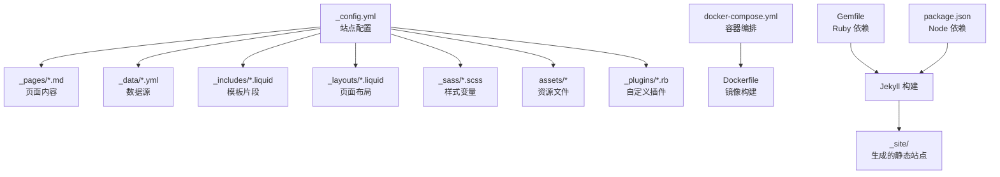
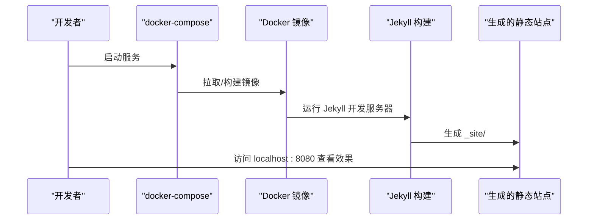
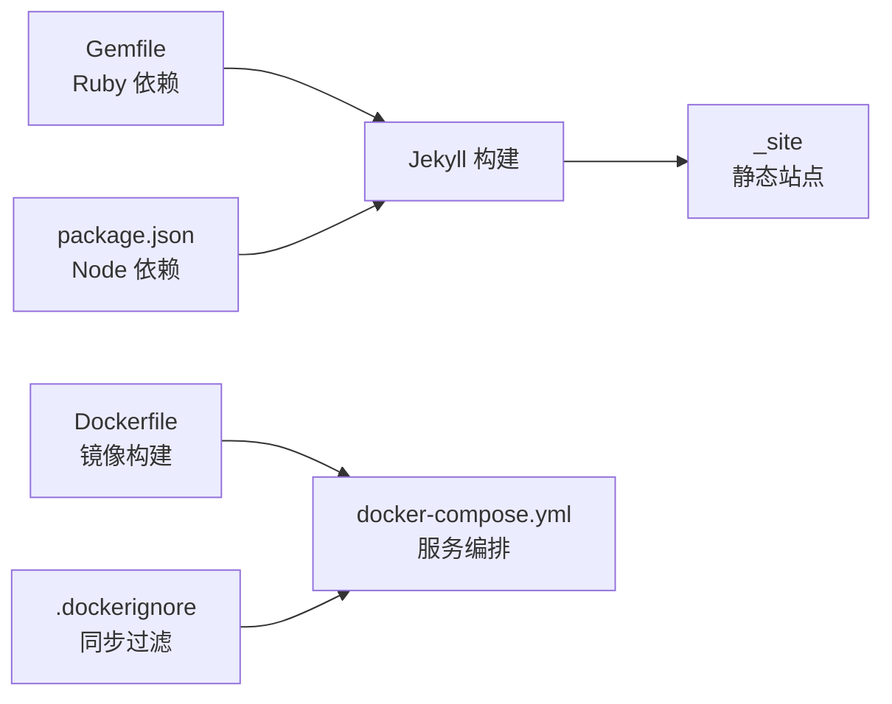

# 快速开始指南

<cite>
**本文引用的文件**
- [README.md](file://README.md)
- [INSTALL.md](file://INSTALL.md)
- [_config.yml](file://_config.yml)
- [Gemfile](file://Gemfile)
- [package.json](file://package.json)
- [CUSTOMIZE.md](file://CUSTOMIZE.md)
- [FAQ.md](file://FAQ.md)
- [Dockerfile](file://Dockerfile)
- [docker-compose.yml](file://docker-compose.yml)
- [.dockerignore](file://.dockerignore)
- [_pages/about.md](file://_pages/about.md)
- [_pages/dropdown.md](file://_pages/dropdown.md)
- [_data/socials.yml](file://_data/socials.yml)
- [_data/cv.yml](file://_data/cv.yml)
- [_layouts/default.liquid](file://_layouts/default.liquid)
- [_includes/header.liquid](file://_includes/header.liquid)
- [_plugins/google-scholar-citations.rb](file://_plugins/google-scholar-citations.rb)
</cite>

## 目录
1. [简介](#简介)
2. [项目结构](#项目结构)
3. [核心组件](#核心组件)
4. [架构总览](#架构总览)
5. [详细组件分析](#详细组件分析)
6. [依赖关系分析](#依赖关系分析)
7. [性能考虑](#性能考虑)
8. [故障排除指南](#故障排除指南)
9. [结论](#结论)
10. [附录](#附录)

## 简介
本指南面向希望从零开始搭建个人学术网站的用户，基于 al-folio 主题，提供完整的环境准备、依赖安装、项目克隆、本地开发与部署流程，并覆盖基础配置（个人信息、主题颜色、导航菜单）与常见问题排查。无论你是初学者还是有一定经验的开发者，都可以按步骤快速上手。

## 项目结构
al-folio 是一个基于 Jekyll 的静态站点主题，采用模块化组织方式：
- 根目录包含站点配置、构建脚本与容器化配置
- _config.yml：站点全局配置（标题、语言、链接、插件、集合等）
- _pages：页面内容（首页、关于页、博客、项目、出版物等）
- _posts：博客文章（按日期命名）
- _data：数据源（社交、简历、仓库、合作作者等）
- _includes：可复用模板片段（头部、页脚、搜索、评论等）
- _layouts：页面布局（about、page、post、archive 等）
- _sass：样式变量与主题色
- assets：资源文件（CSS、JS、字体、图片、JSON 简历）
- _plugins：自定义插件（如 Google Scholar 引用计数）
- docker-compose.yml 与 Dockerfile：容器化本地开发与部署

图表来源
- [_config.yml:1-646](file://_config.yml#L1-L646)
- [docker-compose.yml:1-22](file://docker-compose.yml#L1-L22)
- [Dockerfile:1-77](file://Dockerfile#L1-L77)
- [Gemfile:1-39](file://Gemfile#L1-L39)
- [package.json:1-10](file://package.json#L1-L10)

章节来源
- [_config.yml:1-646](file://_config.yml#L1-L646)
- [docker-compose.yml:1-22](file://docker-compose.yml#L1-L22)
- [Dockerfile:1-77](file://Dockerfile#L1-L77)
- [Gemfile:1-39](file://Gemfile#L1-L39)
- [package.json:1-10](file://package.json#L1-L10)

## 核心组件
- 站点配置（_config.yml）：控制标题、语言、链接、集合、插件、分析与功能开关等
- 页面与布局（_pages、_layouts）：通过 front matter 指定布局与永久链接
- 数据源（_data）：社交账号、简历、仓库、合作作者等
- 插件系统（_plugins）：扩展 Jekyll 功能（如 Google Scholar 引用计数）
- 容器化（Docker）：一键拉起开发环境，避免本地环境差异

章节来源
- [_config.yml:1-646](file://_config.yml#L1-L646)
- [_pages/about.md:1-37](file://_pages/about.md#L1-L37)
- [_pages/dropdown.md:1-14](file://_pages/dropdown.md#L1-L14)
- [_data/socials.yml:1-53](file://_data/socials.yml#L1-L53)
- [_data/cv.yml:1-98](file://_data/cv.yml#L1-L98)
- [_plugins/google-scholar-citations.rb:1-86](file://_plugins/google-scholar-citations.rb#L1-L86)
- [Dockerfile:1-77](file://Dockerfile#L1-L77)

## 架构总览
下图展示了从代码到最终静态站点的构建路径，以及本地开发与部署的关键节点。

图表来源
- [docker-compose.yml:1-22](file://docker-compose.yml#L1-L22)
- [Dockerfile:1-77](file://Dockerfile#L1-L77)

章节来源
- [docker-compose.yml:1-22](file://docker-compose.yml#L1-L22)
- [Dockerfile:1-77](file://Dockerfile#L1-L77)

## 详细组件分析

### 环境准备与依赖安装
- 推荐使用 Docker 作为本地开发环境，避免 Ruby、Node、ImageMagick 等系统依赖差异
- 若需本地原生环境，请参考“本地设置（传统方式）”与“Windows 子系统建议”
- Ruby 与 Bundler 用于管理 Jekyll 插件；Node 与 npm 用于前端工具链

章节来源
- [INSTALL.md:41-128](file://INSTALL.md#L41-L128)
- [Dockerfile:22-35](file://Dockerfile#L22-L35)
- [Gemfile:1-39](file://Gemfile#L1-L39)
- [package.json:1-10](file://package.json#L1-L10)

### 项目克隆与初始化
- 使用仓库模板创建新仓库（个人或组织页面名称需符合 GitHub Pages 规范）
- 在仓库设置中开启 GitHub Actions 权限
- 修改 _config.yml 中的 url 与 baseurl，启用自动部署后等待 gh-pages 分支生成

章节来源
- [INSTALL.md:23-32](file://INSTALL.md#L23-L32)

### 本地开发环境搭建
- Docker 方式：运行 docker compose up，访问 http://localhost:8080
- 开发容器（Dev Containers）：在 VSCode 中打开项目，按提示安装扩展并自动配置
- 传统方式：安装 Ruby、Bundler、Python 与 Jupyter，执行 bundle install 与 bundle exec jekyll serve

章节来源
- [INSTALL.md:45-128](file://INSTALL.md#L45-L128)
- [docker-compose.yml:1-22](file://docker-compose.yml#L1-L22)
- [Dockerfile:1-77](file://Dockerfile#L1-L77)

### 基础配置示例
- 站点信息与链接：在 _config.yml 中设置 title、first_name、last_name、url、baseurl
- 导航菜单：通过 _pages 下的页面 front matter 与 _pages/dropdown.md 的 children 控制
- 社交媒体：在 _data/socials.yml 中添加邮箱、GitHub、微信二维码等
- 主题颜色：在 _sass/_themes.scss 中修改主题色变量
- 功能开关：如 enable_darkmode、enable_math、enable_masonry 等

章节来源
- [_config.yml:5-27](file://_config.yml#L5-L27)
- [_pages/about.md:1-37](file://_pages/about.md#L1-L37)
- [_pages/dropdown.md:1-14](file://_pages/dropdown.md#L1-L14)
- [_data/socials.yml:1-53](file://_data/socials.yml#L1-L53)
- [_layouts/default.liquid:1-57](file://_layouts/default.liquid#L1-L57)
- [_includes/header.liquid:1-151](file://_includes/header.liquid#L1-L151)

### 内容与页面管理
- 新增页面：在 _pages 下新建 Markdown 文件，设置 layout 与 permalink
- 新增博客文章：在 _posts 下按 YYYY-MM-DD-title.md 命名
- 新增项目：在 _projects 下新增 Markdown 文件
- 新增新闻：在 _news 下新增 Markdown 文件
- 自定义集合：在 _config.yml 的 collections 中声明，并创建对应 landing 页面

章节来源
- [CUSTOMIZE.md:60-88](file://CUSTOMIZE.md#L60-L88)
- [CUSTOMIZE.md:72-74](file://CUSTOMIZE.md#L72-L74)
- [CUSTOMIZE.md:76-78](file://CUSTOMIZE.md#L76-L78)
- [CUSTOMIZE.md:80-86](file://CUSTOMIZE.md#L80-L86)

### 出版物与引用
- 添加 BibTeX 条目至 _bibliography/papers.bib
- 在 _config.yml 的 scholar 段落配置作者名、排序与分组
- 支持 PDF、代码、视频等按钮字段，以及 Altmetric、Dimensions、Google Scholar 徽章

章节来源
- [CUSTOMIZE.md:90-151](file://CUSTOMIZE.md#L90-L151)
- [_config.yml:264-332](file://_config.yml#L264-L332)

### 导航栏与头部组件
- 头部导航由 _includes/header.liquid 渲染，支持下拉菜单、搜索、暗色模式切换
- 通过 _pages 下的页面 front matter 控制导航显示与激活状态

章节来源
- [_includes/header.liquid:1-151](file://_includes/header.liquid#L1-L151)
- [_layouts/default.liquid:1-57](file://_layouts/default.liquid#L1-L57)

### 自定义插件：Google Scholar 引用计数
- 通过 _plugins/google-scholar-citations.rb 提供 google_scholar_citations 标签
- 在页面中调用该标签获取引用次数，注意网络请求与缓存逻辑

章节来源
- [_plugins/google-scholar-citations.rb:1-86](file://_plugins/google-scholar-citations.rb#L1-L86)

### 首次部署与后续更新
- 自动部署：启用 Actions 后推送主分支，等待 gh-pages 分支生成并配置 Pages 源为 gh-pages
- 手动部署：在 Actions 中触发 Deploy 工作流
- 更新站点：升级主题版本时遵循升级指引，必要时手动合并冲突

章节来源
- [INSTALL.md:129-157](file://INSTALL.md#L129-L157)
- [INSTALL.md:236-251](file://INSTALL.md#L236-L251)

## 依赖关系分析
- Ruby 与 Jekyll：通过 Gemfile 声明核心插件与开发依赖
- Node 与 npm：package.json 管理前端工具与 Jekyll 兼容依赖
- Docker：统一 Ruby、Node、ImageMagick 等依赖，减少环境差异
- 容器忽略：.dockerignore 控制同步到容器的文件范围

图表来源
- [Gemfile:1-39](file://Gemfile#L1-L39)
- [package.json:1-10](file://package.json#L1-L10)
- [Dockerfile:1-77](file://Dockerfile#L1-L77)
- [docker-compose.yml:1-22](file://docker-compose.yml#L1-L22)
- [.dockerignore:1-4](file://.dockerignore#L1-L4)

章节来源
- [Gemfile:1-39](file://Gemfile#L1-L39)
- [package.json:1-10](file://package.json#L1-L10)
- [Dockerfile:1-77](file://Dockerfile#L1-L77)
- [docker-compose.yml:1-22](file://docker-compose.yml#L1-L22)
- [.dockerignore:1-4](file://.dockerignore#L1-L4)

## 性能考虑
- 图片懒加载与响应式 WebP：在 _config.yml 中启用 lazy_loading_images 与 imagemaker
- 资源压缩：启用 jekyll-minifier 与 terser 压缩 JS/CSS
- 构建缓存：Docker 镜像层缓存与 bundle 缓存，减少重复安装时间
- CDN 与完整性校验：第三方库通过 third_party_libraries 配置并校验 integrity

章节来源
- [_config.yml:368-374](file://_config.yml#L368-L374)
- [_config.yml:348-375](file://_config.yml#L348-L375)
- [_config.yml:234-245](file://_config.yml#L234-L245)
- [_config.yml:403-624](file://_config.yml#L403-L624)

## 故障排除指南
- 部署后本地正常但线上报错“未知标签 toc”：确认 Pages 发布源为 gh-pages
- 线上 CSS/JS 加载异常：检查 _config.yml 中 url 与 baseurl 设置
- 相关文章功能报错：可能是 classifier-reborn 计算相似度失败，调整相关设置或禁用 LSI
- Prettier 格式化失败：在本地安装 Prettier 并格式化后提交
- 旧版依赖弃用导致错误：升级到最新版本，必要时重新安装模板并手动对比差异
- 自定义域名空白：在 main 或 source 分支添加 CNAME 文件
- Lighthouse Badger 缺少 token：在仓库 Secrets 中添加 LIGHTHOUSE_BADGER_TOKEN

章节来源
- [FAQ.md:33-35](file://FAQ.md#L33-L35)
- [FAQ.md:37-47](file://FAQ.md#L37-L47)
- [FAQ.md:53-55](file://FAQ.md#L53-L55)
- [FAQ.md:65-73](file://FAQ.md#L65-L73)
- [FAQ.md:75-94](file://FAQ.md#L75-L94)
- [FAQ.md:29-31](file://FAQ.md#L29-L31)
- [FAQ.md:61-63](file://FAQ.md#L61-L63)

## 结论
通过本指南，你可以使用 Docker 一键启动本地开发环境，完成基础配置与内容填充，并借助 GitHub Actions 实现自动化部署。遇到问题时，可依据故障排除章节逐项排查。随着使用深入，可进一步定制主题颜色、导航菜单、集合与插件，逐步完善你的学术主页。

## 附录

### 常用操作清单
- 创建仓库并启用 Actions 权限
- 修改 _config.yml 的 url 与 baseurl
- 启动本地开发：docker compose up
- 访问 http://localhost:8080 预览
- 推送主分支触发自动部署
- 在 Pages 设置中选择 gh-pages 作为发布源

章节来源
- [INSTALL.md:23-32](file://INSTALL.md#L23-L32)
- [INSTALL.md:45-63](file://INSTALL.md#L45-L63)
- [INSTALL.md:129-157](file://INSTALL.md#L129-L157)