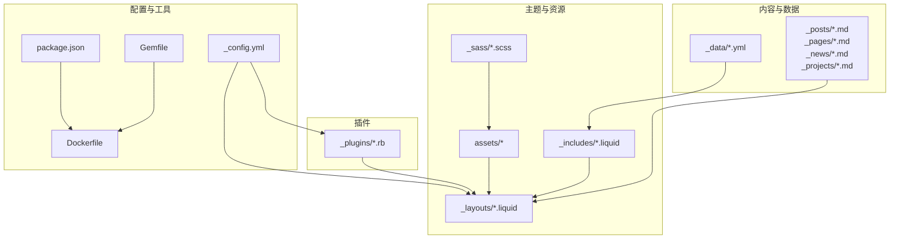
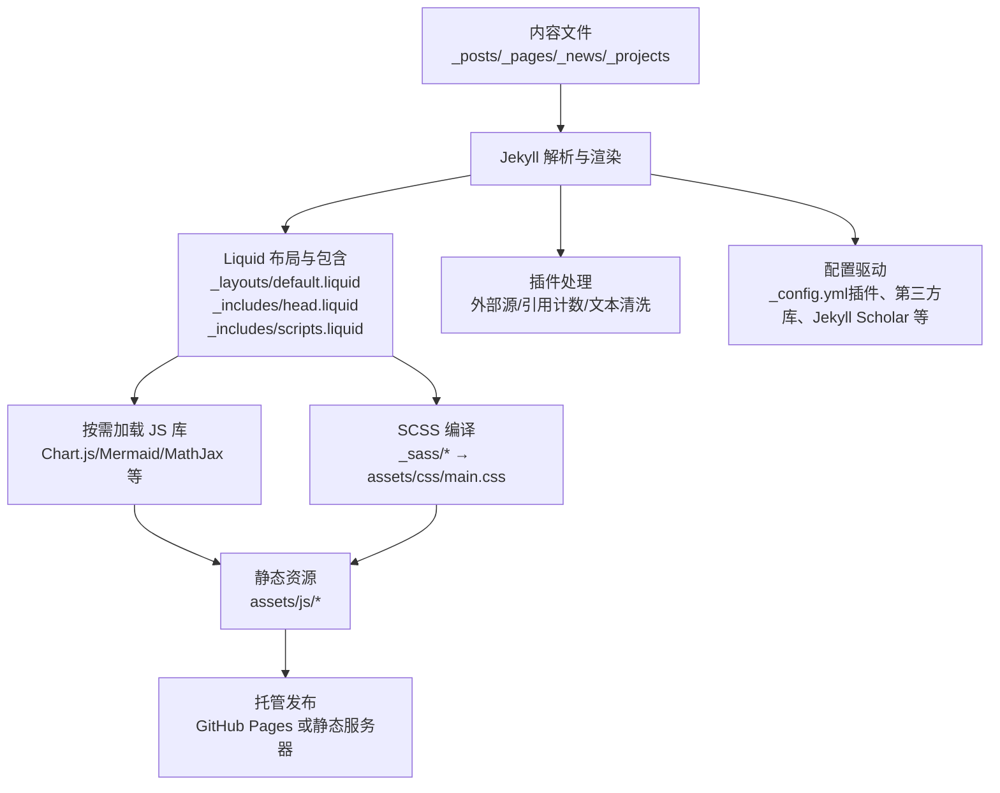
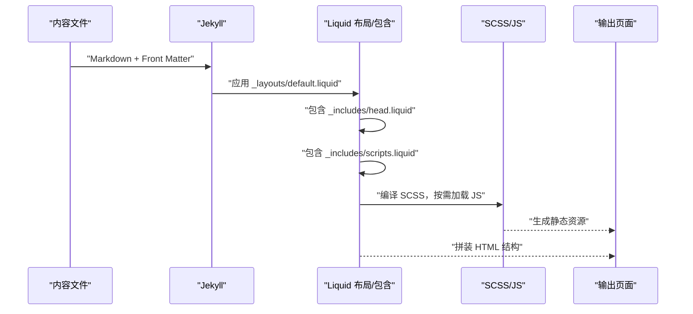
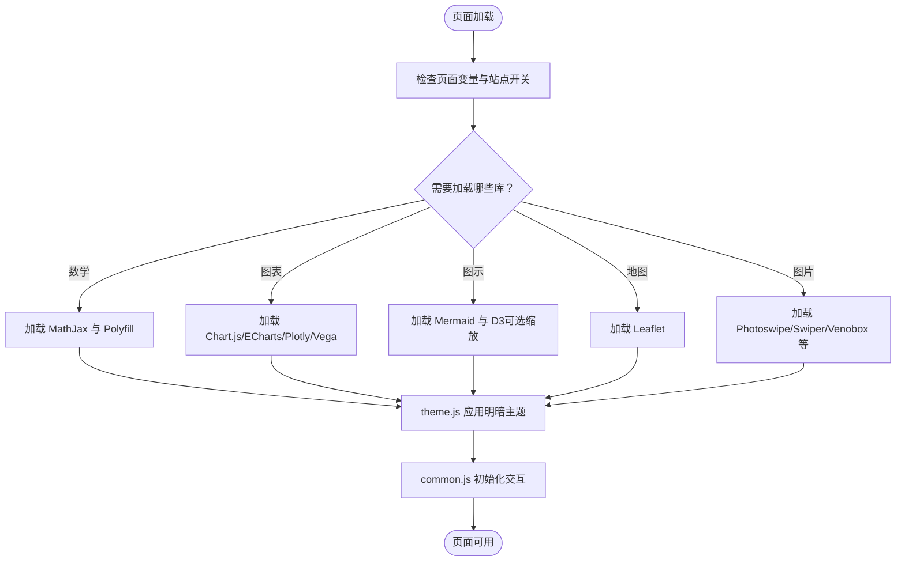
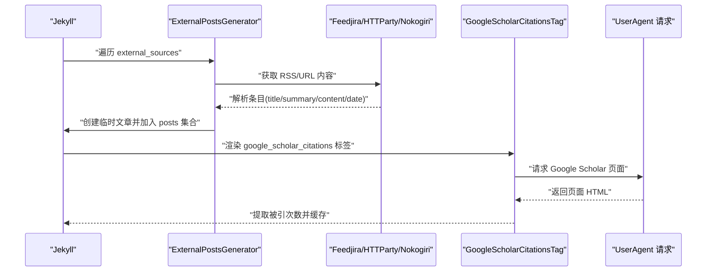
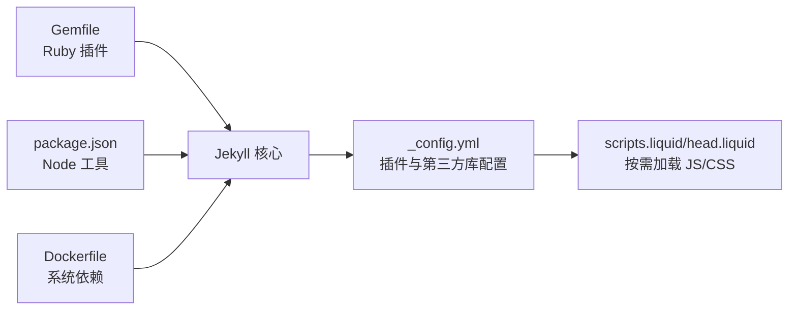

# 技术栈概览

<cite>
**本文引用的文件**
- [_config.yml](file://_config.yml)
- [Gemfile](file://Gemfile)
- [package.json](file://package.json)
- [Dockerfile](file://Dockerfile)
- [README.md](file://README.md)
- [default.liquid](file://_layouts/default.liquid)
- [head.liquid](file://_includes/head.liquid)
- [scripts.liquid](file://_includes/scripts.liquid)
- [common.js](file://assets/js/common.js)
- [theme.js](file://assets/js/theme.js)
- [google-scholar-citations.rb](file://_plugins/google-scholar-citations.rb)
- [external-posts.rb](file://_plugins/external-posts.rb)
- [remove-accents.rb](file://_plugins/remove-accents.rb)
- [socials.yml](file://_data/socials.yml)
- [repositories.yml](file://_data/repositories.yml)
</cite>

## 目录
1. [引言](#引言)
2. [项目结构](#项目结构)
3. [核心组件](#核心组件)
4. [架构总览](#架构总览)
5. [详细组件分析](#详细组件分析)
6. [依赖关系分析](#依赖关系分析)
7. [性能考量](#性能考量)
8. [故障排查指南](#故障排查指南)
9. [结论](#结论)
10. [附录](#附录)

## 引言
本文件面向初学者与有经验的开发者，系统梳理 al-folio 项目的整体技术栈与实现方式，重点覆盖以下方面：
- Jekyll 静态网站生成器的工作原理与技术优势，以及为何选择 Jekyll 而非传统 CMS（如 WordPress）。
- al-folio 主题的技术架构：Liquid 模板语言、SCSS 预处理、JavaScript 库集成与按需加载策略。
- 第三方库与服务集成：MathJax、Chart.js、Mermaid、GitHub API、Google Scholar、评论系统（Giscus）、统计与搜索等。
- 开发工具链：Ruby 环境、Node.js 工具、构建与打包流程、Docker 容器化。
- 部署架构与自动化：本地开发、容器化构建、静态托管与缓存策略。
- 技术选型原因与权衡：可维护性、性能、安全性、SEO、可扩展性。

## 项目结构
al-folio 采用 Jekyll 的标准目录组织，结合主题与自定义插件、数据文件与资源文件，形成“内容 + 主题 + 插件”的清晰分层：
- 内容层：Markdown 文档（_posts、_pages、_news、_projects 等），通过 Front Matter 控制渲染行为。
- 主题层：_layouts、_includes、_sass、assets（CSS/JS/字体/媒体）。
- 数据层：_data（YAML），用于动态注入导航、社交链接、仓库列表等。
- 插件层：_plugins（Ruby 扩展），增强构建期功能（外部源聚合、Scholar 引用计数、文本清洗等）。
- 配置层：_config.yml（站点元信息、插件启用、第三方库版本与完整性校验、Jekyll Scholar、归档与分页等）。
- 构建与运行：Gemfile（Ruby 依赖）、package.json（Node 工具链）、Dockerfile（容器化构建与运行）。

图表来源
- [_config.yml](file://_config.yml)
- [Gemfile](file://Gemfile)
- [package.json](file://package.json)
- [Dockerfile](file://Dockerfile)

章节来源
- [_config.yml](file://_config.yml)
- [README.md](file://README.md)

## 核心组件
- Jekyll 核心：基于 Ruby 的静态站点生成器，负责解析内容、应用布局与插件、输出静态 HTML/CSS/JS。
- Liquid 模板：在 _layouts 与 _includes 中使用，实现页面结构、头部元数据、脚本与样式按需加载。
- SCSS 预处理：通过 Jekyll 的 sass 编译器压缩输出，配合主题变量与暗色模式切换。
- JavaScript 库与交互：按需加载图表（Chart.js、ECharts、Plotly、Vega）、图示（Mermaid、D3）、地图（Leaflet）、图片对比/画廊（Photoswipe、Swiper、Venobox）、搜索（ninja-keys）等。
- 插件生态：外部博客聚合、Google Scholar 引用计数、文本清洗、缓存破坏等。
- 第三方服务：MathJax 数学公式、Giscus 评论、统计（Analytics）、RSS/Atom、GitHub API（仓库与徽章）。

章节来源
- [_config.yml](file://_config.yml)
- [Gemfile](file://Gemfile)
- [package.json](file://package.json)
- [default.liquid](file://_layouts/default.liquid)
- [head.liquid](file://_includes/head.liquid)
- [scripts.liquid](file://_includes/scripts.liquid)

## 架构总览
下图展示从内容到最终页面的关键路径：内容文件经 Jekyll 解析，Liquid 布局与包含文件组合，SCSS 编译为 CSS，按需加载 JS 库，最终生成静态页面并由托管平台发布。

图表来源
- [_config.yml](file://_config.yml)
- [default.liquid](file://_layouts/default.liquid)
- [head.liquid](file://_includes/head.liquid)
- [scripts.liquid](file://_includes/scripts.liquid)

## 详细组件分析

### Jekyll 与 Liquid 模板体系
- 布局与包含：default.liquid 统一包裹页面结构，head.liquid 注入元数据、样式与图标，scripts.liquid 按页面需求加载 JS 库。
- 条件加载：scripts.liquid 依据页面变量（如 mermaid、chart、map、math 等）与站点开关（enable_*）决定是否引入对应库。
- 头部与样式：head.liquid 动态注入第三方库样式与高亮主题，支持明暗模式下的不同样式表。

图表来源
- [default.liquid](file://_layouts/default.liquid)
- [head.liquid](file://_includes/head.liquid)
- [scripts.liquid](file://_includes/scripts.liquid)

章节来源
- [default.liquid](file://_layouts/default.liquid)
- [head.liquid](file://_includes/head.liquid)
- [scripts.liquid](file://_includes/scripts.liquid)

### SCSS 与主题系统
- 编译与压缩：_config.yml 启用 sass.style: compressed，减少体积。
- 明暗模式：theme.js 在运行时切换高亮主题与组件主题，并更新表格、Jupyter Notebook 等元素的主题属性。
- 字体与图标：head.liquid 引入 Google Fonts 与学术图标库，确保跨设备一致性。

章节来源
- [_config.yml](file://_config.yml)
- [head.liquid](file://_includes/head.liquid)
- [theme.js](file://assets/js/theme.js)

### JavaScript 库与交互
- 按需加载：scripts.liquid 依据页面变量与站点开关引入 Chart.js、Mermaid、MathJax、Leaflet、Photoswipe、Swiper、Vega 等。
- 主题联动：theme.js 将明暗模式同步到各可视化库，如设置 Mermaid 主题、Diff2Html 主题、ECharts 主题、Plotly 主题、Vega-Lite 主题等。
- 通用交互：common.js 实现摘要/奖项/BibTeX 的展开切换、侧边栏目录初始化、Jupyter Notebook 主题注入等。

图表来源
- [scripts.liquid](file://_includes/scripts.liquid)
- [theme.js](file://assets/js/theme.js)
- [common.js](file://assets/js/common.js)

章节来源
- [scripts.liquid](file://_includes/scripts.liquid)
- [theme.js](file://assets/js/theme.js)
- [common.js](file://assets/js/common.js)

### 第三方服务与集成
- 数学公式：MathJax 通过 scripts.liquid 条件加载，_config.yml 提供版本与完整性校验；Polyfill 保证兼容性。
- 图表与可视化：Chart.js、ECharts、Plotly、Vega-Lite 通过 scripts.liquid 按需引入，theme.js 在暗色模式下切换主题。
- Mermaid 与 D3：Mermaid 支持缩放（需 D3），theme.js 重新初始化并设置主题。
- 地图：Leaflet 用于 GeoJSON/地图组件，_config.yml 提供 CDN 与完整性校验。
- 评论系统：Giscus（推荐）与 Disqus（已弃用）在 _config.yml 中配置，theme.js 通过 postMessage 同步主题。
- 统计与验证：Google Analytics、Cronitor、Pirsch、OpenPanel 可在 _config.yml 开启，theme.js 更新搜索框主题。
- 搜索：ninja-keys 作为模块加载，支持快捷键与搜索数据。
- GitHub 集成：_data/repositories.yml 配置用户与仓库，_includes/repository/*.liquid 渲染徽章与 Trophy。

章节来源
- [_config.yml](file://_config.yml)
- [scripts.liquid](file://_includes/scripts.liquid)
- [theme.js](file://assets/js/theme.js)
- [repositories.yml](file://_data/repositories.yml)

### 插件生态与构建期增强
- 外部文章聚合：external-posts.rb 支持 RSS 与直接 URL 列表，抓取标题、摘要与正文，生成临时文章以纳入站点。
- Google Scholar 引用计数：google-scholar-citations.rb 通过解析 Google Scholar 页面元标签提取“被引次数”，带随机延时避免封禁。
- 文本清洗：remove-accents.rb 移除重音字符，便于生成稳定 URL。
- 其他插件：Gemfile 中启用 jekyll-scholar、jekyll-feed、jekyll-minifier、jekyll-terser、jekyll-paginate-v2 等，提升学术展示、订阅、压缩与分页体验。

图表来源
- [external-posts.rb](file://_plugins/external-posts.rb)
- [google-scholar-citations.rb](file://_plugins/google-scholar-citations.rb)

章节来源
- [external-posts.rb](file://_plugins/external-posts.rb)
- [google-scholar-citations.rb](file://_plugins/google-scholar-citations.rb)
- [remove-accents.rb](file://_plugins/remove-accents.rb)
- [Gemfile](file://Gemfile)

### 数据驱动的社交与仓库展示
- 社交链接：_data/socials.yml 定义邮箱、GitHub、Google Scholar 等，模板中按顺序渲染。
- 仓库与徽章：_data/repositories.yml 定义用户与仓库列表，通过 _includes/repository/*.liquid 渲染 README Stats 与 Trophy。

章节来源
- [socials.yml](file://_data/socials.yml)
- [repositories.yml](file://_data/repositories.yml)

## 依赖关系分析
- Ruby 生态：Jekyll 核心与官方/社区插件通过 Gemfile 管理；Dockerfile 安装 Ruby、Bundler、Node.js、ImageMagick 等系统依赖。
- Node 生态：package.json 提供 Prettier 与 jekyll 包，辅助格式化与本地调试。
- 第三方库：_config.yml 的 third_party_libraries 字段集中声明版本、CDN 与完整性校验，scripts.liquid/head.liquid 按需引用。

图表来源
- [Gemfile](file://Gemfile)
- [package.json](file://package.json)
- [Dockerfile](file://Dockerfile)
- [_config.yml](file://_config.yml)
- [scripts.liquid](file://_includes/scripts.liquid)
- [head.liquid](file://_includes/head.liquid)

章节来源
- [Gemfile](file://Gemfile)
- [package.json](file://package.json)
- [Dockerfile](file://Dockerfile)
- [_config.yml](file://_config.yml)

## 性能考量
- 静态优先：Jekyll 生成纯静态页面，无需数据库与服务器端计算，天然具备高性能与低延迟。
- 资源压缩：sass.style: compressed、jekyll-minifier 与 jekyll-terser 减少体积；按需加载 JS/CSS 降低首屏负担。
- 缓存策略：head.liquid 使用 bust_file_cache/bust_css_cache，theme.js 通过缓存破坏与本地存储优化用户体验。
- 图像优化：_config.yml 启用 lazy_loading_images；jekyll-imagemagick 生成 WebP 多尺寸响应式图像。
- 第三方库完整性：third_party_libraries 提供 SRI 校验，确保 CDN 资源可信，避免中间人攻击与回源失败。

## 故障排查指南
- 构建权限问题（Docker）：Dockerfile 注释中提示可能的权限错误，建议以非 root 用户运行或调整工作目录权限。
- 第三方库加载失败：确认 _config.yml 中 third_party_libraries 的版本与 CDN 可达性；检查 scripts.liquid/head.liquid 是否正确注入。
- MathJax 渲染异常：检查 _config.yml 的 enable_math 开关与 scripts.liquid 的条件加载；确保 Polyfill 正常加载。
- 明暗主题不一致：theme.js 会同步到多种可视化库，若个别库未生效，检查其初始化时机与 DOM 结构。
- 外部源聚合失败：external-posts.rb 依赖 HTTParty、Feedjira、Nokogiri，确认网络可达与 RSS/URL 正确；查看日志输出定位问题。
- Google Scholar 引用计数异常：google-scholar-citations.rb 对目标页面进行解析，若被反爬或改版，需更新选择器或降级处理。

章节来源
- [Dockerfile](file://Dockerfile)
- [scripts.liquid](file://_includes/scripts.liquid)
- [head.liquid](file://_includes/head.liquid)
- [theme.js](file://assets/js/theme.js)
- [external-posts.rb](file://_plugins/external-posts.rb)
- [google-scholar-citations.rb](file://_plugins/google-scholar-citations.rb)

## 结论
al-folio 以 Jekyll 为核心，结合 Liquid 模板、SCSS 预处理与丰富的 JavaScript 库，构建出高性能、可定制、易维护的学术型个人主页。通过插件扩展与数据驱动，满足多场景展示需求；借助容器化与 CDN，实现稳定的开发与部署体验。技术选型在可维护性、性能与可扩展性之间取得良好平衡，适合长期演进与团队协作。

## 附录
- 术语速览
  - Jekyll：静态站点生成器（Ruby）
  - Liquid：模板语言（嵌入式）
  - SCSS：CSS 预处理器
  - CDN：内容分发网络
  - SRI：子资源完整性
  - RSS/Atom：订阅协议
  - SPA：单页应用（概念性对比）
- 与 CMS 的区别
  - Jekyll 生成静态页面，无需数据库与服务器端渲染，部署简单、安全、成本低；CMS（如 WordPress）动态生成页面，功能强大但复杂度更高、维护成本更大。
- 最佳实践
  - 使用 _config.yml 集中管理第三方库版本与完整性校验。
  - 通过插件扩展能力，保持主题与业务逻辑分离。
  - 合理使用按需加载，避免不必要的资源开销。
  - 在 Docker 中统一环境，减少“在我机器上能跑”的差异。