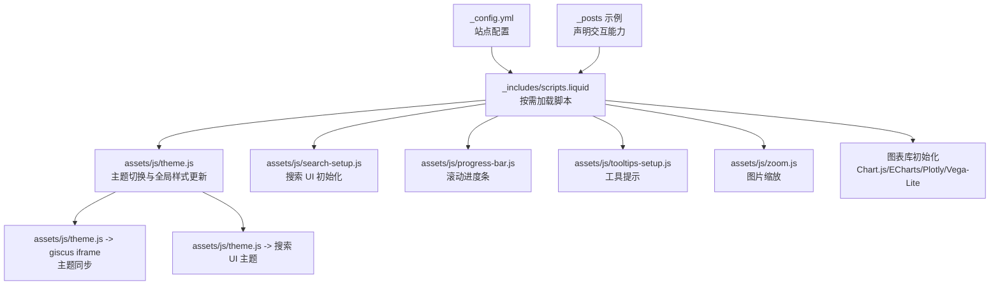
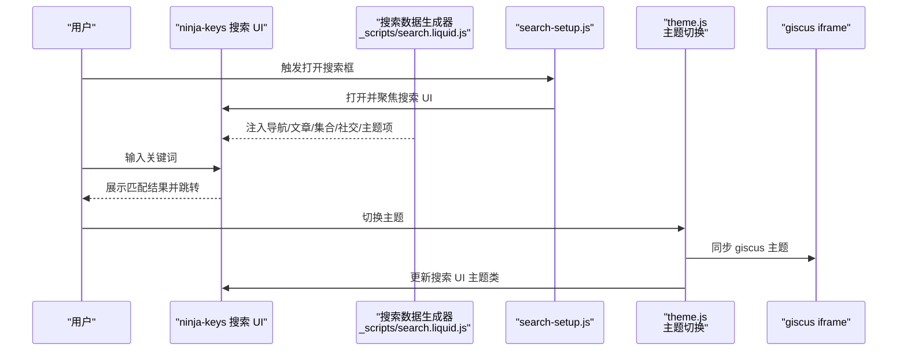
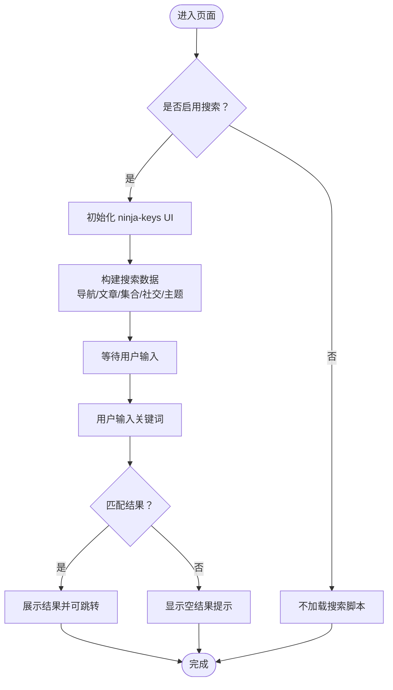
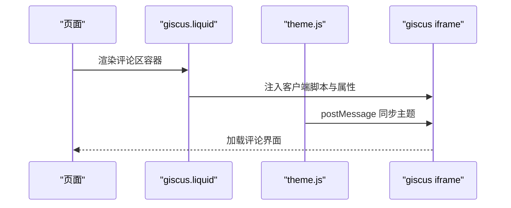
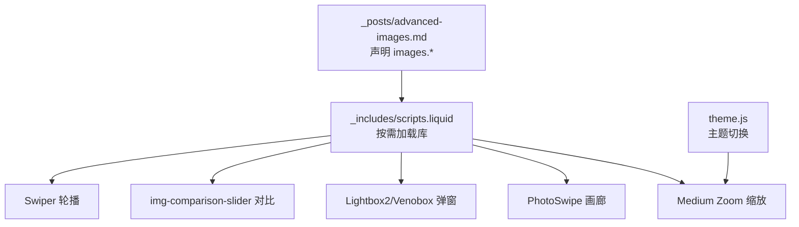
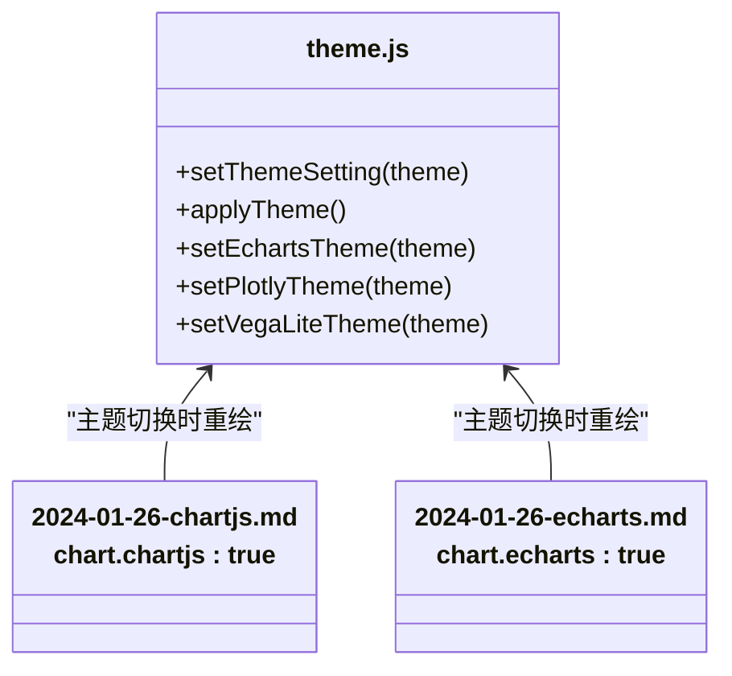
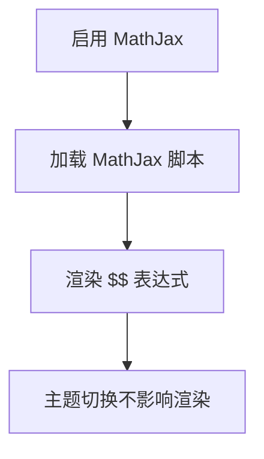
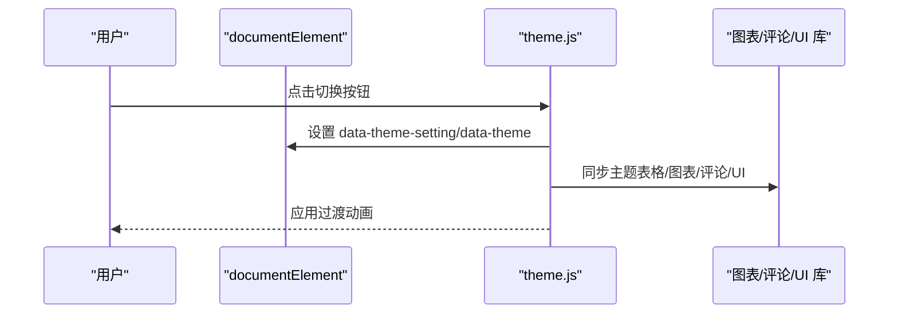
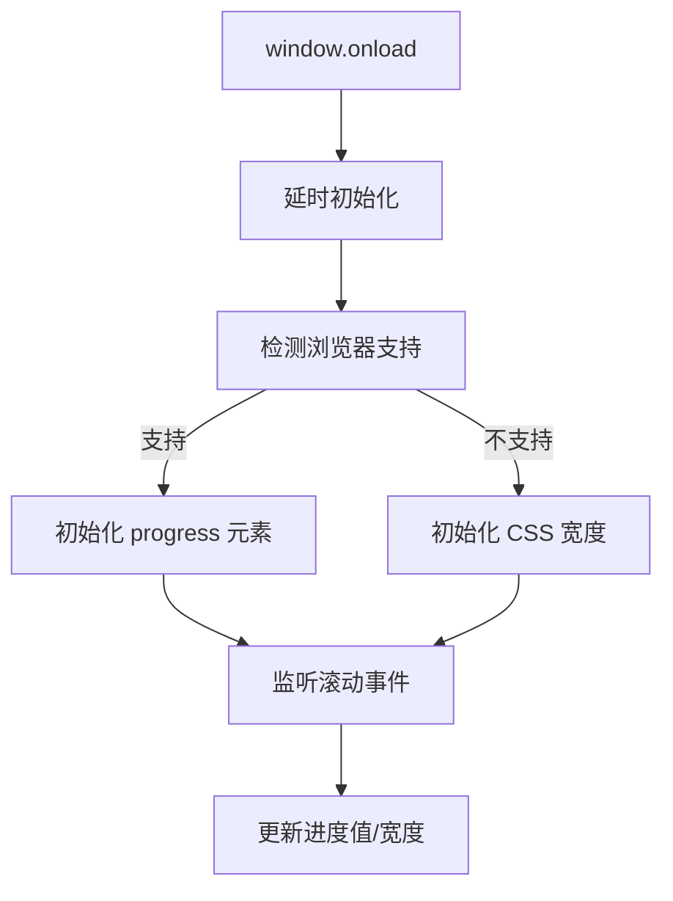
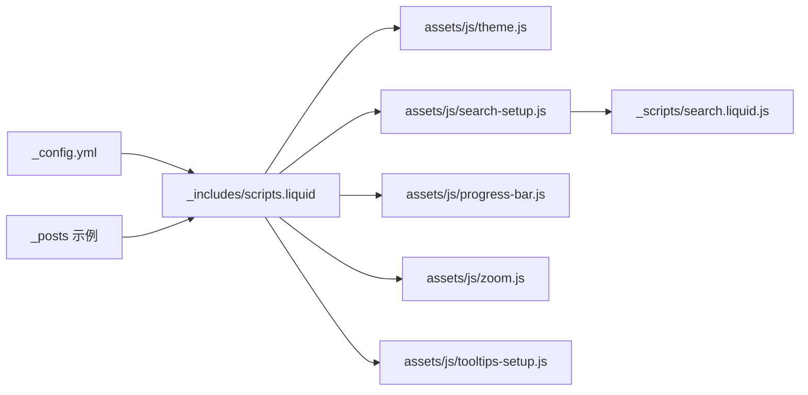

# 交互功能模块

<cite>
**本文引用的文件**
- [_config.yml](file://_config.yml)
- [_includes/scripts.liquid](file://_includes/scripts.liquid)
- [_includes/giscus.liquid](file://_includes/giscus.liquid)
- [_includes/disqus.liquid](file://_includes/disqus.liquid)
- [_scripts/search.liquid.js](file://_scripts/search.liquid.js)
- [assets/js/search-setup.js](file://assets/js/search-setup.js)
- [assets/js/theme.js](file://assets/js/theme.js)
- [assets/js/progress-bar.js](file://assets/js/progress-bar.js)
- [assets/js/tooltips-setup.js](file://assets/js/tooltips-setup.js)
- [assets/js/zoom.js](file://assets/js/zoom.js)
- [_posts/2015-10-20-disqus-comments.md](file://_posts/2015-10-20-disqus-comments.md)
- [_posts/2024-01-26-chartjs.md](file://_posts/2024-01-26-chartjs.md)
- [_posts/2024-01-26-echarts.md](file://_posts/2024-01-26-echarts.md)
- [_posts/2024-01-27-advanced-images.md](file://_posts/2024-01-27-advanced-images.md)
- [_posts/2015-10-20-math.md](file://_posts/2015-10-20-math.md)
</cite>

## 目录
1. [简介](#简介)
2. [项目结构](#项目结构)
3. [核心组件](#核心组件)
4. [架构总览](#架构总览)
5. [详细组件分析](#详细组件分析)
6. [依赖关系分析](#依赖关系分析)
7. [性能考量](#性能考量)
8. [故障排查指南](#故障排查指南)
9. [结论](#结论)
10. [附录](#附录)

## 简介
本文件系统化梳理该 Jekyll 主题中的交互功能模块，覆盖搜索、评论系统（Giscus 与 Disqus）、图片画廊与对比、图表可视化（Chart.js、ECharts、Plotly、Vega-Lite）、数学公式渲染、暗色模式切换、滚动进度条、工具提示等核心体验。文档从架构、数据流、处理逻辑、集成点、错误处理与性能优化等维度展开，并提供配置项、自定义方法与无障碍支持建议。

## 项目结构
交互功能主要由以下层次构成：
- 配置层：通过站点配置控制交互开关与行为（如搜索、暗色模式、数学公式、图片缩放等）。
- 模板层：在页面模板中按需加载脚本与组件（如评论区、图表库、图片库）。
- 脚本层：前端脚本负责初始化第三方库、主题切换、搜索 UI、进度条、工具提示、图片缩放等。
- 示例内容：通过文章 Front Matter 声明启用特定交互能力（如图表、图片组件、数学公式）。

**图示来源**
- [_config.yml](file://_config.yml)
- [_includes/scripts.liquid](file://_includes/scripts.liquid)
- [assets/js/theme.js](file://assets/js/theme.js)
- [assets/js/search-setup.js](file://assets/js/search-setup.js)
- [assets/js/progress-bar.js](file://assets/js/progress-bar.js)
- [assets/js/tooltips-setup.js](file://assets/js/tooltips-setup.js)
- [assets/js/zoom.js](file://assets/js/zoom.js)

**章节来源**
- [_config.yml](file://_config.yml)
- [_includes/scripts.liquid](file://_includes/scripts.liquid)

## 核心组件
- 搜索系统：基于 ninja-keys 的全站搜索，支持导航、文章、集合、社交链接与主题切换入口，具备键盘快捷键与主题适配。
- 评论系统：Giscus 推荐方案，支持主题同步；Disqus 已标记为弃用但仍可集成。
- 图片画廊与对比：Swiper 图片轮播、img-comparison-slider 对比滑块、Venobox/Lightbox2 弹窗、PhotoSwipe 等。
- 图表可视化：Chart.js、ECharts、Plotly、Vega-Lite，均通过 Front Matter 声明启用。
- 数学公式渲染：MathJax 3，默认启用，支持行内与块级公式。
- 暗色模式：三态切换（系统/浅色/深色），自动同步至图表、评论、搜索 UI。
- 进度条：滚动进度指示器，兼容原生 progress 元素或降级到 CSS 宽度。
- 工具提示：Bootstrap Tooltip，按需启用。

**章节来源**
- [_config.yml](file://_config.yml)
- [_includes/scripts.liquid](file://_includes/scripts.liquid)
- [_posts/2024-01-26-chartjs.md](file://_posts/2024-01-26-chartjs.md)
- [_posts/2024-01-26-echarts.md](file://_posts/2024-01-26-echarts.md)
- [_posts/2024-01-27-advanced-images.md](file://_posts/2024-01-27-advanced-images.md)
- [_posts/2015-10-20-math.md](file://_posts/2015-10-20-math.md)

## 架构总览
下图展示交互功能的关键调用链与数据流：

**图示来源**
- [_scripts/search.liquid.js](file://_scripts/search.liquid.js)
- [assets/js/search-setup.js](file://assets/js/search-setup.js)
- [assets/js/theme.js](file://assets/js/theme.js)
- [_includes/giscus.liquid](file://_includes/giscus.liquid)

## 详细组件分析

### 搜索系统
- 功能概述
  - 全站索引：导航菜单、文章、集合（除 posts 外）、社交链接、主题切换入口。
  - 行为：支持键盘快捷键打开搜索框，输入即结果，点击跳转或外部打开。
  - 主题适配：根据当前主题动态设置搜索 UI 类名。
- 数据源与生成
  - 通过 Liquid 模板在构建期生成搜索数据，包含标题、描述、分组与处理器。
- 关键实现路径
  - 搜索数据生成：[_scripts/search.liquid.js](file://_scripts/search.liquid.js)
  - 搜索 UI 初始化：[assets/js/search-setup.js](file://assets/js/search-setup.js)
  - 模板加载：[_includes/scripts.liquid](file://_includes/scripts.liquid)
- 配置项
  - 全局开关与子项：search_enabled、posts_in_search、socials_in_search（见 [_config.yml](file://_config.yml)）
- 自定义方法
  - 在生成的数据数组中添加自定义条目（如外部链接、内部导航）。
  - 调整跳转行为（相对路径、外部链接、新窗口打开）。
- 性能优化
  - 使用模块化脚本加载，避免阻塞主流程。
  - 仅在启用时注入搜索 UI 与数据。
- 无障碍支持
  - 提供键盘快捷键打开搜索框，提升可访问性。
  - 结果列表应保持焦点管理与语义化标签。

**图示来源**
- [_scripts/search.liquid.js](file://_scripts/search.liquid.js)
- [assets/js/search-setup.js](file://assets/js/search-setup.js)
- [_includes/scripts.liquid](file://_includes/scripts.liquid)

**章节来源**
- [_scripts/search.liquid.js](file://_scripts/search.liquid.js)
- [assets/js/search-setup.js](file://assets/js/search-setup.js)
- [_includes/scripts.liquid](file://_includes/scripts.liquid)
- [_config.yml](file://_config.yml)

### 评论系统：Giscus 与 Disqus
- Giscus（推荐）
  - 通过动态注入脚本与 iframe 实现评论嵌入，支持主题同步。
  - 配置项丰富：仓库、分类、映射策略、严格模式、反应开关、语言等。
  - 主题同步：通过 postMessage 将主题传递给 giscus iframe。
- Disqus（已弃用）
  - 仍可通过 Front Matter 开启，但官方已不再推荐。
- 集成要点
  - 在页面模板中包含 giscus.liquid 或 disqus.liquid。
  - Giscus 支持“按标题映射”等识别方式，便于跨页面复用讨论。
- 配置项
  - giscus.* 与 disqus_shortname（见 [_config.yml](file://_config.yml)）
- 自定义方法
  - 修改映射字段（如按路径或自定义标识符）以适配不同场景。
  - 调整输入位置（顶部/底部）与反应开关。
- 无障碍支持
  - 提供 noscript 提示，确保无 JS 场景下的可读性。

**图示来源**
- [_includes/giscus.liquid](file://_includes/giscus.liquid)
- [assets/js/theme.js](file://assets/js/theme.js)
- [_posts/2015-10-20-disqus-comments.md](file://_posts/2015-10-20-disqus-comments.md)

**章节来源**
- [_includes/giscus.liquid](file://_includes/giscus.liquid)
- [_includes/disqus.liquid](file://_includes/disqus.liquid)
- [_config.yml](file://_config.yml)
- [_posts/2015-10-20-disqus-comments.md](file://_posts/2015-10-20-disqus-comments.md)

### 图片画廊与对比
- 组件与库
  - Swiper：图片轮播，支持键盘、导航、分页、动态弹球等。
  - img-comparison-slider：前后对比滑块。
  - Lightbox2/Venobox：弹窗查看大图。
  - PhotoSwipe：现代图片画廊。
  - Medium Zoom：中等复杂度缩放（轻量）。
- 启用方式
  - 通过文章 Front Matter 声明 images.* 或在页面中直接使用相应 HTML 标签。
- 主题适配
  - 主题切换时更新 medium-zoom 背景透明度等视觉参数。
- 自定义方法
  - 调整轮播参数（如循环、渐变、方向）。
  - 在对比滑块中插入任意内容（图片、视频等）。
- 无障碍支持
  - 为轮播与对比组件提供可访问的 ARIA 属性与键盘操作。

**图示来源**
- [_posts/2024-01-27-advanced-images.md](file://_posts/2024-01-27-advanced-images.md)
- [_includes/scripts.liquid](file://_includes/scripts.liquid)
- [assets/js/theme.js](file://assets/js/theme.js)
- [assets/js/zoom.js](file://assets/js/zoom.js)

**章节来源**
- [_posts/2024-01-27-advanced-images.md](file://_posts/2024-01-27-advanced-images.md)
- [_includes/scripts.liquid](file://_includes/scripts.liquid)
- [assets/js/theme.js](file://assets/js/theme.js)
- [assets/js/zoom.js](file://assets/js/zoom.js)

### 图表可视化
- 支持库
  - Chart.js：线图、饼图等，通过 Front Matter 声明启用。
  - ECharts：柱状图、响应式布局，支持浅/深主题。
  - Plotly：交互式图表，主题切换时重绘布局模板。
  - Vega-Lite：声明式可视化，支持主题切换。
- 启用方式
  - 在文章 Front Matter 中设置 chart.* 字段（如 chart.chartjs、chart.echarts）。
- 主题适配
  - theme.js 在主题切换时重新初始化或重绘图表，保证颜色一致性。
- 自定义方法
  - 为每个图表库准备独立的初始化脚本（如 chartjs-setup.js、echarts-setup.js、plotly-setup.js、vega-setup.js）。
  - 在 Markdown 中嵌入 JSON 配置，渲染为图表。
- 无障碍支持
  - 为图表提供可选的文本替代与可访问标签，确保屏幕阅读器可用。

**图示来源**
- [assets/js/theme.js](file://assets/js/theme.js)
- [_posts/2024-01-26-chartjs.md](file://_posts/2024-01-26-chartjs.md)
- [_posts/2024-01-26-echarts.md](file://_posts/2024-01-26-echarts.md)

**章节来源**
- [_posts/2024-01-26-chartjs.md](file://_posts/2024-01-26-chartjs.md)
- [_posts/2024-01-26-echarts.md](file://_posts/2024-01-26-echarts.md)
- [_includes/scripts.liquid](file://_includes/scripts.liquid)
- [assets/js/theme.js](file://assets/js/theme.js)

### 数学公式渲染
- 引擎与配置
  - MathJax 3，默认启用，支持行内与块级公式。
  - 可选择伪代码渲染（pseudocode）或标准 MathJax 渲染。
- 启用方式
  - 在文章中使用 $$ 或 \begin{equation}...\end{equation} 包裹公式。
- 主题适配
  - 主题切换时保持公式渲染一致性，无需额外处理。
- 自定义方法
  - 调整 polyfill 与 MathJax 资源版本（见站点配置）。
- 无障碍支持
  - 为复杂公式提供简短描述或替代文本，提升可读性。

**图示来源**
- [_config.yml](file://_config.yml)
- [_posts/2015-10-20-math.md](file://_posts/2015-10-20-math.md)
- [_includes/scripts.liquid](file://_includes/scripts.liquid)

**章节来源**
- [_config.yml](file://_config.yml)
- [_posts/2015-10-20-math.md](file://_posts/2015-10-20-math.md)
- [_includes/scripts.liquid](file://_includes/scripts.liquid)

### 暗色模式切换
- 切换机制
  - 三态：系统/浅色/深色；默认系统。
  - 本地存储持久化；监听系统偏好变化。
- 主题应用
  - 更新根元素 data-theme 与 data-theme-setting。
  - 同步至表格、Jupyter Notebook、Medium Zoom、Mermaid、Diff2Html、ECharts、Plotly、Vega-Lite、Giscus 与搜索 UI。
- 动画过渡
  - 切换时添加过渡类，平滑改变视觉状态。
- 自定义方法
  - 通过 theme.js 的 setThemeSetting/applyTheme 扩展更多组件的主题同步。
- 无障碍支持
  - 优先尊重系统偏好；提供手动切换入口。

**图示来源**
- [assets/js/theme.js](file://assets/js/theme.js)

**章节来源**
- [assets/js/theme.js](file://assets/js/theme.js)
- [_config.yml](file://_config.yml)

### 滚动进度条
- 功能概述
  - 显示当前滚动进度，支持原生 progress 元素或降级到 CSS 宽度。
  - 自适应窗口大小变化，修正导航栏高度影响。
- 实现要点
  - onload 延迟初始化，避免图片尺寸未就绪导致计算偏差。
  - 监听滚动与窗口事件，实时更新进度值或宽度百分比。
- 自定义方法
  - 调整进度条样式与定位，适配不同布局。
- 无障碍支持
  - 不对可访问性造成干扰；可选隐藏以减少视觉负担。

**图示来源**
- [assets/js/progress-bar.js](file://assets/js/progress-bar.js)

**章节来源**
- [assets/js/progress-bar.js](file://assets/js/progress-bar.js)

### 工具提示
- 功能概述
  - 基于 Bootstrap Tooltip，按需启用。
- 使用方式
  - 在元素上添加 data-toggle="tooltip" 等属性即可生效。
- 自定义方法
  - 调整触发方式（hover/click）、位置与样式。
- 无障碍支持
  - 确保提示内容简洁明确，避免冗长文本。

**章节来源**
- [assets/js/tooltips-setup.js](file://assets/js/tooltips-setup.js)
- [_includes/scripts.liquid](file://_includes/scripts.liquid)

## 依赖关系分析
- 配置驱动：站点配置决定是否加载相关脚本与功能。
- 模板按需：scripts.liquid 根据页面 Front Matter 与配置条件加载第三方库。
- 主题统一：theme.js 作为中枢，协调多组件的主题同步。
- 数据驱动：搜索数据由 Liquid 在构建期生成，运行时注入 UI。

**图示来源**
- [_config.yml](file://_config.yml)
- [_includes/scripts.liquid](file://_includes/scripts.liquid)
- [_scripts/search.liquid.js](file://_scripts/search.liquid.js)
- [assets/js/theme.js](file://assets/js/theme.js)
- [assets/js/search-setup.js](file://assets/js/search-setup.js)
- [assets/js/progress-bar.js](file://assets/js/progress-bar.js)
- [assets/js/zoom.js](file://assets/js/zoom.js)
- [assets/js/tooltips-setup.js](file://assets/js/tooltips-setup.js)

**章节来源**
- [_config.yml](file://_config.yml)
- [_includes/scripts.liquid](file://_includes/scripts.liquid)
- [_scripts/search.liquid.js](file://_scripts/search.liquid.js)

## 性能考量
- 资源加载
  - 使用 defer 与模块化脚本，避免阻塞渲染。
  - 第三方库通过 CDN 加载，必要时可启用本地下载（third_party_libraries.download）。
- 渲染优化
  - MathJax 与图表在主题切换时按需重绘，避免重复初始化。
  - 搜索数据在构建期生成，运行时仅消费，降低 CPU 占用。
- 交互体验
  - medium zoom、图片对比滑块等采用懒加载与事件节流，减少重排。
- 建议
  - 控制一次性加载的图表数量，采用“滚动触发展示”策略。
  - 合理设置搜索数据规模，避免过长的匹配链路。

[本节为通用指导，无需具体文件引用]

## 故障排查指南
- 搜索无结果或无法打开
  - 检查 search_enabled 与 posts_in_search、socials_in_search 是否开启。
  - 确认 ninja-keys 组件已正确注入与初始化。
  - 参考：[_includes/scripts.liquid](file://_includes/scripts.liquid)、[assets/js/search-setup.js](file://assets/js/search-setup.js)、[_scripts/search.liquid.js](file://_scripts/search.liquid.js)
- 评论区不显示
  - Giscus：检查 giscus.* 配置是否完整，确认仓库与分类存在且公开。
  - Disqus：确认 disqus_shortname 正确，且页面 Front Matter 中未禁用。
  - 参考：[_includes/giscus.liquid](file://_includes/giscus.liquid)、[_includes/disqus.liquid](file://_includes/disqus.liquid)、[_config.yml](file://_config.yml)
- 图表不显示或主题错乱
  - 确认文章 Front Matter 中已声明对应 chart.*。
  - 主题切换后需重新初始化图表，检查 theme.js 的 setXxxTheme 方法。
  - 参考：[_posts/2024-01-26-chartjs.md](file://_posts/2024-01-26-chartjs.md)、[_posts/2024-01-26-echarts.md](file://_posts/2024-01-26-echarts.md)、[assets/js/theme.js](file://assets/js/theme.js)
- 数学公式不渲染
  - 确认 enable_math 已启用，表达式格式正确。
  - 参考：[_config.yml](file://_config.yml)、[_posts/2015-10-20-math.md](file://_posts/2015-10-20-math.md)
- 图片缩放或对比无效
  - 检查 images.* 声明与相应库是否加载。
  - 参考：[_posts/2024-01-27-advanced-images.md](file://_posts/2024-01-27-advanced-images.md)、[assets/js/zoom.js](file://assets/js/zoom.js)
- 进度条不更新
  - 确认页面存在滚动内容，且未被其他元素遮挡。
  - 参考：[assets/js/progress-bar.js](file://assets/js/progress-bar.js)

**章节来源**
- [_includes/scripts.liquid](file://_includes/scripts.liquid)
- [assets/js/search-setup.js](file://assets/js/search-setup.js)
- [_scripts/search.liquid.js](file://_scripts/search.liquid.js)
- [_includes/giscus.liquid](file://_includes/giscus.liquid)
- [_includes/disqus.liquid](file://_includes/disqus.liquid)
- [_config.yml](file://_config.yml)
- [_posts/2024-01-26-chartjs.md](file://_posts/2024-01-26-chartjs.md)
- [_posts/2024-01-26-echarts.md](file://_posts/2024-01-26-echarts.md)
- [_posts/2015-10-20-math.md](file://_posts/2015-10-20-math.md)
- [_posts/2024-01-27-advanced-images.md](file://_posts/2024-01-27-advanced-images.md)
- [assets/js/theme.js](file://assets/js/theme.js)
- [assets/js/zoom.js](file://assets/js/zoom.js)
- [assets/js/progress-bar.js](file://assets/js/progress-bar.js)

## 结论
该主题通过配置驱动与模板按需加载的方式，将搜索、评论、图片、图表、公式、主题切换、进度条与工具提示等交互能力有机整合。其核心优势在于：
- 明确的开关与配置项，便于按需启用；
- 统一的主题中枢，保障多组件一致性；
- 构建期生成搜索数据，运行时高效消费；
- 对主流第三方库的良好封装与扩展接口。

建议在实际部署中结合业务需求，合理裁剪与扩展交互能力，并持续关注第三方库版本与兼容性。

[本节为总结性内容，无需具体文件引用]

## 附录
- 配置项速览（部分）
  - 搜索：search_enabled、posts_in_search、socials_in_search
  - 评论：giscus.*、disqus_shortname
  - 图表：chart.chartjs、chart.echarts、chart.plotly、chart.vega_lite
  - 图片：images.compare、images.lightbox2、images.photoswipe、images.slider、images.spotlight、images.venobox
  - 数学：enable_math
  - 主题：enable_darkmode、enable_tooltips、enable_medium_zoom、enable_progressbar
- 自定义清单
  - 在 _scripts/search.liquid.js 中扩展搜索数据项。
  - 在 assets/js/theme.js 中新增组件主题同步逻辑。
  - 在 _includes/scripts.liquid 中按需引入新库。
  - 在文章 Front Matter 中声明所需交互能力。

**章节来源**
- [_config.yml](file://_config.yml)
- [_includes/scripts.liquid](file://_includes/scripts.liquid)
- [_scripts/search.liquid.js](file://_scripts/search.liquid.js)
- [assets/js/theme.js](file://assets/js/theme.js)