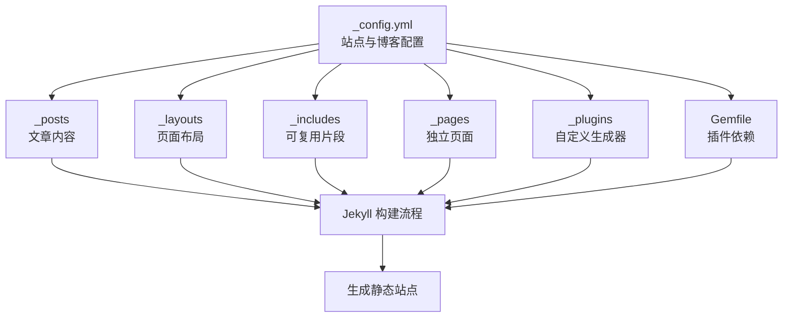
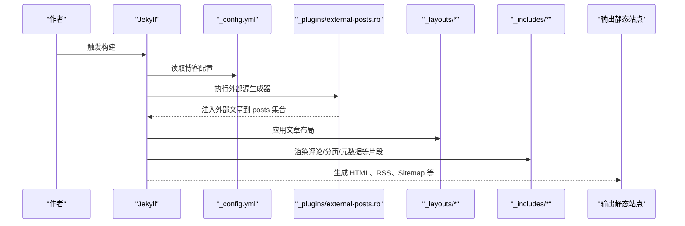
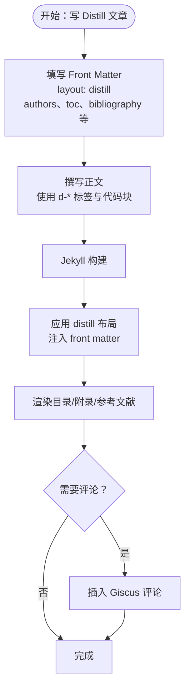
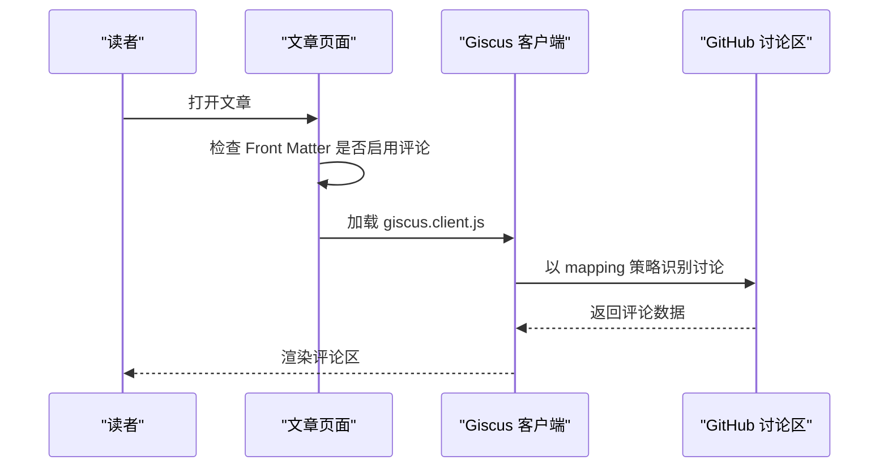
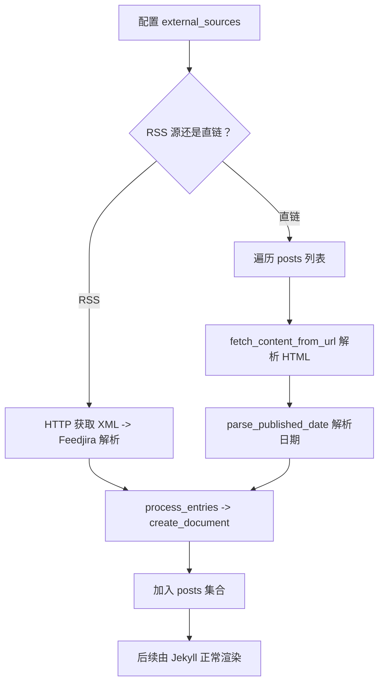
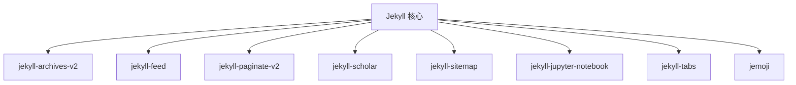

# 博客内容系统

<cite>
**本文档引用的文件**
- [_config.yml](file://_config.yml)
- [Gemfile](file://Gemfile)
- [_layouts/distill.liquid](file://_layouts/distill.liquid)
- [_includes/giscus.liquid](file://_includes/giscus.liquid)
- [_includes/disqus.liquid](file://_includes/disqus.liquid)
- [_plugins/external-posts.rb](file://_plugins/external-posts.rb)
- [_includes/related_posts.liquid](file://_includes/related_posts.liquid)
- [_includes/pagination.liquid](file://_includes/pagination.liquid)
- [_includes/head.liquid](file://_includes/head.liquid)
- [_includes/metadata.liquid](file://_includes/metadata.liquid)
- [_pages/blog.md](file://_pages/blog.md)
- [_posts/2018-12-22-distill.md](file://_posts/2018-12-22-distill.md)
- [_posts/2015-10-20-disqus-comments.md](file://_posts/2015-10-20-disqus-comments.md)
- [_posts/2022-12-10-giscus-comments.md](file://_posts/2022-12-10-giscus-comments.md)
- [README.md](file://README.md)
</cite>

## 目录
1. [简介](#简介)
2. [项目结构](#项目结构)
3. [核心组件](#核心组件)
4. [架构总览](#架构总览)
5. [详细组件分析](#详细组件分析)
6. [依赖关系分析](#依赖关系分析)
7. [性能考虑](#性能考虑)
8. [故障排除指南](#故障排除指南)
9. [结论](#结论)
10. [附录](#附录)

## 简介
本项目是一个基于 Jekyll 的学术型博客内容系统，采用 al-folio 主题，支持：
- 文章创建与 Front Matter 配置
- 标签与分类归档
- 外部源集成（RSS/链接）
- 评论系统（Giscus 推荐，Disqus 兼容）
- Distill 风格文章渲染
- 相关文章推荐、分页、RSS 订阅、SEO 优化
- 前端交互与第三方库集成

## 项目结构
该仓库采用 Jekyll 标准目录组织，关键目录与文件职责如下：
- _config.yml：站点与博客配置（博客名称、描述、永久链接、分页、评论、外部源、集合、插件等）
- _posts：博客文章（Markdown + Front Matter），含 Distill 示例与评论示例
- _layouts：页面布局（含 distill 布局用于 Distill 风格文章）
- _includes：可复用片段（评论、分页、元数据、脚本、相关文章等）
- _plugins：自定义生成器（外部文章抓取）
- _pages：独立页面（如博客首页）
- _sass、assets：样式与资源
- Gemfile：Jekyll 插件依赖声明
- README.md：功能特性与使用说明

**图表来源**
- [_config.yml](file://_config.yml)
- [_posts](file://_posts)
- [_layouts](file://_layouts)
- [_includes](file://_includes)
- [_pages](file://_pages)
- [_plugins](file://_plugins)
- [Gemfile](file://Gemfile)

**章节来源**
- [_config.yml](file://_config.yml)
- [Gemfile](file://Gemfile)

## 核心组件
- 博客配置与功能开关
  - 博客名称与描述、永久链接格式、分页开关
  - 相关文章推荐数量与开关
  - Giscus 评论系统配置（仓库、分类、映射策略、主题、语言等）
  - Disqus 短名称（已标注为弃用）
  - 外部源：RSS 源与直链文章列表
- 文章与布局
  - 标准 post 布局与 Distill 布局
  - 文章 Front Matter 支持 tags、categories、authors、toc、bibliography 等
- 评论系统
  - Giscus：通过 include 片段动态注入客户端脚本
  - Disqus：兼容嵌入（已标注弃用）
- 外部源集成
  - external-posts.rb：从 RSS 或指定 URL 抓取内容，注入到 posts 集合
- 分页与相关文章
  - 分页：Jekyll Paginate v2；模板 include 提供分页导航
  - 相关文章：基于 LSI 的推荐，模板 include 输出列表
- SEO 与元数据
  - metadata.liquid：生成 OpenGraph、Schema.org、网站验证等
  - head.liquid：按需加载第三方库与样式

**章节来源**
- [_config.yml](file://_config.yml)
- [_layouts/distill.liquid](file://_layouts/distill.liquid)
- [_includes/giscus.liquid](file://_includes/giscus.liquid)
- [_includes/disqus.liquid](file://_includes/disqus.liquid)
- [_plugins/external-posts.rb](file://_plugins/external-posts.rb)
- [_includes/related_posts.liquid](file://_includes/related_posts.liquid)
- [_includes/pagination.liquid](file://_includes/pagination.liquid)
- [_includes/metadata.liquid](file://_includes/metadata.liquid)
- [_includes/head.liquid](file://_includes/head.liquid)

## 架构总览
Jekyll 在构建时读取配置、遍历集合、应用布局与 include 片段，最终输出静态页面。外部源通过自定义生成器在构建期注入。

**图表来源**
- [_config.yml](file://_config.yml)
- [_plugins/external-posts.rb](file://_plugins/external-posts.rb)
- [_layouts/distill.liquid](file://_layouts/distill.liquid)
- [_includes/giscus.liquid](file://_includes/giscus.liquid)
- [_includes/disqus.liquid](file://_includes/disqus.liquid)
- [_includes/pagination.liquid](file://_includes/pagination.liquid)
- [_includes/metadata.liquid](file://_includes/metadata.liquid)

## 详细组件分析

### 博客配置与参数
- 博客基础信息
  - blog_name、blog_description：博客首页标题与描述
  - permalink：文章永久链接格式（如 /blog/:year/:title/）
  - lsi：是否启用 LSI 进行相关文章推荐
- 分页
  - pagination.enabled：开启分页
- 相关文章
  - related_blog_posts.enabled、max_related：推荐数量上限
- 评论系统
  - giscus：仓库、分类、映射策略、主题、语言等
  - disqus_shortname：已标注弃用
- 外部源
  - external_sources：支持 RSS 源或直接列出 URL
- 集合与插件
  - collections：news、projects 等集合
  - plugins：jekyll-archives-v2、jekyll-feed、jekyll-paginate-v2、jekyll-scholar 等

**章节来源**
- [_config.yml](file://_config.yml)

### Distill 风格文章
- 布局与渲染
  - 使用 distill 布局，注入 front matter（标题、描述、作者、日期、KaTeX 表达式）
  - 支持目录（toc）、附录、参考文献、评论（Giscus）
- Front Matter 关键字段
  - layout: distill
  - title、description、tags、date、featured、authors、bibliography、toc、_styles 等
- 示例文章
  - _posts/2018-12-22-distill.md 展示了数学公式、代码块、Mermaid、Diff2Html、GeoJSON 地图、图表库等能力

**图表来源**
- [_layouts/distill.liquid](file://_layouts/distill.liquid)
- [_posts/2018-12-22-distill.md](file://_posts/2018-12-22-distill.md)

**章节来源**
- [_layouts/distill.liquid](file://_layouts/distill.liquid)
- [_posts/2018-12-22-distill.md](file://_posts/2018-12-22-distill.md)
- [README.md](file://README.md)

### 评论系统集成
- Giscus（推荐）
  - 通过 _includes/giscus.liquid 动态注入客户端脚本，根据配置项设置仓库、分类、映射、主题、语言等
  - 支持深色/浅色主题自动切换
- Disqus（已弃用）
  - 通过 _includes/disqus.liquid 嵌入旧版 Disqus 脚本
  - 建议迁移至 Giscus

**图表来源**
- [_includes/giscus.liquid](file://_includes/giscus.liquid)
- [_posts/2022-12-10-giscus-comments.md](file://_posts/2022-12-10-giscus-comments.md)

**章节来源**
- [_includes/giscus.liquid](file://_includes/giscus.liquid)
- [_includes/disqus.liquid](file://_includes/disqus.liquid)
- [_posts/2015-10-20-disqus-comments.md](file://_posts/2015-10-20-disqus-comments.md)
- [_posts/2022-12-10-giscus-comments.md](file://_posts/2022-12-10-giscus-comments.md)

### 外部博客源集成
- external-posts.rb
  - 支持两类外部源：RSS 源与直链文章列表
  - 从 RSS 抓取条目或从 URL 解析标题/摘要/正文，生成临时文章文档并加入 posts 集合
  - 自动设置 external_source、redirect、date 等字段
- 配置
  - external_sources.name、rss_url 或 posts.url + published_date

**图表来源**
- [_plugins/external-posts.rb](file://_plugins/external-posts.rb)
- [_config.yml](file://_config.yml)

**章节来源**
- [_plugins/external-posts.rb](file://_plugins/external-posts.rb)
- [_config.yml](file://_config.yml)

### 分页与相关文章
- 分页
  - _pages/blog.md 中启用分页，设置每页数量、排序字段与方向
  - _includes/pagination.liquid 提供分页导航 UI
- 相关文章
  - 基于 LSI 的 related_posts，模板 include 输出标题与列表
  - 可在单篇文章 Front Matter 中禁用相关文章

**章节来源**
- [_pages/blog.md](file://_pages/blog.md)
- [_includes/pagination.liquid](file://_includes/pagination.liquid)
- [_includes/related_posts.liquid](file://_includes/related_posts.liquid)
- [_config.yml](file://_config.yml)

### SEO 与元数据
- metadata.liquid
  - 生成 OpenGraph、Twitter Card、Schema.org 结构化数据
  - 支持网站验证（Google、Bing）
- head.liquid
  - 条件加载第三方库与样式（如地图、代码高亮、图表等）

**章节来源**
- [_includes/metadata.liquid](file://_includes/metadata.liquid)
- [_includes/head.liquid](file://_includes/head.liquid)
- [_config.yml](file://_config.yml)

## 依赖关系分析
- 插件生态
  - 核心插件：jekyll-archives-v2、jekyll-feed、jekyll-paginate-v2、jekyll-scholar、jekyll-sitemap 等
  - 辅助插件：jekyll-jupyter-notebook、jemoji、jekyll-tabs 等
- Ruby 环境
  - Gemfile 声明依赖，确保构建一致性

**图表来源**
- [Gemfile](file://Gemfile)

**章节来源**
- [Gemfile](file://Gemfile)
- [_config.yml](file://_config.yml)

## 性能考虑
- 图片懒加载与响应式 WebP
  - lazy_loading_images 启用懒加载
  - imagemin 配置生成多分辨率 WebP 图像
- 代码压缩与最小化
  - jekyll-minifier 与 jekyll-terser 配合使用，避免重复压缩
- 第三方库按需加载
  - head.liquid 根据页面需求加载相应库，减少首屏负担
- 分页与 LSI
  - 分页降低单页负载；lsi 增强相关文章质量但可能增加构建时间

**章节来源**
- [_config.yml](file://_config.yml)
- [_includes/head.liquid](file://_includes/head.liquid)

## 故障排除指南
- Giscus 未显示或报错
  - 检查 giscus 配置项（repo、category、mapping 等）是否正确
  - 确认 GitHub 讨论区存在且分类可用
  - 查看浏览器控制台是否存在跨域或脚本加载错误
- Disqus 已弃用
  - 删除 disqus_comments 或迁移到 Giscus
- 外部源未生效
  - 确认 external_sources 配置正确，RSS URL 可访问，直链 URL 可解析
  - 检查网络代理与防火墙设置
- 分页不显示
  - 确认 _pages/blog.md 中 pagination.enabled 为 true，per_page 设置合理
- 相关文章不显示
  - 检查 lsi 是否启用，或在文章 Front Matter 中设置 related_posts: false

**章节来源**
- [_includes/giscus.liquid](file://_includes/giscus.liquid)
- [_includes/disqus.liquid](file://_includes/disqus.liquid)
- [_plugins/external-posts.rb](file://_plugins/external-posts.rb)
- [_pages/blog.md](file://_pages/blog.md)
- [_config.yml](file://_config.yml)

## 结论
本博客内容系统以 Jekyll 为核心，结合 al-folio 主题与丰富的插件生态，提供了完整的博客创作与发布能力。通过合理的配置与模块化设计，既能满足 Distill 风格文章的高质量展示，也能灵活集成外部源与评论系统，并具备良好的 SEO 与性能优化基础。建议优先使用 Giscus 作为评论系统，充分利用外部源与分页功能提升用户体验。

## 附录

### 博客配置选项速览
- 博客基础
  - blog_name、blog_description、permalink、lsi
- 分页
  - pagination.enabled
- 相关文章
  - related_blog_posts.enabled、max_related
- 评论系统
  - giscus：repo、repo_id、category、category_id、mapping、strict、reactions_enabled、input_position、theme、emit_metadata、lang
  - disqus_shortname（已弃用）
- 外部源
  - external_sources：name、rss_url 或 posts[url, published_date]
- 集合与插件
  - collections、plugins

**章节来源**
- [_config.yml](file://_config.yml)

### 文章写作指南与 Front Matter 字段
- 常用字段
  - layout：post 或 distill
  - title、description、date、tags、categories、featured
  - giscus_comments、disqus_comments（后者已弃用）
  - toc：目录结构（Distill）
  - authors、bibliography：Distill
  - _styles：自定义样式（Distill）
- 写作建议
  - 使用清晰的标题与描述
  - 为长文添加 toc
  - 为 Distill 文章提供作者与参考文献
  - 合理使用标签与分类便于归档

**章节来源**
- [_posts/2018-12-22-distill.md](file://_posts/2018-12-22-distill.md)
- [_posts/2015-10-20-disqus-comments.md](file://_posts/2015-10-20-disqus-comments.md)
- [_posts/2022-12-10-giscus-comments.md](file://_posts/2022-12-10-giscus-comments.md)
- [README.md](file://README.md)