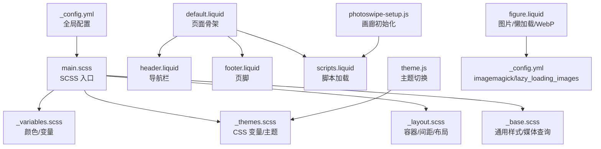
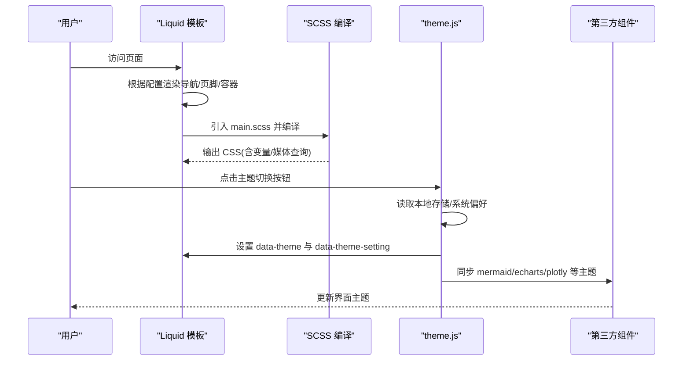
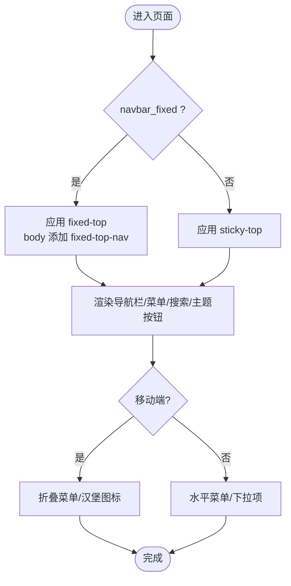
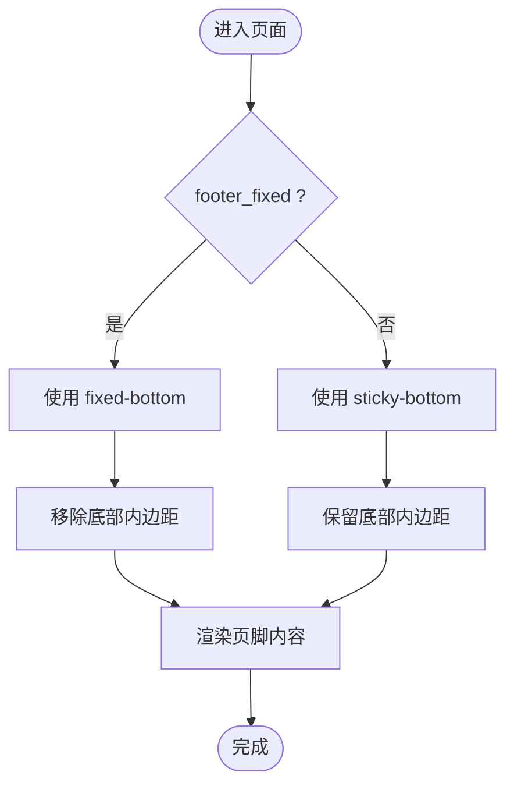
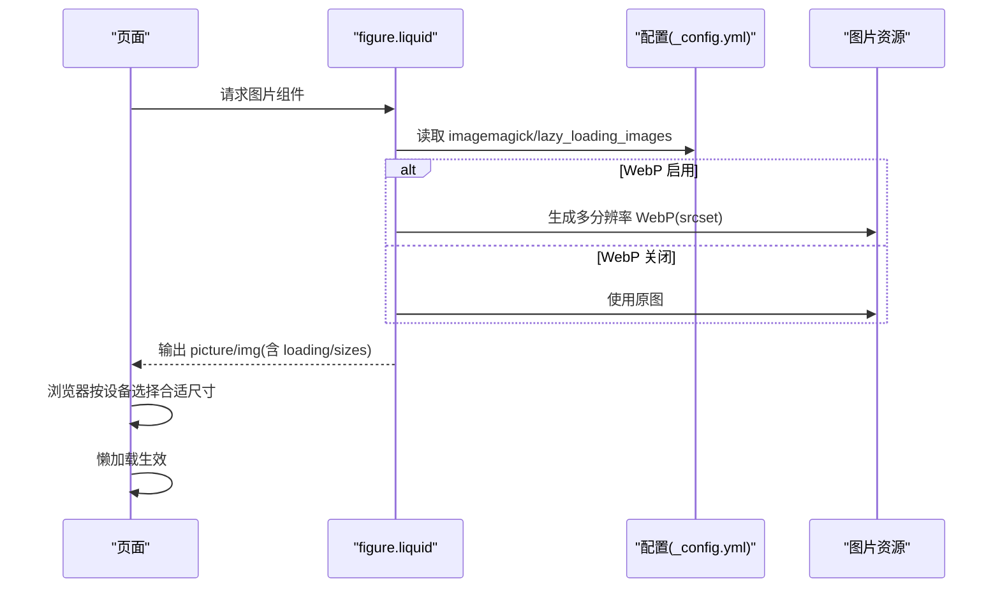
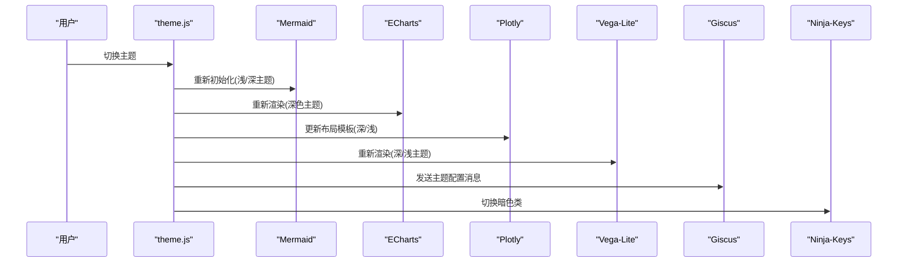
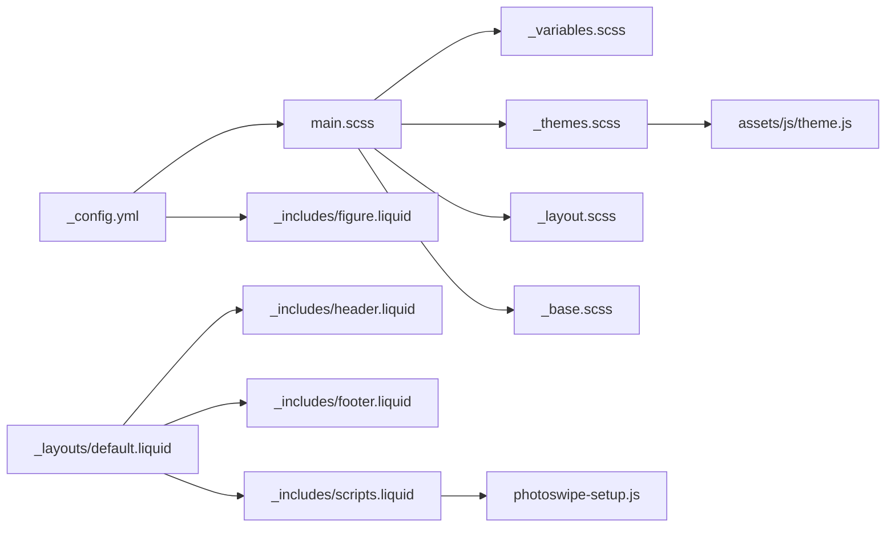

# 响应式设计特性

<cite>
**本文引用的文件**
- [_config.yml](file://_config.yml)
- [main.scss](file://assets/css/main.scss)
- [_variables.scss](file://_sass/_variables.scss)
- [_themes.scss](file://_sass/_themes.scss)
- [_layout.scss](file://_sass/_layout.scss)
- [_base.scss](file://_sass/_base.scss)
- [header.liquid](file://_includes/header.liquid)
- [footer.liquid](file://_includes/footer.liquid)
- [default.liquid](file://_layouts/default.liquid)
- [scripts.liquid](file://_includes/scripts.liquid)
- [theme.js](file://assets/js/theme.js)
- [figure.liquid](file://_includes/figure.liquid)
- [photoswipe-setup.js](file://_scripts/photoswipe-setup.js)
</cite>

## 目录
1. [简介](#简介)
2. [项目结构](#项目结构)
3. [核心组件](#核心组件)
4. [架构总览](#架构总览)
5. [详细组件分析](#详细组件分析)
6. [依赖关系分析](#依赖关系分析)
7. [性能考量](#性能考量)
8. [故障排查指南](#故障排查指南)
9. [结论](#结论)
10. [附录](#附录)

## 简介
本文件系统化梳理该 Jekyll 主题的响应式设计特性与实现方式，覆盖移动端适配、断点策略、触摸交互、导航栏与页脚在不同设备上的表现、图片懒加载与 WebP 支持、主题系统与 SCSS 架构、以及性能优化与调试建议。重点解释配置项如 max_width、navbar_fixed、footer_fixed 对响应式行为的影响，并提供最佳实践与跨浏览器兼容性建议。

## 项目结构
该站点采用 Jekyll 模板与 SCSS 编译流程组织响应式资源：
- 配置层：通过 _config.yml 控制布局尺寸、固定导航与页脚、图片懒加载与 WebP 转换等全局行为
- 样式层：通过 main.scss 统一导入变量、主题、布局与基础样式，结合 CSS 变量实现明暗主题切换
- 视图层：Liquid 模板负责在不同设备上渲染导航栏、页脚、内容容器与脚本加载
- 交互层：theme.js 实现主题切换与第三方组件的主题同步；图片组件通过 figure.liquid 生成响应式 srcset 与 WebP



图表来源
- [_config.yml](file://_config.yml)
- [main.scss](file://assets/css/main.scss)
- [_variables.scss](file://_sass/_variables.scss)
- [_themes.scss](file://_sass/_themes.scss)
- [_layout.scss](file://_sass/_layout.scss)
- [_base.scss](file://_sass/_base.scss)
- [default.liquid](file://_layouts/default.liquid)
- [header.liquid](file://_includes/header.liquid)
- [footer.liquid](file://_includes/footer.liquid)
- [scripts.liquid](file://_includes/scripts.liquid)
- [theme.js](file://assets/js/theme.js)
- [figure.liquid](file://_includes/figure.liquid)
- [photoswipe-setup.js](file://_scripts/photoswipe-setup.js)

章节来源
- [_config.yml](file://_config.yml)
- [main.scss](file://assets/css/main.scss)
- [_variables.scss](file://_sass/_variables.scss)
- [_themes.scss](file://_sass/_themes.scss)
- [_layout.scss](file://_sass/_layout.scss)
- [_base.scss](file://_sass/_base.scss)
- [default.liquid](file://_layouts/default.liquid)
- [header.liquid](file://_includes/header.liquid)
- [footer.liquid](file://_includes/footer.liquid)
- [scripts.liquid](file://_includes/scripts.liquid)
- [theme.js](file://assets/js/theme.js)
- [figure.liquid](file://_includes/figure.liquid)
- [photoswipe-setup.js](file://_scripts/photoswipe-setup.js)

## 核心组件
- 布局与断点
  - 容器最大宽度由配置项 max_width 控制，SCSS 中以变量形式注入，限制页面内容宽度并居中显示
  - 多处媒体查询用于在不同屏幕宽度下调整排版（如个人资料宽度、仓库卡片宽度等）
- 导航栏与页脚
  - 通过 navbar_fixed 与 footer_fixed 控制是否固定定位，影响滚动与留白
  - 移动端使用折叠菜单与汉堡图标，支持点击切换状态
- 图片与 WebP
  - 启用 imagemagick 后，按配置的 widths 生成多分辨率 WebP 源，并通过 picture/source 与 img 的 srcset/sizes 实现响应式加载
  - 默认启用懒加载，减少首屏资源压力
- 主题系统
  - 使用 CSS 变量与 data-theme 属性实现明暗主题切换，JavaScript 动态更新并同步第三方组件主题

章节来源
- [_config.yml](file://_config.yml)
- [main.scss](file://assets/css/main.scss)
- [_layout.scss](file://_sass/_layout.scss)
- [_base.scss](file://_sass/_base.scss)
- [header.liquid](file://_includes/header.liquid)
- [footer.liquid](file://_includes/footer.liquid)
- [figure.liquid](file://_includes/figure.liquid)
- [theme.js](file://assets/js/theme.js)

## 架构总览
整体响应式架构围绕“配置 → SCSS 变量 → Liquid 渲染 → JavaScript 交互”的链路展开。配置项决定行为，SCSS 将变量与媒体查询编译为 CSS，Liquid 在运行时根据配置渲染 DOM 结构，JavaScript 则在运行时处理主题切换与第三方组件的联动。



图表来源
- [default.liquid](file://_layouts/default.liquid)
- [header.liquid](file://_includes/header.liquid)
- [footer.liquid](file://_includes/footer.liquid)
- [main.scss](file://assets/css/main.scss)
- [theme.js](file://assets/js/theme.js)

## 详细组件分析

### 导航栏与页眉
- 固定行为
  - 当 navbar_fixed 为 true 时，导航栏使用 fixed-top 类，避免滚动时隐藏；否则使用 sticky-top
  - 页面 body 会添加 fixed-top-nav 类，以补偿顶部导航带来的内边距
- 折叠菜单
  - 移动端通过按钮触发 collapse，展示下拉菜单与搜索入口
  - 主题切换按钮与搜索按钮在导航栏右侧，支持键盘快捷键提示
- 响应式表现
  - 在小屏设备上，标题与菜单项垂直堆叠；大屏设备上菜单水平排列
  - 下拉菜单在移动端与桌面端均可用，但交互更偏向触摸场景



图表来源
- [header.liquid](file://_includes/header.liquid)
- [default.liquid](file://_layouts/default.liquid)

章节来源
- [header.liquid](file://_includes/header.liquid)
- [default.liquid](file://_layouts/default.liquid)

### 页脚与底部行为
- 固定页脚
  - 当 footer_fixed 为 true 时，页脚使用 fixed-bottom；否则使用 sticky-bottom
  - 固定页脚会移除页面底部内边距，确保内容不被遮挡
- 内容与版权信息
  - 版权信息与站点描述随配置输出，支持可选的法律链接与最后更新时间



图表来源
- [footer.liquid](file://_includes/footer.liquid)
- [default.liquid](file://_layouts/default.liquid)

章节来源
- [footer.liquid](file://_includes/footer.liquid)
- [default.liquid](file://_layouts/default.liquid)

### SCSS 架构与主题系统
- 变量与颜色
  - _variables.scss 定义颜色、字体路径与 UI 组件尺寸变量
- CSS 变量与主题
  - _themes.scss 使用 :root 与 html[data-theme-*] 定义明暗两套 CSS 变量，覆盖背景、文本、强调色、分隔线、卡片色等
  - 通过 theme.js 动态设置 data-theme 与 data-theme-setting，触发动画过渡与第三方组件主题同步
- 媒体查询与布局
  - _layout.scss 控制容器最大宽度与基础间距
  - _base.scss 包含大量媒体查询，针对不同断点调整排版（如个人资料宽度、仓库卡片宽度、列表项布局等）

```mermaid
classDiagram
class Variables {
"+颜色变量"
"+字体路径变量"
"+组件尺寸变量"
}
class Themes {
"+ : root 明色变量"
"+html[data-theme='dark'] 暗色变量"
"+html[data-theme-setting='...'] 切换控制"
}
class Layout {
"+容器最大宽度"
"+基础间距"
}
class Base {
"+媒体查询(断点)"
"+组件样式(导航/页脚/列表/表格)"
}
class ThemeJS {
"+设置 data-theme"
"+同步第三方组件主题"
}
Variables --> Themes : "提供默认值"
Themes --> Base : "被组件样式引用"
Layout --> Base : "约束布局"
ThemeJS --> Themes : "动态切换"
```

图表来源
- [_variables.scss](file://_sass/_variables.scss)
- [_themes.scss](file://_sass/_themes.scss)
- [_layout.scss](file://_sass/_layout.scss)
- [_base.scss](file://_sass/_base.scss)
- [theme.js](file://assets/js/theme.js)

章节来源
- [_variables.scss](file://_sass/_variables.scss)
- [_themes.scss](file://_sass/_themes.scss)
- [_layout.scss](file://_sass/_layout.scss)
- [_base.scss](file://_sass/_base.scss)
- [theme.js](file://assets/js/theme.js)

### 图片懒加载与 WebP 支持
- WebP 生成
  - 启用 imagemagick 后，按配置的 widths 生成多分辨率 WebP 文件，并在模板中通过 picture/source 输出 srcset 与 sizes
- 懒加载
  - 默认启用 lazy_loading_images，所有图片自动添加 loading="lazy"；也可在个别图片上覆盖
- 错误回退
  - 若 WebP 加载失败，通过 onerror 移除响应式源，回退到原始图片



图表来源
- [figure.liquid](file://_includes/figure.liquid)
- [_config.yml](file://_config.yml)

章节来源
- [figure.liquid](file://_includes/figure.liquid)
- [_config.yml](file://_config.yml)

### 第三方组件与响应式交互
- 主题同步
  - theme.js 在主题切换时同步 mermaid、echarts、plotly、vega-lite、giscus、ninja-keys 等组件的主题
- 画廊组件
  - photoswipe-setup.js 初始化画廊，配合 scripts.liquid 条件加载相关脚本



图表来源
- [theme.js](file://assets/js/theme.js)
- [scripts.liquid](file://_includes/scripts.liquid)
- [photoswipe-setup.js](file://_scripts/photoswipe-setup.js)

章节来源
- [theme.js](file://assets/js/theme.js)
- [scripts.liquid](file://_includes/scripts.liquid)
- [photoswipe-setup.js](file://_scripts/photoswipe-setup.js)

## 依赖关系分析
- 配置驱动
  - _config.yml 的 navbar_fixed、footer_fixed、max_width、lazy_loading_images、imagemagick.* 等直接决定渲染与样式行为
- 样式耦合
  - main.scss 统一导入变量与主题，_layout.scss 与 _base.scss 依赖这些变量与媒体查询
- 运行时依赖
  - theme.js 依赖 CSS 变量与 data-theme 属性，同步第三方组件主题
  - 图片组件依赖配置中的 widths 与格式列表



图表来源
- [_config.yml](file://_config.yml)
- [main.scss](file://assets/css/main.scss)
- [_variables.scss](file://_sass/_variables.scss)
- [_themes.scss](file://_sass/_themes.scss)
- [_layout.scss](file://_sass/_layout.scss)
- [_base.scss](file://_sass/_base.scss)
- [default.liquid](file://_layouts/default.liquid)
- [header.liquid](file://_includes/header.liquid)
- [footer.liquid](file://_includes/footer.liquid)
- [scripts.liquid](file://_includes/scripts.liquid)
- [theme.js](file://assets/js/theme.js)
- [figure.liquid](file://_includes/figure.liquid)
- [photoswipe-setup.js](file://_scripts/photoswipe-setup.js)

章节来源
- [_config.yml](file://_config.yml)
- [main.scss](file://assets/css/main.scss)
- [_variables.scss](file://_sass/_variables.scss)
- [_themes.scss](file://_sass/_themes.scss)
- [_layout.scss](file://_sass/_layout.scss)
- [_base.scss](file://_sass/_base.scss)
- [default.liquid](file://_layouts/default.liquid)
- [header.liquid](file://_includes/header.liquid)
- [footer.liquid](file://_includes/footer.liquid)
- [scripts.liquid](file://_includes/scripts.liquid)
- [theme.js](file://assets/js/theme.js)
- [figure.liquid](file://_includes/figure.liquid)
- [photoswipe-setup.js](file://_scripts/photoswipe-setup.js)

## 性能考量
- 图片优化
  - 启用 WebP 与多分辨率 srcset，显著降低带宽与提升加载速度
  - 默认懒加载减少首屏资源请求，改善 TTI/TTI 指标
- 样式与脚本
  - SCSS 压缩输出，第三方库通过 CDN 引入并校验完整性
  - 条件加载：仅在需要的页面加载对应脚本（如 mermaid、chart.js、photoswipe 等）
- 主题切换
  - CSS 变量与 data-theme 属性切换成本低，配合过渡动画避免闪烁
- 可访问性
  - 导航栏提供键盘可达性与屏幕阅读器友好的标签

[本节为通用性能讨论，无需列出具体文件来源]

## 故障排查指南
- 图片未显示或 WebP 加载失败
  - 检查 imagemagick 是否安装且在 PATH 中
  - 确认输入目录与格式匹配，检查 widths 配置
  - 查看浏览器 onerror 回退逻辑是否生效
- 懒加载无效
  - 确认 lazy_loading_images 已启用，或在个别图片上显式设置 loading 属性
- 主题切换异常
  - 检查 localStorage 中的 theme 值与系统偏好匹配
  - 确认 data-theme 与 data-theme-setting 是否正确写入
  - 验证第三方组件主题同步函数是否执行
- 导航栏/页脚位置异常
  - 检查 navbar_fixed 与 footer_fixed 配置
  - 确认 body 上的 fixed-top-nav 与 sticky-bottom-footer 类是否按预期添加

章节来源
- [_config.yml](file://_config.yml)
- [figure.liquid](file://_includes/figure.liquid)
- [theme.js](file://assets/js/theme.js)
- [header.liquid](file://_includes/header.liquid)
- [footer.liquid](file://_includes/footer.liquid)

## 结论
该主题通过配置驱动的响应式策略，结合 SCSS 变量与媒体查询、Liquid 模板渲染与 JavaScript 主题同步，实现了从布局、导航、页脚到图片与第三方组件的完整响应式体验。合理配置 max_width、navbar_fixed、footer_fixed、lazy_loading_images、imagemagick 等参数，可在保证视觉一致性的同时优化性能与可访问性。

[本节为总结性内容，无需列出具体文件来源]

## 附录

### 断点与媒体查询要点
- 常见断点
  - 小屏：max-width: 576px（示例：块级元素/列表项）
  - 中屏：min-width: 576px（示例：个人资料宽度）
  - 大屏：min-width: 768px（示例：仓库卡片宽度）
  - 超大屏：max-width: 1024px（示例：某些组件的额外样式）
- 自定义断点
  - 在 _base.scss 或新增样式文件中扩展媒体查询，遵循现有命名与缩进风格
  - 优先使用相对单位与视口单位，避免硬编码像素

章节来源
- [_base.scss](file://_sass/_base.scss)

### 主题定制步骤
- 修改颜色与变量
  - 在 _variables.scss 中调整颜色与尺寸变量
- 定义主题变量
  - 在 _themes.scss 中扩展 :root 与 html[data-theme='dark'] 的变量映射
- 应用到组件
  - 在 _base.scss 中使用 var(--global-*) 引用变量，确保组件在明暗模式下一致
- 验证切换
  - 使用 theme.js 的切换逻辑验证第三方组件主题同步

章节来源
- [_variables.scss](file://_sass/_variables.scss)
- [_themes.scss](file://_sass/_themes.scss)
- [_base.scss](file://_sass/_base.scss)
- [theme.js](file://assets/js/theme.js)

### 跨浏览器兼容性与调试建议
- 浏览器支持
  - CSS 变量与 data-theme 属性在现代浏览器中支持良好；为旧版浏览器提供降级方案（如静态主题）
  - WebP 在主流浏览器支持度高，若需兼容旧版 IE，可通过 onerror 回退至原图
- 调试技巧
  - 使用浏览器开发者工具查看 data-theme 与 CSS 变量的实际值
  - 在不同设备与网络条件下测试图片加载与懒加载效果
  - 关注第三方组件的主题同步是否及时生效

[本节为通用指导，无需列出具体文件来源]