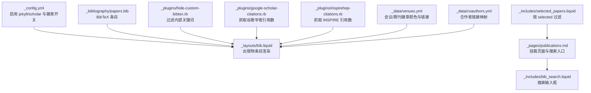
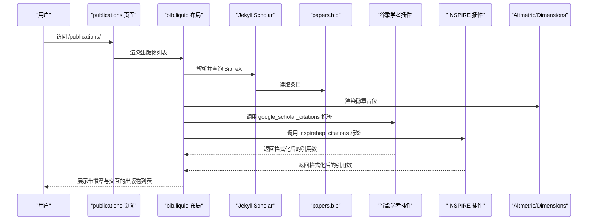
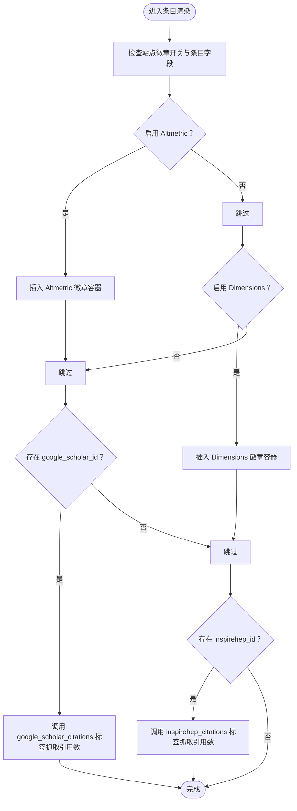
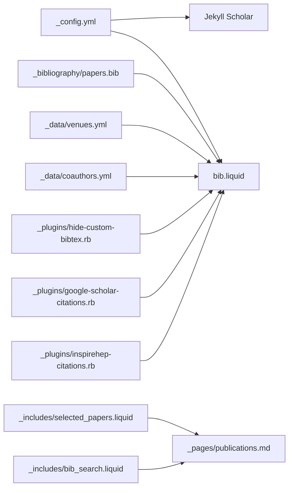

# 学术出版物管理

<cite>
**本文引用的文件**
- [_config.yml](file://_config.yml)
- [_pages/publications.md](file://_pages/publications.md)
- [_layouts/bib.liquid](file://_layouts/bib.liquid)
- [_includes/bib_search.liquid](file://_includes/bib_search.liquid)
- [_plugins/google-scholar-citations.rb](file://_plugins/google-scholar-citations.rb)
- [_plugins/inspirehep-citations.rb](file://_plugins/inspirehep-citations.rb)
- [_plugins/hide-custom-bibtex.rb](file://_plugins/hide-custom-bibtex.rb)
- [_plugins/cache-bust.rb](file://_plugins/cache-bust.rb)
- [_plugins/download-3rd-party.rb](file://_plugins/download-3rd-party.rb)
- [_includes/selected_papers.liquid](file://_includes/selected_papers.liquid)
- [_data/venues.yml](file://_data/venues.yml)
- [_data/coauthors.yml](file://_data/coauthors.yml)
- [_bibliography/papers.bib](file://_bibliography/papers.bib)
- [_includes/citation.liquid](file://_includes/citation.liquid)
</cite>

## 目录
1. [简介](#简介)
2. [项目结构](#项目结构)
3. [核心组件](#核心组件)
4. [架构总览](#架构总览)
5. [组件详解](#组件详解)
6. [依赖关系分析](#依赖关系分析)
7. [性能考量](#性能考量)
8. [故障排除指南](#故障排除指南)
9. [结论](#结论)
10. [附录](#附录)

## 简介
本文件面向使用 Jekyll Scholar 的学术出版物管理系统，系统性阐述基于 BibTeX 的出版物展示与管理能力，涵盖以下方面：
- BibTeX 文件组织与条目管理
- 引用统计与第三方徽章（Google Scholar、INSPIRE HEP、Altmetric、Dimensions）集成
- 出版物分组、排序与筛选机制
- 配置项详解（如 enable_publication_badges、filtered_bibtex_keywords、max_author_limit 等）
- BibTeX 条目最佳实践与字段说明
- 自定义显示样式与交互功能
- 实际配置示例与常见问题排查

## 项目结构
该站点采用 Jekyll + Jekyll Scholar 的静态站点生成模式，核心围绕以下目录与文件展开：
- 配置：_config.yml 中启用 jekyll/scholar 并设置出版物相关参数
- 数据：_bibliography/papers.bib 存放 BibTeX 条目；_data/venues.yml、_data/coauthors.yml 提供辅助数据
- 布局与模板：_layouts/bib.liquid 定义单条出版物渲染；_pages/publications.md 挂载出版物页面
- 插件：_plugins 下的 Ruby 插件负责徽章与统计抓取、过滤与缓存
- 搜索：_includes/bib_search.liquid 提供前端检索入口；assets/js/bibsearch.js 负责交互

图表来源
- [_config.yml:264-330](file://_config.yml#L264-L330)
- [_layouts/bib.liquid:1-373](file://_layouts/bib.liquid#L1-L373)
- [_pages/publications.md:1-21](file://_pages/publications.md#L1-L21)
- [_includes/bib_search.liquid:1-5](file://_includes/bib_search.liquid#L1-L5)
- [_plugins/hide-custom-bibtex.rb:1-19](file://_plugins/hide-custom-bibtex.rb#L1-L19)
- [_plugins/google-scholar-citations.rb:1-86](file://_plugins/google-scholar-citations.rb#L1-L86)
- [_plugins/inspirehep-citations.rb:1-58](file://_plugins/inspirehep-citations.rb#L1-L58)
- [_data/venues.yml:1-64](file://_data/venues.yml#L1-L64)
- [_data/coauthors.yml:1-35](file://_data/coauthors.yml#L1-L35)
- [_includes/selected_papers.liquid:1-4](file://_includes/selected_papers.liquid#L1-L4)

章节来源
- [_config.yml:264-330](file://_config.yml#L264-L330)
- [_pages/publications.md:1-21](file://_pages/publications.md#L1-L21)
- [_layouts/bib.liquid:1-373](file://_layouts/bib.liquid#L1-L373)

## 核心组件
- Jekyll Scholar 配置与渲染
  - 在配置中启用 jekyll/scholar，指定源目录、主文件、样式、分组与排序等
  - 使用 _layouts/bib.liquid 渲染每一条目，支持作者上限、缩略图、徽章、按钮等
- BibTeX 管理与过滤
  - 条目集中于 _bibliography/papers.bib；通过 _plugins/hide-custom-bibtex.rb 过滤内部关键词，避免在输出中暴露
- 第三方统计与徽章
  - Altmetric/Dimensions 徽章由布局直接嵌入；Google Scholar 与 INSPIRE HEP 通过 Liquid 标签抓取实时引用数
- 搜索与筛选
  - 页面内嵌搜索框；支持按 selected 字段筛选精选论文
- 辅助数据
  - 会议/期刊 abbr 对应颜色与链接；合作者姓名到外部链接的映射

章节来源
- [_config.yml:264-330](file://_config.yml#L264-L330)
- [_layouts/bib.liquid:1-373](file://_layouts/bib.liquid#L1-L373)
- [_plugins/hide-custom-bibtex.rb:1-19](file://_plugins/hide-custom-bibtex.rb#L1-L19)
- [_plugins/google-scholar-citations.rb:1-86](file://_plugins/google-scholar-citations.rb#L1-L86)
- [_plugins/inspirehep-citations.rb:1-58](file://_plugins/inspirehep-citations.rb#L1-L58)
- [_includes/bib_search.liquid:1-5](file://_includes/bib_search.liquid#L1-L5)
- [_includes/selected_papers.liquid:1-4](file://_includes/selected_papers.liquid#L1-L4)
- [_data/venues.yml:1-64](file://_data/venues.yml#L1-L64)
- [_data/coauthors.yml:1-35](file://_data/coauthors.yml#L1-L35)

## 架构总览
下图展示了从配置到页面渲染、再到第三方统计抓取的整体流程。

图表来源
- [_pages/publications.md:1-21](file://_pages/publications.md#L1-L21)
- [_layouts/bib.liquid:1-373](file://_layouts/bib.liquid#L1-L373)
- [_plugins/google-scholar-citations.rb:1-86](file://_plugins/google-scholar-citations.rb#L1-L86)
- [_plugins/inspirehep-citations.rb:1-58](file://_plugins/inspirehep-citations.rb#L1-L58)

## 组件详解

### 配置项与行为说明
- enable_publication_badges
  - 控制是否渲染各类徽章（Altmetric、Dimensions、Google Scholar、INSPIRE HEP）
  - 可针对每个服务单独开关，布局中按站点配置条件渲染
- filtered_bibtex_keywords
  - 定义在输出中被过滤掉的内部关键词集合，避免泄露内部元信息
- max_author_limit
  - 限制默认显示的作者数量，超出部分以“更多作者”形式点击展开
- more_authors_animation_delay
  - “更多作者”展开时的逐字动画延迟（毫秒），越小越快
- enable_publication_thumbnails
  - 是否显示 abbr 与预览图；配合 venues.yml 与 preview 字段使用
- 其他相关配置
  - scholar.group_by/year、group_order 控制分组与排序
  - scholar.source/bibliography 指定 BibTeX 源与文件名
  - scholar.details_dir/details_link 控制详情页路径与链接文本

章节来源
- [_config.yml:292-330](file://_config.yml#L292-L330)
- [_config.yml:264-330](file://_config.yml#L264-L330)

### BibTeX 条目管理与最佳实践
- 条目位置与命名
  - 主文件位于 _bibliography/papers.bib；可按需拆分多个文件并通过 scholar.source 指向
- 关键字段建议
  - 必填：title、author、year
  - 常用：journal/booktitle/abbr、year、month、pages、doi/arxiv、html/pdf/supp/code/poster/slides/website/blog/video
  - 内部控制：abbr、abstract、additional_info、altmetric、annotation、arxiv、award、award_name、bibtex_show、blog、code、google_scholar_id、pdf、poster、preview、selected、slides、supp、video、website
- 最佳实践
  - 使用 abbr 统一会议/期刊简称，便于徽章与样式一致
  - 使用 selected=true 标记精选论文，结合 _includes/selected_papers.liquid 进行筛选展示
  - 将内部关键词放入 filtered_bibtex_keywords，确保最终页面不暴露
  - 作者标注星号/上标等用于区分通讯/共同作者，布局会识别并加粗或高亮

章节来源
- [_plugins/hide-custom-bibtex.rb:1-19](file://_plugins/hide-custom-bibtex.rb#L1-L19)
- [_includes/selected_papers.liquid:1-4](file://_includes/selected_papers.liquid#L1-L4)
- [_layouts/bib.liquid:50-149](file://_layouts/bib.liquid#L50-L149)
- [_bibliography/papers.bib:1-75](file://_bibliography/papers.bib#L1-L75)

### 出版物分组、排序与筛选
- 分组与排序
  - 通过 scholar.group_by/year 与 group_order 控制按年份分组与顺序
- 筛选
  - 页面级筛选：使用 _includes/selected_papers.liquid 的查询表达式按 selected=true 过滤
  - 页面内搜索：_includes/bib_search.liquid 提供输入框，结合前端脚本实现本地过滤
- 作者列表控制
  - 通过 max_author_limit 限制显示数量，超过部分以“更多作者”点击展开

章节来源
- [_config.yml:288-291](file://_config.yml#L288-L291)
- [_includes/selected_papers.liquid:1-4](file://_includes/selected_papers.liquid#L1-L4)
- [_includes/bib_search.liquid:1-5](file://_includes/bib_search.liquid#L1-L5)
- [_layouts/bib.liquid:54-138](file://_layouts/bib.liquid#L54-L138)

### 第三方服务集成与徽章
- Altmetric 与 Dimensions 徽章
  - 布局中根据站点配置与条目字段动态插入徽章容器，支持通过 altmetric/ dimensions 字段或 arxiv/doi/pmid/isbn 推断标识
- Google Scholar 引用数
  - 通过自定义 Liquid 标签 google_scholar_citations 抓取页面 meta 中的“被引次数”，并进行人性化数字格式化
- INSPIRE HEP 引用数
  - 通过自定义 Liquid 标签 inspirehep_citations 调用官方 API 获取 citation_count，并格式化显示
- 社交账号与链接
  - 布局中使用站点数据中的 scholar_userid 生成直达谷歌学者条目的链接

图表来源
- [_layouts/bib.liquid:257-340](file://_layouts/bib.liquid#L257-L340)
- [_plugins/google-scholar-citations.rb:1-86](file://_plugins/google-scholar-citations.rb#L1-L86)
- [_plugins/inspirehep-citations.rb:1-58](file://_plugins/inspirehep-citations.rb#L1-L58)

章节来源
- [_layouts/bib.liquid:257-340](file://_layouts/bib.liquid#L257-L340)
- [_plugins/google-scholar-citations.rb:1-86](file://_plugins/google-scholar-citations.rb#L1-L86)
- [_plugins/inspirehep-citations.rb:1-58](file://_plugins/inspirehep-citations.rb#L1-L58)

### 显示样式与交互功能
- 作者列表交互
  - 超出上限的作者以“更多作者”形式展示，点击后以动画逐字切换显示完整列表
- 缩略图与 abbr 徽章
  - 若启用缩略图，abbr 会根据 venues.yml 配置着色并可链接至官网；预览图支持本地与外链
- 按钮与链接
  - DOI、arXiv、PDF、HTML、代码、视频、海报、幻灯片、网站等按钮按条目字段自动显示
- 搜索与筛选
  - 页面顶部提供搜索框，输入即过滤；也可使用查询表达式按 selected 过滤

章节来源
- [_layouts/bib.liquid:4-46](file://_layouts/bib.liquid#L4-L46)
- [_layouts/bib.liquid:188-256](file://_layouts/bib.liquid#L188-L256)
- [_includes/bib_search.liquid:1-5](file://_includes/bib_search.liquid#L1-L5)
- [_includes/selected_papers.liquid:1-4](file://_includes/selected_papers.liquid#L1-L4)

### 数据与辅助映射
- venues.yml
  - 为会议/期刊简称提供颜色与链接，用于 abbr 徽章的样式与跳转
- coauthors.yml
  - 将作者姓氏映射到可能的名写法与外部链接，便于作者名高亮与跳转

章节来源
- [_data/venues.yml:1-64](file://_data/venues.yml#L1-L64)
- [_data/coauthors.yml:1-35](file://_data/coauthors.yml#L1-L35)

### 页面与入口
- publications 页面
  - 挂载页面、引入搜索框、调用  输出条目
- 引用模板
  - _includes/citation.liquid 提供页面引用格式与 BibTeX 片段，便于复制粘贴

章节来源
- [_pages/publications.md:1-21](file://_pages/publications.md#L1-L21)
- [_includes/citation.liquid:1-27](file://_includes/citation.liquid#L1-L27)

## 依赖关系分析
- 配置依赖
  - _config.yml 的 scholar.* 与 enable_publication_badges 等决定渲染行为
- 渲染依赖
  - _layouts/bib.liquid 依赖 _data/venues.yml、_data/coauthors.yml、_plugins/* 与 _bibliography/papers.bib
- 插件依赖
  - google-scholar-citations.rb 与 inspirehep-citations.rb 依赖网络访问与 JSON 解析
- 页面依赖
  - _pages/publications.md 依赖 _includes/bib_search.liquid 与 

图表来源
- [_config.yml:264-330](file://_config.yml#L264-L330)
- [_layouts/bib.liquid:1-373](file://_layouts/bib.liquid#L1-L373)
- [_plugins/hide-custom-bibtex.rb:1-19](file://_plugins/hide-custom-bibtex.rb#L1-L19)
- [_plugins/google-scholar-citations.rb:1-86](file://_plugins/google-scholar-citations.rb#L1-L86)
- [_plugins/inspirehep-citations.rb:1-58](file://_plugins/inspirehep-citations.rb#L1-L58)
- [_includes/selected_papers.liquid:1-4](file://_includes/selected_papers.liquid#L1-L4)
- [_includes/bib_search.liquid:1-5](file://_includes/bib_search.liquid#L1-L5)
- [_pages/publications.md:1-21](file://_pages/publications.md#L1-L21)

章节来源
- [_config.yml:264-330](file://_config.yml#L264-L330)
- [_layouts/bib.liquid:1-373](file://_layouts/bib.liquid#L1-L373)

## 性能考量
- 引用抓取的并发与节流
  - 谷歌学者抓取前有随机延时，避免触发反爬策略；建议在构建机上离线缓存或使用本地镜像
- 缓存与资源优化
  - 使用 _plugins/cache-bust.rb 为静态资源添加指纹，提升缓存命中率
  - third_party_libraries.download 可将远程资源下载到本地，减少运行时网络请求
- 渲染复杂度
  - 大量条目时，建议开启分组与限制作者数量，降低 DOM 体积与交互成本

章节来源
- [_plugins/google-scholar-citations.rb:39-40](file://_plugins/google-scholar-citations.rb#L39-L40)
- [_plugins/cache-bust.rb:1-51](file://_plugins/cache-bust.rb#L1-L51)
- [_plugins/download-3rd-party.rb:191-252](file://_plugins/download-3rd-party.rb#L191-L252)
- [_config.yml:331-332](file://_config.yml#L331-L332)

## 故障排除指南
- 引用数显示为 N/A 或异常
  - 检查 google_scholar_citations 与 inspirehep_citations 的网络访问权限与超时设置
  - 确认条目中 google_scholar_id/inspirehep_id 是否正确填写
- 徽章未显示
  - 确认 _layouts/bib.liquid 中对应服务的开关已启用，且条目具备相应字段
- BibTeX 内部关键词泄露
  - 检查 filtered_bibtex_keywords 是否包含目标关键词；确认 hideCustomBibtex 过滤器生效
- 作者列表交互异常
  - 检查 max_author_limit 与 more_authors_animation_delay 设置；确认页面加载了必要的脚本
- 搜索无效
  - 确认 _includes/bib_search.liquid 已在页面中引入，且前端脚本正常加载

章节来源
- [_plugins/google-scholar-citations.rb:71-77](file://_plugins/google-scholar-citations.rb#L71-L77)
- [_plugins/inspirehep-citations.rb:43-49](file://_plugins/inspirehep-citations.rb#L43-L49)
- [_layouts/bib.liquid:257-340](file://_layouts/bib.liquid#L257-L340)
- [_plugins/hide-custom-bibtex.rb:1-19](file://_plugins/hide-custom-bibtex.rb#L1-L19)
- [_includes/bib_search.liquid:1-5](file://_includes/bib_search.liquid#L1-L5)

## 结论
该系统以 Jekyll Scholar 为核心，结合自定义插件与数据映射，实现了从 BibTeX 到页面渲染、从作者列表到多维徽章的完整出版物管理闭环。通过合理的配置与最佳实践，可在保证性能的同时，提供丰富的展示与交互体验。

## 附录

### 配置项速查表
- enable_publication_badges
  - altmetric: true/false
  - dimensions: true/false
  - google_scholar: true/false
  - inspirehep: true/false
- filtered_bibtex_keywords
  - 默认包含 abbr、abstract、additional_info、altmetric、annotation、arxiv、award、award_name、bibtex_show、blog、code、google_scholar_id、html、inspirehep_id、pdf、poster、preview、selected、slides、supp、video、website
- max_author_limit
  - 数值，限制默认显示作者数
- more_authors_animation_delay
  - 数值（毫秒），控制“更多作者”动画速度
- enable_publication_thumbnails
  - true/false，控制缩略图与 abbr 显示

章节来源
- [_config.yml:292-330](file://_config.yml#L292-L330)
- [_config.yml:300-325](file://_config.yml#L300-L325)
- [_config.yml:327-329](file://_config.yml#L327-L329)
- [_config.yml:331-332](file://_config.yml#L331-L332)

### 实际配置示例
- 启用所有徽章并在页面显示 abbr 与缩略图
  - 在 _config.yml 中设置 enable_publication_badges.* 为 true，并开启 enable_publication_thumbnails
- 仅显示精选论文
  - 在 publications 页面中使用 _includes/selected_papers.liquid 的查询表达式
- 自定义作者上限与动画
  - 设置 max_author_limit 与 more_authors_animation_delay

章节来源
- [_config.yml:292-330](file://_config.yml#L292-L330)
- [_includes/selected_papers.liquid:1-4](file://_includes/selected_papers.liquid#L1-L4)