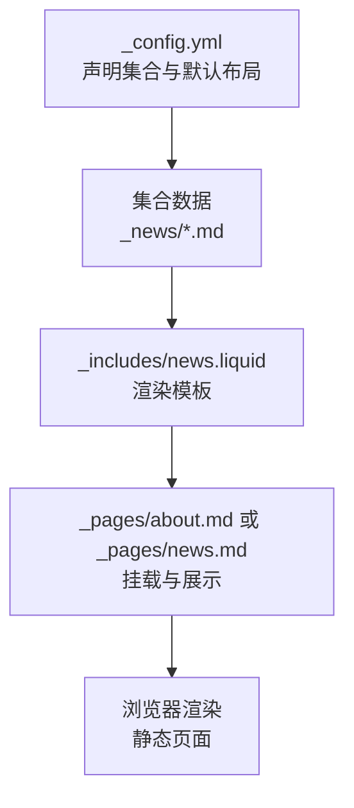
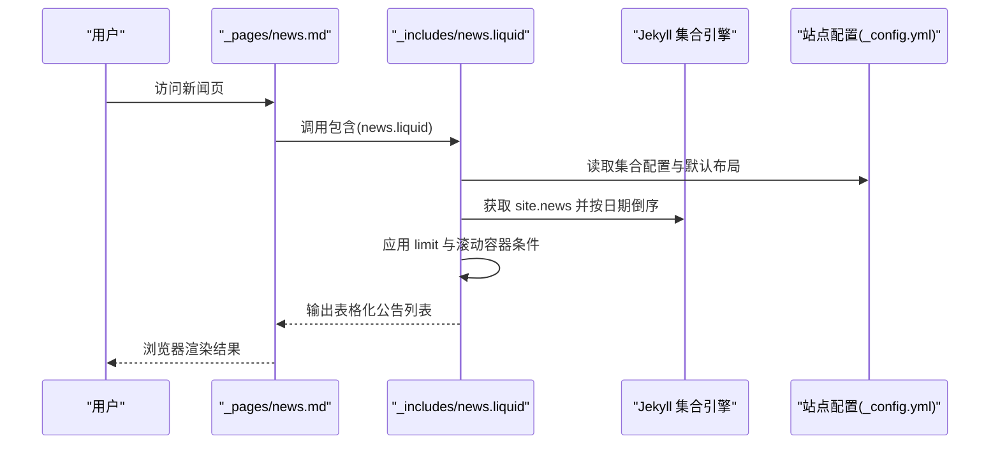
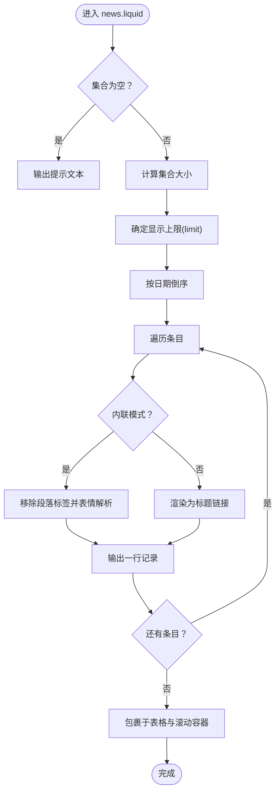
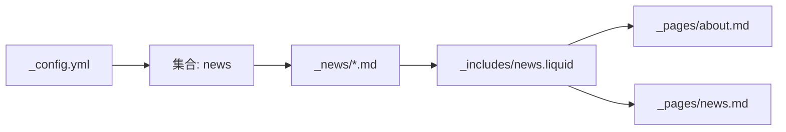

# 新闻公告系统

<cite>
**本文引用的文件**
- [_config.yml](file://_config.yml)
- [_includes/news.liquid](file://_includes/news.liquid)
- [_pages/news.md](file://_pages/news.md)
- [_pages/about.md](file://_pages/about.md)
- [_news/announcement_1.md](file://_news/announcement_1.md)
- [_news/announcement_20250919.md](file://_news/announcement_20250919.md)
- [_news/announcement_20250821.md](file://_news/announcement_20250821.md)
- [_news/announcement_3.md](file://_news/announcement_3.md)
- [_news_bk/announcement_1.md](file://_news_bk/announcement_1.md)
- [_news_bk/announcement_2.md](file://_news_bk/announcement_2.md)
- [CUSTOMIZE.md](file://CUSTOMIZE.md)
</cite>

## 目录
1. [简介](#简介)
2. [项目结构](#项目结构)
3. [核心组件](#核心组件)
4. [架构总览](#架构总览)
5. [详细组件分析](#详细组件分析)
6. [依赖关系分析](#依赖关系分析)
7. [性能考量](#性能考量)
8. [故障排查指南](#故障排查指南)
9. [结论](#结论)
10. [附录](#附录)

## 简介
本文件面向基于 Jekyll 集合的新闻公告系统，系统性阐述公告发布、滚动展示、通知联动等核心能力；详解集合配置、条目创建格式、显示逻辑与排序规则；解释滚动效果实现原理与自定义选项；对比新闻与博客的差异及适用场景；提供发布最佳实践、样式定制与响应式优化建议；说明批量发布与历史公告管理策略；并覆盖 SEO 优化与可访问性要点。

## 项目结构
新闻公告系统围绕 Jekyll 集合“news”构建，核心由以下部分组成：
- 配置层：在站点配置中声明集合与默认布局
- 数据层：以 Markdown 文件形式存放公告条目
- 模板层：通过 Liquid 模板渲染公告列表
- 页面层：主页或独立页面挂载公告模块

图表来源
- [_config.yml:147-156](file://_config.yml#L147-L156)
- [_includes/news.liquid:1-35](file://_includes/news.liquid#L1-L35)
- [_pages/about.md:19-27](file://_pages/about.md#L19-L27)
- [_pages/news.md:1-8](file://_pages/news.md#L1-L8)

章节来源
- [_config.yml:147-156](file://_config.yml#L147-L156)
- [_pages/about.md:19-27](file://_pages/about.md#L19-L27)
- [_pages/news.md:1-8](file://_pages/news.md#L1-L8)

## 核心组件
- 集合配置：在站点配置中启用“news”集合，并为其指定默认布局与输出规则
- 公告条目：采用标准 Front Matter 声明元信息（如日期、是否内联显示等），正文支持 Markdown 与表情符号
- 渲染模板：通过 Liquid 模板读取集合数据，按时间倒序排列，支持限制数量与滚动容器
- 展示页面：可在首页或独立新闻页中挂载公告模块，亦可结合“最新博文”模块形成通知联动

章节来源
- [_config.yml:147-156](file://_config.yml#L147-L156)
- [_includes/news.liquid:1-35](file://_includes/news.liquid#L1-L35)
- [_pages/about.md:19-27](file://_pages/about.md#L19-L27)
- [_pages/news.md:1-8](file://_pages/news.md#L1-L8)

## 架构总览
下图展示了从集合数据到页面渲染的关键流程：

图表来源
- [_pages/news.md:7](file://_pages/news.md#L7)
- [_includes/news.liquid:11](file://_includes/news.liquid#L11)
- [_config.yml:147-156](file://_config.yml#L147-L156)

## 详细组件分析

### 组件一：集合与配置
- 集合声明：在站点配置中启用“news”集合，并设置默认布局为“post”，同时开启输出
- 默认布局：集合条目继承“post”布局，便于统一样式与脚手架
- 输出控制：允许生成独立页面，也可仅用于首页挂载

章节来源
- [_config.yml:147-156](file://_config.yml#L147-L156)

### 组件二：公告条目创建与格式
- Front Matter 元信息：至少包含日期字段；可选 inline 控制显示方式、related_posts 控制相关文章行为
- 内容格式：支持 Markdown 语法与表情符号；内联公告会移除段落标签并进行表情解析
- 示例条目：包含多条不同日期与内容的公告，体现常见写法

章节来源
- [_news/announcement_1.md:1-9](file://_news/announcement_1.md#L1-L9)
- [_news/announcement_20250919.md:1-9](file://_news/announcement_20250919.md#L1-L9)
- [_news/announcement_20250821.md:1-9](file://_news/announcement_20250821.md#L1-L9)
- [_news/announcement_3.md:1-9](file://_news/announcement_3.md#L1-L9)
- [_news_bk/announcement_1.md:1-9](file://_news_bk/announcement_1.md#L1-L9)
- [_news_bk/announcement_2.md:1-34](file://_news_bk/announcement_2.md#L1-L34)

### 组件三：渲染模板与显示逻辑
- 数据来源：读取 site.news 集合
- 排序规则：按日期倒序（最近的在前）
- 列表结构：表格化展示，左侧为日期，右侧为标题或内联内容
- 显示模式：
  - 内联：直接渲染正文，移除段落标签并应用表情解析
  - 外链：渲染为链接，指向条目独立页面
- 限制与滚动：
  - 支持通过 page.announcements.limit 限制显示数量
  - 当满足条件时，容器添加最大高度并启用垂直滚动

图表来源
- [_includes/news.liquid:11-28](file://_includes/news.liquid#L11-L28)

章节来源
- [_includes/news.liquid:1-35](file://_includes/news.liquid#L1-L35)

### 组件四：页面挂载与通知联动
- 主页挂载：在首页 Front Matter 中启用 announcements 区域，可设置是否可滚动与显示数量
- 独立页面：通过独立新闻页加载相同模板，形成集中展示
- 通知联动：可与“最新博文”模块配合，形成“新闻 + 博文”的通知流

章节来源
- [_pages/about.md:19-27](file://_pages/about.md#L19-L27)
- [_pages/news.md:1-8](file://_pages/news.md#L1-L8)

### 组件五：滚动效果实现原理与自定义
- 容器滚动：当集合数量超过阈值且页面配置允许时，为表格容器设置最大高度并启用滚动
- 自定义选项：
  - 通过 page.announcements.scrollable 控制是否启用滚动
  - 通过 page.announcements.limit 控制显示上限
  - 可根据需要调整阈值与高度样式

章节来源
- [_includes/news.liquid:6-8](file://_includes/news.liquid#L6-L8)
- [_pages/about.md:21](file://_pages/about.md#L21)

### 组件六：新闻与博客的区别与使用场景
- 集合归属：新闻属于“news”集合，博客属于默认“posts”集合
- 使用场景：
  - 新闻：快速、简洁的成就与动态公告，强调时效性与可读性
  - 博客：深度内容与长文分享，强调知识沉淀与讨论
- 展示位置：新闻常用于首页公告区，博客用于独立归档页或首页分栏

章节来源
- [_config.yml:147-156](file://_config.yml#L147-L156)
- [CUSTOMIZE.md:70-84](file://CUSTOMIZE.md#L70-L84)

### 组件七：样式定制与响应式设计
- 表格样式：使用 Bootstrap 表格类，具备小尺寸与无边框风格，适配紧凑展示
- 响应式容器：表格外层容器具备响应式属性，确保在窄屏设备上可横向滚动
- 自定义建议：
  - 可在主题样式中微调表格间距、字体大小与对齐方式
  - 结合媒体查询，针对移动端进一步优化行高与内边距

章节来源
- [_includes/news.liquid:10](file://_includes/news.liquid#L10)
- [_includes/news.liquid:4](file://_includes/news.liquid#L4)

### 组件八：SEO 优化与可访问性
- SEO 建议：
  - 为独立新闻页设置明确的永久链接与标题
  - 在条目中合理使用语义化标题层级，避免滥用 h1
  - 提供简短摘要与关键词，提升搜索可见性
- 可访问性建议：
  - 表格表头使用 scope 属性，确保屏幕阅读器正确识别行列关系
  - 为外部链接添加适当的可访问性提示（如新窗口打开标识）

章节来源
- [_pages/news.md:4](file://_pages/news.md#L4)
- [_includes/news.liquid:19](file://_includes/news.liquid#L19)

## 依赖关系分析
- 配置依赖：集合启用与默认布局由站点配置决定
- 模板依赖：渲染模板依赖集合数据与页面上下文（limit、scrollable）
- 页面依赖：首页与独立新闻页均依赖同一模板实现一致展示

图表来源
- [_config.yml:147-156](file://_config.yml#L147-L156)
- [_includes/news.liquid:11](file://_includes/news.liquid#L11)
- [_pages/about.md:19-27](file://_pages/about.md#L19-L27)
- [_pages/news.md:7](file://_pages/news.md#L7)

章节来源
- [_config.yml:147-156](file://_config.yml#L147-L156)
- [_includes/news.liquid:1-35](file://_includes/news.liquid#L1-L35)
- [_pages/about.md:19-27](file://_pages/about.md#L19-L27)
- [_pages/news.md:1-8](file://_pages/news.md#L1-L8)

## 性能考量
- 集合规模：当公告数量较多时，建议通过 limit 限制显示数量，减少 DOM 节点
- 滚动容器：仅在必要时启用滚动，避免不必要的重排与滚动条闪烁
- 渲染开销：内联模式移除段落标签可减少多余元素，提升渲染效率
- 缓存策略：静态站点天然具备良好缓存特性，建议结合 CDN 与压缩资源进一步优化加载速度

## 故障排查指南
- 公告不显示
  - 检查集合是否在配置中启用且输出开启
  - 确认条目 Front Matter 是否包含有效日期
- 滚动条未出现
  - 检查 page.announcements.scrollable 是否启用
  - 确认集合数量是否超过阈值
- 显示异常
  - 内联公告若未按预期显示，检查是否正确移除了段落标签
  - 外链公告需确认条目 URL 生成是否正常

章节来源
- [_config.yml:147-156](file://_config.yml#L147-L156)
- [_includes/news.liquid:6-8](file://_includes/news.liquid#L6-L8)
- [_includes/news.liquid:21-25](file://_includes/news.liquid#L21-L25)

## 结论
该新闻公告系统以 Jekyll 集合为核心，通过简洁的 Front Matter 与模板渲染实现了高效、可维护的公告管理。其设计兼顾了展示效率与可扩展性，既适合个人成就公告，也能作为通知流的一部分与博客内容协同。通过合理的配置与样式定制，可进一步提升用户体验与可访问性。

## 附录

### 发布最佳实践与内容规范
- 条目命名：建议使用语义化命名（如 announcement_YYYYMMDD.md），便于检索与版本管理
- 内容规范：保持简洁、聚焦、时效性强；必要时提供外部链接直达详情页
- Front Matter：固定包含日期；根据需要设置 inline 与 related_posts
- 批量发布：可先在草稿目录中维护，统一迁移至 _news 目录后一次性生成

章节来源
- [_news/announcement_1.md:1-9](file://_news/announcement_1.md#L1-L9)
- [_news/announcement_20250919.md:1-9](file://_news/announcement_20250919.md#L1-L9)
- [_news/announcement_20250821.md:1-9](file://_news/announcement_20250821.md#L1-L9)
- [_news/announcement_3.md:1-9](file://_news/announcement_3.md#L1-L9)
- [CUSTOMIZE.md:76-84](file://CUSTOMIZE.md#L76-L84)

### 历史公告管理
- 草稿与归档：可利用备份目录存放历史条目，便于回溯与复用
- 迁移策略：通过统一移动与重新生成，确保链接与索引稳定

章节来源
- [_news_bk/announcement_1.md:1-9](file://_news_bk/announcement_1.md#L1-L9)
- [_news_bk/announcement_2.md:1-34](file://_news_bk/announcement_2.md#L1-L34)