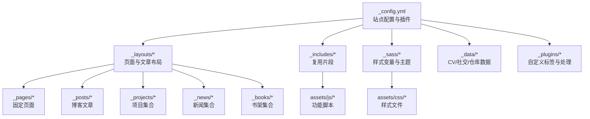
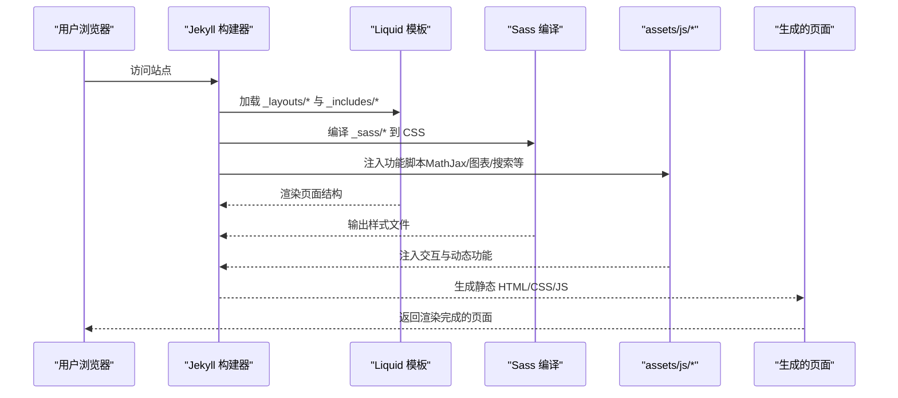
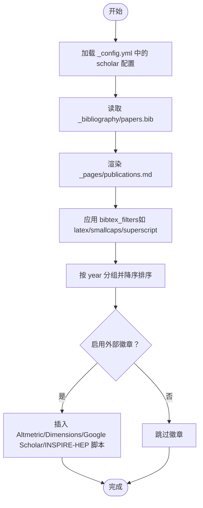
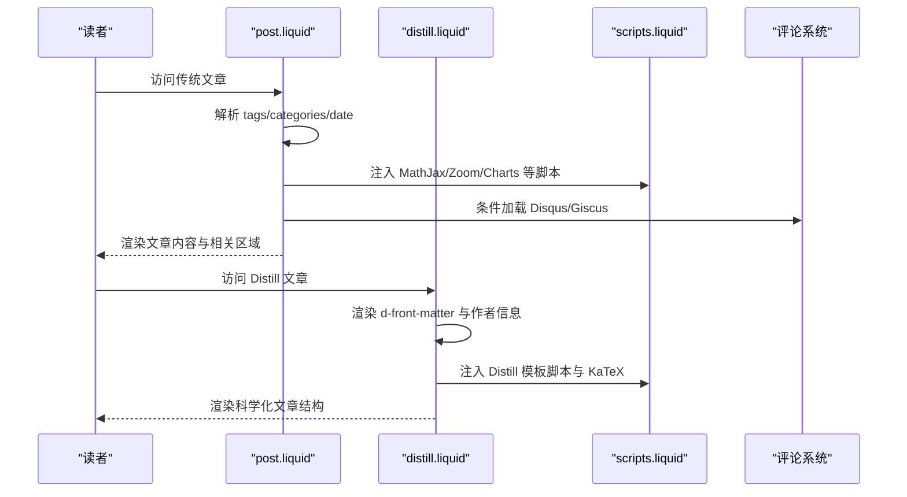
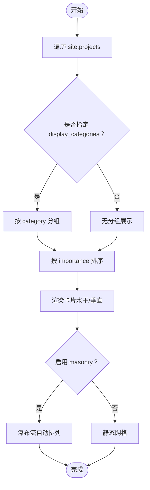
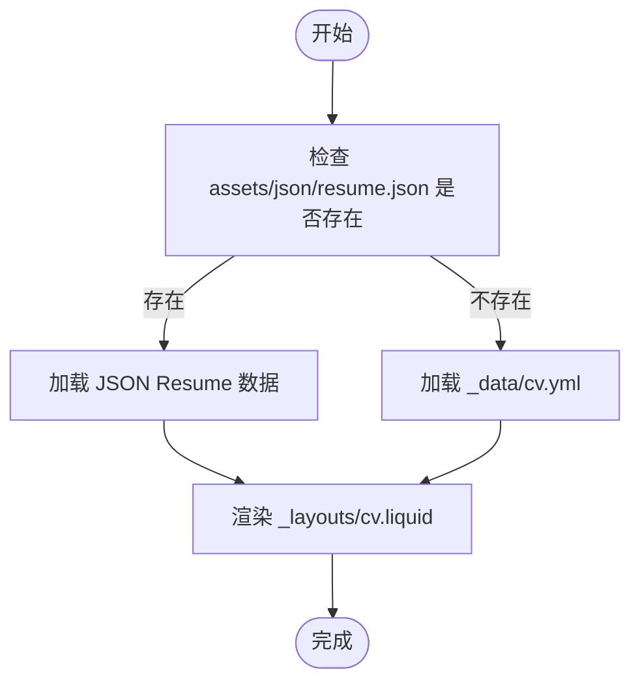
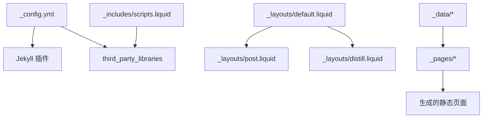

# 核心功能特性

<cite>
**本文档引用的文件**
- [_config.yml](file://_config.yml)
- [README.md](file://README.md)
- [CUSTOMIZE.md](file://CUSTOMIZE.md)
- [INSTALL.md](file://INSTALL.md)
- [FAQ.md](file://FAQ.md)
- [default.liquid](file://_layouts/default.liquid)
- [post.liquid](file://_layouts/post.liquid)
- [distill.liquid](file://_layouts/distill.liquid)
- [publications.md](file://_pages/publications.md)
- [projects.md](file://_pages/projects.md)
- [cv.yml](file://_data/cv.yml)
- [socials.yml](file://_data/socials.yml)
- [google-scholar-citations.rb](file://_plugins/google-scholar-citations.rb)
- [scripts.liquid](file://_includes/scripts.liquid)
- [_themes.scss](file://_sass/_themes.scss)
</cite>

## 目录
1. [简介](#简介)
2. [项目结构](#项目结构)
3. [核心组件](#核心组件)
4. [架构总览](#架构总览)
5. [详细组件分析](#详细组件分析)
6. [依赖关系分析](#依赖关系分析)
7. [性能考量](#性能考量)
8. [故障排除指南](#故障排除指南)
9. [结论](#结论)
10. [附录](#附录)

## 简介
al-folio 是一个专为学者与研究人员设计的简洁、响应式 Jekyll 主题，强调内容呈现与可访问性。本项目围绕五大核心功能模块构建：学术出版物管理（基于 BibTeX 的论文页）、博客系统（支持 Distill 风格文章与传统 Markdown 文章）、项目展示（响应式网格布局）、CV 管理（JSON/YAML 双轨生成）、新闻公告（集合化管理）。同时提供暗色模式切换、数学公式渲染、代码高亮、图片缩放、图表可视化、搜索与归档等增强功能，形成完整的学术个人网站解决方案。

## 项目结构
项目采用 Jekyll 标准目录组织，结合 Liquid 模板引擎与 Sass 样式系统，通过配置文件集中控制站点行为与第三方库版本。关键目录与文件职责如下：
- 根配置：_config.yml 定义站点元信息、主题开关、Jekyll 插件、第三方库版本等
- 页面与布局：_pages/* 提供固定页面入口，_layouts/* 定义页面骨架与文章布局
- 内容集合：_posts/*（博客）、_projects/*（项目）、_news/*（新闻）、_books/*（书架）
- 数据与样式：_data/*（CV、社交链接、仓库信息）、_sass/*（主题变量与样式）
- 包含与脚本：_includes/*（复用片段）、assets/js/*（功能脚本）、assets/css/*（样式）
- 插件：_plugins/*（自定义 Liquid 标签与处理逻辑）

**图示来源**
- [_config.yml](file://_config.yml)
- [default.liquid](file://_layouts/default.liquid)
- [post.liquid](file://_layouts/post.liquid)
- [distill.liquid](file://_layouts/distill.liquid)

**章节来源**
- [_config.yml](file://_config.yml)
- [README.md](file://README.md)

## 核心组件
本节概述五大核心功能模块及其设计理念与实现要点：

- 学术出版物管理
  - 基于 Jekyll Scholar 与 BibTeX：通过 _config.yml 中 scholar 配置与 _bibliography/papers.bib 文件，自动生成论文列表、按年份分组、作者高亮与链接、外部数据库徽章（Altmetric、Dimensions、Google Scholar、INSPIRE-HEP）等
  - 特色：支持自定义字段（pdf、code、slides、website、abstract 等），以及“更多作者”动画展开与缩略图显示开关
- 博客系统
  - 传统 Markdown 文章：post 布局支持标签/分类归档、侧边目录、相关文章、评论（Disqus/Giscus）
  - Distill 风格文章：distill 布局提供科学化排版、作者信息、KaTeX 数学支持、参考文献与脚注
- 项目展示
  - 响应式网格布局：支持水平/垂直卡片排列、按类别分组展示、重要性排序、masonry 自动排列
- CV 管理
  - 双轨生成：优先加载 assets/json/resume.json（JSON Resume 标准），回退至 _data/cv.yml；支持时间表、嵌套列表、映射等多种块类型
- 新闻公告
  - 集合化管理：_news/* 下的 Markdown 条目自动在关于页展示，支持内联与外链两种形式

**章节来源**
- [_config.yml](file://_config.yml)
- [publications.md](file://_pages/publications.md)
- [projects.md](file://_pages/projects.md)
- [cv.yml](file://_data/cv.yml)
- [socials.yml](file://_data/socials.yml)
- [post.liquid](file://_layouts/post.liquid)
- [distill.liquid](file://_layouts/distill.liquid)

## 架构总览
下图展示了从内容到渲染的关键路径：内容文件（Markdown/数据）经由 Jekyll 处理，Liquid 模板决定页面结构，Sass 编译样式，JavaScript 动态注入功能脚本，最终输出静态页面。

**图示来源**
- [_config.yml](file://_config.yml)
- [scripts.liquid](file://_includes/scripts.liquid)
- [_themes.scss](file://_sass/_themes.scss)

## 详细组件分析

### 学术出版物管理（Publications）
- 设计理念
  - 将论文作为“数据资产”，通过 BibTeX 统一描述，利用 Jekyll Scholar 自动生成页面，减少手工维护成本
  - 支持多种外部指标徽章，提升论文可见度与学术影响力展示
- 实现方式
  - 配置：_config.yml 的 scholar 节点定义作者名、样式、源目录、模板、过滤器等
  - 数据：_bibliography/papers.bib 存放条目；可通过自定义字段扩展按钮与链接
  - 布局：_pages/publications.md 引入搜索片段并调用 
  - 徽章：通过 _config.yml 开关启用 Altmetric、Dimensions、Google Scholar、INSPIRE-HEP
- 关键特性
  - 分组与排序：按年降序分组，支持限制作者数量与动画展开
  - 缩略图：可按条目设置预览图
  - 搜索：内置 BibTeX 搜索片段，便于快速定位
- 使用示例
  - 在 BibTeX 条目中添加 pdf/code/slides 等字段，即可在网页上生成对应按钮
  - 在 _config.yml 中调整 scholar.group_by 与 group_order 控制分组策略
- 最佳实践
  - 统一字段命名与值格式，避免渲染冲突
  - 合理使用 filtered_bibtex_keywords 过滤内部关键字
  - 对长作者列表启用动画展开，提升页面性能

**图示来源**
- [_config.yml](file://_config.yml)
- [publications.md](file://_pages/publications.md)

**章节来源**
- [_config.yml](file://_config.yml)
- [publications.md](file://_pages/publications.md)

### 博客系统（Posts）
- 设计理念
  - 兼容两种风格：Distill 科学化排版与传统 Markdown 文章，满足不同内容形态需求
  - 强化可发现性：标签/分类归档、侧边目录、相关文章、评论系统
- 实现方式
  - 传统文章：post 布局负责标题、元信息、标签/分类链接、TOC、内容区、引用、相关文章、评论
  - Distill 文章：distill 布局引入 d-front-matter、d-article、d-appendix 等语义容器，支持 KaTeX 数学与参考文献
  - 归档：jekyll-archives-v2 在 _config.yml 中启用年/标签/分类归档
- 特色功能
  - Distill 风格：使用 <d-*> 标签实现标题、作者、摘要、目录、脚注、引用与参考文献
  - 数学公式：MathJax 支持行内/块级 $ 和 $$，配合 KaTeX 语法
  - 代码高亮：Rouge 高亮，支持行号与行内高亮
  - 图片缩放：Medium Zoom 提供类似 Medium 的图片放大体验
  - 图表可视化：Mermaid、Chart.js、ECharts、Plotly、Vega-Lite 等
- 使用示例
  - 创建 Distill 文章时，在 front matter 设置 authors、date、description，并在正文使用 <d-*> 标签
  - 在文章中插入 Mermaid 流程图或 Chart.js 折线图，需在 front matter 开启相应开关
- 最佳实践
  - 合理使用标签与分类，便于读者导航
  - 对长文开启侧边目录，提升阅读体验
  - 使用 Giscus 替代 Disqus，获得更好的暗色模式适配

**图示来源**
- [post.liquid](file://_layouts/post.liquid)
- [distill.liquid](file://_layouts/distill.liquid)
- [scripts.liquid](file://_includes/scripts.liquid)

**章节来源**
- [post.liquid](file://_layouts/post.liquid)
- [distill.liquid](file://_layouts/distill.liquid)
- [_config.yml](file://_config.yml)

### 项目展示（Projects）
- 设计理念
  - 以响应式网格为核心，支持水平/垂直排列、按类别分组、重要性排序，兼顾美观与信息密度
- 实现方式
  - 布局：_pages/projects.md 通过 Liquid 遍历 site.projects，支持 display_categories 与 horizontal 开关
  - 卡片：_includes/projects.liquid 与 projects_horizontal.liquid 提供统一卡片结构
  - 排列：masonry + imagesLoaded 实现瀑布流布局，提升视觉层次
- 特色功能
  - 类别分组：按 front matter 的 category 字段分组展示
  - 重要性排序：按 importance 字段升序排列，数值越小越靠前
  - 响应式：Bootstrap 栅格系统，适配桌面与移动设备
- 使用示例
  - 在项目 Markdown 的 front matter 设置 category 与 importance
  - 在 projects.md 中设置 display_categories 控制展示类别
- 最佳实践
  - 为项目提供清晰的分类与标签，便于筛选
  - 控制项目数量，避免瀑布流过度拥挤

**图示来源**
- [projects.md](file://_pages/projects.md)

**章节来源**
- [projects.md](file://_pages/projects.md)

### CV 管理（CV）
- 设计理念
  - 双轨生成机制：优先使用 JSON Resume（程序友好），回退至 YAML（人工友好），兼顾自动化与可编辑性
- 实现方式
  - JSON 路径：assets/json/resume.json 通过 jekyll_get_json 与 jsonresume.* 字段映射到页面
  - YAML 路径：_data/cv.yml 作为回退方案，支持 map、time_table、nested_list、list 等块类型
  - 布局：_layouts/cv.liquid 负责渲染各区块
- 特色功能
  - 多种块类型：地图、时间轴、嵌套列表、普通列表，满足不同信息结构
  - 自动化：JSON Resume 标准便于导出与同步
- 使用示例
  - 若存在 resume.json，则优先使用；否则回退到 cv.yml
  - 在 _config.yml 中配置 jekyll_get_json 与 jsonresume.* 字段
- 最佳实践
  - 保持 JSON 与 YAML 结构一致，避免字段缺失
  - 使用 JSON Resume 工具链进行版本管理与导出

**图示来源**
- [_config.yml](file://_config.yml)
- [cv.yml](file://_data/cv.yml)

**章节来源**
- [_config.yml](file://_config.yml)
- [cv.yml](file://_data/cv.yml)

### 新闻公告（News）
- 设计理念
  - 将动态信息以集合形式管理，统一在关于页展示，支持内联与外链两种呈现方式
- 实现方式
  - 集合：_news/* 下的 Markdown 条目自动纳入 news 集合
  - 展示：_includes/news.liquid 与 _pages/about.md 中的 announcements 区域
- 特色功能
  - 内联新闻：直接在关于页显示文本
  - 外链新闻：点击跳转到独立页面
- 使用示例
  - 在 _news/ 下新增 Markdown 文件，按需设置标题与内容
  - 在 about.md 中引用 news.liquid 片段
- 最佳实践
  - 控制更新频率，避免信息过载
  - 使用清晰的时间戳与标题，便于归档

**章节来源**
- [README.md](file://README.md)

## 依赖关系分析
- 配置驱动
  - _config.yml 是全局开关与参数中心，控制 Jekyll 插件、第三方库版本、功能开关（如 enable_math、enable_darkmode、enable_masonry 等）
- 模板耦合
  - default.liquid 作为基础布局，被 post.liquid 与 distill.liquid 继承，确保头部、脚部与脚本注入的一致性
  - scripts.liquid 条件加载各类功能脚本，体现“按需注入”的设计
- 数据与布局
  - _data/* 与 _pages/* 通过 Liquid 变量与循环渲染，形成“数据驱动”的页面生成
- 第三方库
  - third_party_libraries 节点集中管理版本与完整性校验，确保跨环境一致性

**图示来源**
- [_config.yml](file://_config.yml)
- [scripts.liquid](file://_includes/scripts.liquid)
- [default.liquid](file://_layouts/default.liquid)
- [post.liquid](file://_layouts/post.liquid)
- [distill.liquid](file://_layouts/distill.liquid)

**章节来源**
- [_config.yml](file://_config.yml)
- [scripts.liquid](file://_includes/scripts.liquid)

## 性能考量
- 资源优化
  - 压缩与缓存：sass.style: compressed，jekyll-minifier 与 terser 配置减少体积
  - 懒加载：lazy_loading_images 启用图片懒加载，改善首屏性能
  - 响应式图片：imagemagick 宽度配置与 WebP 输出，降低带宽占用
- 渲染策略
  - 条件加载：scripts.liquid 按页面 front matter 开关注入脚本，避免不必要的资源消耗
  - 瀑布流：masonry 仅在启用时加载，减少 DOM 计算
- 搜索与归档
  - jekyll-archives-v2 与 jekyll-toc 减少前端计算，提升导航效率
- 建议
  - 合理裁剪插件与第三方库，仅启用必要功能
  - 使用 CDN 与完整性校验，平衡加载速度与安全性

**章节来源**
- [_config.yml](file://_config.yml)
- [scripts.liquid](file://_includes/scripts.liquid)

## 故障排除指南
- 部署失败
  - 确认部署分支设置为 gh-pages，url/baseurl 配置正确
  - 参考 FAQ 中关于 Unknown tag 'toc'、CSS/JS 加载异常的排查步骤
- 相关文章不显示
  - 检查 classifier-reborn 插件与文章内容长度，必要时禁用 LSI 或在特定文章 front matter 添加 related_posts: false
- 自定义域名问题
  - 在 main 分支添加 CNAME 文件，确保域名解析正确
- 代码格式化错误
  - 使用 Prettier 并遵循本地/CI 规则，或在仓库中禁用相关工作流
- GitHub 登录认证
  - 将远程地址从 https 改为 ssh，避免密码认证被禁导致的错误
- Lighthouse Badger 缺少 token
  - 在仓库 Secrets 中添加 LIGHTHOUSE_BADGER_TOKEN 并赋予必要权限

**章节来源**
- [FAQ.md](file://FAQ.md)
- [_config.yml](file://_config.yml)

## 结论
al-folio 通过“配置驱动 + 模板复用 + 数据解耦”的架构，将学术出版物、博客、项目、CV、新闻等核心功能有机整合，既保证了内容的专业性与可维护性，又提供了丰富的交互与视觉体验。其模块化设计与完善的配置体系，使得用户能够根据自身需求灵活选择与组合功能，快速搭建高质量的学术个人网站。

## 附录
- 快速开始
  - 参考 INSTALL.md 完成本地与云端部署，设置 url/baseurl 与 GitHub Actions 权限
- 自定义指南
  - 参考 CUSTOMIZE.md 修改项目结构、添加新页面/集合、调整主题颜色与字体
- 社区与支持
  - README.md 提供社区案例与常见问题索引，FAQ.md 涵盖部署与功能疑难解答

**章节来源**
- [INSTALL.md](file://INSTALL.md)
- [CUSTOMIZE.md](file://CUSTOMIZE.md)
- [README.md](file://README.md)
- [FAQ.md](file://FAQ.md)