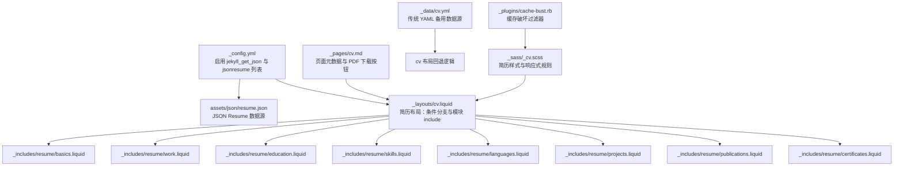
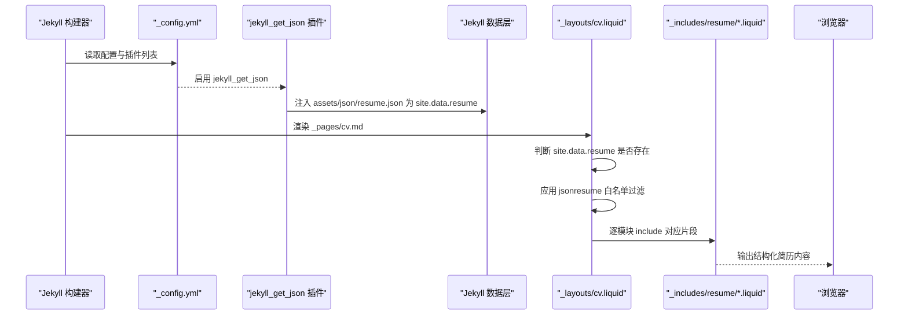
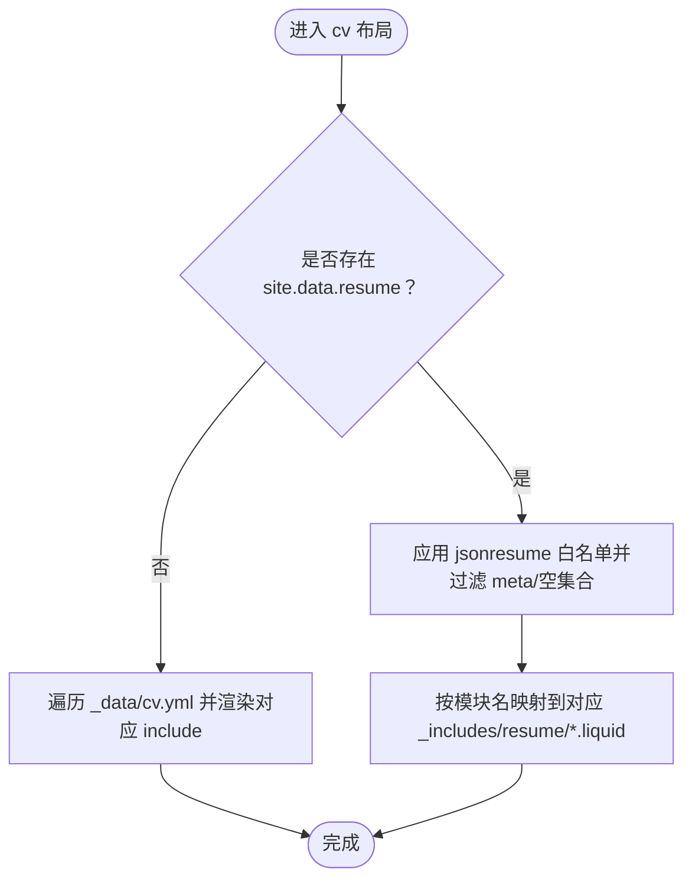
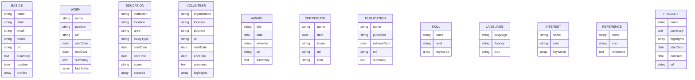
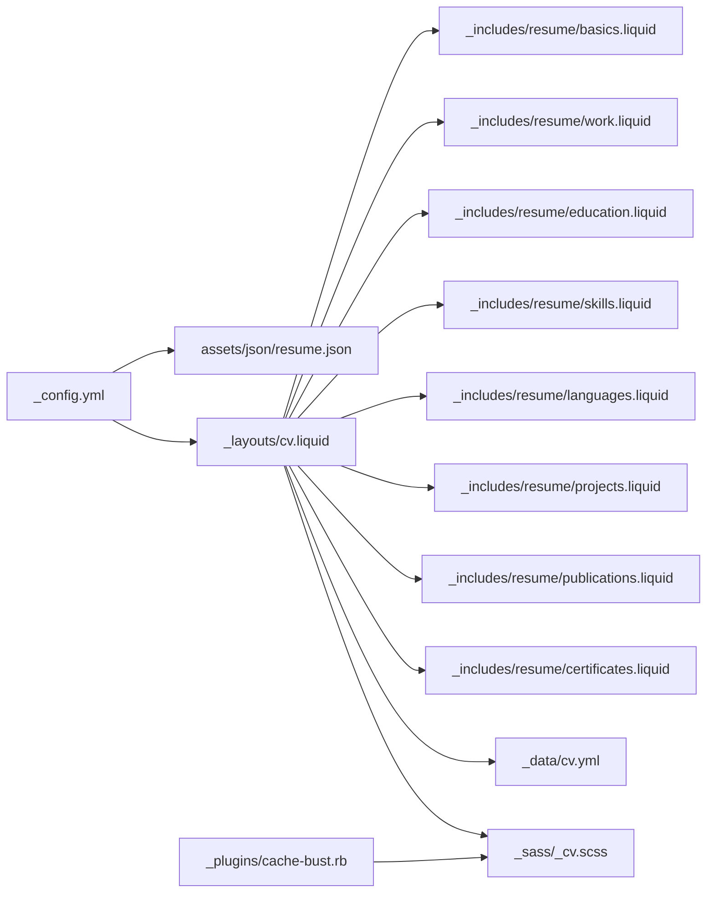

# 简历管理功能

<cite>
**本文引用的文件**
- [_config.yml](file://_config.yml)
- [_layouts/cv.liquid](file://_layouts/cv.liquid)
- [_pages/cv.md](file://_pages/cv.md)
- [_data/cv.yml](file://_data/cv.yml)
- [assets/json/resume.json](file://assets/json/resume.json)
- [_includes/resume/basics.liquid](file://_includes/resume/basics.liquid)
- [_includes/resume/work.liquid](file://_includes/resume/work.liquid)
- [_includes/resume/education.liquid](file://_includes/resume/education.liquid)
- [_includes/resume/skills.liquid](file://_includes/resume/skills.liquid)
- [_includes/resume/languages.liquid](file://_includes/resume/languages.liquid)
- [_includes/resume/projects.liquid](file://_includes/resume/projects.liquid)
- [_includes/resume/publications.liquid](file://_includes/resume/publications.liquid)
- [_includes/resume/certificates.liquid](file://_includes/resume/certificates.liquid)
- [_sass/_cv.scss](file://_sass/_cv.scss)
- [_plugins/cache-bust.rb](file://_plugins/cache-bust.rb)
</cite>

## 目录
1. [简介](#简介)
2. [项目结构](#项目结构)
3. [核心组件](#核心组件)
4. [架构总览](#架构总览)
5. [详细组件分析](#详细组件分析)
6. [依赖关系分析](#依赖关系分析)
7. [性能考虑](#性能考虑)
8. [故障排查指南](#故障排查指南)
9. [结论](#结论)
10. [附录](#附录)

## 简介
本文件面向“简历管理功能”，围绕基于 JSON Resume 格式的在线简历系统进行系统化说明。内容涵盖数据结构与来源（JSON 文件与 YAML 数据）、模板渲染机制（Jekyll Liquid 模板与 include 片段）、简历配置项（如 jekyll_get_json、jsonresume）的作用与设置方法、CV 数据文件的结构与字段定义（基本信息、工作经历、教育背景、技能、证书、出版物、项目、语言、兴趣、奖项、参考文献等）、简历模板的定制与样式调整、多语言支持与本地化配置、最佳实践与更新指南、响应式设计与打印优化、SEO 考虑，以及从外部系统同步简历数据与自动化更新流程。

## 项目结构
该简历系统以 Jekyll 静态站点生成器为核心，通过配置文件启用 JSON 数据抓取插件，并在页面布局中按模块渲染 JSON Resume 字段。同时保留了传统 YAML 数据作为备选或混合来源，用于展示“通用信息”等模块。

图示来源
- [_config.yml:629-646](file://_config.yml#L629-L646)
- [assets/json/resume.json:1-201](file://assets/json/resume.json#L1-L201)
- [_layouts/cv.liquid:1-128](file://_layouts/cv.liquid#L1-L128)
- [_pages/cv.md:1-12](file://_pages/cv.md#L1-L12)
- [_data/cv.yml:1-98](file://_data/cv.yml#L1-L98)
- [_sass/_cv.scss:1-221](file://_sass/_cv.scss#L1-L221)
- [_plugins/cache-bust.rb:1-51](file://_plugins/cache-bust.rb#L1-L51)

章节来源
- [_config.yml:629-646](file://_config.yml#L629-L646)
- [_layouts/cv.liquid:1-128](file://_layouts/cv.liquid#L1-L128)
- [_pages/cv.md:1-12](file://_pages/cv.md#L1-L12)
- [_data/cv.yml:1-98](file://_data/cv.yml#L1-L98)
- [_sass/_cv.scss:1-221](file://_sass/_cv.scss#L1-L221)
- [_plugins/cache-bust.rb:1-51](file://_plugins/cache-bust.rb#L1-L51)

## 核心组件
- 配置与数据抓取
  - jekyll_get_json：将远程或本地 JSON 文件注入到 Jekyll 数据目录，供 Liquid 模板读取。
  - jsonresume：限定仅渲染 JSON Resume 规范中的指定模块，避免无关字段干扰。
- 布局与模板
  - 布局文件根据是否存在 JSON 数据选择不同的渲染路径；存在时按模块 include 对应片段。
- 数据源
  - JSON Resume 数据位于 assets/json/resume.json。
  - 传统 YAML 数据位于 _data/cv.yml，可作为回退或补充。
- 页面入口
  - 页面 _pages/cv.md 指定布局为 cv，并可配置 PDF 下载链接与侧边栏目录。

章节来源
- [_config.yml:629-646](file://_config.yml#L629-L646)
- [_layouts/cv.liquid:1-128](file://_layouts/cv.liquid#L1-L128)
- [_pages/cv.md:1-12](file://_pages/cv.md#L1-L12)
- [_data/cv.yml:1-98](file://_data/cv.yml#L1-L98)
- [assets/json/resume.json:1-201](file://assets/json/resume.json#L1-L201)

## 架构总览
下图展示了从配置到页面渲染的关键流程：Jekyll 在构建阶段读取配置，使用插件加载 JSON 数据，布局根据数据存在性与模块白名单决定渲染哪些模块，并通过 include 片段输出结构化 HTML。

图示来源
- [_config.yml:200-219](file://_config.yml#L200-L219)
- [_config.yml:629-646](file://_config.yml#L629-L646)
- [_layouts/cv.liquid:55-127](file://_layouts/cv.liquid#L55-L127)

## 详细组件分析

### 配置与数据抓取（jekyll_get_json 与 jsonresume）
- jekyll_get_json
  - 将 JSON 数据源映射到 Jekyll 数据目录，键名为 resume，可通过 site.data.resume 访问。
  - 支持本地文件路径或远程 URL。
- jsonresume
  - 定义允许渲染的模块清单，未在清单内的模块将被忽略，确保只展示规范字段。
- 作用与设置
  - 在构建阶段生效，无需手动触发；变更后重新生成站点即可应用。

章节来源
- [_config.yml:629-646](file://_config.yml#L629-L646)

### 布局与条件渲染（_layouts/cv.liquid）
- 双重数据源策略
  - 若存在 site.data.resume，则优先按 JSON Resume 模块渲染。
  - 否则回退到 _data/cv.yml 的传统 YAML 数据。
- 模块白名单与过滤
  - 使用 jsonresume 列表过滤模块名，跳过 meta 与空集合。
- 模块映射
  - basics → 基本信息
  - work → 工作经历
  - education → 教育背景
  - volunteer → 志愿服务
  - projects → 项目
  - awards → 奖项
  - skills → 技能
  - publications → 出版物
  - languages → 语言
  - interests → 兴趣
  - certificates → 证书
  - references → 参考文献

图示来源
- [_layouts/cv.liquid:55-127](file://_layouts/cv.liquid#L55-L127)

章节来源
- [_layouts/cv.liquid:1-128](file://_layouts/cv.liquid#L1-L128)

### 页面入口（_pages/cv.md）
- 指定布局为 cv，控制导航与顺序。
- 可配置 cv_pdf 为本地 PDF 或外链 PDF，自动添加下载按钮。
- 可配置描述与侧边栏目录。

章节来源
- [_pages/cv.md:1-12](file://_pages/cv.md#L1-L12)

### JSON Resume 数据结构与字段定义（assets/json/resume.json）
以下为各模块字段概览（以实际 JSON 字段为准）：
- basics：姓名、头衔、邮箱、电话、URL、摘要、位置、社交资料等。
- work：公司/机构、职位、开始/结束日期、高亮条目等。
- volunteer：组织、地点、职位、开始/结束日期、高亮条目等。
- education：机构、地点、专业、学位、开始/结束日期、成绩、课程等。
- awards：奖项名称、日期、授予方、URL、摘要等。
- certificates：证书名称、日期、颁发机构、图标等。
- publications：名称、出版者、发布日期、URL、摘要等。
- skills：技能类别、等级、关键词等。
- languages：语言、熟练度、图标等。
- interests：兴趣类别、关键词等。
- references：推荐人、引用内容等。
- projects：项目名称、时间、摘要、高亮条目、URL 等。

图示来源
- [assets/json/resume.json:1-201](file://assets/json/resume.json#L1-L201)

章节来源
- [assets/json/resume.json:1-201](file://assets/json/resume.json#L1-L201)

### 模板片段与渲染逻辑
- 基本信息（basics.liquid）
  - 过滤空值与特定字段，自动识别 URL、邮箱、电话并生成可点击链接。
- 工作经历（work.liquid）
  - 按开始日期排序并倒序显示，日期格式化为“YYYY.MM - YYYY.MM”或“Present”，支持地点徽标。
- 教育背景（education.liquid）
  - 类似工作经历的时间处理与地点显示。
- 技能（skills.liquid）
  - 分组展示技能类别与关键词，支持图标列。
- 语言（languages.liquid）
  - 展示语言与熟练度，支持图标列。
- 项目（projects.liquid）
  - 展示项目名称、摘要、高亮条目与时间。
- 出版物（publications.liquid）
  - 按发布日期倒序排列，展示名称、出版者与摘要。
- 证书（certificates.liquid）
  - 按日期倒序排列，展示证书名称、颁发机构与日期。

章节来源
- [_includes/resume/basics.liquid:1-29](file://_includes/resume/basics.liquid#L1-L29)
- [_includes/resume/work.liquid:1-53](file://_includes/resume/work.liquid#L1-L53)
- [_includes/resume/education.liquid:1-55](file://_includes/resume/education.liquid#L1-L55)
- [_includes/resume/skills.liquid:1-34](file://_includes/resume/skills.liquid#L1-L34)
- [_includes/resume/languages.liquid:1-32](file://_includes/resume/languages.liquid#L1-L32)
- [_includes/resume/projects.liquid:1-33](file://_includes/resume/projects.liquid#L1-L33)
- [_includes/resume/publications.liquid:1-29](file://_includes/resume/publications.liquid#L1-L29)
- [_includes/resume/certificates.liquid:1-36](file://_includes/resume/certificates.liquid#L1-L36)

### 样式与响应式设计（_sass/_cv.scss）
- 统一简历表格与列表的间距、字号与对齐方式。
- 时间徽标、地点图标、技能分组布局等样式。
- 侧边目录锚点定位与时间轴样式。
- 与主题变量联动，适配明暗模式。

章节来源
- [_sass/_cv.scss:1-221](file://_sass/_cv.scss#L1-L221)

### 缓存破坏与资源更新（_plugins/cache-bust.rb）
- 提供 bust_css_cache 过滤器，基于 SCSS 目录内容生成哈希，用于强制刷新样式缓存。
- 适用于样式改动后确保用户端获取最新样式。

章节来源
- [_plugins/cache-bust.rb:1-51](file://_plugins/cache-bust.rb#L1-L51)

## 依赖关系分析
- 配置依赖
  - _config.yml 中启用 jekyll_get_json 与 jsonresume 列表，是数据抓取与模块白名单的基础。
- 数据依赖
  - _layouts/cv.liquid 依赖 site.data.resume 存在性与 jsonresume 列表。
  - 回退路径依赖 _data/cv.yml。
- 模板依赖
  - 布局对各模块 include 片段有直接依赖。
- 样式依赖
  - 所有模块渲染均受 _sass/_cv.scss 控制的样式影响。
- 插件依赖
  - 缓存破坏过滤器依赖本地文件系统读取与哈希计算。

图示来源
- [_config.yml:629-646](file://_config.yml#L629-L646)
- [_layouts/cv.liquid:55-127](file://_layouts/cv.liquid#L55-L127)
- [_includes/resume/*.liquid:1-29](file://_includes/resume/basics.liquid#L1-L29)
- [_sass/_cv.scss:1-221](file://_sass/_cv.scss#L1-L221)
- [_plugins/cache-bust.rb:1-51](file://_plugins/cache-bust.rb#L1-L51)

章节来源
- [_config.yml:629-646](file://_config.yml#L629-L646)
- [_layouts/cv.liquid:55-127](file://_layouts/cv.liquid#L55-L127)
- [_includes/resume/*.liquid:1-29](file://_includes/resume/basics.liquid#L1-L29)
- [_sass/_cv.scss:1-221](file://_sass/_cv.scss#L1-L221)
- [_plugins/cache-bust.rb:1-51](file://_plugins/cache-bust.rb#L1-L51)

## 性能考虑
- 构建期处理
  - jekyll_get_json 在构建阶段一次性注入数据，运行时无需额外请求。
- 模板渲染
  - 使用排序与倒序逻辑时注意数据量大小；对大型列表可考虑分页或懒加载。
- 样式缓存
  - 使用缓存破坏过滤器在样式更新后强制刷新，避免旧缓存导致的视觉不一致。
- 资源优化
  - 合理压缩与合并 CSS/JS，减少请求数与体积。

## 故障排查指南
- JSON 数据未生效
  - 检查 jekyll_get_json 配置是否正确指向 JSON 文件路径或 URL。
  - 确认 _layouts/cv.liquid 中存在 site.data.resume 条件分支。
- 模块未显示
  - 检查 jsonresume 列表是否包含对应模块名，且模块非空。
  - 排查模块名大小写与拼写。
- 链接与图标异常
  - 确认 URL、邮箱、电话字段格式正确；图标类名需与字体库一致。
- 样式未更新
  - 使用缓存破坏过滤器生成带哈希的样式链接，确保浏览器获取最新版本。
- PDF 下载按钮无效
  - 检查 _pages/cv.md 中 cv_pdf 配置是否为有效路径或外链。

章节来源
- [_config.yml:629-646](file://_config.yml#L629-L646)
- [_layouts/cv.liquid:55-127](file://_layouts/cv.liquid#L55-L127)
- [_includes/resume/basics.liquid:1-29](file://_includes/resume/basics.liquid#L1-L29)
- [_plugins/cache-bust.rb:1-51](file://_plugins/cache-bust.rb#L1-L51)
- [_pages/cv.md:1-12](file://_pages/cv.md#L1-L12)

## 结论
本简历系统通过 Jekyll 配置与插件机制，将 JSON Resume 数据无缝集成到静态站点中，并以模块化的 Liquid 模板实现结构化渲染。配合样式与缓存策略，既保证了展示效果的一致性，也便于维护与扩展。建议在团队协作中统一 JSON 字段与模板结构，结合自动化流程定期同步外部数据，确保简历内容的准确性与时效性。

## 附录

### 多语言支持与本地化配置
- 站点语言由配置项控制，可用于国际化文案与日期格式化策略。
- 模板中部分文本采用固定英文标签，若需多语言，可在相应 include 片段中引入本地化变量或条件判断。

章节来源
- [_config.yml:20-21](file://_config.yml#L20-L21)

### 响应式设计与打印优化
- 响应式布局通过 SCSS 中的媒体查询与弹性网格实现，适配桌面与移动设备。
- 打印优化建议：在打印样式中隐藏非必要元素、调整颜色与边距，确保打印版简历清晰可读。

章节来源
- [_sass/_cv.scss:1-221](file://_sass/_cv.scss#L1-L221)

### SEO 考虑
- 页面标题与描述由页面元数据提供，建议在 _pages/cv.md 中维护准确的 SEO 元信息。
- 内容结构清晰、语义化标签完整，有助于搜索引擎索引。

章节来源
- [_pages/cv.md:1-12](file://_pages/cv.md#L1-L12)

### 从外部系统同步简历数据与自动化更新
- 数据同步
  - 将外部系统导出的 JSON Resume 文件上传至 assets/json/resume.json。
  - 确保字段与 JSON Resume 规范一致，避免渲染异常。
- 自动化更新
  - 在 CI/CD 流程中执行 Jekyll 构建与部署，实现“外部数据变更 → 自动构建 → 静态站点更新”的闭环。
  - 可结合缓存破坏策略确保样式与内容及时生效。