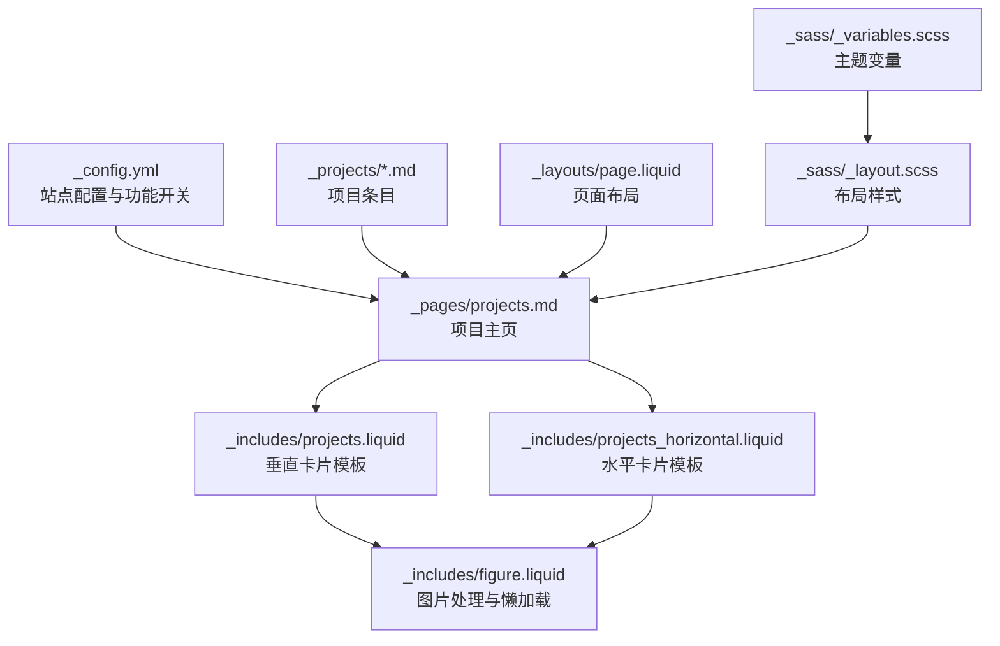
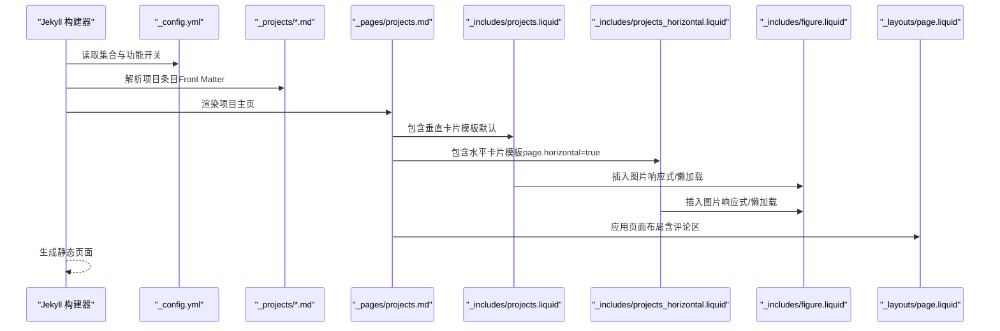
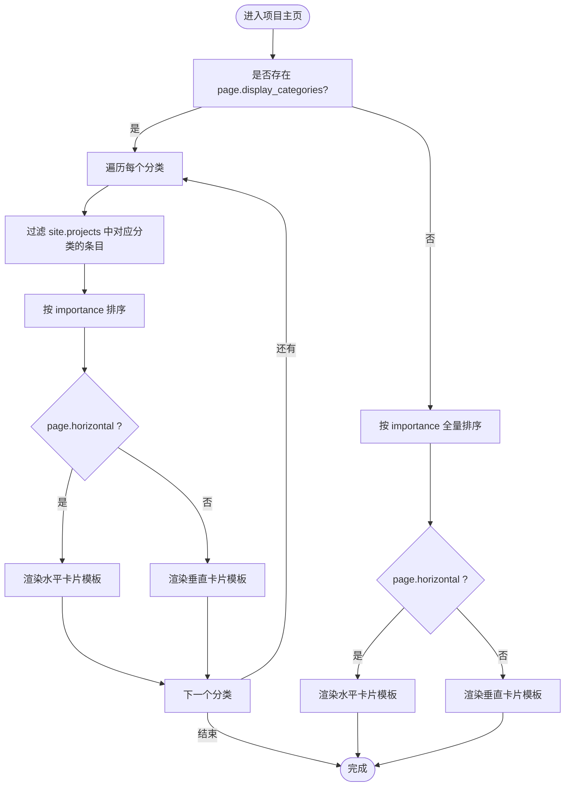
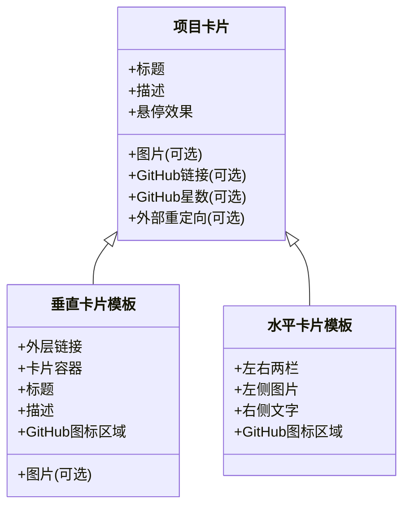
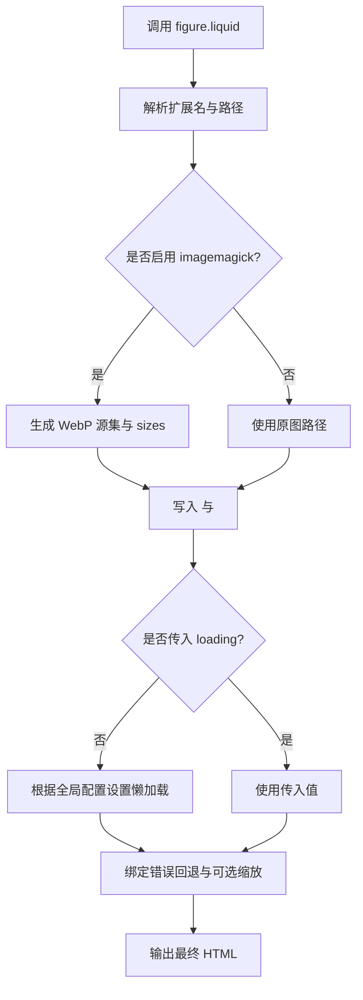
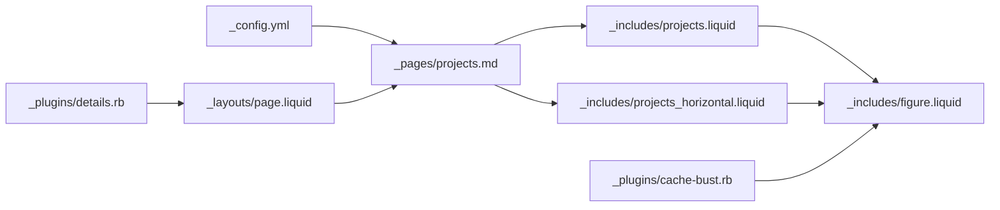

# 项目展示系统

<cite>
**本文引用的文件**
- [_config.yml](file://_config.yml)
- [_pages/projects.md](file://_pages/projects.md)
- [_includes/projects.liquid](file://_includes/projects.liquid)
- [_includes/projects_horizontal.liquid](file://_includes/projects_horizontal.liquid)
- [_includes/figure.liquid](file://_includes/figure.liquid)
- [_layouts/page.liquid](file://_layouts/page.liquid)
- [_sass/_layout.scss](file://_sass/_layout.scss)
- [_sass/_variables.scss](file://_sass/_variables.scss)
- [_plugins/cache-bust.rb](file://_plugins/cache-bust.rb)
- [_plugins/details.rb](file://_plugins/details.rb)
- [_projects/1_project.md](file://_projects/1_project.md)
- [_projects/2_project.md](file://_projects/2_project.md)
</cite>

## 目录
1. [简介](#简介)
2. [项目结构](#项目结构)
3. [核心组件](#核心组件)
4. [架构总览](#架构总览)
5. [详细组件分析](#详细组件分析)
6. [依赖关系分析](#依赖关系分析)
7. [性能考虑](#性能考虑)
8. [故障排查指南](#故障排查指南)
9. [结论](#结论)
10. [附录](#附录)

## 简介
本文件面向“项目展示系统”，围绕基于 Jekyll 集合（Collections）的项目管理能力进行系统化说明。重点涵盖以下方面：
- 项目集合的创建与组织：通过 _projects 目录下的条目管理项目资源。
- 分类与标签系统：支持按类别分组展示，以及可选的标签归档。
- 响应式网格布局：提供垂直（纵向卡片）与水平（左右图文）两种布局模式。
- 项目配置选项：如 enable_masonry、enable_project_categories 等参数的作用与影响。
- 项目卡片显示逻辑、图片处理、链接管理与交互效果。
- 垂直与水平布局的使用场景与配置方法。
- 项目与博客、新闻等内容类型的集成方式。

## 项目结构
该项目采用 Jekyll 标准目录结构，其中与“项目展示”直接相关的关键位置如下：
- 配置与功能开关：_config.yml 中启用 projects 集合与若干可选功能（如 Masonry 自动排列、项目分类开关）。
- 项目条目：_projects 下的 Markdown 文件作为项目集合条目，每个条目包含 Front Matter 与正文内容。
- 展示页面：_pages/projects.md 作为项目主页，负责渲染项目列表与分类导航。
- 卡片模板：_includes 下的 projects.liquid（垂直）与 projects_horizontal.liquid（水平）分别用于生成项目卡片。
- 图片处理：_includes/figure.liquid 负责响应式图片与懒加载等处理。
- 页面布局：_layouts/page.liquid 提供通用页面结构，支持评论区等扩展。
- 样式与变量：_sass/_layout.scss 与 _sass/_variables.scss 定义布局与主题变量。

**图表来源**
- [_config.yml:147-156](file://_config.yml#L147-L156)
- [_pages/projects.md:12-66](file://_pages/projects.md#L12-L66)
- [_includes/projects.liquid:1-36](file://_includes/projects.liquid#L1-L36)
- [_includes/projects_horizontal.liquid:1-35](file://_includes/projects_horizontal.liquid#L1-L35)
- [_includes/figure.liquid:1-87](file://_includes/figure.liquid#L1-L87)
- [_layouts/page.liquid:1-32](file://_layouts/page.liquid#L1-L32)
- [_sass/_layout.scss:50-54](file://_sass/_layout.scss#L50-L54)
- [_sass/_variables.scss:1-53](file://_sass/_variables.scss#L1-L53)

**章节来源**
- [_config.yml:147-156](file://_config.yml#L147-L156)
- [_pages/projects.md:12-66](file://_pages/projects.md#L12-L66)

## 核心组件
- 项目集合与条目
  - 在配置中启用 projects 集合作为输出集合，条目位于 _projects 目录下，每个条目以 YAML Front Matter 开头，包含标题、描述、图片、重要性排序字段等。
- 项目主页
  - _pages/projects.md 通过 Liquid 模板从 site.projects 中读取条目，按 importance 排序，并根据 page.horizontal 选择卡片模板。
- 卡片模板
  - 垂直卡片模板（projects.liquid）：适合密集网格展示；水平卡片模板（projects_horizontal.liquid）：适合图文并茂的横向排版。
- 图片处理
  - _includes/figure.liquid 统一处理图片路径、响应式 WebP 源集、sizes、懒加载、错误回退与可缩放属性等。
- 页面布局与样式
  - _layouts/page.liquid 提供通用页面结构与评论区挂载点；_sass/_layout.scss 与 _sass/_variables.scss 控制全局布局与主题变量。

**章节来源**
- [_config.yml:147-156](file://_config.yml#L147-L156)
- [_pages/projects.md:12-66](file://_pages/projects.md#L12-L66)
- [_includes/projects.liquid:1-36](file://_includes/projects.liquid#L1-L36)
- [_includes/projects_horizontal.liquid:1-35](file://_includes/projects_horizontal.liquid#L1-L35)
- [_includes/figure.liquid:1-87](file://_includes/figure.liquid#L1-L87)
- [_layouts/page.liquid:1-32](file://_layouts/page.liquid#L1-L32)
- [_sass/_layout.scss:50-54](file://_sass/_layout.scss#L50-L54)
- [_sass/_variables.scss:1-53](file://_sass/_variables.scss#L1-L53)

## 架构总览
项目展示系统在构建阶段由 Jekyll 处理：
- 解析 _config.yml 中的集合与功能开关；
- 扫描 _projects 下的条目，生成 site.projects；
- 渲染 _pages/projects.md，依据 Front Matter 与配置选择布局与模板；
- 使用 _includes/figure.liquid 输出响应式图片；
- 最终生成静态 HTML 并应用样式。

**图表来源**
- [_config.yml:147-156](file://_config.yml#L147-L156)
- [_pages/projects.md:12-66](file://_pages/projects.md#L12-L66)
- [_includes/projects.liquid:1-36](file://_includes/projects.liquid#L1-L36)
- [_includes/projects_horizontal.liquid:1-35](file://_includes/projects_horizontal.liquid#L1-L35)
- [_includes/figure.liquid:1-87](file://_includes/figure.liquid#L1-L87)
- [_layouts/page.liquid:1-32](file://_layouts/page.liquid#L1-L32)

## 详细组件分析

### 项目集合与条目管理
- 条目来源：_projects 目录下的 Markdown 文件即为项目集合条目。
- Front Matter 字段示例（来自现有条目）：
  - layout：页面布局类型
  - title：项目标题
  - description：项目描述
  - img：项目缩略图路径
  - importance：整数，用于排序
  - category：项目分类（字符串）
  - github / github_stars：代码仓库链接与星标 ID（用于展示 GitHub 图标与星数）
  - redirect：外部重定向链接（优先于内部链接）
  - related_publications：是否显示相关出版物
  - giscus_comments：是否启用评论区
- 最佳实践：
  - 为每个项目设置清晰的 title 与 description，便于 SEO 与可读性。
  - 使用 importance 数值控制首页展示顺序，数值越小越靠前。
  - 若存在 GitHub 仓库，提供 github 与 github_stars，提升透明度与互动性。
  - 对需要背景图的项目，在 Front Matter 中指定 img 字段。

**章节来源**
- [_projects/1_project.md:1-82](file://_projects/1_project.md#L1-L82)
- [_projects/2_project.md:1-82](file://_projects/2_project.md#L1-L82)

### 项目主页与分类展示
- 主页入口：_pages/projects.md
- 关键逻辑：
  - 读取 page.display_categories，若存在则按分类分组展示；
  - 使用 site.projects 进行排序（按 importance）；
  - 根据 page.horizontal 切换模板：true 使用水平卡片模板，false 使用垂直卡片模板；
  - 支持无分类时的全量展示。
- 分类与标签：
  - 分类：通过 Front Matter 的 category 字段与 page.display_categories 控制；
  - 标签：结合 Jekyll Archives 配置，可对 posts、books 等集合启用标签归档；项目集合本身未在配置中启用标签归档。

**图表来源**
- [_pages/projects.md:14-64](file://_pages/projects.md#L14-L64)

**章节来源**
- [_pages/projects.md:12-66](file://_pages/projects.md#L12-L66)

### 卡片模板与交互效果
- 垂直卡片模板（projects.liquid）
  - 结构：外层链接包裹卡片，卡片内含图片（可选）、标题、描述与 GitHub 图标区域。
  - 图片：通过 _includes/figure.liquid 插入，支持懒加载与响应式源集。
  - 交互：hoverable 类提供悬停效果；链接优先使用 redirect，否则使用内部链接。
- 水平卡片模板（projects_horizontal.liquid）
  - 结构：左右两栏，左侧为图片，右侧为文字信息；当无图片时右侧占满宽度。
  - 图片：同样通过 _includes/figure.liquid 插入，sizes 属性针对不同断点优化。
  - 交互：与垂直模板一致，提供悬停与点击跳转。

**图表来源**
- [_includes/projects.liquid:1-36](file://_includes/projects.liquid#L1-L36)
- [_includes/projects_horizontal.liquid:1-35](file://_includes/projects_horizontal.liquid#L1-L35)

**章节来源**
- [_includes/projects.liquid:1-36](file://_includes/projects.liquid#L1-L36)
- [_includes/projects_horizontal.liquid:1-35](file://_includes/projects_horizontal.liquid#L1-L35)

### 图片处理与懒加载
- 统一入口：_includes/figure.liquid
- 功能要点：
  - 路径解析：自动去除常见后缀，提取扩展名，用于判断是否生成 WebP 源集。
  - 响应式源集：在开启 imagemagick 时，根据配置的 widths 生成多分辨率 WebP 源集与 sizes 属性。
  - 懒加载：若未显式传入 loading，则根据全局配置 lazy_loading_images 决定是否添加 loading="lazy"。
  - 错误回退：图片加载失败时移除响应式源集，保证降级显示。
  - 可缩放：支持 zoomable 参数以启用缩放行为。
  - 缓存破坏：配合缓存破坏插件，确保样式更新生效。

**图表来源**
- [_includes/figure.liquid:1-87](file://_includes/figure.liquid#L1-L87)
- [_plugins/cache-bust.rb:1-51](file://_plugins/cache-bust.rb#L1-L51)

**章节来源**
- [_includes/figure.liquid:1-87](file://_includes/figure.liquid#L1-L87)
- [_plugins/cache-bust.rb:1-51](file://_plugins/cache-bust.rb#L1-L51)

### 页面布局与样式
- 页面布局：_layouts/page.liquid 提供标题、描述与正文区域，并在启用时挂载评论区。
- 项目布局：_sass/_layout.scss 中预留了项目布局的 TODO 注释，当前主要依赖 Bootstrap 网格类（如 row、col-*、row-cols-*）实现响应式布局。
- 主题变量：_sass/_variables.scss 定义颜色、字体与 UI 组件的基础变量，便于统一风格。

**章节来源**
- [_layouts/page.liquid:1-32](file://_layouts/page.liquid#L1-L32)
- [_sass/_layout.scss:50-54](file://_sass/_layout.scss#L50-L54)
- [_sass/_variables.scss:1-53](file://_sass/_variables.scss#L1-L53)

### 集成与扩展
- 与博客、新闻的集成：
  - 博客与新闻集合在配置中已启用，且支持标签与分类归档；项目集合未启用标签归档，但可通过分类字段与主页模板实现类似分组展示。
  - 项目主页可复用博客的归档机制（如按年、按标签）进行二次开发，但需在项目集合上自行实现或迁移至支持标签归档的集合。
- 评论区与相关出版物：
  - 项目详情页可按需启用评论区（giscus_comments），并与页面布局模板联动。
  - 支持在项目详情中引用相关出版物（related_publications）。

**章节来源**
- [_config.yml:147-156](file://_config.yml#L147-L156)
- [_layouts/page.liquid:21-30](file://_layouts/page.liquid#L21-L30)
- [_pages/projects.md:12-66](file://_pages/projects.md#L12-L66)

## 依赖关系分析
- 配置依赖：_config.yml 中的集合与功能开关决定构建期行为（如 projects 集合、分类开关、图片处理开关等）。
- 模板依赖：项目主页依赖两个卡片模板；卡片模板进一步依赖图片处理模板。
- 页面依赖：项目详情页依赖页面布局模板，以统一标题、描述与评论区挂载点。
- 插件依赖：缓存破坏插件用于样式更新，细节标签插件用于增强内容可折叠。

**图表来源**
- [_config.yml:147-156](file://_config.yml#L147-L156)
- [_pages/projects.md:12-66](file://_pages/projects.md#L12-L66)
- [_includes/projects.liquid:1-36](file://_includes/projects.liquid#L1-L36)
- [_includes/projects_horizontal.liquid:1-35](file://_includes/projects_horizontal.liquid#L1-L35)
- [_includes/figure.liquid:1-87](file://_includes/figure.liquid#L1-L87)
- [_layouts/page.liquid:1-32](file://_layouts/page.liquid#L1-L32)
- [_plugins/details.rb:1-23](file://_plugins/details.rb#L1-L23)
- [_plugins/cache-bust.rb:1-51](file://_plugins/cache-bust.rb#L1-L51)

**章节来源**
- [_config.yml:147-156](file://_config.yml#L147-L156)
- [_pages/projects.md:12-66](file://_pages/projects.md#L12-L66)
- [_includes/projects.liquid:1-36](file://_includes/projects.liquid#L1-L36)
- [_includes/projects_horizontal.liquid:1-35](file://_includes/projects_horizontal.liquid#L1-L35)
- [_includes/figure.liquid:1-87](file://_includes/figure.liquid#L1-L87)
- [_layouts/page.liquid:1-32](file://_layouts/page.liquid#L1-L32)
- [_plugins/details.rb:1-23](file://_plugins/details.rb#L1-L23)
- [_plugins/cache-bust.rb:1-51](file://_plugins/cache-bust.rb#L1-L51)

## 性能考虑
- 图片优化
  - 启用 imagemagick 生成多分辨率 WebP 源集，结合 sizes 属性实现按视口宽度选择最优尺寸，减少带宽占用。
  - 使用懒加载（lazy）降低首屏渲染压力，提升页面加载速度。
  - 图片加载失败时自动回退到原图，避免阻塞页面渲染。
- 布局与渲染
  - 使用 Bootstrap 网格类实现响应式布局，减少自定义复杂逻辑。
  - 若启用 Masonry（见下节），可进一步优化卡片排列与视觉密度，但需权衡脚本加载与首屏性能。
- 缓存与更新
  - 使用缓存破坏插件确保样式更新生效，避免浏览器缓存导致的样式不一致。

**章节来源**
- [_includes/figure.liquid:16-33](file://_includes/figure.liquid#L16-L33)
- [_includes/figure.liquid:74-80](file://_includes/figure.liquid#L74-L80)
- [_plugins/cache-bust.rb:41-47](file://_plugins/cache-bust.rb#L41-L47)

## 故障排查指南
- 项目未显示在主页
  - 检查 _config.yml 中是否启用了 projects 集合与输出。
  - 确认 _pages/projects.md 是否正确读取 page.display_categories 或全量排序。
- 图片未按预期显示
  - 检查 _includes/figure.liquid 的路径与扩展名解析逻辑，确认扩展名为受支持格式。
  - 若启用响应式图片，请确认 imagemagick.enabled 与 widths 配置正确。
- 链接跳转异常
  - 若设置了 redirect，优先使用外部链接；否则回退到内部链接。检查 Front Matter 中 redirect 与 url 的关系。
- 评论区未出现
  - 确认页面 Front Matter 中启用了 giscus_comments，并在 _layouts/page.liquid 中有相应挂载逻辑。
- Masonry 未生效
  - 检查 _config.yml 中 enable_masonry 是否开启；同时确认页面模板中是否引入了 Masonry 相关脚本与初始化逻辑。

**章节来源**
- [_config.yml:147-156](file://_config.yml#L147-L156)
- [_pages/projects.md:12-66](file://_pages/projects.md#L12-L66)
- [_includes/figure.liquid:1-87](file://_includes/figure.liquid#L1-87)
- [_layouts/page.liquid:28-30](file://_layouts/page.liquid#L28-L30)

## 结论
本项目展示系统以 Jekyll 集合为核心，结合灵活的卡片模板与统一的图片处理机制，实现了高效、可维护的项目展示方案。通过分类字段与主页模板，用户可以快速组织与呈现项目内容；借助响应式图片与懒加载策略，兼顾了性能与体验。未来可在项目集合上扩展标签归档与 Masonry 自动排列等能力，进一步提升交互与视觉表现。

## 附录

### 项目配置选项说明
- enable_masonry
  - 作用：启用项目卡片的自动排列（如瀑布流）。
  - 影响：通常需要额外脚本与样式支持，建议在确认脚本可用后再开启。
- enable_project_categories
  - 作用：启用项目分类展示与分组导航。
  - 影响：主页将根据 page.display_categories 与条目 Front Matter 的 category 字段进行分组渲染。
- lazy_loading_images
  - 作用：为所有图片启用懒加载，减少首屏资源消耗。
  - 影响：提升加载性能，但需注意部分浏览器兼容性。
- imagemagick
  - 作用：生成多分辨率 WebP 源集，优化图片体积与加载速度。
  - 影响：需确保系统安装并配置 ImageMagick，且输入目录与格式符合要求。

**章节来源**
- [_config.yml:386](file://_config.yml#L386)
- [_config.yml:391](file://_config.yml#L391)
- [_config.yml:374](file://_config.yml#L374)
- [_config.yml:351-367](file://_config.yml#L351-L367)

### 前端脚本与 Masonry 集成提示
- 若启用 Masonry（enable_masonry: true），需在页面模板中引入 Masonry 相关脚本并在 DOM 就绪后初始化，以实现卡片的自动排列。
- 由于仓库中未包含 Masonry 初始化脚本文件，建议在主题脚本中补充相应逻辑，或在页面模板中按需引入。

**章节来源**
- [_config.yml:386](file://_config.yml#L386)

### 项目条目 Front Matter 字段清单与最佳实践
- 必填/常用字段
  - title：项目标题（建议简洁明确）
  - description：简短描述（建议突出亮点）
  - importance：整数，用于排序（数值越小越靠前）
- 视觉与链接
  - img：缩略图路径（用于卡片封面）
  - redirect：外部链接（优先于内部链接）
  - github / github_stars：仓库链接与星标 ID（用于展示 GitHub 图标）
- 交互与内容
  - related_publications：是否显示相关出版物
  - giscus_comments：是否启用评论区
- 分类与展示
  - category：项目分类（与 page.display_categories 配合使用）

**章节来源**
- [_projects/1_project.md:1-82](file://_projects/1_project.md#L1-L82)
- [_projects/2_project.md:1-82](file://_projects/2_project.md#L1-L82)
- [_pages/projects.md:8](file://_pages/projects.md#L8)