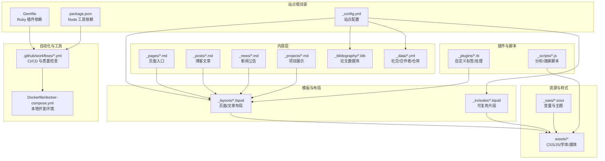
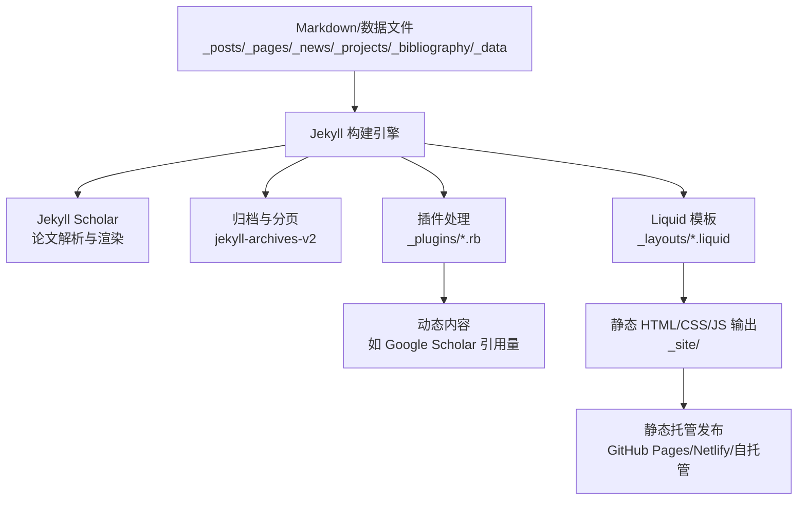
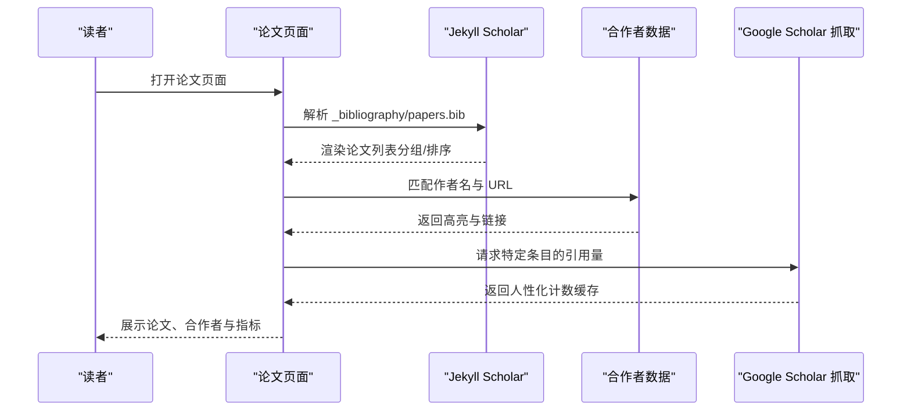
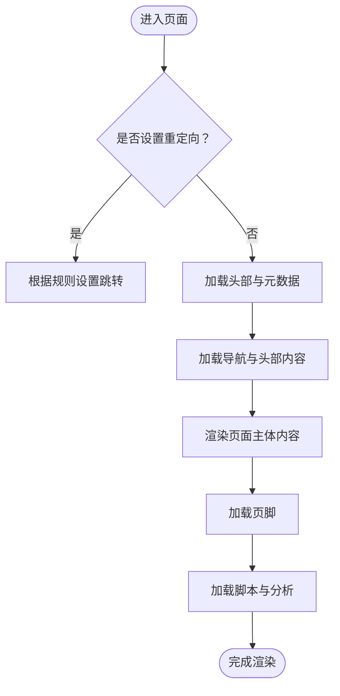
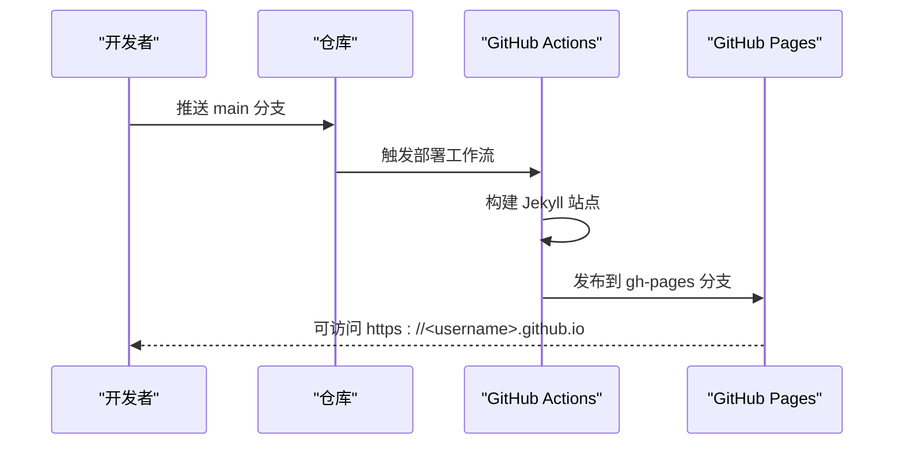
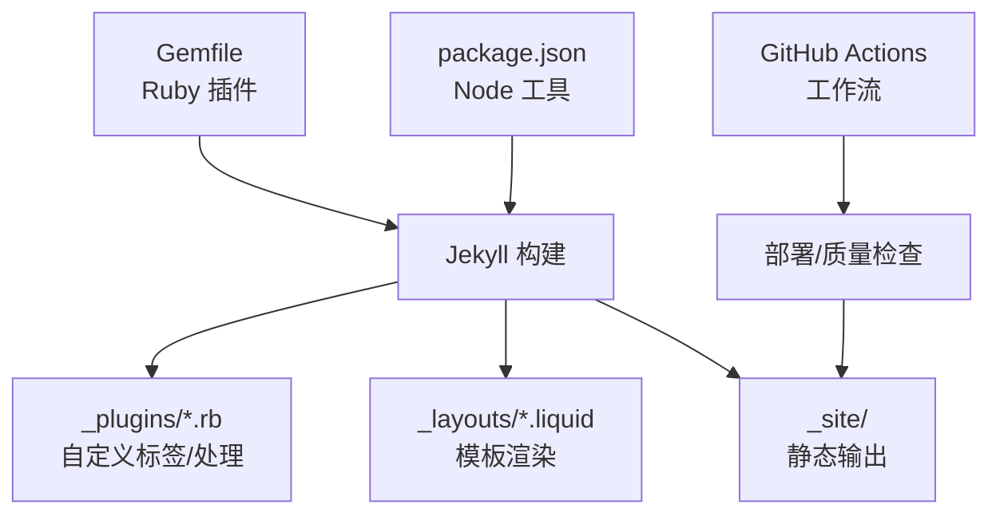

# 项目介绍

<cite>
**本文引用的文件**
- [README.md](file://README.md)
- [_config.yml](file://_config.yml)
- [Gemfile](file://Gemfile)
- [package.json](file://package.json)
- [INSTALL.md](file://INSTALL.md)
- [CONTRIBUTING.md](file://CONTRIBUTING.md)
- [CUSTOMIZE.md](file://CUSTOMIZE.md)
- [FAQ.md](file://FAQ.md)
- [_layouts/default.liquid](file://_layouts/default.liquid)
- [_layouts/page.liquid](file://_layouts/page.liquid)
- [_layouts/post.liquid](file://_layouts/post.liquid)
- [_pages/about.md](file://_pages/about.md)
- [_data/socials.yml](file://_data/socials.yml)
- [_data/coauthors.yml](file://_data/coauthors.yml)
- [_plugins/google-scholar-citations.rb](file://_plugins/google-scholar-citations.rb)
</cite>

## 目录
1. [简介](#简介)
2. [项目结构](#项目结构)
3. [核心组件](#核心组件)
4. [架构总览](#架构总览)
5. [详细组件分析](#详细组件分析)
6. [依赖关系分析](#依赖关系分析)
7. [性能考量](#性能考量)
8. [故障排查指南](#故障排查指南)
9. [结论](#结论)
10. [附录](#附录)

## 简介
al-folio 是一个面向学术界的简洁、响应式 Jekyll 主题，专为个人主页、实验室页面、课程页面、会议页面等场景设计。它通过静态站点生成器 Jekyll 将内容（如 Markdown、BibTeX、JSON/YAML 数据）转换为高性能、可访问、可 SEO 的静态网页，并提供丰富的学术功能：论文自动聚合、项目与新闻展示、博客与归档、评论系统、主题色切换、数学公式与代码高亮、多媒体嵌入、仓库与统计展示等。

al-folio 的核心价值在于：
- 面向学术界需求：内置论文页、合作者链接、Google Scholar/Dimensions/Altmetric 等学术指标集成。
- 开源与社区驱动：活跃的贡献者与维护团队，持续迭代与改进。
- 易用与可定制：提供一键部署、Docker 开发容器、完善的配置项与自定义指南。
- 全球影响力：用户社区覆盖全球众多研究者与机构，广泛用于个人主页、实验室与课程网站。

本项目以 Jekyll 为核心技术栈，结合 Ruby 插件生态与前端现代化工具链，形成一套开箱即用且高度可扩展的学术网站解决方案。

章节来源
- [README.md:1-487](file://README.md#L1-L487)

## 项目结构
该站点采用 Jekyll 标准目录组织方式，结合 al-folio 的约定，主要目录与职责如下：
- 根配置与构建：_config.yml、Gemfile、package.json
- 页面与布局：_pages、_layouts、_includes
- 内容集合：_posts（博客）、_news（新闻）、_projects（项目）、_books（书架）
- 学术数据：_bibliography（论文）、_data（社会链接、合作者、仓库信息等）
- 资源与样式：assets（CSS/JS/字体/图片/视频/音频）、_sass（SCSS 变量与主题）
- 插件与脚本：_plugins（自定义 Liquid 标签与处理逻辑）、_scripts（分析与搜索脚本）
- 工具与工作流：.github/workflows（自动化部署与质量检查）、Dockerfile/docker-compose（本地开发）

图表来源
- [_config.yml:1-646](file://_config.yml#L1-L646)
- [Gemfile:1-39](file://Gemfile#L1-L39)
- [package.json:1-10](file://package.json#L1-L10)

章节来源
- [CUSTOMIZE.md:8-40](file://CUSTOMIZE.md#L8-L40)
- [_config.yml:144-196](file://_config.yml#L144-L196)

## 核心组件
- 配置系统（_config.yml）
  - 站点元信息、语言与图标、URL 基础路径、页脚信息与关键词。
  - 主题与布局设置（导航栏固定、页脚固定、搜索开关、最大宽度等）。
  - 开放图谱与 Schema.org 支持、分析与验证（Google Analytics、Site Verification 等）。
  - 博客与分页、相关文章、评论系统（Giscus/Disqus）、外部源（RSS/链接）。
  - 集合与归档（news、projects、books）、Jekyll Scholar 论文配置、第三方库版本与完整性校验。
  - 图像优化（ImageMagick 响应式 WebP）、懒加载、可选功能开关（数学、暗色模式、中图缩放、进度条等）。

- 页面与布局（_layouts）
  - default.liquid：统一头部、导航、内容区、页脚与脚本注入；支持侧边目录（toc）。
  - page.liquid：页面标题与描述、可选样式块、参考文献、评论区（giscus）。
  - post.liquid：文章元信息（日期/作者/更新时间/标签/分类）、目录、正文、引用、相关文章、评论区（giscus/disqus）。

- 内容集合与数据（_pages、_posts、_news、_projects、_data）
  - about.md：个人简介、头像、社交链接、新闻与最新文章区块。
  - socials.yml：邮箱、GitHub、DBLP、ORCID、Google Scholar、微信二维码等。
  - coauthors.yml：与论文作者匹配的合作者信息，用于高亮与链接。

- 学术功能（_plugins、_bibliography）
  - google-scholar-citations.rb：动态抓取 Google Scholar 引用量并缓存，支持人性化数字格式。
  - Jekyll Scholar：从 BibTeX 自动渲染论文列表，支持分组、排序、徽章（Altmetric/Dimensions/Google Scholar/INSPIRE-HEP）。

- 主题与样式（_sass、assets）
  - 主题色变量与图标、基础排版、Distill 风格、CV 页面样式、响应式网格与布局。
  - 第三方库（MathJax、Mermaid、Chart.js、Highlight.js、Bootstrap、Leaflet 等）通过 CDN 或本地托管管理。

章节来源
- [_config.yml:5-21](file://_config.yml#L5-L21)
- [_config.yml:48-71](file://_config.yml#L48-L71)
- [_config.yml:88-134](file://_config.yml#L88-L134)
- [_config.yml:144-156](file://_config.yml#L144-L156)
- [_config.yml:264-334](file://_config.yml#L264-L334)
- [_config.yml:377-395](file://_config.yml#L377-L395)
- [_layouts/default.liquid:1-57](file://_layouts/default.liquid#L1-L57)
- [_layouts/page.liquid:1-32](file://_layouts/page.liquid#L1-L32)
- [_layouts/post.liquid:1-97](file://_layouts/post.liquid#L1-L97)
- [_pages/about.md:1-37](file://_pages/about.md#L1-L37)
- [_data/socials.yml:1-53](file://_data/socials.yml#L1-L53)
- [_data/coauthors.yml:1-35](file://_data/coauthors.yml#L1-L35)
- [_plugins/google-scholar-citations.rb:1-86](file://_plugins/google-scholar-citations.rb#L1-L86)

## 架构总览
下图展示了从内容到最终页面的生成与渲染流程，涵盖 Jekyll 构建、插件处理、模板渲染与静态资源输出。

图表来源
- [_config.yml:200-220](file://_config.yml#L200-L220)
- [_plugins/google-scholar-citations.rb:1-86](file://_plugins/google-scholar-citations.rb#L1-L86)
- [Gemfile:6-26](file://Gemfile#L6-L26)

章节来源
- [_config.yml:200-220](file://_config.yml#L200-L220)
- [Gemfile:6-26](file://Gemfile#L6-L26)

## 详细组件分析

### 组件一：论文与合著者系统
- 数据来源：_bibliography/papers.bib（BibTeX），_data/coauthors.yml（合作者映射）。
- 渲染机制：Jekyll Scholar 解析 BibTeX，按配置分组与排序；合作者名称匹配后高亮并链接至指定 URL。
- 动态指标：google-scholar-citations.rb 抓取 Google Scholar 引用量，缓存结果并人性化显示（千/百万单位）。
- 徽章支持：Altmetric、Dimensions、Google Scholar、INSPIRE-HEP 等徽章开关与样式。

图表来源
- [_config.yml:264-334](file://_config.yml#L264-L334)
- [_data/coauthors.yml:1-35](file://_data/coauthors.yml#L1-L35)
- [_plugins/google-scholar-citations.rb:1-86](file://_plugins/google-scholar-citations.rb#L1-L86)

章节来源
- [_config.yml:264-334](file://_config.yml#L264-L334)
- [_plugins/google-scholar-citations.rb:1-86](file://_plugins/google-scholar-citations.rb#L1-L86)

### 组件二：页面与布局渲染
- default.liquid：统一头部、导航、内容容器、页脚与脚本；支持侧边目录（toc）。
- page.liquid：页面标题与描述、可选样式块、参考文献、评论区（giscus）。
- post.liquid：文章元信息（日期/作者/更新时间/标签/分类）、目录、正文、引用、相关文章、评论区（giscus/disqus）。

图表来源
- [_layouts/default.liquid:1-57](file://_layouts/default.liquid#L1-L57)
- [_layouts/page.liquid:1-32](file://_layouts/page.liquid#L1-L32)
- [_layouts/post.liquid:1-97](file://_layouts/post.liquid#L1-L97)

章节来源
- [_layouts/default.liquid:1-57](file://_layouts/default.liquid#L1-L57)
- [_layouts/page.liquid:1-32](file://_layouts/page.liquid#L1-L32)
- [_layouts/post.liquid:1-97](file://_layouts/post.liquid#L1-L97)

### 组件三：个人主页与社交信息
- about.md：首页布局、头像、简介、社交图标、新闻与最新文章区块。
- socials.yml：邮箱、GitHub、DBLP、ORCID、Google Scholar、微信二维码等社交与学术平台链接。
- 个性化：可通过配置项控制社交图标在导航栏显示、是否参与搜索结果等。

图表来源
- [_pages/about.md:1-37](file://_pages/about.md#L1-L37)
- [_data/socials.yml:1-53](file://_data/socials.yml#L1-L53)

章节来源
- [_pages/about.md:1-37](file://_pages/about.md#L1-L37)
- [_data/socials.yml:1-53](file://_data/socials.yml#L1-L53)

### 组件四：部署与自动化
- 推荐方式：使用 GitHub Actions 自动部署至 gh-pages 分支；个人/组织页面仓库名需满足 GitHub Pages 规范。
- Docker 本地开发：提供 docker-compose 配置与 slim 版本镜像，便于跨平台快速启动。
- 手动部署：运行 jekyll build 后复制 _site 到托管服务器；可选 PurgeCSS 清理未使用 CSS。
- 升级与迁移：通过上游 rebase 或全新安装后手动迁移内容。

图表来源
- [INSTALL.md:23-32](file://INSTALL.md#L23-L32)
- [INSTALL.md:129-157](file://INSTALL.md#L129-L157)

章节来源
- [INSTALL.md:23-32](file://INSTALL.md#L23-L32)
- [INSTALL.md:129-157](file://INSTALL.md#L129-L157)

## 依赖关系分析
- Ruby 插件生态：Gemfile 定义核心插件（如 jekyll-scholar、jekyll-archives-v2、jekyll-feed、jekyll-minifier、jekyll-terser 等），确保构建稳定性与功能完备性。
- Node 工具链：package.json 提供 Prettier 与 jekyll 包，配合 GitHub Actions 进行代码格式化与站点构建。
- 第三方库版本与完整性：_config.yml 中集中声明常用库版本与 SRI 校验值，保障安全与一致性。
- 工作流与质量检查：包含部署、链接检查（lychee）、可访问性测试（axe）、Prettier 格式化等自动化任务。

图表来源
- [Gemfile:1-39](file://Gemfile#L1-L39)
- [package.json:1-10](file://package.json#L1-L10)
- [_config.yml:400-624](file://_config.yml#L400-L624)

章节来源
- [Gemfile:1-39](file://Gemfile#L1-L39)
- [package.json:1-10](file://package.json#L1-L10)
- [_config.yml:400-624](file://_config.yml#L400-L624)

## 性能考量
- 静态生成：Jekyll 在构建时一次性生成静态页面，避免运行时计算开销，提升加载速度与安全性。
- 资源优化：启用 ImageMagick 响应式 WebP 图像、懒加载、压缩与最小化（jekyll-minifier、terser），减少带宽与首屏时间。
- 缓存策略：浏览器端缓存与 CDN 加速（托管于 GitHub Pages/Netlify）可进一步提升性能。
- 可访问性与 SEO：Open Graph/Social Meta、Schema.org、Feed、结构化数据与语义化标记有助于提升可发现性与可访问性。

## 故障排查指南
常见问题与解决思路：
- 部署失败或样式缺失：确认 _config.yml 中 url/baseurl 设置正确；清理浏览器缓存或使用隐私模式刷新页面。
- 未知标签 'toc'：确保部署分支为 gh-pages；遵循部署说明进行分支配置。
- 相关文章不生效：检查 classifier-reborn 插件与文章内容长度；必要时禁用 LSI 或在文章 Front Matter 中关闭相关文章。
- Prettier 格式化失败：在本地安装并运行 Prettier，或使用开发容器/IDE 插件自动格式化。
- 旧版本依赖弃用：升级到最新版本，合并差异或重新安装后迁移内容。
- 自定义域名空白：在 main/source 分支添加 CNAME 文件，写入自定义域名。
- Lighthouse Badger 缺少 token：在仓库 Secrets 中添加 LIGHTHOUSE_BADGER_TOKEN 并赋予相应权限。

章节来源
- [FAQ.md:25-98](file://FAQ.md#L25-L98)
- [FAQ.md:112-138](file://FAQ.md#L112-L138)

## 结论
al-folio 以 Jekyll 为核心，结合学术界对论文、项目、新闻与教学内容的特殊需求，提供了开箱即用且高度可定制的静态网站解决方案。其开源与社区驱动的模式保证了持续演进与全球用户的广泛采纳。通过合理的配置、插件与自动化工作流，用户可以快速搭建专业、美观、高性能的学术主页与页面，并在 GitHub Pages 等平台上稳定发布。

## 附录
- 快速开始：参考 INSTALL.md 的推荐流程，创建仓库、配置 Actions 权限、设置 url/baseurl、等待自动部署完成。
- 社区与影响力：README.md 展示了大量用户页面与课程/会议页面链接，体现广泛的学术应用。
- 贡献指南：CONTRIBUTING.md 规范了 PR 流程与代码格式化要求，鼓励社区协作。

章节来源
- [INSTALL.md:23-32](file://INSTALL.md#L23-L32)
- [README.md:25-208](file://README.md#L25-L208)
- [CONTRIBUTING.md:1-29](file://CONTRIBUTING.md#L1-L29)