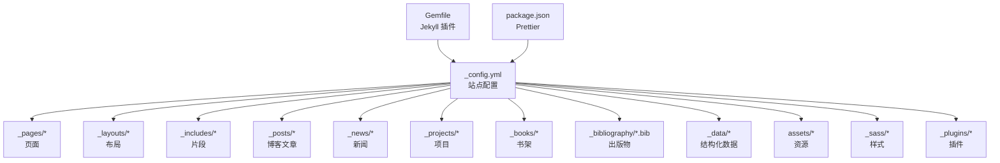
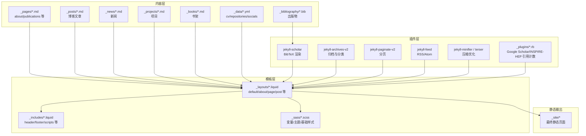
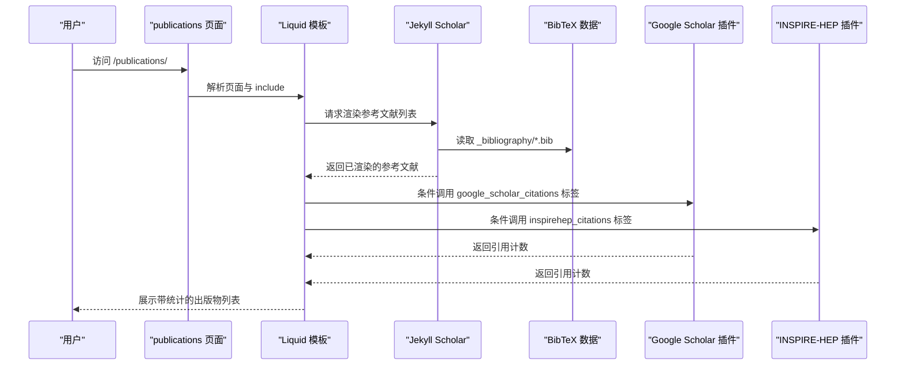
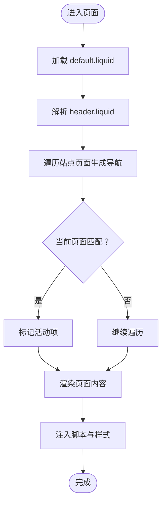
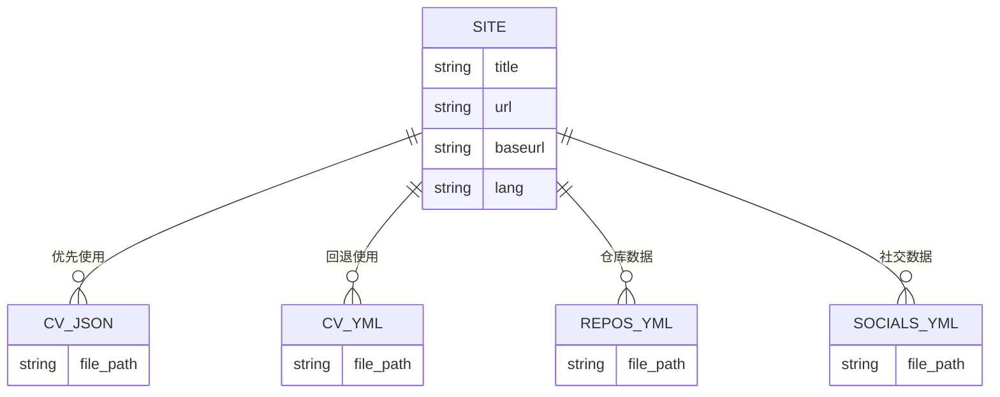
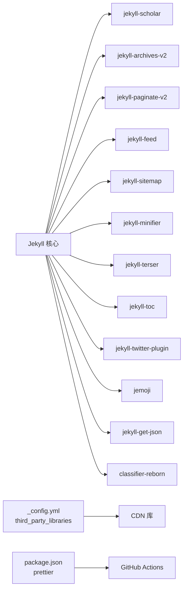

# 项目概述

<cite>
**本文引用的文件**
- [README.md](file://README.md)
- [_config.yml](file://_config.yml)
- [Gemfile](file://Gemfile)
- [package.json](file://package.json)
- [INSTALL.md](file://INSTALL.md)
- [CUSTOMIZE.md](file://CUSTOMIZE.md)
- [FAQ.md](file://FAQ.md)
- [CONTRIBUTING.md](file://CONTRIBUTING.md)
- [_plugins/google-scholar-citations.rb](file://_plugins/google-scholar-citations.rb)
- [_plugins/inspirehep-citations.rb](file://_plugins/inspirehep-citations.rb)
- [_pages/about.md](file://_pages/about.md)
- [_pages/publications.md](file://_pages/publications.md)
- [_layouts/default.liquid](file://_layouts/default.liquid)
- [_includes/header.liquid](file://_includes/header.liquid)
- [_sass/_base.scss](file://_sass/_base.scss)
</cite>

## 目录
1. [简介](#简介)
2. [项目结构](#项目结构)
3. [核心组件](#核心组件)
4. [架构总览](#架构总览)
5. [详细组件分析](#详细组件分析)
6. [依赖关系分析](#依赖关系分析)
7. [性能考量](#性能考量)
8. [故障排查指南](#故障排查指南)
9. [结论](#结论)
10. [附录](#附录)

## 简介
本项目是基于 Jekyll 的个人学术主页主题 al-folio 的中文站点实现，面向研究人员与高校教师，提供简洁、响应式且具备专业学术展示能力的静态网站解决方案。al-folio 通过 Jekyll 的静态生成能力，结合丰富的插件生态与现代化前端工具链，帮助用户高效构建个人主页、学术出版物库、博客、项目展示与简历（CV）等模块，并支持一键部署到 GitHub Pages。

al-folio 的核心价值在于：
- 静态化与安全：无服务器端逻辑，降低攻击面与运维成本
- 学术友好：内置学术出版物管理、引用统计、相关文章推荐、社交预览等特性
- 开发友好：完善的本地开发容器与自动化部署流程，便于快速上手与持续集成
- 可定制性强：主题色、布局、集合（Collections）、数据源（YAML/JSON）均可灵活配置

## 项目结构
该站点采用标准 Jekyll 结构，结合 al-folio 的约定式目录组织，主要目录与职责如下：
- 根配置与环境
  - _config.yml：站点全局配置，含主题、布局、分析、集合、Jekyll Scholar、第三方库版本等
  - Gemfile：Jekyll 插件依赖清单
  - package.json：前端格式化工具依赖（Prettier）
- 页面与布局
  - _pages：顶层页面（如 about、publications、projects 等）
  - _layouts：页面与文章布局模板（default、about、page、post 等）
  - _includes：可复用片段（header、footer、scripts、social、bib_search 等）
- 内容集合
  - _posts：博客文章（Jekyll 默认集合）
  - _news、_projects、_books：自定义集合，分别用于新闻、项目与书架
  - _bibliography：学术出版物 BibTeX 数据
  - _data：结构化数据（cv、repositories、socials、venues 等）
- 资源与样式
  - assets：图片、字体、CSS、JS、JSON 等资源
  - _sass：SCSS 源文件（变量、主题、基础样式等）
- 插件与脚本
  - _plugins：自定义 Liquid 标签与外部服务集成（如 Google Scholar、INSPIRE-HEP 引用计数）
  - _scripts：搜索、分析等前端脚本
- 工具与文档
  - INSTALL.md、CUSTOMIZE.md、FAQ.md、CONTRIBUTING.md：安装、定制、常见问题与贡献指南

图表来源
- [_config.yml:1-646](file://_config.yml#L1-L646)
- [Gemfile:1-39](file://Gemfile#L1-L39)
- [package.json:1-7](file://package.json#L1-L7)

章节来源
- [_config.yml:1-646](file://_config.yml#L1-L646)
- [Gemfile:1-39](file://Gemfile#L1-L39)
- [package.json:1-7](file://package.json#L1-L7)

## 核心组件
- 配置中心（_config.yml）
  - 站点元信息、语言、图标、页脚文本、SEO 与分析开关
  - 布局与导航、搜索、分页、相关文章、评论系统（Giscus/Disqus）
  - 集合定义（news、projects、books）与归档规则
  - Jekyll Scholar 设置（作者名、样式、过滤字段、分组排序、缩略图）
  - 第三方库版本与完整性校验（CDN 版本号与 SRI）
  - 可选功能开关（暗色模式、懒加载、masonry、数学公式、视频嵌入等）
- 页面与布局
  - about 页面：个人简介、头像、新闻、最新文章、社交链接
  - publications 页面：基于 BibTeX 自动生成的出版物列表，支持搜索与筛选
  - default 布局：统一的头部、侧边栏目录、内容区与脚本注入
- 内容集合
  - news：首页自动展示的新闻条目
  - projects：项目网格展示，支持分类与 Masonry 自动排列
  - books：书架页面，支持子菜单
- 数据与插件
  - _data：cv.yml、repositories.yml、socials.yml 等结构化数据
  - _plugins：Google Scholar 与 INSPIRE-HEP 引用计数标签，动态抓取并缓存
- 样式与主题
  - SCSS 变量与主题色，支持浅色/深色切换
  - 基础排版、卡片、导航、页脚、博客、项目、出版物等模块化样式

章节来源
- [_config.yml:1-646](file://_config.yml#L1-L646)
- [_pages/about.md:1-37](file://_pages/about.md#L1-L37)
- [_pages/publications.md:1-21](file://_pages/publications.md#L1-L21)
- [_layouts/default.liquid:1-57](file://_layouts/default.liquid#L1-L57)
- [_includes/header.liquid:1-151](file://_includes/header.liquid#L1-L151)
- [_sass/_base.scss:1-800](file://_sass/_base.scss#L1-L800)

## 架构总览
al-folio 的运行时架构由“内容层（Markdown/YAML/BibTeX）—模板层（Liquid/SCSS）—插件层（Jekyll Scholar/自定义标签）—静态输出（_site）”构成。构建流程通过 Jekyll 将内容与数据渲染为静态 HTML/CSS/JS，再由 GitHub Pages 或其他托管平台发布。

图表来源
- [_config.yml:147-219](file://_config.yml#L147-L219)
- [_layouts/default.liquid:1-57](file://_layouts/default.liquid#L1-L57)
- [_includes/header.liquid:1-151](file://_includes/header.liquid#L1-L151)
- [_sass/_base.scss:1-800](file://_sass/_base.scss#L1-L800)
- [Gemfile:6-26](file://Gemfile#L6-L26)

章节来源
- [_config.yml:147-219](file://_config.yml#L147-L219)
- [Gemfile:6-26](file://Gemfile#L6-L26)

## 详细组件分析

### 发布物管理（Publications）
- 数据来源：_bibliography/papers.bib
- 渲染引擎：Jekyll Scholar，支持 APA 等样式、按年/组排序、缩略图、过滤关键词
- 展示页面：_pages/publications.md 使用 include 引入搜索片段与  标签
- 引用统计：可通过自定义 Liquid 标签从 Google Scholar/INSPIRE-HEP 动态抓取引用次数并缓存

图表来源
- [_pages/publications.md:1-21](file://_pages/publications.md#L1-L21)
- [_plugins/google-scholar-citations.rb:1-86](file://_plugins/google-scholar-citations.rb#L1-L86)
- [_plugins/inspirehep-citations.rb:1-58](file://_plugins/inspirehep-citations.rb#L1-L58)
- [_config.yml:264-332](file://_config.yml#L264-L332)

章节来源
- [_pages/publications.md:1-21](file://_pages/publications.md#L1-L21)
- [_plugins/google-scholar-citations.rb:1-86](file://_plugins/google-scholar-citations.rb#L1-L86)
- [_plugins/inspirehep-citations.rb:1-58](file://_plugins/inspirehep-citations.rb#L1-L58)
- [_config.yml:264-332](file://_config.yml#L264-L332)

### 导航与布局（Header/Layout）
- 导航栏：根据站点页面与排序规则生成，支持下拉菜单、搜索按钮、明暗主题切换
- 布局：default.liquid 提供统一容器、侧边目录（可选）、内容区与脚本注入
- 头部片段：header.liquid 组织导航、社交图标、进度条与搜索入口

图表来源
- [_layouts/default.liquid:1-57](file://_layouts/default.liquid#L1-L57)
- [_includes/header.liquid:1-151](file://_includes/header.liquid#L1-L151)

章节来源
- [_layouts/default.liquid:1-57](file://_layouts/default.liquid#L1-L57)
- [_includes/header.liquid:1-151](file://_includes/header.liquid#L1-L151)

### 关键数据模型（CV/Repositories/Socials）
- CV：优先读取 assets/json/resume.json（JSON Resume 标准），回退至 _data/cv.yml
- 仓库与统计：_data/repositories.yml 定义用户与仓库列表，结合第三方统计组件展示
- 社交媒体：_data/socials.yml 定义社交链接，可在页脚或导航中显示

图表来源
- [_config.yml:629-646](file://_config.yml#L629-L646)
- [CUSTOMIZE.md:50-58](file://CUSTOMIZE.md#L50-L58)

章节来源
- [_config.yml:629-646](file://_config.yml#L629-L646)
- [CUSTOMIZE.md:50-58](file://CUSTOMIZE.md#L50-L58)

### 快速开始指南
- 推荐路径：使用模板创建仓库 → 启用 GitHub Actions 权限 → 在 _config.yml 中设置 url/baseurl → 等待 gh-pages 分支构建 → 在 Pages 设置中选择 gh-pages 作为发布分支
- 本地开发：Docker Compose（推荐）或开发容器；也可使用传统 Ruby + Bundler 方式
- 部署：GitHub Pages 自动化部署；亦可手动构建后上传至任意静态托管

章节来源
- [INSTALL.md:23-39](file://INSTALL.md#L23-L39)
- [INSTALL.md:45-63](file://INSTALL.md#L45-L63)
- [INSTALL.md:129-156](file://INSTALL.md#L129-L156)

## 依赖关系分析
- Ruby 生态（Jekyll 插件）
  - 核心插件：jekyll-scholar、jekyll-archives-v2、jekyll-paginate-v2、jekyll-feed、jekyll-sitemap、jekyll-minifier、jekyll-terser、jekyll-toc、jekyll-twitter-plugin、jemoji 等
  - 外部数据：jekyll-get-json、classifier-reborn（用于相关文章）
- 前端生态（CDN 与本地资源）
  - 第三方库版本集中于 _config.yml 的 third_party_libraries 字段，包含 Bootstrap、Chart.js、Mermaid、MathJax、Highlight.js、Leaflet、Plotly、Vega 等
  - Prettier 用于代码格式化，配合 GitHub Actions 进行质量检查

图表来源
- [Gemfile:6-26](file://Gemfile#L6-L26)
- [_config.yml:403-624](file://_config.yml#L403-L624)
- [package.json:1-7](file://package.json#L1-L7)

章节来源
- [Gemfile:6-26](file://Gemfile#L6-L26)
- [_config.yml:403-624](file://_config.yml#L403-L624)
- [package.json:1-7](file://package.json#L1-L7)

## 性能考量
- 静态生成：构建期完成所有内容拼装，运行时仅传输静态资源，访问速度快、稳定性高
- 资源优化：启用 jekyll-minifier 与 terser 压缩 JS/CSS；可选 jekyll-terser 替代压缩策略
- 图片优化：开启响应式 WebP 图像与懒加载，减少首屏加载时间
- 第三方库：通过 CDN 加载并配置 SRI 校验，确保安全性与缓存命中率
- Lighthouse 指标：项目自带桌面/移动端 PageSpeed 报告，便于持续优化

章节来源
- [_config.yml:234-245](file://_config.yml#L234-L245)
- [_config.yml:349-374](file://_config.yml#L349-L374)
- [_config.yml:403-624](file://_config.yml#L403-L624)
- [README.md:210-222](file://README.md#L210-L222)

## 故障排查指南
- 部署失败或样式异常
  - 确认 url/baseurl 正确；个人/组织页需留空 baseurl；项目页需设置为 /<repo>/
  - 清除浏览器缓存或使用隐私模式重新加载
- 相关文章不显示
  - 检查 classifier-reborn 插件与 LSI 配置；避免纯停用词内容导致向量归一化错误
- Prettier 格式化失败
  - 在本地安装 Prettier 并执行格式化；或在开发容器中使用已集成的工具
- GitHub 登录认证问题
  - 将远程地址从 https 改为 ssh，避免密码认证被禁用
- Lighthouse Badger 缺少 token
  - 在仓库 Secrets 中添加 LIGHTHOUSE_BADGER_TOKEN 并赋予必要权限

章节来源
- [FAQ.md:25-28](file://FAQ.md#L25-L28)
- [FAQ.md:37-48](file://FAQ.md#L37-L48)
- [FAQ.md:53-55](file://FAQ.md#L53-L55)
- [FAQ.md:65-73](file://FAQ.md#L65-L73)
- [FAQ.md:57-59](file://FAQ.md#L57-L59)
- [FAQ.md:61-63](file://FAQ.md#L61-L63)

## 结论
al-folio 以 Jekyll 为核心，结合丰富的学术功能与现代化工具链，为研究人员提供了开箱即用、易于定制、稳定可靠的个人主页解决方案。通过合理的项目结构、清晰的配置体系与完善的自动化流程，用户可以专注于内容创作与知识传播，而无需担忧技术细节。建议在定制过程中遵循“最小变更原则”，以便于后续升级与维护。

## 附录
- 社区使用案例：README 中展示了来自全球多所高校与实验室的用户页面，体现广泛的适用性
- 升级与迁移：提供官方升级步骤与工具，建议定期同步上游版本以获得新功能与安全修复
- 贡献指南：欢迎通过 Issue/PR 参与改进，提交前请确保遵循 Prettier 规范

章节来源
- [README.md:25-208](file://README.md#L25-L208)
- [INSTALL.md:236-251](file://INSTALL.md#L236-L251)
- [CONTRIBUTING.md:1-29](file://CONTRIBUTING.md#L1-L29)